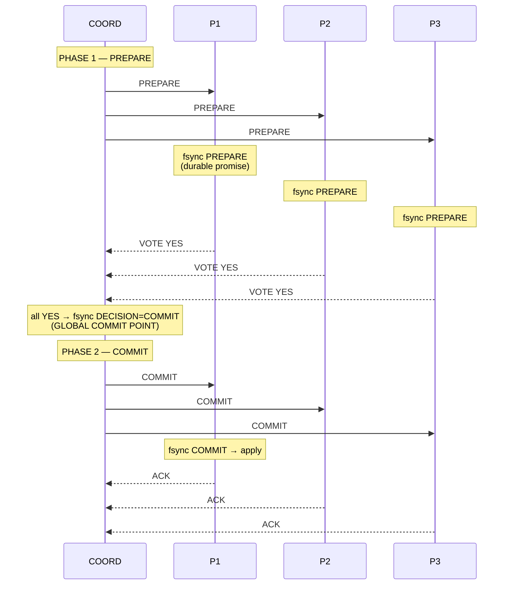
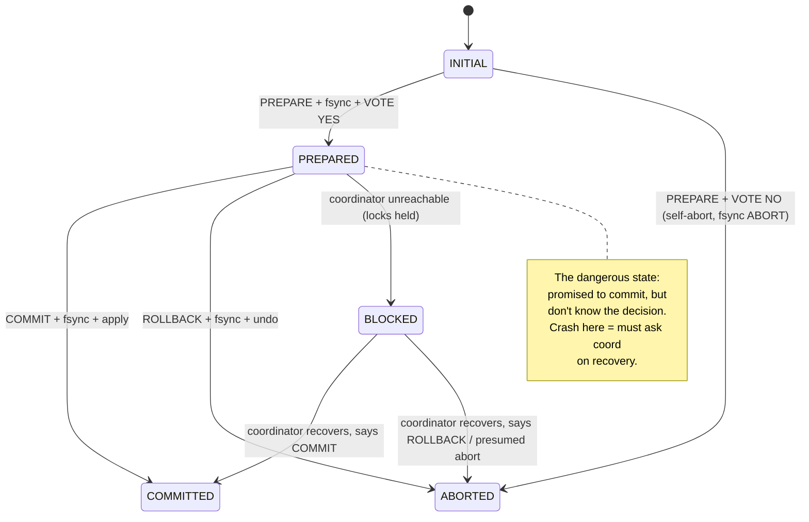
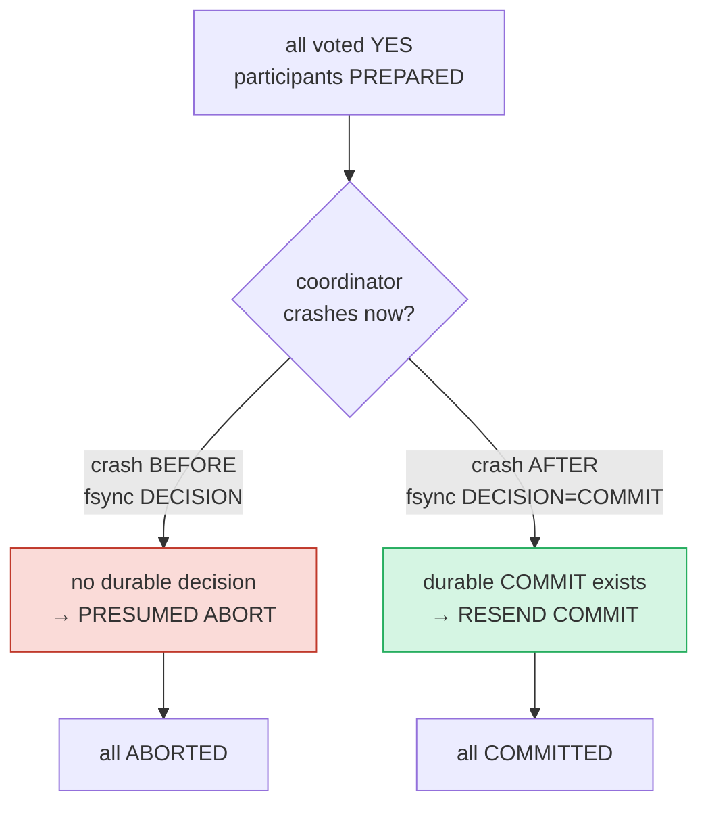

# Two-Phase Commit (2PC) — A Visual, Worked-Example Guide

> **Companion code:** [`two_phase_commit.py`](./two_phase_commit.py). **Every
> message-diagram row, WAL snapshot, final state, and latency number in this
> guide is printed by `python3 two_phase_commit.py`** — change the code, re-run,
> re-paste. Nothing here is hand-computed.
>
> **Live animation:** [`two_phase_commit.html`](./two_phase_commit.html) — open
> in a browser; it re-runs the *same* coordinator + participant state machine in
> JS, lets you crash nodes and fire each phase, and gold-checks against the `.py`.
>
> **Source material:** Gray, *Notes on Data Base Operating Systems*, Springer
> LNCS 60, 1978 (the seminal 2PC description); Lampson & Sturgis, *Crash
> Recovery in a Distributed Data Storage System*, Xerox PARC 1976 (the
> stable-storage / commit-abort foundations); Skeen, *Nonblocking Commit
> Protocols*, ACM SIGMOD 1981 (proves classic 2PC is **blocking**, and why 3PC
> still fails under partition); Bernstein, Hadzilacos & Goodman, *Concurrency
> Control and Recovery in Database Systems*, 1987, Ch. 7 (the state diagram and
> recovery rules used here); Silberschatz et al., *Database System Concepts*,
> 7th ed., Ch. 19; X/Open **XA Specification** (1991) — the industry API
> (`xa_prepare`/`xa_commit`/`xa_rollback`) that wraps 2PC.

---

## 0. TL;DR — the notarized group contract

A **distributed transaction** updates data on **several nodes** (separate
databases, shards, or microservice back-ends). We want **atomicity**: either
**ALL** nodes apply the change, or **NONE** does. "Two committed, one rolled
back" leaves the system inconsistent and is **never acceptable**.

**Two-Phase Commit (2PC)** achieves atomicity with a single **coordinator** that
runs a strict two-step handshake with every **participant** (resource manager):

- **Phase 1 — PREPARE (the vote):** the coordinator asks each participant *"can
  you commit?"*. A participant that can durably lock in its part appends a
  **PREPARE** record to its WAL, **`fsync`s** it, and answers **YES**. One that
  cannot answers **NO**.
- **Phase 2 — COMMIT or ROLLBACK (the decision):** if **every** vote was YES,
  the coordinator writes a **COMMIT** decision to its own WAL — this is the
  **global commit point** — and tells everyone **COMMIT**. If **any** vote was
  NO (or timed out), it decides **ROLLBACK** and tells everyone to abort.

> *Think of a notarized contract signed by three parties. Phase 1 is the notary
> asking each one "do you sign provisionally?" Signing means you've ALREADY set
> the money aside and recorded the promise durably, so you can't later pretend
> you never agreed. Phase 2 is the notary stamping the contract binding
> (**COMMIT**) or tearing it up (**ROLLBACK**). Once you've signed in phase 1 you
> are BOUND to honour whatever the notary decides in phase 2 — you may NOT change
> your mind.*



### The catch (why 2PC is infamous)

The moment a participant has answered **YES**, it has **promised to commit** but
does **not yet know** the global decision. If the **coordinator crashes at
exactly that moment**, every prepared participant is **BLOCKED**: it cannot
commit (maybe the decision was abort) and cannot abort (maybe it was commit).
It must hold its locks and **WAIT** for the coordinator to recover. This
"coordinator crash → everyone frozen" failure is the central weakness of classic
2PC, and the reason it is **blocking** (§5, §F).

### Why it matters

2PC is the **only** widely-deployed protocol that gives you **strong ACID
atomicity across independent resource managers**. It is what **XA/JTA**
(Postgres + a message queue; two databases in one transaction), distributed
databases, and sharded stores use when they must make a multi-node transaction
indivisible. The price is the blocking failure mode and the latency of the
serialized fsyncs (§F). When you can't pay that price — long-running workflows,
microservices, geo-distribution — you drop to **Sagas** and **eventual
consistency** and accept that a "transaction" may need compensating actions
(§F). 2PC is the **strong-but-fragile** end of the spectrum; 🔗 contrast with
single-node [`WAL_CHECKPOINT.md`](./WAL_CHECKPOINT.md) (local atomicity is just
"fsync before ack") and concurrency-control [`MVCC.md`](./MVCC.md).

### Glossary

| Term | Plain meaning |
|---|---|
| **coordinator** | the single node that drives the protocol and decides commit vs abort. Has its own WAL for the decision record. |
| **participant (RM)** | a resource manager holding part of the txn's work. Votes YES/NO in phase 1, commits/aborts in phase 2. |
| **PREPARE** | phase-1 message, coordinator → participant. Also the WAL record a participant fsyncs *before* answering YES. |
| **vote (YES/NO)** | the participant's phase-1 answer. **YES is a durable promise to commit** if told to. |
| **decision** | COMMIT or ABORT. The coordinator writes it to its WAL at the global commit point, then broadcasts. |
| **global commit point** | the instant the coordinator durably records COMMIT. From here the txn IS committed (will eventually apply everywhere). |
| **ACK** | participant → coordinator: "I applied the decision." |
| **WAL** | write-ahead log. Records are appended then fsync'd before the action they guard becomes binding. Survives crashes. 🔗 [`WAL_CHECKPOINT.md`](./WAL_CHECKPOINT.md) |
| **blocking** | a prepared participant that can't reach the coordinator. Holds locks, can't decide, must wait. Classic 2PC is blocking. |
| **presumed abort** | recovery optimization: if the coordinator finds no durable decision in its WAL, ABORT is always safe. |
| **recovery transaction** | on restart, a participant that is PREPARED but has no final decision asks the coordinator "commit or abort?" and applies that. |

---

## 1. The participant state machine

Every participant walks this exact diagram. The **arrows that matter for
durability** are the ones that *write a WAL record* before changing state.



| State | Meaning | WAL records present |
|---|---|---|
| `INITIAL` | hasn't voted yet | (none) |
| `PREPARED` | voted YES; PREPARE is durable; **awaiting decision** | PREPARE |
| `COMMITTED` | applied COMMIT | PREPARE, COMMIT |
| `ABORTED` | applied ABORT/ROLLBACK (or voted NO) | PREPARE?, ABORT |
| `BLOCKED` | prepared but coordinator down — **logical**, waiting | PREPARE |
| `DOWN` | process crashed; in-memory state lost, WAL survives | (whatever was fsync'd) |

### The five rules (all asserted in the code)

1. **Durability-before-vote** — a participant MUST append `PREPARE` and `fsync`
   *before* replying YES, else a crash after voting loses the promise (§E).
2. **All-yes ⇒ commit** — coordinator decides COMMIT iff **every** vote is YES.
3. **Any-no ⇒ abort** — a single NO (or timeout) forces a global ABORT (§B).
4. **Decision durability** — the coordinator fsyncs its decision *before*
   broadcasting, so it can resend on recovery.
5. **Recovery rule** — a restarted participant reads its WAL:
   - has `COMMIT` → COMMITTED; has `ABORT` → ABORTED;
   - has `PREPARE` only → **PREPARED (uncertain)**: ask the coordinator (§D);
   - neither → **ABORT** (nothing promised; presumed abort).

---

## 2. Section A — the happy path (all YES → COMMIT)

> From `two_phase_commit.py` Section A — the full message diagram, verbatim:

```
  t=0  COORD  broadcast PREPARE   (annotation)
  t=0  COORD ──PREPARE──► P1
  t=0  COORD ──PREPARE──► P2
  t=0  COORD ──PREPARE──► P3
  t=1  P1  [WAL] append PREPARE, fsync  <-- durable promise
  t=1  P1 ──VOTE YES──► COORD
  t=1  P2  [WAL] append PREPARE, fsync  <-- durable promise
  t=1  P2 ──VOTE YES──► COORD
  t=1  P3  [WAL] append PREPARE, fsync  <-- durable promise
  t=1  P3 ──VOTE YES──► COORD
  t=2  COORD  decision=COMMIT; append COMMIT to coord-WAL, fsync  <-- GLOBAL COMMIT POINT
  t=3  COORD  broadcast COMMIT   (annotation)
  t=3  COORD ──COMMIT──► P1
  t=3  COORD ──COMMIT──► P2
  t=3  COORD ──COMMIT──► P3
  t=4  P1  [WAL] append COMMIT, fsync  -> apply
  t=4  P1 ──ACK──► COORD
  t=4  P2  [WAL] append COMMIT, fsync  -> apply
  t=4  P2 ──ACK──► COORD
  t=4  P3  [WAL] append COMMIT, fsync  -> apply
  t=4  P3 ──ACK──► COORD
```

Final state — **all COMMITTED**:

```
  | node  | state     | WAL records (durable)             |
  |-------|-----------|----------------------------------|
  | P1    | COMMITTED | PREPARE,COMMIT                   |
  | P2    | COMMITTED | PREPARE,COMMIT                   |
  | P3    | COMMITTED | PREPARE,COMMIT                   |
  | COORD | decision=COMMIT  | COMMIT                           |
```

> **Read the diagram top-to-bottom as time.** `t=1` is the *parallel* phase-1
> work: every participant fsyncs PREPARE and votes. `t=2` is the **global commit
> point** — once the coordinator has fsync'd its COMMIT record, the transaction
> is committed *even if the coordinator then crashes* (§D shows a participant
> that misses COMMIT and still ends up committed). `t=3–4` is phase 2 catching
> everyone up.

**Message count:** `3 PREPARE out + 3 VOTE back + 3 COMMIT out + 3 ACK back =
12` messages = **4·N** for N participants. Verified:

> From `two_phase_commit.py` Section A:
> `[check] message count = 12 (expected 12): OK`
> `[check] section A happy path: final states = ['COMMITTED','COMMITTED','COMMITTED'] -> all COMMITTED: OK`

---

## 3. Section B — the abort path (one NO → global ROLLBACK)

Atomicity's sharp edge: **a single "no" (or a timeout) forces a global abort**.
Here P2 is configured to vote NO. P1 and P3 voted YES (so they hold a durable
PREPARE), but the coordinator must still tell **everyone** to roll back.

> From `two_phase_commit.py` Section B:
> `votes received = {'P1': 'YES', 'P2': 'NO', 'P3': 'YES'}`
> `not all YES -> decision = ABORT`

```
  t=0  COORD  broadcast PREPARE   (annotation)
  t=0  COORD ──PREPARE──► P1
  t=0  COORD ──PREPARE──► P2
  t=0  COORD ──PREPARE──► P3
  t=1  P1  [WAL] append PREPARE, fsync  <-- durable promise
  t=1  P1 ──VOTE YES──► COORD
  t=1  P2  [WAL] append ABORT, fsync          ← voted NO: self-abort immediately
  t=1  P2 ──VOTE NO──► COORD
  t=1  P3  [WAL] append PREPARE, fsync  <-- durable promise
  t=1  P3 ──VOTE YES──► COORD
  t=2  COORD  decision=ABORT; append ABORT to coord-WAL, fsync  <-- GLOBAL ABORT POINT
  t=3  COORD  broadcast ROLLBACK   (annotation)
  t=3  COORD ──ROLLBACK──► P1
  t=3  COORD ──ROLLBACK──► P2
  t=3  COORD ──ROLLBACK──► P3
  t=4  P1  [WAL] append ABORT, fsync  -> undo
  ...
```

Final state — **all ABORTED**:

```
  | P1    | ABORTED   | PREPARE,ABORT                    |
  | P2    | ABORTED   | ABORT                            |
  | P3    | ABORTED   | PREPARE,ABORT                    |
  | COORD | decision=ABORT   | ABORT                            |
```

> `[check] section B abort path: final states = ['ABORTED','ABORTED','ABORTED'] -> all ABORTED: OK`

**Why P1/P3 abort cleanly:** they had voted YES, so their PREPARE was durable.
On ROLLBACK they append ABORT and undo. Notice **P2 has no PREPARE** in its WAL —
voting NO requires no promise; it logs ABORT right away. **Presumed abort** is
the dual of this: a coordinator that can't find a durable decision is treated as
having aborted (§5).

---

## 4. Section C — the blocking failure (coordinator crash)

**This is the weakness 2PC is known for.** The coordinator crashes *after*
collecting all YES votes but *before* writing the COMMIT decision. The
participants have each fsync'd PREPARE and are now **PREPARED** — they have
**promised to commit** but don't **know** the decision. With the coordinator
down they **cannot proceed either way**: committing would break atomicity if the
(lost) decision was abort; aborting would break it if the decision was commit.
So they **BLOCK**, holding locks, until the coordinator recovers.

> From `two_phase_commit.py` Section C — the blocking window, verbatim:

```
  t=1  P1 ──VOTE YES──► COORD        ← phase 1 done, all PREPARE durable
  t=1  P2 ──VOTE YES──► COORD
  t=1  P3 ──VOTE YES──► COORD
  t=3  COORD  *** COORD CRASH        ← before the global commit point
  t=4  P1  PREPARED but coordinator DOWN -> BLOCKED ... holding locks, cannot decide
  t=4  P2  PREPARED but coordinator DOWN -> BLOCKED ...
  t=4  P3  PREPARED but coordinator DOWN -> BLOCKED ...
  t=5  P1  blocked tick 1: still holding locks     ┐
  t=6  P1  blocked tick 2: still holding locks     │  BLOCKING WINDOW
  t=7  P1  blocked tick 3: still holding locks     ┘  (zero progress; locks held)
  t=8  COORD  coord recovers
  t=8  COORD  no durable COMMIT in coord-WAL -> decide ABORT (presumed abort), fsync
  t=9  COORD ──ROLLBACK──► P1
  ...
```

> `[check] section C coordinator-crash recovery: final states = ['ABORTED','ABORTED','ABORTED'] -> all ABORTED: OK`

**Why presumed abort is safe here.** The coordinator's WAL had **no** decision
record — the crash happened before the commit point. A real COMMIT decision
would have been fsync'd *first* (rule 4); its absence means the transaction had
not yet committed globally, so choosing ABORT cannot contradict any already-made
commit. (Had the coordinator fsync'd COMMIT and *then* crashed, recovery would
**resend** COMMIT and everyone would commit instead — the atomicity guarantee
holds either way.)



**The cost of the blocking window:** it is not just *this* transaction that
stalls. Prepared participants **hold write locks**, so *other* transactions
contending for the same rows queue behind them — the stall **cascades** through
the cluster. No participant-side timeout can safely resolve it: unilaterally
aborting risks contradicting a real (durable) commit decision. **This is why
classic 2PC is called a *blocking* protocol** (Skeen 1981), and why the
coordinator must be made highly available in production XA deployments.

---

## 5. Section D — participant crash & the recovery transaction

P3 votes YES (PREPARE durable), then **crashes**. The coordinator has all YES →
hits the **global commit point** → sends COMMIT. P1/P2 commit; P3 is down. When
P3 restarts it finds PREPARE in its WAL but **no final decision** → it is
**UNCERTAIN**. It runs a **recovery transaction**: asks the coordinator *"did we
commit or abort?"* and applies that answer.

> From `two_phase_commit.py` Section D — verbatim:

```
  t=1  P3  [WAL] append PREPARE, fsync  <-- durable promise
  t=1  P3 ──VOTE YES──► COORD
  t=3  P3  *** CRASH: in-memory state lost, WAL survives
  t=3  COORD  decision=COMMIT; append COMMIT to coord-WAL, fsync  <-- GLOBAL COMMIT POINT
  t=4  COORD ──COMMIT──► P1     ← P3 is DOWN, misses COMMIT
  t=4  COORD ──COMMIT──► P2
  t=5  P1  [WAL] append COMMIT, fsync  -> apply   (P1,P2 committed)
  t=6  P3  recover: replay WAL
  t=6  P3  WAL has PREPARE only -> UNCERTAIN
  t=6  P3 ──DECISION_REQ (did we commit?)──► COORD
  t=7  COORD ──DECISION=COMMIT──► P3
  t=8  P3  [WAL] append COMMIT, fsync  -> apply
  t=8  P3 ──ACK──► COORD
```

> `[check] section D participant-crash recovery: final states = ['COMMITTED','COMMITTED','COMMITTED'] -> all COMMITTED: OK`

**Two ideas to internalize:**

1. **The global commit point is the real "commit".** It happened at `t=3`,
   *before* P3 recovered. From that instant the transaction was committed
   globally — P3's later recovery just *catches it up*. This is why the
   coordinator's decision record must be durable: it *is* the transaction's
   committed-ness.
2. **P3 could only honour COMMIT because its PREPARE was durable.** Had it voted
   YES without fsync'ing PREPARE, restart would have **no memory of the promise**
   → it could not safely commit → atomicity would break. That is §E.

---

## 6. Section E — the durability-before-vote rule (why the fsync is mandatory)

A YES vote is a **durable promise**: *"I have done my local work and I WILL
commit if told to."* If the participant crashes after voting YES, it must *still*
be able to commit on restart. That is only possible if the **PREPARE record (and
the work it guards) survived the crash** — hence **append-PREPARE → fsync → vote**.

> From `two_phase_commit.py` Section E:

**CORRECT participant** (fsync before vote), then crash + recover:
```
  -> told coord YES, WAL=[('PREPARE',...)]   (PREPARE is durable)
  *** CRASH
  recover: WAL has PREPARE only -> UNCERTAIN
  -> recovered state=PREPARED     ← will ask coord; can correctly COMMIT if told to
```

**FAULTY participant** (votes YES *without* fsync'ing PREPARE), then crash + recover:
```
  -> told coord YES, WAL=[]   (NO PREPARE — promise never made durable!)
  *** CRASH
  recover: WAL empty -> ABORTED (presumed abort)
  -> but the coordinator saw YES from everyone and may have COMMITTED globally
     and told the others to commit → some COMMITTED, this one ABORTED
     → ATOMICITY BROKEN.
```

> `[check] correct participant: PREPARE in WAL after vote => YES: OK`
> `[check] faulty participant: no PREPARE in WAL => promise lost => UNSAFE: OK`
> `[check] correct participant recovers to PREPARED (uncertain): state=PREPARED: OK`

**The rule, stated as an invariant:** *between telling the coordinator YES and
crashing, the participant MUST have durably recorded that it said YES.* Without
it, the protocol's safety proof (Lampson & Sturgis 1976) does not hold. The
same durability discipline applies on the coordinator side: the **decision**
record is fsync'd *before* the first COMMIT/ROLLBACK message leaves, so a crash
mid-broadcast can be retried (§4 of the code). 🔗 This is the distributed twin
of the local rule in [`WAL_CHECKPOINT.md`](./WAL_CHECKPOINT.md): *"fsync before
you claim the work is done."*

---

## 7. Section F — limitations, latency, and the alternatives

2PC buys you ACID atomicity across nodes. The price:

| weakness | why |
|---|---|
| **BLOCKING** | coordinator crash while participants are PREPARED freezes them all (§C). They hold locks and wait; no safe timeout exists. |
| **SLOW** | multiple synchronized round trips + serialized fsyncs on the critical path (below). |
| **COORD IS SPOF** | while the coordinator is down, in-doubt transactions stall (mitigated by making the coordinator HA). |
| **OPERATIVELY COMPLEX** | ops must run an HA coordinator; participant recovery logic is subtle (§D). |
| **CASCADED STALL** | prepared participants hold locks → other txns queue → the whole cluster can stall behind one stuck txn. |

### Latency model (critical path, N participants)

The participant fsyncs **run in parallel**, so the critical-path latency is
**independent of N**; what grows with N is the **message count (4N)** and the
total fsync **work (2N+1)** — i.e. *throughput*, not single-txn latency.

```
  prepare phase : 1 RTT (PREPARE out, VOTE back); N participants fsync PREPARE IN PARALLEL → 1 fsync
  decision      : coordinator fsyncs the decision record → 1 fsync
  commit phase  : 1 RTT (COMMIT out, ACK back); N participants fsync COMMIT IN PARALLEL → 1 fsync
  => latency = 2·RTT + 3·fsync         (parallel fsyncs)
  total fsync OPERATIONS (load) = 2·N + 1
```

> From `two_phase_commit.py` Section F (RTT = 1 ms, fsync = 10 ms), verbatim:

| N | round trips | critical-path fsyncs | total fsync ops (2N+1) | messages (4N) | 2PC latency (ms) |
|---|---|---|---|---|---|
| 2 | 2 | 3 | 5 | 8 | 32.0 |
| 3 | 2 | 3 | 7 | 12 | 32.0 |
| 5 | 2 | 3 | 11 | 20 | 32.0 |
| 10 | 2 | 3 | 21 | 40 | 32.0 |

> `2PC@N=3 is 3.2x slower` than a single-node commit (1 fsync = 10 ms).
> `[check] 2PC latency @N=3 = 32.0 ms (= 2*1.0 + 3*10.0): OK`

The **3 serialized fsyncs dominate** the network (1 RTT). On faster storage
(SSD fsync ≈ 0.1–1 ms) the gap shrinks; on HDD (fsync ≈ 10 ms) 2PC is painfully
slow — which is why XA over slow storage is notorious.

### Alternatives (trade atomicity/latency for availability/scalability)

| approach | atomic across nodes? | blocking? | latency | when to use |
|---|---|---|---|---|
| **2PC** | YES (strong) | YES | high (3 fsync) | few RMs, need ACID (XA/JTA) |
| **3PC** (non-blocking) | YES (no coord crash) | NO* | higher (3 RTT) | rare; fails under partition |
| **Saga** (Garcia-Molina 1987) | NO (eventual) | NO | low | long txns, microservices |
| **Eventual consistency** | NO | NO | lowest | large scale, AP systems |

\* 3PC escapes blocking only if the *coordinator alone* fails; a network
partition can still violate atomicity (Skeen 1981), so **3PC is almost never
used in practice**. The realistic upgrade path from 2PC is not 3PC but to **give
up global atomicity** — Sagas and eventual consistency — accepting that a failed
"transaction" is repaired by **compensating actions** rather than rolled back
atomically. This is the CAP-theorem trade in action: 2PC is firmly on the **CP**
side (consistency over availability during failures).

---

## 8. The gold invariant — atomicity survives every crash

> From `two_phase_commit.py` GOLD — all four scenarios re-run in one harness:

| scenario | P1 | P2 | P3 | msgs | consistent? |
|---|---|---|---|---|---|
| A happy path (all YES) | COMMITTED | COMMITTED | COMMITTED | 12 | all COMMITTED |
| B P2 votes NO | ABORTED | ABORTED | ABORTED | 12 | all ABORTED |
| C coordinator crashes (blocking) | ABORTED | ABORTED | ABORTED | 12 | all ABORTED |
| D P3 crashes after PREPARE | COMMITTED | COMMITTED | COMMITTED | 13 | all COMMITTED |

> `[check] GOLD: all 4 scenarios atomically consistent: OK`

**No matter which node crashes and when, after recovery ALL participants reach
the SAME final state — all committed XOR all aborted.** That is the whole point
of 2PC: it buys you *indivisibility* across nodes, at the cost of the blocking
failure mode and the fsync latency. Note scenario D takes **13** messages (one
extra round for the recovery transaction) — recovery is not free, but it is
*correct*.

---

## 9. Cheat sheet

```
PHASE 1 — PREPARE (the vote)
  COORD ──PREPARE──► each Pi
  each Pi: fsync PREPARE  THEN  VOTE YES    (durability-before-vote, §E)
                              or VOTE NO    (self-abort, fsync ABORT)
PHASE 2 — DECISION
  all YES ?  COORD fsync DECISION=COMMIT  (GLOBAL COMMIT POINT)  ──COMMIT──► each Pi
  any NO  ?  COORD fsync DECISION=ABORT                          ──ROLLBACK──► each Pi
  each Pi: fsync decision, apply, ──ACK──► COORD

RECOVERY (on restart, read your WAL)
  WAL has COMMIT    → COMMITTED
  WAL has ABORT     → ABORTED
  WAL has PREPARE   → UNCERTAIN → ask coordinator (DECISION_REQ)   ← §D
  WAL empty         → ABORTED   (presumed abort)                    ← §C

THE INVARIANTS
  • all-yes ⇒ commit ; any-no ⇒ abort
  • coordinator fsyncs DECISION before broadcasting (can resend on crash)
  • participant fsyncs PREPARE before VOTE YES (promise must survive crash)
  • GOLD: after any crash, every participant ends in the SAME final state

NUMBERS (N participants)
  messages        = 4·N            (PREPARE,VOTE,DECISION,ACK each way)
  latency         = 2·RTT + 3·fsync (parallel participant fsyncs)
  fsync work/load = 2·N + 1
  weakness        = BLOCKING (coord crash → all prepared participants frozen)
```

**Further reading:** Gray 1978 (LNCS 60); Lampson & Sturgis 1976; Skeen 1981
(non-blocking impossibility); Bernstein-Hadzilacos-Goodman 1987 Ch. 7; X/Open
XA Spec 1991; Kleppmann, *Designing Data-Intensive Applications*, Ch. 9
(consistency & consensus — 2PC vs Raft/Paxos). 🔗 Siblings:
[`WAL_CHECKPOINT.md`](./WAL_CHECKPOINT.md) (local durability),
[`MVCC.md`](./MVCC.md) (concurrency), [`TWO_PHASE_LOCKING.md`](./TWO_PHASE_LOCKING.md)
(a *different* "two-phase" — locking for serializability, not commit).
