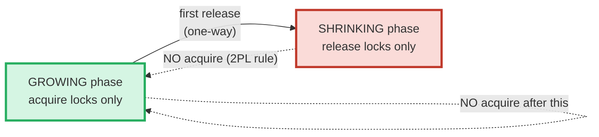
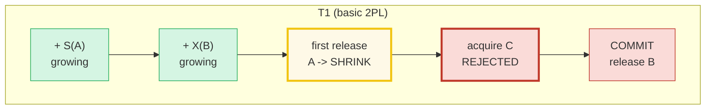
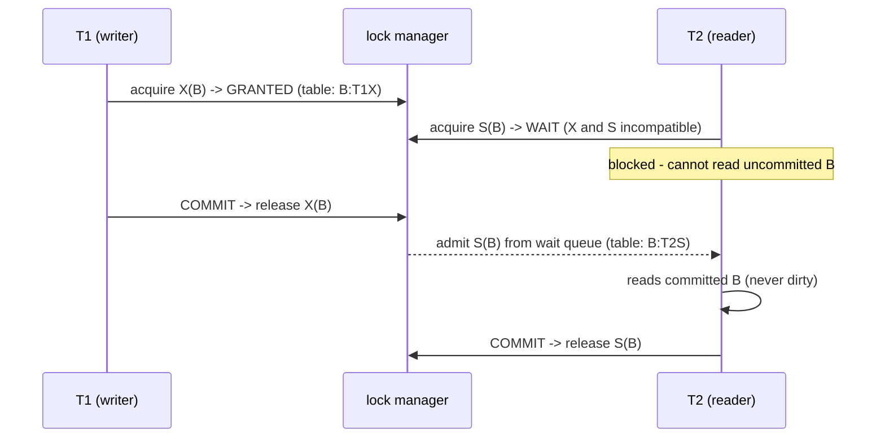
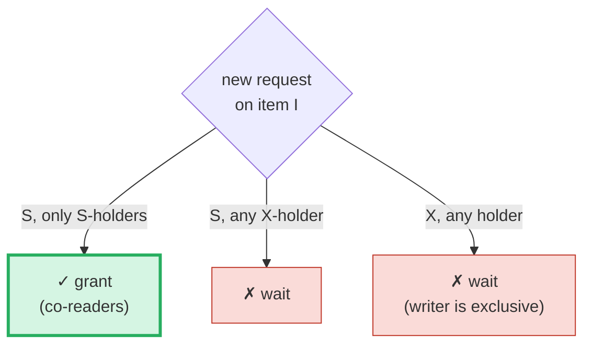
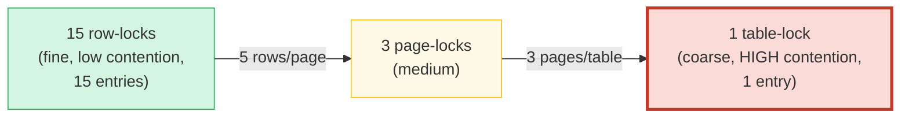
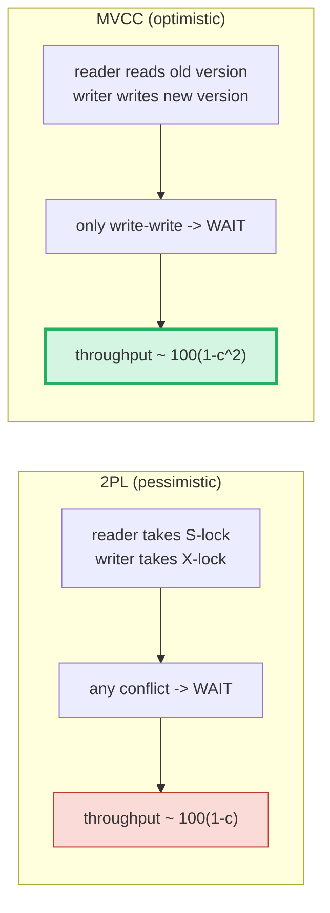
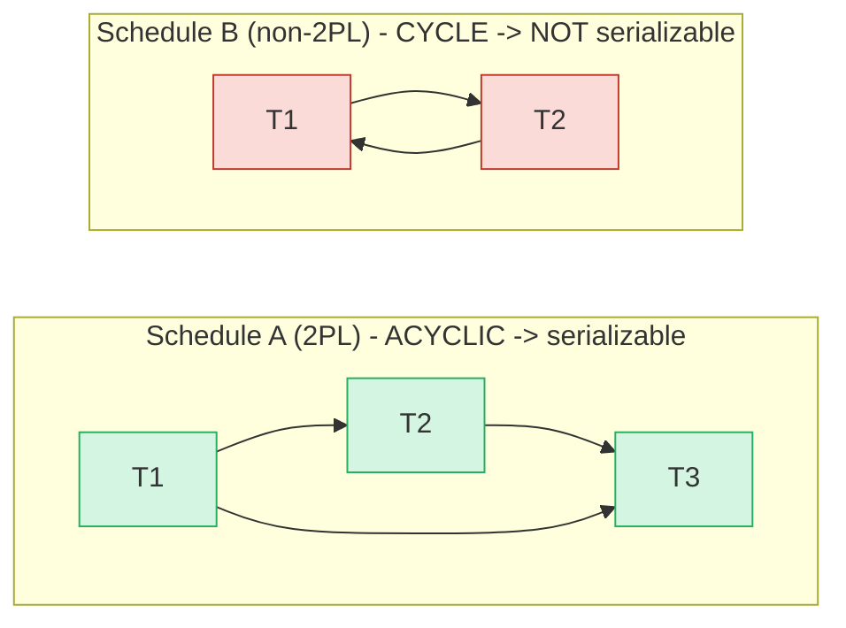

# Two-Phase Locking (2PL) — A Visual, Worked-Example Guide

> **Companion code:** [`two_phase_locking.py`](./two_phase_locking.py). **Every
> lock-table trace, compatibility cell, escalation step, and throughput number in
> this guide is printed by `python3 two_phase_locking.py`** — change the code,
> re-run, re-paste. Nothing here is hand-computed.
>
> **Live animation:** [`two_phase_locking.html`](./two_phase_locking.html) — open
> in a browser; it recomputes the *same* lock manager and serializability check
> in JS and gold-checks against the `.py`.
>
> **Source material:** Eswaran, Gray, Lorie & Traiger, *The Notions of
> Consistency and Predicate Locks in a Database System*, CACM 19(11), Nov 1976
> (the paper that **defined** 2PL); Kung & Papadimitriou, *An Optimality Theory
> of Concurrent Control*, ACM TODS 4(3), 1979 (the **2PL theorem**: 2PL ⟹
> conflict-serializable); Bernstein, Hadzilacos & Goodman, *Concurrency Control
> and Recovery in Database Systems*, 1987 (the basic/strict/rigorous taxonomy);
> Silberschatz, Korth & Sudarshan, *Database System Concepts*, 7th ed., Ch. 16.

---

## 0. TL;DR — the office where you check out keys

**Two-Phase Locking (2PL)** is the classic **lock-based** concurrency control:
every transaction must **check out a lock** on each row before touching it, and
its lock-acquiring life is split into **exactly two phases, in strict order**:

- **Phase 1 — Growing:** the transaction **only acquires** locks.
- **Phase 2 — Shrinking:** the transaction **only releases** locks.

The **phase boundary is the transaction's first release**, and crossing it is
**one-way**: once a transaction has released a lock it may **never acquire
another**. That single rule — *never acquire after you have started releasing* —
is what **guarantees serializability** (the 2PL theorem, §6).

> *Think of every row having a small set of KEYS on a hook. A reader checks out
> an **S-key** (Shared — many readers may share), a writer checks out an
> **X-key** (eXclusive — only one writer, nobody else). 2PL says a transaction's
> life has two halves: first it only CHECKS OUT keys (growing), then it only
> RETURNS them (shrinking). The instant it returns its first key, the growing
> half is over forever — it can never check out another key. Pin all check-outs
> before all returns and a serial order is forced to exist.*

Two lock modes, and a tiny granting rule (the whole of §3):

| requested \ held | S | X |
|---|---|---|
| **S** (read)  | ✓ OK | ✗ NO |
| **X** (write) | ✗ NO | ✗ NO |

Only **co-readers** (S-S) coexist. Any pair involving a writer is incompatible —
a writer is mutually exclusive with everyone, including other writers.



- **Basic 2PL** releases each lock as soon as it's unneeded → **cascading aborts** risk (§2).
- **Strict 2PL** holds X-locks until `COMMIT` → no dirty reads, no cascading aborts.
- **Rigorous 2PL** holds *all* locks (S and X) until `COMMIT` → easiest to build.
- **The 2PL theorem**: if every txn follows 2PL, the schedule is **conflict-serializable** (§6).

### Why it matters

2PL is the **pessimistic** school of concurrency control — it *assumes conflicts
will happen and blocks early*. It is conceptually simple and gives strong
guarantees, but its throughput **collapses under contention** because every
conflict becomes a wait. That is why most modern OLTP databases (PostgreSQL,
Oracle, MySQL/InnoDB reads, SQL Server with snapshots) switched to **MVCC** — the
**optimistic** school that keeps old versions so readers never block writers
(🔗 [`MVCC.md`](./MVCC.md)). 2PL survives where simple, strong serializability is
worth the blocking: DB2, SQL Server under `SERIALIZABLE`, and the write side of
InnoDB.

### Glossary

| Term | Plain meaning |
|---|---|
| **S-lock** | a Shared (READ) lock. Many transactions may hold S on the same item simultaneously. |
| **X-lock** | an eXclusive (WRITE) lock. Only ONE holder; incompatible with S and other X. |
| **lock table** | the manager's map `item → list of (txn, mode)` holders. Absent = unlocked. |
| **growing phase** | the txn only ACQUIRES locks. |
| **shrinking phase** | the txn only RELEASES locks. Begins at the first release. |
| **lock point** | the instant the txn acquires its LAST lock (peak footprint). The earlier lock point serializes first. |
| **basic 2PL** | release each lock as soon as unneeded → may cause cascading aborts. |
| **strict 2PL** | X-locks held until `COMMIT` → no cascading aborts. |
| **rigorous 2PL** | ALL locks (S and X) held until `COMMIT`. Simplest to build. |
| **upgrade** | `S(R) → X(R)` on an item already read. Granted if sole holder, else WAITS (§4). |
| **escalation** | trade many row-locks for one page/table lock when a txn holds too many (§5). |
| **conflict** | a pair of ops on the SAME item by DIFFERENT txns where ≥1 is a write: R-W, W-R, W-W. R-R is NOT. |
| **precedence graph** | node per txn; edge `Ti→Tj` for each conflicting earlier-later pair. ACYCLIC = serializable. |

---

## 1. Basic 2PL — growing then shrinking, and the no-reacquire rule

A transaction's life is two phases in order. The **first release** flips it from
growing to shrinking; after that, **any acquire is rejected** — this IS the 2PL
rule. A transaction that releases a lock and then needs another must have taken
that other lock *during the growing phase*, before releasing anything.

> From `two_phase_locking.py` **Section A** — T1 reads A, writes B, then commits;
> it wrongly tries to grab C *after* releasing A:
>
> ```
>   | step | txn | item | mode | action                                              | lock table   |
>   | ---- | --- | ---- | ---- | --------------------------------------------------- | ------------ |
>   | 1    | T1  | A    | S    | GRANTED (growing phase)                             | A:T1S        |
>   | 2    | T1  | B    | X    | GRANTED (growing phase)                             | A:T1S  B:T1X |
>   | 3    | T1  | A    | S    | RELEASED -> enters SHRINKING phase                  | B:T1X        |
>   | 4    | T1  | C    | S    | REJECT - shrinking phase, cannot acquire (2PL rule) | B:T1X        |
>   | 5    | T1  |      |      | COMMIT - released 1 lock(s)                         | (empty)      |
>
>   steps 1-2 (GROWING) : T1 collects S(A) then X(B). Both granted.
>   step 3  (release A) : first release -> T1 flips to SHRINKING.
>   step 4  (acquire C) : rejected - T1 is in the shrinking phase, so the
>                          manager REJECTS the acquire. This IS the 2PL rule.
>   step 5  (commit)    : T1 releases its remaining X(B) and finishes.
> [check] acquire-after-release in basic 2PL -> rejected: OK
> ```

Read the **lock table** column: steps 1–2 grow the footprint `A:T1S → A:T1S
B:T1X`; step 3 shrinks it (`A` drops out); step 4 is the rejection (footprint
unchanged); step 5's commit empties it. The footprint **grows then shrinks** —
that is the visual signature of 2PL, and it is what the theorem (§6) keys on.



---

## 2. Strict 2PL — X-locks held until COMMIT (no cascading aborts)

Basic 2PL's flaw: it releases **write locks mid-transaction**, exposing
uncommitted data. Another txn reads it; the writer then aborts; the reader must
**also abort** — a **cascading abort**. **Strict 2PL** holds X-locks until
`COMMIT` so no other txn can ever read uncommitted writes.

> From `two_phase_locking.py` **Section B** — same schedule `T1 writes B; T2 reads
> B` under both variants:
>
> ```
> --- BASIC 2PL: T1 releases X(B) mid-txn; T2 reads uncommitted B ---
>   | step | txn | item | mode | action                                  | lock table |
>   | ---- | --- | ---- | ---- | --------------------------------------- | ---------- |
>   | 1    | T1  | B    | X    | GRANTED (growing phase)                 | B:T1X      |
>   | 2    | T1  | B    | X    | RELEASED -> enters SHRINKING phase      | (empty)    |
>   | 3    | T2  | B    | S    | GRANTED (growing phase)                 | B:T2S      |
>   | 4    | T1  |      |      | ABORT - released 0 lock(s), rolled back | B:T2S      |
>   | 5    | T2  |      |      | ABORT - released 1 lock(s), rolled back | (empty)    |
>   -> T1 released X(B) before commit (step 2). T2 acquired S(B) at step 3
>      and READ T1's uncommitted write. When T1 aborts (step 4), T2 has
>      read dirty data -> T2 must ALSO abort. CASCADING ABORT. X
>
> --- STRICT 2PL: T1 holds X(B) until COMMIT; T2 must WAIT ---
>   | step | txn | item | mode | action                                              | lock table |
>   | ---- | --- | ---- | ---- | --------------------------------------------------- | ---------- |
>   | 1    | T1  | B    | X    | GRANTED (growing phase)                             | B:T1X      |
>   | 2    | T2  | B    | S    | WAIT - incompatible with current holder             | B:T1X      |
>   | 3    | T1  |      |      | COMMIT - released 1 lock(s); admitted waiters: T2BS | B:T2S      |
>   | 4    | T2  |      |      | COMMIT - released 1 lock(s)                         | (empty)    |
>   -> T1 keeps X(B) across its whole body. T2's read at step 2 WAITS
>      (waiting). T2 only proceeds once T1 COMMITS and releases X(B), at
>      which point the manager admits the waiter (step 3). T2 NEVER sees
>      uncommitted data. NO cascading aborts.
> ```
>
> ```
>   | variant     | X-locks released when?      | read uncommitted? | cascading aborts? |
>   |-------------|-----------------------------|-------------------|-------------------|
>   | basic 2PL   | as soon as no longer needed | YES (dirty read)  | POSSIBLE          |
>   | strict 2PL  | at COMMIT                   | no                | IMPOSSIBLE        |
>   | rigorous 2PL| at COMMIT (S AND X)         | no                | IMPOSSIBLE        |
> [check] strict 2PL: T2 waits for T1's X(B) until commit -> no dirty read: OK
> ```

In the strict trace, T2 **waits** at step 2 (`B:T1X` blocks `S`), and is only
**admitted from the wait queue** when T1's `COMMIT` releases `X(B)` at step 3.
T2 can never have read garbage because it physically could not acquire the lock
until T1's writes were committed. This is why production systems use strict or
rigorous 2PL on their write paths.



---

## 3. The lock compatibility matrix — S vs X

The lock manager's **entire granting rule** is one 2×2 matrix. A new request is
granted iff it is compatible with **every other current holder** of the item.

> From `two_phase_locking.py` **Section C**:
>
> ```
>   S (Shared)    : a READ lock. Many readers may hold S on the same item.
>   X (eXclusive) : a WRITE lock. Only ONE txn may hold X; nobody else may
>                    hold S or X concurrently.
>
> Compatibility matrix  (rows = requested mode, cols = currently-held mode):
>
>   | requested \ held | S        | X        |
>   |------------------|----------|----------|
>   | S (read)         | OK        | NO        |
>   | X (write)        | NO        | NO        |
>
>   | case        | T1 holds | T2 wants | matrix says | T2 result |
>   |-------------|----------|----------|-------------|-----------|
>   | S after S   | S        | S        | compatible  | granted   |
>   | S after X   | S        | X        | conflict    | WAITS     |
>   | X after S   | X        | S        | conflict    | WAITS     |
>   | X after X   | X        | X        | conflict    | WAITS     |
> [check] grant decision matches COMPAT matrix for all 4 cells: OK
> ```

This is the **readers-writers** problem in one table. Only **S-S** is compatible
(many co-readers); every cell with an **X** is a conflict (a writer excludes
everyone, including other writers — only one writer at a time). The matrix is
literally the only thing the `grant` function consults.



---

## 4. Lock upgrade (S→X) — granted alone, must WAIT if shared

A transaction that already holds `S(R)` (it read R) and then wants to **write**
R must **upgrade** to `X(R)`. The upgrade is special-cased because the txn
already holds *some* lock on R:

- **sole S-holder** → upgrade granted **immediately** (a txn never conflicts with itself);
- **another txn also holds S(R)** → upgrade **WAITS**, otherwise two readers could
  both become writers and break the matrix. If both then try to upgrade, you get
  a classic **upgrade deadlock** (a wait-for cycle the DB detects and breaks by
  aborting one txn).

The mirror move — **downgrade** `X→S` — only relaxes strength, so it always succeeds.

> From `two_phase_locking.py` **Section D**:
>
> ```
> --- Scenario 1: T1 is the SOLE S-holder of A -> upgrade SUCCEEDS ---
>   | step | txn | item | mode | action                      | lock table |
>   | ---- | --- | ---- | ---- | --------------------------- | ---------- |
>   | 1    | T1  | A    | S    | GRANTED (growing phase)     | A:T1S      |
>   | 2    | T1  | A    | X    | UPGRADED S->X (sole holder) | A:T1X      |
>   -> upgrade result: granted-upgrade. T1 was the only S-holder, so the upgrade is
>      applied in place (no waiting). T2 has no locks on A yet.
>
> --- Scenario 2: T1 AND T2 both hold S(A) -> T1's upgrade WAITS ---
>   | step | txn | item | mode | action                                  | lock table |
>   | ---- | --- | ---- | ---- | --------------------------------------- | ---------- |
>   | 1    | T1  | A    | S    | GRANTED (growing phase)                 | A:T1S      |
>   | 2    | T2  | A    | S    | GRANTED (growing phase)                 | A:T1S,T2S  |
>   | 3    | T1  | A    | X    | WAIT - upgrade blocked (other S-holder) | A:T1S,T2S  |
>   -> upgrade result: waiting. T2 also holds S(A); granting T1's X would let
>      T1 write while T2 still reads -> conflict. So T1 WAITS. If T2 now
>      ALSO tries to upgrade S(A)->X(A), BOTH wait on each other = an A-B
>      DEADLOCK.
>
> --- Contrast: downgrade X->S always succeeds (only relaxes) ---
>   T1 holds X(A), asks for S(A) -> granted-downgrade (X->S only drops strength, never
>   conflicts with anyone).
> [check] sole-holder upgrade -> granted; shared-holder upgrade -> wait; downgrade -> granted: OK
> ```

In Scenario 2 the lock table reads `A:T1S,T2S` at step 2 — two co-readers. T1's
upgrade at step 3 cannot fire because T2 still holds S, so it queues. This is
exactly why DBs give **upgrade requests priority** and why an upgrade deadlock
(`T1 waits for T2 to drop S`, `T2 waits for T1 to drop S`) is a real,
detectable hazard rather than a livelock.

---

## 5. Lock escalation — many fine locks → one coarse lock

A lock manager cannot keep one lock per row forever: 100M rows would mean 100M
lock-table entries (each hundreds of bytes of RAM). Instead it **escalates**:
when a single transaction holds too many **fine-grained** locks on adjacent
rows, the manager trades them in for **one coarse-grained** lock covering the
whole page (then the whole table). Coarser locks are cheap to track but cause
**more contention** (they block transactions that only wanted unrelated rows).

> From `two_phase_locking.py` **Section E** — T1 locks rows 0..14 across pages
> P0, P1, P2 (5 rows/page); thresholds are 5 rows→page and 3 pages→table:
>
> ```
>   | step | op          | tier  | result                                                                                   |
>   | ---- | ----------- | ----- | ---------------------------------------------------------------------------------------- |
>   | 1    | lock row 0  | ROW   | rows=[0]                                                                                 |
>   | 2    | lock row 1  | ROW   | rows=[0,1]                                                                               |
>   | 3    | lock row 2  | ROW   | rows=[0,1,2]                                                                             |
>   | 4    | lock row 3  | ROW   | rows=[0,1,2,3]                                                                           |
>   | 5    | lock row 4  | PAGE  | ESCALATE 5 row-locks on P0 -> 1 page-lock | pages=[P0]                                   |
>   | 6    | lock row 5  | PAGE  | rows=[5] pages=[P0]                                                                      |
>   | 7    | lock row 6  | PAGE  | rows=[5,6] pages=[P0]                                                                    |
>   | 8    | lock row 7  | PAGE  | rows=[5,6,7] pages=[P0]                                                                  |
>   | 9    | lock row 8  | PAGE  | rows=[5,6,7,8] pages=[P0]                                                                |
>   | 10   | lock row 9  | PAGE  | ESCALATE 5 row-locks on P1 -> 1 page-lock | pages=[P0,P1]                                |
>   | 11   | lock row 10 | PAGE  | rows=[10] pages=[P0,P1]                                                                  |
>   | 12   | lock row 11 | PAGE  | rows=[10,11] pages=[P0,P1]                                                               |
>   | 13   | lock row 12 | PAGE  | rows=[10,11,12] pages=[P0,P1]                                                            |
>   | 14   | lock row 13 | PAGE  | rows=[10,11,12,13] pages=[P0,P1]                                                         |
>   | 15   | lock row 14 | TABLE | ESCALATE 5 row-locks on P2 -> 1 page-lock; ESCALATE 3 page-locks -> 1 table-lock | TABLE |
>
> Lock-table memory at the end:
>   row-lock entries   : 0
>   page-lock entries  : 0
>   table-lock entries : 1
>   TOTAL entries      : 1   (began as 15 row locks)
>
> At row 4 the 5 row locks on P0 collapse to ONE P0 page lock. At row 14 the 3 page locks
> collapse to ONE table lock. Memory: 15 row entries -> 1 entry.
> [check] 15 row locks escalate to a single table lock: OK
> ```

Watch the **tier** column climb `ROW → PAGE → TABLE`. At step 5 the five
row-locks on page P0 become one P0 page-lock; at step 15 the third page-lock
tips it over into a single table-lock. The whole point: **cap the lock-table
size** at the cost of coarser, more-blocking locks. **SQL Server** escalates at
~5,000 locks per transaction by default. **PostgreSQL deliberately does NOT
escalate** — it relies on its fast-path lock table plus MVCC (🔗 [`MVCC.md`](./MVCC.md))
to avoid the contention spike that a table lock would cause.



---

## 6. 2PL vs MVCC — pessimistic (block) vs optimistic (multi-version)

2PL and MVCC are the two big concurrency-control philosophies. **2PL is
pessimistic**: it blocks on *any* conflict (reader-writer *and* writer-writer).
**MVCC is optimistic**: it keeps old versions so readers never block writers and
writers never block readers; the only blocking is on **write-write** (the same
row) — far rarer. So MVCC's throughput curve sits **strictly above** 2PL's as
contention rises.

> From `two_phase_locking.py` **Section F** — throughput model (100 = single-threaded max):
>
> ```
>   contention c in [0,1] = fraction of txns touching the same hot rows.
>   2PL_throughput(c)  = 100 * (1 - c)        pessimistic: linear drop
>   MVCC_throughput(c) = 100 * (1 - c*c)      optimistic: quadratic drop
>
>   | contention c | 2PL throughput | MVCC throughput | winner | 2PL blocks on   | MVCC blocks on |
>   |--------------|----------------|-----------------|--------|----------------|----------------|
>   | 0.00         | 100.0          | 100.0           | tie    | any conflict   | write-write    |
>   | 0.25         | 75.0           | 93.8            | MVCC   | any conflict   | write-write    |
>   | 0.50         | 50.0           | 75.0            | MVCC   | any conflict   | write-write    |
>   | 0.75         | 25.0           | 43.8            | MVCC   | any conflict   | write-write    |
>   | 1.00         | 0.0            | 0.0             | tie    | any conflict   | write-write    |
> [check] MVCC throughput >= 2PL at every contention level (strictly > for 0<c<1): OK
> ```

At `c=0` both score 100 (no conflicts). As contention rises, MVCC's quadratic
curve `(1−c²)` stays above 2PL's linear curve `(1−c)` everywhere in between: 2PL
pays on probability `c`, MVCC only on the rarer `c²` write-write probability.
That single fact is why the industry moved to MVCC for the default
isolation/reader path — PostgreSQL, Oracle (since v4, 1984), SQL Server
(`READ_COMMITTED_SNAPSHOT`), MySQL/InnoDB consistent reads — while keeping 2PL
for the write path and where strict serializability is worth the blocking.



> 🔗 For MVCC's mechanism — `xmin`/`xmax` version chains, snapshots, VACUUM, XID
> wraparound — see [`MVCC.md`](./MVCC.md). For the stronger serializability that
> 2PL provides cheaply but MVCC must add SSI to reach, see
> [`SERIALIZABLE_SSI.md`](./SERIALIZABLE_SSI.md).

---

## 7. The 2PL theorem — 2PL ⟹ conflict-serializable (GOLD)

**Theorem (Kung & Papadimitriou, TODS 1979):** if *every* transaction in a
schedule obeys two-phase locking, the schedule is **conflict-serializable**.

The test is the **precedence (serialization) graph**: one node per transaction;
an edge `Ti → Tj` iff `Ti` has an *earlier* op that **conflicts** with a *later*
op of `Tj` on the same item (conflicts are **R-W, W-R, W-W**; **R-R is NOT**).
The schedule is conflict-serializable **iff** this graph is **acyclic**.

> From `two_phase_locking.py` **GOLD** — schedule A (legal under 2PL) vs schedule B (not):
>
> ```
> Schedule A (legal under 2PL, all committed) - ops in order:
>   1. T1 W(A)
>   2. T1 W(B)
>   3. T2 R(A)
>   4. T2 W(C)
>   5. T3 R(B)
>   6. T3 R(C)
>
> Precedence edges (Ti->Tj for each conflicting earlier-later pair):
>   T1 -> T2
>   T1 -> T3
>   T2 -> T3
>
>   nodes = [1, 2, 3] ; edges = [(1, 2), (1, 3), (2, 3)]
>   cycle? False  ->  conflict-serializable? True
> [check] precedence graph of the 2PL schedule is ACYCLIC: OK
>
> Contrast - schedule B (NOT legal under 2PL):
>   1. T1 W(A)
>   2. T2 W(B)
>   3. T1 W(B)
>   4. T2 W(A)
>   edges = [(1, 2), (2, 1)]  ;  cycle? True  ->  conflict-serializable? False
>   The graph has the cycle T1->T2->T1. T1 must precede T2 (wrote A first)
>   AND T2 must precede T1 (wrote B first) - impossible. T1 reacquiring a
>   lock after releasing one is the 2PL violation that creates the cycle.
> [check] GOLD: 2PL schedule acyclic, non-2PL schedule cyclic: OK
> ```

Schedule A's graph is a clean chain `T1 → T2 → T3` (plus the shortcut `T1 →
T3`), so it is equivalent to the serial run `T1; T2; T3`. Schedule B's graph has
the cycle `T1 ⇄ T2` — no serial order exists, because each transaction must
"come first". Crucially, schedule B **cannot arise under 2PL**: it would require
T1 to release its lock on A and later reacquire (or hold two write-locks it
acquired out of phase). *That* is the theorem in action — the two-phase rule
forbids exactly the lock patterns that would create a cycle.



---

## 8. Cheat sheet

| | rule |
|---|---|
| **compatibility** | `(S,S)=✓`; `(S,X)`, `(X,S)`, `(X,X)=✗` — only co-readers mix |
| **grant(req, item)** | granted iff `req` compatible with every OTHER holder |
| **2PL phase rule** | a txn in the SHRINKING phase may NOT acquire; first release flips GROWING→SHRINKING |
| **strict 2PL** | X-locks released only at `COMMIT` (no mid-txn release) |
| **rigorous 2PL** | ALL locks (S and X) released only at `COMMIT` |
| **upgrade S→X** | granted iff txn is the SOLE holder; otherwise WAITS (else deadlock risk) |
| **downgrade X→S** | always granted (only relaxes strength) |
| **escalation** | trade N fine locks for one coarse lock when a txn crosses a threshold |
| **conflict** | R-W, W-R, W-W on the same item by different txns (R-R is NOT) |
| **2PL theorem** | every txn follows 2PL ⇒ schedule is conflict-serializable ⇔ precedence graph acyclic |

**Three operational rules:**
1. **Use strict or rigorous 2PL in production** — basic 2PL's early releases
   cause cascading aborts (one abort drags down every reader of its dirty data).
2. **Watch for upgrade deadlocks** — two readers both upgrading to X on the same
   item wait on each other; DBs detect the wait-for cycle and abort one txn.
3. **Locks are not free** — under read-heavy or high-contention load, MVCC's
   "readers never block" (🔗 [`MVCC.md`](./MVCC.md)) scales far better than 2PL's
   "block on every conflict"; pick 2PL where strong, simple serializability
   justifies the wait.

### The lock manager, in one function

```python
def compatible(item, tid, mode, holders):
    for (h_tid, h_mode) in holders:
        if h_tid == tid:                     # a txn never conflicts with itself
            continue
        if not COMPAT[(mode, h_mode)]:        # only (S,S) is True
            return False
    return True

def acquire(tid, item, mode, txn):
    if txn.phase == SHRINKING:                # the 2PL rule
        return "rejected"
    if compatible(item, tid, mode, holders(item)):
        grant(...)                            # add (tid, mode) to the lock table
        return "granted"
    return "waiting"                          # queue in the wait list
```

**Cross-links:** 2PL is the **pessimistic** counterpart to MVCC
(🔗 [`MVCC.md`](./MVCC.md)); together they are the two concurrency-control schools.
For the **serializability** that 2PL buys cheaply but MVCC must add SSI to reach,
see 🔗 [`SERIALIZABLE_SSI.md`](./SERIALIZABLE_SSI.md); for the snapshot-isolation
level that sits between them, see 🔗 [`SNAPSHOT_ISOLATION.md`](./SNAPSHOT_ISOLATION.md).
