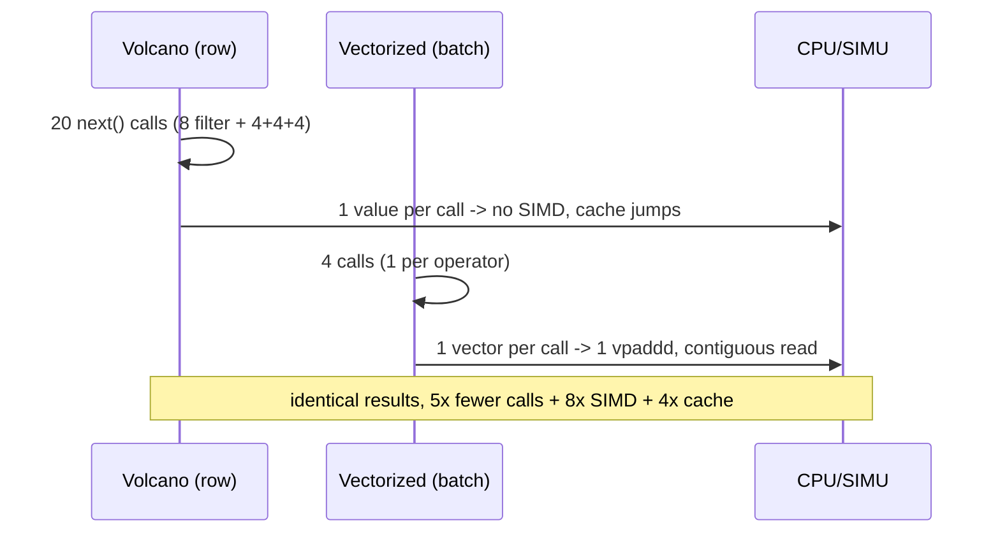

```mermaid
flowchart LR
  subgraph vec["Vectorized: pull ONE vector per call"]
    direction LR
    SA["Scan: a[0..7]"] --> FA["Filter -> sel=[1,3,4,6]"] --> AA["Add(a,b,sel)"] --> MA["Multiply(a,b,sel)"] --> PA["Project emit"]
  end
  style FA fill:#1a2540,stroke:#2980b9
  style PA fill:#1c3a25,stroke:#27ae60
```

# Vectorized (Columnar) Query Execution

> A database-internals concept bundle. This guide is the static, rigorous half;
> every number below is printed by the ground-truth
> [`vectorized_execution.py`](./vectorized_execution.py) and pasted **verbatim** —
> never hand-computed. The playable companion is
> [`vectorized_execution.html`](./vectorized_execution.html).
>
> Lineage: **Volcano** (Graefe 1994, one tuple per `next()`) → **vectorized /
> MonetDB/X100** (Boncz et al. 2005, one vector per call) → **selection vectors**
> (Zukowski 2005) → **late materialization** (Abadi 2007) → ClickHouse, DuckDB.

---

## 0. The one-paragraph idea

A query plan is a pipeline of operators: `Scan → Filter → Add → Multiply →
Project`. The **Volcano** model pulls **one tuple at a time** through that
pipeline — each operator's `next()` returns a single row, so processing 8 rows
costs **20 separate function calls**, each doing work on a single value. Every
call is pure overhead: a virtual dispatch, a branch, and a cache miss as the CPU
jumps between columns.

**Vectorized** execution instead feeds each operator a **whole vector** (a batch
of 1024–4096 values from *one* column) per call. The same 8-row query becomes
**4 calls**, each a tight loop over contiguous memory. That loop is exactly what
the CPU loves: the compiler emits **one SIMD instruction** that adds 8 `int32`s
at once, the cache prefetcher streams the column in, and a tiny **selection
vector** of surviving indices (not copied data) flows between operators.

> **Analogy — the bucket brigade vs the conveyor belt.** Volcano is a worker
> walking *one order* past the check desk, the add desk, the multiply desk, the
> box desk — 4 handoffs per order, 20 for 8 orders, changing task every step.
> Vectorized is the check desk grabbing a *whole tray* of 8 at once (1 handoff),
> marking which pass, and the next desk processing the tray in one pass. Fewer
> handoffs, and each is a long, predictable run of identical work.

**Where it fits** 🔗: vectorized execution is the *engine* that makes analytical
(columnar) stores fast — it is orthogonal to *storage layout* but they reinforce
each other. A column store ([`heap_vs_clustered`](./HEAP_VS_CLUSTERED.md)) lays
each column contiguously so a vector read is one cache-friendly sweep; the
vectorized *engine* then drives SIMD through it. The selection vector is the
vectorized analogue of the positional filtering a [`bitmap_index`](./BITMAP_INDEX.md)
does, and late materialization is what a covering scan in
[`covering_index`](./COVERING_INDEX.md) avoids fetching.

---

## 1. Why it exists — the lineage

| Model | Granularity | Calls for 8 rows | Per-call work | SIMD? |
|---|---|---|---|---|
| **Volcano** (Graefe 1994) | 1 tuple per `next()` | 20 | one value, one op | no (one value) |
| **Vectorized / X100** (Boncz 2005) | 1 vector (1024+) per call | 4 | a tight loop over a column | yes (auto-vectorized) |

The motivation is the **per-tuple overhead wall**. By ~2005 CPUs could issue
billions of operations per second *but only on a long, predictable stream of the
same instruction on contiguous memory*. Volcano feeds them one value, then
changes instruction, then one value — "instruction thrashing". Vectorized
re-batches the work so each operator eats a vector of identical-typed values,
letting the compiler emit SIMD and the prefetcher run.

```
Volcano        :  for each tuple:   Filter.next() -> Add -> Multiply -> Project   (N calls/op)
Vectorized     :  for each vector:  Filter(sel)   -> Add(sel) -> ...              (1 call/op)
calls/op       =  Volcano: N         Vectorized: ceil(N / batch)
```

---

## 2. The worked example — `SELECT a+b, a*b FROM t WHERE a > 5`

A deterministic 8-row table, used in every section:

```
  a = [ 3,  7,  2,  8,  6,  1,  9,  5]
  b = [10, 20, 30, 40, 50, 60, 70, 80]
```

The predicate `a > 5` keeps rows at indices **1, 3, 4, 6** (a = 7, 8, 6, 9) — a
**50% selectivity**, a realistic mid-range. The pipeline has 4 operators:
**Filter, Add, Multiply, Project**.

---

## 3. Volcano — one row at a time, 20 calls

> From `vectorized_execution.py` **Section A** — each row walked individually,
> every operator invocation counted:

```
  row   a   b   a>5?   calls this row                emit
  ---  --  --  -----   ----------------------------  ----
    0   3  10   drop   filter  (rejected)            -
    1   7  20   pass   filter, add, multiply, project  (27, 140)
    2   2  30   drop   filter  (rejected)            -
    3   8  40   pass   filter, add, multiply, project  (48, 320)
    4   6  50   pass   filter, add, multiply, project  (56, 300)
    5   1  60   drop   filter  (rejected)            -
    6   9  70   pass   filter, add, multiply, project  (79, 630)
    7   5  80   drop   filter  (rejected)            -

  call counts: filter=8, add=4, multiply=4, project=4
  TOTAL per-tuple operator calls = 8+4+4+4 = 20
```

The filter evaluates the predicate **8 times** (once per input row). The 4
survivors then each cost add + multiply + project = 3 more calls (`4×3 = 12`).
**20 calls, each doing work on a single value.** Every one of those calls is a
virtual dispatch + a branch + a cache jump between columns — and none of them is
wide enough for the SIMD units to engage. (At 100% selectivity it would be
`4 ops × 8 rows = 32`; the filter trims downstream work, but every survivor still
costs 4 calls and the filter always costs 8.)

```mermaid
flowchart LR
  subgraph volcano["Volcano: pull ONE tuple per next()"]
    direction LR
    S0["Scan.next()\nrow 0"] --> F0["Filter\nreject"]
    S1["Scan.next()\nrow 1"] --> F1["Filter\npass"] --> A1["Add"] --> M1["Multiply"] --> P1["Project\nemit"]
    S2["Scan.next()\nrow 2"] --> F2["Filter\nreject"]
  end
  style F0 fill:#3a1414,stroke:#c0392b
  style F2 fill:#3a1414,stroke:#c0392b
  style P1 fill:#1c3a25,stroke:#27ae60
```



---

## 4. Vectorized — one batch per operator, 4 calls

> From `vectorized_execution.py` **Section B** — the same 8 rows, each operator
> eats the whole column vector in **one call**:

```
  STEP 1  Filter (1 call):  scan column a once, emit a SELECTION VECTOR
            a       = [ 3,  7,  2,  8,  6,  1,  9,  5]
            a>5?    = [ .  v  .  v  v  .  v  . ]
            sel_vec = [1, 3, 4, 6]   (len 4)

  STEP 2  Add (1 call):     compute a+b, but ONLY at sel indices
            a[sel]  = [ 7,  8,  6,  9]
            b[sel]  = [20, 40, 50, 70]
            a+b     = [27, 48, 56, 79]

  STEP 3  Multiply (1 call): compute a*b at sel indices
            a*b     = [140, 320, 300, 630]

  STEP 4  Project (1 call):  zip the two output columns into tuples
            result  = [(27, 140), (48, 320), (56, 300), (79, 630)]

  call counts: filter=1, add=1, multiply=1, project=1
  TOTAL batch operator calls = 4
```

The **per-operator "N / batch" rule** is the heart of it:

```
  operator    Volcano calls  Vectorized calls  reduction
  filter                  8                 1         8x
  add                     4                 1         4x
  multiply                4                 1         4x
  project                 4                 1         4x
```

Volcano invokes each operator once **per tuple** (the filter runs N=8 times).
Vectorized invokes it once **per batch** = `N/batch = 8/8 = 1` time. Each of
those single calls is a tight loop over contiguous memory — SIMD-friendly and
cache-friendly (§5, §6). Result identical to Volcano:

```
  [check] vectorized result == volcano result?  True
          both = [(27, 140), (48, 320), (56, 300), (79, 630)]
```



---

## 5. SIMD — one instruction, eight lanes

A scalar `ADD` does 1 `int32`. A SIMD `ADD` does as many as fit in one register.
`int32 = 32 bits`, so `lanes = register_bits / 32`:

> From `vectorized_execution.py` **Section C**:

```
  ISA        register  int32 lanes  ADD instrs for 8 values  speedup vs scalar
  --------- --------- ------------ -------------------------- ------------------
  scalar         32b            1                          8    1.0x (baseline)
  NEON          128b            4                          2               4.0x
  AVX2          256b            8                          1               8.0x
  AVX-512       512b           16                          1               8.0x
```

The batch of 8 `int32` values packs into **one AVX2 register**:

```
  AVX2 register = 256 bits = 8 x int32 (4 bytes each)
    [ a0 | a1 | a2 | a3 | a4 | a5 | a6 | a7 ]   <- 8 lanes, one register
  + [ b0 | b1 | b2 | b3 | b4 | b5 | b6 | b7 ]
  = [s0  | s1  | s2  | s3  | s4  | s5  | s6  | s7 ]   <- 1 `vpaddd` instr

  scalar path: 8 separate ADD instructions (one per value).
  AVX2  path: 1 ADD instruction (`vpaddd`) -> 8/1 = 8x fewer instructions.
```

At a realistic vector of **2048** values: AVX2 = 256 instructions (8×), AVX-512 =
128 (16×). This is *instruction-count* speedup; real wall-clock gain is lower
(memory-bandwidth bound) but the reduction is real and **compounds** with the
call-count win (§3/§4) and the cache win (§6).

> **Why vectors must be ≥ the register width.** A batch smaller than the SIMD
> width (e.g. 3 values on an 8-lane AVX2 unit) wastes lanes. That is why real
> engines use **1024–4096** values per vector — wide enough to saturate AVX-512
> many times over and to amortize the per-call overhead to ~nothing.

---

## 6. Cache efficiency — contiguous reads

The CPU loads memory in **64-byte cache lines**. To process one column you want
every loaded byte to be *that column*. A row store interleaves all columns, so
reading column `a` drags in `b, c, d` you never asked for.

> From `vectorized_execution.py` **Section D** (wider table: `a, b, c, d`, each
> `int32`, row = 16 B):

```
  layout                  bytes loaded cache lines  useful (a)  utilization
  ---------------------- ------------- ----------- ----------- ------------
  row store (a,b,c,d)              128           2          32        25.0%
  column store                      64           1          32        50.0%
```

The row store loads **128 bytes** (2 cache lines) to reach 8 values of `a`, but
only **32 are useful** → 25% utilization, **96 bytes wasted** on `b,c,d`. The
column store reads `a0..a7` contiguously; the loaded line is all column-`a` data
(the trailing bytes belong to the next batch, which the prefetcher streams in
anyway). Scaled to a 2048-row vector:

```
  row store    :  32,768 bytes =  512 cache lines, useful  8,192 -> 25.0% utilization
  column store :   8,192 bytes =  128 cache lines, useful  8,192 -> 100% utilization
```

→ the column store touches **4× fewer bytes** for a single-column scan — exactly
the number of columns skipped. More columns in the row, bigger the win.

---

## 7. Selection vectors — pass indices, not copied data

After the Filter, two ways to hand survivors downstream:

1. **Materialize**: compact the surviving column *values* into new arrays.
2. **Selection vector**: keep the *original* arrays, pass a list of *indices*.

> From `vectorized_execution.py` **Section E** (`sel = [1,3,4,6]`, 4 survivors):

```
  materialize a,b : copy 4 values x 2 cols x 4 B = 32 bytes
  selection vector: 4 indices x 2 B (uint16) = 8 bytes   -> 4x less data movement
```

At vector 2048 / 50% selectivity: materialize copies **8,192 bytes**; a `uint16`
selection vector is **2,048 bytes** → 4× less. Indices beat copies because:

- the filter writes a small dense buffer of positions (branchless: on match,
  append the index — no per-value branch mispredict);
- downstream ops **gather** from the originals only at those indices, so rejected
  values are never touched or computed on;
- the **same** sel vector flows through the whole pipeline (Add, Multiply, Project
  all reuse it) — one filter, many consumers.

Real engines (DuckDB, ClickHouse) use `uint16` sel vectors for batches up to
65536, `uint32` beyond; batch sizes are typically 1024–2048.

---

## 8. Late materialization — defer the read of column `b`

For `SELECT a+b WHERE a > 5` you need column `a` *and* `b`, but only for survivors.

> From `vectorized_execution.py` **Section F** (selectivity 50%):

```
  strategy           column a   column b  total values   bytes
  ---------------- ---------- ---------- ------------- -------
  early mat.                8          8            16      64
  late mat.                 8          4            12      48

  late materialization reads 12 values vs early's 16 -> saves 4 values = 25.0% of I/O.
```

**Early** reads all of `a` *and* all of `b`, then filters — it fetched `b` for
rows the filter later rejects. **Late** reads `a`, filters → `sel`, then reads
`b` *only at the surviving indices*. The lower the selectivity, the bigger the
win — on a 10-column table:

```
  selectivity 50.0%: early 10.0 col-equiv, late 5.50 col-equiv ->  45.0% I/O saved
  selectivity 10.0%: early 10.0 col-equiv, late 1.90 col-equiv ->  81.0% I/O saved
  selectivity  1.0%: early 10.0 col-equiv, late 1.09 col-equiv ->  89.1% I/O saved
```

At 1% selectivity you read ~1% of the non-predicate columns. This is
**impossible in a row store**, where reading one column means reading them all
(the whole row is one indivisible unit).

---

## 9. Gold check — both models agree

> From `vectorized_execution.py` **Gold Check**:

```
  Volcano    result = [(27, 140), (48, 320), (56, 300), (79, 630)]
  Vectorized result = [(27, 140), (48, 320), (56, 300), (79, 630)]

  [check] result sets identical?  True

  Volcano    total calls = 20
  Vectorized total calls = 4
  call-count reduction   = 20/4 = 5.0x fewer

  Pinned facts (recomputed in vectorized_execution.html):
    selection vector   = [1, 3, 4, 6]
    a+b[sel]           = [27, 48, 56, 79]
    a*b[sel]           = [140, 320, 300, 630]
```

The whole concept rests on this: **vectorized execution is an optimization, not
an approximation** — it must produce the identical result set as the Volcano
model, just far fewer calls and far better hardware utilization.



---

## 10. Pitfalls

- **Vectors too small waste SIMD lanes.** A batch of 3 on an 8-lane AVX2 unit
  uses <40% of the register. Use 1024–4096 to saturate AVX-512 repeatedly and
  amortize per-call overhead.
- **Vectors too big blow the cache.** A vector that doesn't fit in L1 forces
  spilling. The sweet spot (~2048 `int32` = 8 KiB) stays in L1 while filling
  many SIMD registers.
- **Selection vectors cost a gather.** Survivors are non-contiguous, so a
  downstream op *gathers* them — a scatter/gather can be slower than a streaming
  read. At very high selectivity (~100%) it's cheaper to just drop the sel vector
  and process the dense column; engines switch strategies past a threshold.
- **Late materialization isn't free.** Fetching `b` only at `sel` is a random
  gather into a column that wasn't prefetched. For low selectivity it wins big;
  for ~100% selectivity, early (streaming) materialization is simpler.
- **Auto-vectorization is fragile.** The tight loop must be free of branches and
  aliasing for the compiler to emit SIMD. Production engines (DuckDB) often
  hand-write intrinsics or rely on carefully-structured loops; a stray
  `if` inside the loop can silently de-vectorize it.
- **It needs a column store to shine.** Vectorized execution on a *row* store
  still pays the strided-cache cost of §6. The engine and the layout reinforce
  each other; either alone gives only part of the win. 🔗 See
  [`heap_vs_clustered`](./HEAP_VS_CLUSTERED.md).

---

## 11. Cheat sheet

```
Volcano       : next() returns ONE tuple        -> N calls per operator
Vectorized    : next() returns ONE vector       -> ceil(N/batch) calls per op
SIMD lanes    : register_bits / element_bits    (AVX2 int32: 8, AVX-512: 16)
SIMD instr    : ceil(N / lanes)                 vs N scalar
call win      : Volcano 20 -> Vectorized 4  = 5x fewer (this example)
SIMD win      : 8 scalar ADDs -> 1 vpaddd   = 8x fewer instructions (AVX2)
cache win     : column scan reads #cols x fewer bytes (4x for 4 cols)
selection vec : pass uint16 indices, not copied data  -> 4x less movement
late mat.     : read non-predicate cols only at sel   -> up to ~99% I/O saved
GUARANTEE     : vectorized result == volcano result (identical, just faster)
BATCH SIZE    : 1024-4096 (fits L1, saturates SIMD, amortizes call overhead)
DB HOMES      : ClickHouse, DuckDB, VectorWise, HyPer, Peloton
```

| Want… | Tune |
|---|---|
| fewer function calls | raise batch size (calls/op = N/batch) |
| SIMD | keep the inner loop branch-free + contiguous (let the compiler vectorize) |
| less memory traffic | column store + late materialization (read only at `sel`) |
| compact filter output | selection vector (uint16 indices) instead of materializing |
| low-selectivity scans | late materialization (skip non-predicate columns for rejects) |

---

## Sources

1. G. Graefe, 1994, *"Volcano — An Extensible and Parallel Query Evaluation
   System"*, IEEE Data Engineering Bulletin — the iterator model.
2. P. Boncz, M. Zukowski, N. Nes, 2005, *"MonetDB/X100: Hyper-Pipelining Query
   Execution"*, CIDR — the vectorized model (the foundational paper).
3. M. Zukowski et al., 2005, *"MonetDB/X100: Data Partitioning and Pipeline"*,
   BIRTE — selection vectors / vectorized selection.
4. D. Abadi, D. Myers, D. DeWitt, S. Madden, 2007, *"Materialization Strategies
   in a Column-Oriented DBMS"*, ICDE — early vs late materialization.
5. S. Polychroniou et al., 2014/2015 — vectorized selection & SIMD in column
   engines.
6. ClickHouse docs; DuckDB (Raasveldt & Mühleisen, 2019, SIGMOD) — modern
   vectorized + morsel-driven engines.
