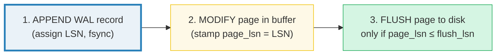
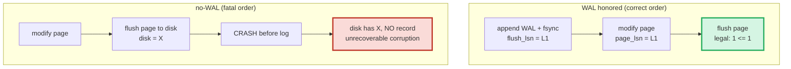
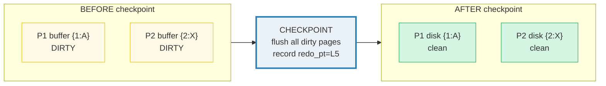
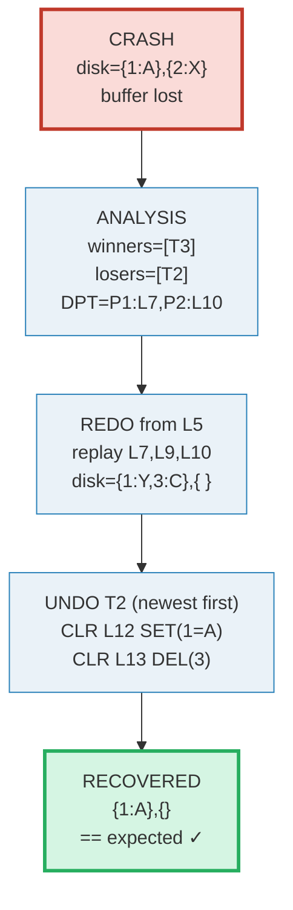
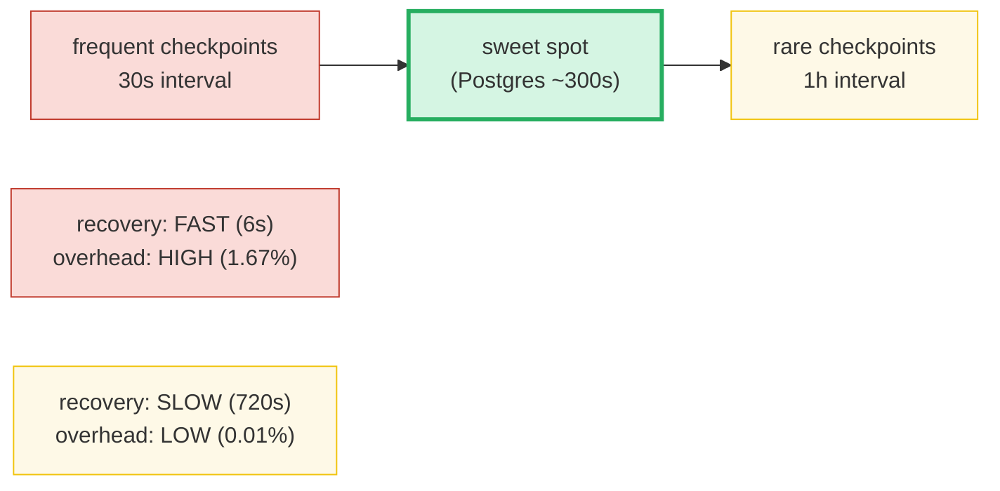

# Write-Ahead Logging & Checkpointing — A Visual, Worked-Example Guide

> **Companion code:** [`wal_checkpoint.py`](./wal_checkpoint.py). **Every record,
> recovery step, and config value in this guide is printed by
> `python3 wal_checkpoint.py`** — change the code, re-run, re-paste. Nothing here
> is hand-computed.
>
> **Live animation:** [`wal_checkpoint.html`](./wal_checkpoint.html) — open in a
> browser; it rebuilds the *same* WAL, crashes, and runs the full ARIES
> recovery in JS, gold-checked against the `.py`.
>
> **Source material:** Mohan, Haderle, Lindsay, Pirahesh, Schwarz, *ARIES: A
> Transaction Recovery Method Supporting Fine-Granularity Locking and Partial
> Rollbacks Using Write-Ahead Logging*, ACM TODS 1992; PostgreSQL source
> `src/backend/access/transam/xlog.c`, `xloginsert.c`, `checkpointer.c`,
> `bgwriter.c`; PostgreSQL docs §30.5 *WAL and Checkpoints*, §20.5 *Write Ahead
> Log* config, §30.3 *Internal Components*; Silberschatz/Korth/Sudarshan,
> *Database System Concepts* §16 (Recovery System).

---

## 0. TL;DR — the notebook you keep before you spend the cash

A database is **durable**: once a transaction commits, its changes survive a
crash. The trick that makes this possible is the **Write-Ahead Log (WAL)** — an
append-only, `fsync`-d sequence of records describing *every* modification. The
rule that makes it work is brutally simple:

> **A data page may be written to disk ONLY AFTER the log record describing its
> modification has been durably written (`fsync`) to the WAL.**

If you keep a notebook of every transfer *before* the cash leaves the drawer,
then a blackout mid-shift is no disaster: open the notebook, replay every entry,
and the drawer is exactly right again. **Checkpointing** caps how much of that
notebook you ever have to re-read after a crash; **ARIES** is the three-phase
recipe (Analysis → Redo → Undo) that turns the notebook back into the correct
state.

> *Think of each modification as a three-step ritual: (1) **APPEND** a record to
> the WAL and `fsync` it, (2) **MODIFY** the page in RAM, (3) **LATER flush**
> the page to disk — but only legal once the WAL is durable past that change.
> The WAL is the single source of truth on disk; data pages are just a cache
> that may lag behind. A **checkpoint** flushes the cache and pins where recovery
> can start. On a crash you lose the cache but keep the log, so you **REDO** all
> logged changes and **UNDO** the transactions that never committed.*



- **STEAL** — the buffer pool may evict (flush) a dirty page *before* its
  transaction commits ⇒ recovery needs **UNDO**.
- **NO-FORCE** — commit does *not* force pages to disk ⇒ recovery needs **REDO**.
- The **WAL rule** (`page_lsn ≤ flush_lsn`) is what makes STEAL+NO-FORCE safe.
- **Commit** = the instant the COMMIT record is `fsync`'d. Pages may still be in
  RAM; durability is a property of the *log*, not the data pages.
- **Checkpoint** flushes dirty pages and records the **redo point**; recovery
  starts there instead of at the beginning of time.
- **ARIES recovery** = Analysis (who committed?) → Redo (re-apply everything) →
  Undo (roll back losers).

### Why it matters

Without a WAL, a crash mid-write leaves a half-modified page on disk with **no
record of intent** — the engine cannot tell whether the change was meant to
survive, cannot redo it (no record), cannot undo it (no compensation info), and
does not even know which transaction owns it. The database is silently
corrupted. The WAL turns "did this change survive?" into "is there a committed
log record for it?", which is always answerable.

### Glossary

| Term | Plain meaning |
|---|---|
| **WAL / log** | append-only, `fsync`'d sequence of modification records. The authority on disk. 🔗 dual of MVCC rollback segments ([`MVCC.md`](./MVCC.md)) |
| **LSN** | Log Sequence Number. Monotonic id per record. Pages carry `page_lsn` = newest applied LSN. |
| **STEAL** | buffer manager MAY flush a dirty page before its txn commits → needs UNDO |
| **NO-FORCE** | pages need NOT be flushed at commit → needs REDO |
| **WAL rule** | `flush(page)` requires `page_lsn(page) ≤ wal_flush_lsn()` |
| **redo** | FORWARD action — "re-apply this change". Idempotent (absolute `SET`/`DEL`). |
| **undo** | BACKWARD action — "reverse this change". Used to roll back losers. |
| **CLR** | Compensation Log Record. The undo action, *itself logged* so undo survives a second crash. Never re-undone. |
| **prev_lsn** | previous record of the SAME txn → the chain UNDO walks backwards. |
| **commit** | durable the instant its COMMIT record is `fsync`'d (data pages may still be in RAM). |
| **checkpoint** | flush dirty pages + record the **redo point** and the in-flight txn table. |
| **DPT** | dirty page table: `page_id → recLSN` (oldest unflushed change). Lets redo start at `min(recLSN)`. |
| **ARIES** | the standard 3-phase (Analysis/Redo/Undo) recovery algorithm. |

---

## 1. The WAL protocol — log BEFORE modify (STEAL/NO-FORCE)

Databases pick **STEAL/NO-FORCE** because it is the fastest: STEAL lets the
buffer pool evict under memory pressure (so it never has to stall a transaction
because RAM is full), and NO-FORCE makes commit a single `fsync` of one log
record (never a multi-page write). The price is that recovery must handle both
uncommitted-but-flushed changes (UNDO) and committed-but-unflushed changes
(REDO). The **WAL rule** is the invariant that keeps it all consistent.

> From `wal_checkpoint.py` **Section A**:
>
> ```
>    A data page may be written to disk ONLY AFTER the log record that
>    describes its modification has been fsync'd to the WAL:
>
>         page_lsn(page)  <=  wal_flush_lsn()        (must hold)
>
> Consequence: every modification is performed in this ORDER:
>
>    1. APPEND the WAL record  (assign LSN, write to log, fsync)
>    2. MODIFY the page in the buffer pool (stamp page_lsn = LSN)
>    3. (later) FLUSH the page to disk  -- only legal once the WAL is
>       durable past page_lsn.
> ```

The worked step for `T1 UPDATE(P2, k2: B→X)`:

> From `wal_checkpoint.py` **Section A**:
>
> ```
>   BEFORE: page P2 = {2: 'B'}, page_lsn = L0, flush_lsn = L0
>
>   Step 1  APPEND WAL:  WALRec(L1, UPDATE, txn=T1, page=P2, key=2, redo=SET(2='X'), undo=SET(2='B'), prev=L0)
>           now flush_lsn = L1  (log fsync'd to here)
>   Step 2  MODIFY page: P2 = {2: 'X'}, page_lsn = L1, dirty = True
>   Step 3  FLUSH gate:  page_lsn(L1) <= flush_lsn(L1)?  YES -> flush legal
>           after flush: disk P2 = {2: 'X'}
> ```

### The no-WAL failure mode

If you flush the page **first** and crash *before* appending the log record,
disk now holds `k2=X` but there is **no record** for it. On restart the engine
cannot redo it (nothing to replay) nor undo it (no compensation info, and it
does not even know which txn owns it). The change is **unrecoverable** — and if
the txn was going to abort, the half-applied write silently corrupts the
database. The WAL rule makes the log the sole authority, so this can never
happen.



---

## 2. WAL record types and the record format

Every modification is **one** record. The generic layout:

```
[ LSN | txn | type | page | key | redo | undo | prev_lsn ]
```

`redo`/`undo` are expressed as **absolute, idempotent** primitives so replaying
them twice is harmless — `SET(k,v)` and `DEL(k)`.

> From `wal_checkpoint.py` **Section B** — per-type redo/undo:
>
> ```
>   | type       | redo action         | undo action           | notes |
>   |------------|---------------------|-----------------------|-------|
>   | BEGIN      | -                   | -                     | starts the prev_lsn chain |
>   | INSERT     | SET(k,v)            | DEL(k)                | undo removes the new row |
>   | UPDATE     | SET(k,new)          | SET(k,old)            | undo restores the prior value |
>   | DELETE     | DEL(k)              | SET(k,old)            | undo re-inserts the row |
>   | COMMIT     | -                   | -                     | txn is a winner; never undone |
>   | ABORT      | -                   | -                     | txn already rolled back |
>   | CHECKPOINT | -                   | -                     | carries redo_pt + txn table |
>   | CLR        | (the compensation)  | -  (none)             | logged undo; idempotent |
> ```

Three concrete records from the §4 scenario:

> From `wal_checkpoint.py` **Section B**:
>
> ```
>   WALRec(L2, INSERT, txn=T1, page=P1, key=1, redo=SET(1='A'), undo=DEL(1), prev=L1)
>   WALRec(L3, UPDATE, txn=T1, page=P2, key=2, redo=SET(2='X'), undo=SET(2='B'), prev=L2)
>   WALRec(L9, UPDATE, txn=T2, page=P1, key=1, redo=SET(1='Y'), undo=SET(1='A'), prev=L7)
> ```

Each record's `prev_lsn` chains to the previous record of its **same** txn. T2's
chain is `L6(BEGIN) → L7(INSERT) → L9(UPDATE)`; UNDO walks it `9 → 7 → 6`. A
**CLR** is the undo action written back into the log during rollback — it has a
redo (the compensation) but **no undo** (a CLR is never re-reversed), which
guarantees undo always makes progress toward completion even across repeated
crashes.

---

## 3. Checkpoint — flush dirty pages, pin the redo point

Without a checkpoint, recovery would replay the **entire** log from the
beginning of time — unbounded. A **checkpoint** caps it:

- **Action:** flush every dirty buffer page to disk (a *sharp* checkpoint).
- **Record:** store the **redo point** (where REDO starts = the checkpoint's own
  LSN for a sharp checkpoint) and a snapshot of the **in-flight transaction
  table** (a head start for Analysis).

After a checkpoint, REDO may ignore everything before the redo point (those
changes are already on disk). ANALYSIS still starts *at* the checkpoint record
so it can rebuild the in-flight txn table.

> From `wal_checkpoint.py` **Section C** — before/after the checkpoint that
> follows T1's commit:
>
> ```
> BEFORE checkpoint (after T1 committed, L1..L4 written):
>
>   P1: buffer = {1: 'A'} (dirty=True, page_lsn=L2), disk = {}
>   P2: buffer = {2: 'X'} (dirty=True, page_lsn=L3), disk = {2: 'B'}
>
> CHECKPOINT executes -> flushes pages: ['P1', 'P2']
>   writes record: WALRec(L5, CHECKPOINT, redo_pt=L5, txntab={})
>
> AFTER checkpoint:
>
>   P1: buffer = {1: 'A'} (dirty=False, page_lsn=L2), disk = {1: 'A'}
>   P2: buffer = {2: 'X'} (dirty=False, page_lsn=L3), disk = {2: 'X'}
>
>   redo_pt = L5  -> REDO on recovery starts here,
>                                   NOT at L1. Everything before is on disk.
>   txn_table at checkpoint = {}  (T1 already committed; nothing in flight)
> ```



---

## 4. ARIES recovery — Analysis → Redo → Undo (the crash test)

A crash **loses the buffer pool**; disk + WAL survive. ARIES rebuilds the
correct state in three phases, starting from the **last checkpoint**:

> From `wal_checkpoint.py` **Section D**:
>
> ```
>   Phase 1 ANALYSIS : scan the WAL forward from the checkpoint record.
>                      Rebuild the txn table (who is in-progress / committed)
>                      and the dirty page table. Decide WINNERS (committed)
>                      vs LOSERS (in-progress at crash -> must undo).
>   Phase 2 REDO     : re-apply every redo action from the redo point
>                      forward, making disk >= the pre-crash state. Redo is
>                      IDEMPOTENT, so already-flushed pages are harmless.
>   Phase 3 UNDO     : roll back every LOSER, walking its prev_lsn chain
>                      from newest to oldest. Each step appends a CLR
>                      (so undo itself survives a second crash).
> ```

### The scenario

```
  L1  BEGIN T1
  L2  T1 INSERT(P1, k1=A)
  L3  T1 UPDATE(P2, k2: B->X)
  L4  T1 COMMIT
  L5  CHECKPOINT   <- recovery starts here
  L6  BEGIN T2
  L7  T2 INSERT(P1, k3=C)
  L8  BEGIN T3
  L9  T2 UPDATE(P1, k1: A->Y)   <- T2 uncommitted
  L10 T3 DELETE(P2, k2)
  L11 T3 COMMIT
  *** CRASH ***                  (buffer lost; disk = post-L5 state)
```

Committed at crash: **{T1, T3}**. Loser: **{T2}**. Disk survives at the
post-checkpoint state `P1={1:'A'}, P2={2:'X'}`; the buffer (with T2/T3's
unflushed changes) is lost.

### Phase 1 — Analysis (scan forward from the checkpoint)

> From `wal_checkpoint.py` **Section D**:
>
> ```
>   start: redo_pt = L5, txn_table (from ckpt) = {}
>
>   | LSN | type      | txn | effect on txn_table / DPT |
>   |-----|-----------|-----|--------------------------|
>   | L6  | BEGIN     | T2  | +T2=in-progress          |
>   | L7  | INSERT    | T2  | T2.last=L7; DPT[P1]=L7   |
>   | L8  | BEGIN     | T3  | +T3=in-progress          |
>   | L9  | UPDATE    | T2  | T2.last=L9; DPT[P1]=L7   |
>   | L10 | DELETE    | T3  | T3.last=L10; DPT[P2]=L10 |
>   | L11 | COMMIT    | T3  | T3=committed (WINNER)    |
>
>   -> WINNERS (committed): ['T3']   LOSERS (must undo): ['T2']
>   -> dirty page table at crash: {'P1': 7, 'P2': 10}
>   -> redo will start at L5 (could also start at min recLSN = L7 for less work)
> ```

T1 committed *before* the checkpoint, so it is not in the in-flight table — its
effects are already on disk. T3 is a winner (it has a COMMIT record). **T2 is
the only loser**: in-progress at the crash with no commit. The DPT records the
oldest unflushed change per page (`P1: L7`, `P2: L10`); redo could even start at
`min(recLSN)=L7` for less work.

### Phase 2 — Redo (re-apply, idempotent)

> From `wal_checkpoint.py` **Section D**:
>
> ```
>   | LSN | redo action        | P1 after        | P2 after   |
>   |-----|--------------------|-----------------|------------|
>   | L7  | SET(3='C')         | {1: 'A', 3: 'C'} | {2: 'X'}   |
>   | L9  | SET(1='Y')         | {1: 'Y', 3: 'C'} | {2: 'X'}   |
>   | L10 | DEL(2)             | {1: 'Y', 3: 'C'} | {}         |
>
>   -> applied 3 redo action(s). Disk now reflects the
>      pre-crash in-memory state (including T2's uncommitted writes,
>      which UNDO will next remove). Redo is idempotent, so a later
>      re-run changes nothing.
> ```

Redo brings disk up to the **pre-crash in-memory** state — including the
loser's writes, which UNDO will next remove. Because redo actions are absolute
(`SET`/`DEL`), replaying them on already-flushed pages is harmless.

### Phase 3 — Undo (roll back losers via `prev_lsn`; append CLRs)

> From `wal_checkpoint.py` **Section D**:
>
> ```
>   Losers to undo: ['T2'], starting from lastLSN = {'T2': 9}
>
>   | step | walk LSN | record                | undo (CLR) action   | P1 after        | P2 after   |
>   |------|----------|-----------------------|---------------------|-----------------|------------|
>   | 1    | L9       | WALRec(L9, UPDATE, ..., undo=SET(1='A')) | CLR L12 SET(1='A') | {1: 'A', 3: 'C'} | {} |
>   | 2    | L7       | WALRec(L7, INSERT, ..., undo=DEL(3))     | CLR L13 DEL(3)     | {1: 'A'}          | {} |
>
>   -> appended 2 CLR(s). All loser effects reversed.
>
>   RECOVERED database: {'P2': {}, 'P1': {1: 'A'}}
>   EXPECTED database : {'P1': {1: 'A'}, 'P2': {}}
>
>   GOLD CHECK: recovered == expected?  YES
> ```

UNDO walks T2's chain newest→oldest (`L9 → L7 → L6`), applying each record's
**undo** as a logged **CLR**. Walking newest-first matters: it reverses changes
in the correct (opposite) order. The CLRs are appended to the WAL so that if the
engine crashes *during* undo, the next recovery sees the CLRs and does not
re-undo them (a CLR has no undo field → the rollback always terminates).

### The gold result — what correct recovery must produce

> From `wal_checkpoint.py` **Section D / GOLD**:
>
> ```
>   GOLD CHECK: recovered == expected?  YES
>     - T1's committed INSERT(k1=A): PRESENT  (redo kept it)
>     - T1's committed UPDATE(k2=X) then T3's committed DELETE: k2 ABSENT
>     - T2's uncommitted INSERT(k3=C): ABSENT  (undo removed it)
>     - T2's uncommitted UPDATE(k1=A->Y): REVERTED to A (undo)
> ```

**All committed effects present, all uncommitted effects absent.** That is the
correctness contract of ARIES, verified by the gold check.



---

## 5. Checkpoint timing — fast recovery vs low overhead

Checkpoints are a **dial**. The more often you checkpoint, the **less** WAL
accrues between them (fast recovery) but the **more** flush I/O you do in
steady state (high overhead). The two pull against each other.

> From `wal_checkpoint.py` **Section E** — model: WAL rate 1 000 rec/s, replay
> rate 5 000 rec/s, checkpoint flush cost 0.5 s:
>
> ```
>   | interval | WAL accrued | recovery redo time | checkpoint overhead |
>   |----------|-------------|--------------------|---------------------|
>   |    30s    |    30,000   |            6.0 s    |    1.67 %          |
>   |    60s    |    60,000   |           12.0 s    |    0.83 %          |
>   |   120s    |   120,000   |           24.0 s    |    0.42 %          |
>   |   300s    |   300,000   |           60.0 s    |    0.17 %          |  <- PostgreSQL checkpoint_timeout default
>   |   600s    |   600,000   |          120.0 s    |    0.08 %          |
>   |  1800s    | 1,800,000   |          360.0 s    |    0.03 %          |
>   |  3600s    | 3,600,000   |          720.0 s    |    0.01 %          |
> ```



### Fuzzy checkpoint — making it non-blocking

A **sharp** checkpoint halts writing while it flushes every dirty page. A
**fuzzy** checkpoint does not: a **background writer** flushes pages
continuously, and the checkpoint record simply notes the redo point as the
oldest `recLSN` in the dirty page table (the first unflushed change). Writers
keep running; recovery redoes a little more but there is no stall.

```
  sharp  : redo_pt = checkpoint_LSN          (everything flushed)
  fuzzy  : redo_pt = min(recLSN in DPT)      (oldest dirty change)
```

PostgreSQL, InnoDB and DB2 all use fuzzy checkpoints.

---

## 6. PostgreSQL specifics — bgwriter, checkpointer, the knobs

PostgreSQL splits the work across **dedicated processes** (not one thread):

- **checkpointer** — the only process that writes a CHECKPOINT record. Flushes
  the shared buffer pool's dirty pages and recycles old WAL segments.
- **bgwriter** (background writer) — trickle-flushes dirty buffers continuously
  so checkpoints have little left to do (smoother I/O, fewer stalls).
- **walwriter** — `fsync`'s WAL records in the background so commits do not
  always block on an explicit `fsync`.

A checkpoint fires when **either** trigger trips:

> From `wal_checkpoint.py` **Section F** — the knobs:
>
> ```
>   | parameter                          | default      | controls |
>   |------------------------------------|--------------|----------|
>   | checkpoint_timeout                 | 300s         | time-based trigger |
>   | max_wal_size                       | 1024 MB         | volume-based trigger |
>   | checkpoint_completion_target       | 0.9        | flush smoothing |
>   | full_page_writes                   | True        | partial-page defence |
>   | checkpoint_flush_after / sync      | tuned by OS  | fsync batching |
>   | wal_level                          | replica      | how much to log |
> ```

`checkpoint_completion_target = 0.9` spreads the flush work over 90% of the time
before the *next* checkpoint is due, smoothing I/O instead of a burst at the
deadline.

### Full page writes — the partial-write defence

Disks may write a page **partially** (a *torn write*) if power dies mid-flush.
With `full_page_writes=on`, the **first** modification of a page after each
checkpoint logs the **whole** page image; redo then has a clean baseline to
re-apply later deltas against. Cost: a burst of big records right after each
checkpoint. (Stock Postgres keeps it on; appliances with atomic-page storage
sometimes turn it off.)

A PostgreSQL CHECKPOINT record effectively pins the redo point, the dirty
buffer list + their `recLSN` (fuzzy checkpoint), and the oldest active xid (so
VACUUM's xmin horizon stays consistent). After redo + the next checkpoint's
flush, old WAL segments can be recycled/removed — WAL is **not** kept forever,
only back to the redo point. 🔗 This is why MVCC's VACUUM interacts with the
checkpoint horizon ([`MVCC.md`](./MVCC.md)).

---

## 7. Cheat sheet

| | rule |
|---|---|
| **WAL rule** | `flush(page)` requires `page_lsn(page) ≤ wal_flush_lsn()` |
| **STEAL** | uncommitted dirty pages MAY be evicted → needs UNDO |
| **NO-FORCE** | commit does NOT flush data pages → needs REDO |
| **commit** | durable the instant its COMMIT record is `fsync`'d |
| **redo** | re-apply from redo point; idempotent (absolute `SET`/`DEL`) |
| **undo** | roll back losers via `prev_lsn`, newest-first; append CLRs |
| **CLR** | logged compensation; redo only, never re-undone → rollback terminates |
| **checkpoint** | flush dirty pages, record redo point + in-flight txn table |
| **sharp redo pt** | = checkpoint LSN (everything flushed) |
| **fuzzy redo pt** | = `min(recLSN in DPT)` (oldest unflushed change) |
| **recovery contract** | all committed effects present, all uncommitted absent |

### The WAL engine + ARIES, in one sketch

```python
def write(txn, page, redo, undo):          # the WAL rule, every modification
    rec = wal.append(txn, redo, undo)      # 1. log + fsync FIRST
    pool.apply(page, rec.redo); page.lsn = rec.lsn   # 2. then modify buffer
    # 3. flush(page) only legal once page.lsn <= wal.flush_lsn

def recover(disk, wal):
    ckpt = wal.last_checkpoint()
    txn_table, dpt = analysis(ckpt)        # Phase 1: winners vs losers
    for r in wal.from(ckpt.redo_pt):       # Phase 2: REDO (idempotent)
        if r.redo: disk.apply(r.redo)
    for t in losers(txn_table):            # Phase 3: UNDO (newest-first)
        for r in chain_back(t, wal):       #      walk prev_lsn
            wal.append_clr(r.undo); disk.apply(r.undo)
```

**Three operational rules:**
1. **Never turn off the WAL / never skip `fsync` on commit** — a fast commit
   that is not durable is not a commit at all.
2. **Tune checkpoint frequency to your RTO** (recovery-time objective): too rare
   = minutes of redo after a crash; too frequent = steady I/O tax. PostgreSQL's
   5-min default with `completion_target=0.9` is a good starting point.
3. **Keep `full_page_writes=on`** unless your storage guarantees atomic page
   writes — torn writes otherwise silently defeat redo.

**Cross-links:** the WAL is the dual of MVCC's rollback segments
(🔗 [`MVCC.md`](./MVCC.md)); the checkpoint horizon bounds how far back VACUUM
must look; checkpoint flushing is sibling work to the buffer-pool eviction path
in [`PAGE_EVICTION.md`](./PAGE_EVICTION.md) and the free-space/visibility maps
in [`FREE_SPACE_MAP.md`](./FREE_SPACE_MAP.md).
