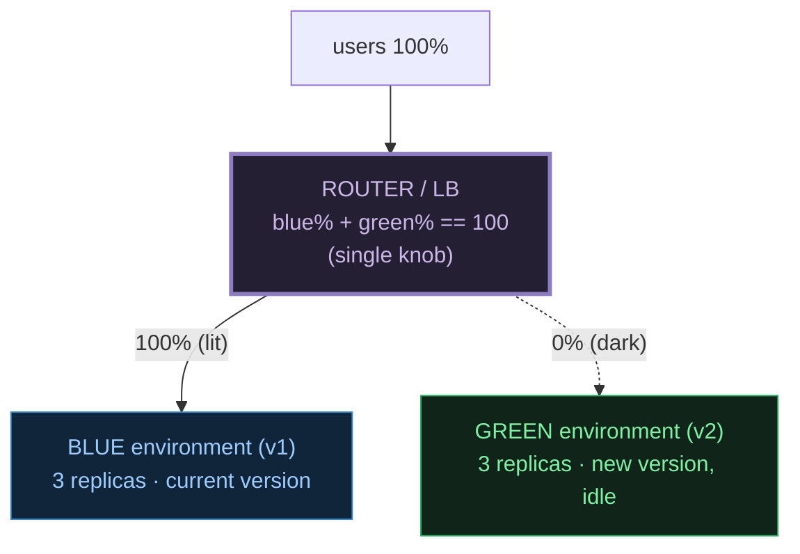

# Blue-Green Deployment — A Visual, Worked-Example Guide

> **Companion code:** [`blue_green.py`](./blue_green.py).
> **Every number in this guide is printed by `python3 blue_green.py`**
> — change the code, re-run, re-paste. Nothing here is hand-computed.
>
> **Live animation:** [`blue_green.html`](./blue_green.html) — open in a browser.
>
> **Sibling guide:** [`DEPLOYMENT_REPLICASET.md`](./DEPLOYMENT_REPLICASET.md) —
> rolling updates (the cheaper, ramped alternative). And [`CANARY.md`](./CANARY.md)
> — gradual traffic shifting.
>
> **Source material:** `HOW_TO_RESEARCH.md`; Martin Fowler's
> *BlueGreenDeployment* bliki; *Continuous Delivery* (Humble & Farley);
> Kubernetes docs (two Deployments + a Service selector flip; Istio
> VirtualService destination weights).

---

## 0. TL;DR — the two stages and the lighting director

Picture a theatre with **two identical stages** side by side: the **Blue** stage
and the **Green** stage. Only one is ever lit for the audience at a time. The
**lighting director** — the **router / load balancer** — points the spotlights
at exactly one stage; the other sits dark but fully built, ready to swap in.



| Role | Plain meaning |
|---|---|
| **Blue environment** | the live, serving environment running the **current** version (v1) |
| **Green environment** | the idle, upcoming environment running the **new** version (v2) |
| **Router / LB** | the traffic splitter. `blue_pct + green_pct == 100`, always. A Service `selector` flip, an Istio VirtualService with destination weights, or a DNS/ALB swap |
| **Cutover** | the instant flip of 100% traffic from Blue to Green — **one step, no ramp** |
| **Smoke test** | hitting Green **directly** (bypassing the router) to validate before it sees a real user |
| **Rollback** | flipping the router back to Blue — **as instant as cutover**, because Blue is still warm |
| **Idle capacity** | the non-serving environment kept warm for fast rollback (the thing you pay 2× for) |

> **The defining rule:** at every phase, `{blue%, green%} == {0, 100}`. There is
> never a partial split. The moment a 50/50 split appears, you are doing a
> **canary**, not a blue-green. Blue-green trades 2× resources for an **instant,
> one-step, reversible** cutover.

---

## 1. Setup — Section A output (Blue live, Green built in the dark)

Two **identical** environments sit side by side. Blue serves 100% of traffic.
Green starts **empty** and is built up to match Blue, but the router is **not
touched** — Green sees 0% of real traffic the whole time.

> From `blue_green.py` **Section A** — `steady = 3` replicas:
>
> | phase | Blue rep | Blue % | Green rep | Green % | total | serving |
> |---|---|---|---|---|---|---|
> | IDLE | 3 | 100 | 0 | 0 | 3 | blue |
> | PROVISION | 3 | 100 | 3 | 0 | 6 | blue |
> | SMOKE | 3 | 100 | 3 | 0 | 6 | blue |
>
> `[check] blue_pct + green_pct == 100 at every phase? True`
> `[check] cutover is a single-phase flip (no ramp)? True`

Green goes `0 → 3` replicas while Blue's traffic stays at 100%. Green is **warm
and ready**, but no user has hit it yet. The smoke test in the SMOKE phase hits
Green **directly** (a test URL / a debug Service), bypassing the public router,
so production is untouched.

---

## 2. Cutover — Section B output (the instant flip)

This is the whole point of blue-green. The router moves **100%** of traffic
from Blue to Green in **one step**. There is no 50/50, no ramp, no "partial
exposure". Every user is on Green the instant after the flip; nobody is on Blue.

> From `blue_green.py` **Section B** — the full healthy choreography:
>
> | phase | Blue rep | Blue % | Green rep | Green % | total | serving |
> |---|---|---|---|---|---|---|
> | IDLE | 3 | 100 | 0 | 0 | 3 | blue |
> | PROVISION | 3 | 100 | 3 | 0 | 6 | blue |
> | SMOKE | 3 | 100 | 3 | 0 | 6 | blue |
> | **CUTOVER** | 3 | **0** | 3 | **100** | 6 | **green** |
> | SETTLE | 3 | 0 | 3 | 100 | 6 | green |
> | CLEANUP | 0 | 0 | 3 | 100 | 3 | green |
>
> `[check] invariants (1)-(4) hold at every phase? True`
> `[check] CUTOVER is one step (Blue 0% → Green 100%)? True`

```mermaid
graph LR
    A["IDLE<br/>B100/G0"] -->|"provision Green"| B["PROVISION<br/>B100/G0 · total 6"]
    B -->|"smoke test Green"| C["SMOKE<br/>B100/G0"]
    C -->|"flip router"| D["CUTOVER<br/>B0/G100 ✓ instant"]
    D -->|"grace period"| E["SETTLE<br/>Blue warm"]
    E -->|"drain Blue"| F["CLEANUP<br/>Green=new Blue"]
    style D fill:#1c3a25,stroke:#27ae60,color:#7ef0a2,stroke-width:3px
    style B fill:#241f33,stroke:#8e7cc3
    style E fill:#241f33,stroke:#8e7cc3
```



**Note SETTLE:** Blue is kept **warm** (3 replicas, 0% traffic) on purpose. It is
your rollback insurance — a fully-built, known-good environment you can flip back
to instantly. Only after the grace period does CLEANUP drain Blue (0 replicas).
At that point Green "becomes" the new Blue for the next deploy, and the cycle
repeats.

---

## 3. Rollback — Section C output (as instant as the cutover)

Rollback is blue-green's **superpower**. Because Blue is still there and warm
(the SETTLE phase kept it), "rollback" is just flipping the router knob the other
way. No re-deploy, no image re-pull, no waiting for pods — one router change and
100% of traffic is back on Blue.

> From `blue_green.py` **Section C** — Green went live but degraded:
>
> | phase | Blue % | Green % | serving |
> |---|---|---|---|
> | IDLE | 100 | 0 | blue |
> | PROVISION | 100 | 0 | blue |
> | SMOKE | 100 | 0 | blue |
> | CUTOVER | 0 | 100 | green |
> | **DEGRADED** | 0 | 100 | green ← error/latency spike |
> | **ROLLBACK** | **100** | **0** | **blue** ← flipped back in 1 step |
>
> `[check] invariants hold through the rollback flip? True`


> **The catch:** rollback fixes **routing**, not **data**. If Green ran a forward
> migration (added a DB column, wrote new-format rows), flipping back to Blue does
> **not** undo those writes. Blue-green pairs best with **backward-compatible,
> expand-then-contract** schema changes.

---

## 4. Cost — Section D output (the 2× trade-off vs rolling update)

Blue-green buys an instant, reversible cutover by keeping **both** environments
built at once. During the provision → settle window you run **2×** the replicas.
A rolling update instead surges a **few** pods above steady (`maxSurge`) and never
reaches 2× — but it has **no instant flip and no instant rollback**.

> From `blue_green.py` **Section D** — steady = 3:
>
> | strategy | peak replicas | vs steady | instant flip | instant rollback |
> |---|---|---|---|---|
> | **Blue-Green** | **6** | **2.0×** | yes (1 step) | yes (Blue warm) |
> | Rolling maxSurge=1 | 4 | 1.33× | no (ramp) | no (re-roll) |
> | Rolling maxSurge=25% | 4 | 1.33× | no (ramp) | no (re-roll) |
>
> `[check] blue-green peak == 2 * steady? 6 == 6 → True`
> `[check] blue-green peak (6) > rolling peak (4)? True`

**When 2× is worth it:** high-value releases where you want a guaranteed
one-step undo — launches, risky migrations with a compatibility window, events
with fixed traffic. **When it is not:** steady-state CI deploys where a rolling
update's small surge is cheaper and the ramp is acceptable.

---

## 5. The GOLD CHECK — traffic routing matches expected at every phase

> From `blue_green.py` **GOLD CHECK** (canonical healthy deploy, steady = 3):
>
> ```
> phase     : IDLE  PROVISION  SMOKE  CUTOVER  SETTLE  CLEANUP
> Blue %    : 100   100        100     0        0       0
> Green %   :   0     0          0   100      100     100
> total rep :   3     6          6     6        6       3
> serving   : blue  blue       blue  green    green   green
>
> [check] invariants (1)-(4) hold at every phase?            True
> [check] invariant (2) CUTOVER is a single-phase flip?      True
> [pin] peak total replicas during deploy = 6  (== 2 * 3)
> [pin] cutover Blue%/Green%              = 0/100
> [pin] final serving version             = green (Green is the new Blue)
> [pin] # phases in healthy deploy        = 6
> [check] traffic sequence == [(100,0),(100,0),(100,0),(0,100),(0,100),(0,100)]: OK
> [check] all gold pins reproduced:  OK
> ```
>
> [`blue_green.html`](./blue_green.html) ports the phase model to JS and
> re-derives the **identical** trace (Blue%, Green%, total, serving), asserting
> invariants (1)-(4) at every phase. The green `check: OK` badge is that
> assertion passing live.

### The four invariants (asserted at every phase)

1. `blue_pct + green_pct == 100` — the router never drops or doubles traffic.
2. `{blue_pct, green_pct} == {0, 100}` — exactly one stage lit (no partial split).
3. each environment's replicas ∈ `{0, steady}` — a full clone, or empty.
4. `serving ==` the lit stage.

---

## 6. Pitfalls & debugging checklist

| # | Mistake | Symptom | Fix |
|---|---|---|---|
| 1 | No idle/warm old environment after cutover | rollback is slow (must re-deploy) | keep Blue warm through a SETTLE grace period before CLEANUP |
| 2 | Expecting rollback to undo **data** writes | flipped back to Blue, DB still mutated | use expand-then-contract, backward-compatible schemas |
| 3 | Stateful/session-affinity services | users lose session on cutover | externalize session state; or use canary instead |
| 4 | Smoke test through the public router | real users hit Green early | test Green via a **direct** debug Service, not the router |
| 5 | Database shared between Blue & Green, schema diverges | one version breaks on the other's schema | decouple deploy from migrate; compat window |
| 6 | Running 2× forever | permanent 2× cost | CLEANUP must drain the old env after the grace period |
| 7 | Forgetting to swap "Blue↔Green" labels next deploy | confusion on which is live | Green becomes the new Blue; the cycle alternates |

---

## 7. Cheat sheet

- **Two identical environments** (Blue = current, Green = new); a **router** lights one at a time.
- **`blue_pct + green_pct == 100`, always; one stage lit (0/100, never a split).**
- **Choreography:** IDLE → PROVISION (Green built) → SMOKE (Green tested direct) → **CUTOVER** (flip) → SETTLE (Blue warm) → CLEANUP (drain Blue).
- **Cutover is ONE step**, zero downtime. That single-step flip is what separates blue-green from canary.
- **Rollback = flip the router back.** Instant, because Blue is still warm. Fixes routing, not data.
- **Cost = 2× replicas** during provision → settle. Rolling update is ~1.33× but has no instant flip/rollback.
- **Invariants (gold):** Blue%=[100,100,100,0,0,0], Green%=[0,0,0,100,100,100], peak total 6 = 2×3, serving ends on green.

> 🔗 For the cheaper, ramped alternative see
> [`DEPLOYMENT_REPLICASET.md`](./DEPLOYMENT_REPLICASET.md) (rolling updates). For
> gradual traffic shifting with metrics-gated promotion see
> [`CANARY.md`](./CANARY.md).

---

## Sources

- **Martin Fowler — BlueGreenDeployment.**
  https://martinfowler.com/bliki/BlueGreenDeployment.html
  - Verified: two environments, a router/switch that moves all traffic at once,
    and an idle environment kept for fast rollback.
- **Jez Humble & David Farley — *Continuous Delivery*.** The release-patterns
  chapter (blue-green, canary, rolling). Verified: blue-green = release by
  moving traffic, not by replacing instances.
- **Kubernetes — two Deployments + a Service `selector` flip.**
  https://kubernetes.io/docs/concepts/services-networking/service/
  - Verified: changing a Service's `selector` re-points it at a different set of
    Pods (the cutover), with no pod restart.
- **Istio — VirtualService destination weights.**
  https://istio.io/latest/docs/concepts/traffic-management/
  - Verified: weighted routing to two destinations; weights sum to 100. Setting
    `[100, 0] → [0, 100]` is a one-step blue-green cutover.
- **Argo Rollouts — `blueGreen` strategy.**
  https://argo-rollouts.readthedocs.io/en/stable/features/bluegreen/
  - Verified: `previewReplicaCount`, `autoPromotionEnabled`,
    `scaleDownDelaySeconds` (the SETTLE grace window that keeps Blue warm).
