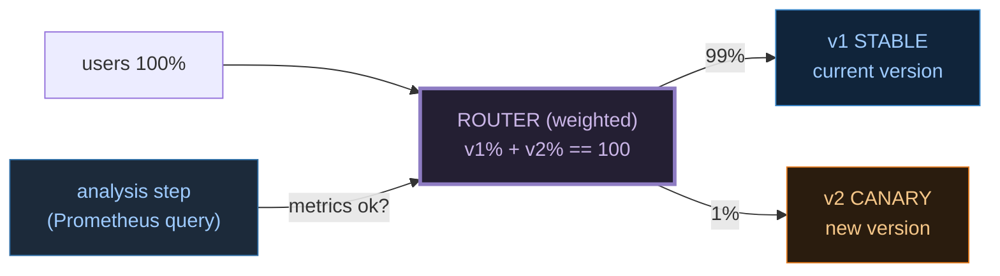

# Canary Deployment — A Visual, Worked-Example Guide

> **Companion code:** [`canary.py`](./canary.py).
> **Every number in this guide is printed by `python3 canary.py`**
> — change the code, re-run, re-paste. Nothing here is hand-computed.
>
> **Live animation:** [`canary.html`](./canary.html) — open in a browser.
>
> **Sibling guide:** [`BLUE_GREEN.md`](./BLUE_GREEN.md) — the instant-flip
> alternative. And [`DEPLOYMENT_REPLICASET.md`](./DEPLOYMENT_REPLICASET.md) —
> rolling updates.
>
> **Source material:** `HOW_TO_RESEARCH.md`; Argo Rollouts docs (canary
> strategy, AnalysisTemplate); Istio docs (weighted traffic shifting);
> Flagger docs (Canary CRD, metric providers); *Kubernetes Patterns*
> (Ibryam & Huss), "Progressive Delivery".

---

## 0. TL;DR — the dimmer switch and the sound engineer

If **blue-green** is a light **switch** (one stage on, the other off, instant),
a **canary** is a **dimmer**. You start by sending a tiny slice of the audience
— **1%** — into the new room (v2). A **sound engineer** — the **analysis step** —
listens: are error rates up? is latency laggy? If v2 sounds fine, you nudge the
dimmer up — **5%, 25%, 50%, 100%**. If at any step v2 sounds bad **and** the
signal is statistically significant, you snap the dimmer back to **0** before
more users are affected.



| Role | Plain meaning |
|---|---|
| **canary (v2)** | the new version released to a small, **growing** traffic slice |
| **stable (v1)** | the current version, receiving the bulk `(100 − weight)%` of traffic |
| **weight** | the dimmer position — % of traffic to the canary. Schedule `0 → 1 → 5 → 25 → 50 → 100` |
| **weighted routing** | Istio/Envoy VirtualService destination weights, or a cloud LB weighted target group. `v1% + v2% == 100` |
| **analysis** | a metric comparison at each stage: v2 vs the v1 baseline |
| **AnalysisTemplate** | an Argo Rollouts object holding the metric queries + success/failure conditions |
| **promote** | pass the analysis → advance to the next weight |
| **abort / halt** | fail the analysis → stop ramping |
| **rollback** | after a halt, route 100% back to v1 (`weight → 0`) |
| **Flagger** | a progressive-delivery operator; same loop driven by a `Canary` CRD + a metric provider |

> **The defining rule:** the whole point is **blast radius**. A bad v2 only ever
> sees a small slice of traffic before you catch it — at the 5% stage a buggy
> release has reached **5%** of users, not 100%. That is the trade vs blue-green
> (which flips 100% at once).

---

## 1. The canary stages — Section A output (the weight schedule)

A canary ramps traffic to v2 in stages. v1 always gets the rest, so `v1% + v2%
== 100` at every stage. Each bump is bigger than the last — **small early**
(cheap to catch a bad v2), **large once v2 is trusted**.

> From `canary.py` **Section A** — v1 baseline: error = 0.5%, p95 latency = 100ms:
>
> | weight | v1 % | v2 % | intent |
> |---|---|---|---|
> | 0 | 100 | 0 | baseline: v1 serves 100% |
> | 1 | 99 | 1 | smoke in prod; tiny blast radius |
> | 5 | 95 | 5 | first statistically meaningful slice |
> | 25 | 75 | 25 | quarter; real load signal |
> | 50 | 50 | 50 | half; confidence building |
> | 100 | 0 | 100 | v2 promoted; v1 drained |
>
> `[check] v1% + v2% == 100 at every weight? True`
> `[check] schedule monotonic non-decreasing? True`

Why these jumps (`0→1→5→25→50→100`): start **near-zero** so a broken release
touches almost nobody; **5%** is the first weight with enough traffic to trust
the metrics (`≥ MIN_SIG_WEIGHT = 5%`); then geometric-ish growth. Argo Rollouts
encodes this as a `steps` list of `setWeight` + `analysis` actions (see §3).

---

## 2. Automated analysis — Section B output (PROMOTE vs ABORT)

At every stage the analysis step compares v2 against the v1 baseline:

```
err_ratio = v2_err / 0.5        ABORT if > 2x
lat_ratio = v2_lat / 100        ABORT if > 1.5x
AND weight >= 5%                (significance gate: p<0.05 proxy)
```

> From `canary.py` **Section B** — two scenarios on the same schedule:
>
> **SCENARIO 1 — HEALTHY** (v2 behaves) → promotes to 100%:
>
> | stage | v1 % | v2 % | v2 err | v2 lat | decision |
> |---|---|---|---|---|---|
> | 0 | 100 | 0 | - | - | BASELINE |
> | 1 | 99 | 1 | 0.60% | 102ms | PROMOTE |
> | 2 | 95 | 5 | 0.55% | 101ms | PROMOTE |
> | 3 | 75 | 25 | 0.70% | 105ms | PROMOTE |
> | 4 | 50 | 50 | 0.65% | 104ms | PROMOTE |
> | 5 | 0 | 100 | - | - | COMPLETE (promoted) |
>
> `[check] invariants hold? True` · `[check] promoted to 100%? True`
>
> **SCENARIO 2 — UNHEALTHY** (v2 degrades at 25%) → halt + rollback:
>
> | stage | v1 % | v2 % | v2 err | v2 lat | decision |
> |---|---|---|---|---|---|
> | 0 | 100 | 0 | - | - | BASELINE |
> | 1 | 99 | 1 | 0.60% | 102ms | PROMOTE |
> | 2 | 95 | 5 | 0.80% | 110ms | PROMOTE |
> | 3 | 75 | 25 | **2.10%** | **180ms** | **ABORT** (err 4.2x, lat 1.8x; p<0.05) |
> | 4 | 100 | 0 | - | - | ROLLBACK (weight → 0) |
>
> `[check] invariants hold? True` · `[check] ABORT fired? True` · `[check] rolled back to weight 0? True`

```mermaid
graph LR
    H1["1% PROMOTE"] --> H2["5% PROMOTE"] --> H3["25% PROMOTE"] --> H4["50% PROMOTE"] --> H5["100% ✓"]
    U1["1% PROMOTE"] --> U2["5% PROMOTE"] --> U3["25% ABORT ✗"] --> U4["0% ROLLBACK"]
    style H5 fill:#1c3a25,stroke:#27ae60,color:#7ef0a2,stroke-width:3px
    style U3 fill:#3a1414,stroke:#c0392b,color:#ff9a8a,stroke-width:3px
    style U4 fill:#241f33,stroke:#8e7cc3
```



**Blast radius:** in the unhealthy run a broken v2 only reached **25%** of users
before rollback — not 100%. That smaller exposure is canary's whole advantage
over blue-green.

> **The significance gate (p<0.05 proxy):** at 1% traffic the sample is too noisy
> to trust, so a small blip there does **not** abort; by 5%+ you have enough
> requests to act. Real tools (Argo, Flagger) run an actual statistical test on
> the metric; we model it as a `weight >= MIN_SIG_WEIGHT` gate for determinism.

---

## 3. Argo Rollouts — Section C output (AnalysisTemplate + weighted steps)

Argo Rollouts automates this loop. A **Rollout** replaces a Deployment and drives
a `canary` strategy: a `steps` list of `setWeight` + `analysis` actions, and an
**AnalysisTemplate** holding the Prometheus queries + success/failure
conditions. The controller advances on success, aborts on failure.

> From `canary.py` **Section C** — the strategy mirrors our schedule
> `0→1→5→25→50→100`:
>
> ```yaml
> strategy:
>   canary:
>     steps:
>       - setWeight: 1
>       - analysis: { templates: [{ templateName: canary-check }] }
>       - setWeight: 5
>       - analysis: { templates: [{ templateName: canary-check }] }
>       - setWeight: 25
>       - analysis: { templates: [{ templateName: canary-check }] }
>       - setWeight: 50
>       - analysis: { templates: [{ templateName: canary-check }] }
>       - setWeight: 100          # promoted
> ```
>
> ```yaml
> apiVersion: argoproj.io/v1alpha1
> kind: AnalysisTemplate
> metadata: { name: canary-check }
> spec:
>   metrics:
>     - name: error-rate
>       successCondition: result[0] <= 1.00    # v2 err <= 2x baseline
>       failureCondition: result[0] > 1.00     # hard fail -> abort
>       provider: { prometheus: { query: "..." } }
>     - name: p95-latency
>       successCondition: result[0] <= 150     # v2 lat <= 1.5x baseline
>       provider: { prometheus: { query: "..." } }
> ```

**Auto-promote:** every step's analysis succeeds → controller runs `setWeight:
100` and the Rollout completes. **Auto-abort:** any analysis hits
`failureCondition` → controller sets weight back to 0 (rollback) and marks the
Rollout `Degraded`. This is exactly the `run_canary()` loop.

---

## 4. Canary vs Blue-Green — Section D output

Same goal (ship v2 with a safety net), opposite risk profiles:

> From `canary.py` **Section D**:
>
> | aspect | canary | blue-green |
> |---|---|---|
> | exposure | gradual (1% → 100%) | instant (100% at once) |
> | blast radius | small early; grows per stage | 100% on cutover |
> | rollback | route 100% back to v1 (1 step) | flip router back (1 step) |
> | resource cost | ~1× (small canary slice) | **2×** (both envs built) |
> | traffic split | weighted (e.g. 75/25) | `{0, 100}` only |
> | needs metrics | **YES** (gated by analysis) | no (manual cutover ok) |
> | good for | risky change, large blast if bad | instant swap, fixed traffic |

```mermaid
graph TB
    subgraph ca["CANARY (dimmer)"]
        C0["1%"] --> C1["5%"] --> C2["25%"] --> C3["50%"] --> C4["100%"]
    end
    subgraph bg["BLUE-GREEN (switch)"]
        B0["Blue 100%"] -->|"one-step flip"| B1["Green 100%"]
    end
    style C2 fill:#241f33,stroke:#8e7cc3
    style B1 fill:#1c3a25,stroke:#27ae60,color:#7ef0a2,stroke-width:3px
```



**Rule of thumb:** canary when you can **measure** v2 and a bad release must
touch few users; blue-green when you want a **guaranteed one-step undo** and can
afford the idle capacity. Many teams canary the risky `1→50%` then finish with a
blue-green-style flip to 100%.

---

## 5. Flagger — Section E output (progressive delivery operator)

**Flagger** is a Kubernetes operator that runs the **same** loop (advance weight,
analyse, promote/halt) driven by a **Canary CRD** and a **metric provider**
(Prometheus, Datadog, Cloud Watch, Graphite). You declare the target and the
thresholds; Flagger drives the dimmer for you.

> From `canary.py` **Section E** — a Flagger `Canary` (mirrors our thresholds):
>
> ```yaml
> apiVersion: flagger.app/v1beta1
> kind: Canary
> spec:
>   service: { port: 80, targetPort: 8080, gateways: [public] }
>   analysis:
>     interval: 1m        step: 5m         maxWeight: 100
>     threshold: { max: 1.00 }      # abort if v2 err > 2x baseline
>     metrics:
>       - name: error-rate
>         threshold: { max: 1.0 }
>         query: "..."              # from Prometheus
>       - name: latency-p95
>         threshold: { max: 150 }
>     weights: { minimum: 1, maximum: 100, stepWeight: 5 }
> ```

The Flagger reconcile loop (deterministic, like `run_canary`):

1. **INITIALIZE** — clone v1 to a v2 deployment + a weighted route (1/99).
2. **ADVANCE** — bump v2 weight by `stepWeight` each interval that passes.
3. **ANALYSE** — query the metric provider; compare v2 vs the threshold.
4. **PROMOTE** — all weights pass → weight 100, v1 scaled to 0.
5. **HALT/ROLLBACK** — a metric fails → weight 0, alert fired, v1 100%.

> `[check] Flagger threshold.max error == our ERROR_MULT baseline? 1.00% == 1.00%`
> `[check] Flagger loop == run_canary() loop? advance → analyse → promote/halt: yes, identical shape`

**Argo Rollouts vs Flagger:** same outcome, different ergonomics. Argo is
**step-list driven** (explicit `setWeight`/`analysis` actions). Flagger is
**interval/threshold driven** (it picks the weights). Both need a service mesh or
an LB that supports weighted routing (Istio, Linkerd, App Mesh, Contour, NGINX).

---

## 6. The GOLD CHECK — weight progression matches expected; rollback on error

> From `canary.py` **GOLD CHECK**:
>
> ```
> HEALTHY rollout trace:
>   stage : 0     1     2     3     4     5
>   weight:   0     1     5    25    50   100
>   decide: BASE  PROM  PROM  PROM  PROM  COMP
>
> UNHEALTHY rollout trace:
>   stage : 0     1     2     3     4
>   weight:   0     1     5    25     0
>   decide: BASE  PROM  PROM  ABOR  ROLL
>
> [check] healthy weights == [0, 1, 5, 25, 50, 100]?          True
> [check] unhealthy weights == [0, 1, 5, 25, 0]?              True
> [check] healthy invariants (1)-(3) hold?                    True
> [check] unhealthy invariants (1)-(3) hold?                  True
> [pin] healthy final decision = COMPLETE @ 100%
> [pin] unhealthy abort stage   = 25%
> [pin] unhealthy final state   = ROLLBACK @ 0%
> [check] healthy completes @ 100%?     True
> [check] unhealthy aborts + rolls back? True
> [check] all gold pins reproduced:  OK
> ```
>
> [`canary.html`](./canary.html) ports the model to JS and re-derives **both**
> traces (healthy to 100%, unhealthy abort@25 → rollback to 0), asserting
> invariants (1)-(3). The green `check: OK` badge is that assertion passing live.

### The canary invariants (asserted at every stage)

1. `v1_pct + v2_pct == 100` — weighted routing never drops traffic.
2. pre-rollback weights are **monotonic non-decreasing** (a healthy rollout only ramps up).
3. an **ABORT** is immediately followed by a `weight → 0` **ROLLBACK** stage.
4. the weight schedule is exactly `[0, 1, 5, 25, 50, 100]`.

---

## 7. Pitfalls & debugging checklist

| # | Mistake | Symptom | Fix |
|---|---|---|---|
| 1 | No metrics / bad Prometheus query | analysis always "passes" (blind) | wire error-rate + latency queries; dry-run them first |
| 2 | Analysis window too short | noisy aborts/promotes at low weight | raise `MIN_SIG_WEIGHT` / longer analysis window |
| 3 | No `failureCondition` | bad v2 keeps promoting | set a hard abort threshold, not just success |
| 4 | Big weight jump (1% → 100%) | defeats the blast-radius point | keep small early steps; never skip 1% and 5% |
| 5 | Session-affinity without sticky routing | users flip between v1/v2 mid-session | use weighted routing with consistent hash, or externalize state |
| 6 | v1 and v2 share a DB, v2 writes new schema | v1 breaks on v2's writes | backward-compatible, expand-then-contract changes |
| 7 | Aborting but not rolling back weight | users stuck on broken v2 | ensure the controller sets weight → 0 on abort (Argo/Flagger do) |

---

## 8. Cheat sheet

- **Canary = a dimmer**, not a switch. Ramp v2 traffic `0 → 1 → 5 → 25 → 50 → 100%`.
- **`v1% + v2% == 100` at every stage; weights monotonic up until a rollback.**
- **Analysis per stage:** `err_ratio = v2_err/v1_err`, `lat_ratio = v2_lat/v1_lat`; **ABORT** if `err > 2×` or `lat > 1.5×` **and** weight ≥ 5% (significance gate = p<0.05 proxy).
- **Blast radius** is the point: a bad v2 reaches only the current weight% before you catch it.
- **Argo Rollouts** = `steps` (`setWeight` + `analysis`) + an `AnalysisTemplate` (Prometheus query, success/failure conditions). Auto-promote / auto-abort.
- **Flagger** = `Canary` CRD + metric provider; interval/threshold driven, same advance→analyse→promote/halt loop.
- **vs blue-green:** canary = gradual, measurable, ~1× cost, needs metrics; blue-green = instant flip, 2× cost, no metrics needed.
- **GOLD:** healthy weights `[0,1,5,25,50,100]` → COMPLETE; unhealthy `[0,1,5,25,0]` — ABORT@25, ROLLBACK to 0.

> 🔗 For the instant-flip alternative see
> [`BLUE_GREEN.md`](./BLUE_GREEN.md). For the pod-level rolling machinery see
> [`DEPLOYMENT_REPLICASET.md`](./DEPLOYMENT_REPLICASET.md).

---

## Sources

- **Argo Rollouts — Canary strategy.**
  https://argo-rollouts.readthedocs.io/en/stable/features/canary/
  - Verified: `steps` of `setWeight` + `analysis`; `AnalysisTemplate` with
    `successCondition` / `failureCondition`; abort sets the Rollout `Degraded`.
- **Argo Rollouts — AnalysisTemplate.**
  https://argo-rollouts.readthedocs.io/en/stable/analysis/
  - Verified: `metrics[].provider.prometheus.query`; count-based / time-based
    analysis; auto-promotion and auto-abort on metric outcomes.
- **Istio — Traffic Shifting (weighted routing).**
  https://istio.io/latest/docs/tasks/traffic-management/traffic-shifting/
  - Verified: a `VirtualService` routes to two destinations with weights summing
    to 100; changing the weights is the canary ramp.
- **Flagger — How it works.**
  https://docs.flagger.app/
  - Verified: the Canary CRD, the metric providers (Prometheus/Datadog/etc.),
    and the initialize → advance → analyse → promote/halt reconcile loop.
- **Kubernetes Patterns — "Progressive Delivery"** (Ibryam & Huss). The release
  pattern family: rolling, blue-green, canary, A/B.
