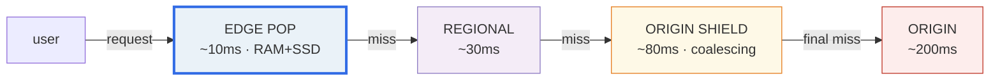
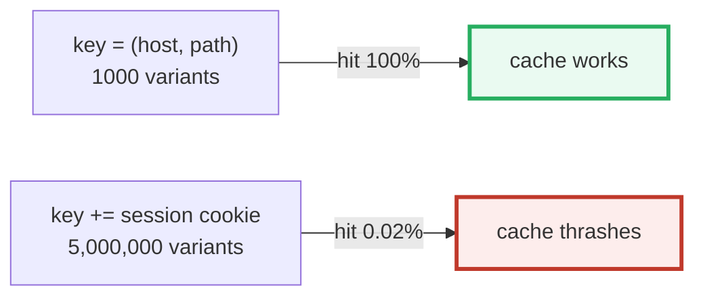

# CDN Architecture — A Visual, Worked-Example Guide

> **Companion code:** [`cdn.py`](https://github.com/quanhua92/tutorials/blob/main/devops/cdn.py).
> **Every number in this guide is printed by `python3 cdn.py`** — change the
> code, re-run, re-paste. Nothing here is hand-computed.
>
> **Live animation:** [`cdn.html`](https://github.com/quanhua92/tutorials/blob/main/devops/cdn.html)
> — open in a browser; it recomputes the cache hierarchy, hit-rate calculator,
> cache-key fragmentation, thundering-herd defense, and the latency comparison
> from the identical model and checks against the `.py` gold.
>
> **Source material:** CDN design (CalibreOS), Cloudflare / CloudFront docs,
> RFC 7234 (HTTP caching), Akamai edge architecture write-ups.

---

## 0. TL;DR — the whole idea in one picture

### Read this first — a global chain of convenience stores

Imagine a retailer with **one central warehouse** (the **origin**) and thousands
of **convenience stores near every customer** (the **edge**). Instead of shipping
every order from the warehouse (slow, expensive, warehouse melts under load), the
nearest store serves the customer from its **own shelf (cache)**.

- A **HIT** (item on the shelf) → serve instantly, never bother the warehouse.
- A **MISS** (item not stocked) → fetch one from the warehouse, put a copy on the
  shelf so the **next** customer gets a hit.



The job of a CDN is to maximize the **hit rate** so the origin sees as little
traffic as possible (**origin offload**). Three cache tiers drive the cumulative
hit rate from ~80% (edge alone) to ~99% (full hierarchy).

> **One-line definition:** a CDN is a **globally-distributed read-through cache**
> with DNS/Anycast routing that serves bytes from the cache tier **closest** to
> the user, cutting latency to tens of milliseconds and offloading 80–99% of
> origin bandwidth.

### Glossary (every term used below)

| Term | Plain meaning |
|---|---|
| **Edge POP** | Point of Presence — the cache closest to users (RAM + SSD) |
| **Origin** | the real server/database that owns the content |
| **Origin shield** | a single-region cache in front of the origin; **request coalescing** collapses a burst of identical misses into ONE origin fetch |
| **Cache key** | identifier of a cached object — typically `(method, host, path)` plus a normalized subset of query/headers |
| **TTL** | Time To Live — how long a cached object stays fresh before revalidation/refetch |
| **Cache hit rate** | fraction of requests served from cache (no origin fetch) |
| **Origin offload** | fraction of traffic the origin does NOT serve (≈ hit rate) |
| **Invalidation** | removing/updating a cached object before its TTL expires (explicit purge, or new versioned URL) |
| **Anycast** | BGP-based routing that sends the user to the NEAREST POP, with automatic failover |

---

## 1. Cache hierarchy — Section A output (cumulative hit rate)

Each tier serves a fixed fraction of the requests that **reach** it (the misses
from above). Stacking tiers multiplies their effectiveness:

> From `cdn.py` **Section A**:
>
> | tier | latency | serves |
> |---|---|---|
> | edge POP | 10 ms | 80% of what reaches it |
> | regional cache | 30 ms | 75% of what reaches it |
> | origin shield | 80 ms | 80% of what reaches it |
> | origin | 200 ms | the rest (final miss) |
>
> ```
> Cumulative hit rate = 1 - (1-0.80)(1-0.75)(1-0.80) = 99.00%
> Origin sees only 1.00% of user requests (~1 in 100).
> [check] 3-tier hierarchy reaches ~99% cumulative hit rate?  OK
> ```

**Why hierarchy:** each tier only needs to cache what the tier above it
**missed**. The edge handles the hot 80% from RAM; regional + shield mop up most
of the rest, so the origin is shielded from bursty traffic *and* the
thundering herd.

---

## 2. Latency — Section B output (edge hit vs origin miss)

> From `cdn.py` **Section B** — per-request outcome, probability-weighted:
>
> | served at | latency | probability |
> |---|---|---|
> | edge POP | 10 ms | 80.00% |
> | regional cache | 30 ms | 15.00% |
> | origin shield | 80 ms | 4.00% |
> | origin | 200 ms | 1.00% |
>
> ```
> Expected latency per request = 17.70 ms
> Direct-to-origin (no CDN)    = 200.00 ms
> Speedup = 11.30x
> ```
>
> A pure edge hit (the common ~80% case) is **20.0× faster** than direct origin.
>
> ```
> [check] CDN cuts expected latency below direct-origin?  OK
> ```

This is the whole value proposition: move bytes close to the user so the round
trip is measured in single-digit-to-tens of ms, not cross-continent hundreds.

---

## 3. Cache key — Section C output (the GOLD: fragmentation)

A cache key must include **only what determines the response content**. Adding a
high-cardinality field makes every request look unique → the cache stores a
million near-duplicates and serves almost nothing from cache.

> From `cdn.py` **Section C** — 1000 objects, cache capacity 1000 slots:
>
> | cache key | variants | hit rate |
> |---|---|---|
> | `(host, path)` | 1,000 | **100%** |
> | `+ Accept-Language` (50 langs) | 50,000 | 2.00% |
> | `+ session cookie` (5000) | 5,000,000 | **0.02%** |
> | `+ User-Agent` (100000) | 100,000,000 | 0.00% |
>
> ```
> GOLD clean key hit rate = 100% ; with session cookie = 0.02%
> [check] clean key ~100% but cookie-key collapses below 5%?  OK
> ```



**The rules:**
- **strip cookies** on `/static/*` paths.
- **normalize query strings** — whitelist only params that change the response.
- **Vary only on `Accept-Encoding`** (2 variants: gzip, br), **never** on
  `User-Agent`.
- include in the key **only what determines the response content**.

---

## 4. Origin shield — Section D output (request coalescing)

A viral URL: all 300 edge POPs miss on the same object **at once**. Without a
shield, each POP fetches independently → the origin is hammered 300× (the
**thundering herd**).

> From `cdn.py` **Section D**:
>
> | mode | edge misses | origin hits |
> |---|---|---|
> | WITHOUT shield coalescing | 300 | **300** (origin hammered) |
> | WITH shield coalescing | 300 | **1** (shield fans out the response) |
>
> ```
> GOLD coalescing reduces 300 simultaneous misses to 1 origin fetch
> [check] coalescing collapses 300 misses -> 1 origin hit?  OK
> ```

**How it works:** the shield is a single choke point. When the first edge miss
arrives, the shield fires **one** origin request and holds the rest; when the
response returns, it serves all waiting edges from cache. The origin sees a
**300× reduction** in load during a burst. This is why a well-tuned CDN keeps an
origin shield even when the edge tier already has a high hit rate: it protects
the origin from the **correlated** misses a single hot URL can cause.

---

## 5. Hit rate → origin offload → cost — Section E output

Origin offload ratio = hit rate (the origin serves only the misses).

> From `cdn.py` **Section E** — 10 PB/month egress (origin $0.09/GB, CDN
> $0.02/GB):
>
> | hit rate | CDN cost | origin cost | total | vs no-CDN |
> |---|---|---|---|---|
> | 50% | $100,000 | $450,000 | $550,000 | $350,000 saved |
> | 90% | $180,000 | $90,000 | $270,000 | $630,000 saved |
> | **99%** | **$198,000** | **$9,000** | **$207,000** | **$693,000 saved** |
>
> ```
> Without a CDN: $900,000/month.
> At 99% hit rate: $207,000/month -> $693,000 saved (77%).
> [check] CDN 99% hit rate is cheaper than no-CDN?  OK
> ```

**The economics:** even though the CDN charges per byte, its price/GB is far
below origin egress, and it serves ~99% of bytes. The origin bill shrinks to a
rounding error.

---

## 6. TTL strategies — Section F output (freshness vs hit rate)

Each strategy picks a different point on the freshness / hit-rate axis:

> From `cdn.py` **Section F**:
>
> | strategy | TTL | stale until | hit rate |
> |---|---|---|---|
> | **versioned URLs** | **365d** | never (new URL on every deploy) | **99%** |
> | short TTL + SWR | 60s | 60s + stale-while-revalidate window | 90% |
> | CDN-only s-maxage | 300s | 5 min at CDN, 30s in browser | 95% |
> | explicit purge | 3600s | until purge or TTL expiry | 85% |
> | no-store | 0s | never cached anywhere | 0% |
>
> ```
> GOLD versioned URLs: TTL 365d, hit rate 99%
> [check] versioned URLs give 1yr TTL + ~99% hit rate?  OK
> ```

**The pattern:** **versioned URLs win on both axes.** A content hash in the
filename (`/app.a3f7c9.js`) means the URL changes only when the content changes,
so you can set a **1-year immutable TTL**. "Invalidation" becomes **free**: you
deploy a new file with a new hash, and the old cached copy simply ages out
because nobody requests it anymore. This is the production default for
build-pipeline assets.

For content that genuinely changes (HTML, API responses), use a **short TTL +
stale-while-revalidate**: serve stale instantly, refresh in the background —
acceptable staleness up to the SWR window, hit rate stays high.

| Header | Use case |
|---|---|
| `max-age=31536000, immutable` | versioned build assets (1-year) |
| `max-age=60, stale-while-revalidate=600` | HTML pages |
| `s-maxage=300` | CDN-layer-only caching (browser stays short) |
| `no-store` | auth / private responses |

---

## 7. Pitfalls & debugging checklist

| # | Mistake | Symptom | Fix |
|---|---|---|---|
| 1 | Cookie / UA in cache key | hit rate 95% → ~0% | strip cookies on `/static/*`, Vary only on `Accept-Encoding` |
| 2 | No origin shield on a viral URL | origin meltdown (300× burst) | add shield + request coalescing |
| 3 | Short TTL on hot object | cache stampede on expiry | raise TTL + `stale-while-revalidate`, or probabilistic early refresh |
| 4 | Non-versioned asset URL | purge propagation delays, stale JS | content-hash filenames + 1-year immutable TTL |
| 5 | Caching personalized/auth content | user A sees user B's data | `Cache-Control: no-store` on `/api/me/*`, `/auth/*` |
| 6 | Host-header injection | cache poisoning | validate/normalize the `Host` header before keying |

---

## 8. Cheat sheet

- **CDN = read-through cache** close to users; Anycast routes to the nearest POP.
- **3-tier hierarchy** (edge → regional → shield) drives cumulative hit rate **~80% → ~99%**; origin sees ~1%.
- **Latency:** edge hit ~10ms vs origin ~200ms → up to **20× faster**; expected (weighted) **17.7ms** = **11.3× speedup**.
- **Cache key:** include ONLY what determines the response; a session cookie collapses hit rate 100% → 0.02%.
- **Origin shield + coalescing** collapses 300 simultaneous misses → **1 origin fetch** (thundering-herd defense).
- **Cost:** at 99% hit rate, $207k/mo vs $900k without CDN (77% saved) — origin egress drops to a rounding error.
- **Versioned URLs** (content hash + 1-year immutable TTL) win on BOTH freshness and hit rate — "invalidation" is free.
- **GOLD:** cum hit 99%, expected latency 17.70ms, cookie-key 0.02%, coalescing 300→1, 99%-cost $207k/$900k.

---

## Sources

- **CDN design (CalibreOS)** — high-level design: edge POPs, regional caches,
  origin shield, cache key, invalidation strategies.
- **Cloudflare / AWS CloudFront docs** — edge locations, cache behavior,
  purge APIs, Lambda@Edge / Workers.
- **RFC 7234** — *HTTP Caching*: `Cache-Control`, `max-age`, `s-maxage`,
  `stale-while-revalidate`, `no-store`, `must-revalidate`.
- **Akamai edge architecture** — hierarchical caching, request coalescing,
  originshield.
