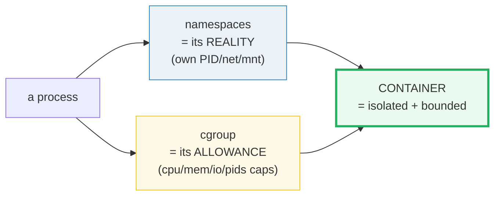
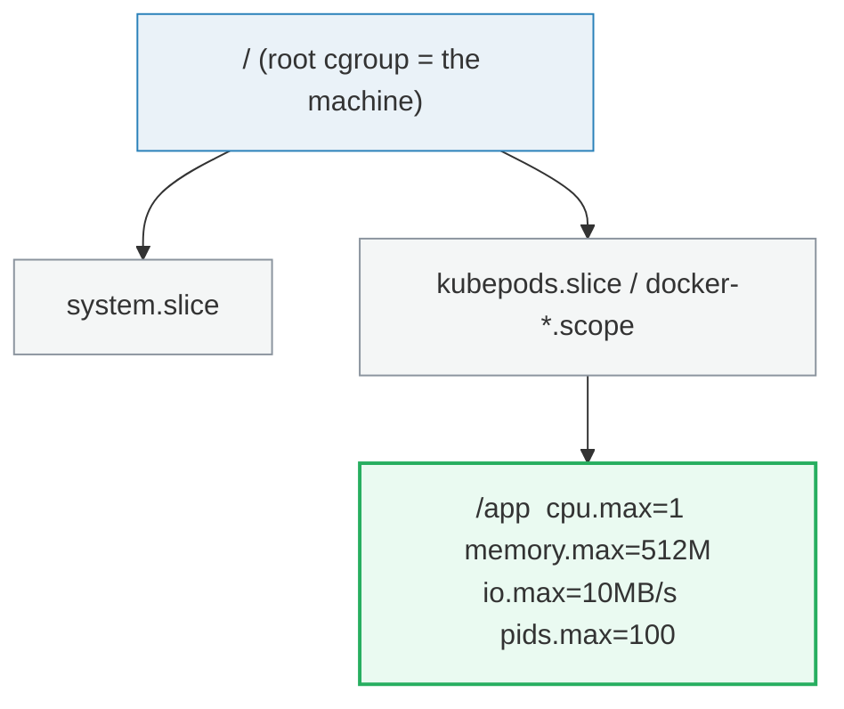
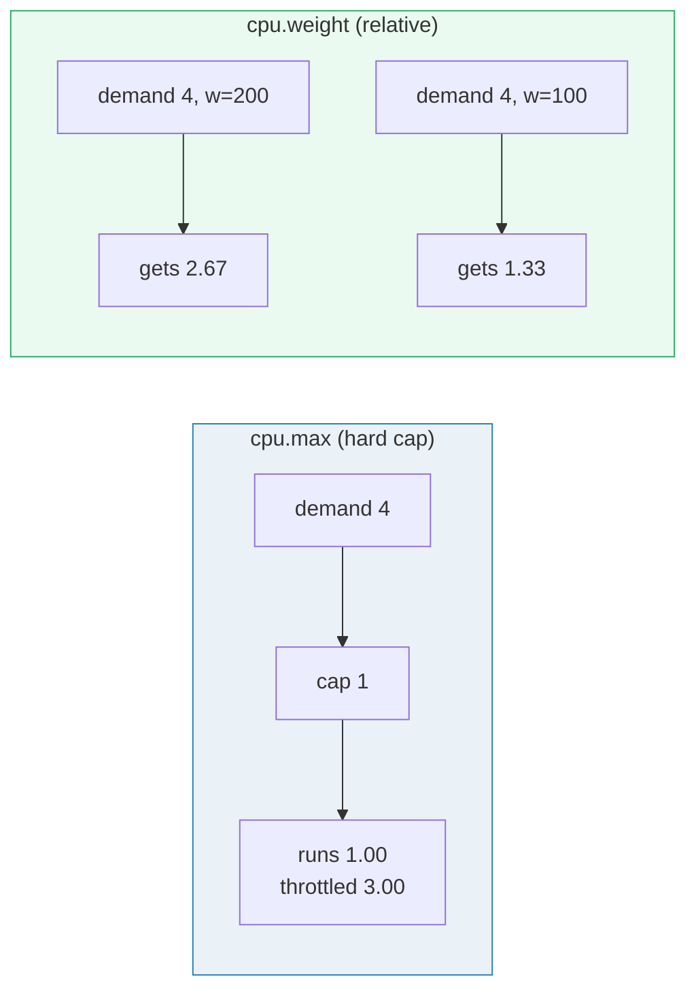
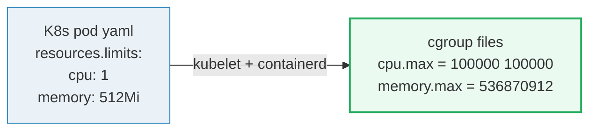

# Linux cgroups — A Visual, Worked-Example Guide

> **Companion code:** [`cgroups.py`](./cgroups.py). **Every number in this guide
> is printed by `uv run python cgroups.py`** — change the code, re-run, re-paste.
> Nothing here is hand-computed.
>
> **Sibling guide:** [`NAMESPACES.md`](./NAMESPACES.md) — namespaces *isolate*,
> cgroups *limit*. **A container = namespaces + cgroups.**
>
> **Live animation:** [`cgroups.html`](./cgroups.html) — open in a browser.
>
> **Source material:** `HOW_TO_RESEARCH.md`, the `cgroups(7)` man page, the
> cgroup v2 kernel docs (`Documentation/admin-guide/cgroup-v2.rst`), and the
> Docker / Kubernetes resource-limit docs.

---

## 0. TL;DR — the whole idea in one picture

### Read this first — the bouncer at the all-you-can-eat buffet

[Namespaces](./NAMESPACES.md) give a process its own *reality*: its own PID 1,
its own `eth0`, its own `/`. But a process with a private reality can still **eat
the whole machine** — fork 100 000 children, fill all the RAM, peg all 8 cores.
That is a denial-of-service, not isolation.

**A cgroup is a bouncer.** It does not change what the process *sees*; it changes
how much it is **allowed to take**. "This group may use at most 1 CPU, 512 MB of
RAM, 100 processes, and 10 MB/s of disk." The kernel enforces it with a **counter
per group**: every charge (a page of RAM, a scheduler tick, a fork) is added to
the group's total, and when the total would exceed the limit the kernel refuses
— throttles the CPU, denies the fork, or (for memory) kills a process via the OOM
killer.



- **A container = namespaces (its reality) + cgroups (its allowance).** Docker's
  `--cpus 1 --memory 512m` and K8s' `resources.limits` literally write cgroup
  files: `cpu.max`, `memory.max`, `pids.max`.
- The two are **orthogonal and composable**. You can have namespaces without
  cgroups (a `unshare` shell with no limits) or cgroups without namespaces
  (limiting a systemd service). A container uses **both**.

> **One-line definition:** a *cgroup* maintains a per-group resource counter; when
> a charge would exceed a configured limit the kernel throttles, refuses, or
> kills. The invariant it enforces is **usage ≤ limit** on every axis.

### Glossary (every term used below)

| Term | Plain meaning |
|---|---|
| **cgroup** | a "booth" the kernel keeps a resource counter for. Processes are placed into a booth (written into `cgroup.procs`). Hierarchical |
| **controller** | one resource type the booth counts: `cpu`, `memory`, `io`, `pids`, … |
| **cpu.max** | v2 file. Format `"quota period"`. `"50000 100000"` = 0.5 CPU. `"max 100000"` = unlimited |
| **cpu.weight** | v2 file (1–10000, default 100). **Relative** share used only when booths contend for busy CPU. Not a hard limit |
| **memory.max** | v2 file. Hard bytes ceiling. Exceeding it triggers the **OOM killer** (a process is killed, not just refused) |
| **io.max** | v2 file. Per-device rate limits: `rbps`/`wbps` (bytes/s), `riops`/`wiops` (ops/s) |
| **pids.max** | v2 file. Max process count in this booth. A fork that would exceed it returns **EAGAIN** |
| **throttle** | CPU controller **pauses** a task when its quota is spent this period, resumes next period |
| **OOM** | Out-Of-Memory. The memory controller **kills** a process (the "oom victim") to bring usage under `.max` |
| **v1 vs v2** | v1 = one hierarchy per controller; v2 = one unified hierarchy (systemd, Docker, K8s all use v2) |

---

### The technical TL;DR



| controller | Docker / K8s flag | v2 file written | enforcement |
|---|---|---|---|
| **cpu** | `--cpus 1` / `limits.cpu` | `cpu.max = "100000 100000"` | throttle (pause) |
| **cpu** | `--cpu-shares 512` / `requests.cpu` | `cpu.weight = 512` | relative share |
| **memory** | `--memory 512m` / `limits.memory` | `memory.max = 536870912` | OOM kill |
| **io** | `--device-read-bps` | `io.max = "8:16 rbps=10485760"` | throttle |
| **pids** | `--pids-limit 100` | `pids.max = 100` | fork refused (EAGAIN) |

---

## 1. The lineage — v1 (per-controller) → v2 (unified)

| | **cgroup v1** (2007, 2.6.24) | **cgroup v2** (2016, 4.5) |
|---|---|---|
| hierarchy | one tree **per controller** (cpu, memory, … in separate trees) | **single unified** tree |
| problem | a task could be in different nodes of the cpu tree vs the memory tree — confusing semantics | one place per task; controllers enabled per-node |
| files | `cpu.cfs_quota_us`, `memory.limit_in_bytes`, `blkio.*` | `cpu.max`, `memory.max`, `io.max`, `pids.max` |
| used by | legacy | **systemd, Docker, containerd, K8s** (everyone today) |

Modern systems boot with cgroup v2 mounted at `/sys/fs/cgroup`. Every cgroup is a
**directory**; limits are **files** you write into; accounting is files you read.

---

## 2. SECTION A — the v2 hierarchy and the Docker/K8s mapping

`uv run python cgroups.py` → **SECTION A** prints the tree:

```
/sys/fs/cgroup/kubepods.slice/pod-abc/c1/
    cgroup.procs        <- PIDs placed in this booth
    cpu.max             <- 'quota period'  (hard cap)
    cpu.weight          <- relative share under contention
    memory.max          <- bytes ceiling
    io.max              <- per-device rbps/wbps/riops/wiops
    pids.max            <- max process count
    cpu.stat            <- 'throttled_usec ...' (accounting)
```

**Limits inherit down:** a child booth can be *tighter* than its parent, but
never looser. The root cgroup (the whole machine) is the absolute ceiling.

The flags you actually type map directly to files:

```
docker run --cpus 1          ->  cpu.max     = '100000 100000'
docker run --cpu-shares 512  ->  cpu.weight  = 512
docker run --memory 512m     ->  memory.max  = 536870912
docker run --pids-limit 100  ->  pids.max    = 100
K8s limits.memory: 512Mi     ->  memory.max  = 536870912
```

---

## 3. SECTION B — CPU: hard cap (`cpu.max`) vs relative share (`cpu.weight`)

Two independent knobs that feel similar but enforce **very different** things:

- **`cpu.max`** — a **hard cap**. The cgroup is literally **paused** once it has
  used `quota/period` CPUs in a period. Guaranteed ceiling.
- **`cpu.weight`** — **relative**. Only matters when two+ cgroups **fight** over
  the same busy CPU. Splits spare capacity by weight. No cap.

The model uses **weighted max-min fair allocation with hard caps** — the CFS
behaviour in one pass. Four demos (machine = 4 CPUs = 4000 m):

| demo | config | result |
|---|---|---|
| **1** cap, no contention | A capped at 1 CPU, idle box | A runs 1.00, throttled 3.00, idle 3.00 |
| **2** two caps | A & B each capped at 1 CPU | A=1.00, B=1.00, idle 2.00 (caps bind) |
| **3** only weights | A w=200, B w=100, no caps | A = 4·200/300 = **2.67**, B = **1.33** |
| **4** cap + weights | A capped 1 CPU; B,C no cap, equal weight | A=1.00, B=1.50, C=1.50 |



> **Pitfall:** `--cpus` (cap) and `--cpu-shares` (weight) are **not**
> interchangeable. A cap of 1 CPU holds even on an idle 64-core box; a weight of
> 512 means nothing when nothing else is running. K8s `requests` map to weight
> (scheduling + share), `limits` map to `cpu.max` (the hard cap).

`[check] DEMO 4 accounting: A+B+C used = 4.00 CPU == capacity 4.00 CPU -> OK`

---

## 4. SECTION C — memory: `memory.max` and the OOM killer

`memory.max` is a **hard bytes ceiling**. Unlike CPU throttling (which *pauses* a
task and resumes it next period), going over `memory.max` **cannot be paused** —
the kernel must free memory *immediately*, so it invokes the **OOM killer**, which
`SIGKILL`s a process in the cgroup.

```
cgroup /app, memory.max = 512 MB. Workload allocates in 100 MB steps:

  step  alloc MB  usage    event
  1     100       100      OK
  2     200       200      OK
  ...
  5     500       500      OK
  6     600       512      OOM KILL (x1)
```

After OOM, usage is pinned at `memory.max` (512 MB); the killed process is gone
and the survivors continue. The accounting invariant holds: at **no** step did
usage exceed `memory.max`.

> **Why OOM-kill and not throttle?** RAM is not a renewable per-period resource
> like CPU time — once a page is allocated it stays allocated until freed. The
> only way back under the limit is to free memory, and the fastest way to free it
> is to kill whoever is holding it.

---

## 5. SECTION D — io (blkio): `io.max` (rbps / riops)

The `io` controller caps throughput to a block device, **per cgroup**. The v2
file `io.max` takes `rbps wbps riops wiops`, each `max` or a number. This
protects the **shared disk** from one noisy container saturating it:

```
cgroup /batch, io.max rbps = 10485760 B/s (= 10 MB/s).
  demand         : 50 MB
  device raw rate: ~500 MB/s (no limit -> would finish in 0.1 s)
  io.max rbps    : 10 MB/s
  -> effective   : 10 MB/s, 50 MB takes 5.0 s
```

The kernel delays each read so the rolling rate never exceeds `rbps`. This is
**throttling** (like CPU), not killing — the I/O completes, just slowly. Same
idea for `riops` (random IOPS) on SSDs.

---

## 6. SECTION E — pids: `pids.max`, the fork-bomb fuse

A classic fork bomb (`:(){ :|:& };:`) doubles processes every generation. Without
a limit it exhausts the PID table and wedges the box. `pids.max` is the fuse: a
fork that would push the cgroup's process count over the limit returns **EAGAIN**
(the fork is **refused**, not killed):

```
cgroup /untrusted, pids.max = 100.
  gen  processes   event
  1    2           OK
  2    4           OK
  ...
  7    100         OK
  8    100         FORK REFUSED (EAGAIN)
```

The bomb hits the ceiling at 100 processes and every further fork is refused.
The host is untouched — the limit is **per-cgroup**, so the fork bomb cannot
escape `/untrusted`.

---

## 7. SECTION F — the GOLD check: `usage ≤ limit` on every axis

The single invariant that defines correct cgroup behaviour: **no cgroup ever
consumes more than its configured limit, on ANY axis.** If this ever fails, a
container has escaped its cage.

One realistic container (`/app`: 1 CPU, 512 MB, 100 pids, 10 MB/s), run against a
contending sibling and a memory + fork workload:

```
controller  limit          usage          result
cpu         1.00 CPU       1.00 CPU       OK
memory      512 MB         512 MB         OK
io          10 MB/s        10 MB/s        OK
pids        100            100            OK

[check] resource-accounting invariant (usage <= limit, all 4 axes): OK
```

The pinned gold values (recomputed live in `cgroups.html`):

| quantity | value |
|---|---|
| app cpu used / limit | `1000 / 1000` m (1 CPU, hard-capped) |
| app memory used / limit | `512 / 512` MB (pinned post-OOM) |
| app OOM kills | `1` (at the 600 MB step) |
| app pids current / max | `100 / 100` (pegged at ceiling) |
| io effective | `10 MB/s` (== io.max) |
| axes satisfying `usage ≤ limit` | `4 / 4` |

---

## 8. How this connects to Docker / Kubernetes

Every container's limits land as cgroup files under
`/sys/fs/cgroup/.../<container>/`. To debug a throttled or OOM-killed pod you read
those files directly:

- `cpu.stat` → `nr_throttled`, `throttled_usec` (was the pod CPU-throttled?)
- `memory.events` → `oom_kill`, `oom` counters (was it OOM-killed?)
- `memory.current` / `memory.max` → how close to the ceiling
- `pids.current` / `pids.max` → fork-bomb status



What you call "a container" is, from the kernel's point of view, **just a process
whose six nsproxy pointers point at six fresh namespace inodes** ([NAMESPACES.md](./NAMESPACES.md))
**plus a cgroup directory whose four limit files cap its CPU, RAM, IO and process
count**. Namespaces isolate; cgroups limit. Both together make a container.

---

## Sources

- `cgroups(7)`, `cgroup_namespaces(7)` man pages
- kernel docs: `Documentation/admin-guide/cgroup-v2.rst`
- Docker resource constraints docs; Kubernetes `requests`/`limits` docs
- `cgroups.py` (this bundle) — the executable source of truth
