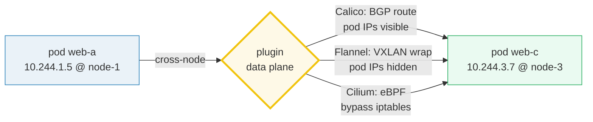

# CNI — the Container Network Interface — A Visual, Worked-Example Guide

> **Companion code:** [`cni.py`](./cni.py). **Every number, routing trace, and
> policy verdict in this guide is printed by `python3 cni.py`** — change the
> code, re-run, re-paste. Nothing here is hand-computed.
>
> **Live animation:** [`cni.html`](./cni.html) — open in a browser; it re-runs
> the identical routing functions and checks against the `.py` gold.
>
> **Source material:** the CNI spec (containernetworking/cni), Calico docs
> (docs.tigera.io), Flannel (github.com/flannel-io/flannel), Cilium (cilium.io),
> and the Kubernetes pod-networking requirement that *every pod reaches every
> other pod without NAT*.

---

## 0. TL;DR — the whole idea in one picture

### Read this first — the post office with three delivery styles

A Kubernetes pod needs a real, cluster-wide-unique IP so any pod can talk to any
other pod **without NAT**. **CNI** is the spec the kubelet calls at pod-create
time to wire that up. The kubelet hands the plugin a network namespace and says
"give this pod an IP and make it reachable." The plugin does two jobs: **IPAM**
(assign an IP from the node's pod CIDR) and **networking** (plug the pod into
the fabric).

Each node is handed a **pod CIDR** — a `/24` slice of the cluster's pod network
(node-1 owns `10.244.1.0/24`, node-2 owns `10.244.2.0/24`, …). Pods on a node
draw their IPs from that node's slice, so a pod IP **tells you which node it
lives on** (`10.244.3.x` → node-3).

The three plugins differ in **how a packet crosses from one node's pod CIDR to
another's**:



> **One-line definition:** *CNI* is the kubelet-invoked plugin contract that
> assigns each pod an IP from its node's pod CIDR and wires the pod into the
> cluster fabric. **Calico** routes directly (BGP), **Flannel** tunnels (VXLAN),
> **Cilium** routes directly but in eBPF (no iptables).

### Glossary (every term used below)

| Term | Plain meaning |
|---|---|
| **CNI** | Container Network Interface — a spec for a small plugin API (ADD/DEL/CHECK) the kubelet calls to wire pod networking |
| **pod CIDR** | the IP range a node draws pod IPs from (here a `/24`). Cluster pod network `10.244.0.0/16` |
| **IPAM** | IP Address Management — the CNI sub-plugin that allocates a pod IP from the pod CIDR |
| **BGP** | Border Gateway Protocol — Calico uses it so each node tells peers "send me `10.244.X.0/24`" |
| **VXLAN** | encapsulates a whole L2 frame inside UDP. Flannel default; port 8472 (Linux) / 4789 (IANA) |
| **eBPF** | extended BPF — kernel programs at TC/XDP hooks. Cilium uses them to route + enforce policy **without iptables** |
| **veth pair** | the virtual cable between a pod's netns (`eth0`) and the node's bridge/tunnel (`cni0`, `flannel.1`) |
| **network policy** | a `NetworkPolicy` object controlling pod-to-pod reachability by label selector. Default = allow all |

---

## 1. Pod CIDR allocation + IPAM — Section A output

The controller-manager carves the cluster pod network (`10.244.0.0/16`) into
per-node `/24` pod CIDRs and hands one to each node:

> From `cni.py` **Section A**:
>
> | node | eth0 (underlay) | pod CIDR | gw (.1) |
> |---|---|---|---|
> | node-1 | 192.168.1.11 | 10.244.1.0/24 | 10.244.1.1 |
> | node-2 | 192.168.1.12 | 10.244.2.0/24 | 10.244.2.1 |
> | node-3 | 192.168.1.13 | 10.244.3.0/24 | 10.244.3.1 |
>
> A pod IP's third octet names the node: `10.244.1.5` → node-1, `10.244.3.7` →
> node-3. The **host-local** IPAM plugin leases each IP as a file under
> `/var/lib/cni/network/` so a restart never double-allocates. node-1's pool:
> gateway `10.244.1.1`, leased `['10.244.1.5', '10.244.1.9']`,
> `next_free() → 10.244.1.2`.

**The CNI chain:** at pod-create the kubelet invokes the plugin config in
`/etc/cni/net.d/` (the first file alphabetically wins). A config's `plugins`
array runs **in order** — typically `[network plugin, IPAM, meta-plugin]`.

---

## 2. Calico (BGP) — direct routing, pod IPs visible — Section B output

Each node runs a BGP agent that **advertises its pod CIDR** to peers, so every
kernel learns a real route to every remote pod CIDR:

> From `cni.py` **Section B** — BGP advertisements:
>
> | node | advertises | learned route on other nodes |
> |---|---|---|
> | node-1 | 10.244.1.0/24 | 10.244.1.0/24 via 192.168.1.11 |
> | node-2 | 10.244.2.0/24 | 10.244.2.0/24 via 192.168.1.12 |
> | node-3 | 10.244.3.0/24 | 10.244.3.0/24 via 192.168.1.13 |
>
> Cross-node trace `web-a@node-1 → web-c@node-3` (6 hops, **inner packet
> unchanged end-to-end**, 0 encap):
>
> ```
> pod/web-a eth0 10.244.1.5 @ node-1
> node-1 kernel route table @ 192.168.1.11   (BGP route: 10.244.3.0/24 via 192.168.1.13)
> node-1 eth0 192.168.1.11 -> node-3 eth0 192.168.1.13
> node-3 kernel route table @ 192.168.1.13   (10.244.3.0/24 is LOCAL)
> node-3 cni0 -> veth vethC1
> pod/web-c eth0 10.244.3.7 @ node-3
> ```

**Key point:** Calico is **routable**, not overlay — the underlay sees pod IPs
in src/dst. Policy is enforced by Calico's iptables (or eBPF) data plane on each
node.

---

## 3. Flannel (VXLAN) — L2 overlay, packets encapsulated — Section C output

Flannel's default backend wraps each cross-node L2 frame in a **UDP/8472**
envelope (VNI 1). The underlay sees only node-to-node traffic; **pod IPs are
hidden inside the tunnel**. `flannel.1` is the VXLAN tunnel interface; a
forwarding DB (FDB) maps each remote pod CIDR to the remote node's eth0.

> From `cni.py` **Section C** — cross-node trace `web-a@node-1 → web-c@node-3`
> (7 hops, **inner packet unchanged**, 1 encap + 1 decap):
>
> ```
> pod/web-a eth0 10.244.1.5 @ node-1
> node-1 flannel.1 (VXLAN tunnel iface)
> VXLAN encap VNI 1 @ node-1     [ENCAP]  OUTER 192.168.1.11 -> 192.168.1.13
> underlay: 192.168.1.11 -> 192.168.1.13 (node-1->node-3)
> VXLAN decap @ node-3           [ENCAP]
> node-3 flannel.1 -> cni0
> pod/web-c eth0 10.244.3.7 @ node-3
> ```

> ⚠️ **Port quirk:** Flannel uses **8472** (the Linux default VXLAN port), not
> 4789 (the IANA standard). `host-gw` mode routes directly like Calico when L2
> reachability exists; VXLAN is the fallback for L3-only nodes.

---

## 4. Cilium (eBPF) — bypass iptables, direct kernel routing — Section D output

Cilium (native-routing mode) routes pod-to-pod **directly like Calico**, but the
data plane is an **eBPF program** attached to the NIC's TC hook. The packet is
routed + policy-checked **inside BPF** and never enters the
iptables/netfilter traversal. In **kube-proxy-replacement** mode Cilium even
removes kube-proxy entirely (see [`kube_proxy.py`](./kube_proxy.py)).

> From `cni.py` **Section D** — cross-node trace `web-a@node-1 → web-c@node-3`
> (6 hops, **inner packet unchanged**, 0 encap, iptables **bypassed**):
>
> ```
> pod/web-a eth0 10.244.1.5 @ node-1
> node-1 eBPF (TC egress) @ 192.168.1.11   (BPF route map; BYPASS iptables)
> node-1 eth0 192.168.1.11 -> node-3 eth0 192.168.1.13
> node-3 eBPF (TC ingress) @ 192.168.1.13 (no conntrack/iptables walk)
> node-3 -> veth vethC1
> pod/web-c eth0 10.244.3.7 @ node-3
> ```

---

## 5. Network policy — default allow vs default deny + labels — Section E output

A `NetworkPolicy` object controls pod-to-pod reachability by **label selector**.
The semantics:

- **Default** (no policy selects the dst pod) → **ALLOW ALL** ingress.
- Once any policy selects the dst, the dst goes into **default-deny**; traffic
  is allowed **only** if some selecting policy has a `fromSelector` that matches
  the src's labels.

> From `cni.py` **Section E** — dst is `db-0` (app=db, tier=backend):
>
> | src | src labels | verdict | reason |
> |---|---|---|---|
> | web-a | app=web, tier=frontend | ALLOW | frontend matches |
> | web-b | app=web, tier=frontend | ALLOW | frontend matches |
> | db-0 | app=db, tier=backend | DENY | no allow rule |
>
> With **no policy**: `web-a → db-0` = ALLOW (default allow all). With the
> `db-allow-frontend` policy (`app=db` selected, allow `tier=frontend`): frontend
> pods still reach db-0, but `db → db` is **DENIED** (tier=backend ≠ frontend).

---

## 6. GOLD — pinned routing paths per plugin (the bundle's gold-check)

The bundle's gold-check is **pod-to-pod routing path correct for each plugin
type**. `cni.py` pins one cross-node trace per plugin
(`web-a@node-1 → web-c@node-3`); [`cni.html`](./cni.html) recomputes the node
sequence + encap count in JS and checks against the `.py` gold:

> From `cni.py` **GOLD** summary:
>
> | # | plugin | hops | inner packet | encap (encap+decap) |
> |---|---|---|---|---|
> | 1 | Calico (BGP) | 6 | unchanged | 0 |
> | 2 | Flannel (VXLAN) | 7 | unchanged | 2 |
> | 3 | Cilium (eBPF) | 6 | unchanged | 0 |
>
> `[check] all 3 gold traces reproduced from the routing functions: OK`

> 🔗 The `.html` reproduces each plugin's hop list and asserts the green
> `check: OK` badge — see the bottom of `cni.html`. Calico & Cilium share
> **direct routing** (0 encap); Flannel is the only one that **encapsulates**
> (1 encap + 1 decap). All three leave the **inner pod packet unchanged**.

---

## 7. Pitfalls & debugging checklist

| # | Mistake | Symptom | Fix |
|---|---|---|---|
| 1 | Wrong CNI config chosen | unexpected plugin behavior | `/etc/cni/net.d/` — first file alphabetically wins; check the active one |
| 2 | Pod IP unreachable cross-node | Calico: BGP not peered | Check `calicoctl node status`; BGP sessions must be Established |
| 3 | Flannel MTU issues | large packets dropped | VXLAN adds 50 bytes overhead; lower the interface MTU (e.g. 1450) |
| 4 | Expecting policy = secure by default | everything reachable | No NetworkPolicy = ALLOW ALL; add a default-deny first |
| 5 | Cilium + kube-proxy both running | double Service load balancing | Enable `kubeProxyReplacement` to let Cilium own it and remove kube-proxy |
| 6 | Node pod CIDR exhausted | pods stuck in ContainerCreating | enlarge the cluster CIDR or shrink `hostPrefix` to free more /24s |

---

## 8. Cheat sheet

- **CNI** = the kubelet-invoked plugin contract: assign a pod IP (IPAM) + wire the fabric.
- **Pod CIDR per node** — third octet names the node (`10.244.X.Y → node X`).
- **Calico** = BGP; direct routing, pod IPs visible, **0 encap**.
- **Flannel** = VXLAN default; L2 overlay, pod IPs hidden in UDP/8472, **1 encap + 1 decap**.
- **Cilium** = eBPF; direct routing but **bypasses iptables** (kube-proxy-replacement removes kube-proxy).
- **NetworkPolicy**: default = allow all; a selecting policy flips the pod to default-deny; only matching `fromSelector` opens a hole.
- **GOLD:** 3 plugin traces (6/7/6 hops), inner packet unchanged; encap = 0 / 2 / 0 (matches `.html`).

---

## Sources

- **CNI spec** — containernetworking/cni, *CNI v1.1.0 Specification*.
  https://github.com/containernetworking/cni/blob/main/SPEC.md
  - Verified: the runtime (kubelet) calls `ADD`/`DEL`/`CHECK` with a config +
    network namespace; plugins chain in `plugins` array order.
- **Calico** — Tigera, *Calico networking*.
  https://docs.tigera.io/calico/latest/about/about-calico
  - Verified: "Calico uses BGP" to advertise pod CIDRs; native routing (routable
    pod IPs), no overlay required.
- **Flannel** — flannel-io.
  https://github.com/flannel-io/flannel
  - Verified: default backend is VXLAN (UDP/8472); `host-gw` for direct routing.
- **Cilium** — Isovalent, *Cilium architecture* + *kube-proxy replacement*.
  https://docs.cilium.io
  - Verified: eBPF data plane attached at TC; "kube-proxy free" mode replaces
    kube-proxy with in-BPF service load balancing.
- **Kubernetes pod networking** — kubernetes.io, *Cluster Networking*.
  https://kubernetes.io/docs/concepts/services-networking/
  - Verified: the requirement that "pods can communicate with all other pods
    without NAT."
