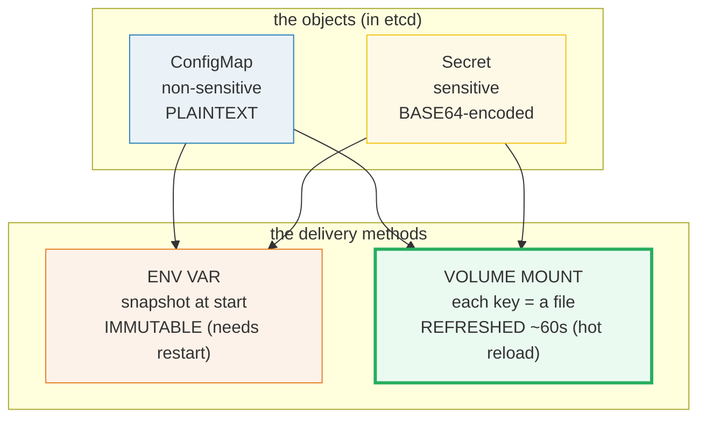
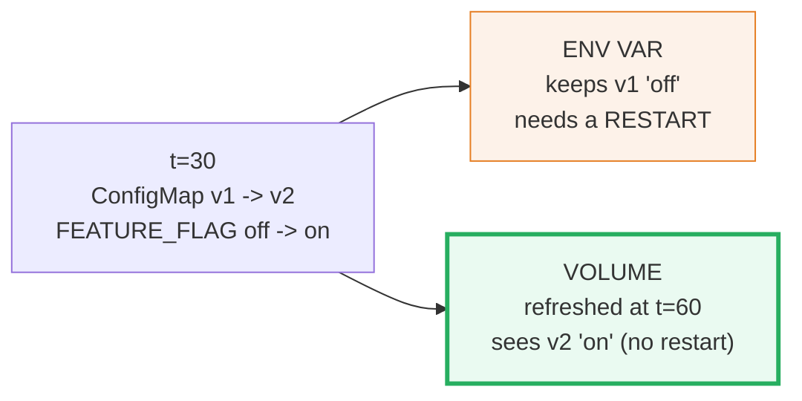
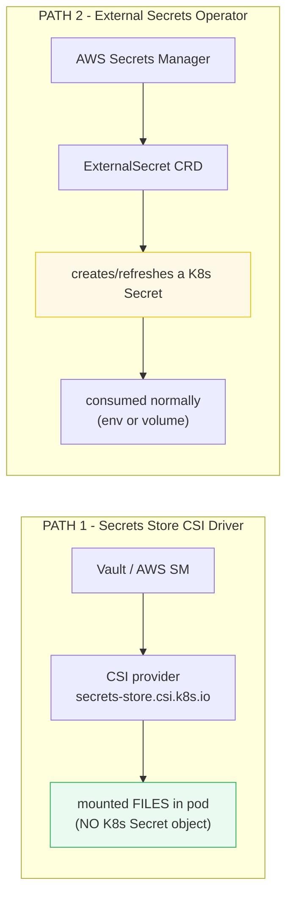

# Kubernetes ConfigMap & Secret — A Visual, Worked-Example Guide

> **Companion code:** [`configmap_secret.py`](./configmap_secret.py). **Every
> base64 value, runtime snapshot, and reload timeline in this guide is printed by
> `python configmap_secret.py`** — change the code, re-run, re-paste. Nothing
> here is hand-computed.
>
> **Live animation:** [`configmap_secret.html`](./configmap_secret.html) — open
> in a browser; it recomputes the injection pipeline and reload timeline in JS
> and runs the same gold check as the `.py`.
>
> **Source material:** kubernetes.io — *ConfigMaps*, *Secrets*, *Configure a Pod
> to Use a ConfigMap/Secret*; external-secrets.io; 12factor.net (Config).

---

## 0. TL;DR — two objects × two delivery methods

An app needs **configuration** (a DB host, an API key, a TLS cert). In Kubernetes
that config lives **outside the image**, in one of two objects, delivered by one
of two methods.



- **ConfigMap** — *non-sensitive* data, stored plain in etcd (`DB_HOST=10.0.0.5`).
- **Secret** — *sensitive* data, stored **base64-encoded** in etcd. Types:
  `Opaque` (generic), `kubernetes.io/dockerconfigjson` (registry creds),
  `kubernetes.io/tls` (cert+key).
- **Env var** — injected as a process env var; a **snapshot** at container start,
  **immutable** for the process's life (a change needs a pod restart).
- **Volume mount** — each key becomes a **file**; the kubelet **periodically
  refreshes** it (~60s), so a change lands **without a restart** (hot reload).

> **One-line rules:**
> - env var = snapshot → a config change requires a **restart**.
> - volume = live files → a config change is a **hot reload** (~60s).
> - Secret base64 is **transport/storage only**; inside the pod it is **decoded
>   to plaintext**, and Secret volumes land on a **tmpfs** (never on disk).

### Glossary

| Term | Plain meaning |
|---|---|
| **ConfigMap** | non-sensitive config object (key/value or key/file) |
| **Secret** | sensitive config object; values base64-**encoded** in etcd |
| **Opaque** | the generic Secret type (arbitrary key/value) |
| **docker-registry** | `kubernetes.io/dockerconfigjson` — authenticates to a private registry |
| **TLS** | `kubernetes.io/tls` — holds `tls.crt` + `tls.key` |
| **env var** | config injected as a process env var — **immutable** after start |
| **volume mount** | config injected as files under a path — **refreshed** periodically |
| **tmpfs** | an in-RAM filesystem; Secret volumes land here (never on node disk) |
| **hot reload** | a config change reaching a running container (volumes only) |
| **12-factor app** | "store config in the environment" — config lives outside code |
| **ExternalSecret** | a CRD (external-secrets-operator) syncing a secret from Vault/AWS SM into a K8s Secret |
| **CSI driver** | `secrets-store.csi.k8s.io` — mounts external secrets as a volume **without** creating a K8s Secret |

---

## 1. ConfigMap — create from literal/file, mount two ways — Section A

```bash
kubectl create configmap app-config \
  --from-literal=DB_HOST=10.0.0.5 \
  --from-literal=LOG_LEVEL=info \
  --from-file=app.yaml
```

> From `configmap_secret.py` **Section A** — the ConfigMap data:
>
> | key | value |
> |---|---|
> | `DB_HOST` | `10.0.0.5` |
> | `LOG_LEVEL` | `info` |
> | `app.yaml` | `listen: 8080\n...` |

Same object, **two delivery paths** into the pod:

| method | manifest | what the app sees |
|---|---|---|
| **env var** (`valueFrom.configMapKeyRef`) | `DB_HOST` from key `DB_HOST` | `os.environ['DB_HOST']` = `10.0.0.5` |
| **volume mount** (`configMap` volume) | mount at `/etc/config` | file `/etc/config/app.yaml` = `listen: 8080\n...` |

`[check]` env `DB_HOST == '10.0.0.5'` AND `/etc/config/app.yaml` present: **OK**.

---

## 2. Secret — base64 in etcd, decoded in the container, tmpfs — Section B

```yaml
apiVersion: v1
kind: Secret
metadata: { name: db-creds }
type: Opaque
stringData:                 # plaintext on input
  username: admin
  password: "s3cr3t!"
```

> From `configmap_secret.py` **Section B** — how it is **stored** (base64) vs how
> the **pod** sees it (decoded):
>
> | key | in etcd (`kubectl get secret -o yaml`) | decoded in pod |
> |---|---|---|
> | `username` | `YWRtaW4=` | `admin` |
> | `password` | `czNjcjN0IQ==` | `s3cr3t!` |

**Secret types:**

| type | holds | used for |
|---|---|---|
| `Opaque` | arbitrary key/value | generic secrets |
| `kubernetes.io/dockerconfigjson` | `.dockerconfigjson` (base64) | private registry pull |
| `kubernetes.io/tls` | `tls.crt` + `tls.key` (base64) | Ingress TLS |

> 🔗 **base64 ≠ encryption.** It is only the etcd/storage representation. Enable
> **encryption-at-rest** for real secrecy. Secret **volumes** are mounted on a
> **tmpfs** (in RAM), so the plaintext is **never written to the node disk**.
>
> `[check]` env `DB_PASSWORD == 's3cr3t!'` (decoded), stored b64 = `czNjcjN0IQ==`: **OK**.

---

## 3. Hot reload — env is IMMUTABLE, volume REFRESHES (~60s) — Section C

A ConfigMap is updated at `t=30`. The two methods react differently:



> From `configmap_secret.py` **Section C** (refresh period 60s, update at t=30):
>
> | t(s) | env `FEATURE_FLAG` (pinned) | file `FEATURE_FLAG` (live) | event |
> |---|---|---|---|
> | 0,10,20,29 | `off` | `off` | — |
> | 30 | `off` | `off` | ConfigMap updated → v2 |
> | 40,50,59 | `off` | `off` | (volume not yet refreshed) |
> | **60** | `off` | **`on`** | kubelet refreshed volume → v2 |
> | 70,90 | `off` | `on` | — |

- **env** stays `off` **forever** (snapshot at t=0); it needs a **restart** to
  become `on`.
- **file** flips `off → on` at **t=60** (the next kubelet sync after the t=30
  update). **No restart** needed.

> 🔗 **Practical rule:** feature flags / throttles you want to flip **without a
> restart** MUST be read from a **volume** (and re-read by the app), never from
> an env var. `cross_tick = ceil(update_t / refresh) × refresh`.

`[check]` env pinned `off` for all t, volume flips at t=60: **OK**.

---

## 4. External secrets — Vault (CSI) vs AWS SM (ExternalSecret) — Section D

You usually do **not** hand-create production secrets. Two patterns feed them
from an external store (Vault, AWS Secrets Manager, GCP SM):



> From `configmap_secret.py` **Section D**:
>
> | path | mechanism | K8s Secret created? | example result |
> |---|---|---|---|
> | **CSI driver** | Vault/AWS → mounted as **files** at `/mnt/secrets-store/` | **NO** | `/mnt/secrets-store/db-password` = `vault-rotated-token-xyz` |
> | **ExternalSecret** | AWS SM → ExternalSecret CRD → **K8s Secret** → env/volume | **YES** | Secret `api-key-synced` = `prod-api-key-abc123` |

- **CSI Driver** — secret **never** becomes a K8s Secret (mount-only); good for
  short-lived, frequently rotated creds.
- **ExternalSecret** — a K8s Secret **is** materialized and refreshed on a
  `refreshInterval` (volumes then see the new value; env still needs a restart).

`[check]` CSI mount + ExternalSecret sync produce correct values: **OK**.

---

## 5. 12-factor app + GOLD — Section E

**12-factor principle III: "Store config in the environment."** Config that
**varies between deploys** (DB host, log level, feature flags) must NOT live in
the image/code — it lives in ConfigMaps/Secrets and is **injected at runtime**.

| | anti-pattern (baked in) | 12-factor (injected) |
|---|---|---|
| code | `DB_HOST = '10.0.0.5'` (hardcoded) | `DB_HOST = os.environ['DB_HOST']` |
| prod vs staging | identical image — BAD | same image, different ConfigMap |

### Gold check (recomputed by `configmap_secret.html`)

A pod with both a ConfigMap and a Secret, delivered as both env and volume:

> From `configmap_secret.py` **Section E** — runtime values:
>
> **runtime env:** `DB_HOST=10.0.0.5`, `LOG_LEVEL=info`, `DB_PASSWORD=s3cr3t!`
> **runtime files:** `/etc/config/DB_HOST=10.0.0.5`, `/etc/config/LOG_LEVEL=info`,
> `/etc/secret/password=s3cr3t!`
>
> | check | result |
> |---|---|
> | env == expected | True |
> | files == expected | True |
> | secret **decoded** in env (not base64) | True |
> | **GOLD: config injection ⇒ correct runtime values** | **OK** |

> **GOLD scalar for the `.html`:** `env['DB_HOST']='10.0.0.5'`,
> `env['DB_PASSWORD']='s3cr3t!'` (decoded), file `/etc/secret/password='s3cr3t!'`,
> base64 of `s3cr3t!` = `czNjcjN0IQ==`.

---

### Sources
- kubernetes.io — *ConfigMaps*, *Secrets*, *Configure a Pod to Use a ConfigMap/Secret*
- external-secrets.io — *External Secrets Operator*; `secrets-store-csi-driver`
- 12factor.net — III. *Config*
- *Kubernetes Patterns* (Ibryam & Huss) — Configuration & Immutable Configuration patterns
