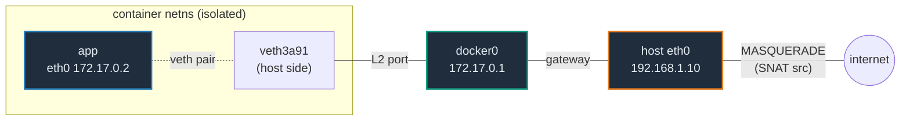

# Container Networking — A Visual, Worked-Example Guide

> **Companion code:** [`container_networking.py`](./container_networking.py).
> **Every topology table, packet trace, NAT rewrite, VXLAN encapsulation, and
> DNS answer in this guide is printed by `python3 container_networking.py`** —
> change the code, re-run, re-paste. Nothing here is hand-computed.
>
> **Live animation:** [`container_networking.html`](./container_networking.html)
> — open in a browser; pick a network mode, step the packet through the
> plumbing, and watch NAT/VXLAN fire at the right hop. The traces are recomputed
> in JS with the *identical* routing logic, gold-checked against the `.py`.
>
> **Source material:** Linux `netns` (`clone(CLONE_NEWNET)`) and `veth` pairs
> (kernel docs); IEEE 802.1D (the MAC bridge docker0 implements);
> netfilter/iptables NAT + conntrack (MASQUERADE/DNAT); RFC 7348 *VXLAN*
> (Mahalingam et al, 2014) — L2-over-UDP-4789 encapsulation; Docker Engine docs
> *Networking overview* + *Bridge networks* + the embedded DNS at `127.0.0.11`;
> the Kubernetes CNI spec.

---

## 0. TL;DR — the apartment building and the mailroom

A **container** is an apartment with **no street address of its own**. To send
or receive packets it borrows the building's infrastructure, and that
infrastructure is exactly what the four network modes choose between:

> *Think of `docker0` as the building's internal **mailroom**. Every apartment
> gets a private extension (`172.17.0.x`). Mail between apartments is sorted in
> the mailroom (L2 forwarding). Mail to the outside world is handed to the front
> desk, which **replaces the sender's extension with the building's public street
> address** (`MASQUERADE`/SNAT), so outsiders never see apartment numbers.*



- **The plumbing is the veth pair** — a virtual Ethernet cable. One end (`eth0`)
  lives in the container's isolated **network namespace**; the other is plugged
  into `docker0`. That single pair is the *only* link between the container's
  private network world and the host (§1).
- **NAT is just two iptables rules**: `MASQUERADE` (egress) rewrites **src**;
  `DNAT` (the `DOCKER` chain, for `-p H:C`) rewrites **dst**. **conntrack**
  remembers each mapping so the reply is reversed — apps see a normal
  connection (§2, §3).
- **`--network` picks the wiring**: `bridge` (default, isolated, needs `-p`),
  `host` (shares host netns, no isolation, fastest), `none` (`lo` only,
  fully sealed), `macvlan` (own MAC/IP on the physical wire, no NAT, can't reach
  the host) (§5).
- **Overlay networks** span hosts with a **VXLAN tunnel** (`UDP/4789`, a 24-bit
  VNI): the same overlay subnet exists on every host, and the inner container
  addresses travel **unchanged** inside the encapsulated frame (§6).
- **DNS** on user-defined networks resolves container *names* via the embedded
  resolver at **`127.0.0.11`** — the default `docker0` bridge does *not* do this
  (§4).

### How Docker actually wires it (all stock Linux)

Docker adds **zero** custom kernel networking code. At `docker run` it composes
standard primitives: a **network namespace** (`clone(CLONE_NEWNET)`), a **veth
pair** (`ip link add type veth`), the **`docker0` Linux bridge**, two **iptables
NAT** rules (`MASQUERADE` + `DNAT`), **conntrack** for reply reversal, and the
**embedded DNS** daemon process answering on `127.0.0.11`. Every mode is a
different combination of these — there is no "Docker network magic," only Linux
networking pointed at the bridge.

### Glossary

| Term | Plain meaning |
|---|---|
| **netns** (network namespace) | an isolated copy of the Linux network stack: own interfaces, routes, iptables, ARP table. A container lives inside one (`ip netns add/exec`). |
| **veth pair** | a virtual Ethernet cable. Two interfaces linked so a packet into one end comes out the other. The bridge between a container netns and the host. |
| **docker0** | the default Linux bridge Docker creates. IP `172.17.0.1`, subnet `172.17.0.0/16`. Every `-d bridge` container plugs a veth into it. |
| **eth0** | inside the container netns, the veth end renamed `eth0`. |
| **SNAT / MASQUERADE** | Source NAT — rewrite the packet's **source** ip/port. Used for egress so replies reach the host. `MASQUERADE` = SNAT to the outgoing interface's address. |
| **DNAT** | Destination NAT — rewrite the packet's **destination** ip/port. Used for `-p host:container` publishing. |
| **conntrack** | the kernel connection-tracking table that records every NAT'd flow so reply packets can be reversed. |
| **VXLAN** | Virtual eXtensible LAN. Encapsulates L2 Ethernet frames inside UDP (port 4789) so two bridges on different hosts act like one L2 segment. 24-bit VNI. |
| **overlay** | a Docker network whose bridge is replicated on every Swarm host and stitched by VXLAN. Containers get IPs in one shared subnet regardless of host. |
| **127.0.0.11** | Docker's embedded DNS resolver, visible inside every container on a user-defined network. |
| **default bridge** | the `docker0` bridge, network named `bridge`. Does **not** resolve container names (legacy). User-defined bridges do. |

---

## 1. The bridge topology — veth pairs plug containers into docker0

The whole bridge model is two ingredients: a **veth pair** per container, and
the **`docker0` Linux bridge** that those pairs plug into.

From `container_networking.py` **Section A**:

```
host eth0 = eth0 @ 192.168.1.10
docker0 = Linux bridge @ 172.17.0.1, subnet 172.17.0.0/16

  | container | eth0 ip   | veth (host side) | netns      |
  |-----------|-----------|-------------------|------------|
  | web       | 172.17.0.2 | veth3a91          | ns-web     |
  | db        | 172.17.0.3 | veth7c22          | ns-db      |
```

From **inside** a container netns, the world looks tiny — just `eth0` and `lo`,
a default route via `docker0`, and `nameserver 127.0.0.11`:

```
ip addr   -> eth0: 172.17.0.2/16,  lo: 127.0.0.1/8
routes    -> default via 172.17.0.1 dev eth0
resolve   -> nameserver 127.0.0.11
```

The isolation is total: the container has its **own** routing table, its **own**
`iptables`, its **own** ARP cache. The veth pair is the only thread connecting
it to the host's `docker0`.

---

## 2. Bridge routing — container-to-container (no NAT), then to the world (MASQUERADE)

### Container → container (same docker0)

When `web` talks to `db` on the same bridge, the packet **never gets translated**.
`docker0` does ordinary L2 forwarding: the container ARPs for `db`'s MAC,
`docker0` already learned which port that MAC lives on, and it forwards the frame
straight there. End-to-end the 4-tuple is identical to what the app sent:

```
REQUEST route (5 hops):
  -> container/web eth0 172.17.0.2     pkt   tcp 172.17.0.2:40000 -> 172.17.0.3:5432
  -> veth veth3a91 (host side)          ...  (unchanged)
  -> docker0 172.17.0.1 (L2 bridge)     ...  bridge forward to the learned port
  -> veth veth7c22 (host side)          ...  into the db netns
  -> container/db eth0 172.17.0.3       ...  NO NAT anywhere
```

> **Invariant (`container_networking.py` Section B):** for same-bridge traffic
> the first hop's packet equals the last hop's packet, and `docker0` appears
> exactly once. `assert hops[0].pkt == hops[-1].pkt`.

### Container → the internet (MASQUERADE / SNAT)

Egress is different: `172.17.0.0/16` is a **private** range, not routable on the
public internet. So as the packet leaves via the host's `eth0`, the
`MASQUERADE` rule in `POSTROUTING` rewrites the **source** to the host's public
IP (and, if the port collides, a new ephemeral port). `conntrack` records the
mapping so the reply can be reversed:

```
REQUEST (web -> 93.184.216.34:80):
  -> container/web eth0 172.17.0.2           tcp 172.17.0.2:40000  -> 93.184.216.34:80
  -> veth veth3a91                           (unchanged)
  -> docker0 172.17.0.1                      (to host gateway)
  -> host eth0 192.168.1.10                  tcp 192.168.1.10:51234 -> 93.184.216.34:80   [NAT]  ← MASQUERADE
  -> internet via eth0                       outsider sees the HOST, never 172.17.0.x

REPLY (conntrack reverses the SNAT):
  -> internet via eth0                       93.184.216.34:80 -> 192.168.1.10:51234
  -> host eth0 192.168.1.10                  93.184.216.34:80 -> 172.17.0.2:40000        [NAT]  ← reverse
  -> container/web eth0 172.17.0.2           delivered; app sees a normal reply
```

---

## 3. Port publishing `-p 8080:80` — DNAT inbound

Publishing a port is the mirror image. `docker run -p 8080:80 web` inserts a
**DNAT** rule in the `DOCKER` chain:

```
iptables -t nat -A DOCKER -p tcp --dport 8080 \
  -j DNAT --to-destination 172.17.0.2:80
```

An external client connects to the **host** at `:8080`; the rule rewrites the
**destination** to the container's `:80` before routing, so the packet is
delivered to `web`. The reply is reverse-DNATed by conntrack (src → host:8080),
so the client sees a normal response:

```
REQUEST (203.0.113.9 -> host:8080 -> web:80):
  -> internet via eth0                       203.0.113.9:50000 -> 192.168.1.10:8080
  -> host eth0 192.168.1.10 (PREROUTING)     203.0.113.9:50000 -> 172.17.0.2:80         [NAT]  ← DNAT
  -> docker0 172.17.0.1 ; veth veth3a91 ; container/web eth0 172.17.0.2   delivered to :80

REPLY (conntrack reverses the DNAT):
  -> container/web eth0 172.17.0.2           172.17.0.2:80 -> 203.0.113.9:50000
  -> host eth0 192.168.1.10 (OUTPUT)         192.168.1.10:8080 -> 203.0.113.9:50000     [NAT]  ← reverse
  -> internet via eth0                       client sees the reply from host:8080
```

> **The whole NAT story in two lines:** `MASQUERADE` rewrites **src** on egress;
> `DNAT` rewrites **dst** on published ingress. `conntrack` owns both reply
> paths. `host` and `macvlan` do **no** NAT (§5).

---

## 4. DNS — the embedded resolver at 127.0.0.11

On a **user-defined** network, the Docker daemon runs a resolver that every
container's `/etc/resolv.conf` points at:

```
container /etc/resolv.conf:
    nameserver 127.0.0.11
```

The daemon knows each container's name → IP on that network, so `web` finds `db`
by **name**, not by hardcoded IP:

```
| query   | resolved ip   |
|---------|---------------|
| web     | 172.18.0.2    |
| db      | 172.18.0.3    |
| cache   | 172.18.0.4    |
resolve('missing') -> NXDOMAIN: missing not on this network
```

This is why you almost always `docker network create appnet` for multi-container
apps instead of using the default `docker0`: the **default bridge does not
resolve names** (a legacy limitation), so on it you'd be stuck hardcoding IPs.

---

## 5. The four network modes side by side

`docker run --network <MODE>` is just a different combination of the same Linux
primitives. The packet *path* and whether NAT happens differ per mode:

| mode | wiring | trade-off |
|---|---|---|
| **bridge** | container netns with eth0+veth → docker0 → NAT | default; isolated; needs `-p` to publish |
| **host** | container **shares** the host netns; app binds host eth0 | fastest; **no isolation**; port conflicts with host |
| **none** | netns with **only `lo`**; no eth0 | fully isolated; app must open its own socket manually |
| **macvlan** | own MAC/IP on the host's physical subnet | L2 on the wire; no NAT; **cannot reach the host** |

```
--- host mode (app@host eth0 -> internet) ---        only 3 hops, no docker0, no NAT
  -> container/app (host netns, no isolation)
  -> host eth0 192.168.1.10
  -> internet via eth0

--- none mode (app -> external, no route) ---         only lo -> DROP
  -> container (no eth0, only lo)
  -> [DROP]    no route to dst; ENETUNREACH

--- macvlan (container@192.168.1.50 -> internet) ---  own MAC, straight to the wire
  -> container/app eth0 192.168.1.50 mac 02:42:c0:a8:01:32
  -> macvlan sub-if on host eth0                     no bridge, no NAT
  -> physical gateway 192.168.1.1
  -> internet via eth0                                host unreachable from here
```

> The `macvlan` gotcha: because the macvlan sub-interface shares the parent NIC,
> the kernel blocks traffic between a container and the host on that interface
> (to avoid L2 loops). The container is reachable from *outside* via the physical
> switch, but **cannot talk to the host it runs on** by default.

---

## 6. Overlay networking — VXLAN spans hosts

For multi-host clusters (Docker Swarm), the **overlay** driver makes one bridge
per network per host and stitches them with a **VXLAN tunnel**. The overlay
subnet (e.g. `10.0.0.0/24`) is the **same** on every host; the *underlay* (the
hosts' real IPs) carries the encapsulated frames:

```
| host  | underlay eth0 | overlay bridge | container | overlay ip |
|-------|---------------|----------------|-----------|------------|
| hostA | 10.0.1.10     | overlay0 10.0.0.1 | app    | 10.0.0.2   |
| hostB | 10.0.1.20     | overlay0 10.0.0.1 | web    | 10.0.0.3   |
```

Cross-host routing encapsulates the **entire L2 frame** inside a UDP/4789 packet
addressed underlay-A → underlay-B. The inner overlay addresses travel
**unchanged**:

```
OVERLAY CROSS-HOST route (7 hops), app@hostA -> web@hostB:
  -> container/app eth0 10.0.0.2 @ host hostA         inner: 10.0.0.2 -> 10.0.0.3
  -> overlay0 10.0.0.1 @ host hostA                   dst MAC is remote -> VXLAN tunnel
  -> VXLAN encap VNI 25678 @ host hostA               OUTER 10.0.1.10->10.0.1.20  [ENCAP]
  -> underlay: 10.0.1.10 -> 10.0.1.20                  tunnel routed over the PHYSICAL net
  -> VXLAN decap @ host hostB                          UDP/4789 stripped; L2 frame restored [ENCAP]
  -> overlay0 10.0.0.1 @ host hostB
  -> container/web eth0 10.0.0.3 @ host hostB          inner addresses unchanged
```

> **Invariant (`container_networking.py` Section F):** the inner packet at hop 0
> equals the inner packet at the last hop — overlay does **not** NAT, it
> encapsulates. `assert hops[0].pkt == hops[-1].pkt`.

---

## GOLD — pinned routing path per mode

`container_networking.py` **Section GOLD** routes one representative request in
each mode and pins the node sequence. `container_networking.html` recomputes
these from the *identical* logic; the green `check: OK` badge confirms a
node-for-node match. This is the single ground truth the whole bundle cites.

| # | mode / direction | hops | NAT / encap |
|---|---|:---:|---|
| 1 | bridge c2c (web→db) | 5 | no NAT |
| 2 | bridge c2ext (web→internet) | 5 | MASQUERADE SNAT |
| 3 | publish -p 8080:80 (ext→web) | 5 | DNAT |
| 4 | host mode (app→internet) | 3 | no NAT |
| 5 | none mode (→external) | 2 | DROP |
| 6 | macvlan (192.168.1.50→internet) | 4 | no NAT |
| 7 | overlay cross-host (app@A→web@B) | 7 | VXLAN encap, inner no NAT |

```
[check] all 7 gold traces reproduced from the routing functions: OK
```

---

### Further reading

- Docker docs — *Networking overview*, *Bridge networks*, *Overlay networks*,
  *Use bridge networks* (the `127.0.0.11` embedded DNS).
- Linux man pages — `ip-netns(8)`, `ip-link(8)` (`type veth`, `type bridge`),
  `iptables-extensions(8)` (`MASQUERADE`, `DNAT`), `conntrack(8)`.
- RFC 7348 — *Virtual eXtensible Local Area Network (VXLAN)*, Mahalingam et al,
  2014 (the `UDP/4789` + 24-bit VNI encapsulation).
- The CNI spec — the plugin interface Kubernetes uses to wire pods (a sibling
  abstraction over the same Linux primitives).
