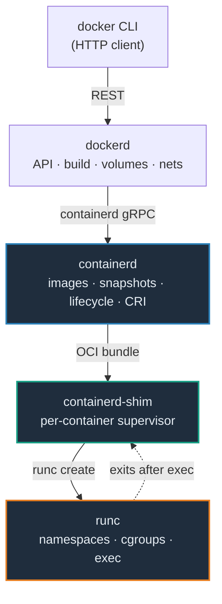

# Container Runtime — A Visual, Worked-Example Guide

> **Companion code:** [`container_runtime.py`](./container_runtime.py). **Every
> layer table, OCI spec, snapshot chain, CRI method, and runtime comparison in
> this guide is printed by `python3 container_runtime.py`** — change the code,
> re-run, re-paste. Nothing here is hand-computed.
>
> **Live animation:** [`container_runtime.html`](./container_runtime.html) — open
> in a browser; step through the `docker run` stack, toggle namespaces and watch
> `config.json` rebuild, and see the overlayfs layers merge into rootfs. The OCI
> spec and overlay mount are recomputed in JS with the *identical* logic,
> gold-checked against the `.py`.
>
> **Source material:** the OCI Runtime Spec + Image Spec
> (`opencontainers/runtime-spec`, `opencontainers/image-spec`); `runc`
> (`opencontainers/runc`, spun out of libcontainer, 2015); `containerd`
> (`containerd/containerd`, CNCF graduated 2019); the Kubernetes CRI
> (`kubernetes/cri-api`); Kata Containers, gVisor (`google/gvisor`), Firecracker
> (`firecracker-microvm/firecracker`).

---

## 0. TL;DR — the general contractor and the framer

Running a container is **two different jobs**, and the industry deliberately
split them:

> *Think of the **high-level** runtime (containerd) as the **general contractor**:
> it pulls images, extracts layers, assembles the rootfs, manages lifecycle,
> talks to Kubernetes. Lots of bookkeeping, little raw privilege. The
> **low-level** runtime (**runc**) is the **framer**: given a bundle
> (rootfs + `config.json`) it does the one privileged thing — `clone(CLONE_NEW*)`
> for the namespaces, write cgroups, `pivot_root`, and `exec` the process. Then
> it mostly waits (in fact it exits).*



- **The seam is `config.json`** — the OCI Runtime Spec. containerd hands runc a
  rootfs path + a JSON describing process args, namespaces, mounts, cgroups.
  **runc is oblivious to images, registries, and networks**; containerd never
  creates a single namespace (it asks runc). That seam is why Docker,
  containerd, CRI-O, and Podman all share one `runc` (§1, §2).
- **The shim is the parent trick**: `runc` exits right after `exec`, so
  `containerd-shim` becomes the container process's parent — it forwards
  signals, reaps the zombie, and keeps the container alive even if containerd
  restarts (§1).
- **The rootfs is an overlayfs stack**: image layers are readonly `lowerdir`s;
  the container's writes go to a fresh `upperdir`. The merged view becomes
  `root.path` in `config.json` (§3).
- **Kubernetes swaps the contractor, not the framer**: kubelet → CRI gRPC
  (containerd's cri plugin, or CRI-O) → OCI (runc). Same `config.json`, same
  `runc`. `dockershim` was removed in Kubernetes 1.24 (§4).
- **Swap the isolation boundary**: because every low-level runtime accepts the
  *same* `config.json`, you can trade isolation for density — `runc` (namespaces),
  `gVisor` (user-space kernel), `Kata` (VM), `Firecracker` (microVM) — without
  changing the app (§5).

### How `docker run nginx` actually runs

1. The **CLI** POSTs `/containers/create` + `/containers/start` to **dockerd**.
2. **dockerd** asks **containerd** to create the container with a fully-formed
   OCI bundle.
3. **containerd** pulls the image if missing, feeds each layer to the
   **snapshotter** (overlayfs `lowerdir`s + a fresh `upperdir`), and writes
   `config.json`.
4. **containerd** spawns a **containerd-shim** (one per container).
5. The shim execs **`runc create`** with the bundle. runc `clone()`s the
   namespaces, writes the cgroup, `pivot_root`s into rootfs, sets up mounts, and
   `exec`s `["nginx","-g","daemon off;"]`, then **exits**. The shim is now the
   parent.
6. The shim forwards signals, reaps the exit, reports status back up the chain.

### Glossary

| Term | Plain meaning |
|---|---|
| **OCI** | Open Container Initiative. Two specs: the **Image** spec (image tarball layout) and the **Runtime** spec (`config.json` + rootfs bundle). `runc` implements the latter. |
| **config.json** | the OCI runtime spec file. Describes `root`, `process`, `mounts`, `linux.namespaces`, `linux.cgroupsPath`, `seccomp`. The handoff between high-level and low-level. |
| **rootfs / root.path** | the filesystem the container sees as `/`. Assembled by stacking image layers (overlayfs) into one merged dir. |
| **bundle** | a directory containing `config.json` + `rootfs/`. That is ALL runc needs: `runc run <id>` from inside the bundle. |
| **namespaces** | Linux isolation primitives (`clone CLONE_NEW*`). `pid`/`net`/`ipc`/`uts`/`mnt`/`cgroup` each hide part of the system. runc creates them from the spec's `linux.namespaces`. |
| **cgroups** | control groups — resource accounting/limits (CPU, memory, pids, blkio). Set from `linux.resources` + `cgroupsPath`. |
| **layer** | a filesystem delta (tar.gz) in an image. Stacked by the snapshotter; each is content-addressed by SHA256. |
| **snapshotter** | containerd's component that stacks layers into a rootfs. overlayfs = `lowerdir` (readonly layers) + `upperdir` (writes). |
| **containerd** | the high-level runtime, CNCF graduated. Owns image pull, snapshot, lifecycle. Used by Docker and Kubernetes. |
| **containerd-shim** | a tiny per-container supervisor. Becomes the container's parent after runc exits; decouples container lifetime from containerd's lifetime. |
| **runc** | the low-level OCI reference runtime. Creates namespaces + cgroups, execs the process. The only truly privileged piece in the stack. |
| **CRI** | Kubernetes Container Runtime Interface — a gRPC service (`RuntimeService` + `ImageService`) kubelet calls. Implemented by containerd's cri plugin and CRI-O. |
| **gVisor / runsc** | alternative low-level runtime. A user-space kernel intercepts syscalls (ptrace or KVM); the container never touches the host kernel directly. |
| **Kata Containers** | alternative runtime. Each pod runs in a lightweight VM (QEMU) with a guest kernel — hardware-level isolation. |
| **Firecracker** | Amazon's microVM (Rust). Minimal device model, ~125 ms boot; powers Lambda/Fargate. |

---

## 1. The runtime stack — four layers, four processes

`docker run nginx` is **not** one program. It walks a stack of specialised
layers, each handing a *narrower, more privileged* job downward:

From `container_runtime.py` **Section A**:

```
| layer            | kind  | role                                | consumes -> produces          | lifetime        |
|------------------|-------|-------------------------------------|-------------------------------|-----------------|
| docker           | cli   | user-facing REST/CLI client         | typed cmd -> HTTP to dockerd  | exits per cmd   |
| dockerd          | high  | API, image build, volumes, networks | REST -> containerd gRPC       | 1 daemon/host   |
| containerd       | high  | images, snapshotter, lifecycle, CRI | image ref -> OCI bundle+shim  | 1 daemon/host   |
| containerd-shim  | shim  | per-container supervisor/reaper     | OCI bundle -> runc create     | 1 per container |
| runc             | low   | namespaces, cgroups, pivot_root     | config.json+rootfs -> process | exits after exec|
```

Each downward arrow is a **narrower contract**:

```
CLI       -> dockerd    : HTTP REST (typed commands)
dockerd   -> containerd : containerd gRPC API (image ref + config)
containerd -> shim      : an OCI bundle (config.json + rootfs)
shim      -> runc       : `runc create <id>` from the bundle
```

> **Why runc exits.** After `exec`, the container process is reparented to the
> shim (not runc). This decouples the container's lifetime from runc's — and,
> via the shim, from containerd's. Restart containerd and your containers keep
> running. `assert stack[-1].pid_scope.startswith("exits")`.

---

## 2. The OCI Runtime Spec — `config.json`, the handoff

The contract between containerd and runc is a single JSON file. runc consumes it
and creates **exactly** what it says — nothing more. From
`container_runtime.py` **Section B**, the `nginx` bundle:

```json
{
  "ociVersion": "1.0.2",
  "root":   { "path": "/var/lib/docker/overlay2/7f3a/merged", "readonly": false },
  "process": {
    "terminal": false, "user": { "uid": 0, "gid": 0 },
    "args": ["nginx", "-g", "daemon off;"],
    "cwd": "/",
    "capabilities": { "bounding": ["CAP_NET_BIND_SERVICE"], "...": "..." }
  },
  "hostname": "nginx",
  "mounts":   [ {"/proc": "proc"}, {"/sys": "sysfs"}, {"...": "10 mounts total"} ],
  "linux": {
    "namespaces":  [ {"type":"pid"}, {"type":"ipc"}, {"type":"uts"},
                     {"type":"mnt"}, {"type":"net"}, {"type":"cgroup"} ],
    "cgroupsPath": "/docker/nginx",
    "resources":   { "memory": {"limit": 536870912}, "cpu": {"shares": 1024}, "pids": {"limit": 2048} },
    "seccomp":     { "defaultAction": "SCMP_ACT_ERRNO" }
  }
}
```

The fields runc actually **acts on**:

| field | what runc does with it |
|---|---|
| `root.path` | `pivot_root` target — the merged rootfs |
| `process.args` | the `exec`'d command: `["nginx","-g","daemon off;"]` |
| `linux.namespaces` | the `clone(CLONE_NEW*)` flags: `pid, ipc, uts, mnt, net, cgroup` |
| `linux.cgroupsPath` | where the resource limits are written |
| `mounts` | the 10 mounts set up before `exec` (`/proc`, `/sys`, `/dev/pts`, bind-mounted `/etc/resolv.conf`, …) |
| `linux.resources` | memory/CPU/pids limits written into the cgroup |

> **The whole point:** give the *same* bundle to any OCI runtime — `runc`,
> `crun`, `runsc`, `kata-runtime` — and you get the same container with a
> **different isolation boundary** (§5). That is the seam that makes the
> ecosystem composable.

---

## 3. Image pull + snapshotter — layers stack into rootfs

An image is a manifest pointing at **N ordered layers** (each a tar.gz delta,
content-addressed by SHA256). containerd's snapshotter stacks them with
overlayfs: image layers are **readonly `lowerdir`s**, and the container's writes
go to a **fresh `upperdir`**. The merged view is `root.path`.

From `container_runtime.py` **Section C**, the 3-layer `nginx:1.25`:

```
| # | digest        | size MB | Dockerfile step                                |
|---|---------------|---------|------------------------------------------------|
| 1 | sha256:a1b2c3 | 28      | FROM debian:bookworm                           |
| 2 | sha256:d4e5f6 | 52      | RUN apt-get update && apt-get install -y nginx |
| 3 | sha256:g7h8i9 | 8       | CMD ["nginx","-g","daemon off;"]               |
```

containerd prepares one snapshot per layer, then a fresh **active** snapshot (#4)
for the container's own writes:

```
snapshot 1  (layer 1, readonly)   -> lowerdir
snapshot 2  (layer 2, readonly)   -> lowerdir
snapshot 3  (layer 3, readonly)   -> lowerdir
snapshot 4  (ACTIVE, read-write)  -> upperdir + workdir

mount -t overlay overlay -o \
  lowerdir=.../1/fs:.../2/fs:.../3/fs,upperdir=.../4/fs,workdir=.../4/work \
  .../snapshots/4/merged          <- this becomes root.path
```

> **Copy-on-write:** the first time the container *writes* a file that exists in
> a lowerdir, overlayfs copies it **up** into the `upperdir` first. Reads return
> the topmost copy across the stack. So the image stays immutable and shared
> between containers — only the small `upperdir` differs per container.

---

## 4. Kubernetes CRI — kubelet → CRI gRPC → OCI

On a node, kubelet does **not** call dockerd. It speaks the **CRI** gRPC to a
pluggable runtime (containerd's cri plugin, or CRI-O), which compiles each
request down to an OCI bundle + a `runc` call:

```
kubelet --[CRI gRPC]--> containerd/cri (or CRI-O) --[OCI bundle]--> runc
```

From `container_runtime.py` **Section D**, the CRI surface:

```
| service          | method           | args                       | returns          |
|------------------|------------------|----------------------------|------------------|
| ImageService     | PullImage        | {image, auth}              | {image_ref}      |
| ImageService     | ListImages       | {filter}                   | {images[]}       |
| RuntimeService   | RunPodSandbox    | {config}                   | {pod_sandbox_id} |
| RuntimeService   | CreateContainer  | {sandbox_id, config}       | {container_id}   |
| RuntimeService   | StartContainer   | {container_id}             | {}               |
| RuntimeService   | StopContainer    | {container_id, timeout}    | {}               |
| RuntimeService   | ContainerStatus  | {container_id}             | {status}         |
| ...              | ...              | ...                        | ...              |
```

Trace of a pod with one nginx container:

```
kubelet: PullImage('nginx:1.25')            -> CRI pulls via containerd
kubelet: RunPodSandbox(podConfig)           -> CRI sets up the pod netns
kubelet: CreateContainer(sandbox, nginxCfg) -> CRI builds config.json
kubelet: StartContainer(nginx_id)           -> CRI: runc create + start
kubelet: ContainerStatus(nginx_id)          -> CRI: reports via the shim
```

Same `runc`, same OCI spec, same namespaces — just a different general
contractor above it. **`dockershim`** (Docker's CRI bridge) was removed in
**Kubernetes 1.24**; containerd and CRI-O are the defaults now.

---

## 5. Alternative runtimes — swap the isolation boundary

Because `runc` consumes a *generic* OCI bundle, you can swap the low-level
runtime for a different isolation model **without changing the app or the
high-level stack**. All four accept the same `config.json`; the difference is
*how* the process is walled off from the host:

From `container_runtime.py` **Section E**:

```
| runtime         | isolation                    | kernel the container sees         | cold start      | trade-off                              |
|-----------------|------------------------------|-----------------------------------|-----------------|----------------------------------------|
| runc            | namespaces + cgroups         | shares the HOST kernel            | ~immediate      | lowest overhead; weakest isolation     |
| gVisor (runsc)  | user-space kernel (ptrace)   | PARAVIRTUALIZED kernel (Sentry)   | tens of ms      | intercepts syscalls; strong isolation  |
| Kata Containers | hardware VM (QEMU)           | GUEST kernel in a lightweight VM  | 100-250 ms      | hardware-grade isolation; heavier mem  |
| Firecracker     | microVM (Rust)               | GUEST kernel in a tiny VM         | ~125 ms         | minimal devices; dense; Lambda/Fargate |
| crun            | namespaces + cgroups (C)     | shares the HOST kernel            | ~immediate      | drop-in runc; smaller/faster           |
```

- **`runc`** — the process runs directly on the host kernel, hidden by
  namespaces. A host kernel CVE = a container escape.
- **gVisor** — syscalls are intercepted by a user-space "Sentry" kernel; the
  container never issues raw host syscalls.
- **Kata** — the container runs inside a real VM (QEMU) with its own guest
  kernel → hardware-enforced isolation.
- **Firecracker** — like Kata but a stripped-down microVM optimised for boot
  speed and density.

The trade-off axis is **isolation strength vs boot time + memory density**.
`runc` wins on density; Kata/Firecracker win on defense-in-depth.

---

## GOLD — the pinned OCI spec + overlay mount

`container_runtime.py` **Section GOLD** builds a full `nginx` bundle and pins
every field. `container_runtime.html` recomputes them from the *identical* JS
generators; the green `check: OK` badge confirms a field-for-field match. This
is the single ground truth the whole bundle cites.

| field | gold value |
|---|---|
| ociVersion | 1.0.2 |
| root.path | `…/snapshots/4/merged` (the overlay merge) |
| process.args | `nginx -g daemon off;` |
| linux.namespaces | `pid,ipc,uts,mnt,net,cgroup` |
| namespace count | 6 |
| mounts count | 10 |
| cgroupsPath | `/docker/nginx` |
| overlay lowerdirs | 3 (the readonly image layers) |
| overlay upperdir | the active snapshot (container writes) |

```
[check] all GOLD spec fields + overlay mount reproduce from the generators: OK
```

---

### Further reading

- OCI — *Runtime Specification* (`config.json` schema) and *Image Specification*
  (manifest + layer layout).
- `runc` (`opencontainers/runc`) — the reference OCI runtime, from libcontainer.
- `containerd` (`containerd/containerd`) — high-level runtime, the snapshotter
  and the cri plugin.
- Kubernetes CRI (`kubernetes/cri-api`) — `RuntimeService` + `ImageService` gRPC;
  the `dockershim` deprecation (1.24).
- Kata Containers, gVisor (`google/gvisor`), Firecracker
  (`firecracker-microvm/firecracker`) — the alternative isolation boundaries.
