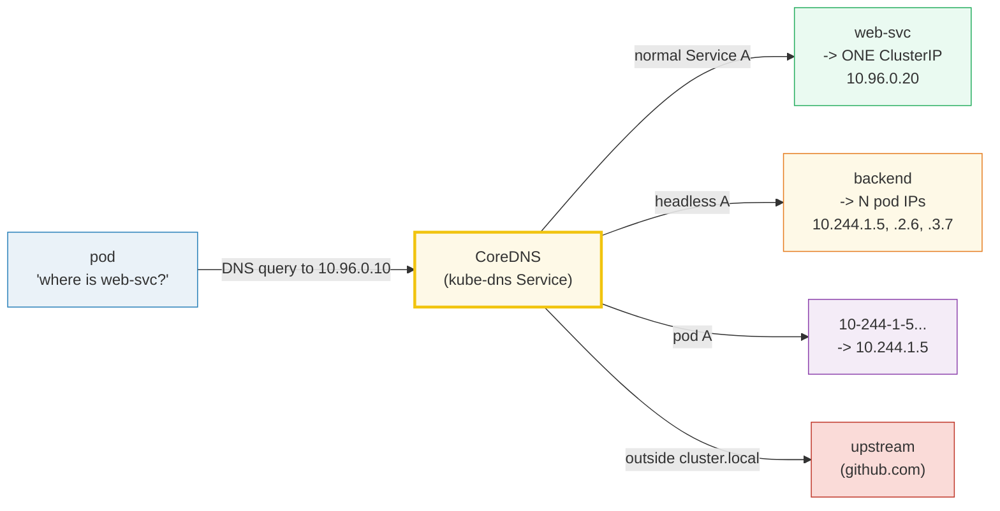

# CoreDNS — A Visual, Worked-Example Guide

> **Companion code:** [`coredns.py`](./coredns.py). **Every number and resolution
> in this guide is printed by `python3 coredns.py`** — change the code, re-run,
> re-paste. Nothing here is hand-computed.
>
> **Live animation:** [`coredns.html`](./coredns.html) — open in a browser; it
> re-runs the identical resolution engine and checks against the `.py` gold.
>
> **Source material:** Kubernetes DNS spec
> (kubernetes.io/docs/concepts/services-networking/dns-pod-service), CoreDNS docs
> (coredns.io), and the NodeLocal DNSCache design docs.

---

## 0. TL;DR — the whole idea in one picture

### Read this first — the front-desk directory of the building

Inside a cluster, every Service has a **stable name**. Pods never hardcode an IP
(IPs are ephemeral); instead they look up the name in **DNS**, exactly like you
type "google.com" instead of memorizing `142.250.x.x`. The cluster's DNS server —
**CoreDNS** — is that directory.

Picture CoreDNS as the **front-desk directory** of a big building. A pod walks up
and asks "where is `web-svc`?" CoreDNS answers with the Service's **ClusterIP**.
Ask for a **headless** service and instead of one front-desk number it hands you a
**list** of back-office desk numbers (the pod IPs) directly. Ask for a specific
**pod** by its IP-shaped name and it translates that back into the real IP.



> **One-line definition:** *CoreDNS* is the cluster's DNS server. It turns
> Service and pod objects into **DNS records** so clients resolve a **name** to an
> **address** without knowing anything about kube-proxy or iptables — the
> discovery layer that makes the stable-name abstraction real.

### Glossary (every term used below)

| Term | Plain meaning |
|---|---|
| **CoreDNS** | the DNS server (Deployment in kube-system). The nameserver in every pod's `/etc/resolv.conf` |
| **kube-dns IP** | the fixed ClusterIP of the CoreDNS Service (here `10.96.0.10`). **Not** a CoreDNS pod IP |
| **FQDN** | fully-qualified name: `web-svc.default.svc.cluster.local` (`service.namespace.svc.cluster.local`) |
| **cluster.local** | the cluster's DNS domain. Everything inside lives under it |
| **A record** | a DNS answer mapping a name to an IPv4 address |
| **headless service** | `clusterIP: None` — no VIP; an A query returns the pod IPs directly (round-robin) |
| **pod DNS** | IP `10.244.1.5` encoded as the name `10-244-1-5.default.pod.cluster.local` (dots → dashes) |
| **search domains** | suffixes appended to a short name so `web-svc` works without the full FQDN |
| **ndots** | if the query has fewer than `ndots` (default 5) dots, the search list is tried **first** |
| **stub domain** | forward one domain (e.g. `acme.local`) to a custom upstream DNS |
| **NodeLocal DNS** | a per-node cache DaemonSet — answers repeat queries locally, cutting CoreDNS load |

---

## 1. CoreDNS itself — a Service named kube-dns — Section A output

CoreDNS runs as a Deployment in `kube-system` (typically 2 replicas). It is
exposed by a Service named **`kube-dns`** whose ClusterIP is the fixed address
every pod queries.

> From `coredns.py` **Section A**:
>
> ```
> Service: kube-dns   (namespace: kube-system)
> ClusterIP: 10.96.0.10     <- this is in every pod's resolv.conf
> port: 53/UDP, 53/TCP          <- standard DNS port
> selector: k8s-app=kube-dns     -> the CoreDNS pods
> ```

> **CRITICAL:** `10.96.0.10` is a **ClusterIP**, not a CoreDNS pod IP. A pod's
> DNS query goes to `10.96.0.10`; kube-proxy DNATs it to one of the CoreDNS pods
> — exactly like any Service (see [`SERVICE_ENDPOINTS.md`](./SERVICE_ENDPOINTS.md)).

The cluster objects in this simulation:

```
name        ns        clusterIP        headless   pods
web-svc     default   10.96.0.20       False      -
cache-svc   prod      10.96.0.30       False      -
backend     default   None             True       10.244.1.5, 10.244.2.6, 10.244.3.7
```

---

## 2. Service DNS — one name → ONE ClusterIP — Section B output

A normal Service has a ClusterIP. A DNS A-record query for its FQDN returns that
**one** virtual IP. This is how pods find services without hardcoding IPs.

> ```
> query (A): web-svc.default.svc.cluster.local
>   answer : 10.96.0.20   (type=service A, rcode=NOERROR)
>   -> pod dials 10.96.0.20, kube-proxy DNATs to a backing pod
>
> query (A): cache-svc.prod.svc.cluster.local
>   answer : 10.96.0.30
> ```

Pattern: `<service>.<namespace>.svc.cluster.local` → ClusterIP.
**Cross-namespace lookup requires the namespace:** `cache-svc.prod.svc...` (a pod
in `default` asking `cache-svc` alone would miss — see Section 4).

---

## 3. Headless Service + pod DNS — N pod IPs — Section C output (GOLD)

Set a Service's `clusterIP` to `None` (headless) and there is **no virtual IP**
and **no kube-proxy load balancing**. An A-record query instead returns the pod
IPs **directly** (round-robin). Used by StatefulSets, gRPC client-side LB, and
anything that wants to reach **each pod**, not a random one.

> ```
> query (A): backend.default.svc.cluster.local
>   answer : 10.244.1.5, 10.244.2.6, 10.244.3.7   (N A records, round-robin)
> ```
>
> Two shapes side by side:
> ```
> web-svc.default.svc.cluster.local (normal)   -> [10.96.0.20]                     1 VIP
> backend.default.svc.cluster.local (headless) -> 10.244.1.5, 10.244.2.6, 10.244.3.7   N pod IPs
> ```

**POD DNS** (the reverse encoding): a pod's IP is encoded as a DNS name by
replacing each dot with a dash, under the pod zone `pod.cluster.local`:

```
10-244-1-5.default.pod.cluster.local  -> 10.244.1.5   (pod backend-0)
10-244-2-6.default.pod.cluster.local  -> 10.244.2.6   (pod backend-1)
10-244-3-7.default.pod.cluster.local  -> 10.244.3.7   (pod backend-2)
```

The dash-encoding exists because **DNS labels cannot contain dots**, and the IP
`10.244.1.5` has 3 dots → `10-244-1-5`. This is the **GOLD resolution map** that
`coredns.html` recomputes live and checks against — all three query shapes.

---

## 4. Search domains + ndots — how 'web-svc' (short) resolves — Section D output

A pod's `/etc/resolv.conf` is injected by **kubelet**. It names the kube-dns IP
(`10.96.0.10`) and a **search list** so short names work:

> ```
> nameserver 10.96.0.10
> search default.svc.cluster.local svc.cluster.local cluster.local
> options ndots:5
> ```

`ndots:5` means: if the query name has **fewer than 5 dots**, try it as
**relative** first (append each search domain). `web-svc` has 0 dots, so:

> ```
> resolve_short('web-svc'):
>   try web-svc.default.svc.cluster.local  -> NOERROR -> 10.96.0.20   ✓ (1st search domain)
>   expanded -> web-svc.default.svc.cluster.local
>   answer   -> 10.96.0.20
> ```

**Cross-namespace pitfall:** `cache-svc` alone expands to
`cache-svc.default.svc.cluster.local` → **NXDOMAIN** (it lives in `prod`). You
must use `cache-svc.prod.svc.cluster.local`.

> **WHY ndots:5 (not the libc default 1):** cluster FQDNs like
> `web-svc.default.svc.cluster.local` have 4 dots. With `ndots:5` such a name is
> **still** treated as relative first, causing redundant search lookups — a known
> footgun that NodeLocal DNS (next section) helps absorb.

---

## 5. NodeLocal DNS cache — caching + conntrack relief — Section E output

Under high DNS churn (many pods resolving at once), every query is a **UDP
packet** from the pod to `10.96.0.10`. That packet crosses **conntrack** (the
connection-tracking table). At scale, conntrack entry creation for ephemeral
source ports + CoreDNS load can cause **dropped queries and 5s+ stalls** (DNS
timeout). **NodeLocal DNSCache** fixes both:

- runs as a **DaemonSet on every node** (a cache, not a new resolver)
- listens on a **node-local IP** that all pods are configured to use
- answers from **cache** for repeat queries (most lookups repeat)
- cache **miss** → forwards to the real CoreDNS (`10.96.0.10`)

> The data path, with and without NodeLocal:
> ```
> WITHOUT: pod -> 10.96.0.10 (cross-node, conntrack entry per query) -> CoreDNS pod
> WITH   : pod -> NodeLocal cache (SAME node, cached or forwarded) -> [miss] CoreDNS pod
> ```

**Effect:** repeat queries never leave the node (lower latency), and far fewer
packets hit conntrack (avoids the conntrack-exhaustion stall).

**Stub domains + upstream** (how non-cluster names resolve): CoreDNS **owns**
`cluster.local`. For everything else it **forwards**: a *stub domain* sends
`acme.local` → a corporate DNS; the *default upstream* is the node's
`/etc/resolv.conf`. So `web-svc.default.svc.cluster.local` is answered **locally**,
while `github.com` is forwarded upstream — one server, two zones.

---

### Companion files

- [`coredns.py`](./coredns.py) — the single source of truth (pure stdlib).
- [`coredns_output.txt`](./coredns_output.txt) — verbatim program output.
- [`coredns.html`](./coredns.html) — interactive version; recomputes the gold
  resolution map and self-checks.

> Related: [`SERVICE_ENDPOINTS.md`](./SERVICE_ENDPOINTS.md) (how the ClusterIP
> CoreDNS returns is DNAT'd to a pod) and [`INGRESS.md`](./INGRESS.md) (L7
> routing, which depends on DNS resolving `api.example.com`).
