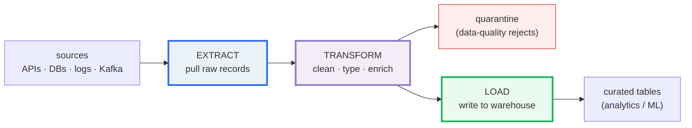
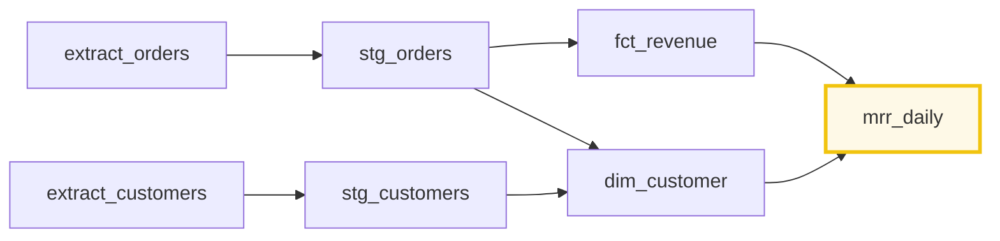
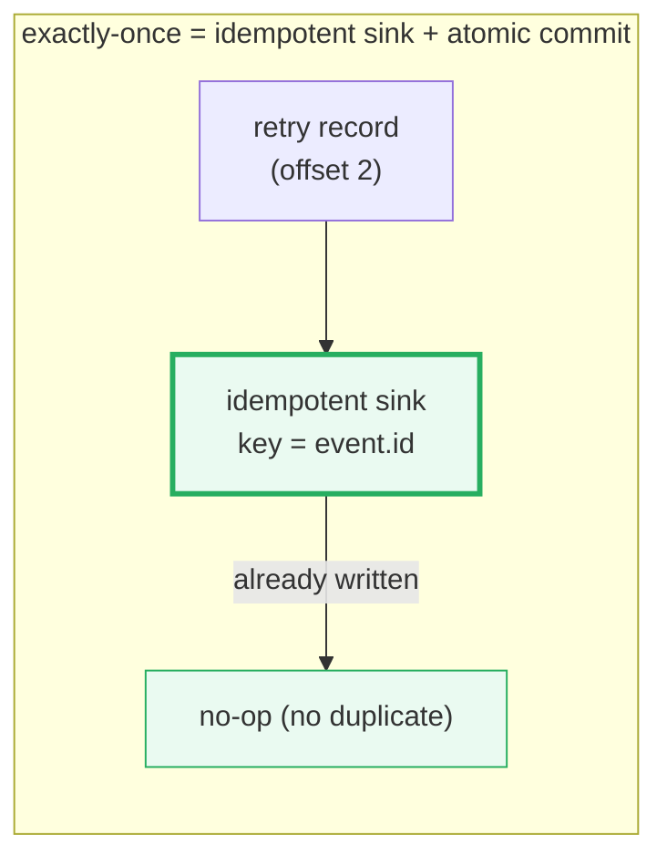
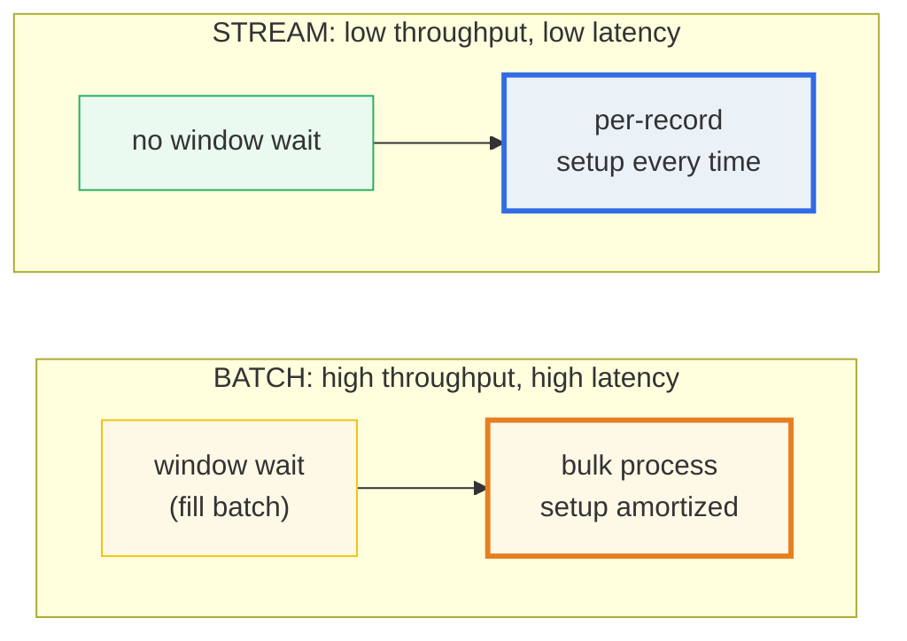

# Data Pipelines — A Visual, Worked-Example Guide

> **Companion code:** [`data_pipelines.py`](https://github.com/quanhua92/tutorials/blob/main/devops/data_pipelines.py).
> **Every number in this guide is printed by `python3 data_pipelines.py`** — change
> the code, re-run, re-paste. Nothing here is hand-computed.
>
> **Live animation:** [`data_pipelines.html`](https://github.com/quanhua92/tutorials/blob/main/devops/data_pipelines.html)
> — open in a browser; it recomputes the ETL pass, the DAG, backpressure,
> exactly-once, and the batch/stream tradeoff from the identical model and checks
> against the `.py` gold.
>
> **Source material:** Apache Airflow core concepts, Apache Kafka documentation,
> Confluent "Exactly-Once Semantics", dbt documentation, Spark Structured
> Streaming.

---

## 0. TL;DR — the whole idea in one picture

### Read this first — a factory assembly line for data

A data pipeline is a **factory assembly line for data**. Raw material (records)
enters at one end, gets cleaned and assembled at workstations (**transforms**),
and finished goods (curated tables) come out the other end. Two production
styles exist:



- **Batch** — load a whole truck of parts at once, process them, ship a pallet.
  High throughput, minutes-to-hours latency. (Airflow + Spark + dbt)
- **Streaming** — parts arrive on a conveyor belt one at a time; each is
  processed the instant it lands. Low latency, continuous. (Kafka + Flink)

The orchestrator is the **factory manager**: it reads the order sheet (a **DAG**
of which workstation feeds which), respects dependencies (welding before
painting), and re-runs a station if it faults.

> **One-line definition:** a data pipeline **extracts** records from sources,
> **transforms** them (clean/enrich), and **loads** the result into a target —
> run either in **batch** (scheduled, high-throughput) or **streaming**
> (continuous, low-latency), coordinated by a **DAG** orchestrator.

### Glossary (every term used below)

| Term | Plain meaning |
|---|---|
| **ETL** | Extract → Transform → Load (transform on a separate server) |
| **ELT** | Extract → Load → Transform (transform *inside* the warehouse, via dbt) |
| **Batch** | process big bounded chunks on a schedule (minutes..hours) |
| **Streaming** | process unbounded records as they arrive (ms..seconds) |
| **Kafka topic** | an append-only log partitioned for parallelism |
| **Partition** | ordered shard of a topic; the unit of parallelism (1 partition → 1 consumer in a group, order preserved) |
| **Offset** | a record's sequence number within a partition; consumers commit offsets to mark progress |
| **Backpressure** | when a downstream stage is slower than upstream, the pipeline SLOWS the producer instead of drowning in unbounded in-flight data |
| **Exactly-once** | every input record affects the output exactly once — no duplicates, no losses |
| **DAG** | Directed Acyclic Graph of tasks; the orchestrator runs tasks in topological order so dependencies are respected |

---

## 1. ETL — Section A output

> From `data_pipelines.py` **Section A** — 6 raw events enter; transform
> validates each (amount must be a non-negative number, currency must be known)
> and normalizes to USD via the FX table `{usd:1.0, eur:1.10}`:
>
> | id | user | amount | currency | result |
> |---|---|---|---|---|
> | 1 | alice | 120.5 | usd | valid → 120.50 USD |
> | 2 | bob | -5 | usd | **quarantined** — amount negative |
> | 3 | alice | 30 | eur | valid → 33.00 USD |
> | 4 | carol | 200 | usd | valid → 200.00 USD |
> | 5 | bob | not-a-number | usd | **quarantined** — amount not numeric |
> | 6 | carol | 50 | eur | valid → 55.00 USD |
>
> ```
> Load wrote 4 rows to the curated 'payments' table.
> [check] ETL produced 4 valid + 2 quarantined (id 2 negative, id 5 non-numeric)?  OK
> ```

**Key point:** transform is where **data-quality** lives. Bad rows are
**quarantined** (not silently dropped) so an operator can investigate. In
production this is Great Expectations / Soda / dbt tests.

> 🔗 **ETL vs ELT:** modern stacks prefer **ELT** — load raw into the warehouse
> first, then transform with dbt SQL inside it (leveraging warehouse
> parallelism). ETL still exists where compliance requires sanitizing PII before
> storage.

---

## 2. DAG orchestration — Section B output (topological order + fan-out)

The orchestrator (Airflow / dbt / Dagster) reads the task dependency graph and
groups tasks into **levels**. Each level has no inter-dependencies, so all its
tasks can run **in parallel** — that is how fan-out happens.

> From `data_pipelines.py` **Section B** — the analytics DAG and its topological
> levels:
>
> ```
> level 0: ['extract_customers', 'extract_orders']   (parallel fan-out)
> level 1: ['stg_customers', 'stg_orders']            (parallel fan-out)
> level 2: ['dim_customer', 'fct_revenue']            (parallel fan-out)
> level 3: ['mrr_daily']                              (single)
> ```
>
> Critical path (longest chain): `extract_orders → stg_orders → fct_revenue →
> mrr_daily` — 4 hops, bounding minimum wall-clock time.
>
> Cycle check: `{'a':['b'], 'b':['a']}` → **REJECTED (cycle)** — orchestrators
> refuse cyclic graphs.
>
> ```
> [check] DAG has 4 levels and mrr_daily runs last?  OK
> ```



**Why acyclic:** a cycle would mean task A depends on B which (transitively)
depends on A — nothing in the cycle could ever start. Kahn's algorithm detects
this: if some tasks never reach in-degree 0, the graph has a cycle and the run
is aborted.

---

## 3. Backpressure — Section C output

When a downstream stage is **slower** than upstream, an unbounded buffer would
grow forever → OOM. **Backpressure** makes the producer **wait** so memory stays
bounded (the buffer size, not the arrival rate, bounds in-flight data).

> From `data_pipelines.py` **Section C** — 10 events into a buffer of capacity
> 3, consumer draining 1/tick:
>
> ```
> tick | buffer | produced | drained
> -----+--------+----------+--------
>   0  |   2    |    3     |    1
>   1  |   2    |    1     |    1
>   ...
> Producer accepted 10 events over 10 ticks with 7 stall ticks.
> [check] producer stalled at least once under load?  OK
> ```

**How real systems express it:**
- **Kafka** — `consumer.pause()` stops fetching when downstream is slow.
- **Spark Structured Streaming** — rate-limiting caps how fast sources are read.
- **Reactive streams** (Project Reactor / Akka Streams) — `request(n)` signals
  upstream demand; the producer only emits when granted credit.

---

## 4. Delivery semantics — Section D output (the GOLD)

Three delivery guarantees, with a transient crash injected at ids 2 and 4 (each
retried once):

> From `data_pipelines.py` **Section D**:
>
> | mode | delivered | sink writes | duplicates | lost |
> |---|---|---|---|---|
> | **at-most-once** | 3 | 3 | 0 | **2** |
> | **at-least-once** | 5 | 7 | **2** | 0 |
> | **exactly-once** | 5 | 5 | **0** | **0** |
>
> ```
> GOLD exactly-once: delivered=[1, 2, 3, 4, 5], sink_writes=5, duplicates=0
> [check] exactly-once yields 0 duplicates + 0 losses (vs the others)?  OK
> ```

| Mode | Mechanism | Failure mode |
|---|---|---|
| **at-most-once** | ack *before* processing | crashed records (2, 4) are **LOST** |
| **at-least-once** | process then commit; non-idempotent sink | retried records **written again** → 2 duplicates |
| **exactly-once** | **idempotent sink** (dedupe by key) + **atomic** (offset commit + write) | retries rewrite the **same key** → 0 duplicates AND 0 losses |



**How Kafka does it:** (1) **idempotent producers** — a sequence number per
partition lets the broker discard duplicate writes; (2) **transactional
producers** — a two-phase commit writes to multiple partitions atomically; (3)
**`isolation.level=read_committed`** consumers see only committed transactions.

---

## 5. Batch vs streaming — Section E output (the tradeoff)

> From `data_pipelines.py` **Section E** — 8 events, setup=2 ticks,
> proc=1 tick/record:
>
> | metric | batch (size 4) | streaming |
> |---|---|---|
> | batches/run | 2 | 8 |
> | **throughput** | **0.667** | 0.333 |
> | avg latency | 7.00 | **3.00** |
> | max latency | 7.00 | **3.00** |
>
> ```
> GOLD batch throughput = 0.667  (> stream 0.333)
> GOLD stream max latency = 3.00  (< batch 7.00)
> [check] batch wins throughput, streaming wins latency?  OK
> ```

**Why batch has higher throughput:** it **amortizes** the fixed setup cost over
the whole batch — `compute = batches × setup + n × proc` = `2×2 + 8×1 = 12`,
giving `8/12 = 0.667/tick`. Streaming pays setup on **every** record:
`8 × (2+1) = 24`, giving `8/24 = 0.333/tick`.

**Why streaming has lower latency:** a record is processed the **instant** it
arrives — `setup + proc = 3` ticks. In batch, every record **waits for the
window to fill** before processing starts: `window(4) + proc(3) = 7` ticks.



**Rule of thumb:**
- Latency budget in **seconds** → streaming (Kafka + Flink / Kinesis)
- Latency budget in **minutes+** → batch (Airflow + Spark + dbt)
- Hybrid: **Lambda** (batch for accuracy + stream for real-time), or **Kappa**
  (unify both as stream replay — modern default).

---

## 6. Pitfalls & debugging checklist

| # | Mistake | Symptom | Fix |
|---|---|---|---|
| 1 | Non-idempotent sink on retries | duplicate rows after a transient failure | make the sink idempotent (keyed upsert / MERGE) |
| 2 | Unbounded in-flight buffer | OOM / consumer lag grows forever | add backpressure (bounded buffer, Kafka `pause`) |
| 3 | Cyclic task graph | orchestrator refuses to run / hangs | break the cycle; pipelines must be a DAG |
| 4 | Silent data-quality drop | bad rows vanish into the sink | quarantine rejects; alert on quarantine rate |
| 5 | Global Kafka ordering expected | events reordered across partitions | ordering is **per-partition only**; partition by key |
| 6 | Batch chosen for real-time need | stale dashboards, seconds-late not met | move the hot path to streaming |

---

## 7. Cheat sheet

- **ETL = Extract → Transform → Load**; ELT moves transform *inside* the warehouse (dbt).
- **DAG**: orchestrator runs tasks in **topological order**; each **level** runs in **parallel** (fan-out); **cycles rejected**.
- **Backpressure**: bounded buffer → producer **waits** when full → memory bounded by cap, not arrival rate.
- **Exactly-once = idempotent sink + atomic (offset commit + write)** → 0 duplicates + 0 losses.
- **Batch** amortizes setup → **higher throughput**; pays a window wait → **higher latency**.
- **Streaming** pays setup per record → **lower throughput**; no window → **lower latency**.
- **GOLD**: ETL 4 valid/2 quarantined; DAG 4 levels; backpressure 7 stalls; exactly-once 5/5/0/0; batch 0.667 thr vs stream 0.333 thr.

---

## Sources

- **Apache Airflow** — *Core Concepts*: DAGs, tasks, operators, sensors, XComs.
  https://airflow.apache.org/docs/apache-airflow/stable/core-concepts/
- **Apache Kafka** — *Documentation*: topics, partitions, offsets, consumer
  groups, retention, log compaction. https://kafka.apache.org/documentation/
- **Confluent** — *Exactly-Once Semantics*: idempotent + transactional
  producers, `read_committed` consumers. https://developer.confluent.io/
- **dbt** — *What is dbt?*: models, materializations, tests, refs, contracts.
  https://docs.getdbt.com/docs/introduction
- **Spark Structured Streaming** — micro-batch and continuous processing,
  backpressure / rate limiting.
- **Kappa Architecture** — Jay Kreps / LinkedIn Engineering: "everything is a
  stream; batch is a bounded replay."
