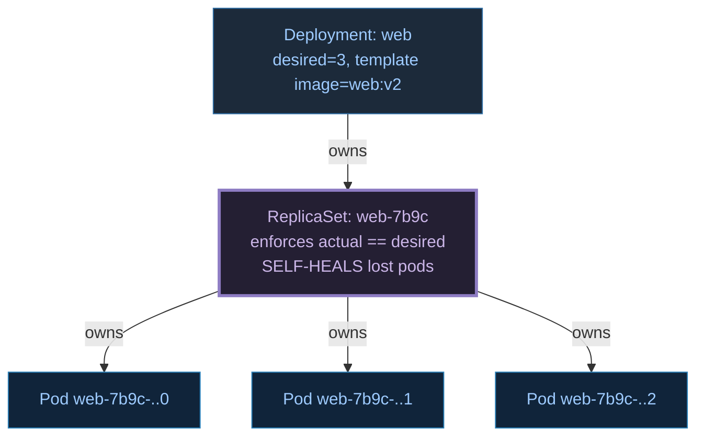

# Deployment → ReplicaSet → Pods — A Visual, Worked-Example Guide

> **Companion code:** [`deployment_replicaset.py`](./deployment_replicaset.py).
> **Every number in this guide is printed by `python3 deployment_replicaset.py`**
> — change the code, re-run, re-paste. Nothing here is hand-computed.
>
> **Live animation:** [`deployment_replicaset.html`](./deployment_replicaset.html)
> — open in a browser.
>
> **Sibling guide:** [`POD_LIFECYCLE.md`](./POD_LIFECYCLE.md) — what happens
> inside each Pod (Pending → Running, init containers, graceful shutdown).
>
> **Source material:** `HOW_TO_RESEARCH.md`; Kubernetes docs
> (kubernetes.io/.../deployment, .../deployment-strategy); *Kubernetes Patterns*
> (Ibryam & Huss).

---

## 0. TL;DR — the foreman, the crew chief, and the workers

A **Deployment** is a *foreman* holding a blueprint ("I want 3 replicas of
`web:v2`"). It never touches workers directly. It hires a **crew chief** — a
**ReplicaSet** — per blueprint version, and each crew chief keeps exactly the
right number of **workers** (**Pods**) on the floor.



| Object | Role | What it owns / does |
|---|---|---|
| **Deployment** | foreman | desired replica count + pod template; **drives rollouts** |
| **ReplicaSet (RS)** | crew chief | a set of Pods matched by a selector; enforces `actual == desired`; **self-heals** |
| **Pod** | worker | the running process; disposable, named with a `pod-template-hash` |

> **The non-obvious rule:** a new image tag → a new **pod-template-hash** → a **new
> ReplicaSet**. Each revision is a *separate* RS, which is exactly what makes
> rolling updates and rollbacks possible.

### Glossary

| Term | Plain meaning |
|---|---|
| **replicas** | the desired Pod count the Deployment/RS maintains |
| **pod-template-hash** | hash of the Pod template, appended to RS + Pod names; ties a Pod to its RS |
| **revisionHistoryLimit** | how many old ReplicaSets are kept (default 10) — the targets of `rollout undo` |
| **maxSurge** | how many EXTRA pods (above `replicas`) may exist during a RollingUpdate — bounds scale-UP |
| **maxUnavailable** | how many pods may be UNAVAILABLE during a RollingUpdate — bounds scale-DOWN |
| **available** | a pod that is Running AND passed its readiness probe (only these serve traffic) |

---

## 1. The hierarchy — Section A output

You `kubectl apply` a **Deployment**, not Pods. The Deployment creates one
**ReplicaSet per revision** (named with the hash), and that ReplicaSet creates and
owns the Pods.

> From `deployment_replicaset.py` **Section A** (`web`, 3 replicas):
>
> ```
> Deployment: web              (desired: 3, template: image=web:v1)
>   └─ ReplicaSet: web-7b9c        (selector: app=web, template-hash=7b9c)
>        └─ Pod: web-7b9c-abcd0
>        └─ Pod: web-7b9c-abcd1
>        └─ Pod: web-7b9c-abcd2
> ```
> **Ownership chain:** Deployment `web` ──owns──▶ RS `web-7b9c` ──owns──▶ 3 Pods.

Who does what:
- **Deployment** — holds desired count + pod template; drives rollouts.
- **ReplicaSet** — enforces `actual == desired`; **self-heals** lost pods (§5).
- **Pod** — the disposable worker; the only thing that actually runs.

---

## 2. Rolling update — Section B output (the two guardrails)

On a template change (`web:v1` → `web:v2`) the Deployment creates a **new
ReplicaSet** (new hash) and rolls Pods from the old RS to the new one. The
controller **never** violates either guardrail:

```
(1)  total     <= replicas + maxSurge          (bound resource cost)
(2)  available >= replicas - maxUnavailable    (bound downtime)
```

> From `deployment_replicaset.py` **Section B** — `replicas=3, maxSurge=1,
> maxUnavailable=0` (guardrails: total ≤ 4, available ≥ 3):
>
> | step | v1 RS | v2 RS | total | avail | action |
> |---|---|---|---|---|---|
> | 0 | 3 | 0 | 3 | 3 | start |
> | 1 | 3 | 1 | 4 | 3 | surge v2 +1 (total 4 ≤ 4) |
> | 2 | 2 | 1 | 3 | 3 | scale v1 −1 (avail 3 ≥ 3) |
> | 3 | 2 | 2 | 4 | 3 | surge v2 +1 |
> | 4 | 1 | 2 | 3 | 3 | scale v1 −1 |
> | 5 | 1 | 3 | 4 | 3 | surge v2 +1 |
> | 6 | 0 | 3 | 3 | 3 | scale v1 −1 |
>
> `[check] total ≤ 4 at every step? True`
> `[check] available ≥ 3 at every step? True`

```mermaid
graph LR
    S0["(3,0)<br/>avail 3"] -->|surge| S1["(3,1)<br/>total 4"]
    S1 -->|v2 ready, scale v1| S2["(2,1)<br/>avail 3"]
    S2 -->|surge| S3["(2,2)<br/>total 4"]
    S3 -->|scale v1| S4["(1,2)<br/>avail 3"]
    S4 -->|surge| S5["(1,3)<br/>total 4"]
    S5 -->|scale v1| S6["(0,3)<br/>avail 3 ✓ done"]
    style S1 fill:#241f33,stroke:#8e7cc3
    style S3 fill:#241f33,stroke:#8e7cc3
    style S5 fill:#241f33,stroke:#8e7cc3
    style S6 fill:#1c3a25,stroke:#27ae60,color:#7ef0a2
```



**Read the sawtooth:** the v2 RS surges **+1** (total hits 4), then once that pod
is ready the v1 RS scales **−1** (avail stays 3). Repeat until v1=0. The result is
**zero downtime** (avail never below 3), at the cost of 1 extra pod (the surge).

> **Tuning:** `maxSurge=0` + `maxUnavailable=1` → no extra capacity, but you drop
> to 2 available during the swap (cheap, slight capacity loss). `maxSurge=1` +
> `maxUnavailable=0` → zero capacity loss, needs 1 spare pod. Set **both to 0** and
> the rollout cannot proceed (no room to surge, can't drop availability).

---

## 3. Rollback — Section C output (same machinery, reversed)

`kubectl rollout undo` makes the **previous** ReplicaSet the target and re-runs the
**same** interleaved rollout — just with the roles swapped: the current RS scales
down while the previous one scales back up.

> From `deployment_replicaset.py` **Section C** — rolling v2 (current) **back** to
> v1 (previous), same trace with labels swapped:
>
> | step | v2 RS | v1 RS | avail |
> |---|---|---|---|
> | 0 | 3 | 0 | 3 |
> | … | … | … | 3 (constant) |
> | 6 | 0 | 3 | 3 |
>
> `[check] guardrails hold during rollback too? total:True avail:True`

**Why it works:** the Deployment keeps old ReplicaSets up to
`revisionHistoryLimit` (default 10). Each RS is a complete snapshot of a revision,
so "undo" is just *re-point the target at an existing RS and roll* — no image
re-pull, no template reconstruction.

---

## 4. Strategy — Section D output (RollingUpdate vs Recreate)

`spec.strategy.type` picks the rollout strategy:

| Strategy | How | Downtime? | When |
|---|---|---|---|
| **RollingUpdate** *(default)* | interleave up/down; two versions briefly coexist | **no** (if maxUnavailable=0) | almost always |
| **Recreate** | kill ALL old first, THEN create new | **yes** (a step at avail=0) | when two versions cannot coexist |

> From `deployment_replicaset.py` **Section D** — **Recreate**, replicas=3:
>
> | step | v1 | v2 | avail |
> |---|---|---|---|
> | 0 | 3 | 0 | 3 |
> | 1 | 2 | 0 | 2 |
> | 2 | 1 | 0 | 1 |
> | **3** | **0** | **0** | **0** ← **downtime** |
> | 4 | 0 | 1 | 0 |
> | 5 | 0 | 2 | 1 |
> | 6 | 0 | 3 | 2 |
> | 7 | 0 | 3 | 3 |
>
> `[check] Recreate has a downtime step (avail == 0)? True`

```mermaid
graph LR
    subgraph r["RollingUpdate"]
        R0["3,0"] --> R1["3,1"] --> R2["2,1"] --> R3["0,3"]
    end
    subgraph c["Recreate"]
        C0["3,0"] --> C1["2,0"] --> C2["0,0<br/>DOWNTIME ✗"] --> C3["0,3"]
    end
    style R3 fill:#1c3a25,stroke:#27ae60
    style C2 fill:#3a1414,stroke:#c0392b,color:#ff9a8a,stroke-width:3px
```



Use **Recreate** only when two versions cannot coexist: a breaking DB schema
migration, a singleton that must own a resource exclusively, or a job that rejects
duplicate runs. Otherwise prefer RollingUpdate.

---

## 5. ReplicaSet self-healing — Section E output

Self-healing is the **ReplicaSet's** job (not the Deployment's). Its reconcile loop
constantly compares `desired` vs `actual`. If a Pod disappears — node loss, crash,
eviction, manual delete — the RS sees `desired != actual` and creates a replacement
to restore the count.

> From `deployment_replicaset.py` **Section E** (desired=3, pods die at steps 3 & 7):
>
> | step | desired | actual | event |
> |---|---|---|---|
> | 0 | 3 | 3 | steady state |
> | 3 | 3 | 2 | pod died (node loss / crash) |
> | 4 | 3 | 3 | RS reconcile: desired=3 != actual=2 → create 1 replacement |
> | 7 | 3 | 2 | pod died |
> | 8 | 3 | 3 | RS reconcile → create replacement |

Key points:
- The **Deployment is not involved**; the RS reconciles on its own.
- The replacement is a **new Pod** (new name, same template-hash) — the dead one is
  gone for good. Stateful workloads use a **StatefulSet** instead, where a
  replacement keeps the same sticky identity.
- This is why you almost never `kubectl run` a **bare Pod** in production: a bare
  Pod has no ReplicaSet, so if it dies **nothing recreates it**.

```mermaid
graph LR
    A["desired=3<br/>actual=3"] -->|pod dies| B["actual=2"]
    B -->|RS reconcile loop| C["desired != actual"]
    C -->|create replacement| A
    style B fill:#3a1414,stroke:#c0392b,color:#ff9a8a
    style C fill:#241f33,stroke:#8e7cc3
    style A fill:#1c3a25,stroke:#27ae60,color:#7ef0a2
```



---

## 6. The GOLD CHECK — available stays ≥ replicas − maxUnavailable

> From `deployment_replicaset.py` **GOLD CHECK** (canonical rollout,
> `replicas=3, maxSurge=1, maxUnavailable=0`):
>
> ```
> step  : 0  1  2  3  4  5  6
> OLD   : 3  3  2  2  1  1  0
> NEW   : 0  1  1  2  2  3  3
> avail : 3  3  3  3  3  3  3
>
> [check] total guardrail holds every step?       True
> [check] available guardrail holds every step?    True
> [pin] min available seen = 3  (>= 3)
> [pin] max total seen      = 4  (<= 4)
> [pin] # reconcile steps   = 6
> [pin] final state         = v1:0 v2:3 avail:3
> [check] all gold pins reproduced:  OK
> ```
>
> [`deployment_replicaset.html`](./deployment_replicaset.html) ports
> `rolling_update` to JS and re-derives the **identical** trace (OLD, NEW, avail),
> asserting both guardrails hold at every step. The green `check: OK` badge is
> that assertion passing live.

---

## 7. Pitfalls & debugging checklist

| # | Mistake | Symptom | Fix |
|---|---|---|---|
| 1 | `maxSurge=0` **and** `maxUnavailable=0` | rollout stuck (no room) | allow surge OR unavailability |
| 2 | New pods never become available | rollout stalls at partial | check the **readiness probe** + new image starts |
| 3 | Rollout too slow | one-at-a-time surge | raise `maxSurge` (needs spare capacity) |
| 4 | `revisionHistoryLimit: 0` | `rollout undo` fails | keep ≥ 1 old RS for rollback |
| 5 | Bare Pod in prod | dies, nothing recreates | wrap it in a Deployment/RS |
| 6 | Recreate on a web service | user-visible outage | switch to RollingUpdate |
| 7 | Expecting the Deployment to self-heal | confusion | it's the **ReplicaSet** that reconciles pods |

---

## 8. Cheat sheet

- **Hierarchy:** Deployment (foreman) → ReplicaSet (crew chief, self-heals) → Pods (workers).
- **New template → new pod-template-hash → new ReplicaSet.** Old RSs are kept for rollback.
- **Rolling update guardrails:** `total ≤ replicas+maxSurge` AND `available ≥ replicas−maxUnavailable`, *always*.
- **Sawtooth:** surge NEW +1 (if room), then scale OLD −1 (as availability allows), per reconcile.
- **Rollback:** `rollout undo` re-points the target at a previous RS — same roll, reversed.
- **Recreate:** kill-all-then-create; has a downtime step (avail=0). Use only when versions can't coexist.
- **Self-healing is the ReplicaSet's job:** `desired != actual` → create replacement. The Deployment isn't involved.
- **GOLD:** OLD=[3,3,2,2,1,1,0], NEW=[0,1,1,2,2,3,3], avail=[3,3,3,3,3,3,3]; min avail 3, max total 4, 6 steps.

> 🔗 Each Pod inside a ReplicaSet has its own lifecycle (Pending → Running,
> init containers, graceful shutdown). See
> [`POD_LIFECYCLE.md`](./POD_LIFECYCLE.md).

---

## Sources

- **Kubernetes docs — Deployments.**
  https://kubernetes.io/docs/concepts/workloads/controllers/deployment/
  - Verified: Deployment → ReplicaSet → Pods ownership; `revisionHistoryLimit` default 10;
    `rollout undo` re-uses an existing ReplicaSet.
- **Kubernetes docs — Deployment Strategy.**
  https://kubernetes.io/docs/concepts/workloads/controllers/deployment/#strategy
  - Verified: RollingUpdate (`maxSurge`, `maxUnavailable`) vs Recreate semantics.
- **Kubernetes docs — ReplicaSet.**
  https://kubernetes.io/docs/concepts/workloads/controllers/replicaset/
  - Verified: the ReplicaSet reconciles desired vs actual and replaces failed/deleted Pods.
- **Kubernetes docs — Rolling Back a Deployment.**
  https://kubernetes.io/docs/concepts/workloads/controllers/deployment/#rolling-back-a-deployment
- **Kubernetes code** — `pkg/controller/deployment/sync.go`,
  `reconcileNewReplicaSet` / `reconcileOldReplicaSets`: the surge/up vs
  scale-down logic bounded by `maxSurge` and `maxUnavailable`.
- **Kubernetes Patterns** — Bilgin Ibryam & Roland Huss (O'Reilly). The
  "Stateless Service", "Self Healing", and "Versioned Release" patterns.
