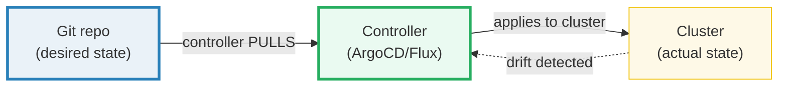

# GitOps — A Visual, Worked-Example Guide

> **Companion code:** [`gitops.py`](./gitops.py). **Every number and state
> transition in this guide is printed by `python3 gitops.py`** — change the code,
> re-run, re-paste. Nothing here is hand-computed.
>
> **Live animation:** [`gitops.html`](./gitops.html) — open in a browser; it
> recomputes the reconcile loop from the identical model and checks against the
> `.py` gold.
>
> **Source material:** ArgoCD docs (argo-cd.readthedocs.io), Flux docs
> (fluxcd.io), the GitOps Principles (OpenGitOps / CNCF), and "GitOps: From
> Development to Production" (Torres 2021).

---

## 0. TL;DR — the whole idea in one picture

### Read this first — the recipe book and the kitchen

Think of a restaurant. The **chef** (the GitOps controller — ArgoCD or Flux) has a
**recipe book** (the Git repo) that says exactly what every dish should contain.
The **kitchen** (the cluster) is where dishes are actually made.

- Every few minutes, the chef **walks to the recipe book**, reads it, and checks
  the kitchen. If a dish does **not** match the recipe, the chef fixes it. This
  is **pull**: the chef (in the kitchen) reaches **out** to the book.
- If a cook secretly adds extra salt (manual `kubectl edit`), the chef notices on
  the next check and **throws it out** (drift correction / auto-sync).

**GitOps = the recipe book is the only authority. The kitchen conforms to the
book, never the other way around.**



> **One-line definition:** a controller **inside** the cluster **pulls** desired
> state from Git, detects **drift**, and **reconciles** the cluster to match Git.
> Git is the single source of truth.

### Glossary (every term used below)

| Term | Plain meaning |
|---|---|
| **desired state** | what Git says the cluster *should* look like (the manifests) |
| **actual state** | what the cluster *really* looks like right now |
| **sync** | making actual match desired (Git → cluster) |
| **reconcile** | the controller's loop: compare desired vs actual, fix any diff |
| **drift** | actual ≠ desired (manual edit, crash); the controller detects it |
| **auto-sync** | on drift, fix automatically (re-apply Git); without it, alert + wait |
| **pull model** | controller (in cluster) pulls FROM Git; no inbound creds needed |
| **push model** | CI server pushes INTO the cluster (needs cluster credentials) |
| **promotion** | moving a change dev → staging → prod as a **git merge**, not kubectl |

---

## 1. GitOps flow — Section A output

The controller runs a **reconcile loop**: pull desired state from Git → compare
with actual → if they differ, **sync**.

> From `gitops.py` **Section A** — initial state in sync, then a dev push:
>
> | step | Git (desired) | cluster (actual) | in sync? |
> |---|---|---|---|
> | 0. initial | `replicas=2, image=v1.0.0` | `replicas=2, image=v1.0.0` | ✅ |
> | 1. dev pushes | `replicas=3, image=v1.1.0` | `replicas=2, image=v1.0.0` | ❌ drift |
> | 2. ArgoCD syncs | `replicas=3, image=v1.1.0` | `replicas=3, image=v1.1.0` | ✅ |
>
> ```
> GOLD after sync, deployment/web = replicas=3, image=v1.1.0
> [check] cluster == Git after sync?  OK
> ```

**Result:** the cluster now matches Git exactly. No one ran `kubectl apply` —
the controller **pulled** the change from Git and reconciled.

---

## 2. Drift detection — Section B output

An operator hot-fixes a pod count by hand (**never** do this in GitOps):
`kubectl scale deployment web --replicas=5`.

> From `gitops.py` **Section B**:
>
> | | Git (desired) | cluster (actual) |
> |---|---|---|
> | after manual edit | `replicas=3` | `replicas=5 ← OUT OF SYNC` |
> | after auto-sync | `replicas=3` | `replicas=3` (reverted from 5) |
>
> ```
> GOLD drift corrected: deployment/web.replicas = 3 (reverted from 5)
> [check] drift detected AND auto-corrected (cluster==Git)?  OK
> ```

With **auto-sync** enabled, the controller does not just alert — it **fixes** the
drift by re-applying Git. Without auto-sync (manual mode), it marks the app
**Out Of Sync**, fires an alert (Slack/PagerDuty), and waits for a human to
click **Sync**.

Either way, the drift is **visible**. Nothing changes the cluster silently —
every change is either in Git, or it gets flagged/reverted on the next reconcile.

---

## 3. Pull vs Push — Section C output

The difference is the **direction** of the call and **who** holds credentials.

```mermaid
graph LR
    subgraph push["PUSH (traditional CI/CD)"]
        CI["CI server<br/>(holds creds)"] -->|"pushes INTO"| CL1["cluster"]
    end
    subgraph pull["PULL (GitOps)"]
        GIT["Git repo"] -->|"controller pulls"| CL2["cluster<br/>(controller inside)"]
    end
    style push fill:#3a1414,stroke:#c0392b
    style pull fill:#1c3a25,stroke:#27ae60,stroke-width:3px
```



> From `gitops.py` **Section C** — credential footprint:
>
> | | PUSH (CI/CD) | PULL (GitOps) |
> |---|---|---|
> | creds location | CI server | cluster (sealed) |
> | inbound to cluster | **YES** (CI → cluster) | **NO** |
> | audit trail | CI logs | git history |
> | rollback | re-run old job | `git revert` |
> | drift detection | none (push & forget) | built-in |
>
> ```
> [check] pull model needs NO inbound cluster access?  OK
> ```

**Rollback** is the killer feature: to undo a deployment, just
`git revert <commit>` → the controller pulls the old manifest → the cluster rolls
back. No "rollback pipeline" to maintain; **git IS the rollback.**

---

## 4. Multi-environment — Section D output

Each environment is a **directory** (or branch) in the **same** Git repo. The
controller watches each path and syncs it to the matching cluster.

> From `gitops.py` **Section D**:
>
> | Git path | replicas | image |
> |---|---|---|
> | `env/dev/deployment.yaml` | 1 | v1.1.0 |
> | `env/staging/deployment.yaml` | 2 | v1.0.0 |
> | `env/prod/deployment.yaml` | 3 | v1.0.0 |
>
> **Promotion** = a git operation, not a deploy command:
>
> | promote | command | result |
> |---|---|---|
> | dev → staging | `git merge dev` into staging | staging now runs `v1.1.0` |
> | staging → prod | `git merge staging` into prod | prod now runs `v1.1.0` |
>
> ```
> GOLD prod image after promotion = v1.1.0
> [check] all 3 clusters match their Git paths?  OK
> ```

Every environment converges to its Git path. To know what's running **anywhere**,
just read the repo. That is the audit trail.

---

## 5. Helm + GitOps — Section E output

Git stores a Helm **chart** (`values.yaml` + templates). The controller does
**not** install Helm on the cluster; it **renders** the chart (`helm template`)
into plain manifests, then applies those — exactly like Section A.

> From `gitops.py` **Section E**:
>
> **values.yaml** (Git): `replicas=3, image=registry…/web:v2.0.0, port=8080`
>
> **Rendered manifest** (what ArgoCD applies): `replicas: 3`, `image:
> registry…/web:v2.0.0`, `containerPort: 8080`
>
> **Cluster after sync:** `deployment/web: replicas=3,
> image=registry…/web:v2.0.0`
>
> ```
> GOLD helm rendered replicas = 3, image = v2.0.0
> [check] rendered chart == cluster after sync?  OK
> ```

The Helm **values** in Git, the **rendered** manifest, and the **cluster** all
agree. The render step is transparent — you can always see exactly what will be
applied by running `helm template`.

---

## 6. Pitfalls & debugging checklist

| # | Mistake | Symptom | Fix |
|---|---|---|---|
| 1 | Manual `kubectl edit` in a GitOps cluster | change reverts on next sync | commit the change to Git instead; Git is the source |
| 2 | Auto-sync on, no PR review | bad commit goes straight to prod | gate prod with manual sync, or require PR approval |
| 3 | Confusing push and pull | CI still has cluster creds | move deploy into the in-cluster controller; revoke CI creds |
| 4 | All envs in one branch | can't promote selectively | use per-env directories/branches; promote via merge |
| 5 | Helm values not in Git | drift between render and apply | commit `values.yaml`; let the controller render |
| 6 | No drift alerts | silent divergence in manual mode | enable notifications (Slack/PagerDuty) on OutOfSync |

---

## 7. Cheat sheet

- **Git is the source of truth;** the cluster reconciles TO Git (pull model).
- **Reconcile loop:** pull desired → compare actual → sync on drift.
- **Auto-sync** fixes drift automatically; **manual mode** alerts and waits.
- **Pull vs push:** GitOps needs no inbound cluster access; creds stay sealed inside.
- **Rollback = `git revert`. Promotion = `git merge`.** No deploy commands.
- **Helm + GitOps:** controller renders the chart, then applies plain manifests.
- **GOLD:** after sync, cluster == Git (deep equality); drift caught + corrected.

---

## Sources

- **ArgoCD** — argo-cd.readthedocs.io: the reconcile loop, auto-sync vs manual,
  drift detection ("Argo CD continuously compares ... Live State vs Target
  State"), application health.
- **Flux** — fluxcd.io: the source-controller → kustomize/helm-controller pipeline,
  pull-based reconciliation, `GitRepository` / `Kustomization` CRDs.
- **OpenGitOps Principles** — opengitops.dev (CNCF): declarative, pulled, applied
  continuously, with the cluster reconciling to the declared state.
- **GitOps: From Development to Production** — Torres, 2021. The recipe-book
  analogy, environment promotion via merge, and the push-to-pull migration.
