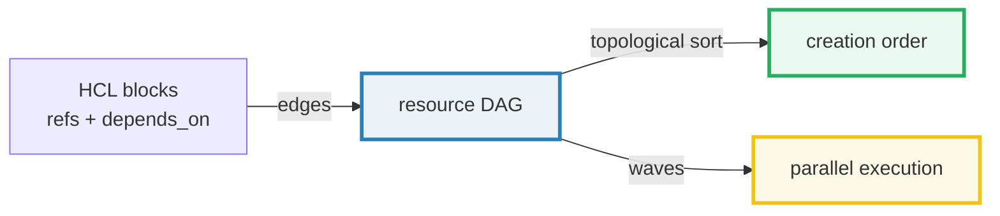
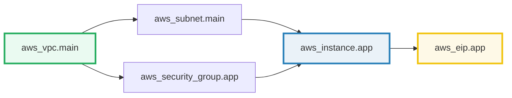
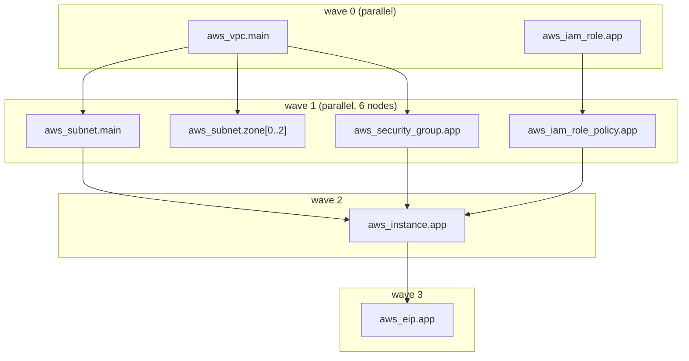

# The HCL Resource Dependency Graph — A Visual, Worked-Example Guide

> **Companion code:** [`hcl_graph.py`](./hcl_graph.py). **Every graph, topological
> order, and execution wave in this guide is printed by
> `python3 hcl_graph.py`** — change the code, re-run, re-paste. Nothing here is
> hand-computed.
>
> **Live animation:** [`hcl_graph.html`](./hcl_graph.html) — open in a browser; it
> rebuilds the DAG, the topological order, and the parallel waves from the
> identical model and checks against the `.py` gold.
>
> **Source material:** Terraform docs — *Resource Dependencies*, *Meta-Arguments:
> `count` / `for_each` / `depends_on`*, *Command: graph*
> (developer.hashicorp.com/terraform). Kahn (1962) for topological sorting.

---

## 0. TL;DR — the whole idea in one picture

### Read this first — the construction site with prerequisites

Think of a Terraform config as a **construction site**. Each `resource` block is
a **task**. Some tasks cannot start until another finishes: you cannot pour the
floor (subnet) before the foundation (VPC) exists, and you cannot wire the
doorbell (EIP) before the wall with the door (instance) is up.

Terraform discovers these prerequisites by **reading your HCL**:



- **Implicit dependency** — a block references another's output:
  `subnet_id = aws_subnet.main.id`. Terraform **knows** the instance needs the
  subnet, so it draws an edge `aws_subnet.main -> aws_instance.app`.
- **Explicit dependency** — you write `depends_on = [aws_iam_role_policy.app]`,
  adding an edge yourself for cases no reference exposes.

The result is a **directed acyclic graph (DAG)**. Terraform **topologically
sorts** it (every edge points "earlier"), then runs nodes whose prerequisites are
all done, **in parallel**.

> **One-line definition:** HCL references + `depends_on` form a DAG; Terraform
> topologically sorts it for a valid creation order and runs independent nodes
> concurrently.

### Glossary (every term used below)

| Term | Plain meaning |
|---|---|
| **node** | one resource block, *expanded* — so `count = 3` is 3 nodes |
| **edge** | a dependency arrow `u -> v`: "u must exist before v" (u = dependency, v = dependent) |
| **implicit dep** | an edge inferred from an attribute reference (`vpc_id = aws_vpc.main.id`) |
| **explicit dep** | an edge added by `depends_on = [...]` |
| **reference** | a pointer to another resource inside an attribute value |
| **topological sort** | an ordering where every edge `u -> v` has `u` before `v` (Kahn's algorithm) |
| **wave / level** | nodes runnable together = same longest-dependency-chain length; no intra-wave edges → **parallel** |
| **count / for_each** | meta-arguments that generate N nodes from one block (`addr[0..N-1]` / `addr["key"]`) |
| **DOT** | the graph language `terraform graph` emits, renderable with Graphviz |

---

## 1. The resource DAG — Section A output

Each HCL block is a node. A reference `X.id` inside block `B`, or a
`depends_on = [X]`, draws an edge `X -> B`.

> From `hcl_graph.py` **Section A** — the DAG (10 nodes, 10 edges):
>
> | node | depends on |
> |---|---|
> | `aws_vpc.main` | `{}` (root) |
> | `aws_subnet.main` | `{aws_vpc.main}` |
> | `aws_subnet.zone[0..2]` | `{aws_vpc.main}` |
> | `aws_security_group.app` | `{aws_vpc.main}` |
> | `aws_iam_role.app` | `{}` (root) |
> | `aws_iam_role_policy.app` | `{aws_iam_role.app}` |
> | `aws_instance.app` | `{aws_subnet.main, aws_security_group.app, aws_iam_role_policy.app}` |
> | `aws_eip.app` | `{aws_instance.app}` |
>
> roots (start immediately): `aws_iam_role.app`, `aws_vpc.main`.
> leaves (nothing depends on them): `aws_eip.app`, `aws_subnet.zone[0..2]`.

The classic chain:



---

## 2. Topological sort — Section B output (the GOLD)

A topological order lists every node **after** its dependencies. Terraform uses
it to decide what to create first.

> From `hcl_graph.py` **Section B** — Kahn's algorithm (deterministic, ready-set
> kept sorted):
>
> ```
>  1. aws_iam_role.app
>  2. aws_iam_role_policy.app
>  3. aws_vpc.main
>  4. aws_security_group.app
>  5. aws_subnet.main
>  6. aws_instance.app
>  7. aws_eip.app
>  8. aws_subnet.zone[0]
>  9. aws_subnet.zone[1]
> 10. aws_subnet.zone[2]
> ```
>
> VALIDATION: no violations — every dependency precedes its dependent.
> ```
> GOLD topological order has 10 nodes, all edges respected
> [check] topological order respects ALL dependencies?  OK
> ```

The `.html` rebuilds the DAG and re-runs Kahn's algorithm in JS, then verifies
that **every edge's dependency appears before its dependent** — that is the
bundle's gold-check.

> **Note:** multiple valid topological orders exist; Terraform schedules "as soon
> as deps finish." The validation property (deps before dependents) holds for
> *any* valid order — that is what makes a topological sort correct.

---

## 3. Parallel execution — waves — Section C output

Terraform creates nodes as soon as their dependencies finish. Grouping nodes by
**wave** (longest dependency-chain length) shows what runs in **parallel**:
nodes in the same wave have **no edges between them**.

> From `hcl_graph.py` **Section C**:
>
> | wave | nodes (in parallel) |
> |---|---|
> | 0 | `aws_iam_role.app`, `aws_vpc.main` (2) |
> | 1 | `aws_iam_role_policy.app`, `aws_security_group.app`, `aws_subnet.main`, **`aws_subnet.zone[0]`, `[1]`, `[2]`** (6) |
> | 2 | `aws_instance.app` (1) |
> | 3 | `aws_eip.app` (1) |
>
> Widest wave = 6 → up to **6 concurrent** API calls. Sequential creation would
> take 10 round-trips; waves collapse it to **4 rounds**.
> `[check] no intra-wave edges (each wave is a safe parallel set)? OK`



**Watch wave 1:** the three `aws_subnet.zone[i]` (the `count=3` block) sit
alongside `aws_subnet.main` and the security group — none depend on each other,
so Terraform creates them concurrently.

---

## 4. Implicit vs explicit dependencies — Section D output

**Implicit** — inferred from an attribute reference. The instance block:

```hcl
resource "aws_instance" "app" {
  subnet_id              = aws_subnet.main.id          # <- ref
  vpc_security_group_ids = [aws_security_group.app.id] # <- ref
}
```

makes Terraform draw two edges **without** `depends_on`:
`aws_subnet.main -> aws_instance.app` and `aws_security_group.app -> aws_instance.app`.

**Explicit** — added by you, for cases no reference exposes:

```hcl
resource "aws_instance" "app" {
  depends_on = [aws_iam_role_policy.app]
}
```

There is no data flowing from the policy to the instance, but the app needs the
policy attached **at runtime** — so you force the edge
`aws_iam_role_policy.app -> aws_instance.app`.

> From `hcl_graph.py` **Section D** — for `aws_instance.app`:
>
> | kind | deps |
> |---|---|
> | implicit (refs) | `aws_security_group.app`, `aws_subnet.main` |
> | explicit (depends_on) | `aws_iam_role_policy.app` |
> | combined | `aws_iam_role_policy.app`, `aws_security_group.app`, `aws_subnet.main` |
>
> `[check] combined deps == implicit | explicit? OK`

**Key point:** an edge is an edge. Once built, Terraform treats implicit and
explicit dependencies **identically** for ordering — both must be satisfied
before the node runs. `depends_on` is the escape hatch for ordering that no
reference can express.

---

## 5. `count` / `for_each` — Section E output

The meta-argument `count = 3` generates three resources from one block:

```hcl
resource "aws_subnet" "zone" {
  count       = 3
  vpc_id      = aws_vpc.main.id
  cidr_block  = cidrsubnet(aws_vpc.main.cidr_block, 8, count.index)
}
```

Expands to **three separate nodes**, each a distinct address.

> From `hcl_graph.py` **Section E** —
> `aws_subnet.zone[0]`, `[1]`, `[2]` each depend on `{aws_vpc.main}` and nothing
> else; all in **wave 1**.
>
> ```
> aws_subnet.zone[0]: depends on ['aws_vpc.main'] ; wave 1
> aws_subnet.zone[1]: depends on ['aws_vpc.main'] ; wave 1
> aws_subnet.zone[2]: depends on ['aws_vpc.main'] ; wave 1
> [check] count=3 made 3 independent sibling nodes (same wave)?  OK
> ```

Each generated node is its own graph node. Since the three siblings share no
edges among them, they are created **in parallel**. `for_each` works identically:
each map key becomes a node with an indexed address like `aws_subnet.zone["a"]`.

---

## 6. `terraform graph` → DOT (appendix)

`terraform graph` emits a Graphviz DOT description of the DAG — render it with
`dot -Tsvg` to visualize dependencies:

```
digraph G {
  "aws_vpc.main" -> "aws_subnet.main";
  "aws_vpc.main" -> "aws_subnet.zone[0]";
  "aws_vpc.main" -> "aws_security_group.app";
  "aws_iam_role.app" -> "aws_iam_role_policy.app";
  "aws_iam_role_policy.app" -> "aws_instance.app";
  "aws_security_group.app" -> "aws_instance.app";
  "aws_subnet.main" -> "aws_instance.app";
  "aws_instance.app" -> "aws_eip.app";
}
```

---

## 7. Pitfalls & debugging checklist

| # | Mistake | Symptom | Fix |
|---|---|---|---|
| 1 | A reference typo | "Reference to undeclared resource" | fix the address; refs must match a real `type.name` |
| 2 | Missing `depends_on` for a runtime ordering | resource created too early, app fails | add `depends_on` for orderings no reference exposes |
| 3 | Cycle in dependencies | "Cycle: ... " error during plan | a DAG must be acyclic; break the loop |
| 4 | Expecting count siblings to be ordered | `zone[2]` created before `zone[0]` | siblings have no edges → arbitrary/parallel order; never rely on index order |
| 5 | Confusing dependency with data | "depends_on passes no data" | use a reference (data) OR depends_on (order only); choose deliberately |
| 6 | Reading `terraform graph` as timeline | thinks earlier DOT line = earlier creation | DOT lists edges, not time; use waves (§3) for timing |

---

## 8. Cheat sheet

- **References + `depends_on` ⇒ edges ⇒ DAG.** `X.id` inside `B` draws `X -> B`.
- **Topological sort** = a creation order with every dependency before its dependent (Kahn's algorithm).
- **Waves** = nodes with the same longest-chain length run **in parallel** (no intra-wave edges).
- **`depends_on`** adds an edge with no data flow (runtime ordering escape hatch).
- **`count = N` / `for_each`** generate N nodes — each its own graph node, parallel where deps allow.
- **`terraform graph`** emits DOT for Graphviz.
- **GOLD:** topological order respects all 10 dependency edges; widest wave = 6 parallel nodes.

---

## Sources

- **Terraform Resource Dependencies** — developer.hashicorp.com/terraform/language/resources/dependencies:
  "Terraform ... builds a resource graph ... determines the order of operations";
  implicit dependencies from references; `depends_on` for explicit ones.
- **Meta-Arguments** — `count`, `for_each`, `depends_on`
  (developer.hashicorp.com/terraform/language/meta-arguments).
- **Command: graph** — developer.hashicorp.com/terraform/cli/commands/graph:
  outputs the dependency graph in DOT format for Graphviz.
- **Kahn, A. B.** *Topological Sorting of Large Networks*, Communications of the
  ACM 5(11), 1962 — the in-degree-reduction algorithm used here.
