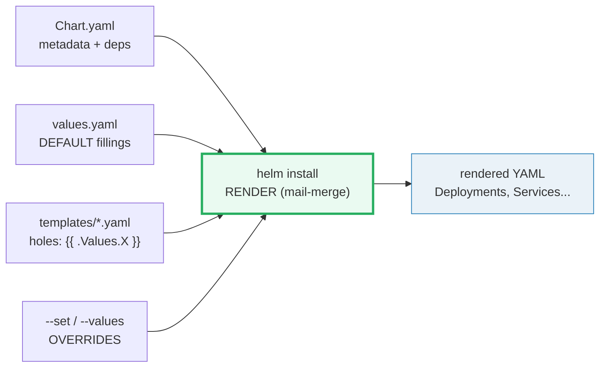
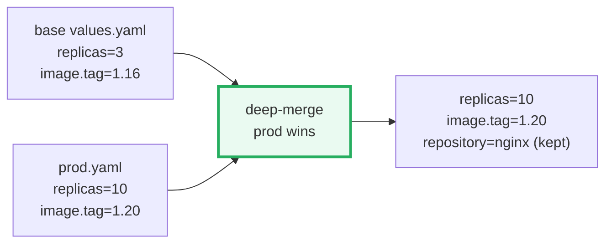
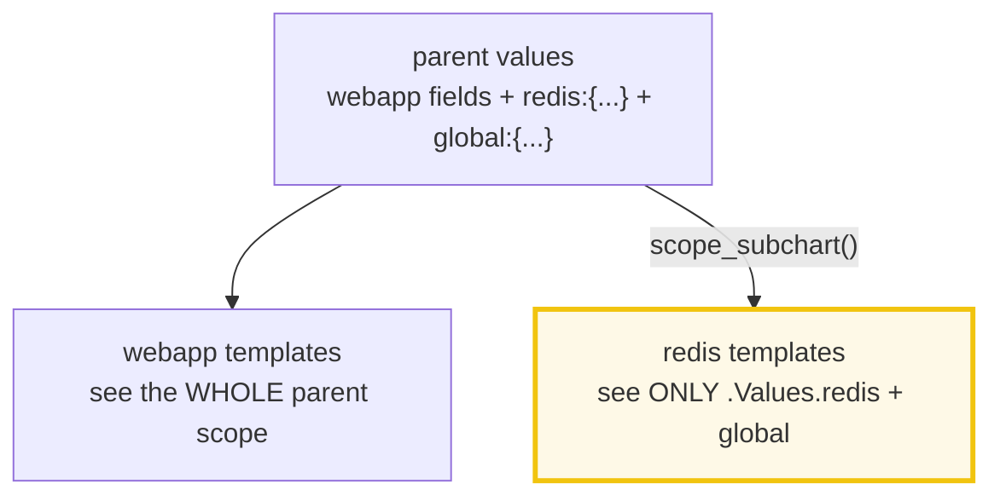

# Helm Charts — A Visual, Worked-Example Guide

> **Companion code:** [`helm_chart.py`](./helm_chart.py). **Every template,
> rendered YAML, values merge, hook timeline, and subchart scoping in this guide
> is printed by `python helm_chart.py`** — change the code, re-run, re-paste.
> Nothing here is hand-computed.
>
> **Live animation:** [`helm_chart.html`](./helm_chart.html) — open in a browser;
> it re-runs the renderer + override + subchart scoping in JS and runs the same
> gold check as the `.py`.
>
> **Source material:** helm.sh — *Chart Template Guide*, *Hooks*, *Subcharts and
> Globals*, *OCI Registries*; *Kubernetes Patterns* (Ibryam & Huss).

---

## 0. TL;DR — Helm is a mail-merge for Kubernetes YAML

You ship the **same** app to dev, staging, prod. Writing a dozen hand-tuned YAML
files per environment is a config-drift nightmare. **Helm** is a **mail-merge
engine for YAML**: a *chart* is a folder of **templates with holes**
(`{{ .Values.replicas }}`), `values.yaml` is the **default fillings**, and
`helm install` pours the values into the holes and hands **finished YAML** to
Kubernetes. Kubernetes never sees templates — it sees ordinary Deployments.



- **Chart** = `Chart.yaml` + `values.yaml` + `templates/`. The unit Helm packages.
- **Render** = substitute values into templates → finished YAML (`helm install` /
  `helm template`). Deterministic for a given chart + values.
- **Values override** = `--set image.tag=v2` (one scalar) or `--values prod.yaml`
  (deep-merged). Overrides win; unset keys fall through to base.
- **Hook** = a template annotated `helm.sh/hook` (pre-install, post-upgrade…).
  Runs at a lifecycle phase, **not** as a steady-state resource.
- **Subchart** = a chart declared in `dependencies`; rendered with its **own
  scoped** values (`.Values.<subchart>`) + a shared `global`.

> **One-line rules:**
> - `helm install` = mail-merge: `{{ .Values.replicas }}` → `3`.
> - `--set` swaps a scalar; `--values` deep-merges a file (prod wins, base fills gaps).
> - a subchart sees **only** its scoped block + `global`, never the parent's values.
> - a hook is a normal template + an annotation, scheduled by phase then weight.

### Glossary

| Term | Plain meaning |
|---|---|
| **Chart** | a folder: `Chart.yaml` + `values.yaml` + `templates/` |
| **Chart.yaml** | metadata: name, version, appVersion, dependencies, type |
| **values.yaml** | default values for the chart's template holes |
| **template** | a YAML file with Go-template holes `{{ .Values.X }}` |
| **render** | substitute values into templates → finished YAML |
| **Release** | one installation of a chart: name + namespace + revision |
| **.Values** | the values dict after base + overrides are coalesced |
| **--set** | override a value on the CLI: `--set image.tag=v2` |
| **--values / -f** | override values from a file; deep-merged |
| **range** | Go-template loop: `{{ range .Values.workers }}...{{ end }}` |
| **hook** | template annotated `helm.sh/hook`, run at a lifecycle phase |
| **subchart** | chart in `dependencies`; rendered with scoped values |
| **library chart** | `type: library` — defines `{{ define }}` helpers, renders nothing |
| **global** | values under `global` are visible to parent **and** subcharts |
| **OCI registry** | charts pushed/pulled as OCI artifacts (`helm push … oci://`) |

---

## 1. Chart structure — `Chart.yaml` + `values.yaml` + `templates/` — Section A

```
webapp/
├── Chart.yaml          # metadata: name, version, appVersion, deps, type
├── values.yaml         # DEFAULT values for the template holes
├── charts/             # subchart tarballs (`helm dependency update`)
└── templates/
    ├── deployment.yaml # main app Deployment (.Values.replicas, .Values.image)
    ├── workers.yaml    # {{ range }} loop -> one Deployment per worker
    ├── service.yaml    # Service exposing the app
    ├── hooks.yaml      # pre-install / post-install hook templates
    └── _helpers.tpl    # {{ define }} named snippets (NOT a resource)
```

> From `helm_chart.py` **Section A** — the chart metadata + default values:
>
> | field | value |
> |---|---|
> | `name` / `version` / `appVersion` | `webapp` / `0.1.0` / `1.16` |
> | `values.replicas` | `3` |
> | `values.image` | `repository=nginx, tag=1.16, pullPolicy=IfNotPresent` |
> | `values.workers` | `[{ingestion, 2}, {processor, 4}]` |

`[check]` chart has `Chart.yaml` + `values.yaml` + `templates/`: **OK**.

---

## 2. Template rendering — `{{ .Values.X }}` and `{{ range }}` — Section B

A template has **holes**; rendering pours values into them. Two substitution
forms cover most charts:

| construct | template | rendered (defaults) |
|---|---|---|
| scalar | `replicas: {{ .Values.replicas }}` | `replicas: 3` |
| scalar (nested) | `image: "{{ .Values.image.repository }}:{{ .Values.image.tag }}"` | `image: "nginx:1.16"` |
| **range** | `{{ range .Values.workers }}...{{ .name }}...{{ .replicas }}...{{ end }}` | one Deployment **per** worker |

> From `helm_chart.py` **Section B** — `workers.yaml` before/after:
>
> **before (template, 2 items in `.Values.workers`):**
> ```
> {{ range .Values.workers }}---
> kind: Deployment
> metadata:
>   name: {{ .Release.Name }}-{{ .name }}
> spec:
>   replicas: {{ .replicas }}
> {{ end }}
> ```
> **after (rendered):** `web-ingestion` (replicas 2) **and** `web-processor`
> (replicas 4) — one Deployment per list item.

`[check]` replicas=3, image=`nginx:1.16`, 2 workers (ingestion=2, processor=4): **OK**.

---

## 3. Values override — `--set` and `--values` (deep-merge) — Section C

Overrides change the mail-merge output without touching the chart. Two paths:

| override | form | scope | what it does |
|---|---|---|---|
| `--set` | `--set image.tag=v2` | one dotted scalar | swaps a single leaf |
| `--values / -f` | `--values prod.yaml` | whole file | **deep-merges**: prod wins, base fills gaps |



> From `helm_chart.py` **Section C**:
>
> | command | merged result | rendered image |
> |---|---|---|
> | `--set image.tag=v2` | `image.tag=v2` (repository kept) | `image: "nginx:v2"` |
> | `--values prod.yaml` | `replicas=10`, `image.tag=1.20` (repository/pullPolicy from base) | `image: "nginx:1.20"`, `replicas: 10` |

`[check]` `--set` → `nginx:v2` ; `--values prod` → replicas=10, `nginx:1.20`: **OK**.

---

## 4. Hooks — pre-install Secret, post-install smoke-test — Section D

A hook is a **normal template** plus the `helm.sh/hook` annotation. Helm does
**not** apply it as steady-state; it runs it at the named **phase**, ordered by
`hook-weight` (lower first within a phase).

| event | when | typical use |
|---|---|---|
| `pre-install` | before any resource is created | create a bootstrap secret |
| `post-install` | after all resources are created | run a smoke-test Job |
| `pre-upgrade` | before applying the new revision | run a DB migration Job |
| `post-upgrade` | after the upgrade is applied | warm a cache / notify |
| `pre-rollback` | before rolling back | take a backup |
| `test` | `helm test` only | run integration tests |

> From `helm_chart.py` **Section D** — install lifecycle order (phase, then weight):
>
> | order | phase | resource | weight |
> |---|---|---|---|
> | 1 | `pre-install` | Secret `web-bootstrap-token` | −5 |
> | 2 | `install` | main templates (Deployment, Service, workers) | 0 |
> | 3 | `post-install` | Job `web-smoke-test` (wget `/healthz`) | +5 |

`[check]` hook ordering `pre-install(−5) < install < post-install(+5)`: **OK**.

---

## 5. Subcharts + GOLD — parent + redis, prod values — Section E

A subchart is a chart declared in `Chart.yaml` `dependencies`. At render time
each subchart gets its **own scoped** values: the parent's `.Values.<subchart>`
block, **plus** the shared `global`. The subchart **cannot** see the parent's
other values.



> From `helm_chart.py` **Section E** — redis sees `architecture=standalone`,
> `auth.enabled=true`, `service.ports.redis=6379`, `global.imageRegistry`. The
> redis template uses `{{ if .Values.auth.enabled }}` to conditionally render the
> auth Secret.

### Gold check (recomputed by `helm_chart.html`)

A `webapp` chart with a `redis` subchart, prod overrides, rendered together:

> From `helm_chart.py` **Section E** — rendered values:
>
> | check | result |
> |---|---|
> | webapp prod `replicas=10` | True |
> | webapp prod `image="nginx:1.20"` | True |
> | redis Service `port=6379` | True |
> | redis auth Secret rendered (`{{ if auth.enabled }}`) | True |
> | `global` visible to subchart | True |
> | auth.enabled=False → Secret **dropped** by `{{ if }}` | True |
> | **GOLD: chart + subchart render as expected** | **OK** |

> **GOLD scalars for the `.html`:** webapp image line = `image: "nginx:1.20"`,
> webapp replicas = `10`, redis Service port = `6379`, redis auth enabled = `True`.

---

### Sources
- helm.sh — *Chart Template Guide*, *Hooks*, *Subcharts and Globals*, *Chart Repository*, *OCI Registries*
- *Kubernetes Patterns* (Ibryam & Huss) — Configuration & Immutable Configuration patterns
- Go `text/template` docs (the engine Helm uses under the hood)
