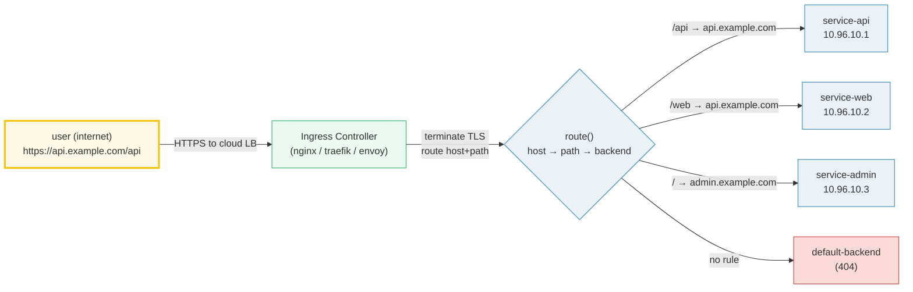
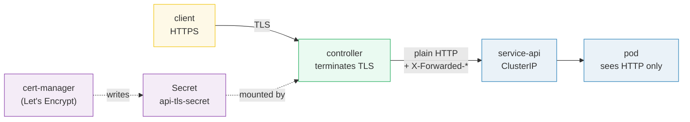

# Kubernetes Ingress — A Visual, Worked-Example Guide

> **Companion code:** [`ingress.py`](./ingress.py). **Every number and routing
> decision in this guide is printed by `python3 ingress.py`** — change the code,
> re-run, re-paste. Nothing here is hand-computed.
>
> **Live animation:** [`ingress.html`](./ingress.html) — open in a browser; it
> re-runs the identical routing engine and checks against the `.py` gold.
>
> **Source material:** Kubernetes Ingress docs
> (kubernetes.io/concepts/services-networking/ingress), ingress-nginx docs, and
> the Gateway API spec (gateway-api.sigs.k8s.io).

---

## 0. TL;DR — the whole idea in one picture

### Read this first — the building with one front desk per name

A Kubernetes **Service** (ClusterIP) is reachable *inside* the cluster by a
stable name + IP. But users on the public internet cannot dial a ClusterIP, and
they cannot reach "all of my services" through a single Service. You need
something that sits on the **edge**, reads the **HTTP request** (Host header +
URL path), and decides **which internal Service** to forward to — and that
**terminates TLS** so backends don't each need a cert.

That something is an **Ingress**. Picture a big office building with **one
street address**. Visitors (HTTP requests) walk up to the single front desk
(the **Ingress Controller**) and hand over a slip: "I want the api desk, path
`/api/users`". The receptionist reads the **Host** name + the **path** and
points the visitor down the correct hallway to ONE back office (a Service).



> **One-line definition:** an *Ingress* is a set of **L7 routing rules**
> (host + path → backend Service). It is just **config** — it routes nothing on
> its own. An **Ingress Controller** (nginx/traefik/envoy) must read those rules
> and actually serve traffic.

### Glossary (every term used below)

| Term | Plain meaning |
|---|---|
| **Ingress** | a Kubernetes API resource — a list of routing rules (host + path → backend Service). Config, not a program |
| **Ingress Controller** | the pod(s) that watch Ingress resources and serve real HTTP traffic. Implementations: ingress-nginx, traefik, envoy, HAProxy, ALB. **None ship with k8s** |
| **host-based routing** | route by the HTTP Host header (domain): `api.example.com` → service-api |
| **path-based routing** | route by the URL path within a host: `/api` → service-api, `/web` → service-web |
| **TLS termination** | the controller decrypts HTTPS with a cert (in a Secret), then talks plain HTTP to the backend |
| **annotation** | a key/value configuring the *specific* controller (`nginx.ingress.kubernetes.io/...`). **Not portable** across controllers |
| **default backend** | where a request matching no rule goes (a 404 page) |
| **Gateway API** | the successor to Ingress (GA 2023). Role-oriented (GatewayClass/Gateway/HTTPRoute), portable, more expressive |

---

## 1. The Ingress resource as a routing table — Section A output

The Ingress and the Service are **two separate objects**. The Ingress points at
Services *by name*; the controller resolves that to a ClusterIP at request time.

> From `ingress.py` **Section A** — backend Services (ClusterIPs, internal only):
>
> ```
> service-api      10.96.10.1:8080
> service-web      10.96.10.2:8080
> service-admin    10.96.10.3:8080
> default-backend  10.96.10.99:8080   <- catch-all / 404 handler
> ```
>
> The Ingress rules (`spec.rules`):
>
> ```
> - host: api.example.com      /api  -> service-api   (path)
> - host: api.example.com      /web  -> service-web   (path)
> - host: api.example.com      /     -> service-web   (catch-all for this host)
> - host: admin.example.com    /     -> service-admin (whole host)
> ```

Read it as a **2-level decision tree**: Level 1 is the **host**, Level 2 is the
**path** (longest matching prefix wins). **Host-based routing** sends a whole
domain to one service (`admin.example.com`); **path-based routing** splits one
domain across several (`/api`, `/web`).

> **KEY POINT:** an Ingress is just **config**. It routes nothing on its own —
> an Ingress Controller must read it and serve traffic.

---

## 2. The routing engine — (host, path) → backend — Section B output (GOLD)

For each request the controller asks: which **host** rule matches? then which
is the **longest** matching **path prefix**? then forward to that backend. The
full routing table from `ingress.py`:

> ```
> host                path                host?  matched   backend
> ------------------  ------------------  -----  --------  -------------------
> api.example.com     /api/v1/users       yes    /api      service-api
> api.example.com     /api                yes    /api      service-api
> api.example.com     /web/index.html     yes    /web      service-web
> api.example.com     /web                yes    /web      service-web
> api.example.com     /blog               yes    /         service-web
> admin.example.com   /                   yes    /         service-admin
> admin.example.com   /dashboard          yes    /         service-admin
> shop.example.com    /api                NO     -         default-backend
> ```

Two requests traced step by step:

- `api.example.com/api/v1/users` → host matches → longest prefix `/api` →
  **service-api**
- `shop.example.com/api` → **no host rule** → **default-backend** (404)

This is the **GOLD routing map** that `ingress.html` recomputes live and checks
against — eight `(host, path)` decisions, each landing on the correct backend.

---

## 3. TLS termination — HTTPS in, HTTP out — Section C output

The controller holds the TLS certificate (in a `kubernetes.io/tls` **Secret**) and
decrypts HTTPS, then talks **plain HTTP** to the backend. The backend never sees
TLS. **cert-manager** automates issuing Let's Encrypt certs and writes them into
the Secret the Ingress references.

> The termination flow for `https://api.example.com/api`:
>
> ```
> client            -> controller LB IP        HTTPS (TLS)  api.example.com/api
> controller (term) -> decrypt w/ api-tls-secret   now plaintext
> controller (route)-> route() decision        host=api / prefix=/api -> service-api
> controller -> Svc -> service-api ClusterIP   plain HTTP to 10.96.10.1:8080
> Service -> pod    -> kube-proxy DNAT         -> pod IP 10.244.1.5:8080
> ```

What the backend pod **sees** vs the original client: **HTTP** (TLS stripped),
**source IP = controller pod** (original client lost → `X-Forwarded-For`), but
the **Host header is passed through** (it is needed for routing). Because the
controller terminates TLS, **one cert at the edge secures many backends**.



---

## 4. The Ingress Controller — Deployment + LoadBalancer — Section D output

An Ingress Controller is just a **Deployment** (or DaemonSet) running a reverse
proxy. It **watches** Ingress resources and regenerates its config live. But to
receive **internet** traffic it must be **exposed** — a separate concern:

- **Deployment:** `ingress-nginx-controller` (the proxy). Reads Ingress objects
  via a watch, generates `nginx.conf`, reloads on rule change.
- **Service (type: LoadBalancer):** exposes the controller pod on ports
  **80** (HTTP) and **443** (HTTPS). The cloud provisions an **external load
  balancer**; its external IP is what DNS for `api.example.com` resolves to.

| topology | edge | use |
|---|---|---|
| Deployment + LoadBalancer | cloud provisions 1 external LB IP | default (most clouds) |
| DaemonSet + hostNetwork | every node's real IP:80/443 | bare-metal (no cloud LB) |

The chain, end to end: **DNS** → cloud LB (LoadBalancer Service) → **controller
pod** (terminate TLS, route) → backend **Service** ClusterIP (kube-proxy) → **pod**.

> **WHY one controller for everything:** one external LB = one cloud bill, one TLS
> cert spot, one place for rate-limiting / CORS / auth. Adding a service = a few
> lines in the Ingress, **not** a new LB.

---

## 5. Annotations — controller-specific config (the portability flaw) — Section E output

The Ingress spec is generic, but real controllers need knobs the spec has no field
for (rewrite, body size, CORS, timeouts). Those live in **annotations** — keys
scoped to the controller. They are **not portable**: nginx annotations are ignored
by traefik/ALB.

> nginx annotations on `api.example.com`:
>
> ```
> nginx.ingress.kubernetes.io/rewrite-target       : /
> nginx.ingress.kubernetes.io/proxy-body-size      : 10m
> nginx.ingress.kubernetes.io/cors-allow-origin    : https://app.example.com
> nginx.ingress.kubernetes.io/proxy-connect-timeout: 10
> ```

**`rewrite-target` is the #1 misconfigured annotation.** With
`rewrite-target=/` the matched prefix is stripped before forwarding:

> ```
> path /api/users   prefix /api  rewrite-target=/  ->  '/users'
> path /api         prefix /api  rewrite-target=/  ->  '/'
> path /web/a.css   prefix /web  rewrite-target=/  ->  '/a.css'
> ```

Without it, the **full path** is sent (`/api/users` → `/api/users`). The deeper
problem: these keys are **nginx-only** — move to the AWS ALB controller and
`nginx.ingress.kubernetes.io/rewrite-target` is silently ignored. **This is a
core reason Gateway API exists.**

---

## 6. Ingress vs Gateway API — the future standard — Section F output

Gateway API (GA 2023) is the **role-oriented** successor. It splits one
monolithic Ingress into **three roles**, each owned by a different team, and adds
**portable, structured fields** that Ingress only has via the non-portable
annotation hack.

| role | Gateway API resource | who owns it | Ingress equivalent |
|---|---|---|---|
| infra | GatewayClass | cluster admin | (the controller itself) |
| operator | Gateway (listener) | platform/SRE team | controller's LB Service |
| app developer | HTTPRoute | the app team | the Ingress resource |

| concern | Ingress | Gateway API |
|---|---|---|
| routing scope | HTTP only | HTTP, TCP, UDP, TLS, gRPC |
| config portability | controller-specific keys | portable CRD fields |
| traffic splitting | annotation hack (per ctrl) | native weighted backends |
| role separation | one object, mixed owners | Gateway vs Route split |
| path matching | ImplementationSpecific only | Exact, Prefix, Regex |

The same `/api` → service-api rule in both APIs:

```
# Ingress
rules:
  - host: api.example.com
    http: { paths: [ { path: /api, backend: { service: { name: service-api } } } ] }

# Gateway API HTTPRoute
parentRefs: [{ name: my-gateway }]
hostnames: [api.example.com]
rules:
  - matches: [{ path: { type: Prefix, value: /api } }]
    backendRefs: [{ name: service-api, port: 8080 }]
```

Ingress is **not removed — it is frozen**. New features land in Gateway API. For
greenfield L7 routing, **Gateway API is the recommended path.**

---

### Companion files

- [`ingress.py`](./ingress.py) — the single source of truth (pure stdlib).
- [`ingress_output.txt`](./ingress_output.txt) — verbatim program output.
- [`ingress.html`](./ingress.html) — interactive version; recomputes the gold
  routing map and self-checks.

> Related: [`SERVICE_ENDPOINTS.md`](./SERVICE_ENDPOINTS.md) (how the backend
> ClusterIP → pod DNAT works) and [`COREDNS.md`](./COREDNS.md) (how the host name
> `api.example.com` is resolved to the controller's external IP).
