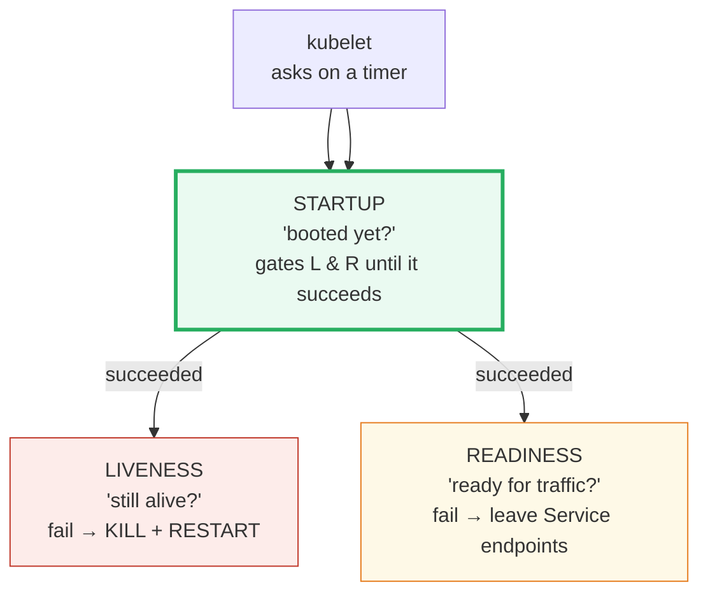
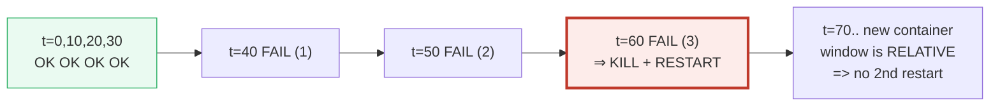
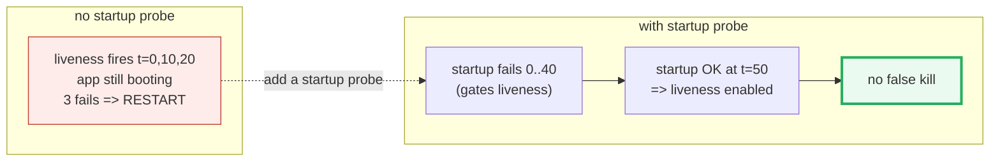

# Kubernetes Kubelet Probes — A Visual, Worked-Example Guide

> **Companion code:** [`kubelet_probes.py`](./kubelet_probes.py). **Every
> timeline, table, and restart count in this guide is printed by
> `python kubelet_probes.py`** — change the code, re-run, re-paste. Nothing here
> is hand-computed.
>
> **Live animation:** [`kubelet_probes.html`](./kubelet_probes.html) — open in a
> browser; it recomputes the liveness simulation in JS and runs the same gold
> check as the `.py`.
>
> **Source material:** kubernetes.io — *Configure Liveness, Readiness and Startup
> Probes*; *Kubernetes Patterns* (Ibryam & Huss), Ch. "Health Probe".

---

## 0. TL;DR — the doctor and the triage nurse

The **kubelet** (the agent on every node) asks each container in a pod **three
yes/no questions** on a fixed schedule. Each question is a *probe*. The whole
mechanism is just "ask on a timer, count consecutive failures, act on a
threshold."



- **Liveness** — the *doctor checking a pulse*. No pulse → resuscitate (restart
  the container). About the **container**: is the *process* hung/deadlocked?
- **Readiness** — the *triage nurse routing patients*. Desk closed → stop
  sending people there (remove the pod from the Service's endpoints), but
  **don't** restart. About the **network**: can clients *reach* you?
- **Startup** — a **one-shot gate** for slow boots. While it has not succeeded,
  liveness and readiness are **disabled**, so a JVM that takes 45s to boot is
  not killed at t=20s. Once it passes, it's done forever.

> **One-line definitions:**
> - *liveness* = "still alive?" → `failureThreshold` consecutive fails ⇒ **kill + restart**.
> - *readiness* = "ready for traffic?" → fail ⇒ **remove from Service endpoints** (no restart); recover ⇒ re-add.
> - *startup* = "booted yet?" → gates liveness/readiness **until first success**.

### Glossary

| Term | Plain meaning |
|---|---|
| **kubelet** | the agent on each node that runs pods and fires the probes |
| **liveness probe** | "still alive?" — fail threshold ⇒ KILL + RESTART the container |
| **readiness probe** | "ready for traffic?" — fail ⇒ pull pod from Service **endpoints** (NOT a restart) |
| **startup probe** | "booted yet?" — gates liveness/readiness until it succeeds |
| **Service** | a stable virtual IP/DNS that load-balances across **ready** pods |
| **endpoints** | the live list of ready pod IPs a Service forwards traffic to |
| **failureThreshold** | consecutive fails before action |
| **periodSeconds** | seconds between probe invocations |
| **initialDelaySeconds** | wait this long after container start before the first probe |
| **successThreshold** | consecutive successes to flip back to healthy/ready |

---

## 1. KIND × HANDLER — Section A

A probe is a pair: a **KIND** (what a failure *does*) and a **HANDLER** (how the
question is *asked*).

| kind | on `failureThreshold` breached | restarts? |
|---|---|---|
| **liveness** | KILL container + RESTART it | **YES** |
| **readiness** | remove pod from Service endpoints | NO |
| **startup** | KILL + RESTART (boot took too long) | YES |

The three **handlers** all collapse to one boolean (pass/fail), so the KIND is
what matters:

| handler | mechanism | pass if |
|---|---|---|
| `httpGet` | HTTP GET `<path>` on `:<port>` | status **200–399** |
| `tcpSocket` | open TCP to `:<port>` | connection succeeded |
| `exec` | run a command inside the container | **exit code 0** |

> 🔗 **Key distinction:** liveness is about the **container** (deadlock? restart
> it). readiness is about the **network** (can clients reach it? *route around*
> it). startup is a one-shot gate so slow boots are not punished.

---

## 2. Liveness — HTTP GET `/healthz` every 10s, 3 fails ⇒ restart — Section B

```yaml
livenessProbe:
  httpGet: { path: /healthz, port: 8080 }
  initialDelaySeconds: 0
  periodSeconds: 10
  failureThreshold: 3
```

The app is healthy except during the **relative** window `t_rel ∈ [40, 70)`. The
kubelet probes every 10s; each fail in the window increments a consecutive
counter. Three in a row ⇒ kill + restart.

> From `kubelet_probes.py` **Section B** (timeline):
>
> | t(s) | t_rel | probe | result | note |
> |---|---|---|---|---|
> | 0,10,20,30 | … | liveness | OK | app healthy |
> | 40 | 40 | liveness | **FAIL** | consec_fail=1 |
> | 50 | 50 | liveness | **FAIL** | consec_fail=2 |
> | 60 | 60 | liveness | **FAIL** | consec_fail=3 ⇒ **RESTART #1** |
> | 70,80,90 | 10,20,30 | liveness | OK | fresh container, window is relative |



> **Formula:** `restart_tick = first_fail + (failureThreshold − 1) × periodSeconds`
> `= 40 + (3−1)×10 = 60`.
> `[check]` sim restart tick `[60] == [60]`: **OK**.
>
> **GOLD:** `restartCount = 1`. (The failure window is relative to each
> *container* start, so a single transient blip produces exactly one restart.)

---

## 3. Readiness — fail ⇒ leave Service endpoints (no restart) — Section C

```yaml
readinessProbe:
  httpGet: { path: /ready, port: 8080 }
  periodSeconds: 10
  failureThreshold: 1     # pull fast, don't wait
```

The app is **not ready** during `t_rel ∈ [20, 50)`. Readiness never restarts — it
only changes **endpoint membership**:

> From `kubelet_probes.py` **Section C** — endpoint/traffic membership over time:
>
> | window | state | endpoints | traffic |
> |---|---|---|---|
> | `[0, 20)` | **READY** | in Service | gets traffic |
> | `[20, 50)` | **NOT READY** | **removed** | **NO traffic** (no restart!) |
> | `[50, 60)` | **READY** | re-added | resumes |

With **3 replicas** (pod-B goes not-ready at t=20), its share is spread across
the survivors — no restart, no cold start:

> | t | endpoints | traffic % |
> |---|---|---|
> | 10 | A, B, C | 33 / 33 / 33 |
> | 30 | **A, C** (B sick) | 50 / **0** / 50 |
> | 55 | A, B, C | 33 / 33 / 33 |

`[check]` readiness `restartCount == 0` (it never restarts): **OK**.

---

## 4. Startup — protect a slow-booting JVM — Section D

A JVM needs ~45s to boot; `/healthz` returns nothing useful until `t_rel ≥ 45`.
Same slow app, two configs:

> From `kubelet_probes.py` **Section D**:
>
> | config | what happens | `restartCount` |
> |---|---|---|
> | **no startup probe** (liveness from t=0) | liveness fails at t=0,10,20 ⇒ **RESTART** at t=20; boot resets each restart ⇒ **crash-loop** | **2** |
> | **with startup probe** (`failureThreshold: 6`) | startup keeps failing (allowed, up to ~60s grace) until it passes at `t_rel=50`; **then** liveness wakes up | **0** |



`[check]` restarts: no-startup=2 (crash-loop), with-startup=0 ⇒ startup probe
saved the boot: **OK**.

---

## 5. Common misconfigurations that cascade — Section E

1. **Too-aggressive liveness during a slow deploy/rollout.** `initialDelay=0`,
   `period=10`, `FT=3`, app boots in ~45s ⇒ killed at t=20 (Section D case 1).
   *Fix:* add a **startup probe**, or raise `initialDelaySeconds` above the known
   boot time.
2. **Sharing ONE endpoint between liveness AND readiness.** If `/health` serves
   both, a slow-under-load response trips **both at once**: readiness fail ⇒ pod
   leaves endpoints (load shifts to survivors) **and** liveness fail ⇒ pod is
   killed + restarted (cold start ⇒ even slower ⇒ survivors trip too). This is
   the classic **cascading restart**. *Fix:* split them — readiness=`/ready`
   (cheap, fast, low FT), liveness=`/healthz` (deeper check, higher FT). They
   measure **different** things.
3. **`failureThreshold: 1` for liveness.** A single transient hiccup (GC pause,
   one slow query) ⇒ immediate kill. Always use `FT ≥ 2` for liveness.

---

## 6. Tuning + GOLD — Section F

You are really tuning **time-to-action** (the tolerance window):

```
action_tick = first_fail_tick + (failureThreshold − 1) × periodSeconds
```

> From `kubelet_probes.py` **Section F**:
>
> | initialDelay | period | failureThreshold | tolerance window |
> |---|---|---|---|
> | 0 | 10 | 1 | 0s after 1st fail |
> | 0 | 10 | 3 | 20s after 1st fail |
> | 30 | 10 | 3 | 20s after 1st fail |
> | 0 | 5 | 3 | 10s after 1st fail |
> | 0 | 10 | 6 | 50s after 1st fail |

Bigger window = more tolerant, but slower to recover a truly dead container.

### Gold check (recomputed by `kubelet_probes.html`)

The canonical liveness scenario (window `[40,70)`, `period=10`, `FT=3`,
`horizon=95`) is independently re-derived:

- expected: `restartCount=1`, tick `[60]`
- sim: `restartCount=1`, tick `[60]`
- `[check]` GOLD match: **OK**

> **GOLD scalar for the `.html`:** `restartCount = 1`, `restart_tick = 60`.

---

### Sources
- kubernetes.io — *Configure Liveness, Readiness and Startup Probes*
- *Kubernetes Patterns* (Bilgin Ibryam & Roland Huss) — Health Probe pattern
- Burns et al., "Borg, Omega, and Kubernetes" (2016) — kubelet responsibilities
