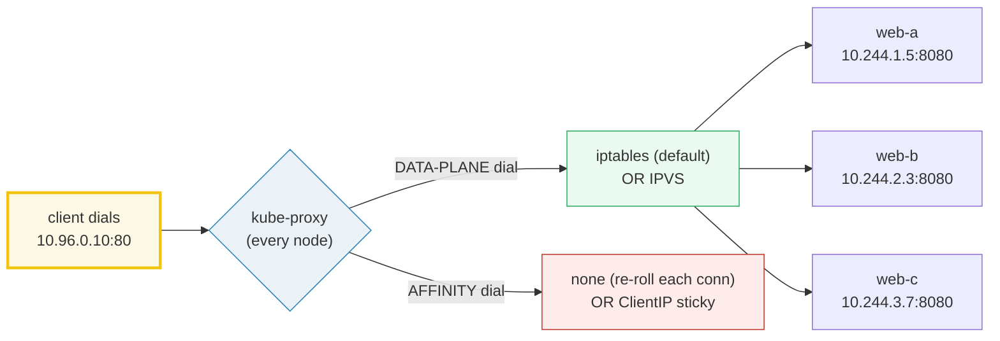

# kube-proxy — the iptables / IPVS data plane — A Visual, Worked-Example Guide

> **Companion code:** [`kube_proxy.py`](./kube_proxy.py). **Every iptables rule,
> conntrack flow, IPVS trace, and traffic count in this guide is printed by
> `python3 kube_proxy.py`** — change the code, re-run, re-paste. Nothing here is
> hand-computed.
>
> **Live animation:** [`kube_proxy.html`](./kube_proxy.html) — open in a browser;
> it re-runs the identical simulations and checks against the `.py` gold.
>
> **Companion bundle:** [`SERVICE_ENDPOINTS.md`](./SERVICE_ENDPOINTS.md) covers
> the Service/Endpoints *object* + selector. THIS guide goes deep on the
> kube-proxy *data plane* — the chain structure, conntrack stickiness, IPVS
> algorithms, and the O(n)-vs-O(1) story.
>
> **Source material:** Kubernetes kube-proxy reference (iptables + ipvs modes),
> the iptables `-m statistic` match, IPVS (Wensong Zhang), and Istio/Envoy +
> gRPC client-side LB docs.

---

## 0. TL;DR — the whole idea in one picture

### Read this first — the switchboard operator with two dials

**kube-proxy** is a daemon on **every** node. It watches Services + Endpoints
and writes **kernel rules** so a packet sent to a Service's ClusterIP
(`10.96.0.10:80`) is rewritten **in flight** to one of the backing pods
(`10.244.X.Y:8080`). The rewrite happens in the **originating** node's kernel —
the packet never actually "travels to the ClusterIP."

Picture kube-proxy as a **switchboard operator on every floor**. A visitor dials
extension 80 (the ClusterIP); the operator intercepts and re-patches the call to
**one** of three desks (pods). The operator has **two dials**:



> **One-line definition:** *kube-proxy* turns Service+Endpoints into kernel
> forwarding rules — **iptables** (a linear `-m statistic` chain, default) or
> **IPVS** (a kernel L4 LB with O(1) hash lookup + real schedulers). **conntrack**
> makes every packet *within* a connection stick to the first-chosen pod.

### Glossary (every term used below)

| Term | Plain meaning |
|---|---|
| **kube-proxy** | the daemon on every node that turns Service+Endpoints into kernel rules |
| **KUBE-SVC-*** | the per-Service iptables chain that load-balances across endpoints |
| **KUBE-SEP-*** | the per-endpoint iptables chain that does the DNAT |
| **`-m statistic`** | the iptables module for random LB; `--probability p` claims p of remaining flow |
| **conntrack** | the kernel connection table; ESTABLISHED flows reuse the cached DNAT (same backend) |
| **sessionAffinity** | a Service option; ClientIP makes NEW connections from the same IP sticky (TTL 3h) |
| **IPVS** | IP Virtual Server — a kernel L4 LB; O(1) Service lookup; schedulers rr/wrr/lc/wlc |
| **scheduler** | the IPVS algorithm that picks a real server (rr, wrr, lc, wlc, sh, sed, nq) |
| **O(n) vs O(1)** | iptables walks rules linearly; IPVS hashes the Service. Matters at thousands of Services |

---

## 1. iptables mode — the full chain + equal weights — Section A output

kube-proxy writes a **3-tier** iptables chain per Service. `KUBE-SERVICES`
dispatches by ClusterIP; `KUBE-SVC-*` load-balances via `-m statistic`; `KUBE-SEP-*`
does the DNAT:

> From `kube_proxy.py` **Section A** — Service `web`, ClusterIP `10.96.0.10:80`,
> 3 backends:
>
> ```
> -A KUBE-SERVICES -d 10.96.0.10/32 -p tcp --dport 80 -j KUBE-SVC-WEB
> -A KUBE-SVC-WEB -m statistic --mode random --probability 0.33333333 -j KUBE-SEP-WEB0
> -A KUBE-SVC-WEB -m statistic --mode random --probability 0.50000000 -j KUBE-SEP-WEB1
> -A KUBE-SVC-WEB -j KUBE-SEP-WEB2
> -A KUBE-SEP-WEB0 -p tcp -j DNAT --to-destination 10.244.1.5:8080
> -A KUBE-SEP-WEB1 -p tcp -j DNAT --to-destination 10.244.2.3:8080
> -A KUBE-SEP-WEB2 -p tcp -j DNAT --to-destination 10.244.3.7:8080
> ```
>
> The chain gives each pod an equal **1/3** share: rule 0 claims 1/3; rule 1
> claims 1/2 of the *remaining* 2/3 (= 1/3); rule 2 takes the rest.

To prove the distribution is real, the `.py` routes **300** connections through
the chain with a seeded RNG (xorshift32, seed=42):

> From `kube_proxy.py` **Section A** — 300 connections to `10.96.0.10:80`:
>
> | pod | hits | share |
> |---|---|---|
> | web-a | 107 | 35.7% |
> | web-b | 98 | 32.7% |
> | web-c | 95 | 31.7% |
>
> ```
> GOLD hit counts (pinned for kube_proxy.html) = [107, 98, 95]
> [check] each pod within 8% of 100?  OK
> ```

---

## 2. Connection tracking — ESTABLISHED flows stick — Section B output

Once a connection's first packet picks a backend, **conntrack caches the DNAT**.
Every later packet of the *same* connection hits the cached entry and goes to the
**same** backend — the statistic chain is **skipped** (the kernel fast-paths
ESTABLISHED flows). So "random" applies only to **new** connections.

> From `kube_proxy.py` **Section B** — one connection, 5 packets:
>
> | pkt# | key | → backend | state |
> |---|---|---|---|
> | #0 | 10.0.0.50:40000 → 10.96.0.10:80 | web-a | NEW (conntrack recorded) |
> | #1 | (same) | web-a | ESTABLISHED (reuse) |
> | #2–#4 | (same) | web-a | ESTABLISHED (reuse) |
>
> All 5 packets land on **web-a** (the first pick). Only packet #0 ran the
> statistic chain.

**sessionAffinity: ClientIP** extends stickiness to **new** connections from the
same client IP (TTL 10800s = 3h) — implemented as an extra `-m recent` rule (or
an IPVS persistence table). Distinct from conntrack: conntrack keys on the
5-tuple; affinity keys on the client IP.

---

## 3. IPVS mode — weighted round-robin + schedulers — Section C output

In IPVS mode kube-proxy talks to the kernel's **IP Virtual Server** — a dedicated
L4 load balancer. Service lookup is a **hash (O(1))**; the scheduler picks a real
server. Available schedulers: `rr`, `wrr`, `lc`, `wlc`, `sh`, `sed`, `nq`.

> From `kube_proxy.py` **Section C** — IPVS commands + weighted simulation:
>
> ```
> ipvsadm -A -t 10.96.0.10:80 -s wrr
> ipvsadm -a -t 10.96.0.10:80 -r 10.244.1.5:8080 -m -w 1
> ipvsadm -a -t 10.96.0.10:80 -r 10.244.2.3:8080 -m -w 2
> ipvsadm -a -t 10.96.0.10:80 -r 10.244.3.7:8080 -m -w 1
> ```
>
> weights `web-a=1, web-b=2, web-c=1` → expected 25% / 50% / 25%.
> wrr first cycle (4 picks = sum of weights):
> `['web-b', 'web-a', 'web-b', 'web-c']`
>
> | pod | hits | share | expected |
> |---|---|---|---|
> | web-a | 100 | 25.0% | 25.0% |
> | web-b | 200 | 50.0% | 50.0% |
> | web-c | 100 | 25.0% | 25.0% |
>
> ```
> GOLD wrr counts (pinned) = [100, 200, 100]
> [check] wrr proportions EXACTLY match weights over complete cycles?  OK
> ```

**Why exact:** the IPVS wrr scheduler (kernel `ip_vs_wrr.c`) is **deterministic**
— one full cycle yields exactly `sum(weights)` selections, with backend *i*
chosen `weight_i` times. No RNG involved.

---

## 4. Performance — iptables O(n) scan vs IPVS O(1) hash — Section D output

iptables is a **linear** rule list. A packet is matched against rules in order
until one fires. With `S` Services × `E` endpoints, kube-proxy writes
`~S*(2E+1)` rules; a packet to the **last** Service walks nearly all of them.

> From `kube_proxy.py` **Section D** — rule count + scan cost (10 ep/Service):
>
> | cluster size | Services | iptables rules | avg scan | worst scan | IPVS lookup |
> |---|---|---|---|---|---|
> | 100 Svcs | 100 | 2,100 | 50 | 100 | O(1) hash |
> | 1 000 Svcs | 1 000 | 21,000 | 500 | 1 000 | O(1) hash |
> | 10 000 Svcs | 10 000 | 210,000 | 5 000 | 10 000 | O(1) hash |
> | 100 000 Svcs | 100 000 | 2,100,000 | 50 000 | 100 000 | O(1) hash |
>
> At 10K Services × 10 endpoints, iptables ships ~210K rules and a typical packet
> walks ~5K of them. IPVS does **one** hash lookup. That is why IPVS is
> recommended for thousands of Services. (Cilium's eBPF data plane removes both —
> see [`CNI.md`](./CNI.md).)

---

## 5. Client-side load balancing — skipping kube-proxy — Section E output

kube-proxy load-balances **in the kernel** of the originating node. An
alternative is to load-balance **in the client**, skipping kube-proxy (and the
ClusterIP) entirely:

| approach | how it picks a pod | when to use |
|---|---|---|
| **Envoy sidecar (Istio)** | proxy container per pod; xDS-discovered cluster; RR / least-request | service mesh; sidecar injected |
| **gRPC client-side LB** | the gRPC channel balances: pick-first or round_robin over pod IPs | app uses gRPC; no kernel rules |

With a **Headless** Service (`clusterIP: None`), DNS returns the pod IPs
directly — the client-side LB iterates them and **no kube-proxy rules** are
written. Trade-off: every client must speak the LB protocol (gRPC) or carry a
sidecar (Envoy); plain HTTP/TCP clients still need kube-proxy.

---

## 6. GOLD — traffic distribution matches expected weights (the bundle's gold-check)

The bundle's gold-check is **traffic distribution matches the expected weights**
for both data planes. [`kube_proxy.html`](./kube_proxy.html) recomputes both
simulations in JS and checks against the `.py` gold:

> From `kube_proxy.py` **GOLD** summary:
>
> | # | mode | weights | counts | expected proportions |
> |---|---|---|---|---|
> | 1 | iptables rand | [1,1,1] | [107, 98, 95] | ~33% / 33% / 33% |
> | 2 | IPVS wrr | [1,2,1] | [100, 200, 100] | 25% / 50% / 25% |
>
> `[check] both distributions match expected weights: OK`

> 🔗 The `.html` re-runs the xorshift32 stream (iptables) AND the deterministic
> wrr scheduler (IPVS) in JavaScript, then asserts the green `check: OK` badge.
> iptables is within tolerance of equal; IPVS wrr is **exact**.

---

## 7. Pitfalls & debugging checklist

| # | Mistake | Symptom | Fix |
|---|---|---|---|
| 1 | Slow pod-to-Service at scale | high latency on large clusters | switch to IPVS mode (O(1)) |
| 2 | Expecting conntrack = affinity | new conns from same client re-roll | that's normal; use `sessionAffinity: ClientIP` for sticky new conns |
| 3 | IPVS not taking effect | still seeing iptables rules | set `--proxy-mode=ipvs` + ensure kernel modules (`ip_vs`, `ip_vs_wrr`) loaded |
| 4 | Uneven weights ignored | wrr not distributing by weight | check `-w` (weight) on each ipvsadm real server |
| 5 | Cilium + kube-proxy both running | double Service LB | enable `kubeProxyReplacement` and remove kube-proxy |
| 6 | Headless Service + client LB but expecting a VIP | no ClusterIP, DNS gives pod IPs | that's the point — see SERVICE_ENDPOINTS.md §4 |

---

## 8. Cheat sheet

- **kube-proxy** = daemon on every node → kernel rules: ClusterIP:port → podIP:targetPort.
- **iptables mode** = 3-tier chain (`KUBE-SERVICES`→`KUBE-SVC`→`KUBE-SEP`); `-m statistic --mode random`; equal 1/N.
- **conntrack** = ESTABLISHED flows reuse the cached DNAT (same backend); only NEW conns re-roll.
- **sessionAffinity: ClientIP** = NEW conns from same IP sticky (TTL 3h); separate from conntrack.
- **IPVS mode** = kernel L4 LB; O(1) hash lookup; schedulers rr/wrr/lc/wlc/sh/sed/nq.
- **wrr** = deterministic; proportions EXACTLY `weight_i / sum(weights)` over complete cycles.
- **O(n) vs O(1)** = iptables linear walk vs IPVS hash; crossover ~thousands of Services.
- **Client-side LB** = Envoy sidecar / gRPC channel; skips kube-proxy; pairs with Headless Service.
- **GOLD:** iptables `[107, 98, 95]` (≈33%); IPVS wrr `[100, 200, 100]` (25/50/25) — both match `.html`.

---

## Sources

- **kube-proxy** — kubernetes.io, *kube-proxy* reference.
  https://kubernetes.io/docs/reference/command-line-tools-reference/kube-proxy/
  - Verified: runs on every node; `--proxy-mode` selects iptables (default) or
    ipvs; watches Services + Endpoints and programs kernel rules.
- **iptables `-m statistic`** — netfilter/iptables.
  - Verified: `--mode random --probability p` claims a fraction of flow; kube-proxy
    chains them so equal-weight endpoints each get 1/N.
- **IPVS** — Wensong Zhang, *IP Virtual Server*; Linux kernel `ip_vs` + schedulers
  (`ip_vs_rr`, `ip_vs_wrr`, `ip_vs_lc`, `ip_vs_wlc`). Hash-based O(1) lookup.
- **Istio / Envoy** — client-side (sidecar) load balancing via xDS-discovered clusters.
- **gRPC client-side LB** — `pick-first` (default) and `round_robin` policies.
- **Borg** — Verma et al. EuroSys 2015, for the "internal load balancing" heritage.
