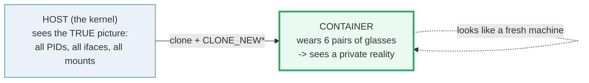
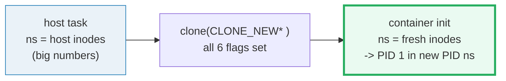
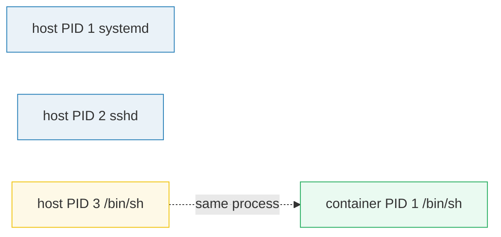
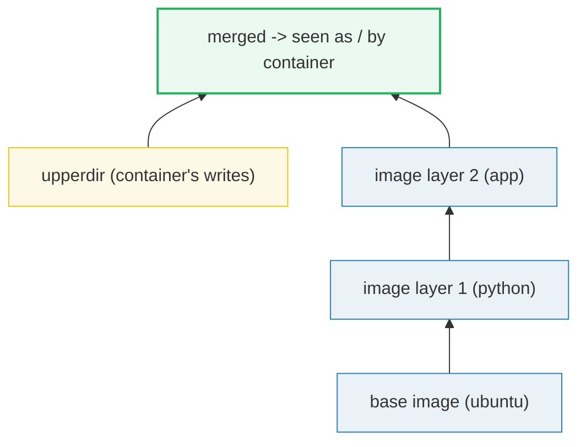

# Linux Namespaces — A Visual, Worked-Example Guide

> **Companion code:** [`namespaces.py`](./namespaces.py). **Every number in this
> guide is printed by `uv run python namespaces.py`** — change the code, re-run,
> re-paste. Nothing here is hand-computed.
>
> **Sibling guide:** [`CGROUPS.md`](./CGROUPS.md) — namespaces *isolate*, cgroups
> *limit*. A container = namespaces + cgroups.
>
> **Live animation:** [`namespaces.html`](./namespaces.html) — open in a browser.
>
> **Source material:** `HOW_TO_RESEARCH.md`, the Linux `clone(2)` / `namespaces(7)`
> man pages, and the OCI runtime spec (`runc` `linux.namespaces`).

---

## 0. TL;DR — the whole idea in one picture

### Read this first — the office with the magic glasses

Without namespaces a Linux box is one big open-plan office: every process sees the
same PID list, the same network cards, the same hostname, the same mounted files.
Anyone can read anyone's mail.

A **namespace is a pair of glasses.** Put on a different pair and the world looks
different — you see a different PID 1, a different `eth0`, a different `/`. The
**kernel** (the host) still sees the true, combined picture; each process only
sees its filtered view.



- **A container = a process wearing six pairs of glasses at once** — PID, NET,
  MNT, UTS, IPC, USER. From inside it looks like a fresh machine. From outside
  (on the host) it is just process `12345`.
- The trick: **nothing is copied.** The kernel keeps ONE table and hands each
  process a filtered *look* at it. That is why a container is a few pointers
  per task — cheap — vs a VM, which runs a whole second kernel.

> **One-line definition:** a *namespace* filters one category of kernel resource
> for the processes inside it. Identity is a kernel **inode** — two processes
> share a namespace iff `/proc/<pid>/ns/<type>` points to the same inode.

### Glossary (every term used below)

| Term | Plain meaning |
|---|---|
| **namespace** | a "pair of glasses" — a filtered view of ONE kernel resource type, identified by an inode in `/proc/<pid>/ns/` |
| **nsproxy** | the per-process holder of its 6 current namespaces |
| **PID ns** | process-id glasses. Inside, the first process is renumbered to `1` ("init"). The host still calls it `12345` |
| **NET ns** | network glasses. Own `lo`, own `eth0`, own IP, own routing table, own iptables |
| **MNT ns** | mount-point glasses. Own `/` tree, own overlayfs mounts |
| **UTS ns** | hostname glasses. Own `uname -n` |
| **IPC ns** | glasses over SysV IPC + POSIX mqueues + shared memory |
| **USER ns** | uid glasses. UID `0` inside can map to UID `100000` outside — the basis of rootless containers |
| **unshare(2)** | the calling process swaps its OWN namespaces for fresh ones |
| **clone(2)** | `fork()` + `unshare()` in one step — the child wakes up already wearing new glasses. This is how `runc` spawns a container |

---

### The technical TL;DR



| ns type | clone flag | isolates | host ≠ container? |
|---|---|---|---|
| **PID** | `CLONE_NEWPID` | process IDs | container's PID 1 ≠ host's PID 1 |
| **NET** | `CLONE_NEWNET` | network stack | own `eth0` IP `172.17.0.2` vs host `10.0.0.5` |
| **MNT** | `CLONE_NEWNS` | mount points | own `/` is overlayfs vs host's ext4 |
| **UTS** | `CLONE_NEWUTS` | hostname | own `uname -n` |
| **IPC** | `CLONE_NEWIPC` | SysV IPC / shm | own `ipcs` list |
| **USER** | `CLONE_NEWUSER` | uid/gid mapping | uid `0` inside == uid `100000` outside |

---

## 1. The lineage — namespaces shipped one type per kernel release

Namespaces entered mainline Linux piecemeal over a decade. There is nothing
magic about "six" — that is just how many existed once `USER` landed:

| type | year | kernel | note |
|---|---|---|---|
| Mount | 2002 | 2.4.19 | the first — `chroot++` |
| UTS | 2006 | 2.6.19 | hostname isolation |
| IPC | 2006 | 2.6.19 | SysV queues / semaphores / shm |
| PID | 2008 | 2.6.24 | the famous one — process renumbering |
| NET | 2009 | 2.6.29 | full independent network stack; gives containers their own loopback + veth peer |
| USER | 2013 | 3.8 | uid/gid mapping — the last piece; enables **rootless** |
| cgroup | 2016 | 4.6 | bonus 7th, not in the classic six |

The composite — a process wearing all of MNT+UTS+IPC+PID+NET+USER — is what the
LXC project shipped and what **Docker** (2013) and **runc** wrapped into a
friendly CLI. The OCI runtime spec lists these exact six as the
`linux.namespaces` array in `config.json`.

---

## 2. SECTION A — the six pairs of glasses

`uv run python namespaces.py` → **SECTION A** prints:

```
| type | clone flag       | isolates                        | what differs vs host      |
|------|-----------------|---------------------------------|---------------------------|
| PID  | CLONE_NEWPID    | process IDs                     | container's PID 1 != host PID 1 |
| NET  | CLONE_NEWNET    | network stack                   | own lo/eth0, IP, routes   |
| MNT  | CLONE_NEWNS     | mount points                    | own / tree, overlayfs     |
| UTS  | CLONE_NEWUTS    | hostname / domainname           | own uname -n              |
| IPC  | CLONE_NEWIPC    | SysV IPC, POSIX mqueues, shm    | own ipcs list             |
| USER | CLONE_NEWUSER   | uid/gid mapping                 | uid 0 inside == uid 100000 outside |
```

**The identity rule (the whole game):** two tasks share a namespace iff their
`/proc/<pid>/ns/<type>` symlinks point to the **same inode**. The model pins the
host's initial namespaces to big inodes (mirroring a real box, where
`/proc/1/ns/pid` is something like `4026531836`):

```
/proc/1/ns/pid  -> inode 0xEFFFFFF9
/proc/1/ns/net  -> inode 0xEFFFFFFA
/proc/1/ns/mnt  -> inode 0xEFFFFFFB
/proc/1/ns/uts  -> inode 0xEFFFFFFC
/proc/1/ns/ipc  -> inode 0xEFFFFFFD
/proc/1/ns/user -> inode 0xEFFFFFFE
```

A freshly-`unshare`'d namespace gets a new, smaller inode. **Equal inode = shared;
different inode = isolated.** That one sentence is the entire formal definition.

---

## 3. SECTION B — PID namespace: "I am PID 1" (but only in here)

This is the namespace everyone meets first. The host sees a flat PID list. The
kernel hands the container a **second numbering**: the very first task in a new
PID namespace is **always renumbered to 1** — so the container's `/bin/sh`
believes it is the init of a fresh machine.

```
HOST view (ps aux)                  CONTAINER view (inside PID ns 0xF0000000)
  HOST PID  NAME              ...     CONTAINER PID  NAME          == HOST PID
  1         systemd                     1             /bin/sh         3
  2         sshd                        2             sleep 600       4
  3         /bin/sh                     3             nginx: worker   5
  4         sleep 600
  5         nginx: worker
```

The host keeps a **hidden mapping table** so it can translate signals between
the two numberings: `container PID 1 -> host PID 3`. The container can never
see `systemd` or `sshd` — they live in a different PID namespace.



> **Why this matters:** a container that kills its own PID 1 reaps the whole
> namespace — the kernel destroys every process whose PID namespace is a
> descendant. That is why `docker stop` works: signal PID 1, the tree dies.

---

## 4. SECTION C — NET namespace: own loopback, own `eth0`, own routes

A NET namespace is a **complete, independent network stack**: its own loopback,
its own interfaces, its own IP addresses, its own routing table, its own
iptables. Nothing crosses the boundary except via an explicit bridge
(`docker0`) + a **veth pair** (a virtual ethernet cable plugged into both
namespaces).

```
HOST stack (inode 0xEFFFFFFA)        CONTAINER stack (inode 0xF0000007)
  lo    127.0.0.1/8                    lo    127.0.0.1/8
  eth0  10.0.0.5/24                    eth0  172.17.0.2/16
  default via 10.0.0.1                 default via 172.17.0.1
```

Both stacks call their main interface `eth0`, but the IPs differ and the routing
tables are unrelated. The container can `ping 127.0.0.1` and hit **its own**
loopback, completely invisible to the host's loopback — that is full-stack
isolation, not just port forwarding.

---

## 5. SECTION D — MNT namespace: own `/` tree, the overlayfs trick

A MNT namespace gives a process its **own mount table** — its own view of what
is mounted on `/`. The host's `mount` and the container's `mount` show
**different filesystems**, even though they share the same physical disk.

```
HOST mount table (inode 0xEFFFFFFB)   CONTAINER mount table (inode 0xF000000E)
  /dev/sda1 on /  type ext4             overlay    on /  type overlay
  proc       on /proc                   proc       on /proc
  tmpfs      on /run                    tmpfs      on /tmp
```

The container's `/` is an **overlayfs** — the core of every Docker image:



- `lowerdir` = read-only image layers (ubuntu, then python, then app)
- `upperdir` = the container's own writable scratch space
- `merged` = the unified view the container sees as `/`

When the container writes `/etc/foo`, it lands in `upperdir`. The image layers
are never mutated — so **100 containers share ONE ubuntu image**. A file mounted
in the container never shows up in `mount` on the host shell (unless you
`nsenter` the container's MNT ns first).

---

## 6. SECTION E — USER namespace: "I am root" (but the host disagrees)

A USER namespace is a **lookup table between uids**. The container says "uid 0",
the kernel looks it up, and on the host it is uid `100000`. The container has
**full root powers inside** its namespace (can bind port 80, can kill its own
children), but **zero real privilege outside** — it cannot touch host
`/etc/passwd`. This is how **rootless** containers (Podman) work.

`uid_map` format: `<inside_first> <outside_first> <count>`

```
HOST USER ns:        uid 0 -> uid 0      count 65536   (identity)
CONTAINER USER ns:   uid 0 -> uid 100000 count 65536   (shifted!)

container: 'I am uid 0'      host sees: uid 100000
container: 'I am uid 1000'   host sees: uid 101000
container: 'I am uid 65535'  host sees: uid 165535
```

Note the boundary: inside-uid `65536` is **not** covered by the map — the kernel
refuses to create such a process. That caps a container's identity space.

---

## 7. SECTION F — `unshare` / `clone`, and the gold check

Two syscalls create namespaces:

- **`unshare(flags)`** — the *calling* process swaps its *own* namespaces for
  fresh ones (e.g. `unshare --pid --fork bash`). Used by the `unshare` CLI.
- **`clone(flags)`** — `fork()` a *child* that is *already* in fresh namespaces.
  This is what `runc`/`containerd` do. The child wakes up as PID 1 in a new PID
  ns with a new network stack, etc.

The flags are bitmasks. To make a full container you OR them all together:

```
ALL_SIX = CLONE_NEWNS | CLONE_NEWUTS | CLONE_NEWIPC | CLONE_NEWPID
        | CLONE_NEWNET | CLONE_NEWUSER
        = 0x7C020000
```

### The gold check — isolation across all six axes

A real container must be isolated on **every** axis, not just some. The model
asserts that for each type, the container's inode ≠ the host's inode:

```
TYPE  host inode   container inode  isolated?
PID   0xEFFFFFF9   0xF0000018       OK
NET   0xEFFFFFFA   0xF0000019       OK
MNT   0xEFFFFFFB   0xF000001A       OK
UTS   0xEFFFFFFC   0xF000001B       OK
IPC   0xEFFFFFFD   0xF000001C       OK
USER  0xEFFFFFFE   0xF000001D       OK

[check] all 6 namespaces isolated from host: OK
```

The pinned gold values (recomputed live in `namespaces.html`):

| quantity | value |
|---|---|
| container init local PID | `1` |
| container init host PID | `3` (≠ 1 ⇒ isolation holds) |
| isolated namespace count | `6 / 6` |
| container uid 0 on host | `100000` |
| container `eth0` IP | `172.17.0.2` |
| container hostname | `c1.containers.internal` |

---

## 8. How this connects to Docker / Kubernetes

Every `docker run` (and every Kubernetes pod) ultimately calls `runc`, which
emits a `config.json` whose `linux.namespaces` array is exactly:

```json
"namespaces": [
  {"type": "pid"}, {"type": "ipc"}, {"type": "uts"},
  {"type": "mnt"}, {"type": "net"}, {"type": "user"}
]
```

`runc` then does the `clone(CLONE_NEW* )` and sets up the payload we modelled:
veth into a bridge (NET), overlayfs on `/` (MNT), a uid_map (USER). What you
call "a container" is, from the kernel's point of view, **just a process whose
six nsproxy pointers point at six fresh inodes** — plus the cgroup limits in
[`CGROUPS.md`](./CGROUPS.md) that cap how much CPU/RAM/IO it may use.

---

## Sources

- `clone(2)`, `unshare(2)`, `namespaces(7)`, `user_namespaces(7)` man pages
- OCI Runtime Spec — `config.json` `linux.namespaces`
- Biederman & co., the LXC / namespaces patch series (2002–2013)
- `namespaces.py` (this bundle) — the executable source of truth
