# OverlayFS — How Docker Stores Images & Containers, Visually

> **Companion code:** [`overlayfs.py`](./overlayfs.py). **Every number in this
> guide is printed by `uv run python overlayfs.py`** — change the code, re-run,
> re-paste. Nothing here is hand-computed.
>
> **Sibling guides:** [`DOCKERFILE.md`](./DOCKERFILE.md) (how the layers this
> guide stacks up are *built*) and [`NAMESPACES.md`](./NAMESPACES.md) (the MNT
> namespace is what makes a container's `/` *be* an overlay mount).
> Cross-references are marked 🔗 throughout.
>
> **Live animation:** [`overlayfs.html`](./overlayfs.html) — open in a browser.

---

## 0. TL;DR — overhead transparencies on a projector

### Read this first — the stack of acetate sheets

Picture a stack of acetate sheets on an overhead projector:

- Each sheet is a **layer**. Most are **printed once and never changed** — the
  image layers (read-only). One **blank sheet** sits on top for you to scribble
  on — the running container's writable layer.
- You look **down** through the whole stack: the **merged** view is what you
  see. Where the top sheet and a lower sheet both have writing, the **top sheet
  wins** — it hides whatever is printed underneath at that spot.
- To **edit** a note printed on a lower sheet, you can't erase it (read-only).
  Instead you **trace** that note onto your top sheet first, then change your
  tracing. That trace is **copy-on-write (CoW)**. The printed original is *never*
  touched — so 100 students can lay 100 blank sheets on the **same** printed
  stack, each with private doodles, while the printed originals stay pristine
  and shared.

```mermaid
graph TB
    M["merged<br/>the union view the container sees as '/'"]
    U["upperdir<br/>container's WRITABLE layer<br/>(thin, per-container)"]
    L2["lower: pip flask<br/>read-only"]
    L1["lower: apt python3<br/>read-only"]
    L0["lower: ubuntu base<br/>read-only (shared by all containers)"]
    M --> U --> L2 --> L1 --> L0
    style M fill:#2a2233,stroke:#8e7cc3
    style U fill:#1c3a25,stroke:#27ae60,stroke-width:3px
    style L2 fill:#0d2438,stroke:#2980b9
    style L1 fill:#0d2438,stroke:#2980b9
    style L0 fill:#0d2438,stroke:#2980b9
```



That is the whole of Docker's image storage. The four kernel terms map straight
onto the projector:

| Kernel term | The projector |
|---|---|
| **lowerdir** | the printed sheets (the image's read-only layers, bottom = base OS) |
| **upperdir** | your blank sheet (the container's writable layer) |
| **merged** | the union view the container actually sees as `/` |
| **copy-up** | tracing a printed note onto your sheet before editing it |
| **whiteout** | a "ignore this note" sticky on your sheet (how `rm` works) |

> **One-line definition:** *OverlayFS* stacks read-only **lower** layers under a
> single writable **upper** layer and presents their **union** as one tree.
> Writes to a lower file trigger a one-time **copy-up** into upper; the lowers
> are immutable, so they are **shared** by every container that uses them.

### Glossary (every term used below)

| Term | Plain meaning |
|---|---|
| **layer** | a read-only set of files (a tarball / a printed sheet). Identified by a content digest — its "layer ID" |
| **image** | an ordered **stack** of read-only layers (bottom = base OS, top = latest change). Stored once, shared by all containers |
| **lowerdir** | the image layers of a mount, given **top-first** (`lowerdir=L2:L1:L0`). L2 shadows L1 |
| **upperdir** | the container's writable layer. **All** writes land here |
| **merged** | the union filesystem the container sees: upper shadows lower |
| **copy-up** | the **first** write to a file that lives in a lower layer. The kernel copies it upper-ward, *then* applies the write. Happens **once per file per mount** |
| **whiteout** | how a `rm` is represented: a marker in upper that hides a lower path. Deletes are container-private; the lower original stays on disk |
| **overlay2** | Docker's default storage driver on Linux ≥ 4.0. Implements all of the above via the in-kernel OverlayFS filesystem |

### The technical TL;DR

The merged view is a pure union lookup, and writes to a lower-resident file are
the only thing that costs a copy:

```
merged(path)      = upper[path] if present, else top-most lower[path]
write to lower-p  => copy-up: upper gains p (ONCE), lower UNCHANGED
cow_count(mount)  == number of DISTINCT lower files written to
storage(N ctrs)   = image_size + N * avg_upper        (lowers shared once)
storage_naive(N)  = N * image_size                    (no sharing)
savings_ratio     = storage_naive / storage           >> 1
```

The **gold check** of this whole guide is the second line: a file is copied up
*exactly once* per mount, no matter how many times the container edits it, and
*only* if it originated in a lower layer. `overlayfs.py` Section F asserts it;
`overlayfs.html` recomputes it in JS.

---

## 1. The image as a stack of read-only layers  (`.py` Section A)

The reference image is `flask-app:1.0`, built from three layers — bottom (base
OS) to top (latest change). Every layer is **read-only** and **content-addressed**
(the digest is `sha256` of the layer name + its file inventory), so identical
content yields an identical ID:

| # | layer | id | files | size |
|---|---|---|---|---|
| 0 | `ubuntu:22.04 (base)` | `3edf864cc3cb` | 14 | 72.1 MiB |
| 1 | `apt: python3`        | `2d064fbf6330` | 7  | 48.1 MiB |
| 2 | `pip: flask`          | `4ef1ca91458f` | 10 | 9.5 MiB |

**Image total: 3 layers, 31 files, 129.8 MiB** — stored on disk **once** and
used as the `lowerdir` of every container that runs it. Drawn the way the kernel
sees the mount (top = the writable sheet, then the lowers, bottom = base):

```
      +------------------------- merged   (what the container sees)
      | upperdir  (container's writable layer -- added on `run`)
      +-------------------------
      | lower  4ef1ca91458f  pip: flask
      | lower  2d064fbf6330  apt: python3
      | lower  3edf864cc3cb  ubuntu:22.04 (base)
      +------------------------- (bottom = base OS)
```

> 🔗 These three layers are exactly what a Dockerfile's `FROM`/`RUN`/`COPY`
> *commit* — see [`DOCKERFILE.md`](./DOCKERFILE.md) §1.

---

## 2. Copy-on-write — edit `/etc/passwd`, the base stays pristine (`.py` Section B)

A container starts: Docker takes the image's three lowers, adds an empty
writable `upperdir`, and mounts the union. Now the container's process does six
writes — the canonical CoW demo:

| path | op | why |
|---|---|---|
| `/etc/passwd` (write 1) | **copy-up** | file is in base L0 → trace it into upper first |
| `/etc/hostname` (write 1) | **copy-up** | file is in base L0 → trace it into upper first |
| `/var/log/flask.log` | **new** | brand-new file → straight into upper |
| `/app/data.json` | **new** | brand-new file → straight into upper |
| `/etc/passwd` (write 2) | **in-place** | already in upper now → edit it directly |
| `/etc/hostname` (write 2) | **in-place** | already in upper now → edit it directly |

After the writes, where does each path physically live?

| path | merged size | in base L0? | in upper? |
|---|---|---|---|
| `/etc/passwd` | 2.5 KiB | yes | **yes** |
| `/etc/hostname` | 8 B | yes | **yes** |
| `/var/log/flask.log` | 488.3 KiB | no | **yes** |
| `/app/data.json` | 4.0 KiB | no | **yes** |

The two-edits-to-`/etc/passwd` row is the heart of CoW: the **first** edit copied
the file upper-ward (cost: one copy-up); the **second** edit went straight to the
upper copy (cost: nothing). The read-only base layer `3edf864cc3cb` is
**byte-for-byte identical before and after**.

```
copy-up count        = 2
distinct lower files = ['/etc/hostname', '/etc/passwd']   (len = 2)
```

> **[check]** `cow_count == len(distinct lower files written)` — a file is copied
> up **exactly once**, and only if it came from a lower layer.

---

## 3. Storage savings — 100 containers, one shared image (`.py` Section C)

This is *why* overlay exists. The image is 129.8 MiB; each container's upperdir
holds only its private writes — **494.7 KiB** (506,644 B) in the canonical
scenario. Run 100 containers and compare two strategies:

| strategy | math | disk used |
|---|---|---|
| **naive** (copy full image each — i.e. the `vfs` driver) | `100 × 129.8 MiB` | **12.7 GiB** |
| **overlay2** (share lowers, thin uppers) | `129.8 MiB + 100×494.7 KiB` | **178.1 MiB** |

**Savings ratio = 72.9× smaller; 12.5 GiB saved.** Of the 178.1 MiB overlay
total, 129.8 MiB is the three shared lowers (counted once) and 48.3 MiB is the
hundred writables (494.7 KiB each). The win scales with N:

| N containers | naive | overlay | savings |
|---|---|---|---|
| 1 | 129.8 MiB | 130.3 MiB | 1.0× |
| 10 | 1.3 GiB | 134.6 MiB | 9.6× |
| 100 | 12.7 GiB | 178.1 MiB | **72.9×** |
| 500 | 63.4 GiB | 371.4 MiB | 174.7× |

With one container there's no win (you pay image + 1 upper). The win appears the
moment a *second* container reuses the lowers, and each new container adds only
its own upper.

---

## 4. Image pull — download by digest, cache, reuse (`.py` Section D)

Layers are content-addressed: **the digest *is* the cache key**. `docker pull`
downloads only the layers you don't already have on disk. Pull `flask-app:1.0`
into a cold cache → all three layers are misses → 129.8 MiB of 129.8 MiB. Now
pull a second image, `api-server:2.3`, that was *also* built `FROM ubuntu:22.04`:

| image | layer | status | downloaded |
|---|---|---|---|
| `api-server:2.3` | `3edf864cc3cb` ubuntu base | **CACHED** | 0 B |
| | `320972c7add5` apt: nodejs | PULL | 104.9 MiB |
| | `2f182094b990` copy: /app | PULL | 63.7 KiB |

Both images were built from the same ubuntu, so their base layers are
**byte-identical → same digest → the base downloads once, ever**. The warm pull
fetched only its two new layers (105.0 MiB of a 177.1 MiB image). Deduplication
is by content hash, at the **layer** level — which is why `docker pull` of an
image sharing a base you already have is fast.

---

## 5. Storage drivers — `overlay2` vs `aufs` vs `devicemapper` vs `vfs` (`.py` Section E)

Docker abstracts image storage behind a pluggable "storage driver". They all
present the **same** lower/upper/merged model; they differ in *how* the copy-up
and union are implemented.

| driver | mechanism | CoW? | status | note |
|---|---|---|---|---|
| **overlay2** | in-kernel OverlayFS | yes | **DEFAULT** (17.06+) | fastest; needs Linux ≥ 4.0 |
| fuse-overlayfs | userspace (FUSE) | yes | rootless only | Podman/buildah, no privilege |
| aufs | out-of-tree union | yes | DEPRECATED | Docker's first driver; rejected by mainline |
| devicemapper | block-device snapshots | yes | legacy/removed | RHEL old default; `loop-lvm` was slow |
| btrfs / zfs | subvolumes / clones | yes | optional | needs the host FS formatted accordingly |
| **vfs** | full **directory copy** | **NO** | fallback/debug | 1:1 disk use — the naive number from §3 |

`vfs` is the diagnostic baseline: with **no** copy-on-write it stores a full copy
of the image per container — exactly the 12.7 GiB from §3. Every other driver
reproduces the overlay win via different means. `overlay2` wins because the union
+ copy-up are **in the kernel**: no context switch, no extra daemon, and the
page cache is shared across containers.

---

## 6. The gold check (`.py` Section F)

Run the canonical scenario in a fresh mount and pin the numbers
`overlayfs.html` must reproduce from the identical model:

| gold value | value |
|---|---|
| `cow_count` | **2** |
| `distinct_lower_files_written` | `['/etc/hostname', '/etc/passwd']` |
| `passwd_copyup_count` (despite 2 writes) | **1** |
| `upper_size_bytes` | **506,644** |
| `image_size_bytes` | 136,088,178 |
| `image_layers` | 3 |
| `savings_ratio_100ctrs` | **72.8708** |
| `overlay_total_100ctrs` | 186,752,578 |

The invariants this encodes:

- `cow_count == len(distinct_lower_files_written)` — copy-up is **once per
  distinct lower file**, regardless of edit count.
- `/etc/passwd` is copied up **once** despite two writes (the rest are in-place).
- Brand-new files (`/var/log/flask.log`, `/app/data.json`) are **never** copy-ups.
- Read-only lowers are **never** mutated.
- 100 containers are **> 50×** cheaper than naive copies.

All five are asserted in code and re-derived in the live page
([`overlayfs.html`](./overlayfs.html) → green `check: OK`).

---

## Sources

- OverlayFS — kernel docs: `Documentation/filesystems/overlayfs.rst` (torvalds/linux).
- Docker storage drivers — <https://docs.docker.com/storage/storagedriver/>.
- `overlay2` (default since Docker 17.06, Linux ≥ 4.0 multi-lowerdir support).
- `aufs` (deprecated/removed), `devicemapper` (legacy), `fuse-overlayfs` (rootless).
- OCI Image Format spec — <https://github.com/opencontainers/image-spec>.
- Sibling guides: [`NAMESPACES.md`](./NAMESPACES.md) (the MNT namespace mounts
  this overlay as the container's `/`), [`DOCKERFILE.md`](./DOCKERFILE.md).
