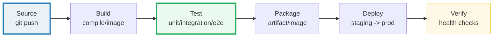

# CI/CD Pipeline Stages — A Visual, Worked-Example Guide

> **Companion code:** [`pipeline_stages.py`](./pipeline_stages.py). **Every number
> in this guide is printed by `python3 pipeline_stages.py`** — change the code,
> re-run, re-paste. Nothing here is hand-computed.
>
> **Live animation:** [`pipeline_stages.html`](./pipeline_stages.html) — open in a
> browser; it recomputes the linear vs parallel timing from the identical model
> and checks against the `.py` gold.
>
> **Source material:** GitHub Actions docs (docs.github.com/actions), Jenkins docs
> (jenkins.io/doc), GitLab CI/CD docs (docs.gitlab.com/ee/ci), and "Continuous
> Delivery" (Hummel & Eberhard 2010) for the stage taxonomy.

---

## 0. TL;DR — the whole idea in one picture

### Read this first — the assembly line

A pipeline is an **assembly line** for your code. Each commit enters at one end,
passes through a sequence of **stages**, and (if all pass) a running deployment
comes out the other end. Each stage is a **quality gate**: fail one and the whole
line stops — a broken commit never reaches production.

The six canonical stages, in order:



1. **Source** — a git push triggers the pipeline (the commit enters the line).
2. **Build** — compile the code / build a container image.
3. **Test** — run automated checks: unit, integration, end-to-end.
4. **Package** — publish the artifact / push the image to a registry.
5. **Deploy** — roll the artifact out to staging, then production.
6. **Verify** — post-deploy health checks (is it actually serving traffic?).

> **One-line definition:** a pipeline runs **Source → Build → Test → Package →
> Deploy → Verify**; independent jobs inside a stage run **in parallel**
> (wall-clock = `max`, not `sum`).

### Glossary (every term used below)

| Term | Plain meaning |
|---|---|
| **stage** | one step of the pipeline (build, test, …). A quality gate |
| **job** | a concrete unit of work inside a stage; a stage can fan out to many jobs |
| **sequential** | jobs run one after another; group wall-clock = `sum` of durations |
| **parallel** | independent jobs run at the same time; group wall-clock = `max(duration)` |
| **matrix build** | run the same job across a grid of axes (Python × OS); all cells parallel |
| **cache** | save downloaded deps (node_modules, .m2) between runs; skip re-download on hit |
| **pipeline as code** | the pipeline defined in a file (YAML/Groovy), versioned like any code |
| **runner** | the machine/agent that executes a job; parallel jobs need multiple runners |

---

## 1. Linear pipeline — Section A output

> From `pipeline_stages.py` **Section A** — a linear pipeline runs every stage
> strictly one after another:
>
> | stage | duration | cumulative |
> |---|---|---|
> | checkout | 20s | 20s |
> | build | 1m30s | 1m50s |
> | test | 3m00s | 4m50s |
> | package | 40s | 5m30s |
> | deploy | 30s | 6m00s |
>
> ```
> TOTAL (sequential) = sum of all = 6m00s  (360s)
> GOLD linear_total = 360s
> ```

Watch the **test** stage: 180s = 3m00s. That is unit + integration + lint run
**back to back**. Section B shows what happens when they run **at the same time**.

---

## 2. Parallel test stage — Section B output (the GOLD, and the time model)

The test stage fans out into 3 **independent** jobs. They touch different things,
so nothing stops them running concurrently:

> From `pipeline_stages.py` **Section B**:
>
> | job | duration |
> |---|---|
> | unit | 1m00s |
> | integration | 1m30s |
> | lint | 30s |
>
> ```
> Sequential test wall-clock = sum = 3m00s  (180s)
> Parallel   test wall-clock = max = 1m30s  (90s)
> speedup = 180/90 = 2.00x
> ```



```mermaid
graph LR
    subgraph seq["Sequential (sum = 180s)"]
        S1["unit 60s"] --> S2["integration 90s"] --> S3["lint 30s"]
    end
    subgraph par["Parallel (max = 90s)"]
        P1["unit 60s"]
        P2["integration 90s ★ slowest"]
        P3["lint 30s"]
    end
    style seq fill:#3a1414,stroke:#c0392b
    style par fill:#1c3a25,stroke:#27ae60,stroke-width:3px
```

**Why max not sum:** all three jobs start at `t=0`. Integration (the slowest, 90s)
defines when the **group** is done. Unit (60s) and lint (30s) finish early and
just wait. The clock only ticks for the longest one.

Full pipeline with the parallel test group:

```
pre  (checkout+build)     = 1m50s
test (parallel, = max)    = 1m30s
post (package+deploy)     = 1m10s
PARALLEL TOTAL            = 4m30s  (270s)

vs LINEAR TOTAL           = 6m00s  (360s)
SAVED                     = 1m30s  (25% faster)
```

> ```
> GOLD parallel_test (group wall-clock) = 90s  (= max of jobs)
> GOLD parallel_total                   = 270s  (= 4m30s)
> [check] parallel_total == pre+max(test)+post?  OK
> [check] parallel_total < linear_total?         OK
> ```

**This is the bundle's gold-check:** the parallel total equals
`pre + max(test_group) + post`, **not** the naive sum — and the `.html`
recomputes both numbers in JS to confirm `270s`.

---

## 3. Matrix build — Section C output

A matrix runs the **same** job across every combination of axes. Each cell is an
independent job, and all cells run in parallel.

> From `pipeline_stages.py` **Section C** — Python `3.10/3.11/3.12` ×
> `ubuntu-latest/macos-latest`:
>
> | | py 3.10 | py 3.11 | py 3.12 |
> |---|---|---|---|
> | **ubuntu-latest** | 55s | 58s | 61s |
> | **macos-latest** | 62s | 65s | 68s |
>
> ```
> matrix = 3 python x 2 os = 6 jobs
> Sequential (sum of all 6 cells) = 6m09s  (369s)
> Parallel   (max of all cells)   = 1m08s  (68s)
> speedup = 369/68 = 5.4x
> GOLD matrix_parallel_total = 68s  (6 cells, 1 wave)
> ```

6 cells for the price of one on the wall clock. **Caveat:** parallelism is
bounded by runner count — 6 cells need 6 runners. With only 2 runners, the cells
run in 3 waves → total ≈ `3 × max(cell)`.

---

## 4. Caching — Section D output

Dependency download is the biggest time sink in most builds. A cache stores the
downloaded deps **keyed by the lockfile hash**; a later run with the same
lockfile restores them in seconds instead of re-downloading.

> From `pipeline_stages.py` **Section D**:
>
> | build step | no cache | cache HIT |
> |---|---|---|
> | restore_cache | 2s | 3s |
> | download_deps | 45s | **0s ← skip** |
> | compile | 45s | 45s |
>
> ```
> build total (no cache)  = 1m32s  (92s)
> build total (cache HIT) = 48s
> saved per run           = 44s  (48%)
> GOLD cache_hit_build = 48s  (vs 92s uncached)
> [check] cache HIT faster by >=40s?  OK
> ```

**Cache key:** hash of the lockfile (`package-lock.json` / `pom.xml`).
- lockfile **unchanged** → key matches → **HIT** → restore ~3s.
- lockfile **changed** → key differs → **MISS** → re-download (45s), then save
  the new deps back for next time.

Over 10 runs with an unchanged lockfile: 15m20s (uncached) vs **8m00s** (cached) —
**7m20s** saved.

---

## 5. Pipeline as code — Section E output

The pipeline definition is a **file** checked into the repo alongside the code it
ships. It is versioned, code-reviewed, and diffable — change the pipeline in a PR
and reviewers see exactly what changed.

**GitHub Actions** YAML (`.github/workflows/ci.yaml`):

```yaml
name: ci
on: [push]                       # <- Source: trigger on git push
jobs:
  build-and-test:
    runs-on: ubuntu-latest
    steps:
      - uses: actions/checkout@v4        # checkout
      - uses: actions/setup-node@v4      # install toolchain
      - run: npm ci                       # Build: install + compile
      - run: npm run build
      - run: npm test &                   # Test (parallel group)
             npm run integration &
             npm run lint
      - run: npm pack                     # Package: artifact
      - run: ./deploy.sh staging          # Deploy + Verify
```

**Jenkinsfile** (Groovy, declarative):

```groovy
pipeline {
  agent any
  stages {
    stage('Build')   { steps { sh 'make build' } }
    stage('Test')    {
      parallel {                       // <- parallel block
        stage('unit')        { steps { sh 'make test-unit' } }
        stage('integration') { steps { sh 'make test-int'  } }
        stage('lint')        { steps { sh 'make lint'      } }
      }
    }
    stage('Package') { steps { sh 'make package' } }
    stage('Deploy')  { steps { sh 'make deploy'  } }
  }
}
```

Read either file top-to-bottom and you see the **same** six stages. The parallel
block in both is Section B's fan-out, written down. **The pipeline IS code, and
this code IS the pipeline.**

---

## 6. Pitfalls & debugging checklist

| # | Mistake | Symptom | Fix |
|---|---|---|---|
| 1 | Tests run sequentially when they could parallelize | test stage = sum, not max | split into independent jobs; use a `parallel` block / `strategy: matrix` |
| 2 | Matrix too wide for runner budget | cells queue in waves, total balloons | add runners, or narrow the matrix to the axes that matter |
| 3 | Cache key too coarse (just `main`) | every run misses | key on the lockfile hash so only dep changes invalidate |
| 4 | Cache key too fine (random salt) | every run misses | remove the salt; key on deterministic inputs only |
| 5 | Pipeline not in the repo | "works on my machine" drifts | adopt pipeline-as-code (YAML/Groovy in the repo) |
| 6 | Long stage on the critical path | can't shrink total even with parallelism | break it up, or move it off the critical path |

---

## 7. Cheat sheet

- **Six stages:** Source → Build → Test → Package → Deploy → Verify.
- **Sequential total = sum; parallel total = `pre + max(group) + post`.**
- **Matrix** of `P × O` axes → `P*O` cells, all parallel (bounded by runners).
- **Cache hit** skips the dependency download (45s → 0s); key on the lockfile.
- **Pipeline as code:** the definition lives in the repo, reviewed in PRs.
- **GOLD:** linear_total=360s, parallel_total=270s, parallel_test=90s=max, matrix=68s.

---

## Sources

- **GitHub Actions** — docs.github.com/actions: workflow syntax, `strategy.matrix`,
  `actions/cache` with lockfile-based keys, parallel jobs via background `&`.
- **Jenkins** — jenkins.io/doc: declarative `pipeline { stages { stage('Test') {
  parallel { ... } } } }`, the Jenkinsfile-as-code model.
- **GitLab CI/CD** — docs.gitlab.com/ee/ci: `.gitlab-ci.yml`, `parallel:matrix`,
  `cache: key`, stage-based execution.
- **Continuous Delivery** — Hummel & Eberhard, *Continuous Delivery: A Mature
  View on the Path to Production*, 2010. The stage taxonomy (build → test →
  package → deploy) and the gate model trace to this lineage.
