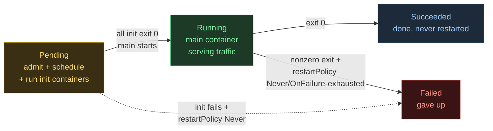
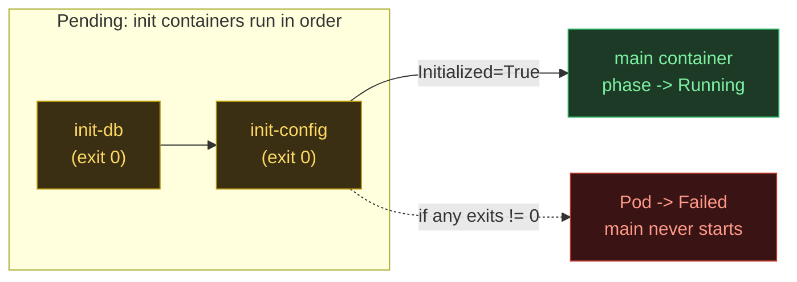
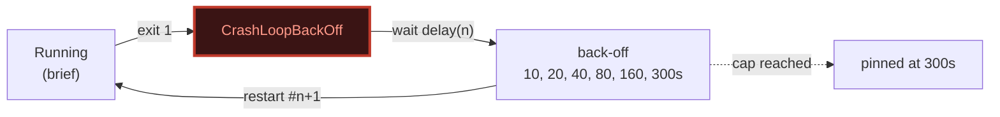
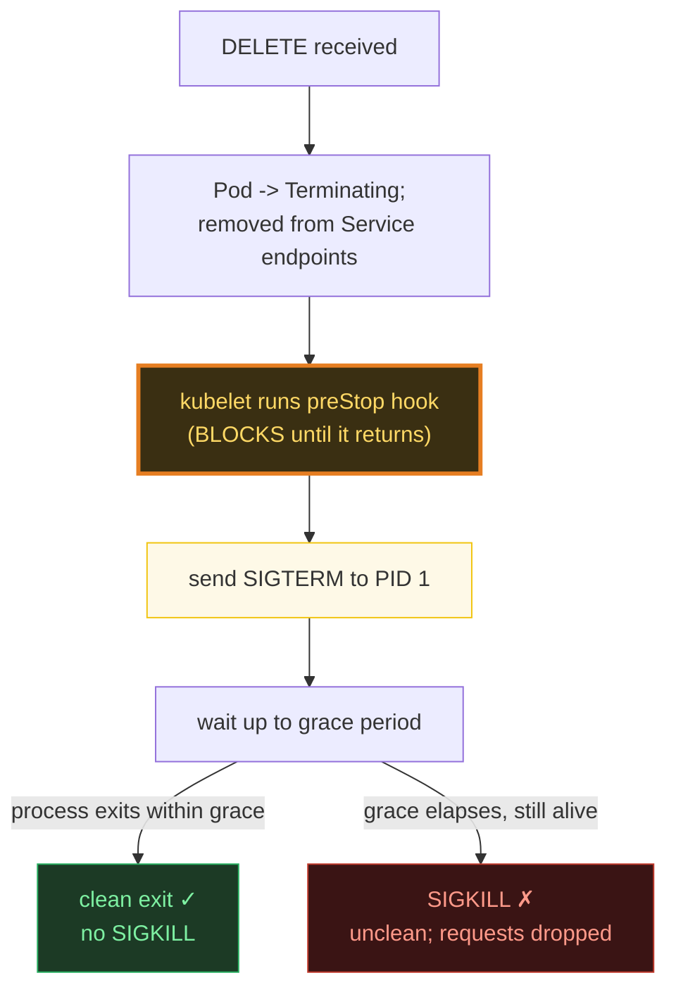

# Kubernetes Pod Lifecycle — A Visual, Worked-Example Guide

> **Companion code:** [`pod_lifecycle.py`](./pod_lifecycle.py). **Every number in
> this guide is printed by `python3 pod_lifecycle.py`** — change the code, re-run,
> re-paste. Nothing here is hand-computed.
>
> **Live animation:** [`pod_lifecycle.html`](./pod_lifecycle.html) — open in a browser.
>
> **Sibling guide:** [`DEPLOYMENT_REPLICASET.md`](./DEPLOYMENT_REPLICASET.md) — how
> Deployments drive many Pods through rolling updates.
>
> **Source material:** `HOW_TO_RESEARCH.md`; Kubernetes docs
> (kubernetes.io/.../pod-lifecycle); *Kubernetes Patterns* (Ibryam & Huss).

---

## 0. TL;DR — the apartment that gets built, leased, and demolished

A Pod is **one apartment in a Node building**, with a strict lifecycle a building
inspector (the **kubelet**) watches. Read the phase as a summary of *what the
containers are doing right now*:



| Phase | Meaning | Who's acting |
|---|---|---|
| **Pending** | Pod accepted, but no container is serving yet | API server → etcd → scheduler → kubelet → init containers |
| **Running** | Pod bound to a Node, all init done, **main container running** | kubelet + container runtime |
| **Succeeded** | All containers exited 0 (terminal) | kubelet marks it done |
| **Failed** | A container exited nonzero and won't be restarted | kubelet |

> **The one rule you must internalize:** the phase is a **derived summary** of
> container states — you never set `phase` directly. It flips to **Running** the
> moment the main container starts, *not* when the Pod object is created.

### Glossary

| Term | Plain meaning |
|---|---|
| **phase** | high-level Pod status (Pending/Running/Succeeded/Failed). Derived, not set |
| **condition** | fine-grained boolean: `PodScheduled`, `Initialized`, `ContainersReady`, `Ready` |
| **init container** | a container that runs to completion, **in order, before the app** |
| **restartPolicy** | pod-level: `Always` (restart any exit), `OnFailure` (nonzero only), `Never` |
| **CrashLoopBackOff** | kubelet state when a container keeps dying — back-off doubles, capped 300s |
| **terminationGracePeriodSeconds** | window between SIGTERM and SIGKILL (default **30s**) |
| **preStop hook** | runs **before** SIGTERM, to let the app drain / deregister |
| **QoS class** | Guaranteed / Burstable / BestEffort — **computed** from requests vs limits |

---

## 1. The actors — control plane vs data plane

Pod creation is a hand-off across two planes. The **control plane** admits and
schedules; the **data plane** (the kubelet on the chosen Node) actually runs the
containers.

```mermaid
graph LR
    U["kubectl<br/>(client)"] -->|POST| APIS["API server"]
    APIS -->|persist| ETCD["etcd<br/>(source of truth)"]
    SCH["kube-scheduler"] -->|watch Pending Pods| APIS
    SCH -->|bind -> Node A| APIS
    APIS -->|watch| KL["kubelet on Node A"]
    KL -->|CRI| CR["container runtime<br/>(containerd / CRI-O)"]
    CR --> PID["PID 1 in a namespace+cgroup"]
    KL -.->|reports status| APIS
    style APIS fill:#1c2a3a,stroke:#2e6da4
    style ETCD fill:#3a2f12,stroke:#b7950b
    style KL fill:#1c3a25,stroke:#27ae60,stroke-width:3px
    style CR fill:#1c3a25,stroke:#27ae60
```



- **API server** is the *only* component that touches **etcd**.
- The **scheduler** only *binds* a Pod to a Node (writes the node name); it never
  starts containers.
- The **kubelet** owns the lifecycle *on the node*: it pulls images, asks the
  container runtime to start the sandbox + containers, and reports status back.

---

## 2. The creation timeline — Section A output

This is the canonical simulation the bundle is pinned to:
**2 init containers** (`init-db` dur=2, `init-config` dur=1) then a **main
container** that runs 3 ticks.

> From `pod_lifecycle.py` **Section A** — `web-7b9c`, bound to `node-a`:
>
> | tick | phase | component | event |
> |---|---|---|---|
> | 0 | Pending | kubectl | POST to API server |
> | 1 | Pending | API-server | validate, persist to **etcd** |
> | 2 | Pending | kube-scheduler | bind Pod → Node `node-a` (`PodScheduled=True`) |
> | 3 | Pending | kubelet | pull images, create sandbox |
> | 3–6 | Pending | container-runtime | `init-db` runs 2 ticks, exits 0 |
> | 6–8 | Pending | container-runtime | `init-config` runs 1 tick, exits 0 |
> | 9 | Pending | kubelet | all init done → `Initialized=True` |
> | **9** | **Running** | container-runtime | main starts → `Ready=True` |
> | 10–12 | Running | main-container | serving traffic |
> | **13** | **Succeeded** | kubelet | main exited 0 |

Read it as **four acts**: (1) admit to etcd, (2) scheduler binds a Node, (3) init
containers run in order while the Pod stays Pending, (4) main container starts and
the phase flips to Running.

---

## 3. Init containers — sequential gate before the app — Section B output

Init containers run **before app containers, strictly in order**. The next one does
not start until the previous exits **0**. The `Initialized` condition stays `False`
— and phase stays **Pending** — until **all** of them finish.

> **Case 1 (happy):** both init containers (`wait-for-db`, `render-config`) exit 0 →
> Pod reaches **Running** then **Succeeded**.
>
> **Case 2 (gate fails):** `migrate-schema` exits 1 →
> ```
>    8  Failed    kubelet   init container failed -> Pod phase -> FAILED
>   -> phase reached: Failed   (init 'migrate-schema' exited 1 -> abort)
> ```
> The main container **never starts**. That is the whole point: gate the app on
> prerequisites, fail fast if setup breaks.

> **Subtlety:** a failed init container follows the Pod's `restartPolicy`. With
> `Always`/`OnFailure` the kubelet *retries* it (with the back-off from §5); with
> `Never` the Pod goes straight to `Failed`. The happy-path model above treats each
> init container as a one-shot because the spec is correct.



---

## 4. restartPolicy — what the kubelet does on exit

`restartPolicy` is **pod-level** and only applies to the app containers (and, on
failure, the init containers):

| Policy | Restart when… | Typical workload |
|---|---|---|
| **Always** *(default)* | container exits (0 or nonzero) | Deployment / DaemonSet / ReplicaSet |
| **OnFailure** | container exits **nonzero** | Job |
| **Never** | never | Job / debug Pod |

> Deployments **force** `Always`; Jobs force `OnFailure` or `Never`. That is why a
> crashed Deployment pod *comes back*, but a finished Job pod *stays Succeeded*.

---

## 5. CrashLoopBackOff — Section C output (exponential back-off)

When a container keeps dying and `restartPolicy` asks to retry, the kubelet backs
off **exponentially**:

```
delay(n) = min(10 * 2**n, 300) seconds        # doubles each restart, capped 5 min
```

> From `pod_lifecycle.py` **Section C**:
>
> | restart # | 10×2ⁿ | capped delay |
> |---|---|---|
> | 0 | 10 | 10s |
> | 1 | 20 | 20s |
> | 2 | 40 | 40s |
> | 3 | 80 | 80s |
> | 4 | 160 | 160s |
> | 5 | 320 | **300s** (capped) |
> | 6 | 640 | **300s** (capped) |
>
> A container that exits 1 every time: 4 crash/restart cycles already span **150s**
> of wall-clock. The visible symptom in `kubectl get pods` is a Pod flickering
> `Running → CrashLoopBackOff` with ever-longer gaps.

CrashLoopBackOff is **not terminal** — the kubelet keeps retrying at the 5-minute
cadence forever, until you fix the spec (bad image, missing env var, failing
liveness probe, OOMKill) or delete the Pod.



---

## 6. Graceful shutdown — Section D output (preStop → SIGTERM → grace → SIGKILL)

Pod deletion is **not instant**. The kubelet gives the app a grace period
(`terminationGracePeriodSeconds`, default **30s**) to wind down. The precise
sequence, per the kubelet `killContainer` path:



> ⚠️ **Key point:** the **preStop time counts against the grace period** (they are
> *not* additive). preStop exists precisely to buy drain time **before SIGTERM** —
> e.g. `sleep 5` so the endpoint controller has propagated the Pod's removal and
> clients stop sending new requests before the app even gets the signal.

> From `pod_lifecycle.py` **Section D** — two cases (grace=30, preStop=5):
>
> **Case 1 — clean** (app drains in 8s after SIGTERM):
> ```
>   t=0s   DELETE; Pod -> Terminating; removed from endpoints
>   t=0s   run preStop hook (blocks) - 5s
>   t=5s   SIGTERM to PID 1
>   t=13s  drained & exited cleanly (<= grace 30s)   -> NO SIGKILL ✓
> ```
>
> **Case 2 — SIGKILL** (app needs 40s after SIGTERM):
> ```
>   t=5s   SIGTERM to PID 1
>   t=30s  grace period elapsed; still alive -> SIGKILL ✗  (in-flight requests dropped)
> ```
>
> **Fix:** raise `terminationGracePeriodSeconds`, **or** add a `preStop: sleep 15`
> hook to let endpoints converge + give the app a head start before SIGTERM.

---

## 7. QoS classes — Section E output (computed, not set)

The kubelet **computes** (you never set) a QoS class per Pod from its containers'
cpu/memory **requests vs limits**. Under Node **memory pressure**, the class
decides eviction order: **BestEffort first**, then Burstable; Guaranteed only as a
last resort.

| Class | Rule | Eviction |
|---|---|---|
| **Guaranteed** | EVERY container has cpu **and** mem, `request == limit` (all set) | last |
| **Burstable** | at least one request/limit set, but not all Guaranteed | middle |
| **BestEffort** | NO container sets ANY request or limit | **first** |

> From `pod_lifecycle.py` **Section E**:
>
> | example pod | computed QoS |
> |---|---|
> | req==lim for cpu+mem | Guaranteed |
> | req != lim | Burstable |
> | only request set | Burstable |
> | nothing set | BestEffort |
> | one Guaranteed + one empty container | **Burstable** *(all containers must qualify)* |
>
> **Recipe for latency-critical services:** set `request == limit` on **both** cpu
> and memory for **every** container → Guaranteed → last evicted.

---

## 8. The GOLD CHECK — phase transitions match the expected lifecycle

> From `pod_lifecycle.py` **GOLD CHECK** (the canonical `web-7b9c` scenario):
>
> ```
> Per-tick phase array (14 ticks):
>   Pending×9, Running×4, Succeeded×1
> Deduped transitions: [Pending, Running, Succeeded]
> [check] transitions == [Pending, Running, Succeeded]?  True
> [pin] Pending->Running  at tick 9
> [pin] Running->Succeeded at tick 13
> [check] all gold pins reproduced:  OK
> ```
>
> [`pod_lifecycle.html`](./pod_lifecycle.html) ports `simulate_pod_creation` to JS
> and re-derives the **identical** 14-tick phase array, asserting the flips land at
> tick 9 and 13. The green `check: OK` badge is that assertion passing live.

---

## 9. Pitfalls & debugging checklist

| # | Mistake | Symptom | Fix |
|---|---|---|---|
| 1 | Pod stuck in **Pending** | `0/1 Pending` forever | `kubectl describe pod` — usually unschedulable (no resources) or image pull |
| 2 | Init container loops | `Init:CrashLoopBackOff` | check the *init* container logs (`-c init-db`), not the app |
| 3 | Traffic still hits a terminating Pod | dropped requests on deploy | add a `preStop` hook; verify endpoint removal propagated |
| 4 | App killed mid-shutdown | SIGKILL in events | raise `terminationGracePeriodSeconds`; the app ignores SIGTERM |
| 5 | Pod evicted under load | `OOMKilled` / Evicted | set memory requests; aim for Guaranteed QoS on critical services |
| 6 | Expecting `phase` you can set | it's read-only | set *conditions* indirectly via the container spec, not phase |

---

## 10. Cheat sheet

- **Phases:** Pending → Running → Succeeded / Failed. Derived from container states.
- **Control plane admits + schedules; the kubelet runs.** Only the API server writes etcd.
- **Init containers:** sequential, each must exit 0; Pod Pending until all done.
- **restartPolicy:** Always (Deployments) / OnFailure (Jobs) / Never.
- **CrashLoopBackOff:** `min(10·2ⁿ, 300)`s — doubles, capped at 5 min, never terminal.
- **Graceful shutdown:** DELETE → endpoints drop → preStop (blocks) → SIGTERM → wait grace → SIGKILL.
- **preStop counts against the grace period** (not additive).
- **QoS:** Guaranteed (all req==lim) > Burstable > BestEffort (nothing set). Computed.
- **GOLD:** 14-tick array, flips Pending→Running @9, Running→Succeeded @13.

> 🔗 Pods rarely live alone — they are driven by **Deployments**, which own
> **ReplicaSets** that own Pods and roll them out without downtime. See
> [`DEPLOYMENT_REPLICASET.md`](./DEPLOYMENT_REPLICASET.md).

---

## Sources

- **Kubernetes docs — Pod Lifecycle.**
  https://kubernetes.io/docs/concepts/workloads/pods/pod-lifecycle/
  - Verified: the five phases (Pending, Running, Succeeded, Failed, Unknown); init
    containers "run to completion before app containers, in order"; restart policies.
- **Kubernetes docs — Init Containers.**
  https://kubernetes.io/docs/concepts/workloads/pods/init-containers/
- **Kubernetes docs — Pod termination / graceful shutdown.**
  https://kubernetes.io/docs/concepts/workloads/pods/pod-lifecycle/#pod-termination
  - Verified: preStop runs before SIGTERM; `terminationGracePeriodSeconds` default 30s;
    SIGKILL after grace.
- **Kubernetes docs — Configure Quality of Service.**
  https://kubernetes.io/docs/tasks/configure-pod-container/quality-service-pod/
  - Verified: Guaranteed = every container cpu+mem request==limit; BestEffort = none set.
- **Kubernetes docs — Assign CPU/Memory.** (requests vs limits semantics)
- **Kubernetes Patterns** — Bilgin Ibryam & Roland Huss (O'Reilly). Init Container,
  Graceful Shutdown, and Health Probe patterns.
- **kubelet source** — `pkg/kubelet/kuberuntime/lifecycle.go`,
  `killContainer`: preStop → SIGTERM → grace → SIGKILL ordering; `BackOff` manager
  with `min(2^attempt·10s, 300s)` cap.
