# Rolling Update — A Visual, Worked-Example Guide

> **Companion code:** [`rolling_update.py`](./rolling_update.py).
> **Every number in this guide is printed by `python3 rolling_update.py`**
> — change the code, re-run, re-paste. Nothing here is hand-computed.
>
> **Live animation:** [`rolling_update.html`](./rolling_update.html)
> — open in a browser.
>
> **Sibling guides:** [`DEPLOYMENT_REPLICASET.md`](./DEPLOYMENT_REPLICASET.md)
> (the Deployment→ReplicaSet hierarchy this rolls across),
> [`KUBELET_PROBES.md`](./KUBELET_PROBES.md) (the readiness probe that gates
> each new pod), and [`POD_LIFECYCLE.md`](./POD_LIFECYCLE.md).
>
> **Source material:** `HOW_TO_RESEARCH.md`; Kubernetes docs
> (kubernetes.io/docs/.../deployment/#strategy, #rolling-update-deployment,
> #progress-deadline-seconds, #rolling-back-a-deployment).

---

## 0. TL;DR — the relay race with the handoff zone

A **RollingUpdate** is the Deployment's default strategy for swapping an old
version (v1) to a new one (v2) **without taking the service down**. Think of a
relay race: you have `replicas` runners all in v1 jerseys, and you must re-kit
every one of them into v2 **without the team ever dropping below a quorum on the
track**. Two knobs define the plan:


| Knob | What it bounds | Plain meaning | Default |
|---|---|---|---|
| **maxSurge** | scale-UP speed, extra capacity | how many EXTRA pods (above `replicas`) may briefly exist | 25% (rounds **UP**) |
| **maxUnavailable** | scale-DOWN speed, tolerated downtime | how many pods may be UNAVAILABLE (below `replicas`) | 25% (rounds **DOWN**) |

> **The one rule the controller never breaks** — two guardrails, every step:
> ```
> (1) total     <= replicas + maxSurge          (never too many pods)
> (2) available >= replicas - maxUnavailable    (never too few ready)
> ```

### Glossary

| Term | Plain meaning |
|---|---|
| **RollingUpdate** | default Deployment strategy; replaces pods gradually, two versions briefly coexist |
| **available** | a pod that is Running AND has PASSED its readiness probe (only these serve) |
| **readiness gate** | a new v2 pod counts as available ONLY after its readiness probe succeeds |
| **readiness_lag** | model for image-pull + probe time; pod ready at `created_step + readiness_lag` |
| **surge** | creating a v2 pod BEFORE removing a v1 pod (costs extra capacity) |
| **drain** | removing a v1 pod (allowed only while `available > replicas - maxUnavailable`) |
| **progressDeadlineSeconds** | (default 600s) if no progress in this window → rollout HALTS |
| **terminating pod** | a pod being shut down; NOT counted as available; lingers until grace period |

---

## 1. The canonical rollout — Section A output (5 / maxSurge=1 / maxUnavailable=1)

On an image change (`web:v1` → `web:v2`) the Deployment creates a **new
ReplicaSet** and rolls pods over, one reconcile pass at a time. Each pass:
**(a)** promote v2 pods that just passed readiness, **(b)** surge the new RS up
as far as `maxSurge` allows, **(c)** drain old v1 pods as far as availability
allows.

> From `rolling_update.py` **Section A** — `replicas=5, maxSurge=1,
> maxUnavailable=1` (guardrails: total ≤ 6, available ≥ 4):
>
> | step | v1 | v2 | v2 ready | total | avail | grid | action |
> |---|---|---|---|---|---|---|---|
> | 0 | 5 | 0 | 0 | 5 | 5 | `[v1][v1][v1][v1][v1]` | start |
> | 1 | 4 | 1 | 0 | 5 | 4 | `[v1][v1][v1][v1][v2.]` | surge v2 +1 \| drain v1 −1 |
> | 2 | 3 | 2 | 1 | 5 | 4 | `[v1][v1][v1][v2][v2.]` | readiness ✓ +1 \| surge +1 \| drain −1 |
> | 3 | 2 | 3 | 2 | 5 | 4 | `[v1][v1][v2][v2][v2.]` | readiness ✓ +1 \| surge +1 \| drain −1 |
> | 4 | 1 | 4 | 3 | 5 | 4 | `[v1][v2][v2][v2][v2.]` | readiness ✓ +1 \| surge +1 \| drain −1 |
> | 5 | 0 | 5 | 4 | 5 | 4 | `[v2][v2][v2][v2][v2.]` | readiness ✓ +1 \| surge +1 \| drain −1 |
> | 6 | 0 | 5 | 5 | 5 | 5 | `[v2][v2][v2][v2][v2]` | readiness ✓ +1 (done) |
>
> `[check] total ≤ 6 at every step? True`
> `[check] available ≥ 4 at every step? True`
>
> Legend: `[v1]` old serving · `[v2.]` new pending (readiness not passed) · `[v2]` new serving.

**Read the staircase:** every step the new RS surges **one** v2 pod (a spare
slot opens under `maxSurge`), and because `maxUnavailable=1` the controller
immediately drains **one** v1 pod. So v1 walks `5→4→3→2→1→0` while v2 walks
`0→1→2→3→4→5` in lockstep. Availability dips to exactly **4** (`= replicas −
maxUnavailable`) and never lower → zero outage, one pod of tolerated capacity
loss, no extra pods left running at the end.


---

## 2. The knobs — Section B output (maxSurge & maxUnavailable combos)

These two ints are the **entire** tuning surface of a rolling update.
`maxSurge` buys speed with **extra pods**; `maxUnavailable` buys speed with
**lost capacity**. Percent values round **differently** (kubernetes.io verified):
**maxSurge rounds UP**, **maxUnavailable rounds DOWN**.

> From `rolling_update.py` **Section B** — default `25%/25%` on 5 replicas →
> `maxSurge=ceil(5·25/100)=2`, `maxUnavailable=floor(5·25/100)=1`:
>
> | combo | surge | unavail | minAvail | maxTotal | steps | note |
> |---|---|---|---|---|---|---|
> | default 25%/25% | 2 | 1 | 4 | 7 | 4 | fast & cheap: surge 2, lose 1 |
> | maxSurge=1, maxUnavailable=0 | 1 | 0 | 5 | 6 | 10 | zero capacity loss, needs 1 spare |
> | maxSurge=0, maxUnavailable=1 | 0 | 1 | 4 | 5 | 11 | never exceed replicas, lose 1 |
> | maxSurge=0, maxUnavailable=0 | 0 | 0 | — | — | stuck | ILLEGAL: cannot roll |

The three legal shapes (5 replicas):

```
default 25%/25% (surge 2, unavail 1):
  OLD   : 5  4  2  1  0      ← batches 2 at a time (fastest), avail dips to 4
  NEW   : 0  2  3  5  5
  avail : 5  4  4  4  5      guardrails: total≤7, avail≥4

maxSurge=1, maxUnavailable=0:        ← zero capacity loss
  OLD   : 5  5  4  4  3  3  2  2  1  1  0
  NEW   : 0  1  1  2  2  3  3  4  4  5  5
  avail : 5  5  5  5  5  5  5  5  5  5  5   ← rock-steady at 5; total peaks at 6

maxSurge=0, maxUnavailable=1:        ← never exceed replicas
  OLD   : 5  4  4  3  3  2  2  1  1  0  0  0
  NEW   : 0  0  1  1  2  2  3  3  4  4  5  5
  avail : 5  4  4  4  4  4  4  4  4  4  4  5   ← total never tops 5; avail dips to 4
```

> **RULE (verified):** `maxSurge=0` **AND** `maxUnavailable=0` is **rejected** —
> the controller has neither room to surge nor capacity to spare, so the rollout
> cannot start. At least one of the two must be > 0.

> **Mental model:** zero-downtime-with-no-spare is **impossible**. You must
> spend either extra pods (maxSurge) or capacity (maxUnavailable) to make room
> for the swap.

---

## 3. The readiness gate — Section C output (no v1 dies until a v2 is ready)

A new pod is **not** available just because it is Running. It must **pass its
readiness probe** first. With `maxUnavailable=0` this becomes a **hard gate**:
the controller cannot terminate a v1 pod until a v2 pod clears readiness,
otherwise `available` would drop below `replicas`.

> From `rolling_update.py` **Section C** — Case 1, `maxSurge=1,
> maxUnavailable=0, readiness_lag=1`:
>
> | step | v1 | v2 | avail | total | action |
> |---|---|---|---|---|---|
> | 0 | 5 | 0 | 5 | 5 | start |
> | 1 | 5 | 1 | 5 | 6 | surge v2 +1 (drain BLOCKED — avail would hit 4 < 5) |
> | 2 | 4 | 1 | 5 | 5 | readiness ✓ \| drain v1 −1 (now safe) |
> | 3 | 4 | 2 | 5 | 6 | surge v2 +1 |
> | 4 | 3 | 2 | 5 | 5 | readiness ✓ \| drain v1 −1 |
> | … | … | … | 5 | … | … |
> | 10 | 0 | 5 | 5 | 5 | done |
>
> `[check] available ≥ 5 at every step? True`

**Notice the shape** differs from Section A: because `maxUnavailable=0`, the
drain is **blocked** until the surged v2 becomes ready. So `total` oscillates
`5→6 (surge) →5 (drain)` instead of staying flat, and `available` holds
rock-steady at 5. The readiness probe is literally the door the v2 pod must
walk through before a v1 pod is shown out.

> **Case 2:** same knobs but `readiness_lag=3` (slow probe / cold start). The
> timeline **stretches to 20 steps** (vs 10) but the guardrails are identical —
> the v2 pod sits `pending` (`v2.`) for 3 steps before it is ready, and the v1
> pod is held alive that whole time. **A misconfigured readiness probe is the #1
> cause of slow rollouts** — the gate never opens.

> 🔗 The probe itself (httpGet / tcpSocket / exec, thresholds, timing) is
> covered in [`KUBELET_PROBES.md`](./KUBELET_PROBES.md).

---

## 4. Rollback — Section D output (`kubectl rollout undo`)

`kubectl rollout undo` does **not** re-download an old image. It re-points the
rollout target at a **previous ReplicaSet** (kept up to
`revisionHistoryLimit`, default 10) and runs the **same** interleaved rollout —
just with the roles swapped: the now-current v2 RS drains while the previous v1
RS surges back. Same guardrails, same shape.

> From `rolling_update.py` **Section D** — forward (v1→v2) then undo (v2→v1):
>
> ```
> FORWARD  v1->v2 :
>   v2(new): 0  1  2  3  4  5  5
>   avail  : 5  4  4  4  4  4  5     guardrails: total≤6, avail≥4
>
>   --- kubectl rollout undo deployment/web ---
>
> UNDO     v2->v1 :
>   v1(new): 0  1  2  3  4  5  5
>   avail  : 5  4  4  4  4  4  5     guardrails: total≤6, avail≥4
> ```
> `[check] guardrails hold during rollback? total:True avail:True`

The undo trace is the forward trace **played back**: v2 drops `6→0` while v1
climbs `0→5`. Availability never breaks. Because each RS is a full snapshot of a
revision, undo is cheap and instant to start — no image re-pull, no template
reconstruction, just re-scale.

```mermaid
graph LR
    F0["v1=5 v2=0"] -->|rollout| F1["v1=0 v2=5"]
    F1 -->|kubectl rollout undo| U0["v2=5 v1=0"]
    U0 -->|same rollout reversed| U1["v2=0 v1=5 ✓"]
    style F1 fill:#1c3a25,stroke:#27ae60
    style U1 fill:#1c3a25,stroke:#27ae60,color:#7ef0a2,stroke-width:3px
```



---

## 5. Health monitoring → HALT — Section E output (progressDeadlineSeconds)

The Deployment **watches** the rollout. If new pods keep failing their
readiness probe (bad image, crash loop, broken config), no v2 pod ever becomes
available, so the rollout makes **no progress**. After `progressDeadlineSeconds`
(default 600s) the Deployment is marked `Progressing=False` /
`reason=ProgressDeadlineExceeded` and the rollout **HALTs**. The controller
stops surging; the old v1 pods keep serving.

> From `rolling_update.py` **Section E** — 5/1/1 but the v2 image **never passes
> readiness** (`fails_readiness=True`):
>
> | step | v1 | v2 | avail | total | action |
> |---|---|---|---|---|---|
> | 0 | 5 | 0 | 5 | 5 | start |
> | 1 | 4 | 1 | 4 | 5 | surge v2 +1 \| drain v1 −1 |
> | 2 | 4 | 2 | 4 | 6 | surge v2 +1 |
> | 3 | 4 | 2 | 4 | 6 | wait (no progress) |
> | 4 | 4 | 2 | 4 | 6 | **wait → HALT: ProgressDeadlineExceeded** |
>
> Final state: **v1=4 (still serving), v2=2 (all stuck pending), available=4.**

The service **stays up** on the old pods — Kubernetes detected the bad release
and refused to complete it. This is exactly why you set a readiness probe +
`progressDeadlineSeconds`: they turn a bad deploy from an **outage** into an
**automatic, safe abort**. (A human or higher-level controller can then
`kubectl rollout undo` to recover.)

> ⚠️ **DANGER note:** with `maxUnavailable>0` the controller may still drain a
> few v1 pods **before** noticing the failure, so availability can dip to
> `replicas−maxUnavailable` while it figures out the new pods are dead. That
> capacity dip is the price of a non-zero `maxUnavailable` during a failed
> rollout — another reason conservative teams set it to 0.

---

## 6. The GOLD CHECK — both guardrails at EVERY step

> From `rolling_update.py` **GOLD CHECK** (canonical `5/1/1`):
>
> ```
> step  : 0  1  2  3  4  5  6
> v1    : 5  4  3  2  1  0  0
> v2    : 0  1  2  3  4  5  5
> avail : 5  4  4  4  4  4  5
>
> Guardrails:  total <= 6   |   available >= 4
> [check] total <= replicas+maxSurge (6) every step?      True
> [check] available >= replicas-maxUnavailable (4) every step?  True
> [pin] min available seen during rollout = 4  (>= 4)
> [pin] max total seen during rollout      = 5  (<= 6)
> [pin] # reconcile steps to complete      = 6
> [pin] final state                        = v1:0 v2:5 avail:5
> [check] all gold pins reproduced:  OK
> ```
>
> [`rolling_update.html`](./rolling_update.html) ports `rolling_update` to JS
> and re-derives the **identical** trace (v1, v2, avail), asserting both
> guardrails hold at every step. The green `check: OK` badge is that assertion
> passing live.

---

## 7. Pitfalls & debugging checklist

| # | Mistake | Symptom | Fix |
|---|---|---|---|
| 1 | `maxSurge=0` **and** `maxUnavailable=0` | rollout rejected / stuck | allow surge OR unavailability (K8s forbids both 0) |
| 2 | New pods never become ready | rollout stalls partial, then `ProgressDeadlineExceeded` | check the **readiness probe** + new image boots |
| 3 | Readiness probe too slow / strict | rollout crawls (gate never opens) | tune probe `initialDelaySeconds` / thresholds |
| 4 | Rollout too slow | one-at-a-time surge | raise `maxSurge` (needs spare capacity) |
| 5 | `maxUnavailable>0` on a failed deploy | capacity dips while failing | set `maxUnavailable=0` for safety-critical services |
| 6 | Expecting instant rollback | `rollout undo` still rolls | it re-runs the rollout (same guardrails) — not instant |
| 7 | `revisionHistoryLimit: 0` | `rollout undo` fails | keep ≥ 1 old RS for rollback |
| 8 | Forgetting terminating pods linger | resource use briefly exceeds `replicas+maxSurge` | expected; K8s doesn't count terminating as available |

---

## 8. Cheat sheet

- **RollingUpdate** = gradual v1→v2 swap; two versions briefly coexist; zero downtime when `maxUnavailable=0`.
- **Per reconcile pass:** promote (readiness ✓) → surge (up to maxSurge headroom) → drain (down to `replicas−maxUnavailable`).
- **Two guardrails, always:** `total ≤ replicas+maxSurge` AND `available ≥ replicas−maxUnavailable`.
- **Knobs:** `maxSurge` spends **extra pods**; `maxUnavailable` spends **capacity**. Default 25%/25% (maxSurge rounds UP, maxUnavailable rounds DOWN).
- **Readiness gate:** a v2 pod only counts as available after its probe passes; with `maxUnavailable=0` no v1 dies until a v2 clears it.
- **Rollback:** `kubectl rollout undo` re-points at a previous ReplicaSet and re-rolls (reversed, same guardrails).
- **Halt:** no progress within `progressDeadlineSeconds` (default 600) → `Progressing=False` / `ProgressDeadlineExceeded`; old pods keep serving.
- **GOLD:** v1=`[5,4,3,2,1,0,0]`, v2=`[0,1,2,3,4,5,5]`, avail=`[5,4,4,4,4,4,5]`; min avail 4, max total 5, 6 steps.

> 🔗 This rolls across the Deployment→ReplicaSet hierarchy — see
> [`DEPLOYMENT_REPLICASET.md`](./DEPLOYMENT_REPLICASET.md). The probe that gates
> each new pod is in [`KUBELET_PROBES.md`](./KUBELET_PROBES.md).

---

## Sources

- **Kubernetes docs — Deployment Strategy.**
  https://kubernetes.io/docs/concepts/workloads/controllers/deployment/#strategy
  - Verified: RollingUpdate is the default; `maxSurge` / `maxUnavailable` semantics.
- **Kubernetes docs — Rolling Update Deployment.**
  https://kubernetes.io/docs/concepts/workloads/controllers/deployment/#rolling-update-deployment
  - Verified: **`maxSurge` rounds UP**, **`maxUnavailable` rounds DOWN** from
    percentages; the two cannot both be 0; default 25%/25%; `availableReplicas`
    must be between `replicas−maxUnavailable` and `replicas+maxSurge`; terminating
    pods are not counted as available.
- **Kubernetes docs — Progress Deadline Seconds.**
  https://kubernetes.io/docs/concepts/workloads/controllers/deployment/#progress-deadline-seconds
  - Verified: default 600; on stall the Deployment reports `Progressing=False`,
    `reason: ProgressDeadlineExceeded`; K8s takes no auto-action beyond the
    status (higher-level orchestrators may rollback).
- **Kubernetes docs — Rolling Back a Deployment.**
  https://kubernetes.io/docs/concepts/workloads/controllers/deployment/#rolling-back-a-deployment
  - Verified: `kubectl rollout undo` re-uses an existing previous ReplicaSet;
    `revisionHistoryLimit` default 10.
- **Kubernetes code** — `pkg/controller/deployment/sync.go`,
  `reconcileNewReplicaSet` / `reconcileOldReplicaSets`: the surge-up vs
  scale-down logic bounded by `maxSurge` and `maxUnavailable`.
- **Kubernetes Patterns** — Bilgin Ibryam & Roland Huss (O'Reilly). The
  "Stateless Service" and "Versioned Release" patterns.
