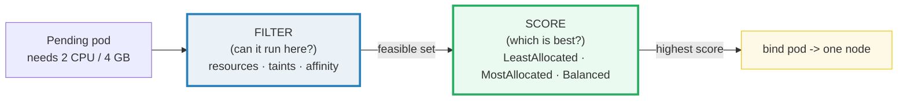
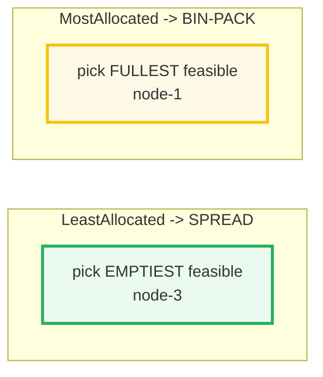

# The Kubernetes Scheduler — A Visual, Worked-Example Guide

> **Companion code:** [`scheduler.py`](./scheduler.py). **Every number in this
> guide is printed by `python3 scheduler.py`** — change the code, re-run,
> re-paste. Nothing here is hand-computed.
>
> **Live animation:** [`scheduler.html`](./scheduler.html) — open in a browser;
> it recomputes filter + score from the identical model and checks against the
> `.py` gold.
>
> **Source material:** Kubernetes scheduler docs
> (kubernetes.io/concepts/scheduling-eviction), the kube-scheduler configuration
> reference, and Borg (Verma et al 2015) for the "filter then score" two-phase
> placement heritage.

---

## 0. TL;DR — the whole idea in one picture

### Read this first — the hotel reception assigning rooms

When you create a Pod, it starts **Pending**. The scheduler's job is to pick
**exactly one** node for it (binding). Think of a hotel **reception assigning
guests to rooms**: it cannot overbook a room, it honors special requests (a guest
who needs a quiet floor), and it tries to spread guests so no single floor is
packed while others sit empty.

The scheduler does this in **two phases**:



1. **Filter** ("can the pod run here at all?") — hard yes/no per node: enough free
   CPU/memory? taints tolerated? nodeSelector/affinity match? Survivors form the
   **feasible set**.
2. **Score** ("of the feasible nodes, which is best?") — rank 0..100 and pick the
   top. The ranking encodes a **policy**, and two opposite ones matter most:
   - **LeastAllocated** → prefer the **least**-loaded node → **spreads** pods out.
   - **MostAllocated** → prefer the **most**-loaded node → **bin-packs** pods.

> **One-line definition:** the scheduler runs **Filter** (drop infeasible nodes)
> then **Score** (rank survivors by policy) and binds the pod to the top node.

### Glossary (every term used below)

| Term | Plain meaning |
|---|---|
| **Filter** | phase 1 — hard yes/no per node; produces the feasible set (older name: *predicates*) |
| **Score** | phase 2 — rank feasible nodes 0..100, pick highest (older name: *priorities*) |
| **allocatable** | a node's usable CPU/memory (capacity minus system reservations) |
| **request** | what the pod *guarantees* it needs; the scheduler compares `free = allocatable − requested` |
| **LeastAllocated** | score policy preferring least-utilized nodes → **spreading** |
| **MostAllocated** | score policy preferring most-utilized nodes → **bin-packing** |
| **taint** | a mark on a node (`key=value:effect`); `NoSchedule` repels pods without a matching toleration |
| **toleration** | a pod's "I'm OK running on nodes tainted X" |
| **antiAffinity** | "don't co-locate me with pods matching label Y" → spreads replicas for HA |
| **Cluster Autoscaler** | if a pod stays Pending (no node has room), it adds a node |

---

## 1. Filter phase — Section A output

> From `scheduler.py` **Section A** — pod `web` requests **2 CPU + 4 GB**, no
> tolerations. Nodes (alloc/used/free):
>
> ```
> name   cpu(alloc/used/free)   mem(alloc/used/free)   taints
> node-1 4/1/3                  16/4/12                 -
> node-2 4/3/1                  16/10/6                 -
> node-3 4/0/4                  16/0/16                 -
> node-4 8/2/6                  32/8/24                 -
> gpu-1  8/1/7                  32/4/28                 [{key: gpu, effect: NoSchedule}]
> ```
>
> Hard constraints (all must pass): `free_cpu ≥ 2`, `free_mem ≥ 4`, every
> `NoSchedule` taint tolerated.
>
> | node | verdict |
> |---|---|
> | node-1 | FEASIBLE |
> | node-2 | REJECTED — cpu short (free 1 &lt; 2) |
> | node-3 | FEASIBLE |
> | node-4 | FEASIBLE |
> | gpu-1  | REJECTED — taint `gpu:NoSchedule` not tolerated |
>
> **Feasible set = `[node-1, node-3, node-4]`.**

**Key point:** taints are enforced in **Filter**, *before* scoring — a tainted
node never competes for plain pods.

---

## 2. Score phase — Section B output (the GOLD, and the flip)

Three built-in policies (`NodeResourcesFit` scoring). Utilization is measured
**after** hypothetically placing the pod (`used + request`):

> From `scheduler.py` **Section B** — scores on the feasible set:
>
> | node | LeastAllocated | MostAllocated | Balanced | cpu_util / mem_util (after) |
> |---|---|---|---|---|
> | node-1 | 37.50 | **62.50** | 75.00 | 0.750 / 0.500 |
> | node-3 | **62.50** | 37.50 | 75.00 | 0.500 / 0.250 |
> | node-4 | 56.25 | 43.75 | 87.50 | 0.500 / 0.375 |
>
> Ranked:
> - `LeastAllocated → [node-3, node-4, node-1]` **winner: node-3** (SPREADING)
> - `MostAllocated → [node-1, node-4, node-3]` **winner: node-1** (BIN-PACKING)
> - `Balanced → [node-4, node-1, node-3]` **winner: node-4**
>
> ```
> GOLD LeastAllocated winner = node-3
> GOLD MostAllocated  winner = node-1
> [check] the two policies pick DIFFERENT nodes (spread vs pack)?  OK
> ```



**Watch the winner flip:** same pod, same feasible set, opposite placement.
LeastAllocated spreads load across many nodes; MostAllocated packs onto few nodes
so whole nodes can be drained and freed. The `.html` recomputes both winners in
JS and checks `Least→node-3, Most→node-1` — that is the bundle's gold-check.

> 🔗 Note on terminology: some docs call these phases *predicates* (filter) and
> *priorities* (score); the modern `NodeResourcesFit` plugin names are
> `LeastAllocated` / `MostAllocated` / `BalancedAllocation`.

---

## 3. Taints & tolerations — Section C output

> From `scheduler.py` **Section C** — node `gpu-1` taint `{key: gpu, effect:
> NoSchedule}`:
>
> | pod | toleration? | feasible on gpu-1? |
> |---|---|---|
> | `web` (no toleration) | no | **False → EXCLUDED** |
> | `train` (tolerates `gpu`) | yes | **True → ALLOWED** |
>
> `[check] toleration correctly gates gpu-1 access? OK`

Taints reserve special hardware (GPUs, dedicated/infra nodes) for the workloads
that explicitly tolerate them, so a plain web pod can never accidentally grab an
expensive GPU node.

---

## 4. podAntiAffinity — Section D output (HA spreading)

Goal: 3 replicas of `web` land on **3 different nodes**, so a single node failure
kills at most one replica. `podAntiAffinity` steers each later replica **away**
from nodes already hosting a `web` pod; within the allowed set, LeastAllocated
breaks the tie.

> From `scheduler.py` **Section D** — schedule 3 replicas onto
> `{node-1, node-3, node-4}`, committing usage as we go:
>
> | replica | avoid (already hosting) | placed on |
> |---|---|---|
> | 0 | `{}` | **node-3** (least-loaded) |
> | 1 | `{node-3}` | **node-4** (next emptiest, not hosting) |
> | 2 | `{node-3, node-4}` | **node-1** (only one left not hosting) |
>
> ```
> Placement order = [node-3, node-4, node-1]   (3 distinct nodes)
> GOLD antiAffinity placement = [node-3, node-4, node-1]
> [check] all 3 replicas on distinct nodes (HA)?  OK
> ```

**Result:** each replica got its own node — a node fault now takes down at most
one replica. That is the high-availability payoff of antiAffinity.

---

## 5. Cluster Autoscaler — Section E output

> From `scheduler.py` **Section E** — pod `big` requests **16 CPU / 32 GB**, more
> free capacity than any node offers:
>
> ```
> Filter result: 0 feasible node(s) -> []   (pod Pending)
> ```
>
> The Cluster Autoscaler sees the Pending pod, requests a new node from the cloud
> (`node-5`, 32 CPU / 64 GB), waits for it to boot + join + register, then the
> scheduler re-runs:
>
> ```
> After node-5 added: Filter result -> [node-5]  -> 'big' schedules on node-5
> [check] autoscaler resolved the Pending pod (node-5 feasible)?  OK
> ```

---

## 6. Pitfalls & debugging checklist

| # | Mistake | Symptom | Fix |
|---|---|---|---|
| 1 | Pod Pending, no node fits | `Insufficient cpu` events | Lower requests, scale nodes (autoscaler), or add tolerations |
| 2 | Pod lands on a tainted node unexpectedly | — | Tolerations only *permit*; a `NoSchedule` taint still repels unless tolerated |
| 3 | Replicas pile on one node | single-node hot spot | add `podAntiAffinity` (topology/hostname) to spread |
| 4 | Confusing spread vs pack | dense or sparse cluster | `LeastAllocated`=spread, `MostAllocated`=pack — choose the policy |
| 5 | nodeSelector/affinity too strict | empty feasible set | relax selectors; use *preferred* (soft) affinity |

---

## 7. Cheat sheet

- **Two phases:** Filter (feasible set) → Score (rank, bind top).
- **Filter = hard constraints:** free CPU/mem, taints/tolerations, nodeSelector/affinity.
- **LeastAllocated → spreading** (least-loaded); **MostAllocated → bin-packing** (most-loaded).
- **BalancedResourceAllocation:** prefer cpu ≈ mem utilization (secondary score).
- **Taints** enforced in Filter; **antiAffinity** spreads replicas across nodes for HA.
- **Autoscaler:** Pending pod (no room) → adds a node → re-schedules.
- **GOLD:** LeastAllocated→node-3, MostAllocated→node-1, antiAffinity→[node-3,node-4,node-1].

---

## Sources

- **Kubernetes scheduler** — kubernetes.io, *Kubernetes Scheduler* / *Assigning
  Pods to Nodes* / *Taints and Tolerations* / *Assigning a Pod to a Node*.
  https://kubernetes.io/docs/concepts/scheduling-eviction/
  - Verified: "filtering ... finds the set of nodes where it's possible to run
    the Pod"; "scoring ... ranks ... and assigns a score"; the `NodeResourcesFit`
    scoring strategies `LeastAllocated`, `MostAllocated`, `RequestedToCapacity`.
- **kube-scheduler configuration** — `kubernetes.io/docs/reference/scheduling/config`:
  `NodeResourcesFit` plugin and its `scoreStrategy` values.
- **Cluster Autoscaler** — github.com/kubernetes/autoscaler: "scales ... when
  pods are ... unschedulable due to insufficient resources."
- **Borg** — Verma et al. *Large-scale cluster management at Google with Borg.*
  EuroSys 2015. Borg's two-phase "filtering then scoring" placement is the direct
  ancestor of kube-scheduler.
