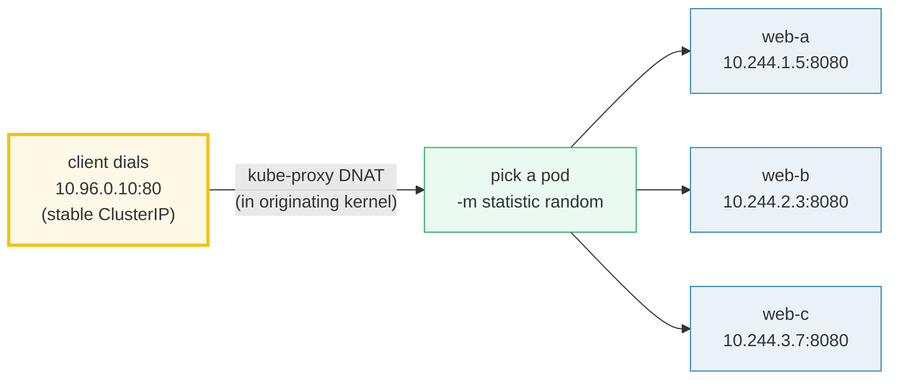
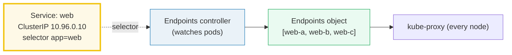
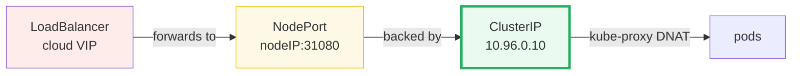

# Kubernetes Service &amp; Endpoints — A Visual, Worked-Example Guide

> **Companion code:** [`service_endpoints.py`](./service_endpoints.py). **Every
> number in this guide is printed by `python3 service_endpoints.py`** — change
> the code, re-run, re-paste. Nothing here is hand-computed.
>
> **Live animation:** [`service_endpoints.html`](./service_endpoints.html) — open
> in a browser; it re-runs the identical seeded simulation and checks against the
> `.py` gold.
>
> **Source material:** Kubernetes Services docs
> (kubernetes.io/concepts/services-networking/service), the EndpointSlice KEP,
> and Borg (Verma et al 2015) for the "stable name + internal load balancing"
> heritage.

---

## 0. TL;DR — the whole idea in one picture

### Read this first — the receptionist with three desks

A Pod's IP is **ephemeral**: it changes every time the pod restarts (like a
worker's desk that keeps getting reassigned). Clients cannot chase a moving IP,
so Kubernetes gives you a **Service** — a stable name + a stable virtual IP
(the **ClusterIP**) that never moves, no matter which pods come and go behind it.

Picture the Service as a **receptionist at a fixed front desk**. Visitors
(clients) always walk up to the same desk (the ClusterIP, `10.96.0.10`). The
receptionist hands each visitor a slip naming **one** back desk (a pod IP) to sit
at. If a back desk is removed (pod dies) or added (pod scales up), the slip list
updates — but visitors keep coming to the **same** front desk.



> **One-line definition:** a *Service* is a stable virtual IP + DNS name backed,
> via a **label selector**, by a live list of pod IPs. The **Endpoints
> controller** keeps that list current; **kube-proxy** turns it into kernel DNAT
> rules so a packet to the VIP is rewritten in flight to a pod IP.

### Glossary (every term used below)

| Term | Plain meaning |
|---|---|
| **ClusterIP** | a stable virtual IP for the Service, routable only inside the cluster (here `10.96.0.10`). Not bound to any one node |
| **Service** | the stable front desk: name + ClusterIP + label selector |
| **selector** | the label query deciding which pods back the Service (here `app=web`) |
| **Endpoints** | the *current* list of pod IP:ports, rebuilt by the Endpoints controller whenever pods come/go |
| **EndpointSlice** | the scalable successor: the list split into chunks of ≤100 |
| **kube-proxy** | the daemon on every node that turns Service+Endpoints into kernel rules (iptables or IPVS) |
| **DNAT** | Destination NAT — rewrite the destination IP/port in flight (`ClusterIP:80 → podIP:8080`) |
| **Headless** | a Service with `clusterIP: None` — no VIP, no kube-proxy rules; DNS returns pod IPs directly |

---

## 1. The Service + the Endpoints object — Section A output

The Service and the Endpoints list are **two separate objects**. The Service
points at pods *only* via the selector; the Endpoints object is the materialized
*result* of that selector.

> From `service_endpoints.py` **Section A** — Service `web` (`clusterIP
> 10.96.0.10`, port 80 → targetPort 8080, selector `app=web`):
>
> ```
> name   ip           port  node    labels
> web-a  10.244.1.5   8080  node-1  {app: web}
> web-b  10.244.2.3   8080  node-2  {app: web}
> web-c  10.244.3.7   8080  node-3  {app: web}
> db-0   10.244.1.9   5432  node-1  {app: db}     <- NOT selected (app != web)
> ```
>
> Endpoints controller result (3 endpoints):
> `10.244.1.5:8080`, `10.244.2.3:8080`, `10.244.3.7:8080`.
> (`db-0` is ignored — its labels don't match `app=web`.)



**Key point:** if a pod dies, the controller rewrites the Endpoints object — the
**Service never changes**. That decoupling is the whole reason clients get a
stable address while pods churn underneath.

---

## 2. kube-proxy iptables DNAT — Section B output (the GOLD)

kube-proxy runs on **every** node. It reads the Endpoints object and writes
iptables rules so a packet to the ClusterIP is rewritten to a pod IP **before it
leaves the originating node** — the packet never actually "travels to the VIP."

> From `service_endpoints.py` **Section B** — generated rules (`-m statistic
> --mode random` chaining):
>
> ```
> -A KUBE-SVC-WEB -m statistic --mode random --probability 0.33333333 -j KUBE-SEP-0
> -A KUBE-SVC-WEB -m statistic --mode random --probability 0.50000000 -j KUBE-SEP-1
> -A KUBE-SVC-WEB -j KUBE-SEP-2
> -A KUBE-SEP-0 -p tcp -j DNAT --to-destination 10.244.1.5:8080
> -A KUBE-SEP-1 -p tcp -j DNAT --to-destination 10.244.2.3:8080
> -A KUBE-SEP-2 -p tcp -j DNAT --to-destination 10.244.3.7:8080
> ```
>
> The chain gives each pod an equal **1/3** share: rule 0 claims 1/3 of all flow;
> rule 1 claims 1/2 of the *remaining* 2/3 (= 1/3); rule 2 takes the rest (= 1/3).

To prove the distribution is real (not just stated), the `.py` routes **300
requests** through that chain with a seeded deterministic RNG (xorshift32, so
[`service_endpoints.html`](./service_endpoints.html) reproduces it byte-for-byte):

> From `service_endpoints.py` **Section B** — 300 requests to `10.96.0.10:80`:
>
> | pod | hits | share |
> |---|---|---|
> | web-a | 102 | 34.0% |
> | web-b | 103 | 34.3% |
> | web-c | 95  | 31.7% |
>
> ```
> GOLD hit counts vector = [102, 103, 95]   (sum=300)
> req #0 -> endpoint index 0 (web-a)
> [check] simulation deterministic (recompute identical)?  OK
> [check] balanced (each pod within 30 of 100)?  OK
> ```

> 🔗 The `.html` recomputes the same xorshift32 stream in JavaScript and checks
> `counts == [102, 103, 95]` — see the green `check: OK` badge at the bottom of
> the page. That is the bundle's gold-check: **traffic routing distributes
> correctly across endpoints.**

---

## 3. Service types — Section C output

A Service's `.spec.type` controls how it is exposed. Exposure is a **stack** —
each outer type adds a layer on top of ClusterIP:

| type | address | what it does | reachable from |
|---|---|---|---|
| **ClusterIP** | `10.96.0.10` | cluster-internal only (default) | inside the cluster |
| **NodePort** | `30000-32767` (+ VIP) | opens a port on EVERY node's IP | inside + node IPs |
| **LoadBalancer** | cloud VIP → NodePort | cloud provisions an external LB | public internet |
| **Headless** | `None` (`clusterIP: None`) | no VIP; DNS returns pod IPs directly | StatefulSet / own-LB |



> From `service_endpoints.py` **Section C**: a LoadBalancer Service **still has**
> a ClusterIP and a NodePort; it just adds a cloud load balancer in front.
> NodePort picks a free port in `[30000, 32767]` (2768 ports); the `.py` checks
> the example `31080` is in range → **OK**.

---

## 4. Headless Service — Section D output

Set `spec.clusterIP: None` and the Service gets **no virtual IP and no
kube-proxy rules**. A DNS A-record query instead returns the pod IPs *directly*
(round-robin). Combined with a StatefulSet, every replica gets a **stable
per-pod DNS name**.

> From `service_endpoints.py` **Section D** — StatefulSet `web`, 3 replicas:
>
> | DNS query | answer |
> |---|---|
> | `web.default.svc.cluster.local.` (ClusterIP svc) | `A 10.96.0.10` ← **1** VIP |
> | `web.default.svc.cluster.local.` (Headless svc) | `A 10.244.1.20, 10.244.2.21, 10.244.3.22` ← **N** pod IPs |
> | `web-0.web.default.svc.cluster.local.` | `A 10.244.1.20` ← stable per-pod name |
> | `web-1.web.default.svc.cluster.local.` | `A 10.244.2.21` |
> | `web-2.web.default.svc.cluster.local.` | `A 10.244.3.22` |

**Why:** stateful systems (etcd, Kafka, Cassandra, Galera) need peers to reach
*each specific* pod by a stable name, not a random one. Headless + StatefulSet
gives every replica a fixed DNS identity that survives pod restarts — the pod
name and DNS name stay; only the underlying IP may change, and the controller
rewrites the A record.

---

## 5. EndpointSlice — Section E output (scalability)

The legacy `Endpoints` object is **one** object per Service holding **all**
addresses. A 1000-pod Service ships a 1000-entry object; any single pod change
rewrites the *whole* object and notifies every watcher. **EndpointSlice** (GA
since 1.21) splits the list into chunks (default max 100) addressed by a label
(`kubernetes.io/service-name=...`).

> From `service_endpoints.py` **Section E** — 250-pod Service,
> `maxEndpointsPerSlice=100`:
>
> | slice | endpoints |
> |---|---|
> | 0 | 100 |
> | 1 | 100 |
> | 2 | 50 |
>
> → 3 slices total (250 endpoints covered). `[check]` cover all + no slice
> exceeds 100 → **OK**.

Why it scales: a watcher receives only the *slices that changed*; each slice is
small (≤100 entries); adding pod #251 appends a *new* slice and leaves the others
untouched.

---

## 6. Pitfalls & debugging checklist

| # | Mistake | Symptom | Fix |
|---|---|---|---|
| 1 | Expecting the ClusterIP to be bound to a node | "where is 10.96.0.10?" confusion | It's a virtual IP; DNAT happens on the originating node |
| 2 | Pod ready but no traffic | endpoints empty / not ready | Check the selector matches pod labels; pod readinessProbe |
| 3 | NodePort outside range | Service creation rejected | Must be `30000-32767` |
| 4 | Using a ClusterIP svc for peer-to-peer | can't address individual pods | Use Headless + StatefulSet for stable per-pod DNS |
| 5 | One giant Endpoints object at scale | slow watches, big etcd writes | EndpointSlice (default since 1.21) |

---

## 7. Cheat sheet

- **Service** = stable ClusterIP + selector. **Endpoints** = live pod IPs (separate object).
- **kube-proxy** (every node) → iptables DNAT: `ClusterIP:80 → podIP:8080`.
- **iptables mode** = `-m statistic --mode random` chaining; **IPVS** = weighted round-robin.
- **Types stack:** LoadBalancer ⊃ NodePort ⊃ ClusterIP ⊃ pods.
- **Headless** (`clusterIP: None`): no VIP, no rules; DNS returns pod IPs; StatefulSet gives per-pod names.
- **EndpointSlice:** ≤100 endpoints/slice → scalable watching.
- **GOLD:** 300 simulated requests distribute `[102, 103, 95]` (matches `.html`).

---

## Sources

- **Kubernetes Services** — kubernetes.io, *Service* / *EndpointSlices* concepts.
  https://kubernetes.io/docs/concepts/services-networking/service/
  - Verified: "a Service ... defines a logical set of Pods and a policy by which
    to access them"; "kube-proxy ... forwards the request to one of the Pods";
    "ClusterIP ... is only reachable from within the cluster."
- **EndpointSlice** — kubernetes.io, *EndpointSlices*; KEP sig-storage/sig-network.
  - Verified: default `maxEndpointsPerSlice = 100`; addresses selected via the
    `kubernetes.io/service-name` label.
- **kube-proxy modes** — iptables (`-m statistic --mode random`) and IPVS
  (weighted round-robin / least-connection) per the kube-proxy reference.
- **Borg** — Verma et al. *Large-scale cluster management at Google with Borg.*
  EuroSys 2015. The "stable name + internal load balancing" pattern Kubernetes
  inherited: jobs address a stable service, Borg directs to a task.
