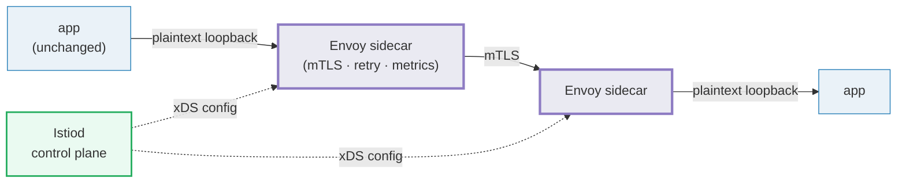
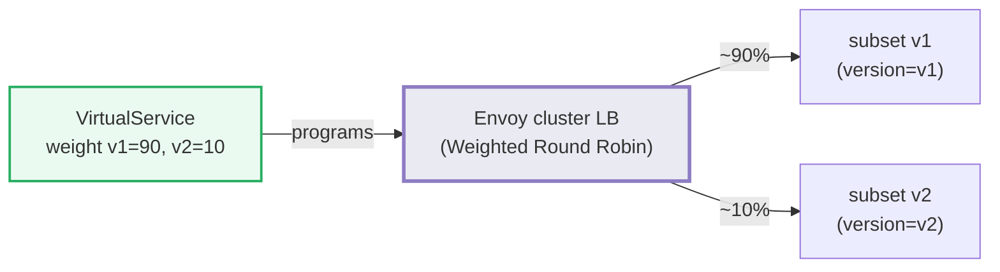

# The Service Mesh (Istio / Envoy) — A Visual, Worked-Example Guide

> **Companion code:** [`service_mesh.py`](./service_mesh.py). **Every number in
> this guide is printed by `python3 service_mesh.py`** — change the code, re-run,
> re-paste. Nothing here is hand-computed.
>
> **Live animation:** [`service_mesh.html`](./service_mesh.html) — open in a
> browser; it recomputes the traffic split, resilience trace, and golden signals
> from the identical deterministic model and checks against the `.py` gold.
>
> **Source material:** Istio docs (istio.io/latest/docs), Envoy docs
> (envoyproxy.io), the SPIFFE/SPIRE spec (spiffe.io), Google SRE Book ch.6 (the
> four golden signals), and the sidecar pattern (Burns, *Designing Distributed
> Systems*).

---

## 0. TL;DR — the whole idea in one picture

### Read this first — the diplomatic courier corps

Picture two embassies (services) that must exchange messages. **Without a mesh**,
every ambassador hand-builds their own secure courier: hire a guard (TLS), write
rules for how many messengers may enter at once (limits), keep a blacklist of
unsafe routes (circuit breaker), and file a trip report after every delivery
(metrics/tracing). Every embassy reinvents all of this, in every language, and
they never quite agree.

A **service mesh** installs **one shared courier corps** — an **Envoy proxy** — in
front of every embassy, as a **sidecar** (a second container in the same pod). The
ambassador hands the letter to the local courier; the corps handles security,
limits, blacklists, and reporting **uniformly**. The ambassador's code never
changes.



Two halves of the corps:

- **Control plane (Istiod)** — headquarters. Reads your rules
  (`VirtualService`, `DestinationRule`) and programs every Envoy via **xDS**. It
  does **not** touch live traffic.
- **Data plane (Envoy × N)** — the couriers, one per pod. **All** traffic in/out
  of the pod is forced through them by `iptables` rules an init container installs.

> **One-line definition:** a service mesh is a layer of sidecar proxies that
> transparently handle service-to-service **security (mTLS), traffic control,
> resilience, and observability** — with **zero** changes to application code.

### Glossary (every term used below)

| Term | Plain meaning |
|---|---|
| **service mesh** | an infra layer that routes service-to-service traffic through programmable proxies (Istio, Linkerd) |
| **sidecar** | a second container added to a pod, running alongside the app (here: Envoy) |
| **Envoy** | the proxy; the whole "data plane". CNCF project, built by Lyft |
| **Istiod** | the Istio control plane; configures every Envoy via xDS |
| **xDS** | the gRPC protocol Istiod uses to push config (LDS/RDS/CDS/EDS) |
| **init container** | a container that runs to completion *before* the app; here it writes the `iptables` hijack rules (`istio-init`) |
| **mTLS** | mutual TLS — *both* sides present and verify a cert; Envoy does it, the app sees plaintext on loopback |
| **SPIFFE** | a workload identity standard: `spiffe://<trust-domain>/ns/<ns>/sa/<sa>`. Istiod mints short-lived certs with this SAN, auto-rotated |
| **VirtualService** | routing rules: "send 90% to v1, 10% to v2" (control plane) |
| **DestinationRule** | per-host policy: LB algorithm, subsets, connection pool, outlier detection, retries |
| **subset** | a named slice of a service's pods by label (`version=v1`) |
| **weight** | in a VirtualService route, the `%` of traffic to a subset |
| **retry** | re-send a failed request (e.g. on 5xx), up to N attempts |
| **timeout** | give up one attempt after T seconds (`perTryTimeout`) |
| **circuit breaker** | per-*cluster* connection-pool limit; overflow → 503 locally, never calls upstream (overflow protection) |
| **outlier detection** | per-*host* health; eject a host after K consecutive 5xx for a cooldown (health protection) |
| **golden signals** | the four metrics to watch any service: latency, traffic, errors, saturation (Google SRE) |
| **trace / span** | a request's path across services (Jaeger); Envoy auto-propagates W3C `Traceparent` |

---

## 1. Sidecar injection — Section A output

> From `service_mesh.py` **Section A** — Istio injects **two** things into the
> pod, both invisible to the app:
>
> 1. an **init container** `istio-init` that writes `iptables` rules hijacking
>    every TCP connection into Envoy *before* the app starts;
> 2. a **sidecar** `istio-proxy` (Envoy) owning `15001` (outbound) and `15006`
>    (inbound).
>
> The `payment` container is **unchanged** — it still binds `:8080`.
>
> ```
> AFTER injection:
>   initContainers: [ istio-init (iptables redirect) ]
>   containers:     [ payment:8080 (unchanged) , istio-proxy (Envoy) ]
> ```

Traffic path once the sidecar is in place (the app is never aware):

```
INBOUND : client -> eth0 -> iptables -> Envoy:15006 -> app:8080   (mTLS terminates)
OUTBOUND: app:8080 -> iptables -> Envoy:15001 -> (mTLS) -> remote Envoy -> app:8080
```

**Key point:** the app still talks to services by DNS and sees plaintext on the
loopback; `iptables` redirection is what makes interception transparent. The wire
between pods is encrypted by Envoy.

```
[check] injection added 1 init + 1 sidecar, app unchanged?  OK
```

---

## 2. mTLS between services — Section B output

Without a mesh, every service must obtain and rotate its own TLS cert and verify
peers — almost nobody does it correctly. The mesh does it **for** you. Istiod
runs a CA; every pod's Envoy asks it for a short-lived cert whose SAN is the
pod's **SPIFFE identity**:

> ```
> SPIFFE ID = spiffe://cluster.local/ns/default/sa/payment
>
> workload_certificate:
>   san (identity): spiffe://cluster.local/ns/default/sa/payment
>   issuer: Istio CA (trust domain cluster.local)
>   key: ECDSA P-256
>   validity: 24h
>   rotate_at: 80% of TTL = 19h12m   (Envoy fetches a fresh cert in advance)
> ```

The handshake between two pods (both sidecarred): each Envoy presents its cert,
both verify the chain to the shared CA, then share an AES-256-GCM channel. A
`PeerAuthentication: STRICT` policy rejects plaintext entirely.

**Why auto-rotation matters:** a 24h cert rotated at 80% lifetime means a stolen
cert is useless within hours. Operators set policy once; rotation, distribution,
and verification are the mesh's job — **zero cert logic in application code**.

```
[check] 24h cert rotated at 80% -> 19.2h (long before expiry)?  OK
```

---

## 3. Traffic splitting — Section C output (the GOLD)

The operator writes two control-plane objects. Istiod reads them and programs
every Envoy via xDS; the **data plane** (Envoy) performs the actual split.

> From `service_mesh.py` **Section C** — the VirtualService and DestinationRule:
>
> ```yaml
> # VirtualService -- routing rules
> host: payment
> routes:
> - { to: payment, subset: v1, weight: 90 }
> - { to: payment, subset: v2, weight: 10 }
>
> # DestinationRule -- policy for payment
> trafficPolicy:
>   loadBalancer: ROUND_ROBIN
>   connectionPool: { maxConnections: 100, maxPendingRequests: 10 }
>   outlierDetection: { consecutive5xxErrors: 5, baseEjectionTime: 30 }
> retryPolicy: { attempts: 3, perTryTimeout: 2s, retryOn: "5xx,connect-failure,reset" }
> ```

How the weights become reality: Envoy's cluster for `payment` has two subsets
(v1, v2) with LB weights 90 / 10. Envoy runs a **Weighted Round Robin** over
them. Over every `sum(weights)` = 100 consecutive requests, each subset is chosen
exactly its weight times.

> ```
> Configured weights: {'v1': 90, 'v2': 10}   (sum = 100)
>
> Simulated 1000 requests through Envoy's WRR (deterministic):
>   v1 ->  900 requests  (90.0%)
>   v2 ->  100 requests  (10.0%)
>
> GOLD (pinned for service_mesh.html):
>   per-cycle counts over 100 requests = {'v1': 90, 'v2': 10}
>   configured weights                       = {'v1': 90, 'v2': 10}
>   1000-req split                           = {v1: 900, v2: 100}  ratio 90:10
> [check] WRR per-cycle counts == VirtualService weights?  OK
> ```



**This is the bundle's gold-check:** `service_mesh.html` re-runs the same WRR in
JS and verifies that at **90/10** the per-cycle counts are exactly
`{v1:90, v2:10}` and 1000 requests split **900 / 100**.

---

## 4. Resilience — Section D output (retries + outlier detection + circuit breaker)

Three independent protections live in the sidecar, configured via the
DestinationRule:

| Protection | Scope | What it does |
|---|---|---|
| **retry** | per-request | re-send on `{5xx,connect-failure,reset}`, up to 3 tries, each capped at `perTryTimeout=2s` |
| **outlier detection** | per-*host* | after 5 consecutive 5xx, **eject** the host for 30s; the LB skips it |
| **circuit breaker** | per-*cluster* | if `maxConnections=100` is exceeded, return 503 **locally** (UPSTREAM_OVERFLOW) — never drowns the upstream |

> From `service_mesh.py` **Section D** — cluster v1 = `[pod-a, pod-b]`. `pod-a`
> returns `[503 ×5]` then heals; `pod-b` is always 200. retry=3 attempts, eject
> after 5 consecutive 5xx.
>
> | req | WITHOUT mesh (app calls upstream) | WITH mesh (Envoy retries + ejects) |
> |---|---|---|
> | 1 | **503!** `pod-a:503` | 200 `pod-a:503 -> pod-b:200` (2 tries) |
> | 2 | 200 `pod-b:200` | 200 `pod-a:503 -> pod-b:200` (2 tries) |
> | 3 | **503!** `pod-a:503` | 200 `pod-a:503 -> pod-b:200` (2 tries) |
> | 4 | 200 `pod-b:200` | 200 `pod-a:503 -> pod-b:200` (2 tries) |
> | 5 | **503!** `pod-a:503` | 200 `pod-a:503 -> pod-a:EJECT -> pod-b:200` (2 tries) |
> | 6 | 200 `pod-b:200` | 200 `pod-b:200` (1 try) |
> | 7 | **503!** `pod-a:503` | 200 `pod-b:200` (1 try) |
> | 8 | 200 `pod-b:200` | 200 `pod-b:200` (1 try) |
>
> **User-visible failures: WITHOUT mesh = 4/8 — WITH mesh = 0/8.** `pod-a`
> ejected on request 5.

**Read this:** without the mesh, every call landing on `pod-a` while it errors is
a 503 the user sees. With the mesh, Envoy retries to `pod-b` on failure (clean
200), and once `pod-a` errs 5× in a row, outlier detection **ejects** it so later
requests aren't even routed there. The caller never knows `pod-a` broke.

**Circuit breaking** (separate trace): with `maxConnections=100`, a burst of 105
concurrent requests is capped — Envoy forwards 100 and rejects 5 **locally**
(`503 UPSTREAM_OVERFLOW`), protecting a struggling upstream from being drowned.

```
[check] retries+ejection hid all upstream failures (OK)
[check] circuit breaker capped overflow at maxConnections (OK)
```

---

## 5. Observability — Section E output (the four golden signals, for free)

Envoy sits on **every** connection, so it sees **every** request. It emits the
four golden signals (Google SRE ch.6) with **zero** changes to app code:

> From `service_mesh.py` **Section E** — a 20-request window to `payment`
> (deterministic):
>
> | signal | value |
> |---|---|
> | **Latency** | min=39, **p50=49.0**, **p90=59.0**, **p99=62.6**, max=63 ms |
> | **Traffic** | 20 req/s |
> | **Errors** | 2 × 5xx (10.0%) |
> | **Saturation** | 73/100 connections = 73% of pool |
>
> ```
> GOLD (pinned for service_mesh.html): p50=49.0ms, p90=59.0ms, p99=62.6ms, sat=73%, err=10.0%
> [check] p50<p90<p99 ordering + valid saturation window?  OK
> ```

**Tracing is the same story:** Envoy generates and propagates W3C `Traceparent`
headers and ships spans to **Jaeger** — one click shows the full request hop
chain across services, again with no app change.

These are **golden** because they tell you, in four numbers, whether a service is
healthy: rising latency + rising errors + high saturation = a service in trouble
— and the mesh gave you all of it automatically.

---

## 6. The whole bundle, cross-checked

| File | Role |
|---|---|
| [`service_mesh.py`](./service_mesh.py) | the single source of truth; `python3 service_mesh.py` prints every number above |
| [`service_mesh_output.txt`](./service_mesh_output.txt) | the captured stdout of one run |
| [`service_mesh.html`](./service_mesh.html) | interactive; recomputes WRR, resilience, golden signals in JS and gold-checks vs the `.py` |
| `SERVICE_MESH.md` | this guide |

The recurring theme: **the sidecar makes the mesh transparent to the app.** App
teams write business logic; the mesh — via the sidecar — uniformly delivers mTLS,
weighted routing, retries/circuit breaking, and the golden signals. One control
plane (`Istiod`) programs it all; one data plane (Envoy) enforces it all.
