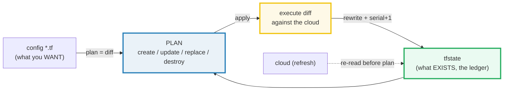
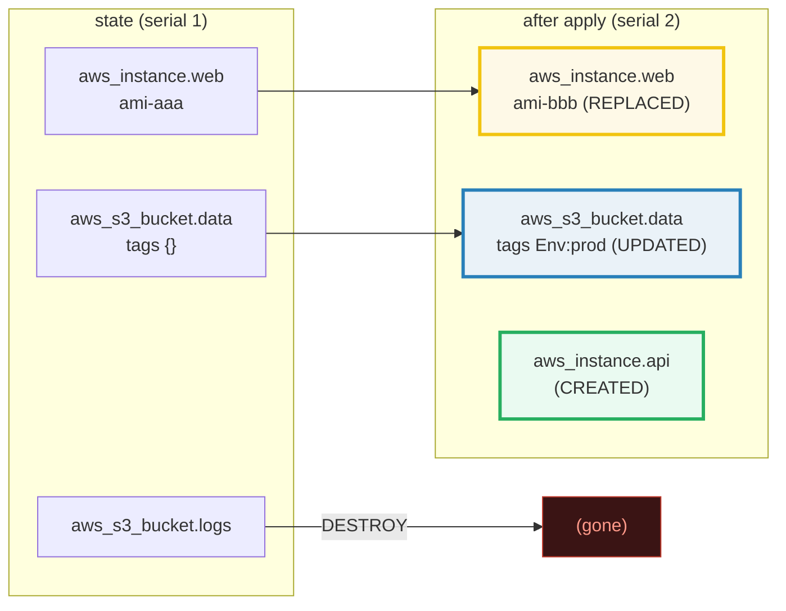
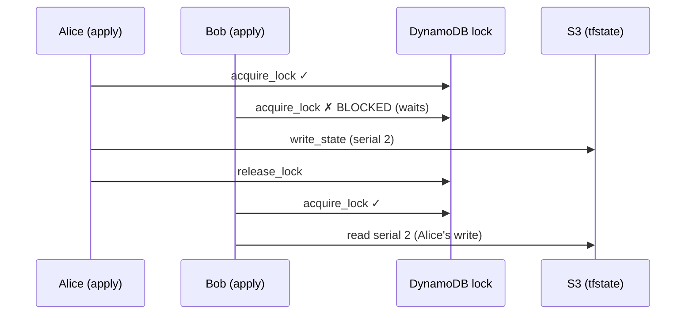

# Terraform State — A Visual, Worked-Example Guide

> **Companion code:** [`terraform_state.py`](./terraform_state.py). **Every
> number, JSON blob, and plan/apply/drift scenario in this guide is printed by
> `python3 terraform_state.py`** — change the code, re-run, re-paste. Nothing
> here is hand-computed.
>
> **Live animation:** [`terraform_state.html`](./terraform_state.html) — open in
> a browser; it recomputes the plan diff, apply, and drift from the identical
> model and checks against the `.py` gold.
>
> **Source material:** Terraform docs — *State*, *Backends: Configuration* &
> *Locking*, *Command: plan*, *Command: apply*, *Import existing
> infrastructure* (developer.hashicorp.com/terraform). AWS provider schema:
> `ami` = ForceNew, `instance_type` = in-place.

---

## 0. TL;DR — the whole idea in one picture

### Read this first — the contractor's master ledger

Imagine a building contractor who keeps a **master ledger**
(`terraform.tfstate`). The ledger records, for every wall, door, and pipe that
has actually been **built**, its real-world identifier and exact specs.

Your **blueprint** (the `*.tf` config files) says what you **want** the building
to be.



- **`terraform plan`** = hold the blueprint next to the ledger and compute the
  **diff**: what must be created, updated, replaced, destroyed.
- **`terraform apply`** = carry out that diff against the real building, then
  **rewrite the ledger** so it matches the new reality (`serial` += 1).

> **One-line definition:** state is the **source of truth for what exists**;
> `plan` = `diff(config, state)`; `apply` = execute the diff then rewrite state.
> A `refresh` (re-read the cloud) happens before the plan, which is how
> **drift** surfaces.

### Glossary (every term used below)

| Term | Plain meaning |
|---|---|
| **tfstate** | the master ledger — JSON recording every managed resource with its real cloud ID + attributes |
| **address** | a resource's key, `type.name` (e.g. `aws_instance.web`); the join key between config and state |
| **plan** | the diff between desired config and current state; labels each resource |
| **create** | in config, NOT in state → build it |
| **destroy** | in state, NOT in config → tear it down |
| **update** (in-place) | in both; an attribute changed the cloud can alter without rebuilding (e.g. `instance_type`, `tags`) |
| **replace** | in both; a *ForceNew* attribute changed (e.g. `ami`) → destroy old + create new |
| **apply** | execute the plan against the cloud, then rewrite tfstate; `serial` += 1 |
| **serial** | integer in tfstate, +1 per write; the lock prevents two writers at the same serial from clobbering |
| **refresh** | re-read each resource's current cloud attributes into state *before* planning — how drift is detected |
| **drift** | the real cloud resource no longer matches tfstate (out-of-band console/CLI change) |
| **backend** | where tfstate lives: local file, or remote (S3 + DynamoDB lock, Terraform Cloud) for teams |
| **state lock** | a short-lived mutex (DynamoDB row / `.lock.info`) held during plan/apply |
| **import** | bring an *existing* cloud resource into state so Terraform manages it |

---

## 1. State structure — Section A output

`tfstate` is a JSON file. The `resources` array has one entry per managed
resource; each entry pins `type`, `name`, `provider`, and an `instances` array
holding the **real cloud attributes**.

> From `terraform_state.py` **Section A** — after applying the base config, the
> first two state entries (an EC2 instance + an S3 bucket):
>
> ```json
> {
>   "mode": "managed",
>   "type": "aws_instance",
>   "name": "web",
>   "provider": "provider[\"registry.terraform.io/hashicorp/aws\"]",
>   "instances": [
>     { "schema_version": 0,
>       "attributes": { "ami": "ami-aaa", "instance_type": "t3.micro",
>                       "tags": { "Name": "web" } } }
>   ]
> }
> ```
>
> Top-level keys: `version`, `terraform_version`, `serial`, `lineage`,
> `outputs`, `resources`. Addresses in state:
> `[aws_instance.web, aws_s3_bucket.data, aws_s3_bucket.logs]`.

**Key points:** the address `aws_instance.web` is the join key between a config
block `resource "aws_instance" "web"` and its state entry. The `attributes`
hold the values the provider **read back from the cloud** — this is the ledger.
`serial` increments on every write.

---

## 2. Plan — Section B output (the GOLD: all four actions)

A change set (`CONFIG_V2`) is designed to exercise **every** plan action. The
plan is `diff(config, state)`:

> From `terraform_state.py` **Section B**:
>
> | change | action | why |
> |---|---|---|
> | `aws_instance.web` AMI `ami-aaa` → `ami-bbb` | **REPLACE** | `ami` is ForceNew |
> | `aws_instance.api` brand new | **CREATE** | in config, not in state |
> | `aws_s3_bucket.data` tags `{}` → `{Env:prod}` | **UPDATE** | in-place |
> | `aws_s3_bucket.logs` removed from config | **DESTROY** | in state, not in config |
>
> ```
> GOLD create  -> ['aws_instance.api']
> GOLD update  -> ['aws_s3_bucket.data']
> GOLD replace -> ['aws_instance.web']
> GOLD destroy -> ['aws_s3_bucket.logs']
> [check] plan classifies create/update/replace/destroy correctly?  OK
> ```



**The classification rule:** if an attribute that is **ForceNew** changes, the
whole resource is **replaced**; otherwise it's an in-place **update**. For the
AWS provider, `aws_instance.ami` is ForceNew (new AMI ⇒ new EC2), while
`instance_type` and `tags` are in-place. The `.html` recomputes this exact diff
in JS and checks the four-way gold.

> 🔗 See [`hcl_graph.md`](./HCL_GRAPH.md) for how Terraform *orders* the
> create/destroy actions it derives from this plan (the dependency DAG).

---

## 3. Apply — Section C output

`apply` executes each action against the cloud, then **rewrites tfstate** so the
ledger matches reality. Every apply bumps `serial`.

> From `terraform_state.py` **Section C**:
>
> ```
> serial BEFORE apply = 1
> serial AFTER  apply = 2   (+1)
> addresses BEFORE: [aws_instance.web, aws_s3_bucket.data, aws_s3_bucket.logs]
> addresses AFTER : [aws_instance.api, aws_instance.web, aws_s3_bucket.data]
> ```
>
> `aws_instance.api` CREATED (now in state); `aws_s3_bucket.logs` DESTROYED
> (gone); `aws_instance.web` REPLACED (AMI now `ami-bbb`, new cloud id);
> `aws_s3_bucket.data` UPDATED (tags now `{Env: prod}`).
>
> Re-planning `CONFIG_V2` against the new state: **0 actions** → idempotent.
> `[check] apply made config and state converge (no-op re-plan)? OK`

**Why `serial` matters:** it is a write generation counter. Two concurrent
writers both at `serial = N` would both emit `serial = N+1` and the second would
**clobber** the first (lost update). The state **lock** (Section 4) exists
precisely to serialize those writes.

---

## 4. Backend & locking — Section D output

For teams, tfstate lives in a shared **backend**: an S3 bucket holds the file; a
**DynamoDB** table provides a **lock** so two concurrent applies cannot both
rewrite (and clobber) the state.

> From `terraform_state.py` **Section D** — Alice and Bob both run `apply`:
>
> | step | result |
> |---|---|
> | Alice acquires lock | **True** → `lock_held_by = run-alice` |
> | Bob acquires lock | **False → BLOCKED** (must wait) |
> | Alice writes state (`serial 1 → 2`), releases lock | |
> | Bob retries | **True** → reads `serial = 2` (Alice's write, not stale) |
>
> ```
> [check] lock blocked the 2nd apply until the 1st released?  OK
> ```



**Without the lock:** both read `serial=N`, both write `serial=N+1`, and Alice's
apply silently vanishes. The DynamoDB lock is what makes shared state safe for
teams. (Terraform Cloud / HCP Terraform provide locking as a managed service.)

---

## 5. Drift — Section E output

Someone edits `instance_type` in the AWS console: `t3.micro → t3.large`. Neither
config nor tfstate know yet.

> From `terraform_state.py` **Section E** —
> config = `t3.micro` (wanted), tfstate = `t3.micro` (last known), **real cloud
> = `t3.large`** (drift):
>
> | plan mode | actions | sees drift? |
> |---|---|---|
> | **without** refresh (`diff(config, tfstate)`) | 0 — config matches tfstate | **no** (invisible!) |
> | **with** refresh (refresh first, then diff) | 1 → `UPDATE aws_instance.web` `instance_type: t3.large → t3.micro` | **yes** |
>
> ```
> [check] refresh made plan detect the drift (t3.large)?  OK
> ```

`terraform plan` runs a **refresh by default** — it re-reads every resource's
current cloud attributes into state *before* diffing. So the drift shows up as
an `UPDATE` that would change `instance_type` back to `t3.micro`. Use
`terraform plan -refresh-only` when you want to *record* drift into state
without changing real resources.

---

## 6. Import — bringing outside resources into state

A resource made **outside** Terraform (console, CloudFormation, another tool) is
unknown to tfstate. `terraform import` reads it from the cloud and writes a
state entry, without creating anything:

```
terraform import aws_instance.web i-0abc123def   # writes state, creates nothing
```

After import, the resource is **managed**: the next `plan` will be a no-op *if*
your config matches the imported attributes, or a diff otherwise. Import does
**not** generate config — pair it with `terraform plan` to discover what config
you still need to write.

---

## 7. Pitfalls & debugging checklist

| # | Mistake | Symptom | Fix |
|---|---|---|---|
| 1 | Committing tfstate to git (local backend) | secrets (DB passwords) leaked; team overwrites | use remote backend (S3 + DynamoDB); `gitignore` tfstate |
| 2 | Two people apply with no lock | lost updates, "serial" mismatch, drift | enable DynamoDB locking on the S3 backend |
| 3 | Drift not showing in plan | plan looks clean but cloud differs | remember refresh runs by default; use `-refresh-only` to inspect |
| 4 | `instance_type` vs `ami` confusion | unexpected destroy+create | `ami` is ForceNew (replace); `instance_type` is in-place (update) |
| 5 | Editing tfstate by hand | corrupt state, plan errors | never hand-edit; use `terraform state` subcommands (rm, mv) |
| 6 | Unmanaged resource | "already exists" on apply | `terraform import` it, or remove from config |

---

## 8. Cheat sheet

- **State = source of truth for what EXISTS**; address `type.name` joins config ↔ state.
- **plan = `diff(config, state)`**; **apply = execute diff + rewrite state** (`serial += 1`).
- **ForceNew attribute change → REPLACE; otherwise → UPDATE** (in-place).
- **Backend (S3 + DynamoDB lock)** enables safe team sharing; lock blocks concurrent applies.
- **refresh** re-reads the cloud before plan → **drift** (out-of-band changes) shows as a diff.
- **import** brings an existing cloud resource into state (no creation).
- **GOLD:** plan → create `[aws_instance.api]`, update `[aws_s3_bucket.data]`, replace `[aws_instance.web]`, destroy `[aws_s3_bucket.logs]`.

---

## Sources

- **Terraform State** — developer.hashicorp.com/terraform/language/state:
  "Terraform ... stores ... state about your managed infrastructure ... this
  state is used ... to make plans and update resources."
- **Backends & Locking** — developer.hashicorp.com/terraform/language/backend:
  S3 backend with `use_lockfile` / DynamoDB `dynamodb_table` for state locking;
  "locking helps prevent ... state corruption during concurrent runs."
- **Command: plan / Command: apply** — refresh behaviour and `-refresh-only`;
  apply persists the new state and increments the serial.
- **Import existing infrastructure** — developer.hashicorp.com/terraform/cli/import:
  import "writes ... existing resources into the state" without creating.
- **AWS provider schema** — `aws_instance`: `ami` = `ForceNew`, `instance_type` =
  in-place (Optional, update); `aws_s3_bucket.bucket` = `ForceNew`.
