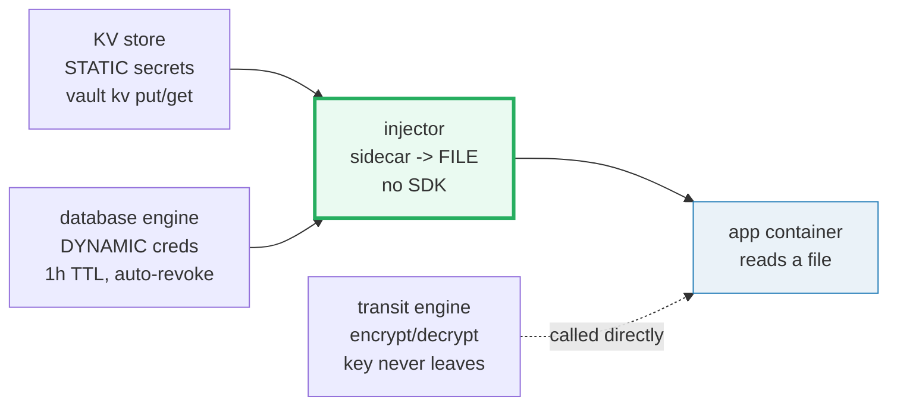
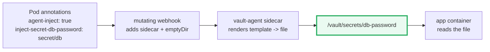

# HashiCorp Vault Secrets — A Visual, Worked-Example Guide

> **Companion code:** [`vault_secrets.py`](./vault_secrets.py). **Every
> ciphertext, issued credential, injected file, and lease-TTL value in this guide
> is printed by `python vault_secrets.py`** — change the code, re-run, re-paste.
> Nothing here is hand-computed.
>
> **Live animation:** [`vault_secrets.html`](./vault_secrets.html) — open in a
> browser; it recomputes the transit ciphertext, the injection file, and the
> lease lifecycle in JS and runs the same gold checks as the `.py`.
>
> **Source material:** developer.hashicorp.com/vault — *KV Secrets*, *Database
> Secrets Engine*, *Transit Secrets Engine*, *Vault Agent Injector*, *Leases,
> Renewals and Revocation*.

---

## 0. TL;DR — the bank vault vs the safe under the desk

The naive move for secrets is an env var or a value baked into the image — a
"safe under the desk": if the host is compromised, **every secret it ever held
is gone**, and you have no audit trail. **Vault** is a **bank vault**: secrets
live in one encrypted store, are **issued on demand** with a TTL, and reach the
app as **files** (no SDK).



- **KV (static)** — you `put` the value once; readers get it until you change it.
  Stored **encrypted at rest**; callers get **plaintext**.
- **Dynamic (database)** — Vault **creates** a fresh DB user on read, with a
  **1h TTL**; on expiry it **auto-revokes** (drops the user). No shared password.
- **Transit** — **encryption as a service**: Vault holds the key; you call
  `encrypt`/`decrypt`. The data is **never stored** in Vault.
- **Injection** — the `vault-agent-injector` mutates the Pod to add a sidecar
  that renders secrets to a **shared volume** as **files**. The app reads a file.

> **One-line rules:**
> - static = you write it; dynamic = Vault mints it (with a TTL).
> - transit = stateless crypto API; the **key never leaves** Vault.
> - injection = app reads a **file** under `/vault/secrets/`; **no Vault SDK**.
> - a lease has a TTL; `renew` extends it, `revoke` destroys now, expiry
>   auto-destroys.

### Glossary

| Term | Plain meaning |
|---|---|
| **KV store** | key-value secret engine (KV v2 = versioned); static value |
| **dynamic secret** | credential Vault **generates** on read (DB user, AWS IAM, SSH cert); has lease + TTL |
| **transit engine** | encryption-as-a-service; Vault holds the key, data never stored |
| **lease** | handle for a dynamic secret: `lease_id`, `lease_duration` (TTL), `renewable` |
| **TTL** | time-to-live; when it elapses the secret is revoked |
| **renewal** | extend the lease (bounded by `max_ttl`); like renewing a library book |
| **revocation** | destroy the secret **now** (e.g. `DROP USER`) before TTL |
| **secret engine** | a Vault plugin mounted at a path: `kv/`, `database/`, `transit/` |
| **vault-agent** | sidecar that fetches secrets + renders templates to files |
| **injector** | `vault-agent-injector`: mutating webhook that adds the sidecar + emptyDir |
| **CSI driver** | `secrets-store-csi`: mounts secrets as a volume (no sidecar, no K8s Secret) |
| **auth method** | how a caller proves identity: `kubernetes`, `approle`, `aws`, `jwt` |
| **policy** | grant of what paths a token may read/write |
| **envelope seal** | master key split into Shamir shares; a quorum must **unseal** Vault |

> 🔗 **Note on the model:** real Vault encrypts at rest with **AES-256-GCM** and
> transit uses AES-256-GCM with a random nonce (non-deterministic). The code uses
> a **deterministic reversible transform** (XOR over a derived key) so ciphertexts
> are reproducible — clearly labelled `SIMULATED`. The **API shape** and the
> **injection/TTL pipeline** are what matter here.

---

## 1. KV store — static secrets, encrypted at rest, plaintext on read — Section A

```bash
vault kv put secret/db username=admin password=s3cr3t-db     # v1
vault kv put secret/db password=rotated-2026                 # v2 (rotate)
vault kv get secret/db                                       # -> v2, plaintext
```

> From `vault_secrets.py` **Section A** — read returns **plaintext**; storage
> holds **ciphertext**:
>
> | key | `vault kv get` (plaintext) | storage (SIMULATED-encrypted) |
> |---|---|---|
> | `username` | `admin` | (b64 of XOR cipher) |
> | `password` | `rotated-2026` | `...` (≠ plaintext) |

KV v2 stores **data** at `secret/data/db` and **metadata** (versions, deletion)
at `secret/metadata/db`; old versions are retained until destroyed.

`[check]` read returns plaintext `rotated-2026`, store ≠ plaintext: **OK**.

---

## 2. Dynamic secrets — DB user issued on demand, 1h TTL, auto-revoke — Section B

```bash
vault write database/config/pg-prod connection_url=...
vault write database/roles/app-role db_name=pg-prod \
    default_ttl=1h max_ttl=24h \
    creation_statements='CREATE USER "{{name}}" ...' \
    revocation_statements='DROP USER IF EXISTS "{{name}}";'
vault read database/creds/app-role        # -> a FRESH user, valid 1h
```

> From `vault_secrets.py` **Section B** — what `vault read` returns:
>
> | field | value |
> |---|---|
> | `lease_id` | `database/creds/app-role/0001` |
> | `lease_duration` | `3600`s (1h) |
> | `renewable` | `true` |
> | `username` | `v-app-role-0001` |
> | `password` | (generated, 20 hex chars) |

The `creation_statements` actually **create** the DB user on read; the
`revocation_statements` **drop** it on revoke/expire. No shared long-lived DB
password exists to leak.

`[check]` username `v-app-role-…`, ttl=3600s, not yet revoked: **OK**.

---

## 3. Transit — encryption as a service (Vault holds the key) — Section C

```bash
vault write -f transit/keys/payments                      # create key (Vault holds it)
vault write transit/encrypt/payments plaintext=<b64>      # -> ciphertext
vault write transit/decrypt/payments ciphertext=...       # -> plaintext
```

> From `vault_secrets.py` **Section C** — `encrypt`/`decrypt` are inverses, and
> Vault **never stores the data**:
>
> | op | input | output |
> |---|---|---|
> | `encrypt` | `order-42` | `vault:v1:OB5pG1wlXtU=` |
> | `decrypt` | `vault:v1:OB5pG1wlXtU=` | `order-42` |

Use case: encrypt a field in **your own DB** without the app ever seeing the key.
The `vault:v1:` prefix records the key **version** (rotate the key, old
ciphertext still decrypts via `v1`).

`[check]` `decrypt(encrypt('order-42')) == 'order-42'`: **OK**.

> **GOLD ciphertext for the `.html`:** `transit_encrypt('payments', 'order-42')`
> = `vault:v1:OB5pG1wlXtU=` (SIMULATED, deterministic).

---

## 4. Injection — vault-agent sidecar writes secrets to a FILE — Section D

The `vault-agent-injector` is a **mutating admission webhook**. Annotate the Pod;
it injects an **init/sidecar** `vault-agent` + an **emptyDir** at
`/vault/secrets/`. The sidecar renders each secret to a **file**. The app reads
the file — **no Vault SDK**.



```yaml
annotations:
  vault.hashicorp.com/agent-inject: "true"
  vault.hashicorp.com/role: "app"
  vault.hashicorp.com/agent-inject-secret-db-password: "secret/db"
  vault.hashicorp.com/agent-inject-template-db-password: |
    DATABASE_PASSWORD="{{ .Data.data.password }}"
```

> From `vault_secrets.py` **Section D** — the file the app sees:
>
> | path | content |
> |---|---|
> | `/vault/secrets/db-password` | `DATABASE_PASSWORD="rotated-2026"` |

The app does `open('/vault/secrets/db-password').read()` and parses the env line.
On rotation, the sidecar **re-renders** the file — no app code change.

`[check]` `/vault/secrets/db-password == 'DATABASE_PASSWORD="rotated-2026"'`: **OK**.

> 🔗 Other injection paths: the **secrets-store CSI driver** mounts secrets as a
> volume **without** a sidecar or a K8s Secret; or call the Vault **API** directly
> (needs an SDK + a token). The injector is the most common for apps that just
> want a file.

---

## 5. Lease lifecycle + GOLD — renew, revoke, auto-expire, inject — Section E

A lease has an absolute **expiry** (`creation_time + ttl`) and a hard
**max_expiry** (`creation_time + max_ttl`). `renew` moves expiry forward (bounded
by `max_expiry`, counting from **now**); `revoke` destroys immediately; reaching
expiry **auto-revokes**.

> From `vault_secrets.py` **Section E** (ttl=3600s, max_ttl=86400s):
>
> | t(s) | event | remaining | revoked |
> |---|---|---|---|
> | 0 | issue | 3600 | False |
> | 1800 | halfway | 1800 | False |
> | 1800 | renew +3600 → expiry = min(5400, 86400) = 5400 | 3600 | False |
> | 4500 | still valid | 900 | False |
> | 5500 | expiry reached → auto-revoke | 0 | True |

`revoke()` runs the same `DROP USER` **immediately**, on demand (demoed at t=120
on a fresh lease: revoked well before its TTL).

### Gold check (recomputed by `vault_secrets.html`)

> From `vault_secrets.py` **Section E** — the bundle's headline check:
>
> | check | result |
> |---|---|
> | injected file == `DATABASE_PASSWORD="rotated-2026"` | True |
> | lease ttl=3600, max_ttl=86400, renewable | True |
> | remaining at t=1800 == 1800 | True |
> | transit `encrypt('order-42')` == `vault:v1:OB5pG1wlXtU=` | True |
> | **GOLD: injection correct + proper TTL** | **OK** |

> **GOLD scalars for the `.html`:** injected file =
> `DATABASE_PASSWORD="rotated-2026"`; lease ttl/max_ttl = `3600`/`86400`;
> remaining at t=1800 = `1800`; transit ciphertext for `order-42` =
> `vault:v1:OB5pG1wlXtU=`.

---

### Sources
- developer.hashicorp.com/vault — *KV Secrets*, *Database Secrets Engine*, *Transit Secrets Engine*, *Vault Agent Injector*, *Leases, Renewals and Revocation*
- *Vault Architecture* (HashiCorp) — storage backend, barrier, secret engines
- NIST SP 800-38D — AES-GCM (the real at-rest / transit cipher)
