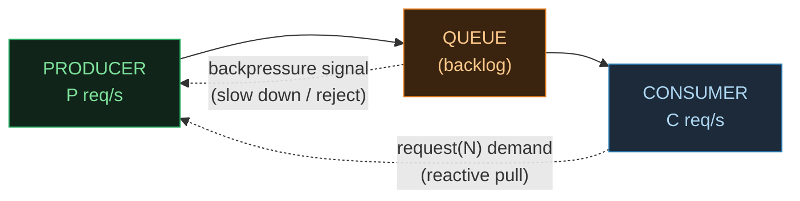
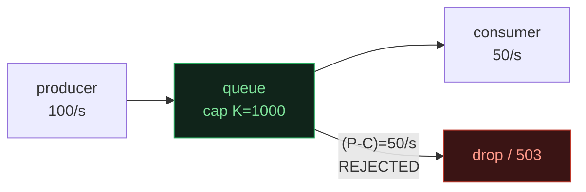
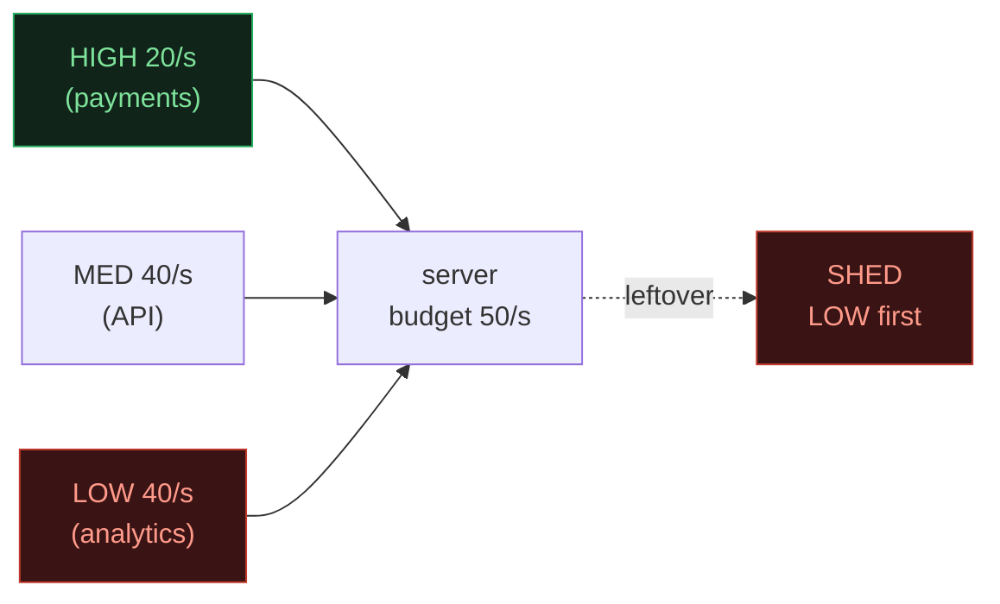

# Backpressure & Flow Control — When the Consumer Can't Keep Up

> A concept bundle for distributed systems. Every number below is printed by
> **`backpressure.py`** (pure Python stdlib, run with `python3 backpressure.py`)
> and recomputed live in **`backpressure.html`**. This guide never hand-computes
> anything — it cites the `.py` output verbatim.
>
> 🔗 Interactive companion: `backpressure.html` &nbsp;|&nbsp; Source of truth: `backpressure.py`

---

## 0. The one-paragraph version

A **producer** emits work into a **queue**, which a **consumer** drains. When the
producer is faster than the consumer (`P > C`), the queue's backlog grows at the
net rate `(P − C)` **forever** — that is backpressure's absence, and it kills
systems: the heap balloons until **OOM**, the **GC thrashes** on a huge live
set, thread pools block, caller **timeouts fire**, and the failure **cascades**
upstream to services that were never even slow. **Backpressure** is any mechanism
that pushes the "I am full / slow" signal *upstream* so the producer cannot
outrun the consumer. This bundle builds one tiny model of each family: the
**unbounded** queue (the disease) versus four cures — the **bounded queue**
(reject at a cap `K`), **reactive streams** (consumer *pulls* `N` items at a
time), the **token bucket** (rate-limit at `r/s` with burst `R`), and
**load shedding** (drop the *unimportant* work first). The headline invariant,
proved in the gold check: with backpressure the queue stays **bounded** while
*without* it the backlog grows **linearly** — for the **same** useful goodput
(the consumer is the bottleneck either way). With `P=100`, `C=50`: the unbounded
queue reaches **180,000 items after 1 hour**; a bounded queue (`K=1000`) never
exceeds **1,000** — a **180×** memory difference at identical throughput.

> From `backpressure.py` GOLD CHECK (the headline numbers):
> ```text
>   metric                     unbounded    bounded (K=1000)
>   --------------------------------------------------------
>   max queue depth              180,000               1,000
>   depth at 1 hour              180,000               1,000
>   processed (goodput)          180,000             180,000
>   rejected                           0             179,000
>   depth ratio                     180x
>
>   GOLD scalars (pinned for backpressure.html):
>     unbounded_depth_1h    = 180000
>     unbounded_rejected    = 0
>     bounded_depth_1h      = 1000
>     bounded_rejected_1h   = 179000
>     goodput_both          = 180000   (C * 1h, IDENTICAL)
>     depth_ratio           = 180x
>     time_to_fill          = 20 s   (K / (P - C))
> ```

---

## 1. The funnel intuition

Picture a fast tap (the producer) pouring into a bucket with a small hole (the
consumer). If the tap runs faster than the hole drains, the water level rises
without bound and the bucket overflows. Backpressure is putting a *wall* in the
bucket (and telling the tap to slow, or spilling the surplus) so the level can
never exceed the wall.



- **The queue depth is *the* number to watch.** `depth(t) = (P − C) · t` when
  `P > C`. Unbounded ⇒ it grows linearly forever.
- **Backpressure = bound the depth**, by one of four means: cap-and-reject
  (bounded queue), pull-based demand (reactive streams), rate admission (token
  bucket), or priority-aware dropping (load shedding).
- **Little's Law** (`L = λ·W`) is the unifying identity: in-flight `L` equals
  throughput `λ` times latency `W`. Every backpressure mechanism **caps `L`**,
  which is what keeps memory bounded.

---

## 2. Section A — the unbounded queue: `depth(t) = (P − C) · t` (linear → OOM)

Producer `P = 100` req/s, consumer `C = 50` req/s. The consumer is the
bottleneck, so with **no** backpressure the queue is bottomless and grows at the
net rate `(P − C) = 50/s`. Its depth is the closed form `depth(t) = (P − C)·t`.

> From `backpressure.py` Section A:
> ```text
> | elapsed     | queue depth | memory @ 1 KB/item |
> |-------------|--------------|---------------------|
> | 1 s         | 50           | 0.0        MiB     |
> | 10 s        | 500          | 0.5        MiB     |
> | 1 min       | 3,000        | 2.9        MiB     |
> | 10 min      | 30,000       | 29.3       MiB     |
> | 1 hour      | 180,000      | 175.8      MiB     |
>
> GOLD: unbounded growth rate = (P - C) = 50 items/s; depth at 1 h = 180,000.
> [check] depth(3600) = (P - C) * 3600 = 50 * 3600 = 180,000:  OK
> ```

**After 1 hour the backlog is 180,000 items ≈ 176 MiB of heap** — and it never
stops. Long before that you hit OOM, the GC thrashes on the 100k+ object live
set, thread pools block on the queue's lock, and the caller's timeouts fire:
a **cascading failure**. Little's Law makes the inevitability precise — here
latency `W` grows without bound (requests age in the queue forever), so in-flight
`L = λ·W` grows without bound. No finite RAM survives an unbounded queue.

🔗 In `backpressure.html` Panel ①, set the mode to **unbounded** and press
*▶ run* — watch the queue bar fill and turn red as it runs away.

---

## 3. Section B — the bounded queue: cap `K`, reject surplus, goodput = `C`

Give the queue a hard cap `K = 1000`. The fluid model grows the backlog at
`(P − C)` until it hits the wall, then the surplus is **rejected**
(HTTP 503 / drop / circuit-break):

> From `backpressure.py` Section B:
> ```text
>     depth(t)   = min(K, (P - C) * t)        saturates at K
>     goodput    = C                          (consumer-bound, always)
>     reject rate= P - C    once saturated
>
> Time to fill (fluid model):
>     t_fill = K / (P - C) = 1000 / 50 = 20 s
>
> Timeline (fluid model, 1 s steps):
> | t (s) | queue depth | admitted/s | rejected/s | cumulative rejected |
> |-------|-------------|------------|------------|---------------------|
> | 1     | 50          | 100        | 0          | 0                   |
> | 5     | 250         | 100        | 0          | 0                   |
> | 10    | 500         | 100        | 0          | 0                   |
> | 15    | 750         | 100        | 0          | 0                   |
> | 20    | 1,000       | 100        | 0          | 0                   | <- wall saturated
> | 21    | 1,000       | 50         | 50         | 50                  | <- first rejection
> | 30    | 1,000       | 50         | 50         | 500                 |
> | 45    | 1,000       | 50         | 50         | 1,250               |
> | 60    | 1,000       | 50         | 50         | 2,000               |
>
> GOLD: steady depth <= K = 1000; goodput = C = 50/s; reject rate = (P-C)/P = 50%.
> [check] depth(60)==1000, processed(60)==C*60==3000, rejected(60)==2000:  OK
> ```

**Time to fill `t_fill = K / (P − C) = 20 s`.** After that the queue **stays**
at `K = 1000` forever — bounded. Goodput collapses to exactly `C = 50/s`, which
is *all the consumer could ever do anyway*. The rejected `50/s` were going to
die of timeout regardless; rejecting them **early** at the boundary *fails fast*
and frees the caller to retry elsewhere instead of waiting an age for a slot
that will never come. This is the whole bargain backpressure offers: **trade
rejections for bounded memory and fast failure**.



---

## 4. Section C — reactive streams: `request(N)`, in-flight ≤ `N` (natural BP)

Instead of the producer **pushing** (and hoping the queue holds), let the
consumer **pull**. The consumer maintains **demand** (credits): it requests `N`
items, the producer may emit **at most `N`**, then it must wait for the next
request. The producer can *never* outrun the consumer — it is physically gated
by outstanding demand. This is the Reactive Streams / Project Reactor / RxJava /
Java 9 `Flow.*` contract. Here `N = 10`.

> From `backpressure.py` Section C:
> ```text
> Two pull cycles (phase, demand, in_flight):
> | phase                      | demand | in_flight |
> |----------------------------|--------|-----------|
> | consumer requests N        | 10     | 0         |
> | producer emits 10          | 0      | 10        |
> | consumer processes batch   | 0      | 0         |
> | consumer requests N        | 10     | 0         |
> | producer emits 10          | 0      | 10        |
> | consumer processes batch   | 0      | 0         |
>
>     MAX in-flight items = demand cap N = 10.
>
> GOLD: max in-flight == demand cap N == 10; producer gated by demand.
> [check] max_in_flight (10) == N (10):  OK
> ```

Each cycle: demand goes `10 → 0`, in-flight goes `0 → 10 → 0`. The producer
emitted **exactly** what the consumer asked for. Throughput equals the
consumer's processing rate (it requests another `N` as soon as it finishes a
batch), so it **self-clocks** at the speed it can digest. There is no unbounded
buffer to overflow — backpressure is a *property of the protocol*, not a band-aid.

**The `N` dial (Little's Law again).** `L = λ·W`; the demand cap `N` bounds `L`,
so the consumer trades throughput (`λ`) against latency (`W`) by tuning `N`:
bigger `N` ⇒ more pipeline parallelism (higher throughput, more memory); smaller
`N` ⇒ tighter bound (lower memory, maybe lower throughput).

---

## 5. Section D — the token bucket: burst cap `R`, sustained rate `r`

A token bucket holds up to `R` tokens, refilled at `r` tokens/s. Each request
**consumes** 1 token; if the bucket is empty the request is **rejected**. Two
dials: capacity `R = 20` (burst size) and refill `r = 50/s` (long-term average
allowed rate).

> From `backpressure.py` Section D:
> ```text
> BURST behaviour -- a sudden spike hitting a FULL bucket (tokens = R):
> | requests in burst | tokens before | admitted | tokens after | rejected |
> |-------------------|---------------|----------|--------------|----------|
> | 5                 | 20            | 5        | 15           | 0        |
> | 10                | 20            | 10       | 10           | 0        |
> | 15                | 20            | 15       | 5            | 0        |
> | 20                | 20            | 20       | 0            | 0        |
> | 25                | 20            | 20       | 0            | 5        |
> | 50                | 20            | 20       | 0            | 30        |
>
> SUSTAINED behaviour -- a steady stream at P = 100/s hitting a bucket
> refilling at r = 50/s. The bucket cannot sustain more than r/s, so:
>     sustained throughput = min(P, r) = min(100, 50) = 50/s
>     sustained reject rate = (P - r)/P = (100 - 50)/100 = 50%
>
> GOLD: burst cap = R = 20; sustained throughput = min(P, r) = 50/s;
> reject rate = (P - r)/P = 50%.
> ```

At most `R = 20` requests pass from a single burst; the rest are rejected
instantly — the **burst cap**: it absorbs short spikes without dropping, but
caps the spike height. Under a *sustained* stream the bucket cannot sustain more
than `r/s`, so `sustained throughput = min(P, r) = 50/s` and the surplus is
rejected. Note this is the **same steady goodput** as the bounded queue (`C`):
both are consumer/budget-bound. The difference is *shape* — the token bucket
smooths on **rate** (and allows a burst), the bounded queue smooths on
**buffer depth**.

| mechanism | what it bounds | burst? |
|---|---|---|
| bounded queue | buffer depth `K = 1000` | buffers first |
| token bucket | RATE `r = 50/s`, burst `20` | burst 20 then 50/s |
| reactive | in-flight `N = 10` | pull-gated |
| leaky bucket | OUTPUT rate `r/s` exactly | **NO** burst |

The **leaky bucket** is the strict cousin: a queue that drips *out* at exactly
`r/s`, smoothing all bursts into a flat rate (no burst allowed). APIs (Stripe,
GitHub) usually pick the **token** bucket so honest clients are not punished for
a quick spike.

---

## 6. Section E — load shedding: drop LOW priority, protect HIGH

When the system **must** drop work, drop the *unimportant* work. Tag each
request with a priority; under overload, serve **HIGH** first and **shed** the
LOW surplus. The service budget is the consumer rate (`50/s`); arrivals total
`100/s` (overloaded).

> From `backpressure.py` Section E:
> ```text
> | class               | arrivals/s | served/s | shed/s | loss rate |
> |---------------------|------------|----------|--------|-----------|
> | HIGH (payments)     | 20         | 20       | 0      | 0.0%      |
> | MEDIUM (API)        | 40         | 30       | 10     | 25.0%     |
> | LOW (analytics)     | 40         | 0        | 40     | 100.0%    |
> | TOTAL               | 100        | 50       | 50     | 50.0%     |
>
> GOLD: HIGH served = 20 (loss 0%); MEDIUM loss 25%; LOW served = 0 (loss 100%); total served = 50 = consumer.
> [check] HIGH loss == 0, MEDIUM loss > 0, LOW loss == 100%, total served == 50:  OK
> ```

**Without** priority (FIFO / random drop under overload) every class loses the
same fraction (~50%) — so the **payments** class would also be shed, exactly
when it matters most. **With** priority load shedding the loss is **graduated**:
HIGH (payments) loses nothing, MEDIUM (API) loses a slice, and only LOW
(analytics) is fully shed. Same total goodput (consumer-bound at `50/s`),
radically smaller **blast radius** — the critical path stays green while the
cheap work degrades. This is the **bulkhead + graceful-degradation** pattern
(Netflix Hystrix / Resilience4j): isolate failures at boundaries and shed the
non-essential load to keep the essential load alive.



---

## 7. Gold check — bounded vs unbounded over 1 hour (pinned for the `.html`)

The `.html` recomputes the **closed-form fluid model** in JavaScript —
`depth(t) = (P − C)·t` unbounded vs `min(K, (P − C)·t)` bounded — over a full
hour, on the *identical* parameters (`P=100, C=50, K=1000`) as
`backpressure.py`. A green `check: OK` badge means the JS recompute matches the
`.py` exactly. The gold invariant: **backpressure keeps the queue bounded while
the unbounded queue grows linearly — for the same goodput.**

> From `backpressure.py` GOLD CHECK:
> ```text
>   metric                     unbounded    bounded (K=1000)
>   --------------------------------------------------------
>   max queue depth              180,000               1,000
>   depth at 1 hour              180,000               1,000
>   processed (goodput)          180,000             180,000
>   rejected                           0             179,000
>   depth ratio                     180x
>
> READ THIS TABLE: the two columns process the SAME number of requests
> (goodput = C * 1h = 180,000 in BOTH) because the consumer is the bottleneck
> either way. The ONLY difference is memory and honesty:
>   - unbounded hoards 180,000 items in RAM (OOM, GC thrash, then cascading
>     timeouts) and tells callers NOTHING.
>   - bounded caps RAM at <= 1000 items and FAILS FAST on the 179,000 it cannot
>     serve, so callers retry elsewhere instead of waiting.
>
> [check] bounded depth <= 1000 while unbounded -> 180,000; goodput identical; ratio 180x:  OK
> ```

**Read the table.** Both regimes process the **same** number of requests
(goodput `= C · 1h = 180,000` in both) because the consumer is the bottleneck
either way. The *only* difference is **memory and honesty**: unbounded hoards
180,000 items in RAM (then OOM, GC thrash, cascading timeouts) and tells callers
nothing; bounded caps RAM at ≤ 1,000 items and **fails fast** on the 179,000 it
cannot serve, so callers retry elsewhere instead of waiting. **That is the whole
deal backpressure makes: trade rejections for bounded memory and fast failure —
same useful goodput, survivable overload.**

### The backpressure mechanisms (and where they show up here)

| Mechanism | What it bounds | Steady goodput | Where this bundle shows it |
|---|---|---|---|
| **Unbounded queue** (none) | nothing — `depth → ∞` | `C` (but queues 180k) | Section A (the disease) |
| **Bounded queue** | buffer depth `K = 1000` | `C = 50/s` | Section B |
| **Reactive streams** | in-flight `N = 10` | `C` (self-clocked) | Section C |
| **Token bucket** | rate `r = 50/s`, burst `R = 20` | `min(P, r) = 50/s` | Section D |
| **Load shedding** | per-class budget; drops LOW | `C = 50/s` | Section E |

Every "cure" achieves the **same steady goodput** (`C`, the consumer rate) —
backpressure does not reduce useful throughput; it bounds memory and fails fast.
They differ in *what* they bound (depth vs in-flight vs rate) and *how* they
shed surplus (reject / pull-gate / rate-limit / priority-drop).

---

## 8. References

- **Little (1961)** — "A Proof for the Queuing Formula `L = λW`",
  *Operations Research* 9(3):383–387. The queueing identity underpinning every
  depth bound here.
- **Reactive Manifesto (2014) / Reactive Streams spec (2015, v1.0)** — the
  `request(N)` demand-pull contract (Java 9 `Flow.*`, Project Reactor, RxJava).
  Section C.
- **Turner (1986)** — "New Directions in Communications", IEEE TCOM. Token
  bucket / leaky bucket for traffic shaping. Section D.
- **Bennett (Netflix, 2012) — Hystrix** → the **bulkhead** pattern: isolate
  failures, shed load at boundaries. Now Resilience4j. Section E.
- **Beyer et al (2016)** — *Site Reliability Engineering* (Google), esp. the
  "Cascading Failures" and "Handling Overload" chapters. Load shedding as SRE
  practice; the cascading-failure failure mode of Section A.
- **Kleppmann (2017)** — *Designing Data-Intensive Applications*, Ch.1
  (reliability) & Ch.11 (stream processing, backpressure).
- **Tanenbaum & Van Steen** — *Distributed Systems*, Ch.3 (sync vs async) &
  Ch.4 (coordination / load).

🔗 Back to `backpressure.html` for the animated producer/consumer pipeline, the
unbounded-vs-bounded-vs-reactive toggle, the live token bucket, and the
graduated load-shedding view.
