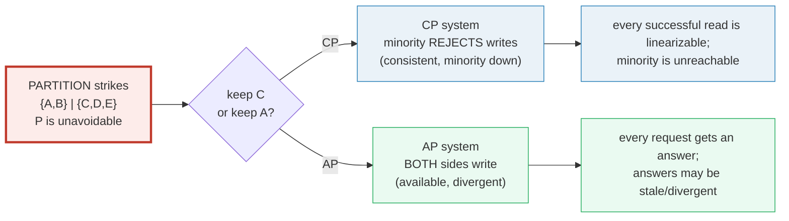
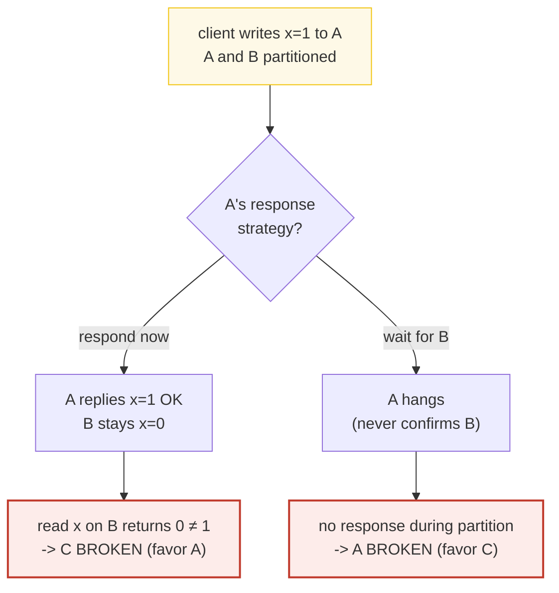
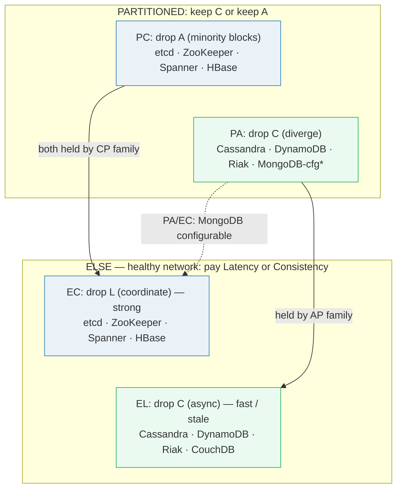
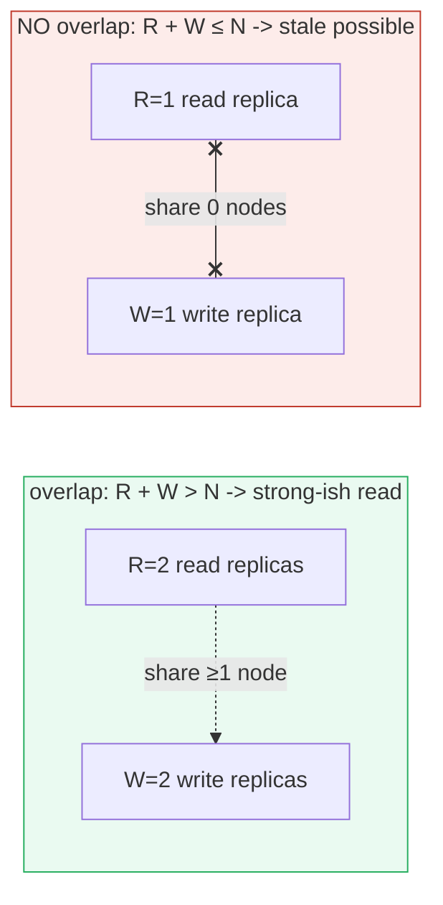
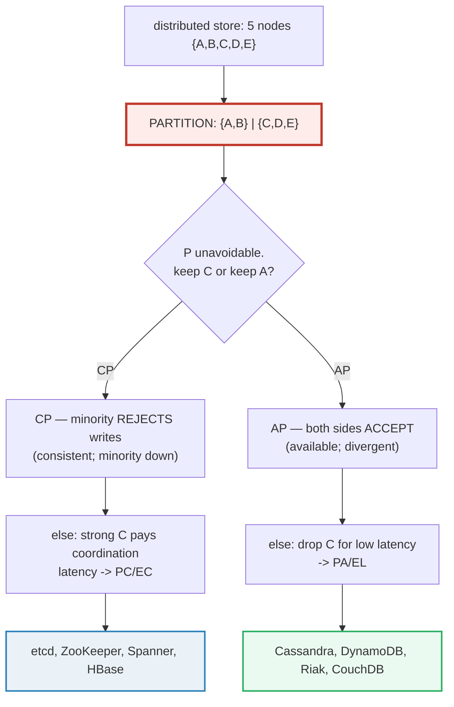

# CAP & PACELC — The Consistency / Availability / Latency Trade-off

> **Companion code:** [`cap_tradeoffs.py`](./cap_tradeoffs.py). **Every number in
> this guide is printed by `python3 cap_tradeoffs.py`** — change the code, re-run,
> re-paste. Nothing here is hand-computed.
>
> **Live animation:** [`cap_tradeoffs.html`](./cap_tradeoffs.html) — open in a
> browser. Click the CAP triangle to see CP vs AP, cut the partition and fire
> requests to watch CP error vs AP serve stale data, and explore the PACELC grid.
>
> **Source material:** CAP (Brewer 2000 / Gilbert & Lynch 2002), PACELC (Abadi
> 2010), Spanner (Pang et al. 2012), Dynamo (DeCandia et al. 2007), Raft
> (Ongaro & Ousterhout 2014).
>
> 🔗 **Companion bundle:** [`network_partitions.py`](./network_partitions.py)
> covers the partition itself + split-brain + conflict resolution (LWW / vector
> clocks / CRDT) + healing. This guide focuses on the **CAP formalization**, the
> live **CP-vs-AP request behavior**, the **PACELC latency axis**, and the
> **real-world system classification**.

---

## 0. TL;DR — the wall and the two kinds of pain

A distributed store copies data across N machines. One day a **network wall** (a
partition) drops between them. You now have a brutal choice, and you cannot dodge
it:

- If you want **ONE right answer everywhere** (Consistency), the small side of
  the wall must **refuse** work — it can't change the data without asking the
  other side, and it can't ask. Clients hitting the small side get an **ERROR**.
  This is **CP**.
- If you want to **keep serving everyone** (Availability), both sides accept work,
  and the two copies now **disagree**. Clients may read **stale** data until the
  wall comes down and the copies are merged. This is **AP**.

There is no third option. **CAP** says: when a partition happens, drop **C** or
drop **A**. The **PACELC** refinement (Abadi 2010) adds: even when there is **no**
partition, you still pay a price — low **L**atency or strong **C**onsistency. So
the full design space is a quadrant.



> **One-line definition:** **CAP** — during a partition you must choose
> **Consistency** (CP: block writes in the minority) or **Availability** (AP:
> accept writes everywhere, then reconcile). **PACELC** adds: when there is *no*
> partition, you still choose **Latency** or **Consistency** on every request.
> Real systems land in a quadrant like **PA/EL** (Cassandra) or **PC/EC** (etcd).

### Glossary (every term used below)

| Term | Plain meaning |
|---|---|
| **linearizability** | the formal meaning of "C" — the cluster looks like ONE machine reacting in a single order; every read returns the latest completed write (or newer) |
| **availability (A)** | every request to a non-failing node eventually gets a NON-ERROR response — no infinite wait, no "try again later" |
| **partition (P)** | the network drops/delays messages between two node groups; treated as **unavoidable** in real networks |
| **quorum** | `floor(N/2)+1`. Here `5 -> 3`. The smallest majority a CP leader needs to safely commit |
| **CP** | Consistent + Partition-tolerant. Minority **rejects** writes so data stays correct |
| **AP** | Available + Partition-tolerant. Every side accepts writes; replicas diverge and reconcile later |
| **PACELC** | `P -> (A or C)`, `E -> (L or C)`. The "else" half adds the latency-vs-consistency trade-off you pay every day |
| **tunable consistency** | AP systems let the client pick per-request how many replicas must ack (R/W). Higher R+W -> stronger, slower |
| **TrueTime** | Google's bounded-clock-uncertainty API; lets Spanner achieve external consistency at the cost of waiting out the uncertainty |

---

## 1. CAP formalization — Section A output

**CAP** (Brewer 2000, conjecture; Gilbert & Lynch 2002, formal proof). The three
properties, stated precisely:

- **C = Consistency = linearizability.** The cluster behaves as if there is ONE
  copy of the data; every read returns the value of the latest completed write
  (or a newer one). There is a single total order of operations.
- **A = Availability** = every request to a non-failing node eventually gets a
  NON-ERROR response. No infinite wait, no "try the other node". (Gilbert-Lynch:
  "total availability" = every request, every node.)
- **P = Partition** = the system keeps operating despite the network
  losing/delaying messages between two node groups.

In real networks **P is unavoidable** (links fail), so the theorem reduces to:
**during a partition you must give up C or give up A.**

### The impossibility — the 2-node argument (Gilbert & Lynch 2002)

> From `cap_tradeoffs.py` **Section A**:
>
> ```
> 2 nodes, A and B, each holding a replica of key x (initial x=0).
> Network partitions: A and B cannot exchange messages.
>
> Client writes x=1 to node A. For the system to be both Available
> AND Consistent, node A must (1) respond and (2) ensure B reflects
> the write. But A cannot reach B during the partition:
>
>   path 1: A responds immediately (keeps A)            -> B still
>           reads x=0; a later read of x on B returns 0 != 1  -> C BROKEN
>   path 2: A waits to confirm B before responding (keeps C) -> A can
>           never respond during the partition               -> A BROKEN
> Every possible response breaks a property. QED: C+A+P impossible.
> ```
>
> Concrete trace (initial `x=0` on both; partition A↔B; client writes `x=1` to A):
>
> | response strategy | A's reply | B's value | linearizable? | available? |
> |---|---|---|---|---|
> | respond now (favor A) | `x=1` OK | `x=0` | **NO** (B stale) | yes |
> | wait for B (favor C) | `<hangs>` | `x=0` | yes | **NO** |
>
> ```
> [check] both strategies break a property -> C+A+P is impossible: OK
> ```



> Every response breaks a property. So the design space collapses to **two**
> axes the system can hold onto when a partition strikes:
> - **CP**: keep C, drop A on the minority (reject writes). → [§2](#2-cp-in-action--section-b-output)
> - **AP**: keep A, drop C across sides (accept, diverge). → [§3](#3-ap-in-action--section-c-output)
> - (CA-only systems exist only if you **pretend** P can't happen — e.g. a
>   single-node DB. The moment you have >1 node, P is real.)

---

## 2. CP in action — Section B output

The cluster is **5 nodes**. Partition: `{A,B} | {C,D,E}`. `quorum = floor(5/2)+1 = 3`.
CP leader on the majority side is **C**. Shared key `'balance'`, initial value
`50`.

Two clients each issue a WRITE during the partition — one on each side:
```
client -> minority  {A,B} : write balance = 100
client -> majority  {C,D,E} : write balance = 200
```

> From `cap_tradeoffs.py` **Section B** — CP request log (status as seen by the
> client):
>
> | # | client side | op | CP response |
> |---|---|---|---|
> | 1 | minority {A,B} | write | **ERROR** - no quorum: unavailable during partition |
> | 2 | majority {C,D,E} | write | **OK** - committed balance=200 (3/5 acks >= quorum 3) |
> | 3 | minority {A,B} | read | **ERROR** - no quorum: unavailable during partition |
> | 4 | majority {C,D,E} | read | **OK** - 200 |
>
> ```
> [check] CP keeps C: every successful read sees balance=200 (linearizable).
> [check] CP drops A: both minority requests error'd -> unavailable: OK
> ```



```mermaid
graph LR
    subgraph min["minority {A,B} — size 2 < quorum 3"]
        direction TB
        Wmin["write 100"] --> Err["<b>ERROR</b><br/>no leader, cannot commit"]
        Rmin["read"] --> Err2["<b>ERROR</b>"]
    end
    subgraph maj["majority {C,D,E} — size 3 >= quorum"]
        direction TB
        Wmaj["write 200"] --> Ok["leader C -> D, E<br/>3 acks >= 3 -> COMMIT"]
        Rmaj["read"] --> Ok2["200 (committed)"]
    end
    min x--x|"no traffic<br/>crosses cut"| maj
    style Err fill:#fdecea,stroke:#c0392b,stroke-width:2px
    style Err2 fill:#fdecea,stroke:#c0392b,stroke-width:2px
    style Ok fill:#eaf2f8,stroke:#2980b9
    style Ok2 fill:#eaf2f8,stroke:#2980b9
    style min fill:#1a1212,stroke:#c0392b
    style maj fill:#0d1a12,stroke:#27ae60
```

> **What happened:** the minority `{A,B}` has only 2 nodes, `< quorum 3`, so no
> leader can be elected and writes/reads to `{A,B}` return **ERROR**. CP
> **sacrifices availability** on the minority to keep the data correct. The
> majority `{C,D,E}` replicates the write to D, E (3 acks ≥ 3) and **commits**
> `balance=200`; reads on the majority return `200`, the last committed value.

---

## 3. AP in action — Section C output

Same cluster and partition. But now **every side accepts locally, with no quorum
gate** — the AP "available but divergent" behavior.

> From `cap_tradeoffs.py` **Section C** — AP request log:
>
> | # | client side | op | AP response |
> |---|---|---|---|
> | 1 | minority {A,B} | write | **OK** - accepted locally balance=100 on A,B |
> | 2 | majority {C,D,E} | write | **OK** - accepted locally balance=200 on C,D,E |
> | 3 | minority {A,B} | read | **OK** - reads local balance=100 |
> | 4 | majority {C,D,E} | read | **OK** - reads local balance=200 |
>
> **DIVERGENCE during partition:**
> ```
> {A,B} hold  balance = 100
> {C,D,E} hold balance = 200
> A read on the minority returns 100; a read on the majority returns 200.
> Neither is an error - AP SACRIFICES consistency, keeping availability.
> [check] the two sides DISAGREE (100 != 200) -> C is dropped: OK
> ```



```mermaid
graph LR
    subgraph min["minority {A,B}"]
        Wmin["write 100"] --> Ok1["OK<br/>AB = 100"]
    end
    subgraph maj["majority {C,D,E}"]
        Wmaj["write 200"] --> Ok2["OK<br/>CDE = 200"]
    end
    Ok1 x--x|"DIVERGES<br/>until heal"| Ok2
    style Ok1 fill:#eafaf1,stroke:#27ae60
    style Ok2 fill:#eafaf1,stroke:#27ae60
    style min fill:#0d1a12,stroke:#27ae60
    style maj fill:#0d1a12,stroke:#27ae60
```

### Healing — the partition ends

> From `cap_tradeoffs.py` **Section C** — healing strategies:
>
> **Strategy 1: Last-Write-Wins (LWW).**
> ```
> w1: balance=100 ts=10  (minority side)
> w2: balance=200 ts=12  (majority side)
> later ts wins -> balance = 200  (the w2 write)
> the other write (100) is SILENTLY DROPPED. Clock skew -> data loss.
> ```
>
> **Strategy 2: CRDT merge** (if the value were a G-Counter, not a register):
> ```
> P1 {A:1, B:1, C:0, D:0, E:0}  -> value = 2
> P2 {A:0, B:0, C:1, D:1, E:1}  -> value = 3
> merge {A:1, B:1, C:1, D:1, E:1}  -> value = 5
> No conflict. Every increment survives. Merge is commutative + idempotent.
> ```
>
> ```
> [check] AP keeps A: both writes ACCEPTED (no errors).
> [check] AP heals: LWW -> 200; CRDT merge -> 5: OK
> ```

> 🔗 For the full conflict-resolution deep-dive (LWW vs vector clocks vs CRDT,
> plus Merkle-tree anti-entropy and read repair) see
> [`network_partitions.py`](./network_partitions.py) §4–§5.

---

## 4. PACELC — the latency axis you pay even WITHOUT a partition

**PACELC** (Abadi 2010): CAP only describes the **partition** case. But even with
a healthy network you face a second trade-off every single request:

```
if Partition : choose  A or C        <- this is CAP
if Else      : choose  L or C        <- this is the PACELC addition
                   ^ latency vs consistency on every healthy request
```

**Why the else-half exists:** strong consistency forces replicas to **coordinate**
(quorum round-trips, 2PC, Paxos). Coordination takes round-trip time, so strong C
costs latency. Skip the coordination (accept stale reads, async replication) and
you get low L but weaker C. There is no free lunch.

### The four quadrants

> From `cap_tradeoffs.py` **Section D** — the four quadrants
> (partition-choice × else-choice):
>
> | quadrant | partitioned (P) | else (E) | means |
> |---|---|---|---|
> | **PC / EC** | C (drop A) | C (drop L) | always strong. High latency, blocks on partition |
> | **PA / EL** | A (drop C) | L (drop C) | always fast/eventual. Never blocks |
> | **PA / EC** | A (drop C) | C (drop L) | fast under partition, strong when healthy |
> | **PC / EL** | C (drop A) | L (drop C) | rare/contradictory; mostly theoretical |

### Real systems land in a quadrant

> From `cap_tradeoffs.py` **Section D** — verified against each system's docs:
>
> | system | PACELC | partitioned behavior | else (healthy) behavior |
> |---|---|---|---|
> | Cassandra | **PA/EL** | all sides accept, diverge | async replication, fast stale reads |
> | DynamoDB | **PA/EL** | available, eventual consistency | async, tunable per request |
> | Riak | **PA/EL** | available, CRDT/vector-clock merge | async, eventual |
> | etcd | **PC/EC** | minority rejects, majority Raft | Raft quorum, linearizable reads |
> | ZooKeeper | **PC/EC** | minority rejects, ZAB majority | ZAB quorum, linearizable reads |
> | Spanner | **PC/EC** | Paxos groups reject without maj. | TrueTime + 2PC, external consist. |
> | MongoDB | **PA/EC\*** | (old default) available | configurable: strong when requested |
> | HBase | **PC/EC** | unavailable without HMaster maj. | strong via HDFS + single Region Srv |
>
> \* MongoDB is configurable; the historical default was PA/EC, modern modes span
> the space.
>
> ```
> Counts in this table: PA=3 PC=3 (partition axis); EL=3 EC=3 (else axis).
> [check] the AP family is uniformly PA/EL; the CP family is uniformly PC/EC: OK
> ```



> The AP family is uniformly **PA/EL** (lower-left: fast and stale); the CP family
> is uniformly **PC/EC** (upper-right: strong but pays coordination latency).

---

## 5. Real-world systems — Section E output (classification + tunable dial)

### Concrete classification

> From `cap_tradeoffs.py` **Section E**:
>
> | system | class | consistency mechanism | availability mechanism |
> |---|---|---|---|
> | **Spanner** | CP/EC | TrueTime bounds clock skew + Paxos per shard → external C | sacrifices A on minority; Paxos groups need majority to commit |
> | **etcd** | CP/EC | Raft quorum (strong leader) | minority rejects; leader serves |
> | **ZooKeeper** | CP/EC | ZAB quorum (atomic broadcast) | minority rejects; leader serves |
> | **HBase** | CP/EC | single RegionServer per region | region unavailable if its RS down |
> | **Cassandra** | AP/EL | tunable (R/W quorum), anti-entropy | always writeable; hinted handoff |
> | **DynamoDB** | AP/EL | tunable (eventual/strong per req) | always writeable; sync replicas |
> | **Riak** | AP/EL | vector clocks / CRDTs, eventual | always writeable; gossip |
> | **CouchDB** | AP/EL | multi-master, MVCC, eventual | always writeable; conflict docs |

### The tunable-consistency dial (AP systems)

AP systems let the client pick **R** (read acks) and **W** (write acks) per
request against **N** replicas. A **strong-ish read** happens when the read and
write quorums **overlap**: `R + W > N`.

> From `cap_tradeoffs.py` **Section E** — tunable dial, `N=3` replicas
> (Cassandra/DynamoDB model):
>
> | config | R | W | R+W | overlap? | consistency read sees? | latency |
> |---|---|---|---|---|---|---|
> | quorum | 2 | 2 | 4 | yes | last write (strong-ish) | higher (2+ RTT) |
> | write-all | 3 | 1 | 4 | yes | last write (strong-ish) | higher (2+ RTT) |
> | one/one | 1 | 1 | 2 | no | possibly stale | lowest (1 RTT) |
> | read-all | 1 | 3 | 4 | yes | last write (strong-ish) | higher (2+ RTT) |
>
> ```
> [check] overlap (strong read) iff R+W>N; default Cassandra W=R=2,N=3 is strong-ish: OK
> ```



> **CP systems have NO such dial:** a read always reflects the committed Raft/ZAB
> log, at the cost of round-trips to the leader + quorum. You cannot ask etcd for
> "a faster, maybe-stale read" without using its (explicit, opt-in)
> `serializable=false` flag — and even that is still served by the leader.
> **TrueTime** in Spanner goes further: it **bounds** clock uncertainty (with
> GPS+atomic clocks) so 2PC commit can **wait out** the uncertainty and guarantee
> **external consistency** (linearizable across datacenters) — a CP guarantee,
> paid in latency.

---

## 6. GOLD CHECK — CP errors on minority, AP returns data

> From `cap_tradeoffs.py` **GOLD CHECK** — partition `{A,B} | {C,D,E}`, key
> `'balance'`:
>
> ```
> CP minority write -> status=ERROR
>     payload: no quorum: unavailable during partition
> AP minority read  -> status=OK
>     payload: balance=100 (the minority's local value; possibly stale)
> ```
>
> | system | request to MINORITY during partition | result |
> |---|---|---|
> | **CP** | write balance=100 | **ERROR (unavailable)** |
> | **AP** | read balance | **OK, returns 100 (possibly stale)** |
>
> ```
> CP errors on the minority (C kept, A dropped)?  -> YES
> AP returns data on the minority (A kept, C dropped)? -> YES
>
> [check] GOLD: OK
> ```

| | **CP system** | **AP system** |
|---|---|---|
| **During partition** | minority → **ERROR** (no quorum) | minority → **OK** (local write) |
| **Property kept** | C (linearizable) | A (always available) |
| **Property dropped** | A on the minority | C across the sides |
| **Read sees** | the last committed value (200) | the local value, possibly stale (100) |
| **Real systems** | etcd, ZooKeeper, Spanner, HBase | Cassandra, DynamoDB, Riak, CouchDB |

The [`cap_tradeoffs.html`](./cap_tradeoffs.html) recomputes the CP minority-error
and AP minority-data **live in JS** on the same deterministic inputs, and shows a
gold `check: OK` badge when they match the `.py`.

---

## 7. Pitfalls & debugging checklist

| # | Mistake | Symptom | Fix |
|---|---|---|---|
| 1 | **Pretending P can't happen** ("the network is reliable") | silent data corruption on split-brain | Design for partitions from day one — the network *will* fail |
| 2 | **Misreading "C" as transactional/serializable** | surprised when a "CP" claim doesn't give you serializable transactions | CAP's C is **linearizability on a single register**, *not* multi-key transactions |
| 3 | **Treating a partition as binary** (it's healthy or it's dead) | flapping leader elections, slow quorum failures | Treat P as a **spectrum** of packet loss/delay, not a clean cut |
| 4 | **Forgetting the PACELC else-half** | surprised by latency on a *healthy* strongly-consistent cluster | Strong C forces coordination round-trips even with no partition (budget for it) |
| 5 | **Calling Cassandra "inconsistent" unconditionally** | wrong tuning for your read needs | AP is **tunable**: set `R+W > N` per request for strong-ish reads |
| 6 | **Picking AP and forgetting reconciliation** | divergence lingers forever after heal | Always ship anti-entropy (Merkle/gossip) + read repair; pick LWW/CRDT up front |
| 7 | **Picking CP and ignoring the minority** | the minority hangs clients until timeout | Make the minority **fail fast** (return error) so clients retry the majority |
| 8 | **Conflating CAP-C with ACID-C** | over-claiming guarantees | ACID-C is per-transaction isolation; CAP-C is per-object linearizability — different things |

---

## 8. Cheat sheet



- **CAP (Brewer 2000 / Gilbert & Lynch 2002):** during a partition you cannot
  keep both C and A — pick one. P is unavoidable in real networks.
- **C = linearizability** (single total order; reads see latest write or newer),
  **NOT** ACID/serializable transactions.
- **Impossibility (2-node):** if A replies without B, B is stale → C broken; if
  A waits for B, A can't reply → A broken. Every strategy breaks one property.
- **CP:** minority (`< quorum = floor(N/2)+1`) **rejects** writes → consistent,
  minority unavailable. Majority commits via leader + quorum acks.
- **AP:** every side **accepts** writes → available, sides **diverge**; reconcile
  on heal (LWW, vector clocks, or CRDTs).
- **PACELC (Abadi 2010):** `P -> (A or C)`, `E -> (L or C)`. Even healthy, strong
  C costs coordination latency.
- **Quadrants:** **PA/EL** (Cassandra, DynamoDB, Riak), **PC/EC** (etcd,
  ZooKeeper, Spanner, HBase), **PA/EC** (MongoDB configurable).
- **Tunable consistency (AP):** strong-ish read iff `R + W > N` (read and write
  quorums overlap). CP has no such dial — reads go through the leader.
- **TrueTime (Spanner):** bounds clock uncertainty with GPS+atomic clocks so 2PC
  waits it out → external consistency across datacenters (CP, paid in latency).
- **Gold check:** during a partition, CP → **ERROR** on the minority; AP →
  **data** (possibly stale). Both are correct — they promise different things.

---

## Sources

- **CAP (Brewer's conjecture)** — Brewer. *Towards Robust Distributed Systems.*
  PODC keynote, 2000.
  https://people.eecs.berkeley.edu/~brewer/cs262b-2004/PODC-keynote.pdf
- **CAP (formal proof)** — Gilbert & Lynch. *Brewer's Conjecture and the
  Feasibility of Consistent, Available, Partition-Tolerant Web Services.* ACM
  SIGACT News, 2002.
  - Verified claim: in an asynchronous network, a read/write register cannot
    simultaneously be linearizable, totally available, and partition-tolerant
    (Section A's 2-node argument).
- **PACELC** — Abadi. *Consistency Tradeoffs in Modern Distributed Database
  System Design.* IEEE Computer, 2010.
  https://www.cs.umd.edu/~abadi/papers/abadi-pacelc.pdf
  - Verified claim: CAP describes only the partitioned case; the else-case
    introduces a latency-vs-consistency trade-off → the four quadrants in
    Section D.
- **Spanner** — Pang et al. *Spanner: Google's Globally-Distributed Database.*
  OSDI 2012.
  - Verified claims: TrueTime exposes bounded clock uncertainty (GPS + atomic
    clocks); Paxos groups per shard; 2PC across groups with commit-wait yields
    external consistency → classified PC/EC (Section D, E).
- **Dynamo** — DeCandia et al. *Dynamo: Amazon's Highly Available Key-value
  Store.* SOSP 2007.
  - Verified claims: always-writeable (AP); tunable consistency via `(N, R, W)`,
    strong-ish read when `R + W > N` (Section E); eventual convergence.
- **Raft (etcd)** — Ongaro & Ousterhout. *In Search of an Understandable
  Consensus Algorithm.* USENIX ATC 2014. https://raft.github.io
  - Verified claim: leader commits with a quorum majority (`floor(N/2)+1`), so
    the minority side of a partition cannot commit → etcd is PC/EC (Section B,
  D).
- **ZooKeeper / ZAB** — Junqueira, Reed, Serafini. *Zab: High-performance
  broadcast for primary-backup systems.* DSN 2011.
  - Verified claim: atomic broadcast via quorum leader → linearizable reads,
    minority rejects under partition → PC/EC.
- **Books** — Kleppmann, *Designing Data-Intensive Applications* (Ch. 5
  Replication, Ch. 9 Consistency & Consensus); Tanenbaum & Van Steen,
  *Distributed Systems* (Ch. 8 Fault Tolerance); Abadi & Madden, *Readings in
  Database Systems* (Ch. on consistency trade-offs).
- 🔗 **Companion bundle** — [`network_partitions.py`](./network_partitions.py) /
  [`NETWORK_PARTITIONS.md`](./NETWORK_PARTITIONS.md): the partition, split-brain,
  and full conflict-resolution / healing deep-dive (LWW, vector clocks, CRDT,
  Merkle anti-entropy, read repair).
