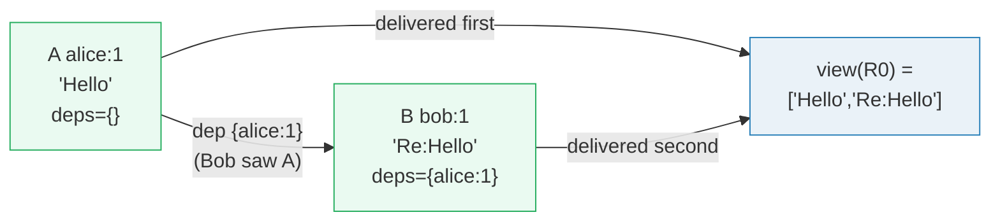
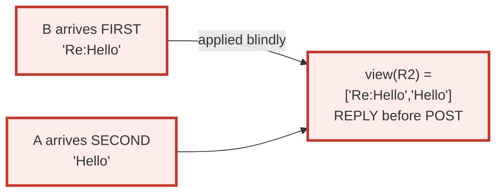
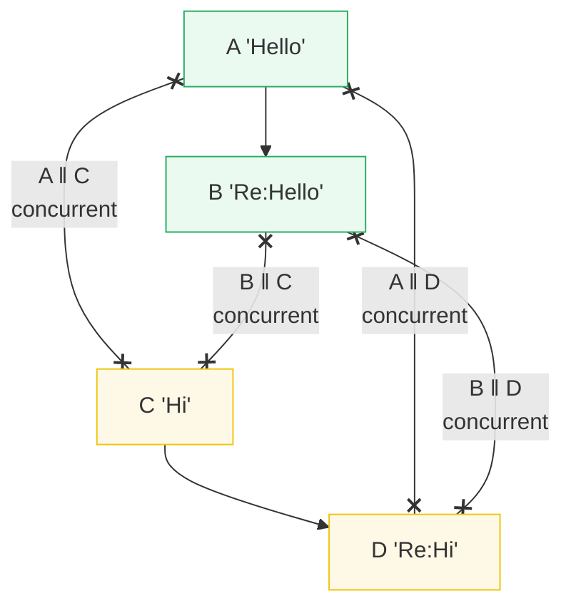
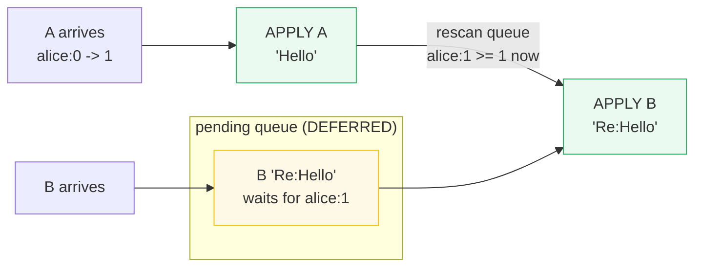
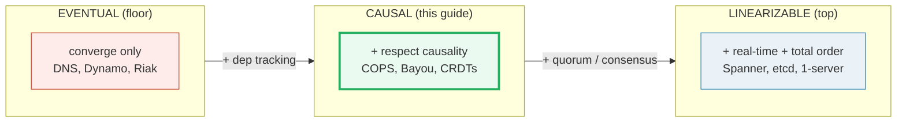
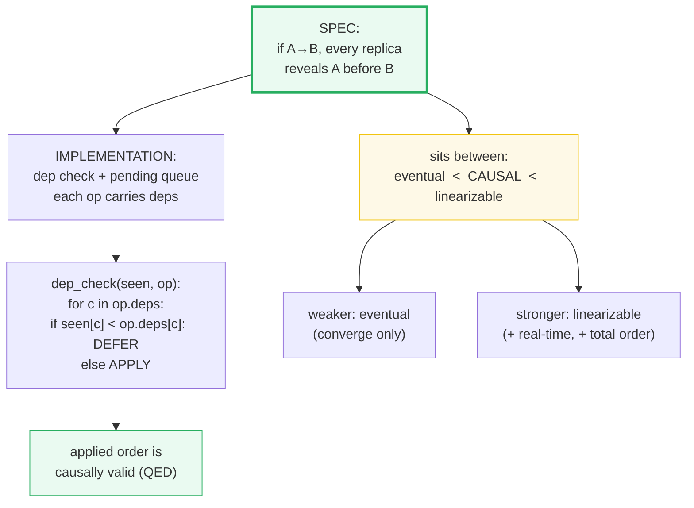

# Causal Consistency — A Visual, Worked-Example Guide

> **Companion code:** [`causal_consistency.py`](./causal_consistency.py).
> **Every number in this guide is printed by `python3 causal_consistency.py`**
> — change the code, re-run, re-paste. Nothing here is hand-computed.
>
> **Live animation:** [`causal_consistency.html`](./causal_consistency.html) —
> open in a browser. Toggle between a valid ordering and a causal violation;
> step through the dependency-check wait queue; compare eventual vs causal vs
> linearizable on the same arrival order.
>
> **Source material:** Lamport 1978 (happens-before), Terry et al. 1995
> (Bayou, session guarantees), Lloyd et al. 2011 (COPS), Shapiro et al. 2011
> (CRDTs), Pang et al. 2012 (Spanner / linearizability).

---

## 0. TL;DR — the comment that lost its post

### Read this first — why "they converge eventually" is not enough

Imagine a social feed replicated across 3 data centers. Alice posts `Hello`.
Bob, reading from a faster replica, sees `Hello` and replies `Re:Hello`. Both
writes fan out to the other replicas.

```mermaid
graph LR
    Alice["Alice posts<br/>A = 'Hello'<br/>deps = {}"] -->|Bob SEES A,<br/>then writes| Bob["Bob replies<br/>B = 'Re:Hello'<br/>deps = {alice:1}"]
    Alice -.->|replicate| R0["R0"]
    Alice -.->|replicate (SLOW)| R2["R2"]
    Bob -.->|replicate (FAST)| R2
    Bob -.->|replicate| R0
    style Alice fill:#eaf2f8,stroke:#2980b9
    style Bob fill:#eaf2f8,stroke:#2980b9
    style R2 fill:#fdecea,stroke:#c0392b
```

Under **eventual consistency** the only promise is *"all replicas eventually
agree"*. Nothing stops a replica from receiving Bob's reply **before** Alice's
original post — and a user on that replica sees `Re:Hello` with no parent,
which is nonsense. The two writes **converge** eventually, but mid-flight the
view is broken.

**Causal consistency** forbids exactly this. If Bob's reply **causally
depends** on Alice's post (Bob had to see the post to reply to it), then no
replica may reveal the reply until it has also revealed the post. Causality is
tracked and respected.

```mermaid
graph LR
    Ev["EVENTUAL<br/>all replicas converge<br/>(same final writes)<br/>NO causal guarantee<br/>NO real-time guarantee"] -->|+ track &amp; respect<br/>causal deps| Cau["CAUSAL<br/>if A→B then A before B<br/>on every replica<br/>concurrent ops: any order"]
    Cau -->|+ global coordination<br/>(quorum / TrueTime)| Lin["LINEARIZABLE<br/>one total order<br/>+ real-time respected<br/>(Spanner, etcd)"]
    style Ev fill:#fdecea,stroke:#c0392b
    style Cau fill:#eafaf1,stroke:#27ae60,stroke-width:3px
    style Lin fill:#eaf2f8,stroke:#2980b9
```

What causal consistency does **not** promise: **real-time order**. If Alice's
post is acknowledged at `12:00:00` and Carol independently posts at `12:00:01`
from a client that never saw Alice, causal consistency is silent on which
"really" came first — they are **concurrent**, and either order on a replica
is fine. That extra real-time guarantee is **linearizability**, and it costs
global coordination (Spanner's TrueTime, a Paxos/Raft quorum per key).

So the ladder is:

```
eventual  <  causal  <  linearizable
(converge)   (+cause)   (+real-time)
```

Each step up adds a guarantee **and** a coordination cost.

> **One-line definition:** A replicated store is *causally consistent* if for
> any two operations `A → B` (A happens-before B), every replica that has
> revealed `B` has also revealed `A`. Concurrent operations (`A ‖ B`) may be
> revealed in **any** order. It sits between **eventual** (weaker, only
> convergence) and **linearizable** (stronger, adds real-time + total order).

### Glossary (every term used below)

| Term | Plain meaning |
|---|---|
| **operation (op)** | a write, tagged with `(client, seq)` and a dependency set |
| **client** | a sequential writer. Here: `alice, bob, carol, dave` (4) |
| **replica** | a node storing a copy of the data. Here: `R0, R1, R2` (3) |
| **dependency set** | the set of prior ops the client had seen when it wrote; encoded as `{client: seq}` |
| **version vector (vv)** | `op.vv = merge(op.deps, {op.client: op.seq})` — the op's full causal context |
| **happens-before (→)** | `A → B` iff `A` is in the transitive closure of `B`'s deps |
| **concurrent (‖)** | neither `A → B` nor `B → A`; replicas may reorder these freely |
| **causal order** | a delivery order on a replica that respects `→` (if `A → B`, `A` delivered before `B`) |
| **causal violation** | a delivery where `B` appears before its causal ancestor `A`; forbidden by causal, **allowed** by eventual |
| **dep check** | the rule a replica runs before applying an op: for every `(c, n)` in `op.deps`, `seen[c] ≥ n`; else **DEFER** |
| **CRDT** | Conflict-free Replicated Data Type — concurrent ops commute → causal consistency **for free**, no dep tracking |

---

## 1. Causal order — Section A output

Two operations with a causal link: Alice posts, Bob **sees** her post and
replies. Bob's reply carries the dependency `{alice: 1}` — proof he had seen
Alice's first op before writing.

> From `causal_consistency.py` **Section A** — the causal chain and a valid
> delivery on `R0`:
>
> ```
> A = A(alice:1='Hello', deps={})
> B = B(bob:1='Re:Hello', deps={alice:1})
>
> Bob's reply B carries dep {alice:1} - he had SEEN Alice's post A
> when he wrote it. So A -> B (A happens-before B).
> ```
>
> **Version vectors** (`op.vv = deps` merged with own increment):
>
> | op | vv |
> |---|---|
> | A | `{alice:1, bob:0, carol:0, dave:0}` |
> | B | `{alice:1, bob:1, carol:0, dave:0}` |
>
> **`R0` delivers `[A, B]` WITH dependency checking:**
>
> | step | op | dep check | result | seen after |
> |---|---|---|---|---|
> | A | A | (no deps) | APPLY | `{alice:1, bob:0, carol:0, dave:0}` |
> | B | B | `alice: 1>=1=OK` | APPLY | `{alice:1, bob:1, carol:0, dave:0}` |
>
> ```
> view(R0) = ['Hello', 'Re:Hello']   <- post first, reply second.
> [check] A -> B and pos(A) < pos(B) on R0: OK
> ```



> 🔗 The `seen` vector here is exactly the **version-vector** mechanism from
> [VECTOR_CLOCKS.md §1](./VECTOR_CLOCKS.md). The difference: a vector clock
> timestamps *events*; here the per-client counter records *which op of each
> client this replica has applied*. The comparison rule is identical.

---

## 2. Causal violation — Section B output

Now `R2` is reachable via a slow link for `A` but a fast link for `B`. Under
**eventual consistency** (no dep checking), `R2` applies whatever arrives, in
arrival order. `B` arrives first.

> From `causal_consistency.py` **Section B** — the violation:
>
> ```
> R2 arrival order = [B, A]. Applied BLINDLY (eventual style):
>
>   step 1: apply B ('Re:Hello')    view = ['Re:Hello']
>   step 2: apply A ('Hello')       view = ['Re:Hello', 'Hello']
>
> R2's users see:  ['Re:Hello', 'Hello']
>   -> a REPLY to a post that is not yet visible. Broken UX.
> ```
>
> **Schedule-validity check** (the SPEC): for every `A → B` delivered,
> `pos(A) < pos(B)`?
> ```
> Violations: [('A', 'B')]
>   -> A -> B but B delivered first.
> ```



> This is exactly what causal consistency **forbids**. Eventual says *"they
> converge eventually"* — and they do (the final set of writes is the same on
> every replica) — but the **mid-flight view violates causality**. The two
> writes *do* converge; the **order** in which they become visible is the
> problem.
>
> 🔗 Had `R2` run the dependency check (Section 4), `B` would have been
> **DEFERRED** until `A` arrived:
> ```
> B arrives: dep_check -> ok=False, missing=[('alice',1,0)]  -> DEFER B
> A arrives: dep_check -> ok=True (no deps)                  -> APPLY A
>            flush pending: B's dep alice:1 now satisfied     -> APPLY B
>            view = ['Hello', 'Re:Hello']   (correct!)
> ```

---

## 3. Concurrent operations — Section C output

Causal consistency constrains **only** causally-related ops. For concurrent
ops (`a ‖ b`) it is **silent**: either order is acceptable. This is what makes
causal consistency cheaper than linearizability (which must pick one global
order even for concurrent ops).

> From `causal_consistency.py` **Section C** — two independent causal chains:
>
> ```
> chain 1: 'Hello'(A) -> 'Re:Hello'(B)    [A -> B]
> chain 2: 'Hi'(C) -> 'Re:Hi'(D)          [C -> D]
>
> Concurrent pairs (neither -> the other):
>   A || C   (A.deps={}, C.deps={})
>   A || D   (A.deps={}, D.deps={carol:1})
>   B || C   (B.deps={alice:1}, C.deps={})
>   B || D   (B.deps={alice:1}, D.deps={carol:1})
> ```
>
> **Both schedules are causally valid** despite revealing the chains in
> different orders:
>
> | replica | schedule | view | causal violations |
> |---|---|---|---|
> | R0 | `[A, B, C, D]` | `['Hello','Re:Hello','Hi','Re:Hi']` | `[]` |
> | R1 | `[C, D, A, B]` | `['Hi','Re:Hi','Hello','Re:Hello']` | `[]` |
> | R2′ | `[A, C, B, D]` | `['Hello','Hi','Re:Hello','Re:Hi']` | `[]` |
>
> ```
> [check] R0, R1, R2' all causally valid despite different orders: OK
> ```



> **Contrast with Section 2:** reordering `A` and `B` is **FORBIDDEN**
> (`A → B`), but reordering `A` and `C` is **FINE** (`A ‖ C`). The dependency
> graph decides which. `R0` and `R1` momentarily show the chains in different
> orders, but **neither ever shows a reply before its post**. Causality is
> intact; the reordering is only between independent writes.

---

## 4. Implementation — dependency tracking + wait queue — Section D output

How is causal consistency **implemented**? Each op carries its dependency
version vector; each replica keeps a `seen` vector (max seq applied per
client). Before applying an op, run the **dep check**:

```
def dep_check(seen, op):
    for c in op.deps:
        if seen[c] < op.deps[c]: return DEFER
    return APPLY
```

If `DEFER`, park the op in a **pending** queue. Whenever a new op is applied,
re-scan the queue — a deferred op may now be unblocked.

> From `causal_consistency.py` **Section D** — the killer demo: the **same**
> pathological arrival `[B, A]` that broke `R2` in Section 2, now handled
> **with** the dep check:
>
> | arrival | op | status | detail |
> |---|---|---|---|
> | B | B | DEFERRED | missing deps: `alice: need 1, have 0` |
> | A | A | APPLIED | `view = ['Hello']` |
> | B | B | APPLIED-AFTER-WAIT | `view = ['Hello', 'Re:Hello']` |
>
> ```
> Final view = ['Hello', 'Re:Hello']   <- SAME as R0 in Section A.
> B arrived FIRST but was revealed SECOND, because the dep check
> refused to apply it until A (its causal ancestor) was present.
> ```



> The dep check is `O(#deps)` per op. **COPS keeps deps 1-hop** (the direct
> causal ancestors) rather than the full transitive closure, so each op
> carries a SMALL dep set — cheap to check, cheap to store.
>
> **INVARIANT:** the pending queue + dep check together guarantee that the
> APPLIED order is causally valid. Proof sketch: an op is applied only when
> all its deps are already applied; hence every `A → B` edge has
> `pos(A) < pos(B)` in the applied order. QED.

> 🔗 **The CRDT escape hatch** (Shapiro et al. 2011): if the object's
> operations **commute** (e.g. a G-Set's `add`, a G-Counter's `increment`),
> then concurrent ops always produce the same result regardless of order — so
> causal consistency holds **without** any dep tracking, deferrals, or pending
> queues. The dep check becomes vacuous. This is how collaborative editors
> (Yjs, Automerge) and Riak data types get causal+ for free.

---

## 5. The consistency ladder — Section E output

Three levels of guarantee, increasing in strength **and** in cost.

> From `causal_consistency.py` **Section E** — the comparison table (using the
> Alice/Bob scenario `A='Hello' → B='Re:Hello'`):
>
> | guarantee / property | eventual | causal | linearizable |
> |---|---|---|---|
> | replicas converge eventually | yes | yes | yes |
> | respects causality (`A→B ⇒ A` before `B`) | **NO** | yes | yes |
> | respects real-time (`ack(X)` bef `start(Y)`) | **NO** | **NO** | yes |
> | single total order visible to all clients | **NO** | **NO** | yes |
> | concurrent (`a‖b`) may reorder per replica | yes | yes | **NO** |
> | coordination needed | none | dep tracking (local) | quorum / consensus |
> | stalls on missing deps? | no | yes (defers) | no (serialized) |
> | canonical systems | DNS, Dynamo, Riak | COPS, Bayou, CRDTs | Spanner, etcd, 1-server |
>
> **Same arrival `[B, A]` — what each model does:**
>
> | model | behavior | view | causality |
> |---|---|---|---|
> | EVENTUAL | applies B then A | `['Re:Hello','Hello']` | violated, but converges |
> | CAUSAL | defers B, applies A, then B | `['Hello','Re:Hello']` | respected |
> | LINEARIZABLE | one server serializes A,B | `['Hello','Re:Hello']` | respected + real-time |
>
> ```
> [check] ladder ordering eventual < causal < linearizable verified: OK
> ```



> **Pick the weakest model that meets your needs:**
> - cache lookups, DNS → **eventual**
> - feeds, collaborative docs, instant messaging → **causal** (this tutorial)
> - money, inventory, locks → **linearizable**

> 🔗 **Spanner** reaches linearizability by synchronizing **physical** clocks
> (TrueTime) — the opposite end of the clock spectrum from causal's logical
> vectors. See [CLOCK_SYNC_NTP.md](./CLOCK_SYNC_NTP.md). And
> [RAFT.md](./RAFT.md) / [PAXOS.md](./PAXOS.md) for the consensus that backs
> linearizable single-key writes.

---

## 6. GOLD CHECK — causal dependencies respected on every replica

The strongest statement about causal consistency: **for every `A → B`, every
replica that has revealed `B` has also revealed `A`** — and the dep-check
implementation always produces such an order. The gold check verifies this
against the independently-built happens-before graph, the spec (schedule
validity), and the implementation (dep-check delivery), on all three replica
schedules.

> From `causal_consistency.py` **GOLD CHECK**:
>
> **(a) op version vectors** (`deps + own increment`):
>
> | op | vv | match gold |
> |---|---|---|
> | A | `{alice:1, bob:0, carol:0, dave:0}` | ✓ |
> | B | `{alice:1, bob:1, carol:0, dave:0}` | ✓ |
> | C | `{alice:0, bob:0, carol:1, dave:0}` | ✓ |
> | D | `{alice:0, bob:0, carol:1, dave:1}` | ✓ |
>
> **(b) happens-before reachability** (transitive closure of deps):
>
> | op | → {descendants} | match gold |
> |---|---|---|
> | A | `{B}` | ✓ |
> | B | `{}` | ✓ |
> | C | `{D}` | ✓ |
> | D | `{}` | ✓ |
>
> **(c) replica schedules — causal validity + final view:**
>
> | replica | schedule | valid | violations | view |
> |---|---|---|---|---|
> | R0 | `[A,B,C,D]` | True | `[]` | `['Hello','Re:Hello','Hi','Re:Hi']` |
> | R1 | `[C,D,A,B]` | True | `[]` | `['Hi','Re:Hi','Hello','Re:Hello']` |
> | R2_VIOLATING | `[C,D,B,A]` | **False** | `[('A','B')]` | `['Hi','Re:Hi','Re:Hello','Hello']` |
>
> **(d) dep-check delivery** on arrival `[B, A]` always produces causal order:
> ```
> view = ['Hello', 'Re:Hello']   causal (A before B)? True
> ```
>
> **(e) spec vs implementation agreement** — the dep check NEVER produces a
> violating schedule, even on the violating arrival:
>
> | replica | blind violations | dep-check applied order violations | always causal? |
> |---|---|---|---|
> | R0 | `[]` | `[]` | True |
> | R1 | `[]` | `[]` | True |
> | R2_VIOLATING | `[('A','B')]` | `[]` | True |
>
> ```
> Summary:
>   (a) version vectors match gold      : OK
>   (b) happens-before graph matches    : OK
>   (c) schedule validity classifies OK : OK
>   (d) dep check yields causal order   : OK
>   (e) dep check never violates causality: OK
>
> => [check] GOLD: all causal dependencies respected; dep check always produces causal order: OK
> ```

The [`causal_consistency.html`](./causal_consistency.html) recomputes the dep
check, the schedule-validity classifier, and the happens-before graph **live
in JS** on the same deterministic inputs, and shows a gold `check: OK` badge
when every replica's order is classified correctly and the dep-check delivery
on `[B, A]` yields the causal view.

---

## 7. Pitfalls & debugging checklist

| # | Mistake | Symptom | Fix |
|---|---|---|---|
| 1 | **Conflating causal with linearizable** | expecting real-time / total order from a causal store; surprises under cross-client coordination | Causal gives `A→B ⇒ A before B` only; for real-time you need linearizability (Section 5) |
| 2 | **Applying ops in arrival order without a dep check** | reply-before-post glitches (Section 2) | Run `dep_check` before every apply; DEFER ops whose deps aren't satisfied (Section 4) |
| 3 | **Forgetting to re-scan the pending queue** | deferred ops stuck forever even after their deps arrive | On every successful apply, loop over pending until no progress |
| 4 | **Tracking full transitive-closure deps** | dep sets balloon over time; storage & check cost grows | COPS keeps **1-hop** deps only; transitivity is reconstructed at read time |
| 5 | **Reading causality off physical timestamps** | clock skew reorders causally-related ops (the LWW trap) | Use **logical** deps (version vectors), never wall-clock time. 🔗 [NETWORK_PARTITIONS.md §4](./NETWORK_PARTITIONS.md) |
| 6 | **Assuming causality = "happened earlier in real time"** | false confidence; concurrent real-time events can be reordered | Two ops with no dep edge are `‖` regardless of wall-clock order; causal is silent on them |
| 7 | **Session guarantees ≠ causal consistency** | read-your-writes from ONE client but cross-client causality still broken | Session guarantees (Bayou) are weaker; full causal consistency covers cross-client deps (COPS) |
| 8 | **Not piggybacking deps on the op** | receiver can't run the dep check; falls back to blind apply | Every op must carry its dep version vector (or its 1-hop dep set in COPS) |

---

## 8. Cheat sheet



- **Spec:** if `A → B`, every replica that has revealed `B` has also revealed
  `A`. Concurrent ops (`A ‖ B`) may appear in any order.
- **Happens-before:** `A → B` iff `A` is in the transitive closure of `B`'s
  deps (direct edges: each `(client, seq)` in `B.deps`).
- **Implementation:** each op carries a dep version vector; each replica keeps
  a `seen` vector; `dep_check(seen, op)` applies iff `seen[c] ≥ op.deps[c]`
  for all `c`; else DEFER into a pending queue that is flushed on every apply.
- **Invariant:** the applied order never reverses a causal edge (proof: an op
  is applied only after all its deps). `pos(A) < pos(B)` for every `A → B`.
- **Cost:** `O(#deps)` per op; COPS keeps deps **1-hop**. CRDTs need **no** dep
  tracking (commutative ops make the check vacuous).
- **Ladder:** `eventual < causal < linearizable` — each step adds a guarantee
  and a coordination cost.
- **Gold check:** R0/R1 valid, R2_VIOLATING invalid `[('A','B')]`; dep-check
  delivery on `[B,A]` always yields `['Hello','Re:Hello']` (causal).

---

## Sources

- **Happens-before** — Lamport. *Time, Clocks, and the Ordering of Events in a
  Distributed System.* CACM, 1978.
  - Verified claim: the `→` relation (program order + send→receive +
    transitivity) is the foundation causal consistency rests on; concurrent
    events (`‖`) are the ones causal consistency leaves unordered.
- **Bayou (session guarantees)** — Terry, Theimer, Petersen, Demers, Spreitzer,
  Hauser. *Managing Update Conflicts in Bayou, a Replicated Weakly-Connected
  Database.* SOSP, 1995.
  - Verified claim: dependency check / anti-entropy with version vectors;
  read-your-writes and monotonic-reads session guarantees (Section 4).
- **COPS (causal consistency with 1-hop deps)** — Lloyd, Freedman, Kaminsky,
  Andersen. *Don't Settle for Eventual: Scalable Causal Consistency for
  Wide-Area Storage with COPS.* SOSP, 2011.
  - Verified claims: causal consistency as a deployable wide-area guarantee;
  each write tracks its direct (1-hop) causal dependencies; dep check is
  `O(#deps)` (Sections 4, 5).
- **CRDTs** — Shapiro, Preguiça, Baquero, Zawirski. *Conflict-free Replicated
  Data Types.* REP Lecture, 2011.
  - Verified claim: commutative concurrent operations give causal consistency
  without dependency tracking (Section 4, the CRDT escape hatch).
- **Dynamo (eventual floor)** — DeCandia et al. *Dynamo: Amazon's Highly
  Available Key-value Store.* SOSP, 2007.
  - Verified claim: eventual consistency guarantees convergence only — the
  floor of the ladder, and the model whose violations motivate causal (Section 2).
- **Spanner (linearizability ceiling)** — Pang et al. *Spanner: Google's
  Globally-Distributed Database.* OSDI, 2012.
  - Verified claim: externally consistent (linearizable) reads/writes via
  TrueTime + Paxos groups — the top of the ladder (Section 5).
- **Books** — Kleppmann, *Designing Data-Intensive Applications* (Ch. 5 /
  Ch. 9, "Replication" / "Consistency and Consensus", the consistency-model
  survey); Tanenbaum & Van Steen, *Distributed Systems* (Ch. 7, Consistency
  and Replication).
- **Related** — 🔗 [VECTOR_CLOCKS.md](./VECTOR_CLOCKS.md) (the version-vector
  mechanism behind the `seen`/`deps` vectors here); 🔗
  [NETWORK_PARTITIONS.md](./NETWORK_PARTITIONS.md) (LWW vs vectors vs CRDT for
  conflict resolution); 🔗 [CLOCK_SYNC_NTP.md](./CLOCK_SYNC_NTP.md)
  (physical-clock sync for linearizability); 🔗 [RAFT.md](./RAFT.md) /
  [PAXOS.md](./PAXOS.md) (consensus backing linearizable single-key writes).
