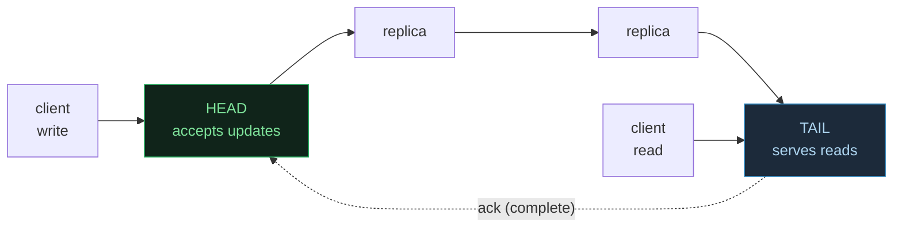
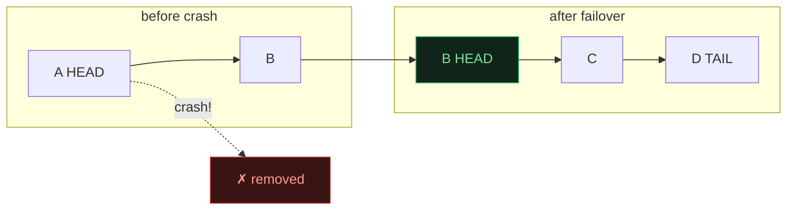
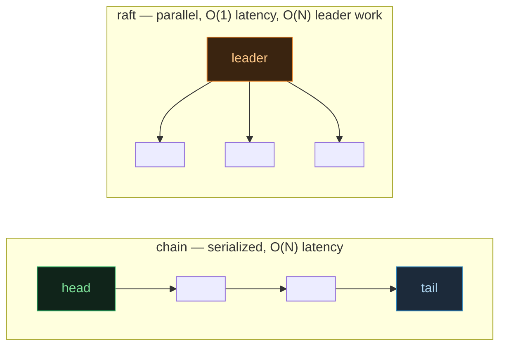

# Chain Replication — Strong Consistency Without Per-Op Consensus

> A concept bundle for distributed systems. Every number below is printed by
> **`chain_replication.py`** (pure Python stdlib, run with `python3 chain_replication.py`)
> and recomputed live in **`chain_replication.html`**. This guide never
> hand-computes anything — it cites the `.py` output verbatim.
>
> 🔗 Interactive companion: `chain_replication.html` &nbsp;|&nbsp; Source of truth: `chain_replication.py`

---

## 0. The one-paragraph version

Chain replication (van Renesse & Schneider, OSDI 2004) lines replicas up in a
linear chain: the **HEAD** is the only node that accepts client **writes**
(updates), each forwarded hand-to-hand down to the **TAIL**; the **TAIL** is the
only node that answers client **reads** (queries). Because every completed write
must flow through the tail, the tail's state is always the latest
fully-replicated value — so a read **never** returns a stale or partial write.
The single serial path makes writes **FIFO** at every replica, which buys
**strong consistency (linearizability) without any per-operation voting** — the
decisive difference from Raft/Paxos, which count a majority to commit each op.
The price is latency: a write makes `N-1` sequential hops instead of one
parallel round. Failures are handled by a separate **configuration manager**
(often ZooKeeper): if the head fails its successor becomes head; if the tail
fails its predecessor becomes tail — and **no data is lost**, because writes
always flowed *through* the new head/tail on their way to the crashed one. With
4 nodes `A→B→C→D`, a write traverses 3 hops.

> From `chain_replication.py` GOLD CHECK (the headline numbers):
> ```text
>   initial_chain_length   = 4
>   initial_write_hops     = 3        (N-1, N=4)
>   read_sequence          = [1, 2, 3, 4, 4, 5]
>   expected_read_sequence = [1, 2, 3, 4, 4, 5]
>   final_read             = 5
>   live_nodes_at_end      = ['B', 'C']
>   reads_match_latest     = True
>   data_loss              = False
> ```

---

## 1. The assembly-line intuition

Think of the replicas as workers on a factory line, left to right. Raw material
(writes) enters at the **first** worker (head) and is passed along until the
**last** worker (tail) finishes it; only then is it "complete". Anyone asking
what was built queries the **last** worker, who has seen every finished item.



- **One path for writes, one reader.** Writes serialize through the head and
  down a single chain; reads hit only the tail. This *is* the consistency
  engine — no clocks, no quorums.
- **FIFO at every replica.** Because there is one forward path, every replica
  applies writes in the identical order they entered at the head.
- **The tail is the source of truth.** A completed write is one that reached the
  tail; reads therefore always observe a consistent prefix of the write stream.

---

## 2. Section A — chain setup (`A→B→C→D`): head writes, tail reads

Four nodes form the chain. The HEAD (`A`) accepts client updates; each update is
appended at the head and forwarded down to the TAIL (`D`), where it becomes
"complete". The TAIL answers all reads — since every completed write passed
through it, its state is the latest fully-replicated value.

> From `chain_replication.py` Section A:
> ```text
>   chain = A(HEAD) -> B -> C -> D(TAIL)   [length=4]
>   head  = A   (accepts writes)
>   tail  = D   (serves reads)
>
> WRITE: client sends 'PUT x=1' to the HEAD. It flows down the chain:
>   client --> A --> B --> C --> D  (write #1: x=1)
>   -> write reaches TAIL, is now COMPLETE. ACK returns to client.
>
> READ: client sends 'GET x' to the TAIL:
>   client --> D  ->  returns x=1
>
> Per-node history after the write (each saw it, in FIFO order):
>     A: [x=1]
>     B: [x=1]
>     C: [x=1]
>     D: [x=1]
>
> [check] write latency = N-1 = 3 hops; read returned x=1:  OK
> ```

**The whole point.** The write visited every node along ONE path, so every node
saw it in the same order — no broadcast, no quorum, no vote.

🔗 In `chain_replication.html` Panel ①, press *Send write* to watch the value
flow left→right down the chain, then press *Send read* to query the tail.

---

## 3. Section B — strong consistency: FIFO chain ⇒ tail sees all writes in order

Linearizability here rests on two facts: (1) all writes enter at the single head
and flow down one path, so every replica applies them in the SAME order (FIFO);
(2) all reads hit the single tail, whose history is a prefix of the completed
writes — so a read never sees a partial write. Contrast with Raft/Paxos, which
reach a majority to commit (a vote per operation): chain replication needs **no
vote**; the serial path *is* the consistency mechanism.

> From `chain_replication.py` Section B:
> ```text
>   op                       result
>   -----------------------  --------------------------------------
>   write x=2                 path A->B->C->D, complete at D
>   read  x                   tail D returns x=2   (expected 2) [OK]
>   write x=3                 path A->B->C->D, complete at D
>   read  x                   tail D returns x=3   (expected 3) [OK]
>   write y=9                 path A->B->C->D, complete at D
>   read  x                   tail D returns x=3   (expected 3) [OK]
>   read  y                   tail D returns y=9   (expected 9) [OK]
>
> Ordering guarantee -- the tail's history is the global write order:
>   tail history = [(1, 'x=1'), (2, 'x=2'), (3, 'x=3'), (4, 'y=9')]
>   Every replica's history is a PREFIX of this order (FIFO). A read at
>   the tail therefore returns the latest completed write, always.
>
> [check] all reads == latest completed write ([2, 3, 3, 9] == [2, 3, 3, 9])?  True:  OK
> ```

**Read `y=9` while the latest `x` is still `3`.** The tail holds the full
ordered history; each key resolves by last-writer-wins, so a read of any key
returns that key's most recent completed value, consistent with the global
order.

---

## 4. Section C — head failure: `A` crashes → `B` becomes head, no data loss

The configuration manager (e.g. ZooKeeper) detects that the HEAD (`A`) has
crashed and removes it from the chain; `A`'s **successor** (`B`) becomes the new
head. No data is lost because every write `A` ever accepted was **forwarded
through `B`** on its way down — so `B`'s history already contains all of `A`'s
writes. The chain simply continues. **No consensus vote ran for the write** —
the chain just kept forwarding; the only consensus happened inside the manager,
once, to agree on the new membership.

> From `chain_replication.py` Section C:
> ```text
>   before: A(HEAD) -> B -> C -> D(TAIL)   [length=4]
>   A crashes (fail-stop). manager reassigns head.
>   after : B(HEAD) -> C -> D(TAIL)   [length=3]
>   new head = B, tail still = D
>
> Prove B already has everything A had (B's history is complete):
>     B history = [x=1, x=2, x=3, y=9]
> New writes now enter at B and flow B -> C -> D:
>   client --> B --> C --> D  (write #5: x=4)
>   read at tail D -> x=4
>
> [check] after head failover, write x=4 completed and read returned x=4:  OK
> ```



🔗 `chain_replication.html` Panel ② lets you **click any node to crash it** and
watch the head/tail reassignment; the new write then flows from the new head.

---

## 5. Section D — tail failure: `D` crashes → `C` becomes tail, no data loss

Symmetric to the head case: the manager detects that the TAIL (`D`) crashed and
removes it; `D`'s **predecessor** (`C`) becomes the new tail. No data is lost
because every write that completed at `D` had to pass **through `C`** first — so
`C`'s history already contains every write `D` ever saw. Reads now hit `C`.

> From `chain_replication.py` Section D:
> ```text
>   before: B(HEAD) -> C -> D(TAIL)   [length=3]
>   D crashes (fail-stop). manager reassigns tail.
>   after : B(HEAD) -> C(TAIL)   [length=2]
>   new tail = C, head still = B
>
> Read right after failover -- C must return the same value D would have:
>   read at new tail C -> x=4   (matches pre-crash value)
> A new write now flows along the shortened chain:
>   client --> B --> C  (write #6: x=5)
>   read at tail C -> x=5
>
> [check] after tail failover, no data lost and read returned x=5:  OK
> ```

**Survives below a majority.** The chain now has only 2 live nodes (`B`, `C`)
and STILL serves strong-consistency reads/writes — it needs **no majority**.
Unlike Raft, which would be **stopped** with 2 of 4 alive (majority = 3), chain
replication keeps going down to a **single** node (which becomes both head and
tail). Its availability floor is lower; its correctness still rests on the
manager's failure detection.

---

## 6. Section E — chain vs Raft/Paxos: `O(N)` latency vs `O(N)` leader work

Both replicate a write across `N` nodes, but they spend the cost **opposite**
ways. Same total messages; opposite shapes: chain **serializes** the write along
one path (latency `O(N)` hops, each node `O(1)` work), Raft **fans out** in
parallel (latency `O(1)` round, but the leader does `O(N)` work sending to every
follower, and counts a majority to commit).

> From `chain_replication.py` Section E:
> ```text
> Per-write cost, N = 4 replicas (1 update):
>
> | metric                | chain (N=4)         | raft (N=4)          |
> |-----------------------|---------------------|---------------------|
> | write latency         | 3 sequential hops    | 1 parallel round     |
> | messages on the wire  | 6 (down + up)       | 6 (fan-out + ack)    |
> | work at the bottleneck| head: 1 send/op      | leader: 3 sends/op     |
> | work per other replica| 2 (recv + fwd)        | 1 (recv + ack)        |
> | needs consensus/op?   | NO (serial path)    | YES (majority ack)  |
> | reads served by       | TAIL (single point) | any (after commit)  |
> | survives with N alive | down to 1 node      | needs majority      |
>
> Latency vs chain length (write, in hops/rounds):
> | N replicas | chain write latency (N-1 hops) | raft write latency (1 round) |
> |------------|---------------------------------|----------------------------|
> | 2          | 1                               | 1                          |
> | 4          | 3                               | 1                          |
> | 8          | 7                               | 1                          |
> | 16         | 15                              | 1                          |
> ```



**Read it as a dial on where you put the cost.** Want low latency and can afford
a beefy leader → Raft/Paxos. Want to spread load (no single hot leader) and can
tolerate the chain's serial latency → chain. Throughput angle: chain's
bottlenecks are the head (accepts writes) and tail (serves reads); interior nodes
only relay, so lengthening the chain mainly raises latency, not throughput.
Chain pushes consensus **off the critical path** entirely — only the manager runs
it.

🔗 `chain_replication.html` Panel ③ plots write latency vs `N` for both, and
Panel ④ recomputes the full pipeline live.

---

## 7. Gold check (pinned values for the `.html`)

The `.html` recomputes the **full pipeline** in JavaScript: build a 4-node chain,
interleave writes/reads (asserting every read == latest completed write), crash
the head (`A`) and keep writing at the new head (`B`), then crash the tail (`D`)
and keep reading at the new tail (`C`). A green `check: OK` badge means the JS
replay matches `chain_replication.py` exactly. The gold invariant: **a read
always returns the latest fully-replicated write**, with zero data loss across
both failovers.

> From `chain_replication.py` GOLD CHECK:
> ```text
>   initial chain = A(HEAD) -> B -> C -> D(TAIL)   [length=4]   head=A, tail=D
>
>   operation trace:
>     write x=1
>     read                       -> 1
>     write x=2
>     read                       -> 2
>     write x=3
>     read                       -> 3
>     crash head A
>     write x=4 (head=B)
>     read                       -> 4
>     crash tail D
>     read after tail failover   -> 4
>     write x=5 (chain B->C)
>     read                       -> 5
>
>   GOLD scalars (pinned for a compact .html check):
>     initial_chain_length   = 4
>     initial_write_hops     = 3        (N-1, N=4)
>     read_sequence          = [1, 2, 3, 4, 4, 5]
>     expected_read_sequence = [1, 2, 3, 4, 4, 5]
>     final_read             = 5
>     live_nodes_at_end      = ['B', 'C']
>     reads_match_latest     = True
>     data_loss              = False
>
>   [check] every read == latest fully-replicated write, no data lost across head+tail failovers:  OK
> ```

### The chain-replication invariants (and where they show up here)

| Invariant | What it guarantees | Where this bundle shows it |
|---|---|---|
| **FIFO delivery** | every replica sees writes in the same order | Section A/B (single forward path) |
| **Tail completeness** | a read returns the latest COMPLETED write | Section B (reads == latest write) |
| **Linearizability** | real-time order of completed writes respected | Section B (head serializes, tail reads) |
| **No loss on head fail** | successor already has all the head's writes | Section C (B history complete) |
| **No loss on tail fail** | predecessor already has all the tail's writes | Section D (C returns x=4) |

---

## 8. References

- **van Renesse & Schneider (2004)** — "Chain Replication for Supporting High Throughput and Availability", OSDI. The protocol implemented here. Fail-stop model; configuration manager for reconfiguration.
- **Kleppmann (2017)** — *Designing Data-Intensive Applications*, Ch. 5 (Replication) & Ch. 9 (Consistency & Consensus). The chain-vs-quorum trade-off.
- **Tanenbaum & Van Steen** — *Distributed Systems*, Ch. 7 (Consistency & Replication) & Ch. 8 (Fault Tolerance).
- **Ongaro & Ousterhout (2014)** — Raft, the per-op-consensus comparison point. 🔗 See `RAFT.md` / `raft.py`.
- **Lamport (1998)** — Paxos, the other per-op-consensus comparison. 🔗 See `PAXOS.md`.
- **Hunt, Konar, Junqueira, Reed (2010)** — ZooKeeper, the configuration-manager most often paired with chain replication in practice (uses Zab, a Raft-like consensus).

🔗 Back to `chain_replication.html` for the interactive chain, click-to-crash
failover, and the live latency-vs-Raft comparison.
