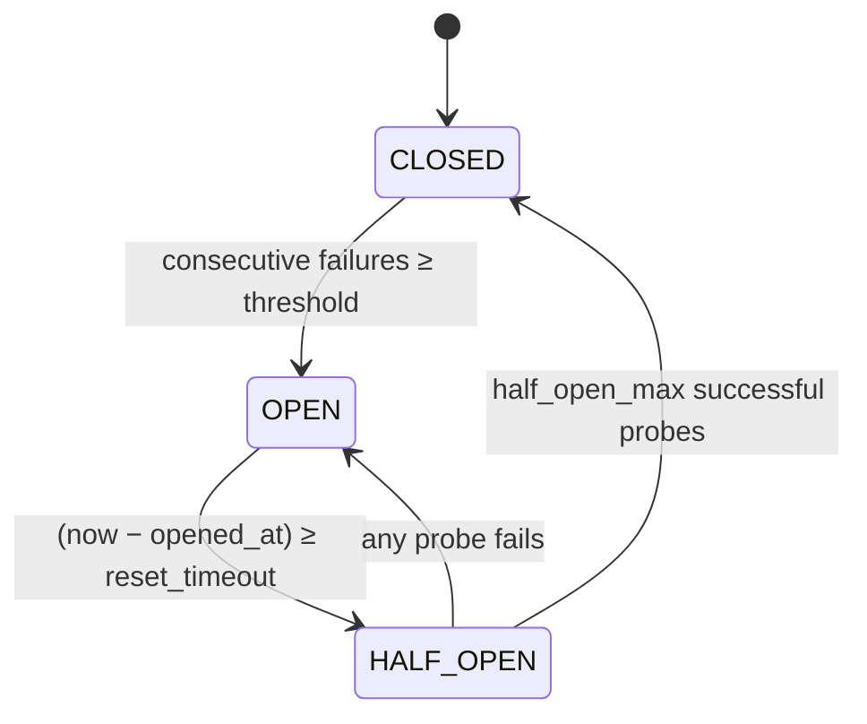
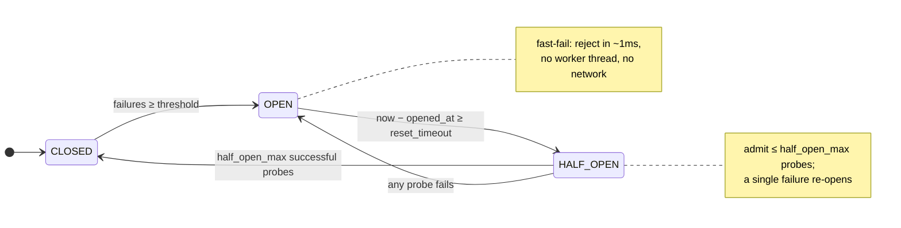

# CIRCUIT_BREAKER — The Fuse That Stops Cascading Failures

> A **concept bundle**: this guide + [`circuit_breaker.py`](./circuit_breaker.py) + [`circuit_breaker.html`](./circuit_breaker.html).
> Every number below is printed by the `.py` (the single source of truth) and recomputed live by the `.html`. Nothing is hand-computed.
> Interactive companion: **[`circuit_breaker.html`](./circuit_breaker.html)**. 🔗 Back to [all tutorials](../index.html).

---

## 0. Why this exists: the electric fuse in your fuse box

A circuit breaker is the **software twin of the fuse in your fuse box**. Normally current flows (requests pass through to the downstream service). If there is a short circuit downstream — the service starts failing or hanging — the fuse **blows**: it stops passing current, *fast*, to stop the fault from spreading along the wiring and burning down the house (cascading the failure to every caller).

Three states, exactly three:

- **CLOSED** — *"everything is fine."* Requests go through to the downstream service. We keep a running count of **consecutive failures**. The instant that count reaches `failure_threshold`, we **trip**: the breaker flips to OPEN. (CLOSED = the fuse is intact.)
- **OPEN** — *"the downstream is on fire; do not call it."* Every request is **rejected immediately**, in the caller's own thread, without ever touching the network or a worker thread. This is the fast-fail. The breaker stays OPEN for `reset_timeout` seconds (a cooling-off period), then flips to HALF_OPEN to probe whether the downstream has recovered. (OPEN = the fuse has blown; current is cut.)
- **HALF_OPEN** — *"maybe it is better now — let a FEW requests through to test."* We allow at most `half_open_max` **probe** requests to actually call the downstream. If ALL of them succeed, we declare recovery and flip back to CLOSED. If ANY one fails, we flip straight back to OPEN and restart the cooling-off clock. (HALF_OPEN = we are cautiously tipping the fuse back in, one finger on it.)

**The reason it exists:** without a breaker, a slow or failing downstream does not fail in isolation. Each call to it holds one of your worker threads for the full (long) latency. Your thread pool drains, the next caller queues, *your* service now looks slow to *its* callers, their thread pools drain, and the failure **cascades** upstream until the whole system is down — even though only one leaf service was actually broken. The breaker breaks that chain at the first hop: once tripped, calls return in ~1ms instead of waiting seconds, so your threads stay free, your service stays responsive (it returns errors *fast*), and the cascade never starts. The downstream also gets a chance to recover because nobody is hammering it. That is the whole point.



| Concept | Definition |
|---|---|
| **downstream** | the remote service we call (a DB, another microservice, an API). The thing that can fail or stall. |
| **failure** | a call that returned an error, threw, or timed out. Here: `outcome == "fail"`. |
| **consecutive failures** | failures in a row, with NO success in between. A single success resets the counter to 0. |
| **trip** | the CLOSED → OPEN transition. Happens the moment `consecutive_failures` reaches `failure_threshold`. |
| **fast-fail** | rejecting a request in OPEN *immediately*, WITHOUT calling the downstream. ~constant time, no worker thread held. |
| **reset timeout** | how long the breaker stays OPEN before allowing a probe. Longer = gentler on the downstream, slower to recover. |
| **probe** | a real call to the downstream allowed through in HALF_OPEN, to test recovery. Limited to `half_open_max`. |
| **cascade** | a failure propagating upstream by exhausting resources (threads, connections) in callers, and theirs. |
| **thread exhaustion** | all worker threads busy waiting on a slow downstream, so new work can't be picked up. The mechanism of a cascade. |

> **Sources:** Michael T. Nygard, *"Release It!: Design and Deploy Production-Ready Software"* (Pragmatic Bookshelf, 2007), Chapter 5 — the pattern's origin; defines the three states and the threshold/timeout/probe knobs exactly as implemented here. Martin Fowler, *"CircuitBreaker"* (martinfowler.com/bliki, 2014) — the canonical one-page description. Netflix **Hystrix** (wiki "How it Works") popularized it at scale; **Resilience4j** is its spiritual successor. 🔗 The breaker *consumes* a failure detector — see [`FAILURE_DETECTION.md`](./FAILURE_DETECTION.md) for how "the downstream is slow, not dead" gets decided in the first place.

---

## 1. CLOSED → OPEN — consecutive failures trip the breaker

The breaker starts CLOSED. Every request passes through to the downstream. We count **consecutive failures** (a single success zeros the counter). At `3` in a row, the breaker TRIPS to OPEN.

> From `circuit_breaker.py` Section A — the first 7 events of `CANONICAL_TRACE` (config: `threshold=3, reset_timeout=5.0s, half_open_max=2`):

| # | time (s) | downstream | allowed? | consec | state after |
|---|---|---|---|---|---|
| 0 | 1.00 | ok | yes | 0 | CLOSED |
| 1 | 2.00 | ok | yes | 0 | CLOSED |
| 2 | 3.00 | fail | yes | 1 | CLOSED |
| 3 | 4.00 | fail | yes | 2 | CLOSED |
| 4 | 5.00 | fail | yes | 3 | **OPEN** |
| 5 | 6.00 | ok | REJECT | 3 | OPEN |
| 6 | 7.00 | fail | REJECT | 3 | OPEN |

Events 0–1 succeed → counter stays 0. Events 2, 3, 4 each fail: after #2 `consec=1`, after #3 `consec=2`, after #4 `consec=3` → **TRIP**. The breaker is now OPEN at `t=5.0s`. The downstream is NOT contacted again until the breaker half-opens — even though events 5 and 6 *claim* `ok`/`fail`, they are **REJECTED before any call is made**.

```
[check] first CLOSED->OPEN trip at t=5.0s (trigger: 'failure threshold reached'):  OK
[check] a success mid-burst resets the counter: after [fail,fail,ok,fail] state = CLOSED (stayed CLOSED, consec=1):  OK
```

A single success mid-burst resets the counter — the breaker forgets ancient history and only trips on a *sustained* run of failures. 🔗 Drag the **threshold** slider in **[panel ①](./circuit_breaker.html)** and watch the trip move earlier or later.

---

## 2. OPEN → fast-fail + reset_timeout → HALF_OPEN

In OPEN the breaker does NOT forward any request. It returns an error to the caller immediately, in the caller's own thread. No network call, no worker thread held. This is the **fast-fail** — the whole point.

The breaker stays OPEN for `reset_timeout = 5.0s`. Crucially, the OPEN → HALF_OPEN transition is **lazy**: it is checked on the *next incoming request*, never on a wall-clock timer. A breaker that nobody calls stays OPEN forever (correct — probing costs a real call).

> From `circuit_breaker.py` Section B — OPEN-window verdicts (events after the first trip @t=5.0):

| # | time (s) | since trip | ≥ 5.0s? | decision |
|---|---|---|---|---|
| 5 | 6.00 | 1.00 | no | REJECT (fast-fail) |
| 6 | 7.00 | 2.00 | no | REJECT (fast-fail) |
| 7 | 20.00 | 15.00 | yes | HALF_OPEN (probe) |

Event 5 arrives 1s after the trip — still hot — REJECTED. Event 6 likewise. Event 7 arrives 15s after the trip — well past the 5s cooling-off — so the breaker flips to HALF_OPEN and lets event 7 through as the first **probe**. The downstream is finally contacted again **only at t=20.0**, fifteen seconds after it last failed.

```
[check] at t=100.0s with NO incoming request, breaker that tripped at t=2.0 is still OPEN (lazy: no request => no probe):  OK
[check] event 7 (t=20.0) is the first admission after the trip:  OK
```

---

## 3. HALF_OPEN → CLOSED / OPEN — limited probes decide recovery

In HALF_OPEN the breaker admits at most `half_open_max = 2` **probe** requests. Outcomes:

- ALL 2 succeed → the downstream has recovered → **CLOSE**.
- ANY one fails → still broken → flip back to **OPEN** and restart the cooling-off clock.

> From `circuit_breaker.py` Section C — Episode 1 (events 7–8) succeeds; Episode 2 (event 14) fails:

| # | time (s) | decision | probe result | succ | state after |
|---|---|---|---|---|---|
| 7 | 20.00 | half_open_probe | ok | 1 | HALF_OPEN |
| 8 | 21.00 | half_open_probe | ok | 2 | **CLOSED** |
| 14 | 40.00 | half_open_probe | fail | – | **OPEN** |

Episode 1: two consecutive successful probes (2/2) → CLOSED at `t=21.0`. Episode 2: the downstream is STILL broken — one failed probe is enough, the breaker flips straight back to OPEN at `t=40.0` and the 5s cooling-off starts over. It does NOT keep probing — that would hammer a sick service. Event 15 (1s later) is therefore REJECTED.

```
[check] event 8 closes after 2 successful probes (state=CLOSED):  OK
[check] event 14 reopens on a single failed probe (state=OPEN):  OK
```

This **asymmetry** is deliberate and is the conservative core of the pattern: it is cheap to stay suspicious (OPEN) and expensive to trust a flaky downstream (CLOSED), so closing requires *multiple* positive signals while a *single* negative signal reopens immediately.

---

## 4. Cascade prevention — with vs without a breaker

The scenario: a **4-thread** worker pool calls a downstream that suddenly **DEGRADES** — every call now takes `2000ms` and fails. Requests arrive every `200ms` (16 requests over `3.0s`).

WITHOUT a breaker, each slow call HOLDS a worker for 2000ms. 4 workers / 2s-per-call ⇒ the pool saturates almost immediately and stays full. Every arriving caller then QUEUES waiting for a worker — their latency balloons, and the slowdown propagates to whoever calls them. **That is the cascade.**

WITH a breaker (`threshold=3`), the first 3 failures trip it OPEN. From then on requests are REJECTED in ~1ms and use NO worker. Only the 3 calls that were already in flight when it tripped ever occupy workers, so the pool never fully saturates and the service keeps answering fast.

> From `circuit_breaker.py` Section D — worker-pool simulation of `CASCADE_STREAM`:

| metric | no breaker | with breaker |
|---|---|---|
| peak workers busy | 4 | 3 |
| first thread-exhaustion | 800ms | never |
| requests that found 0 free workers | 12 | 0 |
| total caller latency (sum, ms) | 60800 | 6013 |
| fast responses (<50ms) | 0 | 13 |
| calls admitted to downstream | 16 | 3 |
| calls rejected (fast-fail) | 0 | 13 |

```
[check] with-breaker peak_busy (3) == threshold (3):  OK
[check] with-breaker exhaustion_count (0) < no-breaker exhaustion_count (12):  OK
[check] no-breaker DID exhaust (12 > 0):  OK
```

Read it: WITHOUT the breaker, the 4-worker pool hits exhaustion at `t=800ms` and **12 of 16** callers block on a worker (total caller latency balloons to 60,800ms). WITH the breaker, exhaustion NEVER happens and **13 of 16** callers get a sub-50ms answer. The downstream is contacted only **3** times — the in-flight calls that tripped it — instead of all 16. **That is the cascade prevented at the first hop.** 🔗 See the worker Gantt in **[panel ②](./circuit_breaker.html)**: the breaker's lane leaves worker `w3` idle and shows zero queueing.

---

## 5. Config trade-offs — sensitive vs balanced vs tolerant

The three knobs are a dial between **SAFETY** (isolate fast) and **AVAILABILITY** (avoid false trips). Run the same `FLAP_TRACE` — a 4-failure burst then recovery — under three configs:

> From `circuit_breaker.py` Section E:

| config | thr | timeout | hom | tripped? | trip time | rejected | HALF_OPEN episodes | recovered? |
|---|---|---|---|---|---|---|---|---|
| sensitive | 2 | 2s | 1 | yes | 5s | 2 | 2 | yes |
| balanced | 3 | 5s | 2 | yes | 6s | 4 | 1 | yes |
| tolerant | 5 | 10s | 3 | no | – | 0 | 0 | yes |

```
[check] sensitive trips but tolerant does not on the same burst (yes vs no):  OK
[check] balanced rejects more than tolerant (4 > 0):  OK
```

Read it as a spectrum:

- **SENSITIVE** (`thr=2`) trips after just 2 failures and recovers in 2s, but it **false-trips** on short bursts and probes aggressively (2 half-open episodes). Good when failures are expensive; bad under benign jitter.
- **BALANCED** (`thr=3, 5s, 2 probes`) trips once, isolates for 5s, then needs 2 consecutive successes to trust the downstream again. The Nygard / Hystrix-style default.
- **TOLERANT** (`thr=5`) NEVER trips on a 4-failure burst — so it offers NO protection here. It avoids false alarms but a real outage would drain your threads unchecked.

**Rules of thumb** (Nygard *Release It!*; Hystrix/Resilience4j defaults):

- **threshold** — high enough to ride out normal jitter, low enough to trip *before* your thread pool drains. Tie it to pool size and downstream latency, not to a guess.
- **timeout** — longer than the typical recovery time of the downstream (a restarted service, a cache warm-up), short enough that you re-probe reasonably soon.
- **half_open_max** — `1` = fastest recovery but trusts a SINGLE success (risky on flaky nets); higher = more confidence before reopening the floodgates, at the cost of slower recovery.

---

## 6. Gold check — the full transition audit trail

> From `circuit_breaker.py` GOLD CHECK — the 18-event `CANONICAL_TRACE`, default config:

| # | time (s) | downstream | allowed? | state after |
|---|---|---|---|---|
| 0 | 1.00 | ok | yes | CLOSED |
| 1 | 2.00 | ok | yes | CLOSED |
| 2 | 3.00 | fail | yes | CLOSED |
| 3 | 4.00 | fail | yes | CLOSED |
| 4 | 5.00 | fail | yes | OPEN |
| 5 | 6.00 | ok | REJECT | OPEN |
| 6 | 7.00 | fail | REJECT | OPEN |
| 7 | 20.00 | ok | yes | HALF_OPEN |
| 8 | 21.00 | ok | yes | CLOSED |
| 9 | 22.00 | ok | yes | CLOSED |
| 10 | 23.00 | fail | yes | CLOSED |
| 11 | 24.00 | fail | yes | CLOSED |
| 12 | 25.00 | fail | yes | OPEN |
| 13 | 26.00 | ok | REJECT | OPEN |
| 14 | 40.00 | fail | yes | OPEN |
| 15 | 41.00 | ok | REJECT | OPEN |
| 16 | 50.00 | ok | yes | HALF_OPEN |
| 17 | 51.00 | ok | yes | CLOSED |

State-after sequence (18 entries): `CLOSED, CLOSED, CLOSED, CLOSED, OPEN, OPEN, OPEN, HALF_OPEN, CLOSED, CLOSED, CLOSED, CLOSED, OPEN, OPEN, OPEN, OPEN, HALF_OPEN, CLOSED`.

Transition log — every state change, with its trigger:

| time (s) | from | to | trigger |
|---|---|---|---|
| 5.00 | CLOSED | OPEN | failure threshold reached |
| 20.00 | OPEN | HALF_OPEN | reset_timeout elapsed |
| 21.00 | HALF_OPEN | CLOSED | probes succeeded |
| 25.00 | CLOSED | OPEN | failure threshold reached |
| 40.00 | OPEN | HALF_OPEN | reset_timeout elapsed |
| 40.00 | HALF_OPEN | OPEN | half-open probe failed |
| 50.00 | OPEN | HALF_OPEN | reset_timeout elapsed |
| 51.00 | HALF_OPEN | CLOSED | probes succeeded |

Total state transitions: **8**. The `circuit_breaker.html` companion replays this exact trace in JS and the green `[check: OK]` badge confirms byte-identical state, allowed, and transition sequences.

```
[check] state sequence matches pinned gold:  OK
[check] allowed-sequence matches pinned gold:  OK
[check] transition count == 8:  OK
[check] final state == CLOSED (recovered):  OK
[check] GOLD: state machine replay matches pinned transitions:  OK
```

---

## 7. The state machine at a glance



| Transition | Condition | Who checks it |
|---|---|---|
| CLOSED → OPEN | `consecutive_failures ≥ failure_threshold` | `after_call`, on a failure |
| OPEN → HALF_OPEN | `(now − opened_at) ≥ reset_timeout` | `before_call`, lazily on the next request |
| HALF_OPEN → CLOSED | `half_open_successes == half_open_max` | `after_call`, on a probe success |
| HALF_OPEN → OPEN | any probe failure | `after_call`, on a probe failure |

> **Pitfalls to remember.** (1) The OPEN → HALF_OPEN transition is **lazy** — a breaker nobody calls never probes; do not expect a background timer. (2) Closing needs `half_open_max` **consecutive** successes; reopening needs only **one** failure. The machine is deliberately asymmetric. (3) A breaker is a *local* resilience measure — it protects YOUR threads, it does not fix the downstream. Pair it with retries-with-jitter, bulkheads (separate pools per downstream), and timeouts. (4) Threshold tunes against pool size + downstream latency, not against a magic number — see Section 5.

🔗 Related: [`FAILURE_DETECTION.md`](./FAILURE_DETECTION.md) (deciding the downstream is dead), [`BACKPRESSURE.md`](./BACKPRESSURE.md) (another way to avoid overload), [`SYNC_VS_ASYNC.md`](./SYNC_VS_ASYNC.md) (where the worker threads come from).
