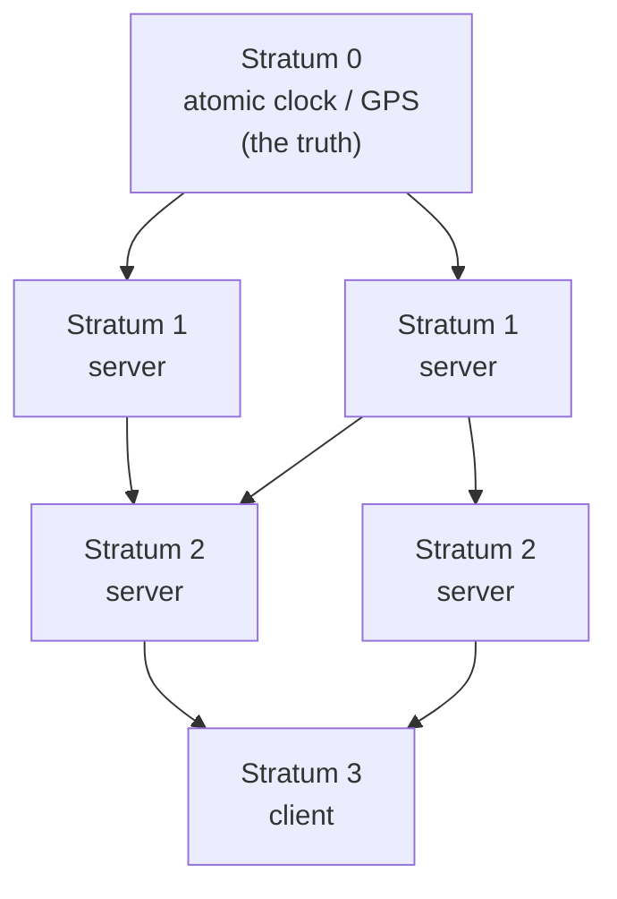

# CLOCK_SYNC_NTP — Physical Clock Synchronization

> A **concept bundle**: this guide + [`clock_sync_ntp.py`](./clock_sync_ntp.py) + [`clock_sync_ntp.html`](./clock_sync_ntp.html).
> Every number below is printed by the `.py` (the single source of truth) and recomputed live by the `.html`. Nothing is hand-computed.
> Interactive companion: **[`clock_sync_ntp.html`](./clock_sync_ntp.html)**. 🔗 Back to [all tutorials](../index.html).

---

## 0. Why this exists: clocks always lie

Every quartz crystal in every machine oscillates at a slightly different frequency. Two "perfectly synchronized" clocks **drift** apart at roughly **1 part per million** (`rho ≈ 1e-6`), so after just **12 days** they can disagree by ~1 second. There is no global "now"; each machine only has its own private clock, and that clock is always wrong by some unknown amount.

We cannot make clocks perfect. Instead we **measure** how wrong they are and **correct** them. The four classical answers, in order of how much they trust any single node:

| Algorithm | Year | Trusts | Core idea |
|---|---|---|---|
| **Cristian** | 1989 | One server | Ask "what time is it?"; half the RTT is your error bound. |
| **Berkeley** | 1989 | Nobody | Master **averages** all clocks and tells each machine how to nudge itself. |
| **NTP** | 1991 | A **hierarchy** | Stratum-0 atomic clocks → stratum 1 → … each hop adds error. |
| **Marzullo** | 1984 | A **quorum** | Keep only the largest clique of overlapping `(offset, ±error)` intervals; reject the rest as outliers. |

But even with all four, **wall clocks are unsafe**: a leap second inserts `23:59:60`, NTP can **step** a clock backward, and VM live-migration freezes the guest clock. Timestamps are approximations, never facts.

> **Glossary**
> - **clock skew** — the *fixed* difference between two clocks at one instant.
> - **clock drift** (`rho`) — the *rate* at which that difference grows. Quartz ≈ `1e-6` (1 ppm).
> - **offset** (`theta`) — how much to *add* to my clock to match the reference. `theta = reference − my_time`.
> - **RTT** — round-trip time = `T2 − T0` (request sent → reply received).
> - **accuracy bound** — `|true − estimated| ≤ RTT/2`. Cristian's provable guarantee.
> - **stratum** — hops from a reference clock. `0` = the atomic clock; `16` = unsynchronized.

---

## 1. Cristian's algorithm — client/server, `RTT/2` offset

The client asks a trusted server "what time is it?". Three timestamps cross/measure the exchange:

- `T0` — client **sends** the request (read on the *client* clock).
- `T1` — server **stamps** the reply with its *own* clock (the only "truth" on the wire).
- `T2` — client **receives** the reply (read on the *client* clock).

$$\boxed{\theta = T_1 - \frac{T_0 + T_2}{2}} \qquad \boxed{\text{accuracy} = \frac{T_2 - T_0}{2} = \frac{\text{RTT}}{2}}$$

`theta` is added to the client clock to match the server (positive ⇒ client is behind). The true offset is **guaranteed** to lie within `[theta − RTT/2, theta + RTT/2]` under the symmetric-network assumption.

### Worked example (built from ground truth)

We construct the demo from a **known** ground truth so the math is verifiable: client clock `C(t) = t`, server clock `S(t) = t + 12`, so the **true offset = 12.0 s**.

> From `clock_sync_ntp.py` Section A:

```
Case 1 (SYMMETRIC network, d_out=4.0, d_in=4.0):
  T0=0.0, T1=16.0, T2=8.0, RTT=8.0
  theta = T1 - (T0+T2)/2 = 16.0 - 4.0 = 12.0000
  accuracy bound = RTT/2 = 4.0000
  error = |true - theta| = 0.000000  (ZERO -> symmetric delay cancels out exactly)

Case 2 (ASYMMETRIC network, d_out=3.0, d_in=5.0):
  T0=0.0, T1=15.0, T2=8.0, RTT=8.0
  theta = T1 - (T0+T2)/2 = 15.0 - 4.0 = 11.0000
  accuracy bound = RTT/2 = 4.0000
  error = |true - theta| = 1.0000   == (d_in - d_out)/2 = 1.0000  (the asymmetry bias)
  true offset 12.0 in [theta-RTT/2, theta+RTT/2] = [7.0000, 15.0000]?  True
```

**Two takeaways:**

1. **Symmetric delay cancels exactly** (Case 1 recovers the true offset with zero error). Cristian implicitly assumes `d_out ≈ d_in`.
2. **Asymmetry biases the estimate** by `(d_in − d_out)/2` — but the error never exceeds `RTT/2`. The bound *always* holds.

**Punchline:** Cristian's error is at most `RTT/2`. A 200 ms ping ⇒ you only ever know the time to ±100 ms. Want millisecond accuracy? You need a sub-2-millisecond round trip, i.e. a LAN.

> **GOLD check** (pinned for `clock_sync_ntp.html`, reproduced identically in JS):
> ```
> T0=0, d_out=3, d_in=5, server_ahead=12 -> T1=15, T2=8
> theta  = 11.0     accuracy = 4.0     true_offset = 12.0   error = 1.0
> [check] Cristian GOLD: theta=11.0, accuracy=4.0, bound holds:  OK
> ```

🔗 Try dragging the delays in **[panel ①](./clock_sync_ntp.html)** — the timing diagram and offset update live.

---

## 2. Berkeley algorithm — master averages, slaves adjust

No machine is the "truth". A master **polls** every clock, **averages** them, and tells each machine how to nudge itself so they all meet in the middle:

$$\text{average} = \text{mean}(\text{all clocks, master included}) \qquad \text{adj}_i = \text{average} - \text{clock}_i$$

Positive adjustment ⇒ speed up; negative ⇒ slow down. Everyone converges to `average`.

> From `clock_sync_ntp.py` Section B (deterministic clocks: master at epoch 0, three slaves all fast):

```
| machine  | clock (s vs master) | average | adjustment = avg - clock |
|----------|---------------------|---------|--------------------------|
| master   |                +0.0 |    15.0 |                    +15.0 |
| slave A  |               +10.0 |    15.0 |                     +5.0 |
| slave B  |               +20.0 |    15.0 |                     -5.0 |
| slave C  |               +30.0 |    15.0 |                    -15.0 |

average = (0 + 10 + 20 + 30) / 4 = 15.0 s
After applying the adjustments every clock reads 15.0 s. They AGREE, even though none was right.
```

**The weakness — why we need Marzullo next:** a mean is fragile. One liar drags the whole group:

```
If slave C jumps to +300 s, average becomes 82.5 s and the
master would obediently slow itself by 82.5 s to match garbage.
Fix: reject outliers BEFORE averaging (Marzullo, section 3).
```

🔗 See the averaging animate live in **[panel ②](./clock_sync_ntp.html)**.

---

## 3. NTP strata + Marzullo's intersection algorithm

### 3a. The stratum hierarchy

NTP builds a **tree**. Stratum 0 = a reference clock (atomic/GPS); stratum 1 is wired directly to stratum 0; stratum 2 syncs from stratum 1; and so on. Each hop **adds** error. Stratum 16 means "unsynchronized".



> From `clock_sync_ntp.py` Section C:

```
| stratum | what it is                          | typical error vs UTC |
|---------|-------------------------------------|----------------------|
| 0       | reference clock (atomic / GPS / radio) | < 1 us  (the truth)  |
| 1       | server directly attached to stratum 0 | ~few ms              |
| 2       | syncs from one or more stratum-1    | ~10s of ms           |
| 3       | syncs from stratum-2                | ~100 ms              |
| 4       | syncs from stratum-3                | ~hundreds of ms      |
| 16      | unsynchronized / unreachable        | no guarantee         |

Error accumulates DOWN the tree: a stratum-3 clock is wrong by
everything stratum 1 and 2 were wrong by, plus its own RTT/2.
```

A client queries **several** upstream servers and runs **Marzullo** to reject any broken one before trusting the result.

### 3b. Marzullo's interval-intersection algorithm

Each server `i` claims the true offset is `offsets[i] ± errors[i]` → the interval `[offsets[i]−errors[i], offsets[i]+errors[i]]`. Marzullo keeps the **largest clique of intervals that all overlap** and treats the rest as faulty.

> From `clock_sync_ntp.py` Section C (four servers; three agree tightly, one lies):

```
| server          | offset +/- error | interval [lo, hi] |
|-----------------|------------------|-------------------|
| server A        |  10.0 +/- 2.0    | [  8.0,  12.0]      |
| server B        |  11.0 +/- 2.0    | [  9.0,  13.0]      |
| server C        |  12.0 +/- 2.0    | [ 10.0,  14.0]      |
| server D (liar) |  25.0 +/- 2.0    | [ 23.0,  27.0]      |

Largest overlapping clique = {A, B, C} = 3 servers
  region of agreement = [10.0, 12.0], midpoint estimate = 11.00
  rejected as outliers = {D}

[check] Marzullo picks the 3 agreeing servers and rejects the liar: trusted=[0, 1, 2], region=(10.0, 12.0):  OK
```

**How the sweep works:** sort every interval's start (`+1`) and end (`−1`) events; at a tie process starts before ends so touching intervals count as overlapping. Walk left-to-right, tracking the set of "active" clocks; the widest-attended region is the region of agreement.

🔗 Drag the liar in **[panel ④](./clock_sync_ntp.html)** to see the clique re-form.

---

## 4. Clock drift — `2ρt`

A quartz crystal drifts at rate `rho ≈ 1e-6` (1 ppm). A single clock can be off by `rho·t`; two clocks can differ by up to `2·rho·t`. Once you sync, the clock **immediately** starts drifting again — synchronization is not a state, it is a recurring payment.

$$\boxed{|clock_a(t) - clock_b(t)| \le 2\rho t}$$

> From `clock_sync_ntp.py` Section D:

```
rho = 1e-06  (1 ppm). Sanity: rho * 12 days = 1.0368 s  (~ '1 second per 12 days' per clock)

| elapsed       | rho * t   (1 clock vs truth) | 2*rho*t  (two clocks)   |
|---------------|------------------------------|-------------------------|
| 1.000 s       | 1.00 us (1e-06 s)            | 2.00 us (2e-06 s)       |
| 1.00 min      | 60.00 us (6e-05 s)           | 120.00 us (0.00012 s)   |
| 1.00 h        | 3.60 ms (0.0036 s)           | 7.20 ms (0.0072 s)      |
| 1.00 days     | 86.40 ms (0.0864 s)          | 172.80 ms (0.1728 s)    |
| 12.00 days    | 1.037 s (1.037 s)            | 2.074 s (2.074 s)       |
| 1.00 years    | 31.558 s (31.56 s)           | 1.05 min (63.12 s)      |

So even if you perfectly sync two machines, after ONE DAY they can
already differ by 0.1728 s, and after a year by 63.12 s.
```

**Moral:** you must **re-sync periodically** (NTP polls every ~17 minutes by default) just to hold the drift budget.

🔗 Drag the elapsed-time slider in **[panel ⑤](./clock_sync_ntp.html)** to watch the bound grow.

---

## 5. Why you can NEVER fully trust a wall clock

Even with Cristian + Berkeley + NTP + Marzullo, wall-clock timestamps are unsafe to treat as monotonic facts.

> From `clock_sync_ntp.py` Section E:

**(1) Leap seconds.** The IERS occasionally inserts a 61st second into a UTC minute: `23:59:59 → 23:59:60 → 00:00:00`. A naive clock either repeats `23:59:59` (two distinct instants share a timestamp) or smears it. POSIX pretends all days are 86400 s, so the leap second is **literally undefined behavior** at the OS layer.

**(2) NTP step adjustments.** If `ntpd` computes an offset larger than the "slew" threshold (~128 ms), it **steps** the clock — an instantaneous jump that can be **backward**. Code that does `end − start` on wall-clock readings can get a **negative** duration:

```
demo: real work took 0.3 s around a -0.5 s NTP step:
      duration = end - start = 999.8 - 1000.0 = -0.200 s   (NEGATIVE!)
```

**(3) VM migration.** A live-migration pauses the guest for the memory-copy, then resumes. The guest wall clock **jumps forward** by the pause (seconds to minutes) and the TSC may reset. Any timeout or lease based on wall time can fire spuriously.

**(4) Google's smear.** Instead of a 1 s jump, slow/speed the clock slightly over 24 h so the leap second slides through invisibly:

```
smear rate = 1 s / 86400 s = 1.157407e-05 s/s = 11.57 us/s = 11.57 ppm
```

Over 24 h the clock is at most ~0.5 s off UTC, but it **never** jumps. The price: during the window your clock disagrees with unsmeared servers by up to half a second.

**Takeaway:** never use wall-clock time to measure durations or order events. Use a **monotonic** clock (`CLOCK_MONOTONIC` / `performance.now()`) for elapsed time, and **logical clocks / HLC** for event ordering.

---

## 6. All checks (reproduced from `clock_sync_ntp.py`)

| Check | Source | Result |
|---|---|---|
| Cristian GOLD: `theta=11.0`, `accuracy=4.0`, bound holds | Section A | ✅ OK |
| Berkeley clean-case adjustments sum to 0 | Section B | ✅ OK |
| Marzullo rejects the liar, picks `{A,B,C}`, region `(10,12)` | Section C | ✅ OK |
| `2·rho·t` for `t=1 day == 0.1728 s` | Section D | ✅ OK |
| Smear rate `~= 11.57 ppm` | Section E | ✅ OK |

The companion **[`clock_sync_ntp.html`](./clock_sync_ntp.html)** recomputes the Cristian formula in JS from the identical pinned scenario and shows a gold-check badge. If the badge reads **`check: OK`**, the page matches the `.py` byte-for-byte.

---

### References

- Cristian, F. (1989). *Probabilistic clock synchronization.* Distributed Computing 3(3).
- Gusella, R. & Zatti, S. (1989). *The accuracy of the clock synchronization achieved by TEMPO in Berkeley UNIX 4.3BSD.* IEEE Trans. Software Engineering.
- Mills, D. L. (1991). *Internet time synchronization: the network time protocol.* IEEE Trans. Comms. (later RFC 5905).
- Marzullo, K. (1984). *Maintaining the time in a distributed system.* Stanford.
- Kleppmann, *Designing Data-Intensive Applications*, ch. 8 (the unreliability of clocks).
- Tanenbaum & Van Steen, *Distributed Systems*, §6.2 (clock synchronization).
- Google, *Leap Smear* (2011) — spreading 1 s over 24 h at ~11.57 ppm.
