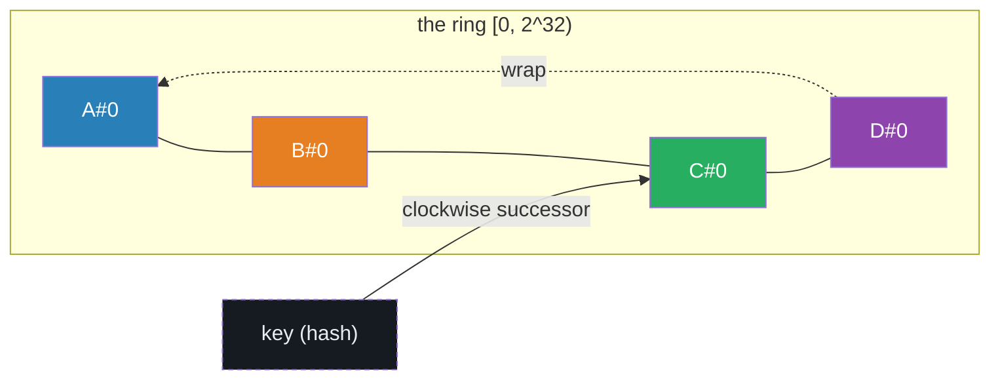
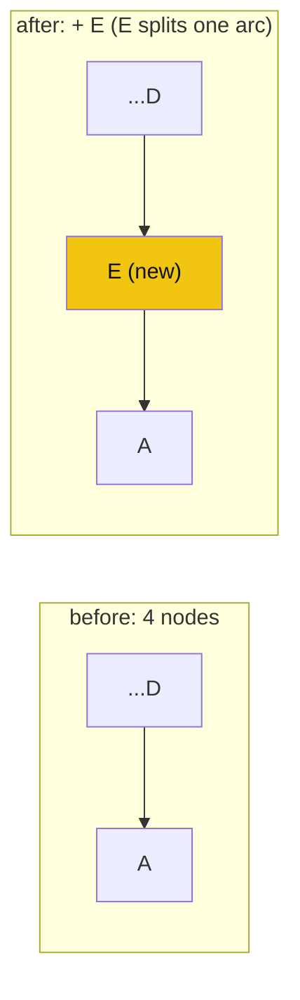
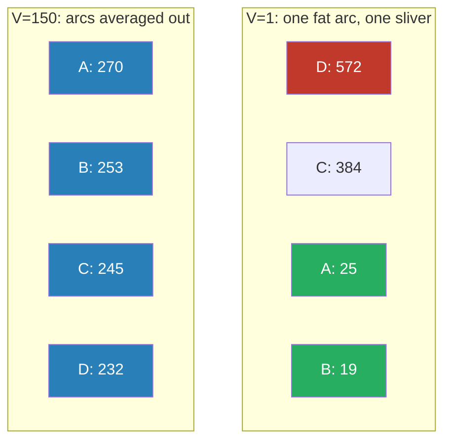

# CONSISTENT_HASHING_LB — Consistent Hashing for Load Balancing

> A **concept bundle**: this guide + [`consistent_hashing_lb.py`](./consistent_hashing_lb.py) + [`consistent_hashing_lb.html`](./consistent_hashing_lb.html).
> Every number below is printed by the `.py` (the single source of truth) and recomputed live by the `.html`. Nothing is hand-computed.
> Interactive companion: **[`consistent_hashing_lb.html`](./consistent_hashing_lb.html)**. 🔗 Back to [all tutorials](../index.html).

---

## 0. Why this exists: a roulette wheel, not a reshuffle

Picture a casino roulette wheel with `2^32` slots. To place a server on the wheel, **hash its name**; to place a key, **hash the key**. A key "belongs to" the first server you meet walking **clockwise** from the key's slot. That is the whole algorithm.

Now add a server. Naive `hash(key) % N` **shatters**: bumping `N` from 4 to 5 recomputes *every* key's modulus, so ~80% of keys (the `N/(N+1)` fraction) fly to a new server — a thundering herd of cache misses and repartitions.

**Consistent hashing** does *not* recompute the world. The new server `E` is hashed onto the wheel like everything else. The *only* keys that move are the ones whose slots now fall under `E`'s arc (between `E` and the previous server). That is `K/N` keys on average — **1/N as much churn as mod-hash**. That is the property that makes it the backbone of **Dynamo**, **Cassandra**, **Memcached**, **Chord**, and every sharded cache. 🔗 It pairs naturally with quorum replication — see [`QUORUM_RW.md`](./QUORUM_RW.md).

The second idea is **virtual nodes** (a.k.a. *replicas*). With one slot per server, randomness gives some servers a fat arc and others a sliver → badly skewed load. Fix: place each server `V` times (`V = 150..200`). By the law of large numbers each server's total arc converges to `1/N` of the ring, and load balances to within ~10%.

| Concept | Definition |
|---|---|
| **ring** | the integer circle `[0, 2^32)`. Positions are hash outputs. |
| **node** (server) | a physical machine. Named `A, B, C, D, E` here. |
| **key** | anything we want to place (user id, cache entry…). `key-000`..`key-999`, `K = 1000`. |
| **hash(x)** | deterministic 32-bit hash `uint32(MD5(x)[:4])` ∈ `[0, 2^32)`. |
| **position** | a hash output; where a node-vnode or key sits on the ring. |
| **successor** (clockwise) | walking the ring in increasing-position order, wrapping `2^32 → 0`. A key's owner = its successor node. |
| **arc** | the contiguous slice of ring a node *owns* = from its (virtual) position back to the previous position clockwise. |
| **mod-hash** | naive baseline: `owner(key) = hash(key) % N`. Re-shards almost everything when `N` changes. |
| **consistent** | `owner(key) = successor(hash(key))`. Re-shards only the changed arc. |
| **virtual node** (vnode) | a single physical node hashed at `V` positions. More vnodes = smoother arcs = balanced load. Default `V = 150`. |
| **remapped** | a key whose owner *changes* after a membership event. |
| **K / N** | keys / nodes. Expected remap on a join ≈ `K/N`. |

> **Paper**: Karger, Lehman, Leighton, Panigrahy, Levine, Lewin (STOC 1997), *"Consistent Hashing and Random Trees."* Proves: adding/removing one node moves only `K/N` keys (tight bound); load imbalance is `O(log N)` w.h.p. for 1 vnode and improves with replicas. Production: DeCandia et al. (2007, *Dynamo*), Lakshman & Malik (2010, *Cassandra*, 256 vnodes/node), Stoica et al. (2001, *Chord*). Textbook: Kleppmann, *DDIA*, Ch.6.

---

## 1. The scenario

`K = 1000` keys named `key-000`..`key-999`. `N = 4` initial nodes `A, B, C, D`. Node `E` joins in §3; `B` leaves in §4. Default `V = 150` vnodes/node. Ring = `2^32`. **Deterministic**: every hash uses MD5 (seed-free, byte-identical across processes *and* across Python/JS — Python's built-in `hash()` is randomized per-process via `PYTHONHASHSEED`, which would make a "consistent" hash *inconsistent*, the classic footgun).



A key is placed at its hash position; its owner is the first node met walking clockwise (wrap included).

---

## 2. Section A — mod-hash vs consistent hashing: the whole point

**Rule (mod-hash):** `owner(key) = hash(key) % N`.
**Rule (consistent):** `owner(key) = successor(hash(key))` on the ring.

Add a 5th node `E` (`N: 4 → 5`) and count how many keys change owner.

> From `consistent_hashing_lb.py` Section A:

```
Naive mod-hash:   owner(key) = hash(key) % N
  remapped keys going 4 -> 5 nodes:  815 / 1000 =  81.5%   (expected ~ N/(N+1) =  80.0%)

Consistent hash:  owner(key) = successor of hash(key) on ring
  remapped keys going 4 -> 5 nodes:  179 / 1000 =  17.9%   (expected ~ 1/(N+1) =  20.0%)

Side by side (bar = 10 keys):
  mod-hash   [############################################################################] 815
  consistent [#################                                                            ] 179

Consistent hashing remaps 4.6x FEWER keys. That is the whole reason it exists.

[check] every remapped key moved ONTO the new node E (=179):  OK
[check] mod-hash remap fraction 0.815 ~ N/(N+1)=0.800 and consistent 0.179 ~ 1/(N+1)=0.200:  OK
```

**Why mod-hash fails:** `hash(key) % 4 != hash(key) % 5` for `N/(N+1) = 80%` of keys — by CRT, `k%4 == k%5` only on `4` of `20` residues, so remap probability `= 1 − 4/20 = 0.80`. Observed `815/1000 = 81.5%`, right on the prediction.

**Why consistent hashing wins:** the new node `E` carves out its own arc; only keys landing in that arc move. Expected `1/(N+1) = 20%` of keys; observed `179/1000 = 17.9%`. **4.6× less churn.**

🔗 Watch both bars redraw live in **[panel ①](./consistent_hashing_lb.html)** as you add/remove nodes.

---

## 3. Section B — ring construction (nodes at virtual-node positions)

Each physical node is hashed `V` times → `V` virtual-node positions. With tiny `V = 3` and 4 nodes, the ring has 12 entries:

> From `consistent_hashing_lb.py` Section B:

```
Ring has 12 entries (virtual nodes). Arcs (sorted clockwise):

  #      position   node   arc / 2^32
----------------------------------------
  0    1761541434      B        11.5%
  1    2255709714      D         1.4%
  2    2313904738      B         5.2%
  3    2538429283      C         1.9%
  4    2617948611      D         0.2%
  5    2627254927      A         8.0%
  6    2969671659      B         3.1%
  7    3103869100      A         7.2%
  8    3414233331      C         8.9%
  9    3796934404      D         5.6%
 10    4037693931      C         3.1%
 11    4169070134      A        43.9%
----------------------------------------

Walk a few sample keys to their owners (clockwise successor):

      key     hash(key)  owner
----------------------------------
  key-000    3292498206      C
  key-001     544643647      B
  key-002    4052209398      A
  key-042    1629219438      B
  key-500     993819627      B
  key-999    3818770834      C
----------------------------------

GOLD (pinned for consistent_hashing_lb.html, V=3, nodes A B C D):
  owner(key-000) = C
  owner(key-001) = B
  owner(key-002) = A
  owner(key-042) = B
  owner(key-500) = B
  owner(key-999) = C
[check] ring lookups deterministic across calls:  OK
```

**How to read it:** from `hash(key)`, walk the ring clockwise (positions increasing, wrapping past `2^32` to `0`). The first virtual node you meet names the owning **physical** node. Notice the arcs are *wildly* uneven at `V = 3` (`A` owns a `43.9%` slice from entry 11 → wrap → entry 0, while `D` owns a `0.2%` sliver). That skew is exactly what virtual nodes cure (§5). 🔗 See the live ring in **[panel ②](./consistent_hashing_lb.html)**.

---

## 4. Section C — node join (only the new node's arc moves)

Add node `E` to `{A,B,C,D}`. Only keys whose hash now falls under `E`'s arc remap — and every one of them moves *onto* `E` (a join never moves a key to a third node).

> From `consistent_hashing_lb.py` Section C:

```
Before: nodes ['A', 'B', 'C', 'D']. After: + E. Remapped = 179 keys (expected K/(N+1) = 200).

Sample of keys that moved to E (key: old_owner -> E):

  key-008: B -> E   (hash 3906773263, now under E's arc)
  key-011: A -> E   (hash 2043839365, now under E's arc)
  key-012: C -> E   (hash 415444162, now under E's arc)
  ...
  key-031: D -> E   (hash 3417350994, now under E's arc)
  ... and 169 more.

Where the moved keys came from (donors to E):

   donor  keys given   share
       A          62   34.6%
       C          50   27.9%
       D          38   21.2%
       B          29   16.2%

Expected K/(N+1) = 200.0; observed = 179; band = [100, 300].
[check] observed within +/-50% of K/N:  OK
[check] every moved key's new owner == 'E' (a join only ever adds):  OK
```

The `179` remapped keys are donated roughly in proportion to each survivor's arc length (`A` gave the most, `B` the least). **Gold check:** the count lands within ±50% of `K/(N+1) = 200` — the defining property of consistent hashing. 🔗 Add `E` yourself in **[panel ③](./consistent_hashing_lb.html)** and watch only its arc light up.



---

## 5. Section D — node departure (B's keys flow to the next survivor)

Remove node `B`. Exactly `B`'s old keys move — each to its **next clockwise surviving** node. No other key is touched.

> From `consistent_hashing_lb.py` Section D:

```
Before: nodes ['A', 'B', 'C', 'D']. Remove B. B held 253 keys.

After removal, exactly 253 keys moved (== B's old keys).

Where B's keys went (each key's next clockwise survivor):

   new owner    keys   share
           A     106   41.9%
           C      82   32.4%
           D      65   25.7%

Sample remap (key: B -> next survivor):

  key-000: B -> A   (hash 3292498206)
  key-007: B -> A   (hash 1395699225)
  key-008: B -> C   (hash 3906773263)
  ...
  key-028: B -> C   (hash 1756782065)
  ... and 245 more.

[check] moved set == keys formerly on B:  OK  (253 == 253)
[check] B's load ~ K/N = 250 (observed 253, band [100, 400]):  OK
```

**Invariant:** the set of moved keys equals *exactly* the keys formerly on `B` (`253 == 253`). A departure is the mirror image of a join: `B`'s arc is absorbed by its clockwise neighbors in proportion to where `B`'s keys hash. `B` had held `253 ≈ K/N = 250` keys — confirming that **every node carries about `K/N` keys**, so removing one reshuffles about `K/N` of them. 🔗 Remove a node in **[panel ③](./consistent_hashing_lb.html)** and watch the inflow.

---

## 6. Section E — virtual nodes cure the load skew (V=1 vs V=150)

With `V = 1` vnode per node, each node gets **one random arc** — arc lengths follow a Dirichlet distribution, wildly uneven, so load is catastrophically skewed. Raise `V` and each node's *total* arc averages out; by `V = 150` the load is balanced within ~10%.

> From `consistent_hashing_lb.py` Section E:

```
V =   1 vnodes/node  ->  load by node: {'A': 25, 'B': 19, 'C': 384, 'D': 572}
                 max/min = 30.11x,  CoV = 0.950
V =   3 vnodes/node  ->  load by node: {'A': 58, 'B': 561, 'C': 176, 'D': 205}
                 max/min = 9.67x,  CoV = 0.751
V =  50 vnodes/node  ->  load by node: {'A': 261, 'B': 229, 'C': 289, 'D': 221}
                 max/min = 1.31x,  CoV = 0.108
V = 150 vnodes/node  ->  load by node: {'A': 270, 'B': 253, 'C': 245, 'D': 232}
                 max/min = 1.16x,  CoV = 0.055

GOLD @ V=150: max/min = 1.164, CoV = 0.0551
[check] balanced within ~10% (CoV<0.12 and max/min<1.25):  OK
```

| V (vnodes/node) | max/min load | CoV (σ/μ) | verdict |
|---:|---:|---:|---|
| 1 | 30.11× | 0.950 | disastrous — one node holds 572 keys, another 19 |
| 3 | 9.67× | 0.751 | still badly skewed |
| 50 | 1.31× | 0.108 | nearly balanced |
| **150** | **1.16×** | **0.055** | balanced within ~10% ✅ |

At `V = 1` the busiest node holds **572 keys** while the quietest holds **19** — a 30× spread. By `V = 150` the spread collapses to `1.16×` and CoV (coefficient of variation) drops below `0.06`. That is why **Cassandra** defaults to 256 and **Memcached** to 160–200 vnodes/node. 🔗 Drag the vnode slider in **[panel ④](./consistent_hashing_lb.html)** and watch the bars even out.



---

## 7. The footguns (what bites you in production)

1. **Never use Python's built-in `hash()`.** It is randomized per process (`PYTHONHASHSEED`). A "consistent" hash that changes every restart is useless. Use a cryptographic/seed-free digest (MD5/SHA1 of a string) — exactly what `h32()` here does.
2. **Too few vnodes ⇒ hot spots.** `V = 1` gave a 30× imbalance here. Real clusters want `V ≥ 150`.
3. **Too many vnodes ⇒ big routing tables / lookup cost.** The ring has `V·N` entries; `bisect` lookup is `O(log(V·N))`. `V = 1000` on 10k nodes = 10M entries — fine for `bisect`, painful for full replication of the table. 150–256 is the sweet spot.
4. **Collisions on a small ring.** With `2^32` slots and `V·N` vnodes, collision probability is `~(V·N)²/(2·2^32)`. At `150·4 = 600` entries it's ~`4e-5` (negligible); at scale, prefer `2^64` (e.g. SipHash-64 / xxhash64) like Cassandra did after `2^32` caused rebalancing bugs.

🔗 For how these rings compose with replication and quorums, see [`QUORUM_RW.md`](./QUORUM_RW.md); for ring-based membership churn, [`GOSSIP_PROTOCOL.md`](./GOSSIP_PROTOCOL.md).

---

> **Gold checks** (all reproduced live in the `.html`):
> - §A: consistent remap (`179/1000 = 17.9%`) ≈ `1/(N+1) = 20%`; mod-hash remap (`815/1000 = 81.5%`) ≈ `N/(N+1) = 80%`. ✅
> - §C: join remap (`179`) ≈ `K/(N+1) = 200`, every moved key lands on `E`. ✅
> - §D: departure moves *exactly* `B`'s `253` keys ≈ `K/N = 250`. ✅
> - §E: at `V = 150`, max/min `1.164` and CoV `0.055` — balanced within ~10%. ✅
