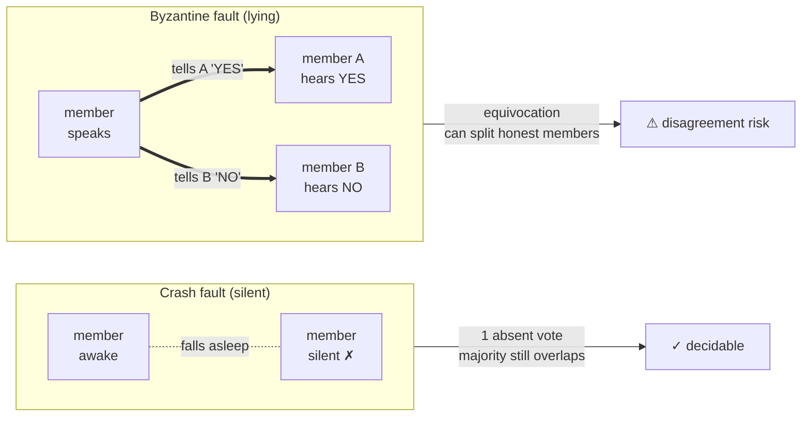
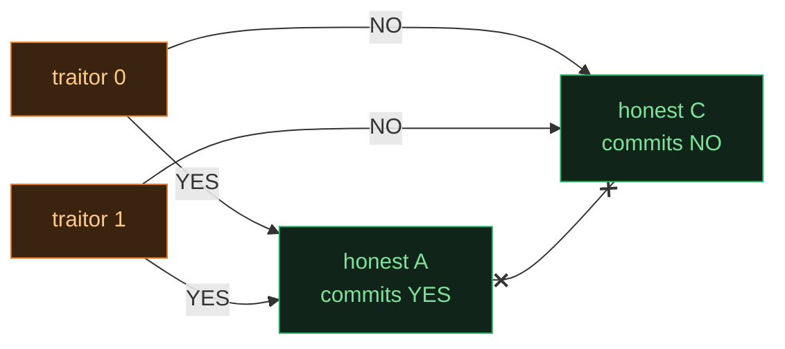
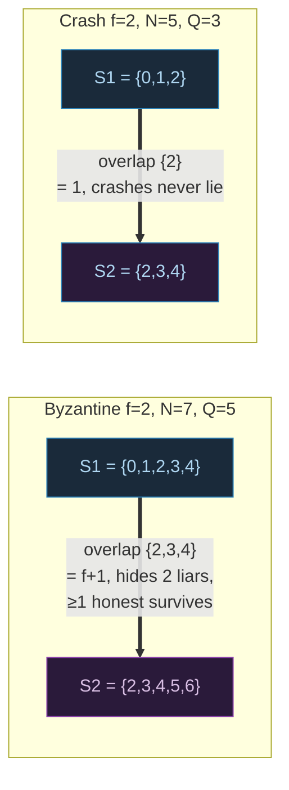

# Crash vs Byzantine — Failure Models & Why `2f+1` ≠ `3f+1`

> A concept bundle for distributed systems. Every number below is printed by
> **`crash_vs_byzantine.py`** (pure Python stdlib, run with `python3 crash_vs_byzantine.py`)
> and recomputed live in **`crash_vs_byzantine.html`**. This guide never
> hand-computes anything — it cites the `.py` output verbatim.
>
> 🔗 Interactive companion: `crash_vs_byzantine.html` &nbsp;|&nbsp; Source of truth: `crash_vs_byzantine.py`

---

## 0. The one-paragraph version

A node in a distributed system can fail two ways, and they are **not equally bad**:

- **Crash fault** — the node goes *silent*. It stops sending messages, may later recover and rejoin, but it **never lies**. A crashed node is an *absent* node.
- **Byzantine fault** — the node stays online and **behaves arbitrarily**: it can lie, forge, equivocate (tell A "yes" and B "no" simultaneously), delay, reorder, or collude with other faulty nodes. A Byzantine node is an *adversarial* node.

Because lies are strictly worse than silence, they demand a strictly bigger cluster:

| | crash (CFT) | Byzantine (BFT) |
|---|---|---|
| **min nodes to tolerate `f` faults** | `2f+1` | `3f+1` |
| **quorum size** | majority `⌊N/2⌋+1` | `>2/3` supermajority `⌈(2N+1)/3⌉` |
| **protocols** | Paxos, Raft, Zab | PBFT, Tendermint, HotStuff |
| **cost of lies** | — | `3f+1 − (2f+1) = f` extra replicas |

The rest of this guide *derives* those thresholds from first principles and shows
exactly where the extra `f` nodes come from.

> From `crash_vs_byzantine.py` Section E (comparison table):
> ```text
> | family | model | min N | faults tolerated f = | quorum size       | canonical protocols            |
> |--------|-------|-------|----------------------|-------------------|--------------------------------|
> | CFT    | crash | 2f+1  | (N-1)//2             | f+1  (majority)   | Paxos, Raft, Zab, ZooKeeper    |
> | BFT    | byz   | 3f+1  | (N-1)//3             | 2f+1 (>2/3 supermaj.) | PBFT, Tendermint, HotStuff, DiemBFT |
> ```

---

## 1. The town-council intuition

Imagine a town council of `N` members that must agree on one decision. Some members are unreliable:



- When a member **crashes**, the council just loses a vote. The remaining live members can still form a **majority**, and any two majorities share at least one member — that shared member carries the decision forward. Crashed members never contradict anything, so **one overlapping witness is enough**.
- When a member **lies**, the shared witness might *itself* be a traitor. So the overlap must be big enough to hide all `f` traitors and still leave **at least one honest** witness. That forces a bigger quorum, and a bigger cluster.

---

## 2. Section A — the crash fault model (`N=5, f=2`): `2f+1` is enough

A crash-tolerant cluster only needs to answer: *are there enough live nodes to form a quorum?* Faulty nodes are silent, never deceptive, so a strict majority suffices.

> From `crash_vs_byzantine.py` Section A:
> ```text
>   cluster:   [0X] [1X] [2 ] [3 ] [4 ]
>
> N = 5,  f = 2 (crashed),  alive = 3  [2, 3, 4]
> quorum (majority) = floor(N/2)+1 = floor(5/2)+1 = 3
>
> alive (3) >= quorum (3)?  YES -> progress is possible
>
> The general crash bound:
>   To tolerate f crashes we need  N >= 2f+1.
>   Here 2f+1 = 2*2+1 = 5  = N.  Bare minimum, exactly met.
>   faults this N tolerates = (N-1)//2 = (5-1)//2 = 2
>
> WHY a majority is enough (the overlap argument):
>   Two majorities of a 5-node cluster each have >= 3 members.
>   Worst-case overlap = 2*quorum - N = 2*3 - 5 = 1 node.
>   That 1 overlapping member was in BOTH decisions, so it carries the
>   latest committed value forward. Crashed members never contradict it
>   (they are silent), so 1 honest witness is sufficient. -> CFT safe.
>
> [check] N (5) == 2f+1 (5) and quorum (3) == f+1 (3):  OK
> ```

**Key takeaway.** With crashes, the safety anchor is *one overlapping node*, and that node is honest by definition (crashes don't forge). The math collapses to **`N ≥ 2f+1`**, quorum **`f+1`**.

---

## 3. Section B — the Byzantine fault model (`N=5, f=2`): `2f+1` is NOT enough

Now the faulty nodes stay in the room and **lie**. Each honest node must collect enough responses to be *sure* no traitor can fool two honest nodes into disagreeing. The liveness bound is the same — an honest node can wait for at most `N−f` responses (up to `f` traitors may stay silent) — but the *safety* bound fails.

> From `crash_vs_byzantine.py` Section B:
> ```text
>   cluster:   [0!] [1!] [2 ] [3 ] [4 ]
>
> N = 5,  f = 2 (Byzantine),  honest = 3  [2, 3, 4]
>
> Liveness bound: an honest node can wait for at most N-f responses
>   (up to f traitors may stay silent). N-f = 5-2 = 3.
>   So each honest node commits after hearing from a set of >= 3 nodes.
>
> ATTACK: the 2 traitors [0, 1] tell different stories.
>   traitor 0 tells honest A:   'I vote YES'
>   traitor 1 tells honest A:   'I vote YES'
>   traitor 0 tells honest C:   'I vote NO '
>   traitor 1 tells honest C:   'I vote NO '
>
>   honest A hears 3 responses: {A:YES, 0:YES, 1:YES}  -> commits YES
>   honest C hears 3 responses: {C:NO , 0:NO , 1:NO }  -> commits NO
>   => two honest nodes DISAGREE. Safety violated with N=5, f=2.
>
> ROOT CAUSE: the two response sets (size N-f=3) overlap in only
>   2*(N-f) - N = 2*3 - 5 = 1 node, and that node can be a traitor.
>   With N=5 the overlap is 1, and f=2 traitors can occupy it -> unsafe.
>
> [check] max Byzantine tolerated by N=5: (N-1)//3 = 1  (< 2)  -> N too small:  FAILS as shown
> ```



**The equivocation attack.** Two traitors, each talking to two honest nodes, can manufacture two *different* 3-vote majorities. `N=5` cannot stop this. We need a bigger cluster — derived next.

---

## 4. Section C — why `3f+1`: the safety derivation, step by step

This is the central result (Lamport, Shostak & Pease, 1982; inherited by PBFT). We reason about **one round** of message exchange.

> From `crash_vs_byzantine.py` Section C:
> ```text
> Step 1. Of N nodes, up to f are Byzantine. So the HONEST count is
>         at least  N - f.
>
> Step 2. LIVENESS: an honest node cannot wait forever. Up to f nodes
>         may stay silent (Byzantine can omit messages), so it proceeds
>         once it has heard from  N - f  nodes. Call each honest node's
>         heard-set S, with |S| = N - f.
>
> Step 3. Of those N - f heard nodes, at most f are Byzantine, so at
>         least  (N - f) - f = N - 2f  of them are HONEST.
>
> Step 4. SAFETY: take two honest nodes with heard-sets S1, S2, each of
>         size N - f. By inclusion-exclusion their overlap is at least
>         |S1 ∩ S2| >= |S1| + |S2| - N = 2(N - f) - N = N - 2f.
>
> Step 5. The overlap must contain at least ONE honest node -- otherwise
>         f traitors could fill the entire overlap and split the two
>         honest nodes (exactly the Section B attack). So we need
>             (overlap honest count) >= 1
>         The overlap has N - 2f nodes, of which at most f are traitors,
>         so honest in overlap >= (N - 2f) - f = N - 3f. Requiring >= 1:
>             N - 3f >= 1   <=>   N >= 3f + 1.
>
> Step 6. EQUIVALENTLY (the textbook one-liner): require the overlap
>         itself to be strictly larger than f, so it cannot be all-traitor:
>             N - 2f > f   <=>   N > 3f   <=>   N >= 3f + 1.
>
> Worked numbers for f = 2:
>    3f+1 = 7   <- minimum safe N
>    at N = 7: honest >= N-f = 5,  heard-set size N-f = 5,
>    overlap >= N-2f = 3,  honest in overlap >= N-3f = 1 >= 1.  SAFE.
>
> Crucially, the SAME derivation for CRASH faults stops at Step 4:
> crashed nodes never lie, so an overlap of just 1 (any node, honest
> by definition since crashes don't forge) is enough -> N >= 2f+1.
>
> [check] N-3f = 7-6 = 1 >= 1  and  N (7) >= 3f+1 (7):  OK
> ```

### Why the two thresholds differ, in one line

The derivation is *identical* up to Step 4 — the divergence is **Step 5**:

| | crash model | Byzantine model |
|---|---|---|
| can a node in the overlap lie? | **no** (crashes don't forge) | **yes** |
| required overlap | `≥ 1` (any node) | `> f` (must hide all traitors + 1) |
| minimal `N` | `2f+1` | `3f+1` |

🔗 See Section D for the quorum-size view of the same result.

---

## 5. Section D — quorum intersection: `f+1` vs `2f+1` quorums

A **quorum** is the smallest set that may legally make a decision. Each model picks a quorum size so that **any two quorums overlap by enough** to anchor safety (inclusion-exclusion: `|S1 ∩ S2| ≥ 2·Q − N`).

> From `crash_vs_byzantine.py` Section D:
> ```text
> Crash model   : quorum = floor(N/2)+1   (a strict majority)
> Byzantine model: quorum = ceil((2N+1)/3) (a strict >2/3 supermajority)
>
> Using the minimal N for each model:
>
> | model | f | min N | quorum Q | overlap = 2Q-N | honest in overlap | safe? |
> |---|---|---|---|---|---|---|
> | crash | 0 | 1     | 1        | 1              | 1                 | OK    |
> | byz   | 0 | 1     | 1        | 1              | 1                 | OK    |
> | crash | 1 | 3     | 2        | 1              | 1                 | OK    |
> | byz   | 1 | 4     | 3        | 2              | 1                 | OK    |
> | crash | 2 | 5     | 3        | 1              | 1                 | OK    |
> | byz   | 2 | 7     | 5        | 3              | 1                 | OK    |
> | crash | 3 | 7     | 4        | 1              | 1                 | OK    |
> | byz   | 3 | 10    | 7        | 4              | 1                 | OK    |
> ```

Notice how the **"honest in overlap"** column stays pinned at exactly `1` for every safe row — that `1` honest witness *is* the safety guarantee. The quorum size is whatever makes that column come out to `1` in the worst case.

### Concrete worst-case intersection (`f=2`)

> From `crash_vs_byzantine.py` Section D (Byzantine `f=2`, `N=7`, `Q=5`):
> ```text
>   universe {0..6},  quorum size Q=5
>   S1 = [0, 1, 2, 3, 4]
>   S2 = [2, 3, 4, 5, 6]   (shifted to minimize overlap)
>   S1 ∩ S2 = [2, 3, 4]   |overlap| = 3
>   traitors that could hide in overlap <= f = 2, so honest in overlap >= 1  -> SAFE
> ```
> Same picture, crash `f=2` (`N=5`, `Q=3`):
> ```text
>   universe {0..4},  quorum size Q=3
>   S1 = [0, 1, 2]
>   S2 = [2, 3, 4]   (shifted to minimize overlap)
>   S1 ∩ S2 = [2]   |overlap| = 1
>   crashes never forge, so all 1 overlapping node(s) are honest -> SAFE
> ```



🔗 Try shifting the second quorum in `crash_vs_byzantine.html` Panel ② — the overlap floor `2Q−N` is recomputed live.

---

## 6. Section E — real systems and their thresholds

> From `crash_vs_byzantine.py` Section E:
> ```text
> Real deployments (typical node counts):
> | system       | protocol  | N  | model | f tolerated | quorum needed |
> |--------------|-----------|----|-------|-------------|--------------|
> | etcd/K8s     | Raft      | 3  | crash | 1           | 2            |
> | etcd/K8s     | Raft      | 5  | crash | 2           | 3            |
> | ZooKeeper    | Zab       | 5  | crash | 2           | 3            |
> | PBFT (1999)  | PBFT      | 4  | byz   | 1           | 3            |
> | Tendermint   | Tendermint | 7  | byz   | 2           | 5            |
> | HotStuff     | HotStuff  | 7  | byz   | 2           | 5            |
>
> Read it as: a 5-node Raft cluster survives 2 crashed members and
> needs 3 votes; a 7-node Tendermint validator set survives 2 traitors
> and needs 5 (=2f+1) agreeing votes. The 'cost of lies' is the extra
> f nodes: 3f+1 - (2f+1) = f more replicas for the same f.
> ```

A 5-node Raft cluster survives **2 crashed** members and needs **3** votes; a
7-node Tendermint validator set survives **2 traitors** and needs **5** votes.
For the *same* `f=2`, Byzantine costs `7 − 5 = 2` extra replicas — exactly `f`.

---

## 7. Gold check (pinned values for the `.html`)

The `.html` recomputes these scalars in JavaScript from the **identical** formulas and asserts they match the `.py` output. A green `check: OK` badge means the two implementations agree byte-for-byte.

> From `crash_vs_byzantine.py` GOLD CHECK:
> ```text
> Canonical point: f = 2
>   crash    min N  = 2f+1       = 5
>   byzantine min N = 3f+1       = 7
>   crash    quorum = floor(N/2)+1   (N=5) = 3   = f+1
>   byzantine quorum = ceil((2N+1)/3) (N=7) = 5   = 2f+1
>   crash    quorum overlap (2Q-N)        = 1
>   byzantine quorum overlap (2Q-N)       = 3  (= f+1)
>   byzantine honest in overlap (overlap-f)= 1  (>=1 -> safe)
>
> Slider default point: N = 7
>   crash_quorum(7)    = floor(7/2)+1     = 4
>   byz_quorum(7)      = ceil((2*7+1)/3) = 5
>   max_crash_tolerated(7)  = (7-1)//2  = 3
>   max_byz_tolerated(7)    = (7-1)//3  = 2
>
> GOLD scalars (for a compact .html check):
>   byz_quorum(N=7)              = 5
>   crash_quorum(N=7)            = 4
>   byz_min_n(f=2)               = 7
>   crash_min_n(f=2)             = 5
>   cost_of_lies(f=2) = 3f+1-2f-1 = 2
>
> [check] all gold identities reproduce from the formulas:  OK
> ```

---

## 8. References

- **Lamport, Shostak, Pease (1982)** — "The Byzantine Generals Problem", ACM TOCS. Proved `N ≥ 3f+1` is necessary for oral-message Byzantine agreement.
- **Castro & Liskov (1999)** — "Practical Byzantine Fault Tolerance" (PBFT), OSDI. The practical `3f+1` protocol.
- **Lamport (1998)** — "The Part-Time Parliament" (Paxos). Crash-tolerant, `2f+1`.
- **Ongaro & Ousterhout (2014)** — "In Search of an Understandable Consensus Algorithm" (Raft), USENIX ATC. Crash-tolerant, `2f+1`.
- **Yin et al. (2019)** — HotStuff, PODC. Linear-view-change `3f+1` BFT.
- **Kleppmann (2017)** — *Designing Data-Intensive Applications*, Ch. 9 (Consistency & Consensus).
- **Tanenbaum & Van Steen** — *Distributed Systems*, Ch. 8 (Fault Tolerance).

🔗 Back to `crash_vs_byzantine.html` for the interactive sliders & intersection view.
