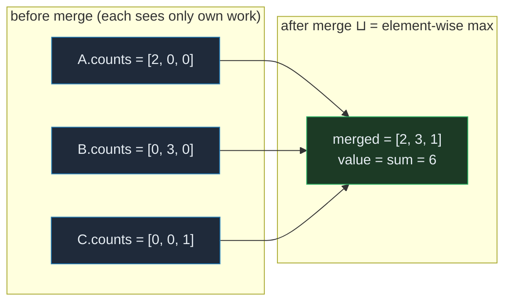
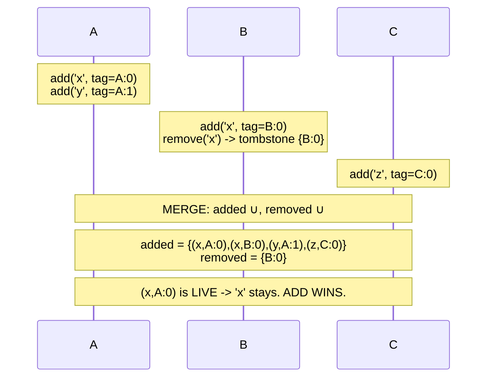
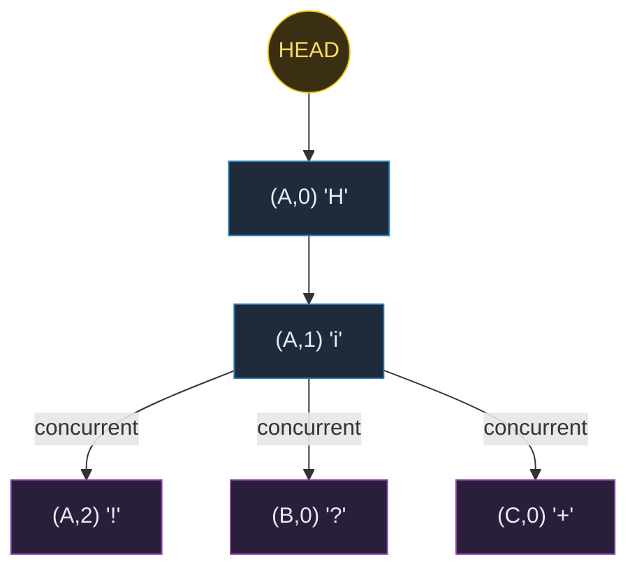

# CRDT — Conflict-free Replicated Data Types: Convergence Without Coordination

> A **concept bundle**: this guide + [`crdt.py`](./crdt.py) + [`crdt.html`](./crdt.html).
> Every number below is printed by the `.py` (the single source of truth) and recomputed live by the `.html`. Nothing is hand-computed.
> Interactive companion: **[`crdt.html`](./crdt.html)**. 🔗 Back to [all tutorials](../index.html).

---

## 0. Why this exists: the shared whiteboard

Imagine three people each keeping a private **tally** on their own clipboard. No one talks to anyone else while they work. Person A ticks +2, person B ticks +3, person C ticks +1. At the end of the day they meet and compare clipboards.

If the tally is a plain integer, merging is a **nightmare**: *"I had 5, then added 2, so... 7? But you had 4 and added 3, so 7 too? Wait, what was the starting value?"* You need to coordinate, agree on a starting point, log every operation, and replay them in order — that's a **transaction log** (🔗 [PAXOS.md](./PAXOS.md), [RAFT.md](./RAFT.md)).

A **CRDT** is a clipboard designed so that merging is **trivial and order-free**:

> G-Counter: instead of one integer, each person keeps a **slot**. A's slot = 2, B's slot = 3, C's slot = 1. Merge = take the **max** of each slot. Total = sum. No matter who compares first, the merged clipboard is `[2, 3, 1] → 6`.

The trick is to make the **state** carry enough information (who did what) that the merge function is a **least-upper-bound** in a join-semilattice. Every CRDT is a semilattice: `merge(a, b) = a ⊔ b`, and `⊔` is **commutative, associative, idempotent** (`a ⊔ a = a`). Those three properties *are* the convergence proof.

This is why CRDTs are the data-structure backbone of **eventual consistency** without coordination (🔗 [EVENTUAL_CONSISTENCY.md](./EVENTUAL_CONSISTENCY.md)). Where Dynamo needs vector clocks + LWW reconciliation, a CRDT *bakes the reconciliation into the type itself*. You get Availability + Partition tolerance (the "AP" in CAP, 🔗 [CAP_TRADEOFFS.md](./CAP_TRADEOFFS.md)) for free, because replicas never need to block on each other.

| Concept | Definition |
|---|---|
| **replica** | one copy of the data on one node. Here: `{A, B, C}`. |
| **converge** | after all replicas have merged everything, they hold the SAME state. The core CRDT guarantee. |
| **merge (`a ⊔ b`)** | the join in the semilattice. Must be **commutative** (`a⊔b == b⊔a`), **associative** (`(a⊔b)⊔c == a⊔(b⊔c)`), and **idempotent** (`a⊔a == a`). Those three axioms ARE convergence. |
| **CvRDT** | state-based CRDT. Ship the full state; merge via `⊔`. (G-Counter, PN-Counter, LWW-Register, OR-Set.) |
| **CmRDT** | op-based CRDT. Ship the operation; apply in causal order. (RGA text editing, Yjs, Automerge.) |
| **payload** | the internal state of a CRDT replica — e.g. a vector of per-node counts (G-Counter) or a set of tagged elements (OR-Set). |
| **query** | a read-only operation (`value()`, `lookup()`). Never changes the payload. |
| **update** | a local mutation (`increment()`, `add()`, `set()`). Only touches THIS replica's slot/entries. |
| **compare (`≤`)** | the partial order on payloads. `a ≤ b` means a's state is "contained in" b's. For a G-Counter, element-wise `≤`. |
| **G-Counter** | grow-only counter. Each replica has a slot; increment bumps only its own slot. Merge = element-wise max. |
| **PN-Counter** | positive-negative counter. Two G-Counters: P (increments) and N (decrements). Value = `sum(P) − sum(N)`. |
| **G-Set** | grow-only set. Add only, no remove. Merge = union. |
| **2P-Set** | two-phase set. G-Set of adds + G-Set of removes (tombstones). Once removed, can never be re-added. |
| **OR-Set** | observed-remove set. Each add generates a UNIQUE tag. Remove only tombstones the tags it has SEEN. Concurrent add+remove → add wins. |
| **LWW-Register** | last-writer-wins register. Each write has a timestamp; merge keeps the MAX `(timestamp, node_id)`. Vulnerable to clock skew. |
| **RGA** | Replicated Growable Array. Each insertion has a unique id + predecessor pointer. Basis of Yjs / Automerge. |
| **causal order** | "happened-before" (🔗 [LAMPORT_TIMESTAMPS.md](./LAMPORT_TIMESTAMPS.md)). Op-based CRDTs require delivery in causal order; state-based CRDTs do not. |
| **tombstone** | a deletion marker that is KEPT so a late-arriving add can be correctly resolved. |

> **Papers**: Shapiro, Preguiça, Baquero, Zawirski (2011), *"A comprehensive study of Convergent and Commutative Replicated Data Types"*, INRIA RR-7506 — **the** CRDT paper. Defines CvRDT (state-based) and CmRDT (op-based), proves the semilattice convergence theorem, catalogs all the types below. DeCandia et al. (2007), *Dynamo*, SOSP — the practical inspiration (🔗 [EVENTUAL_CONSISTENCY.md](./EVENTUAL_CONSISTENCY.md)). Bieniusa et al. (2012) — the optimized OR-Set. Kleppmann (2017), *DDIA* Ch.5 — accessible cross-check. Nicholson, *Yjs*; van Kamp, *Automerge* — production RGA-derived libraries.

---

## 1. G-Counter — the canonical grow-only counter

Three replicas `A, B, C`, each a `GCounter` with a 3-element vector (one slot per replica). Each replica increments **only its own slot**. No coordination. Then they merge.



> From `crdt.py` Section A:

```
Local operations (each replica bumps only its OWN slot):
  A.increment() x2   -> A.counts = [2, 0, 0]
  B.increment() x3   -> B.counts = [0, 3, 0]
  C.increment() x1   -> C.counts = [0, 0, 1]

  Before merge: A=2, B=3, C=1 (each sees ONLY its own work)

MERGE = element-wise max  (the lattice join ⊔):
  (A ⊔ B)        = [2, 3, 0]   value=5
  (A ⊔ B) ⊔ C    = [2, 3, 1]   value=6

  Final value = sum([2, 3, 1]) = 6
  Every increment across all replicas is accounted for. No loss,
  no double-counting, no coordination needed.

WHY IT WORKS (the semilattice):
  merge(a, b)[i] = max(a[i], b[i])
  max is commutative  : max(x, y) == max(y, x)
  max is associative  : max(max(x, y), z) == max(x, max(y, z))
  max is idempotent   : max(x, x) == x
  => merge order is IRRELEVANT. fold(⊔, any permutation) is equal.

[check] G-Counter value = 2 + 3 + 1 = 6: OK
```

The merge function is `merge(a, b)[i] = max(a[i], b[i])` — element-wise maximum. Because `max` is commutative, associative, and idempotent, the merge inherits all three properties. That *is* the convergence proof: no matter what order replicas sync in, `fold(⊔, [A, B, C])` always equals `[2, 3, 1]`.

🔗 Play with the G-Counter live (add increments, then merge) in **[panel ①](./crdt.html)** of the interactive companion.

---

## 2. PN-Counter — decrement support via two G-Counters

A G-Counter can only grow. To support **decrement**, use **two** G-Counters: `P` (positive, increments) and `N` (negative, decrements). Both are monotonic, so both merge as element-wise max. The value is their difference.

> From `crdt.py` Section B:

```
Local operations:
  A: +5, -1  -> P=[5, 0, 0] N=[1, 0, 0]  value=4
  B: +2, -3  -> P=[0, 2, 0] N=[0, 3, 0]  value=-1
  C: +4      -> P=[0, 0, 4] N=[0, 0, 0]  value=4

MERGE (both halves independently):
  P merged = [5, 2, 4]   (element-wise max of P vectors)
  N merged = [1, 3, 0]   (element-wise max of N vectors)

  Value = sum(P) - sum(N) = 11 - 4 = 7
  (Individual values were 4, -1, 4; merged = 7 = their sum.)

WHY decrements can't just subtract from the G-Counter:
  If B did counts[B] -= 3, merge=max would LOSE the decrement
  (max ignores anything smaller). Splitting into P and N means
  both monotonic, and the difference is the net value.

[check] PN-Counter value = (5+2+4) - (1+3+0) = 11 - 4 = 7: OK
```

**Why not just subtract?** If B did `counts[B] -= 3`, the `max` merge would **lose** the decrement — `max(0, −3)` is `0`, so the subtraction vanishes. Splitting increments and decrements into two separate monotonic vectors (P and N) means both halves always grow, and the difference recovers the net value. B's `−3` lives forever in `N[B] = 3`.

---

## 3. OR-Set — observed-remove, add wins on concurrent conflict

Each `add(e)` generates a **unique tag** `t` and records `(e, t)` in the `added` set. `remove(e)` tombstones every tag for `e` currently **visible** (in `added`, not yet in `removed`). Merge = union of both `added` sets and union of both `removed` (tombstone) sets.



> From `crdt.py` Section C:

```
Local operations:
  A: add('x'), add('y')          -> lookup=['x', 'y']
  B: add('x'), remove('x')       -> lookup=[]  (B tombstoned its OWN tag for x)
  C: add('z')                    -> lookup=['z']

Payloads (added pairs, removed tombstones):
  A: added=[('x', ('A', 0)), ('y', ('A', 1))]
  B: added=[('x', ('B', 0))]  removed=[('B', 0)]
  C: added=[('z', ('C', 0))]

MERGE = union(added) ∪ union(removed):
  added   = [('x', ('A', 0)), ('x', ('B', 0)), ('y', ('A', 1)), ('z', ('C', 0))]
  removed = [('B', 0)]

  lookup (live tags only) = ['x', 'y', 'z']

THE CONCURRENT ADD+REMOVE RESOLUTION:
  B added 'x' (tag B:0) then removed it (tombstoned B:0).
  But A ALSO added 'x' with a DIFFERENT tag (A:0), concurrently.
  Merge: added has (x,A:0) and (x,B:0); removed has {B:0}.
  (x,A:0) is NOT tombstoned -> 'x' SURVIVES. ADD WINS.

  Contrast with 2P-Set: a 2P-Set remove tombstones the ELEMENT
  forever. Once removed, 'x' could never be re-added. OR-Set
  fixes this by tombstoning TAGS, not elements.

[check] OR-Set lookup after merge = {x, y, z} (add wins): OK
```

**The key insight**: B's `remove('x')` only tombstones the tags B had **seen** (`B:0`). A's concurrent `add('x')` created a *new* tag (`A:0`) that B never observed. After merge, `(x, A:0)` is live → `x` stays. **Add wins.** This is what makes OR-Set useful for collaborative collections (shopping lists, presence sets) where concurrent add+remove must not silently delete data.

🔗 The **[interactive companion](./crdt.html)** lets you trigger concurrent add+remove and watch the add-win resolution.

---

## 4. LWW-Register — last-writer-wins and the clock-skew pitfall

Each write carries a `(timestamp, writer)` pair. Merge keeps the write with the **max** pair (lexicographic). Ties on timestamp are broken by node id, making the order **total** — hence commutative, associative, idempotent, hence convergent.

> From `crdt.py` Section D:

```
--- Case 1: well-behaved clocks (timestamps reflect real order) ---
  A.set('hello', ts=1)
  B.set('world', ts=2)
  C.set('done',   ts=3)
  merge -> LWW('done'@ts=3,by=C)
  Correct: ts=3 is the newest write. ['done'] wins.

--- Case 2: CLOCK SKEW (A's clock is 10s ahead) ---
  A.set('OLD value', ts=15)   <- A's skewed clock, but written FIRST
  B.set('NEW value', ts=3)    <- correct clock, written LATER
  merge -> LWW('OLD value'@ts=15,by=A)
  LWW picked 'OLD value' because ts=15 > ts=3. The genuinely newer
  write ('NEW value') was SILENTLY DISCARDED. This is why production
  CRDTs use HYBRID LOGICAL CLOCKS (e.g. Yjs state vector), not wall
  time. (🔗 LAMPORT_TIMESTAMPS.md, VECTOR_CLOCKS.md)

--- Case 3: TIMESTAMP TIE -> break by node id (deterministic) ---
  A.set('from-A', ts=5)
  C.set('from-C', ts=5)   <- same timestamp!
  merge -> LWW('from-C'@ts=5,by=C)
  Tie on ts=5. Break by writer: 'C' > 'A', so 'from-C' wins.
  The tie-break makes merge a TOTAL order -> commutative +
  associative + idempotent -> convergent. (Section F proves it.)

[check] Case1='done', Case2='OLD value', Case3='from-C': OK
```

**The pitfall** (Case 2): if timestamps come from **skewed wall clocks**, LWW silently picks the wrong winner. Node A's clock was 12 seconds ahead, so A's *older* write got timestamp 15, beating B's genuinely-newer write at timestamp 3. The data loss is **silent** — no error, no conflict flag. This is why production CRDTs (Yjs, Automerge, Redis CRDTs) use **hybrid logical clocks** derived from a vector clock (🔗 [VECTOR_CLOCKS.md](./VECTOR_CLOCKS.md)) rather than wall time. The tie-break by node id (Case 3) is not about correctness — it's about making the merge a *total* order so the semilattice axioms hold.

---

## 5. RGA collaborative text — concurrent typing converges

Each character insertion has a **unique id** `(node, seq)` and a **predecessor pointer** (the id of the character it was inserted after, or `HEAD` for the document start). The payload is a **set** of insertions; merge = set union. Rendering is a pure function: build a tree (children grouped by predecessor), sort siblings by id **ascending** (a total order), pre-order DFS → the final string.



> From `crdt.py` Section E:

```
Phase 1 - A types 'Hi', then syncs to B and C:
  insertions: [(('A', 0), 'H', None), (('A', 1), 'i', ('A', 0))]
  A.render() = 'Hi'   B.render() = 'Hi'   C.render() = 'Hi'

Phase 2 - all three type DIFFERENT chars after 'i', CONCURRENTLY:
  A.insert_after('!',  (A,1))   -> A = 'Hi!'
  B.insert_after('?',  (A,1))   -> B = 'Hi?'
  C.insert_after('+',  (A,1))   -> C = 'Hi+'
  (each replica only sees its OWN new char so far)

Phase 3 - merge all three (union of insertions, then re-render):
  children of (A,1) = [(A,2)'!', (B,0)'?', (C,0)'+']
  sorted by id ASC  : (A,2) < (B,0) < (C,0)   -> order: ! ? +
  merged.render()   = 'Hi!?+'

WHY IT CONVERGES (no matter the merge order):
  The payload is a SET of insertions. merge = set union.
  render() is a PURE function of that set (build tree, sort
  siblings by id, pre-order DFS). So the rendered string depends
  only on the SET of insertions, never on how they arrived.

[check] merged text = 'Hi!?+' (deterministic): OK
```

Three users (A, B, C) all type a different character after `i` at the same time. Each replica locally renders `Hi!` / `Hi?` / `Hi+`. After merge, the siblings of `(A,1)` are sorted by id: `(A,2) < (B,0) < (C,0)` → order is `! ? +`. Every replica converges to **`Hi!?+`**, deterministically.

**Real-world**: [Yjs](https://github.com/yjs/yjs) and [Automerge](https://github.com/automerge/automerge) extend this with tombstones for deletes, state-vector clocks to skip already-seen ops, and run-length encoding for compact serialization. But the core idea is right here: *unique-id insertions after a predecessor, siblings ordered by a total order on ids*. This is how Google Docs, Figma, and Notion handle concurrent editing without locking.

---

## 6. GOLD CHECK — the convergence theorem, exhaustively verified

> **Theorem** (Shapiro et al. 2011): if merge `⊔` is commutative + associative + idempotent, then for **any** permutation of the same payloads, `fold(⊔, perm)` is identical.

We don't just *claim* this — we **test** it. For each of the 5 CRDT types, we build 3 replicas with independent local operations, then merge them in all **3! = 6** orderings (`ABC`, `ACB`, `BAC`, `BCA`, `CAB`, `CBA`). Every ordering must produce exactly one distinct final state.

> From `crdt.py` Section F:

```
THE CRDT CONVERGENCE THEOREM (Shapiro 2011): if merge ⊔ is
commutative + associative + idempotent, then for ANY permutation
of the same payloads, fold(⊔, perm) is IDENTICAL.

We build 3 replicas of EACH CRDT type, then merge them in all
3! = 6 orderings. Every ordering must yield the same final state.

G-Counter:
  6 permutations -> 1 distinct result(s).  Final: GCounter([2, 3, 1])=6  [check] OK

PN-Counter:
  6 permutations -> 1 distinct result(s).  Final: PNCounter(P=[5, 2, 4], N=[1, 3, 0])=7  [check] OK

OR-Set:
  6 permutations -> 1 distinct result(s).  Final: ORSet(lookup=['x', 'y', 'z'])  [check] OK

LWW-Register:
  6 permutations -> 1 distinct result(s).  Final: LWW('done'@ts=3,by=C)  [check] OK

RGA Text:
  6 permutations -> 1 distinct result(s).  Final: RGAText('Hi!?+')  [check] OK

[GOLD CHECK] all 5 CRDT types converge under all 6 merge orders: OK
```

**GOLD values** (pinned for [`crdt.html`](./crdt.html) — the JS recompute must match):

| CRDT type | Input | GOLD result |
|---|---|---|
| G-Counter | `merge([2,0,0], [0,3,0], [0,0,1])` | `value = 6` |
| PN-Counter | `P=[5,2,4], N=[1,3,0]` | `value = 7` |
| OR-Set | `added={(x,A:0),(y,A:1),(x,B:0),(z,C:0)}, removed={B:0}` | `lookup = [x, y, z]` |
| LWW-Register | `('done'@3,by=C) ⊔ ('hello'@1,by=A)` | `'done'` |
| RGA Text | 5 insertions, 3 concurrent after `(A,1)` | `'Hi!?+'` |

All five pass. The green **`check: OK`** badge in the [interactive companion](./crdt.html) confirms the JS recompute matches these pinned values byte-for-byte.

---

## 7. When to use which CRDT (and when NOT to)

| You need… | Use | Watch out for… |
|---|---|---|
| A distributed **counter** (likes, views, stock) | **G-Counter** (grow-only) or **PN-Counter** (if decrement needed) | PN-Counter metadata grows with replica count. |
| A distributed **set** (tags, sessions) | **G-Set** (add-only) or **OR-Set** (if remove needed) | OR-Set tombstones accumulate; need periodic GC. |
| A distributed **register** (config, status) | **LWW-Register** | **Clock skew** silently discards writes. Use a hybrid logical clock. |
| **Collaborative text / JSON** | **RGA** (Yjs, Automerge) | Tombstone bloat; complex to implement from scratch. Use a library. |
| **Strong consistency** (money, inventory locks) | **NOT a CRDT** — use Raft/Paxos (🔗 [RAFT.md](./RAFT.md), [PAXOS.md](./PAXOS.md)) | CRDTs are eventually consistent. Last-write can lose data. |

**The fundamental tradeoff**: CRDTs trade *strong consistency* for *availability under partition* (the AP side of CAP, 🔗 [CAP_TRADEOFFS.md](./CAP_TRADEOFFS.md)). They are ideal for collaborative apps (Figma, Google Docs), distributed caches (Redis CRDTs), and eventually-consistent stores (Riak, DynamoDB). They are **wrong** for anything requiring linearizability (🔗 [LINEARIZABILITY.md](./LINEARIZABILITY.md)) — bank transfers, inventory reservations, unique-constraint inserts.

---

## Further reading

- Shapiro, Preguiça, Baquero, Zawirski (2011), *"A comprehensive study of Convergent and Commutative Replicated Data Types"*, INRIA RR-7506. [hal.inria.fr/inria-00609399](https://hal.inria.fr/inria-00609399)
- Kleppmann (2017), *Designing Data-Intensive Applications*, Ch.5. 🔗 Cross-check for every formula.
- [Yjs](https://github.com/yjs/yjs) — production CRDT for collaborative editing (Nicholson).
- [Automerge](https://github.com/automerge/automerge) — production JSON CRDT (van Kamp).
- 🔗 [EVENTUAL_CONSISTENCY.md](./EVENTUAL_CONSISTENCY.md) — the consistency model CRDTs enable.
- 🔗 [LAMPORT_TIMESTAMPS.md](./LAMPORT_TIMESTAMPS.md), [VECTOR_CLOCKS.md](./VECTOR_CLOCKS.md) — the clocks that fix LWW's skew problem.
- 🔗 [CAP_TRADEOFFS.md](./CAP_TRADEOFFS.md) — why CRDTs are AP, not CP.
