# EVENTUAL_CONSISTENCY — Convergence, Stale Reads & Gossip Anti-Entropy

> A **concept bundle**: this guide + [`eventual_consistency.py`](./eventual_consistency.py) + [`eventual_consistency.html`](./eventual_consistency.html).
> Every number below is printed by the `.py` (the single source of truth) and recomputed live by the `.html`. Nothing is hand-computed.
> Interactive companion: **[`eventual_consistency.html`](./eventual_consistency.html)**. 🔗 Back to [all tutorials](../index.html).

---

## 0. Why this exists: the rumor mill

Imagine a piece of **gossip** spreading through a town. There is no town crier making one loud announcement. Instead, each person who hears the rumor periodically **whispers it to a random friend**. Given enough time everyone hears it — but for a while, different people will tell you different things.

That is eventual consistency. The **replicas** *are* the townspeople, and a **write** is the rumor. The background whispering is **anti-entropy** (gossip). The promise is *only* this:

> if nobody starts a *new* rumor, then *eventually* everyone agrees.

It promises **nothing about the meantime**:

- **Stale reads** — a friend gossip hasn't reached yet still tells the *old* story (§2).
- **Reordering** — two friends may hand you two rumors in the *wrong* order, so a value you watch can even go **backwards** (`0 → 2 → 1`) (§3).
- **No deadline** — "eventually" is not a bound; the convergence *time* is probabilistic (though, happily, only ~`log₂(N)` rounds) (§5).

To make "eventually everyone agrees" actually *true*, you need two things: (1) an **anti-entropy** mechanism that keeps spreading the rumor (gossip, Merkle-tree sync, read repair), and (2) a **deterministic merge rule** that yields the *same* final value no matter what *order* updates arrive in (last-writer-wins by version, or a CRDT). Without (2) — e.g. naive "last delivery wins" — the system can diverge forever (§3). Eventual consistency is eventual *only* when the merge is order-independent.

| Concept | Definition |
|---|---|
| **replica** | one copy of the data on one node. Here: `{A, B, C}` (or `N` nodes in §5). |
| **key (`X`)** | the thing being stored. We track ONE key, `X`, for clarity. |
| **write** | set `X` to a value, stamped with a **version** (logical timestamp; higher = newer). e.g. `X=1@v1`. |
| **version** | a per-write counter; the merge rule uses it to decide what is "newest" (🔗 [LAMPORT_TIMESTAMPS.md](./LAMPORT_TIMESTAMPS.md)). |
| **converge** | every replica holds the SAME `(value, version)` for `X`. |
| **anti-entropy** | any background process that reconciles divergent replicas. |
| **gossip** | epidemic-style anti-entropy — each node periodically swaps state with a RANDOM peer. *Push* = send; *Pull* = ask; *Push-pull* = exchange both ways. |
| **LWW** | last-writer-wins — the merge rule that keeps the update with the MAX version (tie-break deterministically). |
| **CRDT** | conflict-free replicated data type — a merge rule proven to converge for ANY delivery order. |
| **stale read** | a read returning an outdated value because anti-entropy hasn't reached that replica YET. |
| **reorder** | updates arriving at a replica in an order different from the one they were ISSUED in. |
| **read repair** | fix stale replicas on the fly — a read that detects divergence writes the newest value back. |
| **Merkle tree** | a hash tree over replica state; compare root hashes in O(1) to detect difference. |
| **convergence time** | gossip rounds until all replicas agree. For push-pull gossip it is ~`log₂(N)`. |

> **Papers**: Vogels (2009), *"Eventually Consistent"*, ACM Queue **7**(10) — the canonical survey. DeCandia et al. (2007), *"Dynamo: Amazon's Highly Available Key-value Store"*, SOSP — the system this bundle models (gossip, read repair, Merkle anti-entropy, vector clocks). Demers et al. (1987), *"Epidemic Algorithms for Replicated Database Maintenance"* — the origin of gossip and the O(log N) bound. Gilbert & Lynch (2002) — CAP: during a partition you pick C or A; Dynamo picked A (🔗 [NETWORK_PARTITIONS.md](./NETWORK_PARTITIONS.md)). Shapiro et al. (2011) — CRDTs.

---

## 1. Convergence — a write spreads until every replica agrees

Three replicas of key `X`, all starting `X=0 @ v0`. We **write `X=1 @ v1`** onto replica A, then let anti-entropy (push gossip) run round by round. Each round, every *infected* (already-updated) node pushes its state to one random peer; the receiver applies **last-writer-wins** by version.

```mermaid
sequenceDiagram
    participant A
    participant B
    participant C
    Note over A: WRITE X=1 @ v1
    Note over A: infected = {A}
    rect rgb(40,40,40)
    Note over A,C: round 1 — push gossip
    A->>C: X=1@v1  (C updates)
    end
    Note over A,C: infected = {A, C}
    rect rgb(40,40,40)
    Note over A,C: round 2 — push gossip
    A->>B: X=1@v1  (B updates)
    C->>A: X=1@v1  (already have it)
    end
    Note over A,C: CONVERGED — all = X=1@v1
```



> From `eventual_consistency.py` Section A:

```
after WRITE X=1@v1 -> A:   A=X=1@v1, B=X=0@v0, C=X=0@v0
                          infected (carry v1) = {A}

round 1: A->C(updated)
          states:   A=X=1@v1, B=X=0@v0, C=X=1@v1
          infected: {A, C}

round 2: A->B(updated) ; C->A
          states:   A=X=1@v1, B=X=1@v1, C=X=1@v1
          infected: {A, B, C}

CONVERGED in 2 rounds: every replica = X=1@v1.
[check] all replicas share one final state {(1, 1)}: OK
```

No new writes arrived during those rounds, so the system reached a state where all replicas **agree**. *That* is the eventual-consistency promise: eventually, if updates stop, everyone converges. Note round 2's `C->A` did nothing useful — A already had the update. Gossip tolerates this redundancy; it is the price of not coordinating.

🔗 Watch it propagate round-by-round for 5–20 replicas in **[panel ①](./eventual_consistency.html)**, and toggle the merge rule to see what breaks convergence.

---

## 2. Stale reads — the window before a replica sees the write

Same write (`X=1@v1` at A). A client keeps reading `X` from replica **B**. While gossip hasn't delivered the update to B yet, the read returns `X=0` — that is a **stale read**.

> From `eventual_consistency.py` Section B:

```
client reads B: X=0  <- STALE (expected 1)
round 1: client reads B: X=0  <- STALE
round 2: client reads B: X=1  <- fresh

The STALE READ WINDOW for B = rounds 0..1 (2 reads).
```

Eventual consistency **allows** stale reads *during* convergence — it only promises they eventually **end**. Stronger models forbid them entirely:

| Stronger model | Guarantees |
|---|---|
| **linearizability** | every read returns the latest *written* value (no stale reads ever). |
| **read-your-writes** | a client always sees its *own* prior writes. |
| **monotonic reads** | once a client sees a value, it never sees an *older* one (no going backwards). |

Dynamo offers these only as **optional, client-tunable session guarantees** (Vogels 2009). The trade-off is fundamental: forbidding stale reads requires contacting a quorum or a leader on every read, which costs latency and availability — the very things eventual consistency is designed to preserve.

🔗 Toggle "read from B" in **[panel ②](./eventual_consistency.html)** and watch the stale reads glow red until gossip arrives.

---

## 3. Reordered updates — a value can go `0 → 2 → 1` (backwards)

Two writes to the **same** key from **different** coordinators:

- `t=1`: **WRITE `X=1 @ v1`** → replica A
- `t=2`: **WRITE `X=2 @ v2`** → replica B   *(the LATER, newer write)*

Replica C is reached by gossip. There is **no ordering guarantee** on delivery, so C may receive B's *newer* write **before** A's older one. What C *observes* then depends entirely on the merge rule.

> From `eventual_consistency.py` Section C — scripted delivery `B→C` (v2) then `A→C` (v1):

```
--- NAIVE merge (last delivery wins, NO version check) ---
  start             : C = X=0@v0
  round1 B->C (v2)  : C = X=2@v2
  round2 A->C (v1)  : C = X=1@v1    <- went BACKWARDS
  => C ended at X=1. But the newest write was X=2!

--- LWW merge (highest version wins) ---
  start             : C = X=0@v0
  round1 B->C (v2)  : C = X=2@v2
  round2 A->C (v1)  : C = X=2@v2    (v1 < v2 -> rejected)
  => C ended at X=2. Correct: v2 was the newest write.
```

**The lesson:** "eventual consistency" converges **only** if the merge rule is **order-independent** — it must yield the same final value for *any* delivery order. **LWW** (by version) and **CRDTs** have this property; naive overwrite does **not**. Which order gossip delivers the updates is nondeterministic (random peers); a good merge rule makes the *outcome* independent of that order. Whatever the order, LWW settles C on `X=2`.

This is *not* just an academic risk: without versioning, two clients reading different replicas during convergence see values that jump around, and a final value that depends on chance message ordering — i.e. **no convergence at all**. The version/timestamp (🔗 [LAMPORT_TIMESTAMPS.md](./LAMPORT_TIMESTAMPS.md)) is what restores determinism.

🔗 Step the two deliveries to C in **[panel ③](./eventual_consistency.html)** and toggle NAIVE ↔ LWW to see the value reverse — or hold.

---

## 4. Convergence mechanisms — push, pull, read repair

Three ways anti-entropy actually fixes divergent replicas. Same write (`X=1@v1` at A, 3 replicas) for each; we report **rounds to converge**.

> From `eventual_consistency.py` Section D:

```
(1) PUSH gossip : each INFECTED node pushes its state to a random peer.
    converged in 2 rounds.
    infected: r0:1 -> r1:2 -> r2:3

(2) PULL gossip : EVERY node asks a random peer for its state.
    converged in 3 rounds.
    infected: r0:1 -> r1:2 -> r2:2 -> r3:3

(3) READ REPAIR : a client reads from (a quorum of) replicas, spots
    the newest version, and writes it back to the laggards IN THE SAME
    round. Convergence in 1 round - but only for keys that are READ.
    before: A=X=1@v1, B=X=0@v0, C=X=0@v0
    read newest X=1@v1; wrote back to {B, C}.
    after : A=X=1@v1, B=X=1@v1, C=X=1@v1

[check] push=2r, pull=3r, read-repair=1r (repaired {B,C}):  OK
```

| mechanism | who works / round | strength | weakness | rounds |
|---|---|---|---|---|
| **push** | infected nodes only | cheap early (few pushers) | slow tail (pushers collide) | ~`log N` |
| **pull** | every node | fast tail (everyone sweeps) | wasteful early (all ask) | ~`log N` |
| **read repair** | the reader | **instant** (1 round) | only fixes keys that are **read** | 1 |
| **Merkle sync** | periodic pair | bandwidth-efficient diff | only as a backstop | periodic |

**Trade-off:** read repair is instant but only fixes keys that are *read*; gossip fixes *everything* in the background but takes ~`log N` rounds. **Dynamo (DeCandia 2007) runs all three**: gossip for liveness, read repair for hot keys, and periodic Merkle-tree anti-entropy as a backstop that catches any keys gossip/read-repair missed.

🔗 Switch the mechanism in **[panel ①](./eventual_consistency.html)** and compare convergence rounds.

---

## 5. Convergence time — gossip is `O(log N)` (epidemic spreading)

Push-*pull* gossip spreads a write like an **epidemic**: each round every node swaps state with a random peer. An infected (updated) node paired with a fresh one infects it (via either direction). The infected count grows **geometrically** each round, so reaching all `N` nodes takes ~`log₂(N)` rounds. *This* is why gossip scales to huge clusters.

> From `eventual_consistency.py` Section E:

| N | rounds to converge | log₂(N) |
|---|---|---|
| 10 | 3 | 3.32 |
| 100 | 7 | 6.64 |
| **1000** | **9** | **9.97** |

Rounds grow with `log₂(N)`, not with `N`: **10× more nodes costs only ~3 extra rounds.** (Random collisions — two infected nodes contacting each other — add a small constant factor over the bare `log₂(N)`.)

The infection curve for `N=1000` has the unmistakable **logistic** shape — slow start, explosive middle, slow tail:

```
Infection curve for N=1000 (each '#' ~ 2% of the cluster):
  round  0 |    1 (  0.1%) |
  round  1 |    2 (  0.2%) |
  round  2 |    7 (  0.7%) |
  round  3 |   17 (  1.7%) |
  round  4 |   46 (  4.6%) | ##
  round  5 |  123 ( 12.3%) | ######
  round  6 |  332 ( 33.2%) | ################
  round  7 |  682 ( 68.2%) | ##################################
  round  8 |  950 ( 95.0%) | ###############################################
  round  9 | 1000 (100.0%) | ##################################################
[check] rounds <= 2*log2(N)+4 for N in 10/100/1000 AND N=1000 hits 1000:  OK
```

This is *literally* how a rumor or a virus moves through a population (Demers et al. 1987). Formally, with `i(t)` the infected *fraction*, push-pull gives `i(t+1) ≈ i(t) + i(t)(1−i(t))`, whose solution is the logistic curve and whose time-to-saturation is `Θ(log N)`.

🔗 Slide `N` in **[panel ④](./eventual_consistency.html)** and watch the epidemic curve redraw; the gold badge re-asserts `N=1000 → 9 rounds`.

---

## 6. Gold check — no new writes ⟹ all replicas converge to ONE final state

The defining property of eventual consistency: if no new updates are issued, then after enough anti-entropy rounds **every** replica holds the identical `(value, version)` for every key. Verified at two scales — and recomputed live in JS by the `.html`.

> From `eventual_consistency.py` GOLD CHECK:

```
3-replica push gossip (LWW, seed=1115):
  converged in 2 rounds -> final states = {(1, 1)}

1000-node push-pull gossip (LWW, seed=42):
  converged in 9 rounds -> distinct final states = 1 = (1, 1)

[check] GOLD: 3 replicas -> {(1, 1)}, 1000 nodes -> 1 state (1, 1):  OK
GOLD scalars (pinned for .html):
  small convergence rounds = 2 ; final state = (1, 1)
  large convergence rounds = 9 ; final state = (1, 1)
```

The `.html` re-runs the *identical* LCG-seeded gossip on the *identical* scenario (its JS `lcg()` is the byte-for-byte twin of the `.py` `_lcg()`), so its peer-picks — and therefore its convergence timelines — match the `.py` exactly. The green `check: OK` badge at the foot of the page re-asserts it.

---

## Further reading

- **Vogels (2009)**, ACM Queue 7(10) — *"Eventually Consistent"*, the canonical survey (Amazon's framing).
- **DeCandia et al. (2007)**, SOSP — *Dynamo*: gossip + read repair + Merkle anti-entropy + vector clocks.
- **Demers et al. (1987)** — epidemic algorithms; the O(log N) gossip bound.
- **Shapiro et al. (2011)** — CRDTs, the principled order-independent merge rules.
- 🔗 [LAMPORT_TIMESTAMPS.md](./LAMPORT_TIMESTAMPS.md) — the version/timestamp that powers LWW.
- 🔗 [NETWORK_PARTITIONS.md](./NETWORK_PARTITIONS.md) — CAP: why Dynamo chose availability (A) and thus got eventual, not strong, consistency.
- *Kleppmann, DDIA* ch. 5 ("Replication"); *Tanenbaum & Van Steen, Distributed Systems* ch. 7.
