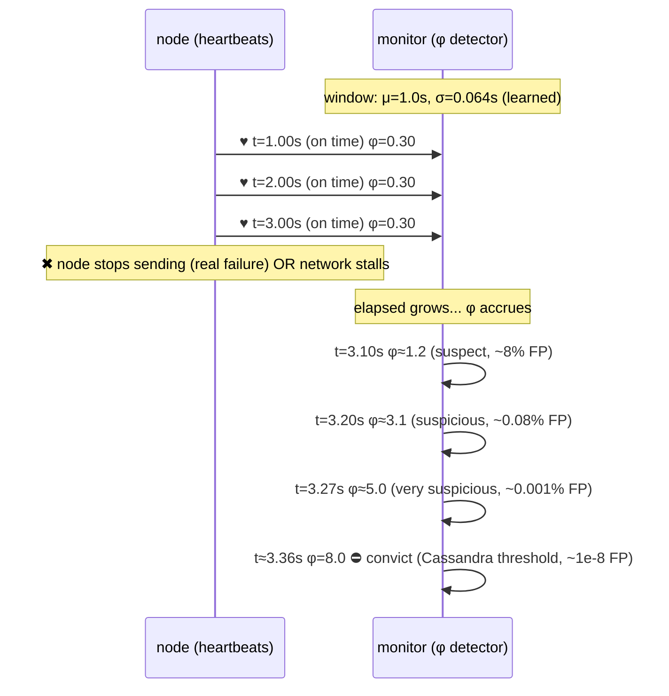

# FAILURE_DETECTION — From Brittle Timeouts to the Phi Accrual Detector

> A **concept bundle**: this guide + [`failure_detection.py`](./failure_detection.py) + [`failure_detection.html`](./failure_detection.html).
> Every number below is printed by the `.py` (the single source of truth) and recomputed live by the `.html`. Nothing is hand-computed.
> Interactive companion: **[`failure_detection.html`](./failure_detection.html)**. 🔗 Back to [all tutorials](../index.html).

---

## 0. Why this exists: a watchman, a whistle, and a dimmer switch

A failure detector is the **watchman** of a distributed system. Some remote node is supposed to send an "I'm alive" heartbeat every second. We must answer one question: **IS IT STILL ALIVE?** We can never be 100% sure — the only evidence is the (lack of) arrival of messages, and messages can be delayed by a network that is **slow, not dead**. So every failure detector is a *bet*, and the whole art is sizing that bet.

There are three generations of detector, and they map onto three ways the watchman could work:

- **Simple timeout** — *"If I haven't heard a whistle in 3s, the guard is dead."* A binary **alarm bell**. Brittle: if the network is slow but the guard is fine, the bell rings anyway → a **false positive** (a live node accused of being dead). Tune the bell for a fast network and it screams on slow days; tune it for a slow network and it takes forever to notice a real corpse. (🔗 see [`NETWORK_PARTITIONS.md`](./NETWORK_PARTITIONS.md) for what a "slow network" can really mean.)
- **Adaptive timeout** — *"Whistles here come about every 1s with ±0.1s of wobble; I'll set my alarm to `mean + k·stddev`, so it tracks the network."* Still a binary alarm bell, but the threshold **moves** with the traffic. Robust to the baseline speed; still needs a magic number `k` and still collapses a rich signal (how late?) into one bit (dead?).
- **Phi accrual** — *"Each second of silence makes me MORE suspicious. I'll output a **continuous** suspicion level `φ` that grows the longer I wait, calibrated against the HISTORY of how late whistles normally are."* A **dimmer, not a bell**. `φ = −log10( P( a normal heartbeat would be this late ) )`. `φ=1` ≈ 10% chance this is just a slow whistle; `φ=5` ≈ 0.001%. You pick **one** threshold (Cassandra's `φ=8`) and get a **defined**, self-tuning false-positive rate on **any** network.

**The reason φ exists:** the heartbeat-arrival process is not deterministic. Network jitter, GC pauses, and route flaps turn "arrives at 1s" into "arrives at 1.0 ± 0.1s, with the occasional 3s hiccup." A fixed threshold cannot describe a *distribution*. Phi accrual **learns** the distribution (mean `μ`, stddev `σ` of past inter-arrival times) and asks, for the current elapsed time `t`: "how **surprising** is `t`?" The surprise is a tail probability, and `−log10` of it is `φ`. Bigger `t` → smaller tail → bigger `φ`. One continuous number, principled calibration, adapts automatically.

| Concept | Definition |
|---|---|
| **heartbeat** | an "I'm alive" message a node sends periodically (here, nominally 1.0s). The only evidence of life. |
| **inter-arrival time** | elapsed time BETWEEN two consecutive heartbeat arrivals. Its distribution (μ, σ) is what φ accrual learns. |
| **elapsed (`t`)** | time since the MOST RECENT heartbeat. The input to every detector's decision right now. |
| **threshold** | the cutoff. Simple/adaptive: "`elapsed > threshold` ⇒ dead." φ: "`φ > φ_threshold` ⇒ dead." |
| **false positive (FP)** | declaring a LIVE node dead. The cardinal sin. Happens when a slow-but-alive heartbeat arrives after the threshold. |
| **false negative** | declaring a DEAD node alive (missing a real failure). Bigger thresholds ⇒ slower detection ⇒ more of these. FP/FN/latency are in tension. |
| **accrual** | "accumulating." φ **accrues** (grows) the longer we wait, instead of snapping to a binary verdict. |
| **φ (phi)** | the suspicion level. `φ = −log10(P(inter-arrival > t))`. Continuous, ≥ 0. Higher = more suspicious. |
| **μ, σ** | sample mean / sample stddev of the recent inter-arrival **sliding window**. The learned heartbeat "shape". |

> **Paper**: Hayashibara, T., et al. (2004). *"A Failure Detector Service in the Asynchronous Distributed System"* (IPDPS 2004, doi:10.1109/IPDPS.2004.1303067). Defines the φ **accrual** suspicion level, models inter-arrival times as a normal distribution `N(μ, σ²)`, and gives `φ = −log10` of the upper-tail probability.
>
> **Implementations informing this guide:** Cassandra `gms/FailureDetector.java` (CASSANDRA-2597 — sliding window of 1000 samples, default `phi_convict_threshold = 8`, Poisson/exponential model `φ = elapsed/mean` compared as `(elapsed/mean)/ln10 > threshold`); Akka `PhiAccrualFailureDetector` (Hayashibara normal model, default `φ = 8.0`).

---

## 1. Simple timeout — the brittle alarm bell

The oldest detector. One rule: declare **DEAD** iff `elapsed_since_last_heartbeat > 3.0s`. It ignores history entirely — same 3.0s cutoff on a fast network and a slow one.

The scenario: a **LIVE** node on a stable network (jitter ~0.1s) hit by ONE transient stall (network slow, node fine):

```
  heartbeat arrival times (s): 1.00, 1.98, 3.00, 4.01, 5.00, 6.00, 7.03, 8.00, 9.01, 10.00, 14.00, 15.00, ...
```

> From `failure_detection.py` Section A — the simple-timeout verdict at each gap:

| # | gap (s) | elapsed | > 3.0s ? | verdict |
|---|---|---|---|---|
| 1–10 | ~1.0 | ~1.0 | no | alive |
| **11** | **4.00** | **4.00** | **yes** | **DEAD (FALSE POS!)** |
| 12–20 | ~1.0 | ~1.0 | no | alive |

Heartbeat #11 arrives at `t=14.00s` — a **4.00s** gap since the previous one. The node is **ALIVE**; the network just stalled. The fixed `3.0s` bell rings once on a live node.

```
[check] simple timeout false positives on STALL_TRACE = 1  (expected 1):  OK
```

That gap *was* anomalous for this network (normally ~1s), so arguably the detector is doing its job — but it **cannot** express *"probably just slow, wait a touch more."* It only knows ALARM / NO ALARM. Worse, the threshold is a global constant: lower it to detect real deaths faster and false positives explode; raise it to avoid them and real failures take seconds longer to notice. **There is no good value.**

🔗 Drag the timeout slider in **[panel ①](./failure_detection.html)** and watch the bell fire on the live node.

---

## 2. Adaptive timeout — the threshold that moves

First improvement: let the cutoff **track** the network. Keep a window of recent inter-arrival times and set

$$\text{threshold} = \mu(\text{window}) + k\cdot\sigma(\text{window})$$

`k=4` means "tolerate up to 4 standard deviations of the usual wobble before alarming." Watch the threshold adapt as a **heavy-tail** trace unfolds (a live node where multi-second gaps *recur* and are therefore normal):

> From `failure_detection.py` Section B — the threshold computed from the window *before* each gap:

| # | next gap | window μ | window σ | threshold μ+4σ | crossed? |
|---|---|---|---|---|---|
| 5 | 3.20 | 1.000 | 0.082 | 1.327 | **YES** |
| 6 | 1.00 | 1.440 | 0.986 | 5.386 | no |
| 10 | 3.10 | 1.275 | 0.781 | 4.401 | no |
| 15 | 3.30 | 1.262 | 0.746 | 4.248 | no |

As the recurring ~3s gaps **enter** the window, both `μ` and `σ` rise, so the threshold **rises with them** — to ~4.2s. The probe gap (3.3s) now sits *below* the threshold. Adaptive false positives on this trace: **1** (the very first stall, before the window had learned the heavy tail).

```
[check] on the same HEAVY-TAIL trace: simple timeout FPs = 3,  adaptive FPs = 1:  OK (adaptive <= simple)
```

This is the win: the threshold is not a magic 3.0s, it is whatever the current network says is "normal plus a few σ." But it is **still binary** (dead/alive), and `k` is **still a magic number** with no probabilistic meaning. Why 4σ and not 3 or 6? Nobody can tell you the false-positive rate of "4σ" without knowing the distribution shape.

---

## 3. Phi accrual — the dimmer switch (THE point of this file)

Instead of a cutoff, output a **continuous** suspicion level. Learn the heartbeat shape (`μ, σ`) from a window of past inter-arrivals, then for the current elapsed time `t` ask: "how **surprising** is `t` under that distribution?" The surprise is the upper-tail probability; `−log10` of it is `φ`.

$$\Phi(z) = \tfrac{1}{2}\bigl(1 + \mathrm{erf}(z/\sqrt{2})\bigr), \quad z = \frac{t-\mu}{\sigma}$$
$$P(\text{inter-arrival} > t) = 1 - \Phi\!\left(\frac{t-\mu}{\sigma}\right) \qquad \varphi(t) = -\log_{10}\!\bigl(P(\text{inter-arrival} > t)\bigr)$$

The learned **WINDOW** (20 hard-coded samples, symmetric pairs → `μ` is exactly 1.0): `μ = 1.000000s`, sample `σ = 0.063660s`. This is the "shape" φ reasons about.

> From `failure_detection.py` Section C — φ as a function of elapsed time:

| elapsed `t` (s) | z=(t−μ)/σ | P(inter-arr > t) | φ | verdict |
|---|---|---|---|---|
| 0.50 | −7.854 | 1.000e+00 | 0.0000 | fine |
| 0.90 | −1.571 | 9.419e−01 | 0.0260 | fine |
| **1.00** | **0.000** | **5.000e−01** | **0.3010** | fine |
| 1.05 | 0.785 | 2.161e−01 | 0.6653 | fine |
| 1.10 | 1.571 | 5.811e−02 | 1.2357 | suspect |
| 1.15 | 2.356 | 9.230e−03 | 2.0348 | suspect |
| **1.20** | **3.142** | **8.399e−04** | **3.0758** | suspicious |
| 1.30 | 4.713 | 1.223e−06 | 5.9124 | very suspicious |
| 1.50 | 7.854 | 2.012e−15 | 14.6964 | DEAD |
| 2.00 | 15.708 | 6.626e−56 | 55.1788 | DEAD |

Notice: at `t = μ = 1.0s`, φ is only ~0.30 (a heartbeat arriving *exactly on time* still has a 50% upper tail). φ crosses 1.0 around `t=1.08s`, 3.0 around `t=1.20s`, 5.0 around `t=1.27s`.

**THE calibration table — why φ is principled.** If you declare DEAD at `φ_threshold`, the per-check false-positive probability is `10^(−φ)`:

| φ threshold | false-positive prob `10^(−φ)` | reading |
|---|---|---|
| 1.0 | 1.0e−01 | **10%** |
| 2.0 | 1.0e−02 | 1% |
| 3.0 | 1.0e−03 | **0.1%** |
| 5.0 | 1.0e−05 | **0.001%** |
| 8.0 | 1.0e−08 | **Cassandra default** |

This is the whole reason φ exists: **one knob** (`φ_threshold`) whose *meaning* (the mistake probability) is the **same on every network**, because `μ` and `σ` already absorbed the network's speed and jitter. The `k`-σ adaptive thresholds of §2 have no such universal meaning.

> **GOLD** (pinned for `failure_detection.html`, reproduced identically in JS):
> ```
> mu = 1.000000, sigma = 0.063660
> phi(elapsed=1.0) = 0.301030
> phi(elapsed=1.1) = 1.235748
> phi(elapsed=1.2) = 3.075763
> phi(elapsed=1.3) = 5.912434
> phi(elapsed=1.5) = 14.696413
> compact check scalar: phi(elapsed=1.2) = 3.075763
> [check] at phi=1, elapsed=1.0816s, 10^(-1)==tail:  OK
> [check] at phi=3, elapsed=1.1967s, 10^(-3)==tail:  OK
> ```

🔗 Drag **elapsed time** in **[panel ③](./failure_detection.html)** and watch the φ gauge climb; toggle **network jitter** to see `σ` reshape the curve.

---

## 4. Comparison — simple vs adaptive vs phi

Run all three detectors on a LIVE heavy-tail network and measure two things: **(1) false positives** (how often a live node is accused — lower is better) and **(2) detection latency** (after a real death, seconds until declared dead — lower is better). Lower latency and lower FP are in **tension**.

> From `failure_detection.py` Section D — false positives over the live trace (window=8):

| detector | HEAVY-TAIL FPs |
|---|---|
| **simple (3.0s)** | **3** |
| adaptive (μ+4σ) | 1 |
| phi (thr=8) | 1 |

On the heavy-tail network the simple timeout **cries wolf**: its fixed 3.0s cannot see that 3.x gaps are routine here, so it fires 3 times on a live node. Adaptive and phi both read the window, see the recurring long gaps, and stay silent (1 miss each, from the *first* stall before the window had learned the heavy tail).

Detection latency after a real death, from the last window (`μ=1.288s, σ=0.817s`):

| detector | latency to DEAD | how it is set |
|---|---|---|
| simple (3.0s) | 3.00s | fixed constant |
| adaptive (μ+4σ) | 4.55s | μ + 4·σ (magic k) |
| phi (thr=8) | 5.87s | μ+σ·Φ⁻¹(1−1e−8) |

Here the simple detector is **fastest** to notice a real death (3.0s) but pays for it with **3× the false positives**. Adaptive and phi trade a few extra seconds of latency (this window is jittery, `σ=0.82`, so a long gap is less surprising and φ waits longer) for a **3× lower FP rate**. The fundamental tension is **speed vs false alarms**. The *fixed* threshold has no principled way to navigate it; the *continuous* φ value lets you dial a **known** false-positive probability (`10^−φ`) and accept the latency it implies.

```
THE TAKEAWAY across all three detectors:
  simple   : binary,  fixed,        no FP knob   - brittle
  adaptive : binary,  self-moving,  magic k      - robust but un-calibrated
  phi      : CONTINUOUS, self-tuning, 10^-phi FP - principled
```

🔗 Toggle the three detectors in **[panel ④](./failure_detection.html)** and watch the false-positive counter diverge.

---

## 5. Practical use — Cassandra, Akka, Gossip

Real systems almost universally settle on φ accrual.

**CASSANDRA** (`gms/FailureDetector.java`, CASSANDRA-2597) — read from the source:
- heartbeat interval: ~1.0s (gossip round); sliding window: **1000** samples; default `phi_convict_threshold` = **8**.
- model: arrival process = **Poisson** (exponential). `phi_raw = elapsed / mean`; convict iff `(phi_raw / ln 10) > threshold`, i.e. `−log10(exp(−elapsed/mean)) > threshold`. Uses **only the mean**.

**AKKA** (`PhiAccrualFailureDetector`): default φ threshold **8.0**, **Hayashibara normal** model (uses μ **and** σ), with a `min-std-deviation` floor so φ stays finite.

Both pick **φ=8**. Why 8? Because `10^(−8) = 1e−8` per check: at one check per second that is **one false positive per ~3 years** of continuous running for a single node pair — rare enough to trust, fast enough to be useful.

> From `failure_detection.py` Section E — the **key subtlety**: time to reach φ=8 on the learned WINDOW (`μ=1.0000s, σ=0.0637s, CV=σ/μ=0.0637`):

| model | latency to φ=8 |
|---|---|
| Hayashibara **normal** | **1.3573s** |
| Cassandra **exponential** | **18.4207s** |

These **disagree by an order of magnitude** here, and that is the crux. The two models agree *only* when the inter-arrival distribution is genuinely exponential — i.e. when the **coefficient of variation** `CV = σ/μ` is near 1. This WINDOW has `CV = 0.064` (≪ 1): heartbeats arrive like clockwork, so the normal model "knows" a 1.4s gap is already 8σ up and trips fast. The exponential model sees *only* the mean (1.0s); with no notion of spread it must wait ~18s to reach the same suspicion. On a noisy, memoryless stream (CV ≈ 1) the two converge; on a quiet LAN (CV ≈ 0.06) they do not.

```yaml
# cassandra.yaml
dynamic_snitch: true
phi_convict_threshold: 8.0        # raise to detect slower / more FP-averse
# gossip runs every 1s; phi = elapsed/mean from the last 1000 samples;
# node marked DOWN when (elapsed/mean)/ln10 > 8.
```

**Practical consequence:** on low-jitter LANs a mean-only model is very conservative (slow to convict). Cassandra accepts this — it would rather wait than flap — and layers other liveness signals on top. Akka's σ term makes it sharp on predictable networks. **Pick the model that matches your arrival statistics.**

```
[check] Cassandra exp phi = -log10(exp(-t/mu)):  OK  (phi(1.5)=0.6514)
[check] on this quiet window (CV=0.064) normal trips to phi=8 before exponential (1.36s < 18.42s):  OK
[check] phi=8 <-> false-positive prob 1e-8:  OK
```

---

## 6. Gold check — φ matches the formula

The defining property of the detector: `φ` computed by the function equals the explicit formula `−log10(1 − Φ((t−μ)/σ))`, computed via the numerically-stable complementary error function `erfc`.

> From `failure_detection.py` GOLD CHECK:

| elapsed | z | tail = 1−Φ(z) | φ (fn) | −log10(tail) | match |
|---|---|---|---|---|---|
| 0.50 | −7.85419 | 1.000e+00 | 0.000000 | 0.000000 | OK |
| 0.90 | −1.57084 | 9.419e−01 | 0.026000 | 0.026000 | OK |
| 1.00 | 0.00000 | 5.000e−01 | 0.301030 | 0.301030 | OK |
| 1.10 | 1.57084 | 5.811e−02 | 1.235748 | 1.235748 | OK |
| **1.20** | **3.14168** | **8.399e−04** | **3.075763** | **3.075763** | **OK** |
| 1.30 | 4.71251 | 1.223e−06 | 5.912434 | 5.912434 | OK |
| 1.50 | 7.85419 | 2.012e−15 | 14.696413 | 14.696413 | OK |
| 2.00 | 15.70838 | 6.626e−56 | 55.178751 | 55.178751 | OK |

```
Mismatches: 0 / 8
GOLD scalar: phi(elapsed=1.2) = 3.075763   (must reproduce identically in failure_detection.html)
GOLD mu = 1.000000,  GOLD sigma = 0.063660

FP <-> phi identity  P = 10^(-phi):
  phi=1 -> 1e-01 (one-in-10)        phi=5 -> 1e-05 (one-in-100000)
  phi=3 -> 1e-03 (one-in-1000)      phi=8 -> 1e-08 (one-in-1e8)
[check] GOLD: phi formula + FP<->phi identity:  OK
```

The `.html` recomputes φ for the *identical* WINDOW in JS (using `erfc` via the same `0.5*erfc(z/√2)` stable form) and re-asserts the gold badge `φ(1.2) = 3.075763`.

---

## How φ accrues — the whole story in one diagram



---

## Further reading

- **Hayashibara et al. (2004)**, IPDPS — the φ accrual paper.
- **Chandra & Toueg (1996)**, *"Unreliable Failure Detectors for Reliable Distributed Systems"* (JACM 43(2)) — the theory: failure detectors as a correctness abstraction (completeness vs accuracy).
- **Apache Cassandra** `gms/FailureDetector.java` (CASSANDRA-2597) — the production φ = `elapsed/mean` simplification.
- **Akka** `PhiAccrualFailureDetector` — Hayashibara normal model with `min-std-deviation`.
- 🔗 [`NETWORK_PARTITIONS.md`](./NETWORK_PARTITIONS.md) — *why* networks go slow (and why FP-aversion matters).
- 🔗 [`RAFT.md`](./RAFT.md) / [`PAXOS.md`](./PAXOS.md) — consensus protocols that *consume* a failure detector's verdict to trigger leader election.
- 🔗 *Kleppmann, DDIA* ch. 8 ("The Trouble with Clocks") & ch. 9 ("Consistency and Consensus"); *Tanenbaum & Van Steen, Distributed Systems* ch. 4 ("Communication" — RPC/timeouts) & ch. 7 (failure detection).
