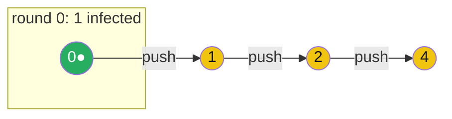

# GOSSIP_PROTOCOL — Epidemic (Gossip) Communication

> A **concept bundle**: this guide + [`gossip_protocol.py`](./gossip_protocol.py) + [`gossip_protocol.html`](./gossip_protocol.html).
> Every number below is printed by the `.py` (the single source of truth) and recomputed live by the `.html`. Nothing is hand-computed.
> Interactive companion: **[`gossip_protocol.html`](./gossip_protocol.html)**. 🔗 Back to [all tutorials](../index.html).

---

## 0. Why this exists: a rumor at a party

One person at an `N`-person party hears a rumor. Every "round", each person who **already knows it** tells one **random** other person. That is exactly how a contagious disease spreads: each round the number of infected can *roughly double*, so after `k` rounds about `2^k` people know. `2^k ≥ N` when `k ≥ log₂(N)` — so the rumor reaches everyone in about **`log₂(N)` rounds**. That exponential "each one tells one" is the whole reason gossip is fast.

A gossip (epidemic) protocol does precisely this for a distributed system: each node periodically contacts a random peer and exchanges state. A single update — a new member joining, a node going down, a config change — reaches all `N` nodes in `O(log N)` rounds, with **no central coordinator, no broadcast tree, and no node ever needing the full membership list**. It is decentralized, fault-tolerant (losing nodes just slows the spread slightly), and astonishingly cheap. That is why it underpins cluster membership and health-checking in **Cassandra** (gossip every 1s, fanout 3), **Consul** (Serf/SWIM), **Redis Cluster** (failover), and **Dynamo** (DeCandia et al. 2007).

There are three variants, and the differences matter:

- **Push** — informed nodes *push* their state to random peers. Doubles cleanly early, but has a **long tail**: late in the spread, an informed node keeps calling nodes that already know (wasted calls), so the last few uninformed nodes take a surprisingly long time to bump into.
- **Pull** — uninformed nodes *pull* from random peers. Slow to **start** (one informed node; the chance an uninformed node asks exactly it is `1/N`), but fast to **finish**, because once most nodes know, every remaining uninformed node almost surely asks someone who does.
- **Push-Pull** — both directions every round. The best of both: fastest growth (**~3× per round early**, not 2×) **and** no tail. It reliably reaches everyone in **`⌈log₂(N)⌉ + 1` rounds** — the gold check of this bundle.

| Concept | Definition |
|---|---|
| **node** | one participant; there are `N`. Node 0 starts "infected". |
| **infected** | a node that knows the update ("has heard the rumor"). |
| **round** | one synchronous gossip step; nodes act on start-of-round state, new infections apply next round. |
| **fanout** (`F`) | how many random peers a node contacts per round. Default 1. |
| **push** | an *informed* node sends its state to `F` random peers. |
| **pull** | an *uninformed* node asks `F` random peers; learns if any is informed. |
| **push-pull** | informed push AND uninformed pull, every round. |
| **convergence** | first round at which all `N` nodes are infected. |
| **mean-field** | deterministic formula for the infected *fraction* `f_k`, ignoring correlations. |
| **bandwidth** | `N · F · msg_size · 2 / period` bytes/sec for the whole cluster. |

> **Paper**: Karp, Schindelhauer, Shenker, Vöcking (FOCS 2000 / SICOMP 2003), *"Randomized Rumor Spreading."* Proves the round complexity: **push** needs `log₂(N) + ln(N) + O(1)` rounds (the `ln(N)` *is* the tail); **push-pull** needs `log₂(N) + O(1)` rounds (no tail). Original epidemic idea: Demers et al. (1987); modern practical reference: Jelasity et al. (2007, ACM TOCS).

---

## 1. The scenario

`N = 64` nodes on a **complete graph** (anyone can call anyone). Node 0 starts infected; all others uninformed. `fanout = 1`. **Deterministic**: peer selection uses a seeded PRNG (mulberry32) feeding a partial Fisher-Yates draw — the *same* code runs in `gossip_protocol.html`, so every history below is reproduced byte-identically in your browser.



Each round, *infected* (green/gold) nodes each pick a random peer and pass the rumor. After `k` rounds the infected count is history[k].

---

## 2. Push — the rumor spreads, but has a long tail

**Rule:** every *infected* node contacts `FANOUT` random peers and pushes the update to them. Uninformed nodes do nothing.

> From `gossip_protocol.py` Section A:

```
Infection history (r0 = start; rK = after round K):

  r0=1  r1=2  r2=4  r3=8  r4=15  r5=25  r6=39  r7=50  r8=57  r9=61  r10=63  r11=64*

Convergence: all 64 infected at round 11.

Read the curve:
  GROWTH phase (rounds 0-4): 1 2 4 8 15  -> roughly DOUBLING each round (each one tells one).
  TAIL   phase (rounds 4-11): 15 25 39 50 57 61 63 64  -> s..l..o..w. Most calls now hit ALREADY-informed nodes (wasted).

This is the PUSH pathology: the last few uninformed nodes are rare,
so an infected node is unlikely to pick one. Karp et al. (2003) prove
pure PUSH needs ~ log2(N) + ln(N) rounds - the ln(N) IS that tail.

  log2(64) = 6;  log2(N)+ln(N) = 10.2;  observed = 11.
[check] observed push (11) within [log2(N), log2(N)+ln(N)+2] = [6, 12]:  OK
```

The early curve `1→2→4→8` is textbook exponential doubling (each informed node tells one *uninformed* node). But the tail `…61→63→64` drags on for **5 extra rounds**: with 63 nodes infected, an informed node's random call hits one of the 1 remaining uninformed nodes with probability `1/64`, so most calls are wasted. That wasted tail is exactly the `ln(N)` term in the push bound.

🔗 Watch the tail stretch out in **[panel ①](./gossip_protocol.html)** by selecting `push` and stepping the rounds.

---

## 3. Pull — gradual start, no tail

**Rule:** every *uninformed* node contacts `FANOUT` random peers and pulls; if any is infected, it becomes infected. Infected nodes are passive.

> From `gossip_protocol.py` Section B:

```
Infection history:
  r0=1  r1=3  r2=5  r3=12  r4=22  r5=38  r6=53  r7=61  r8=64*

Convergence: all 64 infected at round 8.

  GRADUAL START : only node 0 is informed, so an uninformed node's 1
    random contact hits it with probability 1/64. Early growth is
    noisy (1->3->5) rather than the clean doubling of push (1->2->4).
    Over many seeds, pull sometimes stays stuck at 1 for several rounds.
  NO LONG TAIL  : once MOST nodes are informed, every remaining
    uninformed node almost surely asks someone who knows. Pull therefore
    finishes CLEANLY here (61->64 in one round) while push stalls
    (61->63->64 over two rounds). The tail is pull's strength.

Averaged over 1000 seeds: push mean = 11.2 rounds, pull mean = 8.9 rounds.
Pull beats push on average BECAUSE it lacks the ln(N) tail - but both
are dominated by push-pull's ~6 rounds (Section C).
[check] pull mean (8.9) < push mean (11.2) (no-tail advantage):  OK
```

Pull's dynamics are the *complement* of push: it has the noisy/slow start push lacks, but it has the clean finish push lacks. Pull alone is mediocre, but in **combination** it is exactly the force that erases push's tail.

---

## 4. Push-Pull — fastest convergence

**Rule:** infected nodes push *and* uninformed nodes pull, every round. Each uninformed node is caught if it is pushed-to **or** if it pulls an informed peer — so it must dodge *both* to stay uninformed.

> From `gossip_protocol.py` Section C — same `N`, same seed, all three modes:

| mode | convergence | infection history |
|---|---|---|
| push | round 11 | `1  2  4  8  15  25  39  50  57  61  63  64` |
| pull | round 8 | `1  3  5  12  22  38  53  61  64` |
| **push-pull** | **round 6** | `1  4  11  28  45  63  64` |

```
Push-pull converges in 6 rounds vs push's 11 and pull's 8.
WHY fastest: it grows ~3x per round early (a node is caught by the
push OR the pull), AND the pull erases the tail. No wasted phase.

GOLD bound for push-pull: ceil(log2(N)) + 1 = ceil(log2(64)) + 1 = 7.
[check] push-pull convergence (6) <= 7:  OK
```

Notice the early growth `1→4→11→28` — that is roughly **tripling** each round, faster than push's doubling, because a node is caught by the push *or* the pull. And there is no tail: `45→63→64` finishes in a flash.


🔗 Toggle the mode selector in **[panel ①](./gossip_protocol.html)** and watch push-pull's curve (gold) blow past push (red) and pull (blue).

---

## 5. The epidemic model — mean-field vs simulation

Let `f_k` = infected *fraction* after round `k`. Under the mean-field approximation (ignore correlations; each node's contacts are independent samples), an uninformed node "survives" a round only if it dodges every contact that would inform it:

| mode | survival probability | recurrence | early growth |
|---|---|---|---|
| **push** | not pushed: `e^{−f}` | `f_{k+1} = 1 − (1−f_k)·e^{−f_k}` | `~2f` (doubles) |
| **pull** | its own contact uninformed: `(1−f)` | `f_{k+1} = 1 − (1−f_k)²` | `~2f` |
| **push-pull** | dodge **both**: `(1−f)·e^{−f}` | `f_{k+1} = 1 − (1−f_k)²·e^{−f_k}` | `~3f` (**triples**) |

> From `gossip_protocol.py` Section D — simulation averaged over **1000 seeds** vs the mean-field recurrence:

**Push** (max `|diff|` = 0.022 — tight):

```
== push : simulation (avg of 1000 seeds) vs mean-field ==
   k  sim_frac  mean-field  |diff|
   0     0.016       0.016   0.000
   1     0.031       0.031   0.000
   2     0.062       0.060   0.002
   3     0.120       0.115   0.004
   4     0.222       0.212   0.010
   5     0.380       0.362   0.018
   6     0.578       0.556   0.022
   7     0.765       0.745   0.019
   8     0.890       0.879   0.011
   9     0.954       0.950   0.005
  max |sim - mean-field| = 0.022  (tight fit)
```

**Push-pull** (max `|diff|` = 0.016 — tight):

```
== push-pull : simulation (avg of 1000 seeds) vs mean-field ==
   k  sim_frac  mean-field  |diff|
   0     0.016       0.016   0.000
   1     0.048       0.046   0.002
   2     0.135       0.131   0.005
   3     0.346       0.337   0.009
   4     0.683       0.687   0.003
   5     0.934       0.951   0.016
   6     0.997       0.999   0.002
   7     1.000       1.000   0.000
  max |sim - mean-field| = 0.016  (tight fit)
```

> The pull recurrence is *looser* (max `|diff|` = 0.087): the mean-field ignores the discrete slow-start — early on, the single informed node can stay unfound for several rounds, so the real curve lags the smooth formula. That gap is itself the lesson: mean-field is excellent for **push** and **push-pull** (their growth is self-reinforcing) but only approximate for pull's startup.

### The textbook shortcut (and why it's conservative)

A common closed-form approximation is the **SI epidemic model**:

$$f_k \approx 1 - e^{-2^k / N}$$

```
Textbook SI closed-form f_k ~ 1 - e^{-2^k/N} (assumes pure doubling):
  f0=0.016  f1=0.031  f2=0.061  f3=0.118  f4=0.221  f5=0.393  f6=0.632  f7=0.865  f8=0.982  f9=1.000
This is CONSERVATIVE for push-pull (it models 2x growth; push-pull is
~3x early), so it UNDERESTIMATES how fast push-pull actually spreads.
```

This formula *assumes pure doubling*, so it is a good first-order handle but **underestimates** push-pull (which triples early). Use the mean-field recurrence above for an accurate curve; the closed form is a handy **lower bound on the infected fraction**.

🔗 In **[panel ②](./gossip_protocol.html)**, the dashed white curve is the SI closed form — watch the solid (simulated) push-pull curve run well *ahead* of it.

---

## 6. Practical considerations — fanout, period, bandwidth

Three knobs trade convergence speed against network cost:

- **Fanout (`F`)** — peers contacted per node per round. More fanout = faster convergence, but `F`× the messages per round.
- **Period (`T`)** — seconds between rounds. Smaller `T` = faster spread, more messages/sec. Cassandra: `T = 1s`.
- **Message size** — bytes per gossip message (state digest + payload).

> From `gossip_protocol.py` Section E — fanout sweep on push-pull (`N=64`, `seed=42`):

| fanout | convergence rounds | history |
|---|---|---|
| 1 | 6 | `1 4 11 28 45 63 64` |
| 2 | 4 | `1 5 20 54 64` |
| 3 | 4 | `1 5 27 63 64` |
| 4 | 3 | `1 11 57 64` |
| 5 | 3 | `1 12 62 64` |

```
Diminishing returns: fanout 1->2 saves ~2 rounds; 4->5 saves nothing
here. Real clusters pick a small fanout (Cassandra F=3) - enough speed,
bounded load - rather than maxing it out.
```

### Bandwidth model

Per round each node **sends** `F` messages and **receives** ~`F`:

```
bytes/node/round  = F * msg_size * 2          (2 = send + recv)
bytes/node/sec    = F * msg_size * 2 / period
total cluster     = N * F * msg_size * 2 / period  (bytes/sec)

Cassandra-like defaults: N=100, F=3, period=1s, msg~200B
  per-node gossip bandwidth = 3*200*2/1 = 1200 B/s = 9.6 kbit/s
  total cluster gossip      = 100*1200 = 120000 B/s = 0.12 MB/s
```

So gossip is **cheap**: ~10 kbit/s per node tells the whole 100-node cluster anything within a few seconds. That is why Cassandra, Consul, and Redis Cluster all use it for membership/health. Doubling fanout doubles the bandwidth but only trims a round or two — usually not worth it.

🔗 Drag the **fanout slider** in **[panel ①](./gossip_protocol.html)** and watch both the convergence speed and the bandwidth bar update.

---

## 7. Gold check — push-pull within `⌈log₂(N)⌉ + 1` rounds

The defining guarantee of push-pull: with fanout 1 it reaches every node within **`⌈log₂(N)⌉ + 1` rounds**, with overwhelming probability. This is the `log₂(N) + O(1)` result of Karp et al. (2003).

> From `gossip_protocol.py` GOLD CHECK:

```
N = 64.  ceil(log2(64)) + 1 = 7.

Pinned scenario (seed=42): history = 1 4 11 28 45 63 64
  convergence = 6 rounds.  6 <= 7 ?  OK

Over 1000 seeds (0..999): 999/1000 = 99.9% converge within 7 rounds.
[check] >= 95% of push-pull runs meet ceil(log2(N))+1:  OK

GOLD scalar: push-pull (N=64, fanout=1, seed=42) converges in 6 rounds (must be <= 7).
GOLD history: 1 4 11 28 45 63 64
[check] GOLD: push-pull within ceil(log2(N))+1 = 7 rounds:  OK
```

The `.html` recomputes the entire simulation in JS on the *identical* seeded scenario (mulberry32 + Fisher-Yates, the same code as the `.py`) and re-asserts the gold badge: push-pull converges in **6 ≤ 7 rounds**, and the infection history matches `1 4 11 28 45 63 64`.

---

## Further reading

- **Karp, Schindelhauer, Shenker, Vöcking (2003)**, SICOMP — *Randomized Rumor Spreading*: the round-complexity proofs (`push` = `log₂N + ln N`, `push-pull` = `log₂N + O(1)`).
- **Demers et al. (1987)** — *Epidemic Algorithms for Replicated Database Maintenance*: the original gossip paper.
- **Jelasity et al. (2007)**, ACM TOCS — *Gossip-based peer sampling*: the modern practical reference.
- **DeCandia et al. (2007)** — *Dynamo* (Amazon): gossip in production membership.
- 🔗 *Kleppmann, DDIA* ch. 8 (replication & consistency); *Tanenbaum & Van Steen, Distributed Systems* ch. 4 (communication), § on epidemic algorithms.
