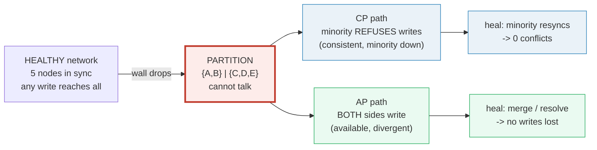
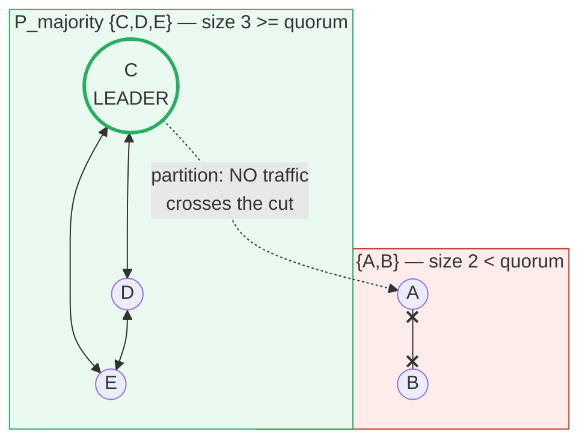
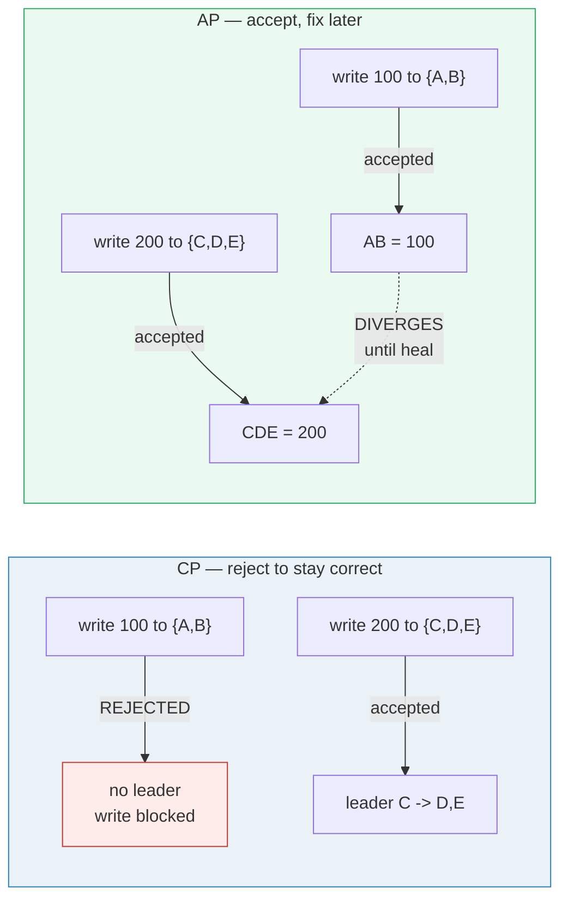
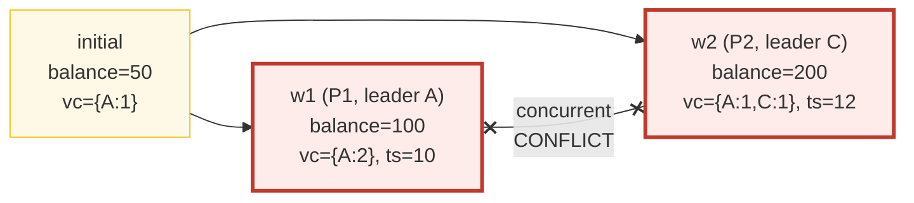
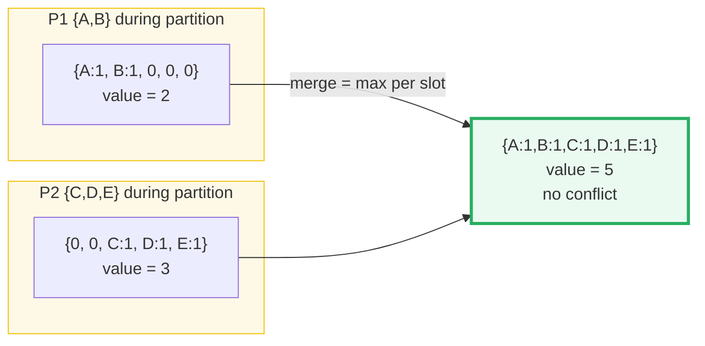
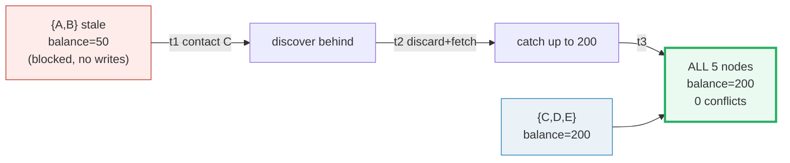
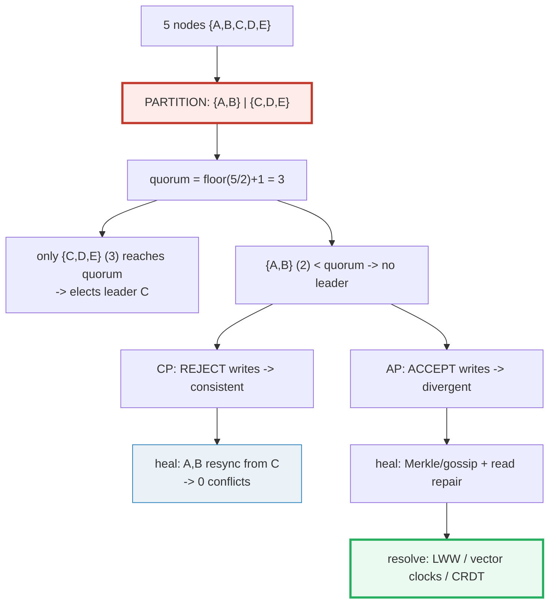

# Network Partitions & Split-Brain — A Visual, Worked-Example Guide

> **Companion code:** [`network_partitions.py`](./network_partitions.py). **Every
> number in this guide is printed by `python3 network_partitions.py`** — change the
> code, re-run, re-paste. Nothing here is hand-computed.
>
> **Live animation:** [`network_partitions.html`](./network_partitions.html) — open
> in a browser. Click the network links to cut a partition, toggle CP/AP, watch the
> split-brain conflict and the healing merge.
>
> **Source material:** CAP (Brewer 2000 / Gilbert & Lynch 2002), Raft (Ongaro &
> Ousterhout 2014), Dynamo (DeCandia et al. 2007), CRDTs (Shapiro et al. 2011).

---

## 0. TL;DR — the office that got cut in half

### Read this first — the wall down the middle

You need no math to get the idea. Picture **5 colleagues** (nodes) keeping a shared
**whiteboard** (the data). Normally they shout updates and everyone stays in sync.
Now a **wall drops down the middle**: 2 people on one side `{A, B}`, 3 on the other
`{C, D, E}`. They can no longer hear each other. That wall is a **network
partition**.

The cruel question: when someone on *each* side writes their side's whiteboard,
whose write "wins"? You cannot have it all:

- If you want **ONE agreed answer** (Consistency), the small side `{A,B}` must
  **refuse** writes — it can't safely change the shared board without checking with
  the other 3. The big side `{C,D,E}` has a **majority**, so it keeps going. This is
  **CP** (etcd, ZooKeeper).
- If you want **every side to keep working** (Availability), **both** sides accept
  writes — and the two whiteboards now **disagree**. You fix it later. This is **AP**
  (Cassandra, DynamoDB).



**Split-brain** is the disaster: if *both* sides wrongly believe they are the
majority, each elects its own leader and both change the board. On heal you have two
conflicting writes for the same thing — and you must resolve them with
**last-write-wins** (timestamps, fragile), **vector clocks** (detect + surface), or
**CRDTs** (data shaped so conflicts cannot exist).

> **One-line definition:** A *network partition* divides nodes into isolated groups
> that cannot communicate. The **CAP theorem** says that during a partition you must
> choose **Consistency** (block writes in the minority) or **Availability** (accept
> writes everywhere, then reconcile). **Quorum** (`floor(N/2)+1`) is the rule that
> normally keeps this choice *safe*: only the majority side can act.

### Glossary (every term used below)

| Term | Plain meaning |
|---|---|
| **node** | one server in the cluster. Here `A,B,C,D,E` (5 total) |
| **partition** | a network split isolating nodes into groups that cannot exchange messages |
| **quorum / majority** | `floor(N/2)+1` nodes. Here `5 -> 3`. The magic count that lets a side safely make decisions |
| **CP** | Consistent + Partition-tolerant. Minority **refuses** writes so data stays correct |
| **AP** | Available + Partition-tolerant. Every side accepts writes; reconcile later |
| **split-brain** | two leaders active at once (broken safety). Both write -> conflict |
| **leader** | the node coordinating writes in a partition (Raft term) |
| **last-write-wins** | resolve conflicts by newest wall-clock timestamp |
| **vector clock** | a `{node: counter}` map; compares causality to detect concurrent (conflicting) writes |
| **CRDT** | Conflict-free Replicated Data Type — data shaped so concurrent updates always merge |
| **anti-entropy** | post-partition background sync (gossip + Merkle trees) |
| **read repair** | fix divergent replicas lazily, triggered by a read |

---

## 1. The partition + quorum — Section A output

The cluster is **5 nodes**. The partition isolates them **2 | 3**.

```
quorum (majority) = floor(N/2) + 1 = floor(5/2) + 1 = 3
```

The decisive fact: a side can elect a leader **only if it reaches quorum**. Because
two sides of one split add up to `N = 5 < 2 * 3 = 6`, **they can never both reach
quorum** — so at most one leader can exist. *That is what quorum-based consensus
(Raft/Paxos) uses to make split-brain impossible.*

> From `network_partitions.py` **Section A** — `N=5`, partition `{A,B} | {C,D,E}`:
>
> | partition | nodes | size | size >= quorum(3)? | can elect leader? | leader |
> |---|---|---|---|---|---|
> | P_majority | C,D,E | 3 | True | yes | C |
> | P_minority | A,B | 2 | False | no | — (none) |
>
> ```
> [check] exactly one side reaches quorum -> split-brain impossible: OK
> ```



> 🔗 The majority side `{C,D,E}` elects leader **C** and keeps serving safely. The
> minority `{A,B}` has no quorum → no leader → it must now **choose**: refuse work
> (**CP**) or accept work unsafely (**AP**). See [§2](#2-cap-under-partition--section-b-output).

---

## 2. CAP under partition — Section B output

**CAP** (Brewer 2000; formalized by Gilbert & Lynch 2002): when a partition occurs
you **cannot** keep both Consistency and Availability — pick one.

| | **CP** (etcd, ZooKeeper, Consul, Spanner) | **AP** (Cassandra, DynamoDB, Riak, CouchDB) |
|---|---|---|
| **Minority `{A,B}`** | **REJECTS** writes (no leader; unsafe) | accepts writes (no quorum gate) |
| **Majority `{C,D,E}`** | accepts writes (leader C → D, E) | accepts writes |
| **During partition** | consistent: everyone reads `200` | **DIVERGES**: AB=`100`, CDE=`200` |
| **Optimizes** | correctness first | uptime first |
| **On heal** | minority resyncs (§5) | merge / resolve (§4) |

> From `network_partitions.py` **Section B** — key `'balance'`, initial `50`:
>
> ```
> client in P_minority {A,B} writes balance = 100
> client in P_majority {C,D,E} writes balance = 200
> ```
>
> | system | write in minority {A,B} (->100) | write in majority {C,D,E} (->200) | state DURING partition |
> |---|---|---|---|
> | CP | REJECTED (no leader; unsafe) | accepted (leader C -> D, E) | consistent: only 200 |
> | AP | accepted (no quorum gate) | accepted | DIVERGES: AB=100, CDE=200 |
>
> ```
> [check] CP rejects the minority write; AP accepts both -> divergence detected: OK
> ```



> Neither system is "wrong" — they optimize different guarantees. CP stays correct but
> 2 nodes go unavailable for writes; AP serves everyone but the value disagrees until
> heal.

---

## 3. Split-brain — Section C output (the conflict)

> ⚠️ **Vivid warning:** split-brain is the *safety property breaking*. If both
> partitions wrongly believe they hold quorum, each elects a leader and both accept
> writes to the **same key**. You now have a **real conflict**, not just a stale read.

We simulate it: `P1 {A,B}` elects leader **A**; `P2 {C,D,E}` keeps leader **C**. Both
write `'balance'`. The initial value `50` was set by **A** before the split.

> From `network_partitions.py` **Section C**:
>
> ```
> initial : balance = 50   vc = {A:1}
> w1      : balance = 100   ts = 10   vc = {A:2}        # by P1 (leader A)
> w2      : balance = 200   ts = 12   vc = {A:1, C:1}   # by P2 (leader C)
> ```
>
> **Happens-before check (vector clocks):**
> ```
> w1 -> w2 ?  False
> w2 -> w1 ?  False
> => concurrent? True
> ```
>
> ```
> [check] w1 and w2 are concurrent (a true conflict, not a stale read): OK
> ```

**Why they are concurrent** (the happens-before rule):

```
A happens-before B  <=>  (A[n] <= B[n] for all n)  AND  (A != B)
concurrent          <=>  neither happens-before the other   (a CONFLICT)
```

- `w1 -> w2`? `w1 = {A:2}`, `w2 = {A:1, C:1}`. `w1.A = 2 > w2.A = 1` → **no**.
- `w2 -> w1`? `w2.C = 1 > w1.C = 0` → **no**.
- Neither knows the other happened → **concurrent** → conflict.



On heal the store sees **two values** for `'balance'` (`100` and `200`) → a conflict
that must be resolved. 🔗 Resolution strategies are in [§4](#4-resolving-the-conflict--section-d-output).

---

## 4. Resolving the conflict — Section D output

Same conflict as §3 (`balance`: `100` vs `200`, concurrent). Three ways to resolve:

### Strategy 1 — Last-Write-Wins (LWW): newest timestamp decides

> From `network_partitions.py` **Section D** — Strategy 1:
>
> ```
> w1.ts=10, w2.ts=12 -> later wins -> balance = 200
> The losing write (100) is SILENTLY DROPPED. Forever.
> ```
>
> **Clock-skew danger:**
> ```
> if A's clock jumped ahead (w1.ts=99) then 'later wins' -> balance = 100
> The causally-fine write 200 is LOST purely because a wall clock said so
> -> silent DATA LOSS.
> ```

LWW is simple and works for *any* write, but it **silently drops data** and **depends
on clock sync** (NTP). A skewed clock reorders causality and loses the "wrong" write.

### Strategy 2 — Vector clocks: detect concurrency, then surface

> From `network_partitions.py` **Section D** — Strategy 2:
>
> ```
> w1.vc and w2.vc are concurrent -> store keeps BOTH as siblings:
>    siblings = [100, 200]
> Nothing is dropped silently. The application (or a human) decides:
>    e.g. take max -> 200; prompt the user; or union.
> The conflict is VISIBLE instead of hidden. (This is how Dynamo/Riak expose it.)
> ```

Vector clocks never drop data — they **surface** the conflict as *siblings* and let
the application resolve it. The cost is application code + possible human
intervention.

### Strategy 3 — CRDT: shape the data so conflicts cannot exist

> From `network_partitions.py` **Section D** — Strategy 3 (G-Counter CRDT):
>
> ```
> Re-model the value as a G-Counter: each node owns a counter slot;
> merge = element-wise MAX; value = SUM.
>
>    P1 state {A:1, B:1, C:0, D:0, E:0}  -> value = 2
>    P2 state {A:0, B:0, C:1, D:1, E:1}  -> value = 3
>    merge   {A:1, B:1, C:1, D:1, E:1}  -> value = 5
> No conflict. Every partition's increments survive.
> ```



**The math:** `merge(a,b)[n] = max(a[n], b[n])`; `value = sum(slots)`. Max and sum are
**commutative, associative, and idempotent**, so the merge converges no matter the
order in which nodes heal. That is the whole point of a CRDT.

> **Trade-off:** CRDTs need a *merge-friendly* operation (add, union, max). "SET
> balance = X" is **not** merge-friendly — for that you'd use a register CRDT
> (LWW-register or MV-register), which reintroduces LWW or siblings.

### Comparison table

> From `network_partitions.py` **Section D**:
>
> | strategy | decides by | drops data? | needs clock sync? | works for any op? |
> |---|---|---|---|---|
> | LWW | timestamp | yes (silent) | yes (skew = data loss) | yes (any write) |
> | vector clock | causality | no (surfaces) | no | yes (any write) |
> | CRDT | merge fn | no (never) | no | only merge-friendly ops |
>
> ```
> [check] LWW->200 (skew->100), vector->siblings[100,200], CRDT->5: OK
> ```

---

## 5. Healing — Section E output (convergence)

The network recovers. Both sides must converge back to **one** consistent state. CP
and AP do it very differently.

### CP healing (etcd / ZooKeeper)

The minority `{A,B}` **blocked** writes (no leader). The majority `{C,D,E}`
committed `balance = 200`. The minority's local copy is **stale** (`50`) but it made
**no** writes.

> From `network_partitions.py` **Section E** — CP rejoin timeline:
>
> ```
> t0  network heals; A,B can again reach C,D,E
> t1  A,B contact leader C; see their Raft term/log is behind
> t2  A,B DISCARD their stale log tail (nothing to discard - they blocked)
>      and receive committed entries (balance=200) via AppendEntries from C
> t3  A,B catch up; all 5 nodes agree balance=200
> ```
>
> ```
> CP final state: balance = 200 on every node
> conflicts = 0 (the minority had no writes to conflict with)
> ```



### AP healing (Cassandra / Dynamo)

Both sides accepted writes and **diverged**. Healing reconciles via:

- **anti-entropy:** background gossip syncs missing rows. A **Merkle tree** (hash of
  hashes) per node lets replicas compare cheaply and pinpoint *only* the divergent
  keys — no full-table scan on big datasets.
- **read repair:** a read that hits disagreeing replicas fixes them in the
  background, converging lazily as traffic flows.

> From `network_partitions.py` **Section E** — AP G-Counter merge:
>
> ```
> P1 {A:1, B:1, C:0, D:0, E:0}  +  P2 {A:0, B:0, C:1, D:1, E:1}
>    -> merged {A:1, B:1, C:1, D:1, E:1} -> value = 5
> AP final state: every node converges to view_count = 5.
> No writes lost - all 5 increments are preserved. Eventually consistent.
> ```

---

## 6. GOLD CHECK — post-heal correctness

> From `network_partitions.py` **GOLD CHECK**:
>
> ```
> CP : all 5 nodes agree balance = 200? True | conflicts = 0  -> [check] OK
> AP : CRDT merge kept every increment (A..E all =1)? True | total = 5  -> [check] OK
>
> => CP guarantee : NO conflicts ever (minority writes are discarded).
> => AP guarantee : NO writes lost (every partition's writes are merged).
> Both converge after healing - they just promise different things.
> [check] GOLD: OK
> ```

After healing:

| | **CP system** | **AP system** |
|---|---|---|
| **Final state** | all 5 nodes = `balance 200` | all 5 nodes = `view_count 5` |
| **Conflicts** | **0** (minority writes discarded) | resolved/merged |
| **Writes lost** | minority's (blocked) writes | **none** (all merged) |
| **Property** | strong consistency | eventual consistency |

The [`network_partitions.html`](./network_partitions.html) recomputes the quorum
election, the vector-clock concurrency check, and the G-Counter merge **live in JS**
on the same deterministic inputs, and shows a gold `check: OK` badge when they match
the `.py`.

---

## 7. Pitfalls & debugging checklist

| # | Mistake | Symptom | Fix |
|---|---|---|---|
| 1 | **Assuming a partition can't happen** (the network is reliable) | silent data corruption on split-brain | Design for partitions from day one (CAP) — the network *will* fail |
| 2 | **No quorum check** on writes | both sides commit → split-brain | Require `floor(N/2)+1` acks before commit (Raft/Paxos) |
| 3 | **Trusting wall clocks blindly** (LWW only) | skewed clock silently drops the newer write | Pair LWW with bounded clock sync (TrueTime, hybrid clocks) or use vector clocks |
| 4 | **Ignoring clock skew entirely** | last-write-wins picks the wrong value | Use vector clocks / CRDTs; or Hybrid Logical Clocks (HLC) |
| 5 | **Treating a concurrent write as "newer"** | one update silently clobbers another | Compare vector clocks; surface siblings, don't auto-resolve |
| 6 | **Using a register where a counter is needed** | CRDT can't help; you get siblings/conflicts | Model additive state as G-Counter/PN-Counter CRDT |
| 7 | **Forgetting anti-entropy** after heal | divergence lingers forever | Run background Merkle/gossip sync + read repair |
| 8 | **AP read during divergence without `R + W > N`** | client sees stale/conflicting values | Tune quorum reads/writes (e.g. `R=3, W=2, N=3`) for stronger AP read consistency |

---

## 8. Cheat sheet



- **Partition:** a network split isolating node groups; they cannot exchange messages.
- **Quorum:** `floor(N/2)+1` = `3` for N=5. Two split sides can't both reach it → at most one leader → no split-brain (under correct consensus).
- **CAP:** during a partition pick **C** (CP: minority rejects writes) or **A** (AP: both accept, diverge).
- **Split-brain:** safety breaks; both sides have a leader and write the same key → conflict.
- **Vector clocks:** `A → B` iff `A[n] ≤ B[n] ∀n` and `A ≠ B`; concurrent (neither) = conflict.
- **G-Counter CRDT:** `merge = max per slot`, `value = sum`; commutative + idempotent → always converges, never drops data.
- **LWW:** newest timestamp wins; **fragile** — clock skew silently loses the newer write.
- **Healing:** CP resyncs (minority discards stale tail, copies leader); AP anti-entropy (Merkle/gossip) + read repair, then resolve.
- **Gold check:** after heal CP has 0 conflicts; AP loses no writes. Both converge — different promises.

---

## Sources

- **CAP (Brewer's conjecture)** — Brewer. *Towards Robust Distributed Systems.* PODC
  keynote, 2000. https://people.eecs.berkeley.edu/~brewer/cs262b-2004/PODC-keynote.pdf
- **CAP (formal proof)** — Gilbert & Lynch. *Brewer's Conjecture and the Feasibility
  of Consistent, Available, Partition-Tolerant Web Services.* ACM SIGACT News, 2002.
- **Raft** — Ongaro & Ousterhout. *In Search of an Understandable Consensus
  Algorithm.* USENIX ATC 2014. https://raft.github.io
  - Verified claim: leader election requires a majority (`floor(N/2)+1`) of votes, so
    two disjoint partitions cannot each elect a leader — the basis of split-brain
    prevention in Section A.
- **Dynamo** — DeCandia et al. *Dynamo: Amazon's Highly Available Key-value Store.*
  SOSP 2007.
  - Verified claims: AP availability ("always writeable"); object versioning with
    vector clocks; conflict resolution by application or last-write-wins; anti-entropy
    via Merkle trees and read repair (Sections B, C, D, E).
- **CRDTs** — Shapiro, Preguiça, Baquero, Zawirski. *Conflict-Free Replicated Data
  Types.* SSS 2011. https://hal.inria.fr/inria-00609399
  - Verified claims: state-based CVCRDTs converge if merge is commutative,
    associative, and idempotent; G-Counter (grow-only counter) merge = element-wise
    max, value = sum (Section D).
- **Books** — Kleppmann, *Designing Data-Intensive Applications* (Ch. 5 Replication,
    Ch. 9 Consistency & Consensus); Tanenbaum & Van Steen, *Distributed Systems*
    (Ch. 8 Fault Tolerance).
- **Merkle trees for anti-entropy** — Merkle. *A Digital Signature Based on a
  Conventional Encryption Function.* 1987; adopted by Dynamo/Cassandra for cheap
  replica comparison (Section E).
