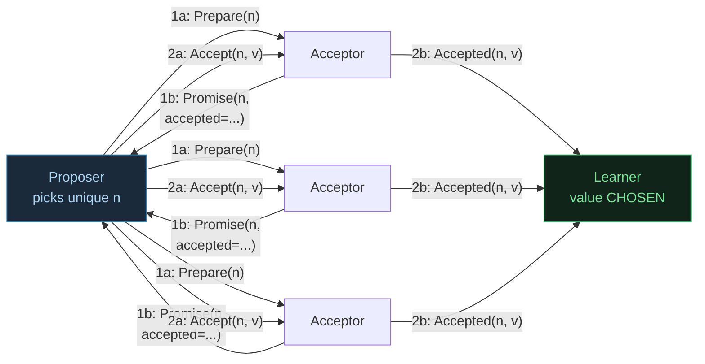
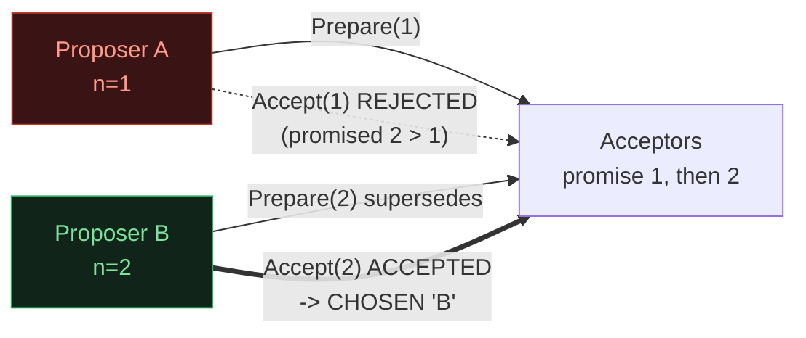
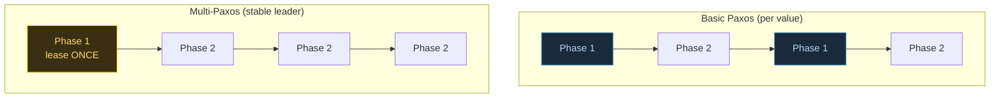

# Paxos — Consensus by Proposal Numbers (Lamport 1998)

> A concept bundle for distributed systems. Every number below is printed by
> **`paxos.py`** (pure Python stdlib, run with `python3 paxos.py`) and
> recomputed live in **`paxos.html`**. This guide never hand-computes anything —
> it cites the `.py` output verbatim.
>
> 🔗 Interactive companion: `paxos.html` &nbsp;|&nbsp; Source of truth: `paxos.py`

---

## 0. The one-paragraph version

Paxos makes a cluster of **acceptors** agree on exactly **one** value, even when
multiple **proposers** race and messages reorder. It runs in **two phases**:

- **Phase 1 (Prepare/Promise)** — a proposer "locks in" a unique, increasing
  **proposal number** `n`. Acceptors promise to reject anything older, and *report
  any value they already accepted*.
- **Phase 2 (Accept/Accepted)** — the proposer commits a value under that lock.
  Once a **majority** (`⌊N/2⌋+1`) accept, the value is **chosen** forever, and a
  **learner** is told.

The whole safety argument is one rule in Phase 1: *if any acceptor already
accepted a value, the proposer must reuse the highest-numbered accepted value.*
So a late proposer can never overwrite a value an earlier majority chose — it is
**forced** to re-choose the same value. That is why two majorities can never
disagree.

| | Paxos | Multi-Paxos |
|---|---|---|
| **Phases per value** | Phase 1 **and** Phase 2 | Phase 1 **once** (lease), then Phase 2 only |
| **round-trips / value** | `2` | `1` (after the first) |
| **fault model** | crash, `2f+1` | crash, `2f+1` |
| **vs Raft** | decentralized, subtle | Raft IS Multi-Paxos with a built-in strong leader |

> From `paxos.py` Section E (comparison table):
> ```text
> | aspect              | Paxos                          | Raft                          |
> |---------------------|--------------------------------|-------------------------------|
> | leader model        | decentralized: any node can propose; no strong leader required | strong leader: ALL writes flow through one elected leader |
> | roles               | Proposer / Acceptor / Learner (explicit, may be co-located) | Leader / Follower / Candidate (one node's state machine) |
> | core mechanism      | Prepare/Promise + Accept/Accepted (proposal numbers) | RequestVote + AppendEntries (term numbers) |
> | ordering term       | proposal number (round, id)    | term (monotonic integer)      |
> | understandability   | notoriously subtle             | designed to be teachable      |
> | fault model         | crash, 2f+1                    | crash, 2f+1                   |
> | log replication     | Multi-Paxos: per-instance consensus | built-in: leader appends + matches |
> | canonical paper     | Lamport 1998/2001              | Ongaro & Ousterhout 2014      |
> | used by             | Chubby, Spanner (Paxos), ZooKeeper (Zab) | etcd, Consul, TiKV, CockroachDB |
> ```

---

## 1. The committee intuition & the two phases

Imagine a parliament committee of **acceptors** that must enact exactly one law
this session. Any **proposer** may suggest a law; members arrive at different
times and several can race. Paxos guarantees **safety** (at most one law chosen)
and **liveness** (eventually *some* law is chosen when a majority is reachable).



- **Phase 1 (Prepare/Promise)** — "lock in" a proposal number `n`. Each acceptor
  promises to reject any later proposal numbered *less than* `n`, and reports the
  highest proposal it has already accepted.
- **Phase 2 (Accept/Accepted)** — "commit" a value under that lock. Once a
  majority accept, the value is **chosen** (irrevocable), and a learner is told.

The **safety magic** lives in Phase 1's report: if any acceptor already accepted
a value, the proposer *must* reuse the highest-numbered accepted one (Section 3).

---

## 2. Section A — basic Paxos (`1 proposer, 3 acceptors, 1 learner`)

A single proposer wants to choose `'X'`. With `N=3` acceptors the majority is
`⌊3/2⌋+1 = 2`. Read the trace top-to-bottom as four vertical sweeps:
**Prepare down → Promise up** (Phase 1), then **Accept down → Accepted up** (Phase 2).

> From `paxos.py` Section A:
> ```text
> -- Proposer, n=1, wants='X'
>   Proposer -> A0: Prepare(n=1)
>   A0 -> Proposer: Promise(n=1, accepted=none)
>   Proposer -> A1: Prepare(n=1)
>   A1 -> Proposer: Promise(n=1, accepted=none)
>   Proposer -> A2: Prepare(n=1)
>   A2 -> Proposer: Promise(n=1, accepted=none)
>   Phase 1 OK: 3/3 promises (need 2). value to accept = 'X' (own value)
>   Proposer -> A0: Accept(n=1, v='X')
>   A0 -> Proposer: Accepted(n=1, v='X')
>   Proposer -> A1: Accept(n=1, v='X')
>   A1 -> Proposer: Accepted(n=1, v='X')
>   Proposer -> A2: Accept(n=1, v='X')
>   A2 -> Proposer: Accepted(n=1, v='X')
>   Phase 2 OK: 3/3 accepted (need 2) -> CHOSEN = 'X'
>
> Learner is told: chosen = 'X'
> ```

**Key takeaway.** No prior accepted value existed, so the proposer used its own
`'X'`. Phase 1 established the lock; Phase 2 committed it; a majority sealed it.

---

## 3. Section B — competing proposers (higher proposal number wins)

Now two proposers race: `A (n=1, wants 'A')` and `B (n=2, wants 'B')`. B's
**higher proposal number** supersedes A's. An acceptor that has promised `n=2`
will **reject** any `Accept` with a smaller `n` — so A's Phase 2 dies and B's
wins.

> From `paxos.py` Section B:
> ```text
> -- Proposer A, Phase 1 only (n=1)
>   Proposer -> A0: Prepare(n=1)   ...   A0 -> Proposer: Promise(n=1, accepted=none)
>   (A1, A2 likewise)
>   -> A holds 3 promises (a majority)
>
> -- Proposer B, Phase 1 (n=2)  -- supersedes A
>   Proposer -> A0: Prepare(n=2)   ...   A0 -> Proposer: Promise(n=2, accepted=none)
>   (A1, A2 likewise)
>   -> B holds 3 promises. Acceptors now promised n=2 (A's n=1 is stale).
>
> Now A tries to finish (Phase 2 with n=1) -- but acceptors promised 2:
>   Proposer -> A0: Accept(n=1, v='A')
>   A0 -> Proposer: Rejected  (promised n=2 > 1)
>   (A1, A2 likewise)
>   -> A accepted by 0 acceptors (need 2): REJECTED by all. A's proposal dies.
>
> B finishes (Phase 2 with n=2):
>   Proposer -> A0: Accept(n=2, v='B')
>   A0 -> Proposer: Accepted(n=2, v='B')
>   (A1, A2 likewise)
>   -> B accepted by 3 acceptors -> CHOSEN = 'B'
> ```



**Why higher `n` wins.** An acceptor promises to reject any `Accept` with `n <
promised`. B's `Prepare(2)` raised every acceptor's promised number to `2`, so
A's `Accept(1)` is rejected everywhere. Proposal numbers are Paxos's "newer
wins" ordering — the lever that breaks ties between concurrent proposers *without
a central leader*. 🔗 Try the duel live in `paxos.html` Panel ②.

---

## 4. Section C — value selection: forced reuse guarantees safety

The crux of Paxos safety. A late proposer cannot just push its own value: when it
runs Phase 1, any acceptor that already accepted a value **reports it back**, and
the proposer is **forced** to reuse the highest-numbered accepted value.

> From `paxos.py` Section C:
> ```text
> Step 1: Proposer P1 (n=1) wants 'X' and gets it chosen.
>   ... Phase 2 OK: 3/3 accepted (need 2) -> CHOSEN = 'X'
> Result: 'X' is CHOSEN. Every acceptor now has accepted=(1, 'X').
>
> Step 2: a LATE Proposer P3 (n=3) arrives and WANTS 'Y'.
>   P3 must run Phase 1 first. Watch what the acceptors report back:
>
> -- P3, n=3, wants='Y'
>   Proposer -> A0: Prepare(n=3)
>   A0 -> Proposer: Promise(n=3, accepted=(1, 'X'))
>   Proposer -> A1: Prepare(n=3)
>   A1 -> Proposer: Promise(n=3, accepted=(1, 'X'))
>   Proposer -> A2: Prepare(n=3)
>   A2 -> Proposer: Promise(n=3, accepted=(1, 'X'))
>   Phase 1 OK: 3/3 promises (need 2). value to accept = 'X' (FORCED reuse of accepted value)
>   ... Phase 2 OK: 3/3 accepted -> CHOSEN = 'X'
> Result: P3 wanted 'Y' but was FORCED to propose 'X'.
> ```

**The rule (Lamport Phase 2a).** When a proposer collects a majority of
promises, it *must* propose the value of the **highest-numbered** proposal any
acceptor reports as already-accepted. Since the acceptors reported `(1, 'X')`,
P3's own desire `'Y'` is overridden → P3 proposes `'X'`.

This is the whole safety argument in one move: a new proposer cannot win a
majority without passing through Phase 1, and Phase 1 hands it any value a prior
majority already chose. So it re-chooses the **same** value. **Two proposers, two
majorities, ONE value.** (Proven in the gold check, §7.) 🔗 See
`CRASH_VS_BYZANTINE.md` for why a majority quorum is the right size to make this
overlap argument work.

---

## 5. Section D — Multi-Paxos: stable leader, Phase 1 once

If one proposer stays the **stable leader**, it runs Phase 1 **once** to "lease"
the leadership and then issues **only Phase 2** for every subsequent value. That
halves the round-trips per value as the log grows.

> From `paxos.py` Section D:
> ```text
> BASIC Paxos: every value is its own log instance; each pays BOTH
> phases (2 round-trips / value):
>   chosen = ['V1', 'V2', 'V3']
>   BASIC totals: messages = 36, round-trips = 6
>
> MULTI-Paxos: a stable leader runs Phase 1 ONCE (a 'lease'), then
> issues ONLY Phase 2 (Accept/Accepted) for each subsequent value:
>   Phase 1 (lease, n=1):  Prepare/Promise on all 3 acceptors
>   leader now holds the lease; promised n=1 on all acceptors.
>   chosen = ['V1', 'V2', 'V3']
>   MULTI totals: messages = 24, round-trips = 4
>
> Throughput improvement (round-trips), K=3 values:
>   BASIC 6 RT  vs  MULTI 4 RT  ->  MULTI uses 0.67x the round-trips (1.50x fewer).
>
> Scaling the round-trip count as K grows (N fixed):
> | values K | basic RT = 2K | multi RT = K+1 | multi/basic |
> |----------|---------------|----------------|-------------|
> | 1        | 2             | 2              | 1.00x       |
> | 2        | 4             | 3              | 0.75x       |
> | 3        | 6             | 4              | 0.67x       |
> | 5        | 10            | 6              | 0.60x       |
> | 10       | 20            | 11             | 0.55x       |
> | 50       | 100           | 51             | 0.51x       |
> ```

As `K → ∞`, `multi/basic → 1/2`: a stable leader **doubles** the decision
throughput by amortizing Phase 1 over many values. This is why every deployed
Paxos (Chubby, Spanner, ZooKeeper's Zab) runs the Multi-Paxos / stable-leader
shape, not bare per-value Paxos.



🔗 Drag the value-count slider in `paxos.html` Panel ③ to watch the round-trip
bars diverge.

---

## 6. Section E — Paxos vs Raft

Paxos and Raft both solve consensus for **crash** faults with a `2f+1` majority.
They differ in **structure**, not in what they guarantee (full table in §0).

- **Paxos** — decentralized (any node can propose; no strong leader required),
  explicit Proposer/Acceptor/Learner roles, notoriously subtle.
- **Raft** — strong leader (all writes flow through one elected leader),
  Leader/Follower/Candidate as one node's state, designed to be teachable.

**Practically equivalent.** Both deliver the same safety & liveness for crash
faults with the same `2f+1` node count and majority quorum. **Raft IS Multi-Paxos
with a built-in strong leader and a simpler story** — Ongaro & Ousterhout's
contribution is *understandability*, not power. Choice in practice is about ops &
tooling, not capability. 🔗 Raft's quorum math is the same as
`CRASH_VS_BYZANTINE.md` §2.

---

## 7. Gold check — safety (any two proposers that get a majority agree)

The `.html` recomputes these in JavaScript from the **identical** protocol and
asserts they match the `.py` output. A green `check: OK` badge means the two
implementations agree.

> From `paxos.py` GOLD CHECK:
> ```text
> Two proposers, each reaching a majority:
>   P1 (n=1, wanted 'X') -> chose 'X'
>   P2 (n=2, wanted 'Y') -> chose 'X'  (forced to reuse X)
>   chosen set = ['X']
>   [check] at most one distinct value chosen?  OK
>
> Stress (25 sequential proposers, random desired values):
>   values chosen over time = ['X', 'X', ... (25 times) ... 'X']
>   distinct chosen values  = ['X']
>   [check] exactly one value ever chosen?  OK
>
> Competing proposers (A n=1 vs B n=2) accept counts:
>   A accepted by 0 acceptor(s)  (needs 2)
>   B accepted by 3 acceptor(s)  (needs 2) -> chosen 'B'
>   [check] higher-n proposer wins all accepts?  OK
>
> GOLD scalars (pinned for paxos.html):
>   majority_of(N=3)                      = 2
>   P1 chosen value (basic, n=1, want X)  = 'X'
>   P2 chosen value (n=2, want Y, forced) = 'X'
>   forced-reuse value == first chosen    = True
>   stress distinct-chosen count          = 1
>   basic_round_trips(K=3)  = 2*K         = 6
>   multi_round_trips(K=3)  = K+1         = 4
>
> [check] all gold identities reproduce from the protocol:  OK
> ```

The gold property — *any two proposers that get a majority must agree on the same
value* — holds because two majorities overlap in `2·⌊N/2⌋+1 − N ≥ 1` acceptor,
and that overlapping acceptor's Phase-1 report forces every later proposer to
reuse the already-chosen value. Section 4 is the worked instance of that proof.

---

## 8. References

- **Lamport (1998)** — "The Part-Time Parliament", ACM TOCS. The original Paxos,
  told as a parable about a fictional Greek island.
- **Lamport (2001)** — "Paxos Made Simple", ACM SIGACT News. The plain-English
  restatement; the canonical reference for the two phases.
- **Lamport (2001, same paper)** — Multi-Paxos: skip Phase 1 for a stable leader.
  The actually-deployed form.
- **Ongaro & Ousterhout (2014)** — "In Search of an Understandable Consensus
  Algorithm" (Raft), USENIX ATC. Leader-based re-derivation, same `2f+1`.
- **Chandra, Griesemer, Redstone (2007)** — "Paxos Made Live", PODC. Google
  Chubby's engineering notes on shipping real Multi-Paxos.
- **Kleppmann (2017)** — *Designing Data-Intensive Applications*, Ch. 9
  (Consistency & Consensus).
- **Tanenbaum & Van Steen** — *Distributed Systems*, Ch. 8 (Fault Tolerance).

🔗 Back to `paxos.html` for the interactive message-flow stepper & throughput
view.
