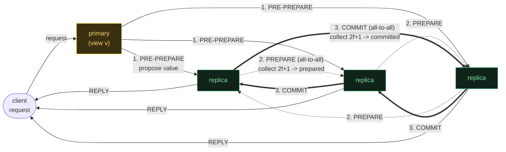
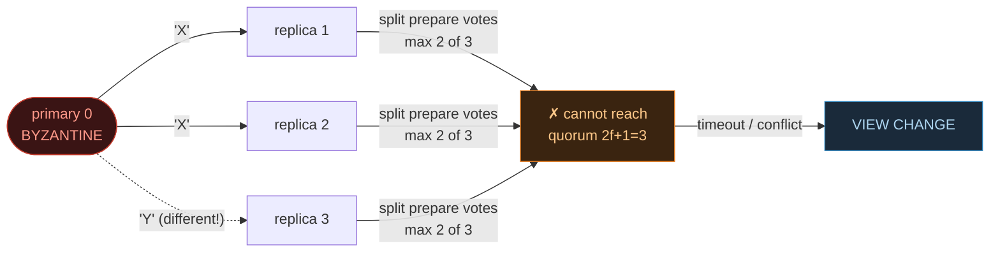

# PBFT — Practical Byzantine Fault Tolerance

> A concept bundle for distributed systems. Every number below is printed by
> **`pbft.py`** (pure Python stdlib, run with `python3 pbft.py`) and recomputed
> live in **`pbft.html`**. This guide never hand-computes anything — it cites
> the `.py` output verbatim.
>
> 🔗 Interactive companion: `pbft.html` &nbsp;|&nbsp; Source of truth: `pbft.py`
> &nbsp;|&nbsp; Related: `CRASH_VS_BYZANTINE.md` (why `3f+1`, not `2f+1`)

---

## 0. The one-paragraph version

PBFT (Castro & Liskov, 1999) lets **`N = 3f+1`** replicas agree on one ordered
log of operations even though up to **`f`** of them are **Byzantine** (they may
lie, forge, and equivocate). It does this with a **three-phase vote** per
request:

| phase | who talks | quorum to advance | meaning |
|---|---|---|---|
| **Pre-Prepare** | primary → all (`1 → N-1`) | — | the primary *proposes* a value for slot `n` |
| **Prepare** | all → all (`N²`) | **`2f+1`** matching prepares | "the network has *seen* this value — no conflicting value can also be prepared" |
| **Commit** | all → all (`N²`) | **`2f+1`** matching commits | "it is safe to *execute* and reply to the client" |

Two all-to-all rounds is exactly why PBFT costs **`O(N²)`** messages per
request. Crash-only protocols (Paxos/Raft) are `O(N)` because only the leader
talks — but they cannot withstand lies. If the primary is itself a traitor, the
Prepare phase detects the equivocation (no replica can gather `2f+1` matching
votes) and a **view change** rotates leadership to the next replica.

> From `pbft.py` Section E (comparison table):
> ```text
> | protocol  | fault model | min N | quorum | msgs / request | leader / view change          |
> |-----------|-------------|-------|--------|----------------|-------------------------------|
> | Raft      | crash       | 2f+1  | f+1    | O(N)           | leader election, O(N log N) msgs |
> | PBFT      | byzantine   | 3f+1  | 2f+1   | O(N^2)         | view change, O(N^2) msgs          |
> | Tendermint| byzantine   | 3f+1  | 2f+1   | O(N^2)         | round-robin proposer, 2 rounds    |
> | HotStuff  | byzantine   | 3f+1  | 2f+1   | O(N)           | LINEAR view change (threshold signatures) |
> ```

---

## 1. The notary's-office intuition

A town of `N` notaries must stamp one official record per slot, but up to `f`
notaries are traitors. PBFT makes them vote twice:



- **Pre-Prepare** is *linear* — one primary, one broadcast.
- **Prepare** and **Commit** are *all-to-all* — every replica talks to every
  other. This is the `N²` term.
- The **two rounds are not redundant**. Prepare proves *uniqueness* (no
  conflicting value can also be prepared); Commit proves *durability* (enough
  replicas know it is unique that it is safe to execute). Together they give
  both **safety** and **liveness** under Byzantine faults.

---

## 2. Section A — the three phases (`N=4, f=1`, honest primary): all commit

With an honest primary the protocol runs straight through Pre-Prepare → Prepare
→ Commit. For `N=4` every replica ends up holding `4 ≥ 2f+1=3` matching votes in
each round, so all four commit the same value.

> From `pbft.py` Section A:
> ```text
> Setup:  N = 3f+1 = 4 replicas,  f = 1,  quorum Q = 2f+1 = 3
>         view = 0,  primary = view mod N = 0 mod 4 = 0
>   cluster:   [0*] [1 ] [2 ] [3 ]     (* = primary)
>
> --- Phase 1: PRE-PREPARE  (primary broadcasts its proposal) ---
>   primary 0 -> PRE-PREPARE(v=0, n=1, 'PAY(alice,100)')
>       -> replica 1  -> replica 2  -> replica 3
>   messages: 3  (= N-1 = 3)
>
> --- Phase 2: PREPARE  (all-to-all vote, O(N^2)) ---
>   Every replica broadcasts a PREPARE for the proposal to every peer:
>   replica 0 -> {1, 2, 3}: PREPARE(v=0, n=1, 'PAY(alice,100)')
>   replica 1 -> {0, 2, 3}: PREPARE(v=0, n=1, 'PAY(alice,100)')
>   replica 2 -> {0, 1, 3}: PREPARE(v=0, n=1, 'PAY(alice,100)')
>   replica 3 -> {0, 1, 2}: PREPARE(v=0, n=1, 'PAY(alice,100)')
>   messages: 12  (= N*(N-1) = 4*3 = 12)
>   per-replica prepare tally (matching votes received, self incl.):
>     replica 0: 4 votes [0,1,2,3]  >= quorum 3?  PREPARED
>     ... (replicas 1,2,3 likewise PREPARED)
>
> --- Phase 3: COMMIT  (all-to-all second vote, prepared replicas) ---
>   4 prepared replica(s) [0,1,2,3] each broadcast a COMMIT:   messages: 12
>   per-replica commit tally: all 4 hold 4 votes >= 3  -> COMMITTED
>
> --- Summary ---
>   pre-prepare: 3   prepare: 12   commit: 12   TOTAL: 27  (= (N-1)(2N+1) = 3*9)
>   compare N^2 = 16;  total/N^2 = 1.69  -> grows as O(N^2)
>   all 4 replicas committed 'PAY(alice,100)'?  YES -> CONSENSUS
> [check] all replicas committed the same value:  OK
> ```

### The message-count formula

Per request, point-to-point unicast:

```
pre_prepare = N - 1            (primary -> backups)
prepare     = N * (N - 1)      (all-to-all)
commit      = N * (N - 1)      (all-to-all)
total       = (N - 1) + 2·N·(N - 1) = (N - 1)(2N + 1)   =  O(N²)
```

For `N=4`: `3·9 = 27`. The dominant term `2N(N-1)` is what makes PBFT
quadratic. 🔗 Slide `N` in `pbft.html` Panel ③ and watch the PBFT bar outrun
Raft's `O(N)` bar.

---

## 3. Section B — Byzantine primary: equivocation is *detected* in Prepare

Now the primary is the traitor. It sends **different** values to different
replicas (`X` to replicas 1,2 but `Y` to replica 3). Each replica faithfully
votes for what it received — so the Prepare votes split, and **no replica can
assemble `2f+1 = 3` matching votes**. Replicas also *see* the conflicting
prepares (replica 3's `Y` vs replicas 1,2's `X`), which is direct evidence of
equivocation.

> From `pbft.py` Section B:
> ```text
> Setup:  N = 4, f = 1, primary = 0 is BYZANTINE
>   cluster:   [0!] [1 ] [2 ] [3 ]     (! = Byzantine)
>
> ATTACK -- the primary EQUIVOCATES: it sends DIFFERENT proposals:
>   primary 0 -> PRE-PREPARE(v=0, n=1, 'X') -> replicas 1,2
>   primary 0 -> PRE-PREPARE(v=0, n=1, 'Y') -> replica  3
>
> --- Phase 2: PREPARE -- each replica votes for the value IT got ---
>   replica 1 -> {0,2,3}: PREPARE 'X'
>   replica 2 -> {0,1,3}: PREPARE 'X'
>   replica 3 -> {0,1,2}: PREPARE 'Y'
>
>   per-replica prepare tally -- votes are SPLIT across 'X' and 'Y':
>     replica 1:  2 vote(s) for 'X' from [1,2],  1 for 'Y' from [3]  -> CANNOT PREPARE
>     replica 2:  2 vote(s) for 'X' from [1,2],  1 for 'Y' from [3]  -> CANNOT PREPARE
>     replica 3:  2 vote(s) for 'X' from [1,2],  1 for 'Y' from [3]  -> CANNOT PREPARE
>
> DETECTION:
>   No replica can assemble 3 matching votes ... replicas 1 & 2 SEE replica 3's
>   prepare for 'Y' while they hold 'X' -> two values for the same (view,seq)
>   -> EQUIVOCATION.  => primary 0 is suspect -> trigger a VIEW CHANGE.
> [check] no honest replica reached quorum 3 (attack detected):  OK
> ```



**Key takeaway.** PBFT does not *trust* the primary — it *verifies* it through
the all-to-all Prepare round. Equivocation cannot produce a quorum, and the
conflicting votes themselves are the evidence that triggers recovery.

---

## 4. Section C — quorum certificates: the portable *proof* of agreement

A **certificate** is the *set* of `2f+1` signed matching votes. It is portable:
anyone (including a future primary after a view change) can verify it without
re-running the vote. There are two kinds:

- **prepared certificate** = `2f+1` matching **PREPARE** messages,
- **committed certificate** = `2f+1` matching **COMMIT** messages.

> From `pbft.py` Section C:
> ```text
>   prepared  certificate : 3 (= 2f+1) matching PREPARE messages
>   committed certificate: 3 (= 2f+1) matching COMMIT  messages
>
> WHY 2f+1 is the magic number (== CRASH_VS_BYZANTINE.md derivation):
>   two 3-vote quorums on 4 replicas overlap in at least  2*Q - N = 2*3 - 4 = 2 node(s).
>   of those 2, at most f = 1 can be Byzantine, so at least 2 - 1 = 1 is HONEST.
>   An honest replica cannot sign two conflicting prepares for the same
>   (view, seq) -> two CONFLICTING prepared certs cannot both exist.
>
> --- Assembling a prepared certificate (collect prepares one by one) ---
>   + prepare from replica 1:  signers = [1]      (1/3)  need 2 more
>   + prepare from replica 2:  signers = [1, 2]   (2/3)  need 1 more
>   + prepare from replica 3:  signers = [1, 2, 3] (3/3)  QUORUM REACHED -> VALID CERTIFICATE
>   prepared certificate = {replica 1, replica 2, replica 3}
>   honest signers >= |cert| - f = 3 - 1 = 2  -> >= 1 honest replica was prepared.
> ```

### Why `2f+1` (one picture)

The quorum size is chosen so that **any two certificates overlap in at least
`f+1` nodes**, hence in at least **one honest** node. That honest node signed
both certificates, and an honest node never signs two conflicting values for the
same `(view, seq)` — so **two conflicting certificates cannot coexist**. This is
the *same* inclusion-exclusion argument as `CRASH_VS_BYZANTINE.md` §5:

> ```text
> | f | N=3f+1 | quorum Q=2f+1 | cert signers | honest in cert | quorum overlap |
> |---|--------|---------------|--------------|----------------|----------------|
> | 1 | 4      | 3             | 3            | 2              | 2              |
> | 2 | 7      | 5             | 5            | 3              | 3              |
> | 3 | 10     | 7             | 7            | 4              | 4              |
> | 4 | 13     | 9             | 9            | 5              | 5              |
> | 5 | 16     | 11            | 11           | 6              | 6              |
> ```

A prepared certificate is what the new primary **must honour** during a view
change: a value that earned a prepared cert cannot be silently dropped, because
a client may already hold `f+1` matching replies for it.

---

## 5. Section D — view change: depose the primary, rotate leadership

When the primary is suspected faulty, replicas stop accepting its pre-prepares
and rotate the view. The new primary is `view mod N` (round-robin), so view 1's
primary is replica `1`. It must collect `2f+1` view-change messages, each
carrying the sender's latest **prepared certificate**, then re-propose.

> From `pbft.py` Section D:
> ```text
>   view 0:    [0!] [1 ] [2 ] [3 ]
>   new view = 1,  new primary = view mod N = 1 mod 4 = 1
>
> --- Step 1: replicas broadcast VIEW-CHANGE(v=1, prepared_certs) ---
>   replica 1 -> VIEW-CHANGE(v=1, last_seq=0, prepared_certs={})   (nothing prepared)
>   replica 2 -> VIEW-CHANGE(v=1, last_seq=0, prepared_certs={})
>   replica 3 -> VIEW-CHANGE(v=1, last_seq=0, prepared_certs={})
>
> --- Step 2: new primary collects 2f+1 view-change messages ---
>   + VIEW-CHANGE from replica 1:  have [1]      (1/3)  need 2 more
>   + VIEW-CHANGE from replica 2:  have [1, 2]   (2/3)  need 1 more
>   + VIEW-CHANGE from replica 3:  have [1, 2, 3] (3/3) QUORUM -> send NEW-VIEW
>
> --- Step 3: new primary inspects prepared certificates ---
>   highest prepared seq = 0 (nothing prepared in view 0) -> safe to re-propose.
>
> --- Step 4: re-run the three phases under honest primary 1 ---
>   prepare: honest [1,2,3] each gather 3 prepares (>= 3) -> PREPARED
>   commit:  honest [1,2,3] each gather 3 commits  (>= 3) -> COMMITTED
>   view 1:    [0!] [1*] [2 ] [3 ]
>   honest replicas [1, 2, 3] committed:  ['X', 'X', 'X']
> [check] after view change all 3 honest replicas agree on 'X':  OK
> ```

```mermaid
sequenceDiagram
  participant R0 as replica 0 (byz)
  participant R1 as replica 1
  participant R2 as replica 2
  participant R3 as replica 3
  R0->>R1: PRE-PREPARE 'X'
  R0->>R2: PRE-PREPARE 'X'
  R0->>R3: PRE-PREPARE 'Y'  (equivocate)
  Note over R1,R3: Prepare splits; nobody reaches 2f+1
  R1-->>R2: VIEW-CHANGE(v=1)
  R2-->>R1: VIEW-CHANGE(v=1)
  R3-->>R1: VIEW-CHANGE(v=1)
  Note over R1: new primary (v=1 mod 4) collects 3 -> NEW-VIEW
  R1->>R2: PRE-PREPARE 'X' (view 1)
  R1->>R3: PRE-PREPARE 'X'
  Note over R1,R3: Prepare 3/3 -> Commit 3/3 -> all honest agree 'X'
```

**Safety during view change** rests on Section C's certificates: because a
prepared certificate carries `≥ f+1` honest signers, the new primary cannot lie
about what was (or was not) prepared. If *anything* was prepared in the old
view, the new primary is forced to re-propose that exact value.

---

## 6. Section E — PBFT vs Raft (and modern BFT)

| | **Raft** (crash) | **PBFT** (Byzantine) |
|---|---|---|
| min nodes | `2f+1` | `3f+1` |
| quorum | majority `f+1` | supermajority `2f+1` |
| messages / request | `O(N)` | `O(N²)` |
| leader change | leader election | view change |
| withstands lies? | **no** | **yes** |

The message-cost gap is concrete and grows with `N`:

> From `pbft.py` Section E:
> ```text
> | N  | f | Raft ~2(N-1) | PBFT (N-1)(2N+1) | ratio PBFT/Raft |
> |----|---|--------------|------------------|-----------------|
> | 4  | 1 | 6            | 27               | 4.5x            |
> | 7  | 2 | 12           | 90               | 7.5x            |
> | 10 | 3 | 18           | 189              | 10.5x           |
> | 16 | 5 | 30           | 495              | 16.5x           |
> | 31 | 10| 60           | 1890             | 31.5x           |
> ```

The ratio grows roughly as `N` — exactly the `O(N²)/O(N)` divergence.

**Modern BFT closes the gap.** HotStuff (Yin et al. 2019) and Tendermint keep
the `3f+1` / `2f+1` safety but cut communication to **`O(N)`** by *aggregating*
signatures: one threshold signature replaces `N` individual ones, so a quorum
certificate (QC) shrinks to `O(1)` size and view change no longer re-broadcasts
`O(N²)` votes. HotStuff is the baseline for DiemBFT / Aptos / Aleo. 🔗 The
quorum-overlap *safety* math is unchanged — only the communication complexity
improves.

---

## 7. Gold check (pinned values for the `.html`)

The `.html` recomputes these in JavaScript from the **identical** formulas and
simulator, then asserts they match the `.py` output. A green `check: OK` badge
means the two implementations agree. The defining property: **with `f=1`
Byzantine node, the 3 honest replicas agree on the same value** (GOLD 3).

> From `pbft.py` GOLD CHECK:
> ```text
> Canonical point: f = 1
>   N = 3f+1               = 4
>   quorum Q = 2f+1        = 3
>   max Byzantine tolerated= (N-1)//3 = (4-1)//3 = 1
>   honest replicas = N-f  = 3
>
> GOLD 1 -- happy path (honest primary 0, value 'X'):
>   messages total = (N-1)(2N+1) = 3*9 = 27
>   all 4 replicas committed 'X'?  True
>
> GOLD 2 -- Byzantine primary (equivocation X,X,Y):
>   no honest replica reached prepare quorum 3?  True   (equivocation detected)
>
> GOLD 3 -- after view change (primary 1, byzantine 0 silent):
>   honest replicas [1, 2, 3] all committed 'X'?  True
>
> GOLD scalars (for a compact .html check):
>   pbft_N(1)             = 4
>   pbft_quorum(1)        = 3
>   pbft_max_byz(4)       = 1
>   messages(4).total     = 27
>   messages(7).total     = 90
>   primary_of_view(1,4)  = 1
>   quorum_overlap(Q=3,N=4) = 2   (= f+1)
>   honest_in_overlap     = 1   (>= 1 -> safety)
>
> [check] all gold identities reproduce from the formulas:  OK
> ```

---

## 8. References

- **Castro & Liskov (1999)** — "Practical Byzantine Fault Tolerance", OSDI. The
  `3f+1` three-phase protocol with view change.
- **Lamport, Shostak, Pease (1982)** — "The Byzantine Generals Problem", ACM
  TOCS. Proved `N ≥ 3f+1` is necessary. 🔗 See `CRASH_VS_BYZANTINE.md` §4.
- **Lamport (1998)** / **Ongaro & Ousterhout (2014)** — Paxos / Raft. Crash-only
  `2f+1`, `O(N)`.
- **Buchman (2016)** — Tendermint: `3f+1` BFT, round-robin proposer.
- **Yin et al. (2019)** — HotStuff, PODC. Linear-view-change `3f+1` BFT with
  threshold signatures.
- **Kleppmann (2017)** — *Designing Data-Intensive Applications*, Ch. 9.

🔗 Back to `pbft.html` for the interactive phase-stepper, Byzantine-primary
detection, and the live message-count comparison.
