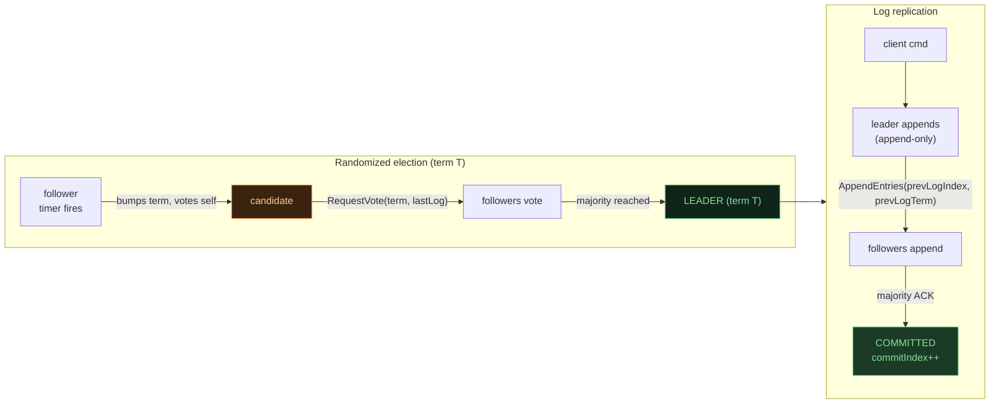
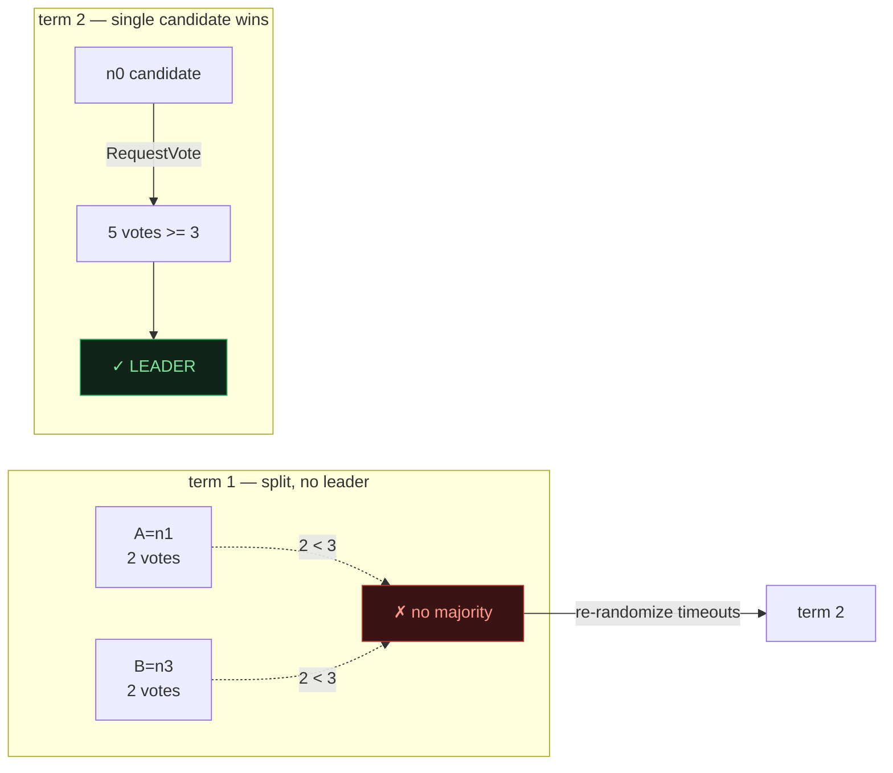
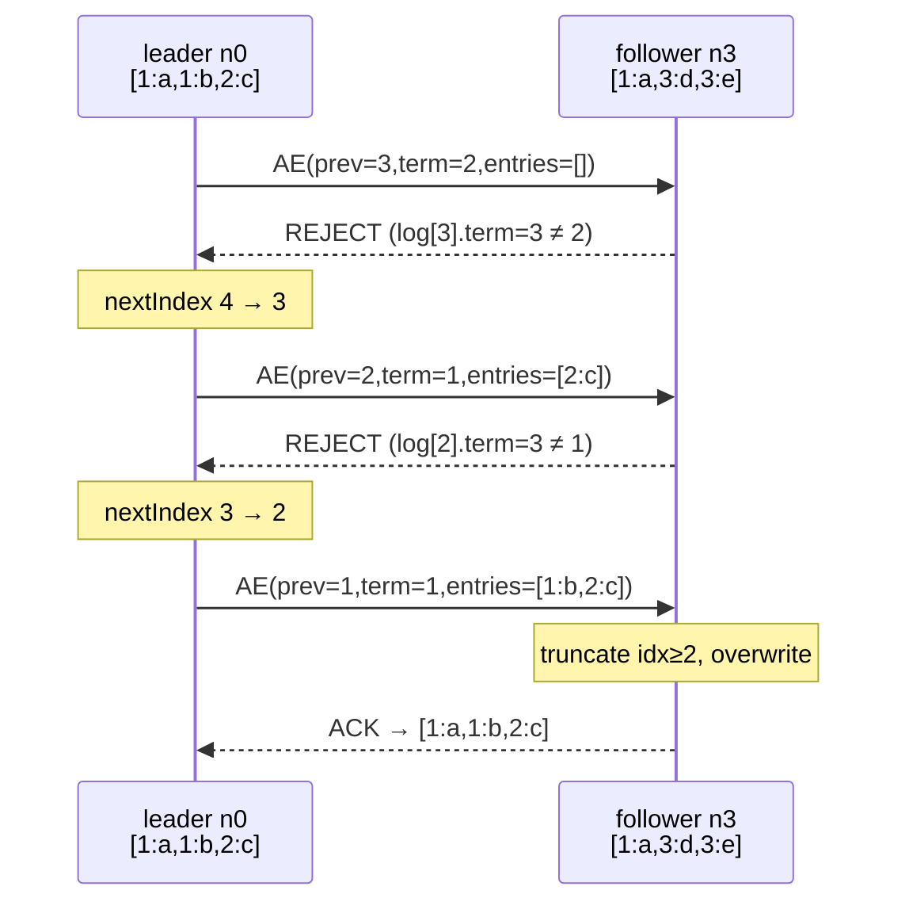

# Raft — Leader-Based Consensus for a Replicated Log

> A concept bundle for distributed systems. Every number below is printed by
> **`raft.py`** (pure Python stdlib, run with `python3 raft.py`) and recomputed
> live in **`raft.html`**. This guide never hand-computes anything — it cites the
> `.py` output verbatim.
>
> 🔗 Interactive companion: `raft.html` &nbsp;|&nbsp; Source of truth: `raft.py`

---

## 0. The one-paragraph version

Raft (Ongaro & Ousterhout 2014) makes a cluster of `N` servers behave like one
reliable machine by keeping them in agreement on a single **ordered log** of
commands. It does this with three deliberately simple mechanisms: (1) a **single
leader** that is the only node allowed to accept client writes each term;
(2) **randomized election timeouts** so a unique leader is elected without
coordination — the first follower whose timer fires becomes a candidate, bumps
its **term**, and asks the others for votes (`RequestVote`); the first candidate
to a **majority** (`⌊N/2⌋+1`) wins; and (3) **leader-driven log replication** —
the leader appends each command to its own log and pushes it to followers with
`AppendEntries`; an entry is **committed** once a majority has it. The leader
never overwrites its own log (append-only), but it **overwrites** stale
uncommitted entries on followers until they match. With `N=5`, a majority is `3`.

> From `raft.py` GOLD CHECK (the headline numbers):
> ```text
>   majority(5)                    = 3
>   election_winner_seed2024       = n1
>   election_term                  = 1
>   commit_index_after_replication = 3
>   committed_entries              = [(1, 'x1'), (1, 'x2'), (1, 'x3')]
>   majority_consistent            = True
> ```

---

## 1. The ship's-logbook intuition

Think of the cluster as a ship that must keep one master logbook — every
replica must end up with the **same commands in the same order**. There is one
**captain** (the leader); the crew (followers) copy the captain's logbook
entry-by-entry.



- **Terms are the safety clock.** Each election starts a new term; a node with a
  higher term always forces lower-term nodes to step down. Terms detect stale
  leaders.
- **Majority overlap = at most one leader per term.** Any two majorities of `N=5`
  share ≥1 node, and that node voted for only one candidate in the term — so two
  candidates cannot both win the same term.
- **The leader is the source of truth for the log.** Followers' logs are made to
  *converge* to the leader's; conflicting follower entries (from old dead
  leaders) are overwritten.

---

## 2. Section A — leader election (`N=5`): randomized timeout → `RequestVote`

Five nodes boot as followers in term `0`. Each gets a **random** election timeout
(`150–300 ms` here, seeded so the run is reproducible). The first timer to fire
turns its node into a candidate; it increments the term, votes for itself, and
sends `RequestVote(term, candidateId, lastLogIndex, lastLogTerm)`. The first
candidate to reach a majority (`3`) becomes leader.

> From `raft.py` Section A:
> ```text
> Seeded election timeouts (random.Random(2024), range 150-300 ms):
>     n0: 270 ms
>     n1: 196 ms  <-- fires first -> becomes candidate
>     n2: 298 ms
>     n3: 227 ms
>     n4: 201 ms
>
>   candidate = n1,  increments term 0 -> 1
>   votes for self: {n1}
>   sends RequestVote(term=1, candidateId=n1, lastLogIndex=0, lastLogTerm=0)
>
>   vote tally (1 = granted):
>     n0: GRANTED
>     n1: (self)
>     n2: GRANTED
>     n3: GRANTED
>     n4: GRANTED
>
>   votes = [0, 1, 2, 3, 4]  ->  |votes| = 5
>   majority(N=5) = floor(5/2)+1 = 3
>   5 >= 3 ?  YES -> n1 becomes LEADER
>   n0:fol  n1:lea  n2:fol  n3:fol  n4:fol
>
> [check] exactly one leader (n1), term=1, votes=5>=3:  OK
> ```

**Why this is safe.** A voter grants at most one vote per term. Since two
majorities always share a node, that shared node can have voted for only one
candidate — so **at most one leader can exist per term** (Election Safety). The
randomized timeouts keep two candidates from firing at once in practice; when it
does happen (Section B), it self-heals.

🔗 In `raft.html` Panel ①, click a node to crash it and press *Run election* —
the live nodes re-elect a leader on the re-randomized timeouts.

---

## 3. Section B — split vote: two candidates, one term, no winner

Randomized timeouts make this rare, but it *can* happen: two followers time out
in the same instant and both become candidates **in the same term**. The
remaining voters split their single vote; if neither candidate reaches a
majority, the term ends with **no leader**. Everyone lets their timers
re-randomize and a fresh term elects one candidate cleanly — no extra protocol
machinery required.

> From `raft.py` Section B:
> ```text
> Setup: n4 is DOWN this term (partitioned) so only 4 nodes vote.
>   candidates : n1 (A) and n3 (B), both in term T.
>   voters     : n0 and n2 (each may vote for exactly ONE candidate).
>
>   term T = 1   (n4 partitioned)
>   A=n1 votes: self(n1) + n0 = 2
>   B=n3 votes: self(n3) + n2 = 2
>
>   majority(N=5) = 3.
>   A: 2 >= 3 ? NO
>   B: 2 >= 3 ? NO
>   -> neither candidate reaches a majority. Term 1 has NO leader.
>      Both candidates stay CANDIDATE and let their timers re-randomize.
>
> Resolution: next term T+1, a SINGLE node times out first and wins.
>   term 2: n0 times out first (185 ms), collects 5 votes [0, 1, 2, 3, 4] -> LEADER.
>
> WHY split votes self-heal: only ONE node can hold each voter's vote
> per term, so a 50/50 split simply wastes the term; a fresh term with a
> single candidate breaks the tie. No extra protocol machinery needed.
>
> [check] term 1 had 0 leaders, term 2 has 1:  OK
> ```



---

## 4. Section C — log replication: `AppendEntries` → majority ack → commit

A client sends a command. The **leader appends** it to its own log (never
overwrites — *leader append-only*), then pushes it to followers with
`AppendEntries(term, leaderId, prevLogIndex, prevLogTerm, entries[],
leaderCommit)`. A follower **accepts** the RPC only if
`log[prevLogIndex].term == prevLogTerm` — the **log-matching property**, which
guarantees the follower's log matches the leader's up to `prevLogIndex`. Once a
**majority** has the entry, it is **committed**; the leader advertises the new
`commitIndex` on the next `AppendEntries` so followers apply it.

> From `raft.py` Section C:
> ```text
>   leader n0 (term 1), leader.log = [1:x1, 1:x2, 1:x3], commit_index = 0
>   followers (initial):
>     n1: [1:x1, 1:x2, 1:x3]
>     n2: [1:x1, 1:x2]   <-- stale: missing x3
>     n3: [1:x1, 1:x2, 1:x3]
>     n4: [1:x1, 1:x2, 1:x3]
>
>     step 1: leader sends AppendEntries(prevLogIndex=3, prevLogTerm=1, entries=[])
>       -> ACK, follower.log now [1:x1, 1:x2, 1:x3]
>     step 1: leader sends AppendEntries(prevLogIndex=3, prevLogTerm=1, entries=[])
>       -> REJECT (log mismatch at prevLogIndex=3); decrement nextIndex -> 3
>     step 2: leader sends AppendEntries(prevLogIndex=2, prevLogTerm=1, entries=[1:x3])
>       -> ACK, follower.log now [1:x1, 1:x2, 1:x3]
>
>   acks this round: [0, 1, 2, 3, 4]  (leader counts its own copy)
>   copies of x3 = leader + 4 followers = 5 >= majority 3 -> commit_index advances 0 -> 3
>
>   logs after replication + commit:
>     n0 (leader): [1:x1, 1:x2, 1:x3]  commit=3
>     n1:        [1:x1, 1:x2, 1:x3]  commit=3
>     n2:        [1:x1, 1:x2, 1:x3]  commit=3   <-- was repaired
>     n3:        [1:x1, 1:x2, 1:x3]  commit=3
>     n4:        [1:x1, 1:x2, 1:x3]  commit=3
>
> [check] commit_index=3 and all nodes agree on entries 1..3:  OK
> ```

**Key points.** The stale follower `n2` was repaired by sending
`AppendEntries(prevLogIndex=2, prevLogTerm=1, entries=[1:x3])`: its `log[2].term`
matched, so it appended `x3`. An entry is committed the *instant* a majority has
it — even before every follower is caught up. The leader never overwrote its own
log; it only appended.

🔗 `raft.html` Panel ② steps through the same replication; Panel ③ shows the
harder *conflicting-entry* repair.

---

## 5. Section D — leader election restriction: a stale log loses the vote

A voter **refuses** to grant its vote to a candidate whose log is *less
up-to-date* than its own. "Up-to-date" (Raft §5.4.1) means the candidate's last
entry has a **higher term**, *or* (equal last term **and** a longer-or-equal
log). This single rule is what guarantees a winning candidate's log already
contains **every committed entry** (*Leader Completeness*) — the heart of Raft
safety.

> From `raft.py` Section D (comparison table):
> ```text
> | # | voter last (t,i) | candidate last (t,i) | up-to-date? | reason                  |
> |---|------------------|-----------------------|-------------|-------------------------|
> | 1 | (2,2)            | (1,1)                 | NO          | cand last_term 1 < voter 2 |
> | 2 | (1,2)            | (2,1)                 | YES         | cand last_term 2 > voter 1 |
> | 3 | (2,3)            | (2,2)                 | NO          | same term, cand shorter (2<3) |
> | 4 | (2,2)            | (2,3)                 | YES         | same term, cand >= voter length |
> | 5 | (0,0)            | (0,0)                 | YES         | both empty (bootstrap election) |
> ```

A worked denial: voter `n0` holds committed entries up to term 2, while a node
with a stale term-1 log tries to win term 3 and is refused:

> From `raft.py` Section D (worked election):
> ```text
>   voter  n0: [1:a, 2:b]   last entry = (term 2, index 2)
>   cand.  n1: [1:x]  last entry = (term 1, index 1)
>
>   is_up_to_date(cand_last_term=1, cand_last_index=1, voter=n0)?
>     candidate last_term (1) vs voter last_term (2): lower -> NOT up-to-date.
>   RequestVote -> DENIED
>
> [check] stale candidate denied vote (up_to_date=False, granted=False):  OK
> ```

Without this restriction, a node that had missed committed entries could win an
election and overwrite them. The up-to-date check makes that impossible.

---

## 6. Section E — log consistency & repair: overwrite conflicting entries

A new leader may inherit followers carrying **uncommitted** entries from an *old
dead leader* (a different term, never replicated). Raft repairs them by walking
`nextIndex` **down** until it finds one matching `(index, term)`, then
**truncates** the follower's log from there and **overwrites** it with the
leader's entries. The log-matching invariant — *if two logs agree on entry
`(index, term)`, they agree on everything before it* — means a single match
point is enough to make the follower consistent again.

> From `raft.py` Section E:
> ```text
>   leader  n0 (term 2): [1:a, 1:b, 2:c]  commit_index=2
>   follower n3        : [1:a, 3:d, 3:e]   (entries d,e from a dead term-3 leader)
>   leader.nextIndex[n3] starts at 4 (leader last index + 1)
>
>     step 1: leader sends AppendEntries(prevLogIndex=3, prevLogTerm=2, entries=[])
>       -> REJECT (log mismatch at prevLogIndex=3); decrement nextIndex -> 3
>     step 2: leader sends AppendEntries(prevLogIndex=2, prevLogTerm=1, entries=[2:c])
>       -> REJECT (log mismatch at prevLogIndex=2); decrement nextIndex -> 2
>     step 3: leader sends AppendEntries(prevLogIndex=1, prevLogTerm=1, entries=[1:b, 2:c])
>       -> ACK, follower.log now [1:a, 1:b, 2:c]
>
>   final follower n3: [1:a, 1:b, 2:c]
>   follower.log == leader.log ?  True
>
> [check] follower repaired to match leader (match=True):  OK
> ```



The conflicting `(3:d),(3:e)` were **uncommitted**, so discarding them is safe:
they could never have been committed, because the election restriction (Section
D) prevents a candidate carrying the committed `a,b` from losing to one carrying
only `d,e`. **Committed data is never lost.**

---

## 7. Gold check (pinned values for the `.html`)

The `.html` recomputes the **full pipeline** in JavaScript — elect a leader on
the seed-2024 timeouts, replicate a 3-entry log (with one stale follower
repaired), commit once a majority has it, then assert the committed logs are
byte-identical across the majority. A green `check: OK` badge means the two
implementations agree.

> From `raft.py` GOLD CHECK:
> ```text
>   election (seed 2024): winner = n1, term = 1, votes = [0, 1, 2, 3, 4] (5 >= 3)
>   seeded timeouts = {0: 270, 1: 196, 2: 298, 3: 227, 4: 201}
>   leader.log = [1:x1, 1:x2, 1:x3]
>   after replication: commit_index = 3
>   nodes with the committed log (1..3): [0, 1, 2, 3, 4] (5 >= 3)
>
>   committed log (entries 1..3) per node:
>     n0: [(1, 'x1'), (1, 'x2'), (1, 'x3')]
>     n1: [(1, 'x1'), (1, 'x2'), (1, 'x3')]
>     n2: [(1, 'x1'), (1, 'x2'), (1, 'x3')]
>     n3: [(1, 'x1'), (1, 'x2'), (1, 'x3')]
>     n4: [(1, 'x1'), (1, 'x2'), (1, 'x3')]
>
> GOLD scalars (for a compact .html check):
>   majority(5)                    = 3
>   election_winner_seed2024       = n1
>   election_term                  = 1
>   election_vote_count            = 5
>   commit_index_after_replication = 3
>   committed_entries              = [(1, 'x1'), (1, 'x2'), (1, 'x3')]
>   majority_consistent            = True
>
> [check] majority committed logs identical & all gold identities hold:  OK
> ```

This is **State Machine Safety** made concrete: after leader election and log
replication, every node in the majority has the *identical* committed log.

### The five Raft safety invariants (and where they show up here)

| Invariant | What it guarantees | Where this bundle shows it |
|---|---|---|
| **Election Safety** | at most one leader per term | Section A (majority overlap) |
| **Leader Append-Only** | a leader never overwrites/deletes its own log | Section C (leader only appends) |
| **Log Matching** | same `(index, term)` ⟹ identical prefix | Section C/E (prevLogIndex check) |
| **Leader Completeness** | a winner's log has every committed entry | Section D (up-to-date vote) |
| **State Machine Safety** | committed entries identical across the majority | Gold check (majority_consistent) |

---

## 8. References

- **Ongaro & Ousterhout (2014)** — "In Search of an Understandable Consensus Algorithm" (Raft), USENIX ATC. The protocol implemented here. Crash-fault tolerant (`2f+1`).
- **Ongaro (2014), PhD thesis** — "Consensus: Bridging Theory and Practice". Membership changes (joint consensus), the Figure 8 log-repair argument.
- **Lamport (1998)** — "The Part-Time Parliament" (Paxos). The predecessor; Raft is its readable cousin. 🔗 See `CRASH_VS_BYZANTINE.md` for the `2f+1`/`3f+1` threshold derivation.
- **Junqueira, Reed, Serafini** — Zab (ZooKeeper's atomic broadcast), a Raft-like leader-based protocol.
- **Kleppmann (2017)** — *Designing Data-Intensive Applications*, Ch. 9 (Consistency & Consensus).
- **Tanenbaum & Van Steen** — *Distributed Systems*, Ch. 8 (Fault Tolerance).

Production Raft: etcd/Kubernetes, HashiCorp Consul, TiKV — typically `N=3` (survives 1 crash) or `N=5` (survives 2).

🔗 Back to `raft.html` for the interactive election, replication, and repair.
