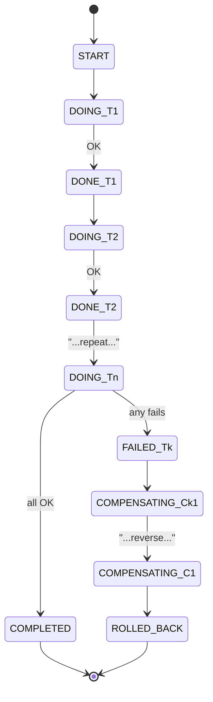
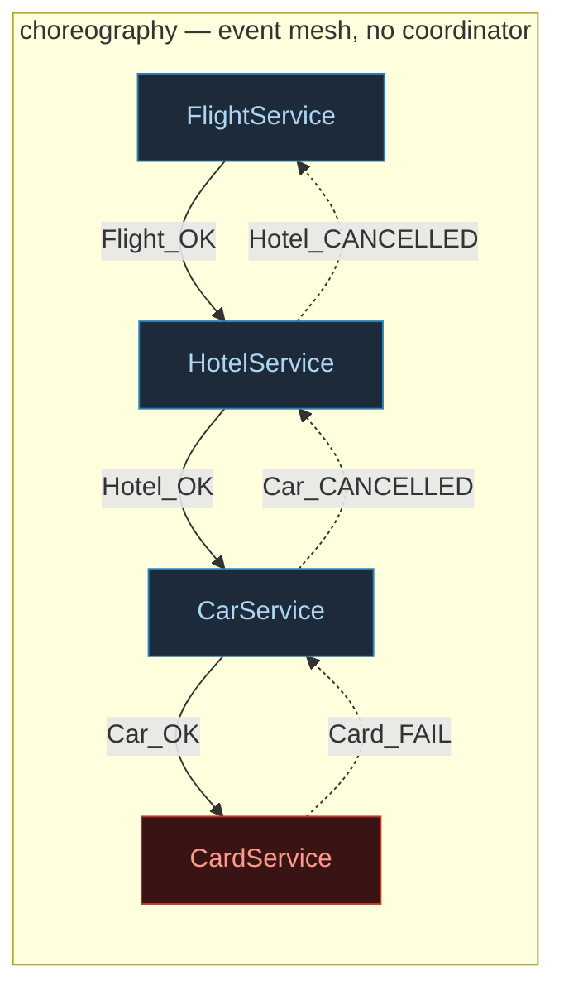

# Saga Pattern — Distributed Transactions Without Global Locks

> A concept bundle for distributed systems. Every number below is printed by
> **`saga_pattern.py`** (pure Python stdlib, run with `python3 saga_pattern.py`)
> and recomputed live in **`saga_pattern.html`**. This guide never
> hand-computes anything — it cites the `.py` output verbatim.
>
> 🔗 Interactive companion: `saga_pattern.html` &nbsp;|&nbsp; Source of truth: `saga_pattern.py`

---

## 0. The one-paragraph version

A **saga** (Garcia-Molina & Salem, 1987) models a long-running distributed
transaction as a **sequence of local transactions** `T1, T2, …, Tn`, each paired
with a **compensating transaction** `C1, C2, …, Cn`. Each `Ti` lives inside one
service's own ACID database; the saga as a whole spans many services and so
cannot use a global lock. If step `Tk` **fails**, the saga does **not** roll back —
it runs the compensations `C(k-1), C(k-2), …, C1` in **reverse order** to
semantically undo whatever already happened. Crucially, compensation is **not a
rollback**: the real world moved on (a seat was held), so a compensating action
applies a *business* counter-action (refund **minus a cancellation fee**) whose
net effect is **non-zero**. Two coordination styles exist: **orchestration**
( a central coordinator — Temporal, Camunda, AWS Step Functions — calls each
service in turn and drives compensation) and **choreography** (no coordinator;
each service reacts to the previous service's events, and on failure emits an
event the prior service reacts to, rippling backwards). The trade-off versus
2PC: sagas give up **isolation** (partial states are visible mid-saga) and
instant atomicity, but gain **availability** and **non-blocking** progress — the
system never freezes holding cross-service locks.

> From `saga_pattern.py` GOLD CHECK (the headline numbers):
> ```text
>   initial_wallet        = 1000
>   num_steps            = 4
>   failed_step_index    = 3  (ChargeCard)
>   forward_attempted    = 4
>   forward_ok           = 3
>   compensation_count   = 3
>   compensation_order   = ['CancelCar', 'CancelHotel', 'CancelFlight']
>   total_cancellation_fees = 100
>   final_wallet         = 900
>   final_services       = {'Flight': 'compensated', 'Hotel': 'compensated', 'Car': 'compensated', 'Card': 'failed'}
>   orchestration_wallet = 900  (== final_wallet)
>   choreography_wallet  = 900  (== final_wallet)
>   all_compensated      = True
> ```

---

## 1. The non-refundable-trip intuition

You book a trip online across **four independent services** — airline, hotel
chain, car rental, payment gateway. No single database spans them, so a classic
ACID transaction is impossible. Instead you run a **saga**: do step 1, step 2,
step 3, step 4. If step 4 (charge card) fails, you cannot "un-book" the flight;
you can only **cancel** it, and the airline keeps a cancellation fee.


- **Forward chain** runs left→right: `T1 → T2 → T3 → T4`. Each charges the wallet.
- **On failure**, compensations run right→left for the *completed* steps only:
  `C3 → C2 → C1` (reverse order, most-recent-first).
- **The failed step (`T4`) is never compensated** — it had no effect (card never
  charged), so there is nothing to undo. Its compensation `RefundCard` is N/A.

---

## 2. Section A — the booking saga: forward chain + reverse compensation

Four steps, each with its compensating transaction. Forward actions charge the
wallet; compensations refund **minus a cancellation fee**.

> From `saga_pattern.py` Section A:
> ```text
> The 4 steps (each with its compensating transaction):
>
> | #  | forward (Ti)  | cost   | compensation (Ci) | refund | fee   |
> |----|---------------|--------|-------------------|--------|-------|
> | T1 | BookFlight    | $300    | CancelFlight      | $250    | $50    |
> | T2 | BookHotel     | $200    | CancelHotel       | $170    | $30    |
> | T3 | RentCar       | $100    | CancelCar         | $80     | $20    |
> | T4 | ChargeCard    | $50     | RefundCard        | $50     | $0     |
>
> starting wallet = $1000
>
> --- (1) HAPPY PATH: all 4 steps succeed (no failure) ---
>   forward : [BookFlight OK] -> [BookHotel OK] -> [RentCar OK] -> [ChargeCard OK]
>   terminal: COMPLETED  (no compensation needed)
>     wallet = $350    services: Flight=done, Hotel=done, Car=done, Card=done
>
> --- (2) FAILURE PATH: step 4 (ChargeCard) fails ---
>   forward : [BookFlight OK] -> [BookHotel OK] -> [RentCar OK] -> [ChargeCard FAIL X]
>            ChargeCard FAILED (card declined). Now compensate the 3
>            COMPLETED steps in REVERSE (most-recent first):
>   comp    : [CancelCar] <- [CancelHotel] <- [CancelFlight]
>            (RefundCard is N/A: ChargeCard never charged anything, so
>             there is nothing to refund for the failed step itself.)
>   terminal: ROLLED_BACK
>     wallet = $900    services: Flight=compensated, Hotel=compensated, Car=compensated, Card=failed
>
>   wallet went $1000 -> $900: a loss of $100 = the SUM of cancellation fees.
> ```

**Two terminal states, nothing in between.** The saga ends either `COMPLETED`
(all `Ti` done) or `ROLLED_BACK` (every `Ti` that started is compensated). The
failed step itself (`T4`) is marked `failed` but had no wallet effect — so it is
consistent with "all started steps are undone". The wallet drops from `$1000` to
`$900`: the `$100` gap is exactly the **sum of cancellation fees** (`$50+$30+$20`).
That gap is *why* compensation ≠ undo (Section 4).

🔗 In `saga_pattern.html` Panel ①, **click any step to fail it** and watch the
compensations roll back in reverse.

---

## 3. Section B — orchestration: the central state machine

An **orchestrator** is the *only* component that knows the whole saga graph. It
calls each service in order (`FlightService.BookFlight()`, …); on failure it
walks **backwards** calling compensations. The services themselves are stateless
workers exposing `do()`/`undo()` and knowing nothing of each other. This is the
Temporal / Camunda / AWS Step Functions model.

> From `saga_pattern.py` Section B (ChargeCard fails):
> ```text
>   state                       action
>   --------------------------- -----------------------------------------
>   START                        orchestrator begins saga
>   DOING_BookFlight             orchestrator calls FlightService.BookFlight()
>   DONE_BookFlight              BookFlight OK
>   DOING_BookHotel              orchestrator calls HotelService.BookHotel()
>   DONE_BookHotel               BookHotel OK
>   DOING_RentCar                orchestrator calls CarService.RentCar()
>   DONE_RentCar                 RentCar OK
>   DOING_ChargeCard             orchestrator calls CardService.ChargeCard()
>   FAILED_ChargeCard            ChargeCard threw -> drive compensation  <-- failure point
>   COMPENSATING_CancelCar       orchestrator calls CarService.CancelCar()  <-- reverse unwind
>   COMPENSATING_CancelHotel     orchestrator calls HotelService.CancelHotel()  <-- reverse unwind
>   COMPENSATING_CancelFlight    orchestrator calls FlightService.CancelFlight()  <-- reverse unwind
>   ROLLED_BACK                  all completed steps compensated
>
>   terminal state: ROLLED_BACK
>     wallet = $900    services: Flight=compensated, Hotel=compensated, Car=compensated, Card=failed
> ```



**Pro:** the flow is explicit and greppable in one place; easy to add retries,
timeouts, branching. **Con:** the orchestrator is a central dependency (a scaling
and single-failure concern).

🔗 `saga_pattern.html` Panel ② toggles between **Orchestration** (central brain)
and **Choreography** (event mesh) views of the same saga.

---

## 4. Section D — compensation is **NOT** undo (it is a semantic inverse)

This is the single most misunderstood part of sagas. A database **rollback**
pretends the transaction never happened — the row returns to its exact prior
value, **net effect zero**. **Compensation cannot do that.** The real world moved
on (a seat was held, a room blocked). A compensating transaction applies a
**business** counter-action whose net effect is generally **non-zero**. Here,
cancelling a booking refunds the charge **minus** a cancellation fee.

> From `saga_pattern.py` Section D:
> ```text
> Net effect of 'do Ti, then do Ci' (this is NOT zero):
> | step        | forward (wallet) | compensation (wallet) | NET   |
> |-------------|------------------|-----------------------|-------|
> | BookFlight  | -$300              | +$250                   | $-50   |
> | BookHotel   | -$200              | +$170                   | $-30   |
> | RentCar     | -$100              | +$80                    | $-20   |
>
> Total NET cost of a fully-rolled-back saga = sum of fees = $100.
>   compensation != undo: the wallet does NOT return to its starting value.
> ```

So after a fully rolled-back saga the wallet is `$900`, **not** `$1000`. The
`$100` difference is the irreducible cost of the real-world side effects that a
true rollback would have erased. Contrast with a single-database rollback, which
restores the balance *exactly* (`net $0`, no fee) — but that is only possible
**within one ACID database**. Across the airline, hotel, and car-rental
databases there is no shared rollback, hence the saga's compensating
transactions, and hence the fees.

🔗 `saga_pattern.html` Panel ③ visualizes the forward charge vs compensation
refund (and the non-zero fee gap) as bars.

---

## 5. Section C — choreography: no coordinator, just events

In **choreography** there is **no central brain**. Each service **subscribes** to
the event that means "your turn" and **publishes** an event when done. On
failure it publishes a `*_FAIL` event; the *preceding* service (subscribed to it)
compensates and publishes `*_CANCELLED`, which wakes the one before it — a
**reverse cascade with no driver**. This is the Kafka / event-driven style.

> From `saga_pattern.py` Section C (ChargeCard fails — watch the cascade ripple backwards):
> ```text
>   client: publish StartSaga
>       FlightService reacts: BookFlight() -> OK -> publish Flight_OK
>           HotelService reacts: BookHotel() -> OK -> publish Hotel_OK
>               CarService reacts: RentCar() -> OK -> publish Car_OK
>                   CardService reacts: ChargeCard() -> FAIL -> publish Card_FAIL
>                       CarService reacts: CancelCar() -> publish Car_CANCELLED
>                           HotelService reacts: CancelHotel() -> publish Hotel_CANCELLED
>                               FlightService reacts: CancelFlight() -> publish Flight_CANCELLED
>                                   SAGA: SagaRolledBack (all completed compensated)
>
>   final state:
>     wallet = $900    services: Flight=compensated, Hotel=compensated, Car=compensated, Card=failed
> ```

The reverse order **emerges** from *who subscribes to what*: `CarService` listens
for `Card_FAIL`, `HotelService` listens for `Car_CANCELLED`, `FlightService`
listens for `Hotel_CANCELLED`. Each service owns only its own rule — adding a 5th
service means **subscribing** it, not editing a central workflow.



**Pro:** no central dependency, services are decoupled, easy to extend. **Con:**
the overall flow is **not visible in one place** (you must trace event
subscriptions across services); risk of cyclic event loops.

---

## 6. Section E — saga vs 2PC: eventual consistency vs blocking ACID

Two-phase commit (2PC) is the classic way to atomically update several
databases. It gives true ACID across them but **blocks**: phase 1 `PREPARE` makes
every participant lock its rows and promise; phase 2 `COMMIT/ABORT` releases
them. If the coordinator (or any participant) stalls between the phases,
**everyone** holds their locks and the system freezes. Sagas trade that
isolation for **non-blocking availability**.

> From `saga_pattern.py` Section E:
> ```text
> | dimension          | saga                              | 2PC (XA)                       |
> |--------------------|-----------------------------------|--------------------------------|
> | consistency model  | EVENTUAL (via compensation)       | ACID (atomic commit)           |
> | isolation          | NONE -- partial states visible    | FULL -- locks hide partial work|
> | atomicity          | semantic (compensate on failure)  | all-or-nothing (commit/abort)  |
> | failure recovery   | run Cj in reverse order           | ABORT + true rollback          |
> | blocking?          | NO -- each step is independent    | YES -- stalls freeze everyone  |
> | locks held         | none across services              | from PREPARE until COMMIT      |
> | coordinator needed | only for orchestration variant    | always (the 2PC coordinator)   |
> | availability       | HIGH (services decoupled)         | LOW (all must be up to commit) |
> | latency (n parts)  | up to n sequential local txns     | 2 rounds, but BLOCKING         |
> | undo on failure    | compensation (non-zero, has fees) | rollback (exact, zero net)     |
> | fits               | microservices, long-lived work    | single DB / tightly-coupled    |
> | examples           | Temporal, Camunda, AWS Step Fn    | XA, DB coordinators            |
>
> The core trade-off, in one line:
>   2PC : locks + atomic commit  -> ACID, but BLOCKING and low availability.
>   Saga: no locks + compensate  -> eventual consistency, but ALWAYS AVAILABLE.
> ```

**Why microservices pick saga:** you **cannot** hold a cross-service lock (the
airline will not block its seat row waiting on your hotel DB). So you give up
**isolation** (a reader can see "flight booked, hotel pending") and accept that
failures are fixed by **compensation**, not rollback. The system never jams.
🔗 Compare with `CAP_TRADEOFFS.md` (CP vs AP) and `RAFT.md` (consensus).

> Latency shape (1 logical update across n participants):
> ```text
> | n  | saga worst-case (n steps) | 2PC (2 blocking rounds) |
> |----|---------------------------|-------------------------|
> | 2  | 2                         | 2 (blocking)            |
> | 4  | 4                         | 2 (blocking)            |
> | 8  | 8                         | 2 (blocking)            |
> | 16 | 16                        | 2 (blocking)            |
> ```

Saga steps may also run **in parallel** when they are independent (the chain
shown is the strict sequential worst case). 2PC always pays its 2 blocking
rounds regardless.

---

## 7. Gold check (pinned values for the `.html`)

The `.html` recomputes the **full pipeline** in JavaScript: build the 4-step
booking saga, fail `ChargeCard`, run reverse compensations — and verifies the
two coordination styles (**orchestration** and **choreography**) reach the
**identical** final state. A green `check: OK` badge means the JS replay matches
`saga_pattern.py` exactly. The gold invariant (Garcia-Molina 1987): **a saga
ends in exactly one of two terminal states — every `Ti` COMPLETED, or every `Ti`
that started is COMPENSATED in reverse** — no `Ti` is left half-applied.

> From `saga_pattern.py` GOLD CHECK:
> ```text
>   reference run (run_saga):
>     forward : [('BookFlight', 'OK'), ('BookHotel', 'OK'), ('RentCar', 'OK'), ('ChargeCard', 'FAIL')]
>     comp    : [('CancelCar', 'COMP'), ('CancelHotel', 'COMP'), ('CancelFlight', 'COMP')]
>     terminal: ROLLED_BACK
>     final   : wallet=$900, services={'Flight': 'compensated', 'Hotel': 'compensated', 'Car': 'compensated', 'Card': 'failed'}
>
>   GOLD scalars (pinned for saga_pattern.html):
>     initial_wallet        = 1000
>     num_steps            = 4
>     failed_step_index    = 3  (ChargeCard)
>     forward_attempted    = 4
>     forward_ok           = 3
>     compensation_count   = 3
>     compensation_order   = ['CancelCar', 'CancelHotel', 'CancelFlight']
>     total_cancellation_fees = 100
>     final_wallet         = 900
>     final_services       = {'Flight': 'compensated', 'Hotel': 'compensated', 'Car': 'compensated', 'Card': 'failed'}
>     orchestration_wallet = 900  (== final_wallet)
>     choreography_wallet  = 900  (== final_wallet)
>     all_compensated      = True
>
>   [check] failed step compensated all priors in reverse; orchestration &
>           choreography reached the SAME final state; wallet reflects fees:  OK
> ```

### The saga invariants (and where they show up here)

| Invariant | What it guarantees | Where this bundle shows it |
|---|---|---|
| **Either-all-or-all-compensated** | terminal state is COMPLETED or ROLLED_BACK, never half-applied | Section A / GOLD CHECK |
| **Reverse-order compensation** | on failure at `Tk`, `C(k-1)…C1` run most-recent-first | Section A/B/C |
| **Compensation ≠ undo** | each `Cj` leaves a non-zero net effect (the fee) | Section D |
| **Coordination-equivalence** | orchestration & choreography reach the same final state | GOLD CHECK |

---

## 8. References

- **Garcia-Molina & Salem (1987)** — "Sagas", Proc. SIGMOD. The original paper. Defined long-lived transactions as a sequence of sub-transactions each with a compensating transaction, and the "either all done or all compensated" rule.
- **Richardson (microservices.io)** — modernized sagas for microservices and codified the **Orchestration vs Choreography** distinction. The travel-booking saga here follows his canonical illustration.
- **Kleppmann (2017)** — *Designing Data-Intensive Applications*, Ch. 11 (Stream Processing) & Ch. 9 (Consistency & Consensus). The saga-vs-2PC and distributed-transaction trade-offs.
- **Gray (1978)** — "Notes on Data Base Operating Systems", the 2PC / XA comparison point: blocking, lock-based atomic commit.
- **Temporal / Camunda / AWS Step Functions** — production orchestration engines for sagas: retries, timeouts, and reverse compensation on terminal failure.
- 🔗 `CAP_TRADEOFFS.md` — the CP (2PC-like) vs AP (saga-like) availability axis.
- 🔗 `RAFT.md` / `PAXOS.md` — per-op consensus (a different beast: agreement, not compensation).

🔗 Back to `saga_pattern.html` for the interactive pipeline (click-to-fail),
the orchestration-vs-choreography toggle, the compensation-≠-undo bars, and the
live gold-check.
