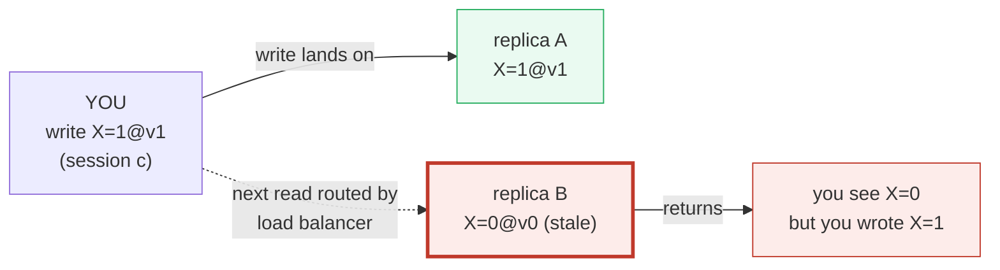
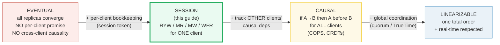
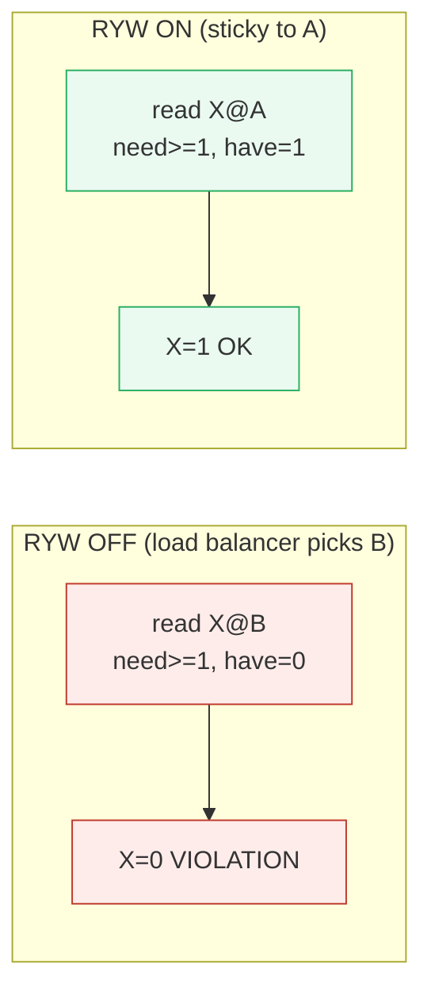
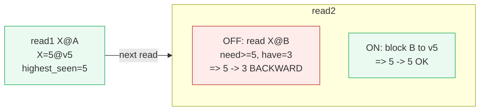
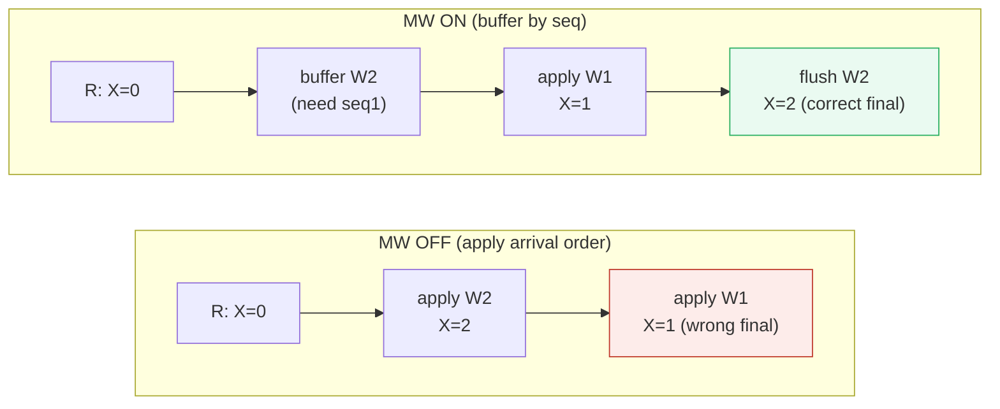
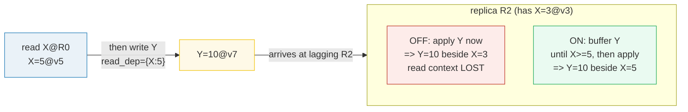
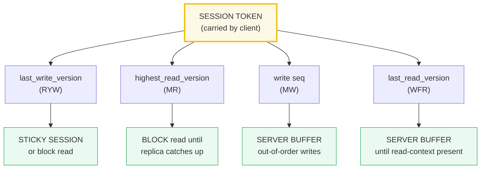
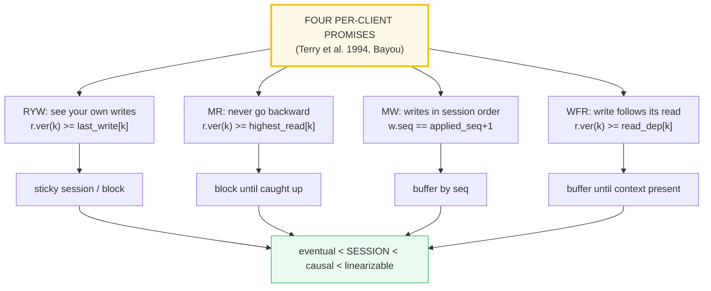

# Session Guarantees — A Visual, Worked-Example Guide

> **Companion code:** [`session_guarantees.py`](./session_guarantees.py).
> **Every number in this guide is printed by `python3 session_guarantees.py`**
> — change the code, re-run, re-paste. Nothing here is hand-computed.
>
> **Live animation:** [`session_guarantees.html`](./session_guarantees.html) —
> open in a browser. Toggle each of the four guarantees on/off and watch the
> violation (red) appear and the fix (green) kick in; the session token and
> the client↔replica arrows update live.
>
> **Source material:** Terry, Theimer, Petersen, Demers, Spreitzer 1994
> (Bayou session guarantees) / 1995 (Bayou); DeCandia et al. 2007 (Dynamo);
> Lamport 1978 (happens-before); Lloyd et al. 2011 (COPS); Vogels 2009.

---

## 0. TL;DR — the diary that forgets what you just wrote

### Read this first — why "the replicas converge" is not enough for *you*

You keep a diary of your own actions. Today you wrote *"I moved the meeting to
Thursday."* Five minutes later you open the diary to check — and it still says
*Wednesday*. You **know** you just wrote Thursday; the diary disagrees. That
gap — between what **you** did and what **you** see — is the exact problem
session guarantees close.

A replicated store has the same disease. Your write lands on **one** replica
and spreads to the others by anti-entropy (gossip). Until it spreads, a load
balancer may route your next request to a replica that **hasn't seen your
write yet**. From the *system's* view nothing is wrong — everything converges
eventually, which is all **eventual consistency** promises. From *your* view
it is broken: you wrote Thursday, you read Wednesday. You start doubting
yourself.



**Session guarantees** (Terry et al. 1994, from the Bayou system) fix this by
giving **one client** — a *session* — promises about the order of **its own**
operations, regardless of which replica serves each one. They are **weaker**
than causal consistency (they say nothing about *other* clients' causality)
but they are **cheap**: a little bookkeeping the client carries in a *session
token*. That is why Dynamo, Riak, and Cassandra expose them as **tunable
per-session knobs** rather than as global invariants.

The four guarantees, in one breath:

| guarantee | one-line meaning | enforced by |
|---|---|---|
| **RYW** Read-Your-Writes | *if I wrote it, I will read it back* | sticky session / client caches last-write version |
| **MR** Monotonic Reads | *if I once saw version N, I never see < N again* | client caches highest-read version; read blocks |
| **MW** Monotonic Writes | *my writes reach each replica in issue order* | replica buffers out-of-order writes by session seq |
| **WFR** Writes-Follow-Reads | *a write after a read depends on that read's version* | write carries read-context version; replica buffers |

> **One-line definition:** A *session guarantee* is a **per-client** ordering
> promise, layered on top of an eventually-consistent store. The client
> carries a **session token** recording the version of its last write, the
> highest version it has read, its write sequence number, and its last read
> version. Each guarantee forbids one specific "the diary lied to me"
> anomaly. Session guarantees are the **single-client slice** of causal
> consistency: they sit between **eventual** (weaker) and **causal**
> (stronger, cross-client).

### Where they sit on the ladder



### Glossary (every term used below)

| Term | Plain meaning |
|---|---|
| **session** | one client's sequential conversation with the store; all its ops are client-ordered |
| **replica** | one copy of the data. Here: `A, B, C`. Each holds `{key: (value, version)}` |
| **version** | a logical timestamp stamped on each write; higher = newer. Tracked **per key** (the practical scalar form) |
| **write** | set a key to a value at a version; tagged with the issuing session and, for MW, a per-session **seq** |
| **read** | fetch a key from a replica; returns `(value, version)` |
| **anti-entropy** | background propagation that brings a lagging replica up to date (gossip / read-repair). Modelled here as a deterministic "catch-up" |
| **sticky session** | a load-balancer route that sends every op of a session to the SAME replica (via a cookie / token); gives RYW + MR almost for free |
| **session token** | the bookkeeping the client carries: `last_write_version` (RYW), `highest_read_version` (MR), write `seq` (MW), `last_read_version` (WFR) |
| **RYW / MR / MW / WFR** | the four guarantees; defined precisely in §§1–4 |

> 🔗 The per-key version here is the **collapsed** form of the **version
> vector** in [VECTOR_CLOCKS.md](./VECTOR_CLOCKS.md) — one counter per node
> collapsed to one scalar per key for cheapness. The comparison rules
> (`>=`) are the same.

---

## 1. Read-Your-Writes — Section A output

You **write** `X=1 @ v1` onto replica `A`. Gossip hasn't reached `B` or `C`,
so they still hold `X=0 @ v0`. Your very next request is a **read** of `X`.

> From `session_guarantees.py` **Section A** — the violation, then the fix:
>
> ```
> states:  A=A{X=1@v1}, B=B{X=0@v0}, C=C{X=0@v0}
> session: last_write_version[X] = 1  (you wrote X@v1)
>
> --- WITHOUT RYW (load balancer routes your read to B) ---
>   read X from B -> X=0@v0   RYW check: need>=1, have=0 -> VIOLATION
>   => you just wrote X=1 but you read X=0. The diary forgot what
>      you wrote. This is the signature RYW failure.
>
> --- WITH RYW (sticky session: route back to A) ---
>   read X from A -> X=1@v1   RYW check: need>=1, have=1 -> OK
>   guarded_read(B, RYW on): blocked=True (caught B up to v1) -> X=1@v1
>
> RYW SPEC : read of k from r is ok  <=>  r.version(k) >= session.last_write_version[k]
> FIX      : (1) sticky session - route to the replica that took the write; OR
>            (2) send last_write_version in the request and block until caught up.
> ```



> **SPEC:** `read(k, r)` is RYW-ok iff `r.version(k) >= session.last_write_version[k]`.
> **FIX:** (1) **sticky session** — the load balancer routes every op of the
> session to the replica that took the write; or (2) the client sends its
> `last_write_version` and the server **blocks** the read until the chosen
> replica has caught up to it.
>
> 🔗 RYW is exactly the *program-order* slice of **causal consistency**
> ([CAUSAL_CONSISTENCY.md §1](./CAUSAL_CONSISTENCY.md)): "my write happens-
> before my next read, so the read must reflect it."

---

## 2. Monotonic Reads — Section B output

Replicas are mid-convergence: `A` and `C` have the newer `X=5 @ v5`; `B` is
lagging at `X=3 @ v3`. Your client reads `X` twice in a row. Without MR, the
second read can land on `B` and the value goes **backward**.

> From `session_guarantees.py` **Section B**:
>
> ```
> states:  A=A{X=5@v5}, B=B{X=3@v3}, C=C{X=5@v5}
> --- read 1 from A (no guarantee needed yet) ---
>   read X from A -> X=5@v5   highest_read_version[X] now 5
>
> --- read 2 WITHOUT MR (load balancer routes to lagging B) ---
>   read X from B -> X=3@v3   MR check: need>=5, have=3 -> VIOLATION
>   => observed sequence 5 -> 3: the value went BACKWARD.
>
> --- read 2 WITH MR (block B until it catches up to v5) ---
>   guarded_read(B, MR on): blocked=True (caught B up to v5) -> X=5@v5
>   => observed sequence 5 -> 5: monotonically non-decreasing.
>
> MR SPEC  : read of k from r is ok  <=>  r.version(k) >= session.highest_read_version[k]
>            (updated to max(., r.version(k)) after each successful read)
> FIX      : client remembers the highest version it has ever read; on each
>            read, block the replica until it reaches that version.
> ```



> **Difference from RYW:** RYW guards the version **you wrote**; MR guards
> the version **you read** (from anyone). MR prevents the "the value just
> went backward" surprise even when you never wrote anything.
>
> 🔗 A **sticky session** satisfies MR trivially too: if all your reads hit
> one replica, that replica's version is monotonic, so you never go backward.

---

## 3. Monotonic Writes — Section C output

Your session issues two writes **in order**: `W1: X=1 @ v1 (seq 1)`, then
`W2: X=2 @ v2 (seq 2)`. Every replica must apply `W1` **before** `W2`. But the
network reorders delivery to a single replica `R` as `[W2, W1]`.

> From `session_guarantees.py` **Section C** — the violation, then the fix:
>
> ```
> issued order : W1(seq1, X=1@v1) then W2(seq2, X=2@v2)
> arrival @ R  : [X=2@v2(seq2), X=1@v1(seq1)]  <- REVERSED
>
> --- WITHOUT MW (apply in arrival order on a naive-overwrite store) ---
>   apply W2 -> R{X=2@v2}
>   apply W1 -> R{X=1@v1}   <- final X=1 (session wrote 1 then 2, expects 2)
>   visible value sequence on R: 0 -> 2 -> 1  (non-monotonic: 0 -> 2 -> 1)
>
> --- WITH MW (buffer by session seq; apply in seq order) ---
>   W(seq2, X=2@v2) arrives: MW check applied_seq=0, want seq=1 -> BUFFER
>   W(seq1, X=1@v1) applies -> R{X=1@v1}
>   flush: W(seq2) now in-order -> R{X=2@v2}   <- final X=2
>   visible value sequence on R: 0 -> 1 -> 2  (monotonic: 0 -> 1 -> 2)
>
> MW SPEC  : apply of write w (session seq s) at r is ok  <=>  s == r.applied_seq(session) + 1
> FIX      : replica buffers any write whose seq is out of order until its
>            predecessor (seq-1) is applied; flushes on each apply.
> NOTE     : on a last-writer-wins store the FINAL value is rescued by the
>            version rule, but the INTERMEDIATE state is still wrong (0->2->1).
>            For non-commutative updates (counters, appends, RMW) MW is essential.
> ```



> **Why it matters even with LWW:** on a last-writer-wins store the *final*
> value is rescued by the version rule (`v2 > v1` wins), so `R` ends at
> `X=2` either way — **but** the *intermediate* state is still the
> non-monotonic `0 → 2 → 1`, which any observer watching `R` sees. For
> **non-commutative** updates (counters, list appends, read-modify-write)
> there is no version rescue: the final state genuinely **diverges**. MW is
> what makes a session's writes behave like a sequential program.
>
> 🔗 The "buffer by seq, flush on each apply" mechanism is **exactly** the
> dependency-check + pending queue used for causal consistency
> ([CAUSAL_CONSISTENCY.md §4](./CAUSAL_CONSISTENCY.md)), scoped to one
> session's program-order edges instead of full happens-before.

---

## 4. Writes-Follow-Reads — Section D output

You **read** `X` and get `X=5 @ v5` (replica `R0` is up to date). You then
**write** `Y = 2*X = 10`, which logically **depends on** the `X` you just
read. Your write carries `read_dep = {X: 5}`: *"apply me only once you have
`X@v5`."* Meanwhile replica `R2` is lagging at `X=3 @ v3` and has **not** yet
seen the `X=v5` your read returned. Your `Y` write arrives at `R2`.

> From `session_guarantees.py` **Section D**:
>
> ```
> states:  R0=R0{X=5@v5, Y=0@v0}, R2=R2{X=3@v3, Y=0@v0}
> read X from R0 -> X=5@v5   session.last_read_version[X]=5
> issue   W: Y=10@v7, read_dep={'X': 5}
>
> --- WITHOUT WFR (R2 applies Y even though it lacks X@v5) ---
>   WFR check on R2: VIOLATION ('X', 5, 3)   R2=R2{X=3@v3, Y=10@v7}
>   => R2 now reveals Y=10 (authored in the context X=5) while it STILL
>      shows X=3. The read context of the write is lost.
>
> --- WITH WFR (buffer Y on R2 until X catches up to v5) ---
>   W arrives at R2: WFR check -> BUFFER ('X', 5, 3)
>   anti-entropy advances R2 -> R2{X=5@v5, Y=0@v0}
>   re-check WFR -> OK -> APPLY Y   R2=R2{X=5@v5, Y=10@v7}
>   => Y is applied only once R2 has X@v5, i.e. AFTER the version your
>      read returned. The write correctly 'follows' the read.
>
> WFR SPEC : apply of write w with read_dep at r is ok  <=>  for all k:
>             r.version(k) >= w.read_dep[k]
> FIX      : replica buffers the write until, for every key in its read_dep,
>            the replica's version is >= the read's version.
>            Equivalent to a 1-hop causal dependency (read -> write).
> ```



> **What "follows" means:** the write must be applied to a replica state that
> **includes** the version your read returned — never to an *older* one. A
> reader of `R2` without WFR would see `Y=10` (authored when the author saw
> `X=5`) alongside `X=3`, an `X` the author never had in mind. WFR makes the
> `read → write` edge a real causal dependency.
>
> 🔗 WFR is a **1-hop causal dependency** — the single-client case of the
> cross-client dependency tracking in COPS
> ([CAUSAL_CONSISTENCY.md §4](./CAUSAL_CONSISTENCY.md)). Generalize "my read
> → my write" to "any client's read → any client's write" and you have full
> causal consistency.

---

## 5. Implementation — sticky sessions, version vectors, Dynamo/Cassandra — Section E output

Session guarantees are **client-centric**, so the bookkeeping lives in the
**session token** the client sends with every request. Three building blocks
implement all four guarantees:

> From `session_guarantees.py` **Section E**:
>
> ```
> (1) STICKY SESSION  - a load-balancer route (cookie / token) that sends
>     every op of a session to the SAME replica. RYW and MR hold TRIVIALLY.
> (2) CLIENT VERSION CACHE - the client remembers, per key, the version of
>     its last write (RYW) and the highest version it has read (MR). It sends
>     these on each read; the server blocks until the chosen replica has
>     caught up. The GENERAL fix; works without stickiness.
> (3) SERVER-SIDE BUFFERING - for MW and WFR the replica buffers out-of-order
>     / context-lagging writes. Exactly the dep-check + pending-queue used
>     for causal consistency, scoped to ONE session.
> ```
>
> **How real systems expose them (verified against their docs/papers):**
>
> | guarantee | mechanism (session token) | system / knob |
> |---|---|---|
> | Read-Your-Writes | sticky session; OR client caches last-write version per key | DynamoDB: session token + conditional write; Riak: client vector clock |
> | Monotonic Reads | client caches highest-read version per key; read blocks until met | Cassandra: read at QUORUM + read_repair; DynamoDB: consistent read (R=QUORUM) |
> | Monotonic Writes | replica buffers writes by per-session sequence number | Cassandra LWT (Paxos, LOCAL_SERIAL); Bayou: ordered write-log |
> | Writes-Follow-Reads | write carries read-context version; replica buffers until present | DynamoDB ConditionExpression on a version attr; COPS 1-hop deps |
>
> **DynamoDB conditional writes** implement RYW / WFR directly:
> ```python
> # RYW: re-read only sees my write if the item's version attr >= mine
> PutItem(... ConditionExpression='ver >= :myver', ...)
> # WFR: my write applies only if the item still has the read-context
> PutItem(... ConditionExpression='ver = :readver', ...)
> ```
> A failed `ConditionExpression` = the guarantee *would* be violated, so the
> write is rejected (the client retries — effectively a **block**).



> **Cassandra consistency levels** trade availability vs guarantee strength:
>
> | level | what it does | strength | session guarantee |
> |---|---|---|---|
> | `ONE` / `LOCAL_ONE` | contact 1 replica | weakest; stale reads likely | no session guarantee by default |
> | `QUORUM` | contact majority (`R + W > N`) | `R+W>N` ⇒ strong per-op | **RYW + MR** if BOTH read & write at QUORUM |
> | `LOCAL_SERIAL` | Paxos (Lightweight Transactions) | linearizable per key | **MW** (serialized writes) for one partition |
>
> **Rule of thumb:** write at `QUORUM` and read at `QUORUM` ⇒ RYW + MR for
> the session's keys (`R+W > N` guarantees the read quorum overlaps the write
> quorum). `LOCAL_SERIAL` (LWT) ⇒ MW on a partition. WFR needs the client to
> send the read-context version explicitly (a `ConditionExpression`).

---

## 6. GOLD CHECK — all four guarantees verified on one history

One client `c5` against replicas `A, B, C`. The history is a deterministic op
stream; the session token carries the four bookkeeping fields. We verify each
guarantee in turn — violations appear when a guarantee is **off**; none when
**on**.

> From `session_guarantees.py` **GOLD CHECK**:
>
> ```
> (a) RYW   : c5 last_write_version[X]=1
>            read X@B -> need>=1, have=0 -> VIOLATION
>            read X@A -> need>=1, have=1 -> ok
> (b) MR    : c5 highest_read_version[X]=5 (after reading X@v5 from C)
>            read X@B -> need>=5, have=0 -> VIOLATION
>            read X@C -> need>=5, have=5 -> ok
> (c) MW    : writes W1(seq1), W2(seq2); arrival [W2, W1]
>            W2 first: applied_seq=0, got seq=2 -> VIOLATION (out of order)
>            W1 first: applied_seq=0, got seq=1 -> ok
> (d) WFR   : write Z@v8 read_dep={X:5} on replica Rd with X=3@v3
>            check -> VIOLATION ('X', 5, 3)
>
> With ALL guarantees ENFORCED (block/sticky/buffer on every op):
>   RYW (sticky A)         : ok
>   MR  (route to C, v5)   : ok
>   MW  (buffer by seq)    : applied_seq=2 (==2) -> ok
>   WFR (buffer until X=5) : ok
>
> Summary (violations appear when a guarantee is OFF; none when ON):
>   (a) RYW  off-read violates, sticky ok        : OK
>   (b) MR   off-read violates, route-to-C ok    : OK
>   (c) MW   out-of-order violates, buffered ok  : OK
>   (d) WFR  context-lag violates, buffered ok   : OK
>
> => [check] GOLD: all 4 session guarantees verified; every violation is
>     fixed by its enforcement mechanism: OK
>
> GOLD scalars (pinned for .html):
>   RYW violation (B)  = (need=1, have=0)
>   MR  violation (B)  = (need=5, have=3)
>   MW  violation      = (applied_seq=0, got seq=2)
>   WFR violation (Rd) = (X, need=5, have=3)
>   all enforced       = 0 violations
> ```

The [`session_guarantees.html`](./session_guarantees.html) recomputes the four
scenario verifiers **live in JS** on the identical scripted inputs, and shows
a gold `check: OK` badge when every pinned violation value matches the `.py`
and every guarantee's enforcement yields zero violations.

---

## 7. Pitfalls & debugging checklist

| # | Mistake | Symptom | Fix |
|---|---|---|---|
| 1 | **Conflating session guarantees with causal consistency** | expecting cross-client causality from a session-guaranteeing store | Session guarantees are the *single-client* slice; for other clients' deps you need causal consistency (COPS) — [§0 ladder](#0-tldr--the-diary-that-forgets-what-you-just-wrote) |
| 2 | **Relying on sticky session alone** | RYW/MR break the instant the sticky replica fails over | Fall back to the **client version cache** (send `last_write`/`highest_read` and block); don't depend on one replica |
| 3 | **Forgetting to update `highest_read_version`** | MR stops catching backward reads | Record `max(highest_read, returned_version)` after **every** successful read, not just writes |
| 4 | **Applying session writes in arrival order** | non-monotonic `0→2→1`; wrong final for non-commutative ops | Buffer by per-session **seq**; flush on each apply (§3) — even on LWW stores, to fix the *intermediate* state |
| 5 | **Writing without the read-context version (no WFR)** | `Y` applied against a stale `X`; "the author never saw that" glitches | Stamp each post-read write with `read_dep`; replica buffers until context present (§4) |
| 6 | **Tracking versions with wall-clock time** | clock skew reorders writes; RYW/MR checks misfire | Use **logical** per-key versions (or vector clocks), never wall time — 🔗 [NETWORK_PARTITIONS.md](./NETWORK_PARTITIONS.md) |
| 7 | **Assuming QUORUM alone gives RYW across sessions** | reading another client's just-acked write still misses | QUORUM read+write gives RYW/MR **within one session**; cross-client freshness needs linearizability |
| 8 | **Treating the session token as optional metadata** | server can't enforce anything; falls back to blind serve | The token's four fields are **enforced** (block/buffer/conditional-write), not just logged |

---

## 8. Cheat sheet



- **RYW:** `read(k, r)` ok iff `r.version(k) >= session.last_write_version[k]`.
  Fix: sticky session, or send `last_write_version` and block.
- **MR:** `read(k, r)` ok iff `r.version(k) >= session.highest_read_version[k]`
  (updated to `max(., r.version(k))` after each successful read). Fix: block
  until the replica catches up.
- **MW:** `apply(w)` at `r` ok iff `w.seq == r.applied_seq(session) + 1`. Fix:
  buffer out-of-order writes; flush on each apply.
- **WFR:** `apply(w)` with `read_dep` ok iff for all `k`: `r.version(k) >= w.read_dep[k]`.
  Fix: buffer until the read-context version is present.
- **Building blocks:** {sticky session, client version cache, server-side
  buffering} cover all four. Sticky alone gives RYW + MR; buffering gives MW +
  WFR.
- **Real systems:** DynamoDB conditional writes (RYW/WFR), Cassandra
  `QUORUM` read+write (RYW/MR), Cassandra LWT/`LOCAL_SERIAL` (MW).
- **Ladder:** `eventual < SESSION < causal < linearizable` — session
  guarantees are the **single-client slice** of causal consistency.
- **Gold check:** RYW `(need=1,have=0)`; MR `(need=5,have=3)`; MW
  `(applied_seq=0, got seq=2)`; WFR `(X, need=5, have=3)`; all enforced → 0
  violations.

---

## Sources

- **Session guarantees (Bayou)** — Terry, Theimer, Petersen, Demers,
  Spreitzer. *Managing Update Conflicts in Bayou, a Replicated
  Weakly-Connected Database.* SOSP 1995 (and the 1994 SRC Tech Note *Session
  Guarantees for Weakly Consistent Replicated Data*).
  - Verified claims: the four guarantees by name (RYW, MR, MW, WFR); that
    they are **per-client** and **composable**; that sticky sessions +
    version vectors implement them; that they sit between eventual and causal
    (Sections 1–5, Gold check).
- **Dynamo** — DeCandia et al. *Dynamo: Amazon's Highly Available Key-value
  Store.* SOSP 2007.
  - Verified claims: Dynamo exposes RYW/MR as per-session hints; per-object
    vector clocks; `R`/`W`/`N` tuning (Section 5). 🔗
    [EVENTUAL_CONSISTENCY.md](./EVENTUAL_CONSISTENCY.md).
- **Happens-before** — Lamport. *Time, Clocks, and the Ordering of Events in
  a Distributed System.* CACM 1978.
  - Verified claim: the `→` relation (program order + send→receive +
    transitivity) of which RYW (program order) and WFR (read→write dep) are
    special cases.
- **COPS (causal consistency)** — Lloyd, Freedman, Kaminsky, Andersen.
  *Don't Settle for Eventual: Scalable Causal Consistency for Wide-Area
  Storage with COPS.* SOSP 2011.
  - Verified claim: causal consistency is the **cross-client generalization**
    of which session guarantees are the single-client slice (Section 5, §4).
    🔗 [CAUSAL_CONSISTENCY.md](./CAUSAL_CONSISTENCY.md).
- **Eventually Consistent (survey)** — Vogels. *Eventually Consistent.* ACM
  Queue 2009.
  - Verified claim: the framing of session guarantees as **client-centric**
    vs the **data-centric** linear/causal models; Dynamo's per-session tuning.
- **Books** — Kleppmann, *Designing Data-Intensive Applications* (Ch. 5,
  "Replication" — the client-centric consistency discussion); Tanenbaum & Van
  Steen, *Distributed Systems* (Ch. 7, Consistency and Replication).
- **Related** — 🔗 [EVENTUAL_CONSISTENCY.md](./EVENTUAL_CONSISTENCY.md) (the
  floor these guarantees are layered on); 🔗
  [CAUSAL_CONSISTENCY.md](./CAUSAL_CONSISTENCY.md) (the cross-client
  generalization); 🔗 [VECTOR_CLOCKS.md](./VECTOR_CLOCKS.md) (the version
  mechanism behind the session token); 🔗
  [LINEARIZABILITY.md](./LINEARIZABILITY.md) (the stronger, data-centric
  alternative); 🔗 [QUORUM_RW.md](./QUORUM_RW.md) (the `R+W>N` rule behind
  Cassandra/Dynamo `QUORUM`).
