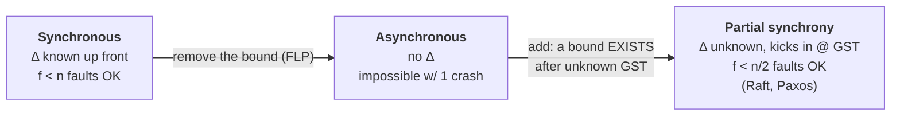
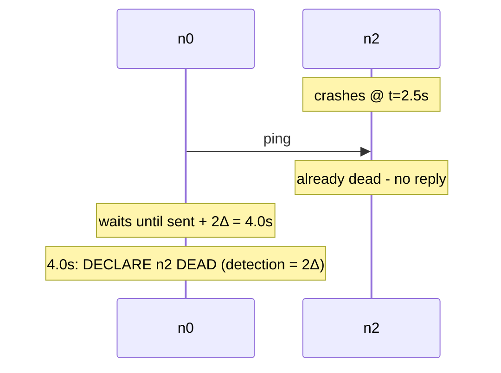
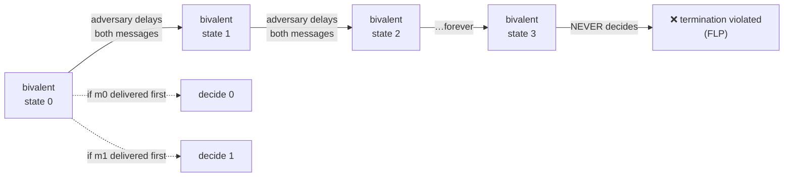
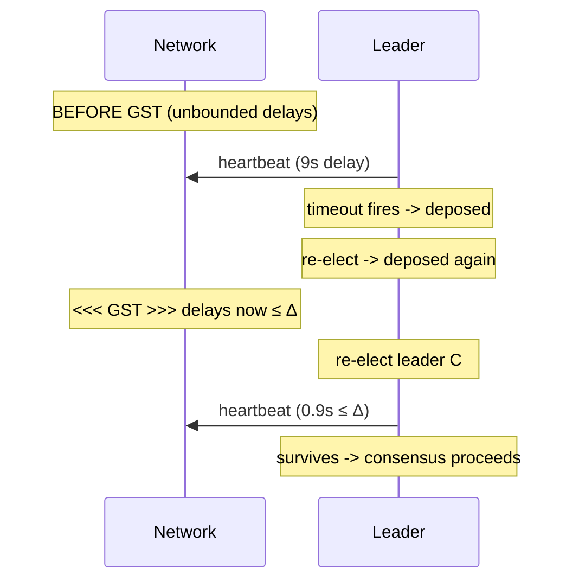
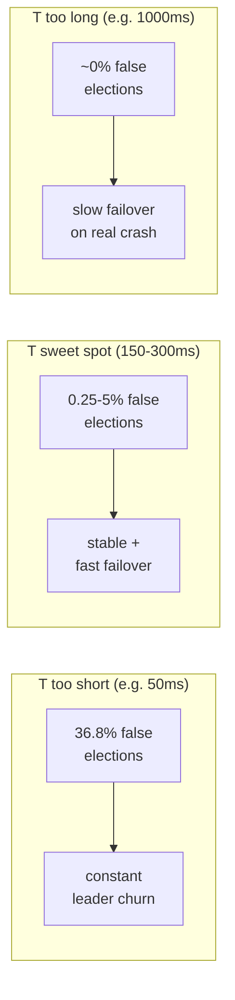
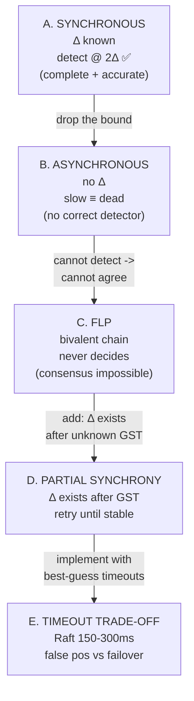

# SYNC_VS_ASYNC — Synchronous vs Asynchronous System Models, FLP & Partial Synchrony

> A "concept bundle." This guide is built entirely from
> [`sync_vs_async.py`](./sync_vs_async.py) — every number below is printed by
> that file. Audit any claim by re-running `python3 sync_vs_async.py`.
> Interactive companion: [`sync_vs_async.html`](./sync_vs_async.html).
>
> **Papers**: FLP (Fischer-Lynch-Paterson 1985, DOI:10.1145/3149.214121) ·
> DLS (Dwork-Lynch-Stockmeyer 1988, DOI:10.1145/42382.42383) ·
> Raft (Ongaro & Ousterhout 2014) · Paxos (Lamport 1998/2001).

---

## 0. The one intuition — the post office and the stopwatch

You and two friends exchange postcards to agree on a meeting place.

| Model | Post-office promise | If a friend's card is late… |
|---|---|---|
| **Synchronous** | "every card arrives within Δ (= 1 day)" | …no card for 2Δ ⇒ they are **dead**. No other explanation is allowed by the bound. |
| **Asynchronous** | "no promises — could be a day, a week, a year" | …you **cannot tell** dead from slow. The two are indistinguishable. |
| **Partial synchrony** | "after some unknown time GST, every card arrives within Δ" | …keep retrying; once GST passes, things settle and you make progress. |

The whole drama of distributed consensus hangs off this one table. FLP says
the async row is hopeless. DLS says the partial-synchrony row is enough — and
that is the row Raft and Paxos actually live in.

---

## 1. Glossary

| Term | Meaning |
|---|---|
| **Δ (Delta)** | Maximum **one-way** message delay. Known in the sync model; unknown (or only eventual) under partial synchrony. |
| **2Δ** | Round-trip bound (ping out + reply back). The sync failure-detection window. |
| **heartbeat** | A periodic "I am alive" message a node sends. |
| **timeout** | How long a node waits before suspecting a peer. Sync: `= 2Δ` (hard). Raft/Paxos: a guess. |
| **crash fault** | A node stops forever. It does **not** lie (that would be a Byzantine fault). |
| **consensus** | N nodes propose values; all non-faulty nodes decide the **same** value. Needs **Agreement + Termination + Validity**. |
| **0-valent / 1-valent** | A configuration doomed to decide 0 (resp. 1) no matter what happens next. |
| **bivalent** | A configuration from which **both** 0 and 1 are still reachable. The poison FLP exploits. |
| **GST** | Global Stabilization Time. After GST, delays ≤ Δ. Before GST, arbitrary delays. |

---

## 2. The three timing models (DLS 1988)



| Model | Δ known? | Consensus with crashes? | Who lives here |
|---|---|---|---|
| Synchronous | Yes, up front | Yes (f < n) | Theoretical; some LAN protocols |
| Asynchronous | No | **Impossible** (FLP, even 1 crash) | — |
| Partial synchrony | Exists, but unknown / after GST | Yes (f < n/2) | **Raft, Paxos, PBFT, every real system** |

---

## 3. Section A — Synchronous model: detection time = 2Δ  ✅ GOLD

Three nodes `n0, n1, n2`. One-way delay bound **Δ = 1.0s**, so a round trip is
bounded by **2Δ = 2.0s**.

**Failure-detection rule (synchronous):** `n0` pings `n2` at time `t`. If `n2`
is alive, its reply arrives by `t + 2Δ`. If **no** reply by `t + 2Δ`, then `n2`
**must** be crashed — the bound forbids "maybe it is slow."

> From `sync_vs_async.py` Section A — `n0` pings `n2` every 1.0s; `n2` crashes at t=2.5s:
>
> ```
> | ping# | sent at | arrives n2 | reply by | outcome                                                |
> | 0     | 0.0      | 1.0        | 2.0      | n2 alive -> reply arrives OK
> | 1     | 1.0      | 2.0        | 3.0      | n2 alive -> reply arrives OK
> | 2     | 2.0      | 3.0        | 4.0      | ping arrives AFTER crash -> NO reply -> DEAD @ t=4.0
> ```
> **Detection happens on ping #2:** sent @ 2.0s, declared DEAD @ 4.0s.
> `detection_time = 4.0 − 2.0 = 2.0s = 2Δ`.
>
> `[check] detection_time == 2*Delta == 2.0s: OK`

**The synchronous superpower:** because the bound is a hard promise, silence is
*proof* of death. Detection is both **complete** (every real crash is detected)
and **accurate** (no false positives). The price: you must actually *have* a Δ,
which real networks do not guarantee.



---

## 4. Section B — Asynchronous model: slow vs crashed is unknowable

Drop the bound. Now `n0` sends `n2` a probe @ t=0 and waits T=5.0s. At t=5.0s it
has received **no reply**. Two worlds fit the observation equally well:

> From `sync_vs_async.py` Section B:
>
> | world | truth | n0 sees @ t=5.0 |
> |---|---|---|
> | RUN 1: SLOW | n2 ALIVE, reply delayed 10s | no reply yet |
> | RUN 2: CRASH | n2 DEAD since t=0 | no reply yet |

The observations are **byte-identical**, so `n0` cannot tell which world it is
in. Whatever timeout T the protocol picks, the adversary picks a delay just
over T and forces a wrong call:

> From `sync_vs_async.py` Section B — the adversary always wins:
>
> | chosen timeout T | adversary reply delay | n0 verdict @ T | correct? |
> |---|---|---|---|
> | 1.0 | 1.001 | dead @ t=1.0 | WRONG (n2 alive) |
> | 2.0 | 2.001 | dead @ t=2.0 | WRONG (n2 alive) |
> | 5.0 | 5.001 | dead @ t=5.0 | WRONG (n2 alive) |
> | 10.0 | 10.001 | dead @ t=10.0 | WRONG (n2 alive) |
> | 100.0 | 100.001 | dead @ t=100.0 | WRONG (n2 alive) |

**Consequence:** there is **no correct failure detector** in the pure
asynchronous model. This is the seed of FLP — if you cannot even *detect*
failures reliably, you certainly cannot agree in their presence.

---

## 5. Section C — FLP: the bivalent chain that never decides

**Consensus (binary):** each process proposes 0 or 1; all non-faulty processes
must decide the **same** value, **eventually**, choosing a value that was
proposed (Agreement + Termination + Validity).

**Configuration valency:**
- **0-valent / 1-valent** — doomed to decide 0 (resp. 1) no matter what.
- **bivalent** — both 0 and 1 are still reachable.

### Lemma 1 — a bivalent initial configuration exists

Compare two starts: (all propose 0) ⇒ Validity forces decision 0; (all propose
1) ⇒ forces decision 1. Walk from one start to the other, changing one proposal
at a time. The forced decision must **flip** somewhere on this walk, so the
crossing configuration is **bivalent**. Hence a bivalent initial state exists.

### Lemma 2 — bivalence can be preserved forever (toy illustration)

Toy protocol: 2 processes `p0, p1`. `p0` proposes 0, `p1` proposes 1. Rule: the
**first** process to **receive** the other's proposal decides that value and
broadcasts `DECIDE(v)`; all then decide `v`.

Two messages are in flight:
- `m0 = (p0 → p1, value 0)`
- `m1 = (p1 → p0, value 1)`

- Deliver `m0` first ⇒ `p1` receives 0 ⇒ decides 0 ⇒ all decide **0**.
- Deliver `m1` first ⇒ `p0` receives 1 ⇒ decides 1 ⇒ all decide **1**.

Both futures are reachable ⇒ the initial state is **bivalent**.

### The adversary's bivalent chain

> From `sync_vs_async.py` Section C — the adversary never delivers a deciding message:
>
> | step | action by adversary | m0 in flight | m1 in flight | 0 reachable | 1 reachable | valency |
> |---|---|---|---|---|---|---|
> | 0 | initial state (both msgs sent) | yes | yes | yes | yes | BIVALENT |
> | 1 | delay BOTH m0 and m1 another ε | yes | yes | yes | yes | BIVALENT |
> | 2 | delay BOTH m0 and m1 another ε | yes | yes | yes | yes | BIVALENT |
> | 3 | delay BOTH m0 and m1 another ε | yes | yes | yes | yes | BIVALENT |
> | 4 | delay BOTH m0 and m1 another ε | yes | yes | yes | yes | BIVALENT |
> | 5 | delay BOTH m0 and m1 another ε | yes | yes | yes | yes | BIVALENT |

At **every** step both messages stay in flight, so both the 0-deciding and
1-deciding futures remain reachable. The protocol can **never** decide ⇒
**Termination is violated**. Repeated indefinitely this is an **infinite
bivalent chain** ⇒ no deterministic async consensus protocol can guarantee
termination with even 1 crash.



> **Note (the full proof).** The real FLP proof handles arbitrarily many
> in-flight events and shows that for any "critical" event `e` whose delivery
> would force a decision, a finite prelude of *other* deliveries leaves the
> post-`e` configuration **still bivalent**. The toy above is the load-bearing
> intuition; the full proof generalizes it to *any* protocol. (🔗 The escape is
> to drop **determinism** — randomized consensus, or drop the **pure async**
> assumption — partial synchrony, Section 6.)

---

## 6. Section D — Partial synchrony: the DLS escape ("eventually synchronous")

DLS (1988) is the practical middle ground: a bound Δ **exists**, and there is a
time **GST** after which delays are ≤ Δ. GST and Δ are **unknown** to the
protocol, but they exist. Consensus is solvable with `f < n/2` crash faults.

> From `sync_vs_async.py` Section D — demo timeline (GST = 6.0s, Δ_after = 1.0s):
>
> | t | event | delay | phase | outcome |
> |---|---|---|---|---|
> | 1.0 | leader A elected | 0.6s | before GST (async-like) | 0.6s < any timeout → A looks fine |
> | 2.0 | A heartbeat | 9.0s | before GST (async-like) | 9s > timeout → A deposed |
> | 3.5 | leader B elected | 4.0s | before GST (async-like) | 4s > timeout → B deposed too |
> | 6.0 | **<<< GST >>>** | — | after GST (sync-like) | network stabilizes here |
> | 6.5 | leader C elected | 0.8s | after GST (sync-like) | 0.8s < Δ → C survives |
> | 7.5 | C heartbeat | 0.9s | after GST (sync-like) | 0.9s < Δ → stable |
> | 8.5 | C heartbeat | 1.0s | after GST (sync-like) | = Δ → still within bound |
>
> `[check] leaders churned before GST = 2 (>1); stable leader after GST = 1: OK`

Before GST, leaders keep getting deposed: their heartbeats exceed the timeout
because delays are unbounded. After GST, delays fall within Δ, so leader C's
heartbeats always arrive in time → C stays leader → consensus proceeds. The
protocol did **not** need to *know* GST; it just kept re-electing until the
network stabilized.



**This is exactly how Raft and Paxos work:** they assume partial synchrony, use
timeouts as a best guess for Δ, and make progress once GST has passed. They are
not "synchronous" protocols — they are *eventually* synchronous, which is all
real networks ever offer. (🔗 Raft's randomized 150-300ms election timeout —
Section 7.)

---

## 7. Section E — Timeout trade-off: false positives vs failover latency

Raft randomizes the election timeout across **150-300ms** per node (to dodge
split votes). Paxos uses a similar timeout. The choice is a trade-off.

Model a heartbeat's network delay as **exponential** with mean μ = 50ms (the
standard queueing-delay model): `P(delay > T) = exp(−T/μ)`. A follower starts an
election if its election timeout elapses with no heartbeat, so
`P(false election) = P(delay > T)`. Failover latency on a **real** crash ≈ T.

> From `sync_vs_async.py` Section E — the trade-off table:
>
> | T_elect | P(false election) = e^(−T/μ) | failover (real crash) | verdict |
> |---|---|---|---|
> | 50ms | 36.7879% | 50 ms | too short → many false elections |
> | 100ms | 13.5335% | 100 ms | too short → many false elections |
> | 150ms | 4.9787% | 150 ms | **Raft sweet spot 150-300ms** |
> | 300ms | 0.2479% | 300 ms | **Raft sweet spot 150-300ms** |
> | 500ms | 0.0045% | 500 ms | too long → slow failover |
> | 1000ms | 0.0000% | 1000 ms | too long → slow failover |
>
> `[check] P(false) decreases monotonically with T: True; failover increases monotonically: True: OK`

**Reading the table:**
- **T=50ms** — 36.79% of terms are *false* elections: constant leader churn, the cluster never settles.
- **T=150ms** — 4.98% false elections: tolerable; failover ~150ms: snappy. Raft's lower bound.
- **T=300ms** — 0.25% false elections: very stable; failover ~300ms. Raft's upper bound.
- **T=1000ms** — ~0% false elections, but a real crash takes ~1s to heal: users notice the outage.

The window 150-300ms is the partial-synchrony compromise: **low enough for quick
failover, high enough to ride out normal network jitter.** Pick too low and you
spend all your time in false elections (effectively still "before GST"); pick too
high and a real leader crash means a long visible outage.



---

## 8. The big picture — how the four sections connect



| Section | Claim | Status |
|---|---|---|
| A | Sync detection latency = 2Δ | ✅ gold (detection_time == 2.0) |
| B | Async: no finite timeout survives the adversary | ✅ check OK |
| C | Async + 1 crash ⇒ consensus impossible (FLP) | ✅ check OK |
| D | Partial synchrony ⇒ solvable; stable leader after GST | ✅ check OK |
| E | P(false) ↓ in T; failover ↑ in T (Raft picks 150-300ms) | ✅ check OK |

---

## 9. Further reading

- **FLP** — Fischer, Lynch, Paterson. *Impossibility of Distributed Consensus
  with One Faulty Process.* JACM 32(2):374-382, 1985. DOI:10.1145/3149.214121.
- **DLS** — Dwork, Lynch, Stockmeyer. *Consensus as Existence of Stable Leader.*
  JACM 35(2):288-323, 1988. DOI:10.1145/42382.42383.
- **Raft** — Ongaro & Ousterhout. *In Search of an Understandable Consensus
  Algorithm.* USENIX ATC 2014.
- **Paxos** — Lamport. *The Part-Time Parliament* (1998) / *Paxos Made Simple*
  (2001).
- **Books** — Kleppmann, *Designing Data-Intensity Applications*, Ch. 8-9;
  Tanenbaum & Van Steen, *Distributed Systems*, Ch. 7.

> 🔗 Companion: [`sync_vs_async.html`](./sync_vs_async.html) (recomputes every
> number in JS, gold-checked against this `.py`).
